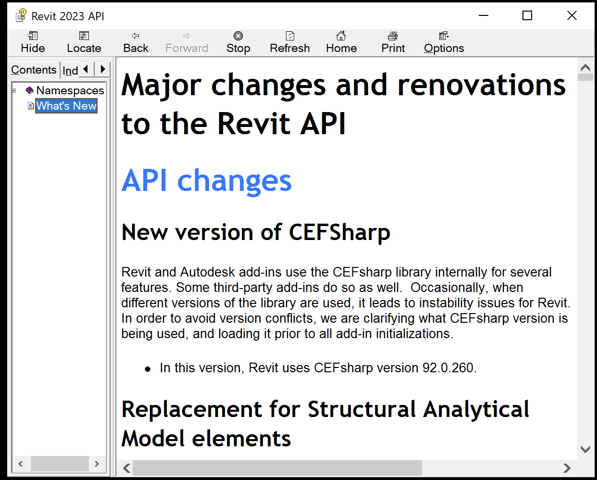

<head>
<meta http-equiv="Content-Type" content="text/html; charset=utf-8">
<link rel="stylesheet" type="text/css" href="bc.css">

</head>

<!---

twitter:

What's New in the Revit 2023 API? Exciting new functionality, migration information, overview of changes and additions, table of contents, full details of all new aspects of the #RevitAPI @AutodeskForge @AutodeskRevit #bim #DynamoBim #ForgeDevCon https://autode.sk/rvt2023apinews

The Revit 2023 API contains many exciting enhancements for add-in developers
&ndash; Information sources
&ndash; What's new in previous versions
&ndash; Detailed table of contents
&ndash; API Changes
&ndash; API Additions...

linkedin:

What's New in the Revit 2023 API? Exciting new functionality, migration information, overview of changes and additions, table of contents, full details of all new aspects of the #RevitAPI

https://autode.sk/rvt2023apinews

The Revit 2023 API contains many exciting enhancements for add-in developers:

- Information sources
- What's new in previous versions
- Detailed table of contents
- API Changes
- API Additions...

#bim #DynamoBim #ForgeDevCon #Revit #API #IFC #SDK #AI #VisualStudio #Autodesk #AEC #adsk

the [Revit API discussion forum](http://forums.autodesk.com/t5/revit-api-forum/bd-p/160) thread

-->

### What's New in the Revit 2023 API

The Revit 2023 API contains many exciting enhancements for add-in developers:

- [Information sources](#1)
- [What's new in previous versions](#2)
- [Detailed table of contents](#4)

 Top level table of contents:

<ul class="toc">
<li>1. <a href="#4.1">API changes </a></li>
<ul class="toc">
<li>1.1. <a href="#4.1.1">New version of CEFSharp </a></li>
<li>1.2. <a href="#4.1.2">Replacement for Structural Analytical Model elements </a></li>
<li>1.3. <a href="#4.1.3">Geometry API changes </a></li>
<li>1.4. <a href="#4.1.4">Custom Export API changes </a></li>
<li>1.5. <a href="#4.1.5">Export API changes </a></li>
<li>1.6. <a href="#4.1.6">Energy Analysis API changes </a></li>
<li>1.7. <a href="#4.1.7">Reinforcement API changes </a></li>
<li>1.8. <a href="#4.1.8">Project Browser API removal </a></li>
<li>1.9. <a href="#4.1.9">Obsolete API removal </a></li>
</ul>
<li>2. <a href="#4.2">API additions </a></li>
<ul class="toc">
<li>2.1. <a href="#4.2.1">Schedule API additions </a></li>
<li>2.2. <a href="#4.2.2">Worksharing API additions </a></li>
<li>2.3. <a href="#4.2.3">Geometry API additions </a></li>
<li>2.4. <a href="#4.2.4">DirectShape API additions </a></li>
<li>2.5. <a href="#4.2.5">Import/Export API additions </a></li>
<li>2.6. <a href="#4.2.6">View API additions </a></li>
<li>2.7. <a href="#4.2.7">Electrical API additions </a></li>
<li>2.8. <a href="#4.2.8">Mechanical API additions </a></li>
<li>2.9. <a href="#4.2.9">ElementId API additions </a></li>
<li>2.10. <a href="#4.2.10">Element API additions </a></li>
<li>2.11. <a href="#4.2.11">Document API additions </a></li>
<li>2.12. <a href="#4.2.12">Annotation API additions </a></li>
<li>2.13. <a href="#4.2.13">Energy Analysis API additions </a></li>
<li>2.14. <a href="#4.2.14">Slab API additions </a></li>
<li>2.15. <a href="#4.2.15">Applications API additions </a></li>
<li>2.16. <a href="#4.2.16">Sketched Elements API additions </a></li>
<li>2.17. <a href="#4.2.17">Project Browser API additions </a></li>
<li>2.18. <a href="#4.2.18">Structure API additions </a></li>
<li>2.19. <a href="#4.2.19">Selection API additions </a></li>
<li>2.20. <a href="#4.2.20">MEP API additions </a></li>
<li>2.21. <a href="#4.2.21">Parameter API additions </a></li>
<li>2.22. <a href="#4.2.22">Print API additions </a></li>
</ul>
</ul>

####Information Sources

The information below is based on the contents of the *Revit Platform API Changes and Additions.docx* document included with
the Revit 2023 SDK, the software developers kit available from
the [Revit Developer Centre](https://www.autodesk.com/developer-network/platform-technologies/revit).

It is also provided in the section on *What's New* in the Revit 2023 API help file `RevitAPI.chm` included with the SDK:

 <!-- 1242 -->

For convenient, easy, and effective web searching, this blog post provides a cleaned-up online HTML version of that information with numbering and table of contents added, as well as the following PDF printout of the original document included in the SDK with table of contents and page numbers added:

- [Revit_Platform_API_Changes_and_Additions_2023.pdf](zip/Revit_Platform_API_Changes_and_Additions_2023_08.pdf)

The *What's New* section and the *Changes and Additions* document provide important information, both for discovering and exploring the newly added API functionality and for later reference.

If you encounter any issues migrating your existing add-ins between different versions, this is one of the first places to look.

For detailed information on all other aspects of the Revit API, please refer to the rest of the API documentation and samples provided in the SDK.

The most important things to install and always keep at hand are:

- The Revit API help file `RevitAPI.chm`
- The Visual Studio solution containing all the SDK samples, `Samples\SDKSamples.sln`

You will regularly need both for research on how to solve specific Revit API programming tasks.

More in-depth official explanations and background information is provided by the
online [Revit API Developers Guide](http://help.autodesk.com/view/RVT/2023/ENU/?guid=Revit_API_Revit_API_Developers_Guide_html) included
in the [Revit 2023 online help](http://help.autodesk.com/view/RVT/2023/ENU).

####What's New in Previous Versions

Here are links to previous discussions of *What's New in the Revit API*:

- [What's New in the Revit 2010 API](http://thebuildingcoder.typepad.com/blog/2013/02/whats-new-in-the-revit-2010-api.html)
- [What's New in the Revit 2011 API](http://thebuildingcoder.typepad.com/blog/2013/02/whats-new-in-the-revit-2011-api.html)
- [What's New in the Revit 2012 API](http://thebuildingcoder.typepad.com/blog/2013/02/whats-new-in-the-revit-2012-api.html)
- [What's New in the Revit 2013 API](http://thebuildingcoder.typepad.com/blog/2013/03/whats-new-in-the-revit-2013-api.html)
- [What's New in the Revit 2014 API](http://thebuildingcoder.typepad.com/blog/2013/04/whats-new-in-the-revit-2014-api.html)
- [What's New in the Revit 2015 API](http://thebuildingcoder.typepad.com/blog/2014/04/whats-new-in-the-revit-2015-api.html)
- [What's New in the Revit 2016 API](http://thebuildingcoder.typepad.com/blog/2015/04/whats-new-in-the-revit-2016-api.html)
- [What's New in the Revit 2017 API](http://thebuildingcoder.typepad.com/blog/2016/04/whats-new-in-the-revit-2017-api.html)
- [What's New in the Revit 2017.1 API](http://thebuildingcoder.typepad.com/blog/2016/11/whats-new-in-the-revit-20171-api.html)
- [What's New in the Revit 2018 API](http://thebuildingcoder.typepad.com/blog/2017/04/whats-new-in-the-revit-2018-api.html)
- [Revit 2018.1 and the Visual Materials API](http://thebuildingcoder.typepad.com/blog/2017/08/revit-20181-and-the-visual-materials-api.html)
- [Revit 2018.1.1 and 2018.1 API Docs Online](http://thebuildingcoder.typepad.com/blog/2017/09/revit-201811-fixes-cropbox-setting.html)
- [Revit 2018.1 Visual Materials API](http://thebuildingcoder.typepad.com/blog/2017/11/modifying-material-visual-appearance.html)
- [What's New in the Revit 2018.2 API](http://thebuildingcoder.typepad.com/blog/2017/12/whats-new-in-the-revit-20182-api.html)
- [What's New in the Revit 2019 API](http://thebuildingcoder.typepad.com/blog/2018/04/whats-new-in-the-revit-2019-api.html)
- [What's New in the Revit 2020 API](https://thebuildingcoder.typepad.com/blog/2019/04/whats-new-in-the-revit-2020-api.html)
- [What's New in the Revit 2020.1 API](https://thebuildingcoder.typepad.com/blog/2019/09/whats-new-in-the-revit-20201-api.html)
- [What's New in the Revit 2021 API](https://thebuildingcoder.typepad.com/blog/2020/04/whats-new-in-the-revit-2021-api.html)
- [What's New in the Revit 2021.1 API](https://thebuildingcoder.typepad.com/blog/2020/08/revit-20211-sdk-and-whats-new.html)
- [What's New in the Revit 2022 API](https://thebuildingcoder.typepad.com/blog/2021/04/whats-new-in-the-revit-2022-api.html)
- [What's New in the Revit 2022.1 API](https://thebuildingcoder.typepad.com/blog/2021/11/whats-new-in-the-revit-20221-api.html)

####Detailed Table of Contents

<!-- <h1>Major changes and renovations to the Revit API -->

<ul class="toc">
<li>1. <a href="#4.1">API changes </a></li>
<ul class="toc">
<li>1.1. <a href="#4.1.1">New version of CEFSharp </a></li>
<li>1.2. <a href="#4.1.2">Replacement for Structural Analytical Model elements </a></li>
<ul class="toc">
<li>1.2.1. <a href="#4.1.2.1">Analytical Model classes</a></li>
<li>1.2.2. <a href="#4.1.2.2">Analytical Models classes additions </a></li>
<li>1.2.3. <a href="#4.1.2.3">Analytical Model enums</a></li>
<li>1.2.4. <a href="#4.1.2.4">Element</a></li>
<li>1.2.5. <a href="#4.1.2.5">StructuralSettings </a></li>
<li>1.2.6. <a href="#4.1.2.6">Line Load, Area Load, Point Load</a></li>
<li>1.2.7. <a href="#4.1.2.7">Load Base</a></li>
<li>1.2.8. <a href="#4.1.2.8">Boundary Conditions</a></li>
</ul>
<li>1.3. <a href="#4.1.3">Geometry API changes </a></li>
<ul class="toc">
<li>1.3.1. <a href="#4.1.3.1">Bounding Box </a></li>
<li>1.3.2. <a href="#4.1.3.2">Geometry Instance </a></li>
</ul>
<li>1.4. <a href="#4.1.4">Custom Export API changes </a></li>
<li>1.5. <a href="#4.1.5">Export API changes </a></li>
<li>1.6. <a href="#4.1.6">Energy Analysis API changes </a></li>
<li>1.7. <a href="#4.1.7">Reinforcement API changes </a></li>
<ul class="toc">
<li>1.7.1. <a href="#4.1.7.1">Reinforcement Elements </a></li>
</ul>
<li>1.8. <a href="#4.1.8">Project Browser API removal </a></li>
<li>1.9. <a href="#4.1.9">Obsolete API removal </a></li>
<ul class="toc">
<li>1.9.1. <a href="#4.1.9.1">Classes </a></li>
<li>1.9.2. <a href="#4.1.9.2">Methods </a></li>
<li>1.9.3. <a href="#4.1.9.3">Properties </a></li>
<li>1.9.4. <a href="#4.1.9.4">Enums </a></li>
</ul>
</ul>
<li>2. <a href="#4.2">API additions </a></li>
<ul class="toc">
<li>2.1. <a href="#4.2.1">Schedule API additions </a></li>
<ul class="toc">
<li>2.1.1. <a href="#4.2.1.1">Schedule heights on sheets </a></li>
<li>2.1.2. <a href="#4.2.1.2">Managing schedule segments </a></li>
<li>2.1.3. <a href="#4.2.1.3">ScheduleDefinition </a></li>
</ul>
<li>2.2. <a href="#4.2.2">Worksharing API additions </a></li>
<ul class="toc">
<li>2.2.1. <a href="#4.2.2.1">Delete Workset API </a></li>
</ul>
<li>2.3. <a href="#4.2.3">Geometry API additions </a></li>
<ul class="toc">
<li>2.3.1. <a href="#4.2.3.1">Bounding Box API </a></li>
<li>2.3.2. <a href="#4.2.3.2">Geometry managed by symbol element </a></li>
</ul>
<li>2.4. <a href="#4.2.4">DirectShape API additions </a></li>
<ul class="toc">
<li>2.4.1. <a href="#4.2.4.1">Type assignability </a></li>
</ul>
<li>2.5. <a href="#4.2.5">Import/Export API additions </a></li>
<ul class="toc">
<li>2.5.1. <a href="#4.2.5.1">AXM Import </a></li>
<li>2.5.2. <a href="#4.2.5.2">OBJ Export </a></li>
<li>2.5.3. <a href="#4.2.5.3">STL and OBJ Import & Link </a></li>
<li>2.5.4. <a href="#4.2.5.4">ShapeImporter API additions </a></li>
</ul>
<li>2.6. <a href="#4.2.6">View API additions </a></li>
<ul class="toc">
<li>2.6.1. <a href="#4.2.6.1">Duplicating Sheets </a></li>
<li>2.6.2. <a href="#4.2.6.2">Transforming from Model Space to View Projection Space </a></li>
<li>2.6.3. <a href="#4.2.6.3">Transforming from View Projection Space to Sheet Space </a></li>
<li>2.6.4. <a href="#4.2.6.4">View Placement on Sheet </a></li>
<li>2.6.5. <a href="#4.2.6.5">Swapping viewports on sheets to another view </a></li>
</ul>
<li>2.7. <a href="#4.2.7">Electrical API additions </a></li>
<ul class="toc">
<li>2.7.1. <a href="#4.2.7.1">Load classification API </a></li>
<li>2.7.2. <a href="#4.2.7.2">Panel schedule API </a></li>
<li>2.7.3. <a href="#4.2.7.3">Electrical analytical node API </a></li>
<li>2.7.4. <a href="#4.2.7.4">Bus data API </a></li>
<li>2.7.5. <a href="#4.2.7.5">Distribution node property data API </a></li>
<li>2.7.6. <a href="#4.2.7.6">Equipment load data API </a></li>
<li>2.7.7. <a href="#4.2.7.7">Area based load type API </a></li>
<li>2.7.8. <a href="#4.2.7.8">Area based load data API </a></li>
<li>2.7.9. <a href="#4.2.7.9">Electrical load area data API </a></li>
<li>2.7.10. <a href="#4.2.7.10">Area based load boundary line data API </a></li>
<li>2.7.11. <a href="#4.2.7.11">Analytical transfer switch data API </a></li>
<li>2.7.12. <a href="#4.2.7.12">Analytical Power Source API </a></li>
</ul>
<li>2.8. <a href="#4.2.8">Mechanical API additions </a></li>
<li>2.9. <a href="#4.2.9">ElementId API additions </a></li>
<ul class="toc">
<li>2.9.1. <a href="#4.2.9.1">Converting strings to ElementId </a></li>
</ul>
<li>2.10. <a href="#4.2.10">Element API additions </a></li>
<ul class="toc">
<li>2.10.1. <a href="#4.2.10.1">IsModifiable property </a></li>
<li>2.10.2. <a href="#4.2.10.2">Elements with multiple ExternalResourceReferences </a></li>
<li>2.10.3. <a href="#4.2.10.3">Category </a></li>
</ul>
<li>2.11. <a href="#4.2.11">Document API additions </a></li>
<ul class="toc">
<li>2.11.1. <a href="#4.2.11.1">Elements changed since a previous version </a></li>
</ul>
<li>2.12. <a href="#4.2.12">Annotation API additions </a></li>
<ul class="toc">
<li>2.12.1. <a href="#4.2.12.1">Tag Leader API </a></li>
</ul>
<li>2.13. <a href="#4.2.13">Energy Analysis API additions </a></li>
<li>2.14. <a href="#4.2.14">Slab API additions </a></li>
<li>2.15. <a href="#4.2.15">Applications API additions </a></li>
<ul class="toc">
<li>2.15.1. <a href="#4.2.15.1">Application.ShowGraphicalOpenEndsAreaBasedLoadBoundaryDisconnects </a></li>
</ul>
<li>2.16. <a href="#4.2.16">Sketched Elements API additions </a></li>
<ul class="toc">
<li>2.16.1. <a href="#4.2.16.1">Editing Sketches with SketchEditScope </a></li>
<li>2.16.2. <a href="#4.2.16.2">Dimension creation in Sketch Edit mode </a></li>
<li>2.16.3. <a href="#4.2.16.3">Filled Region for sketch plane </a></li>
<li>2.16.4. <a href="#4.2.16.4">Boundary Validation for sketched elements </a></li>
</ul>
<li>2.17. <a href="#4.2.17">Project Browser API additions </a></li>
<ul class="toc">
<li>2.17.1. <a href="#4.2.17.1">BrowserOrganization </a></li>
<li>2.17.2. <a href="#4.2.17.2">ProjectBrowserOptions </a></li>
</ul>
<li>2.18. <a href="#4.2.18">Structure API additions </a></li>
<ul class="toc">
<li>2.18.1. <a href="#4.2.18.1">Line Load </a></li>
<li>2.18.2. <a href="#4.2.18.2">Area Load </a></li>
<li>2.18.3. <a href="#4.2.18.3">Point Load </a></li>
<li>2.18.4. <a href="#4.2.18.4">RebarPropagation </a></li>
<li>2.18.5. <a href="#4.2.18.5">RebarHostData </a></li>
<li>2.18.6. <a href="#4.2.18.6">RebarCoupler </a></li>
</ul>
<li>2.19. <a href="#4.2.19">Selection API additions </a></li>
<ul class="toc">
<li>2.19.1. <a href="#4.2.19.1">Selection </a></li>
<li>2.19.2. <a href="#4.2.19.2">UIApplication </a></li>
<li>2.19.3. <a href="#4.2.19.3">Events </a></li>
</ul>
<li>2.20. <a href="#4.2.20">MEP API additions </a></li>
<ul class="toc">
<li>2.20.1. <a href="#4.2.20.1">ConnectorElement </a></li>
<li>2.20.2. <a href="#4.2.20.2">SpatialElement </a></li>
<li>2.20.3. <a href="#4.2.20.3">Flipping fabrication parts </a></li>
</ul>
<li>2.21. <a href="#4.2.21">Parameter API additions </a></li>
<ul class="toc">
<li>2.21.1. <a href="#4.2.21.1">ParameterUtils </a></li>
</ul>
<li>2.22. <a href="#4.2.22">Print API additions </a></li>
<ul class="toc">
<li>2.22.1. <a href="#4.2.22.1">IViewSheetSet </a></li>
</ul>
</ul>
</ul>

<h1 class="new" style="font-weight: bold">API Changes</h1>

<h2 class="new">1.1. New version of CEFSharp</h2>

Revit and Autodesk add-ins use the CEFsharp library internally for several features. Some third-party add-ins do so as well. Occasionally, when different versions of the library are used, it leads to instability issues for Revit. In order to avoid version conflicts, we are clarifying what CEFsharp version is being used, and loading it prior to all add-in initializations. 

- In this version, Revit uses CEFsharp version 92.0.260.

<h2 class="new">1.2. Replacement for Structural Analytical Model elements</h2>

The elements used for the Structural Analytical Model have been completely replaced and the interactions overhauled in this version of Revit. Because of these changes, many pre-existing API classes and methods have been removed immediately in this release as deprecation was not possible. The classes that are impacted are all in the Autodesk.Revit.DB.Structure namespace. 

<h3 class="new">1.2.1. Analytical Model classes</h3>

- Removed API &rarr; Replacement 
- AnalyticalModel &rarr; AnalyticalElement
- AnalyticalModelStick &rarr; AnalyticalMember
- AnalyticalModelColumn &rarr; AnalyticalMember
- AnalyticalModelSupport &rarr; None
- AnalyticalConsistencyChecking &rarr; None
- AnalyticalModelSketchComponent &rarr; None
- AnalyticalModelSurface &rarr; AnalyticalPanel

<h3 class="new">1.2.2. Analytical Models classes additions</h3>

This new API is part of a broader Analytical Driven Modeling initiative for Revit that introduces a new approach to analytical modelling, enhancing its overall structural modelling capabilities. See the RevitAPI.chm for a full listing of new functions. 

New classes include:

- Autodesk.Revit.DB.Structure.AnalyticalElement &ndash; Represents the analytical portion of a given structural element.
- Autodesk.Revit.DB.Structure.AnalyticalMember &ndash; Represents a linear element in the structural analytical model. 
- Autodesk.Revit.DB.Structure.AnalyticalPanel &ndash; Represents a surface in the structural analytical model.
- Autodesk.Revit.DB.Structure.AnalyticalToPhysicalAssociationManager &ndash; Manages the relationship between an analytical element and its physical (model) counterpart. 
- Autodesk.Revit.DB.Structure.LevelAssociationData &ndash; Holds the information related to level association.
- Autodesk.Revit.DB.Structure.AnalyticalOpening &ndash; Represents an opening in an analytical panel element. 
- Autodesk.Revit.DB.Structure.ReleaseConditions &ndash; Represents a release condition on an analytical element.
- Autodesk.Revit.DB.Structure.AnalyticalNodeData &ndash; Holds information related to the analytical model.

<h3 class="new">1.2.3. Analytical Model enums</h3>

- Removed API 
- AnalyticalCurveType
- AnalyticalDirection
- AnalyticalProjectionType

<h3 class="new">1.2.4. Element</h3>

- Removed API &rarr; Replacement 
- Element.GetAnalyticalModel &rarr; AnalyticalToPhysicalRelationManager.GetCounterpartsIds
- Element.GetAnalyticalModelId &rarr; AnalyticalToPhysicalRelationManager.GetCounterpartsIds

<h3 class="new">1.2.5. StructuralSettings</h3>

The following properties have been removed:

- Removed API 
- AnalyticalModelAutoCheckMemberSupports
- AnalyticalModelAutoCheckConsistency
- AnalyticalModelCheckSupportDistance
- AnalyticalModelCheckBeamSlabDistance
- AnalyticalModelCheckInstability
- DifferentiateAnalyticalEnds
- AnalyticalModelCheckAdjustment
- CheckAnalyticalModelAsset
- AnalyticalModelSupportDistanceTolerance
- AnalyticalModelDiscrepancyTolerance 
- AnalyticalModelHorizontalAutofixTolerance
- AnalyticalModelVerticalAutofixTolerance
- AnalyticalModelCheckCircularReferences
- AnalyticalModelCheckDiscrepancy
- AnalyticalLinkAutofixTolerance

<h3 class="new">1.2.6. Line Load, Area Load, Point Load </h3>

- Removed API &rarr; Replacement 
- Autodesk.Revit.DB.Structure.LineLoad.Create(Document doc, AnalyticalModelStick host, XYZ forceVector1, XYZ momentVector1, LineLoadType symbol) &rarr; Autodesk.Revit.DB.Structure.LineLoad.Create(Document doc, hostElemId, XYZ forceVector1, XYZ momentVector1, LineLoadType symbol)
- Autodesk.Revit.DB.Structure.LineLoad.Create(Document doc, AnalyticalModelSurface host, int curveIndex, XYZ forceVector1, XYZ momentVector1, LineLoadType symbol) &rarr; Autodesk.Revit.DB.Structure.LineLoad.Create(Document doc, hostElemId, int curveIndex, XYZ forceVector1, XYZ momentVector1, LineLoadType symbol)
- Autodesk.Revit.DB.Structure.AreaLoad.Create(Document doc, AnalyticalModelSurface host, XYZ forceVector1, AreaLoadType symbol) &rarr; Autodesk.Revit.DB.Structure.AreaLoad.Create(Document doc, hostElemId, XYZ forceVector1, AreaLoadType symbol)
- Autodesk.Revit.DB.Structure.PointLoad.Create(Document doc, AnalyticalModelStick host, AnalyticalElementSelector selector, XYZ forceVector, XYZ momentVector, PointLoadType symbol) &rarr; Autodesk.Revit.DB.Structure.PointLoad.Create(Document doc, hostId, AnalyticalElementSelector selector, XYZ forceVector, XYZ momentVector, PointLoadType symbol)
- Autodesk.Revit.DB.Structure.PointLoad.Create(Document doc, AnalyticalModel host, XYZ forceVector, XYZ momentVector, PointLoadType symbol) &rarr; None

<h3 class="new">1.2.7. Load Base </h3>

- Removed API &rarr; Replacement 
- Autodesk.Revit.DB.Structure.LoadBase.HostElement &rarr; HostElementId

<h3 class="new">1.2.8. Boundary Conditions </h3>

- Removed API &rarr; Replacement 
- Autodesk.Revit.DB.Structure.BoundaryConditions.HostElement &rarr; HostElementId

<h2 class="new">1.3. Geometry API changes</h2>

<h3 class="new">1.3.1. Bounding Box</h3>

The class BoundingBoxXYZ:

description was updated to mention that the bounding box might not be empty even if the element's Geometry property returns an empty result, because GetBoundingBox does not take the Geometry property's Options into account.

<h3 class="new">1.3.2. Geometry Instance</h3>

The property Element Symbol of the GeometryInstance was deprecated.

The replacement is GeometryInstance.GetDocument().GetElement(GeometryInstance.GetSymbolGeometryId().SymbolId)

<h2 class="new">1.4. Custom Export API changes</h2>

Deprecated Methods:

GroupNode is the base class for InstanceNode and LinkNode

- Deprecated API &rarr; Replacement
- GroupNode.GetSymbolId() &rarr;
 The replacement for LinkNode is the property LinkNode.SymbolId;
 The replacement for InstanceNode is InstanceNode.GetSymbolGeometryId()

<h2 class="new">1.5. Export API changes</h2>

The Enum STLExportResolution has been deprecated and replaced:

- Deprecated API &rarr; Replacement
- STLExportResolution enum &rarr; ExportResolution enum
- STLExportOptions(STLExportResolution) &rarr; STLExportOptions(ExportResolution)
- STLExportOptions.SetTessellationSettings(STLExportResolution) &rarr; STLExportOptions.SetTessellationSettings(ExportResolution)

<h2 class="new">1.6. Energy Analysis API changes</h2>

The property:

- Autodesk.Revit.DB.Analysis.EnergyAnalysisSpace.Area

is modified to cover all scenarios. Previously, it was only for the spaces created with the mode 'Use Rooms or Spaces', and represented the enclosed area measured by interior bounding surfaces. The additional cases include the spaces created with mode 'Use Building Elements' and 'Use Conceptual Masses and Building Elements', where the area is measured by the center plane of walls and the top plane of roofs and floors.

- Deprecated API &rarr; Replacement
- EnergyAnalysisSpace.InnerVolume &rarr; EnergyAnalysisSpace.Volume
- EnergyAnalysisSpace.AnalyticalVolume &rarr; EnergyAnalysisSpace.Volume

Conceptual Masses 

A number of classes and methods related to using Conceptual Masses in Energy Analysis have been deprecated. These are replaced by classes and methods in detailed energy analysis.

- Deprecated API &rarr; Replacement
- DB.Analysis.AnalysisMode.ConceptualMasses &rarr; ConceptualMassesAndBuildingElements
- DB.Analysis.EnergyDataSettings.setCreateAnalyticalModel() &rarr; Use EnergyModel property instead.
- DB.Analysis.EnergyDataSettings.enableConceptualEnergyAnalyticalModel() &rarr; Use EnergyModel property instead.
- DB.Analysis.MassGBXMLExportOptions &rarr; GBXMLExportOptions
- DB.Analysis.MassEnergyAnalyticalMode &rarr; EnergyAnalyticalDetailModel
- DB.Analysis.MassZone &rarr; EnergyAnalyticalDetailModel and EnergyAnalysisSpace
- DB.Analysis.MassLevelData &rarr; EnergyAnalyticalDetailModel EnergyAnalysisSpace
- DB.Analysis.MassSurfaceData &rarr; EnergyAnalyticalDetailModel and EnergyAnalysisSurface

<h2 class="new">1.7. Reinforcement API changes</h2>

<h3 class="new">1.7.1. Reinforcement Elements</h3>

The following methods were deprecated due to the fact that the Reinforcement elements representation as solid in a 3D view will be done automatically on Fine detail level. There are no replacements for these capabilities because the geometry is handled automatically.

- Deprecated API
- Rebar.IsSolidInView()
- Rebar.SetSolidInView()
- AreaReinforcement.IsSolidInView()
- AreaReinforcement.SetSolidInView()
- PathReinforcement.IsSolidInView()
- PathReinforcement.SetSolidInView()
- RebarInSystem.IsSolidInView()
- RebarInSystem.SetSolidInView()
- FabricSheet.IsSolidInView()
- FabricSheet.SetSolidInView()
- RebarContainer.IsSolidInView()
- RebarContainer.SetSolidInView()

<h2 class="new">1.8. Project Browser API removal</h2>

The enum value Autodesk.Revit.DB.BrowserOrganizationType.Families of BrowserOrganizationType will no longer be exposed to the public API, as there was no user-facing way to use the value.

<h2 class="new">1.9. Obsolete API removal</h2>

The following API members and classes which had previously been marked Deprecated have been removed in this release. Consult the API documentation from prior releases for information on the replacements to use:

<h3 class="new">1.9.1. Classes</h3>

- Autodesk.Revit.UI.SetupEnergySimulationDialog

<h3 class="new">1.9.2. Methods</h3>

- AnalyticalToPhysicalRelationManager.UpdateRelation()
- AnalyticalToPhysicalRelationManager.GetNeighborIds()
- Autodesk.Revit.Creation.Document.NewFloor() 
- Autodesk.Revit.Creation.Document.NewSlab()
- Autodesk.Revit.Creation.Document.NewFoundationSlab()
- Definition.GetSpecTypeId()
- ExternalDefinitionCreationOptions(string, ParameterType)
- FamilyManager.AddParameter(string, BuiltInParameterGroup, ParameterType, bool)
- FabricationNetworkChangeService.SetGroupId()
- FabricationNetworkChangeService.SetRestrictGroup()
- FabricationService.IsValidGroupIndex()
- FabricationService.GetGroupName()
- FabricationService.IsGroupExcluded()
- FabricationService.SetServiceGroupExclusions()
- GlobalParameter.Create(Document, string, ParameterType)
- GlobalParameter.IsValidDataType(ParameterType)
- IndependentTag.GetTaggedLocalElement()
- IndependentTag.GetTaggedReference()
- LabelUtils.GetLabelFor()
- RevisionSettings.GetNumericRevisionSettings()
- RevisionSettings.SetNumericRevisionSettings()
- RevisionSettings.GetAlphanumericRevisionSettings()
- RevisionSettings.SetAlphanumericRevisionSettings()
- TemperatureRatingType.AddCorrectionFactor()
- UnitUtils.GetAllSpecs()
- UnitUtils.GetUnitGroup()
- UnitUtils.IsSpec()

<h3 class="new">1.9.3. Properties</h3>

- BarTypeDiameterOptions.BarDiameter
- CorrectionFactor.Temperature
- Definition.ParameterType
- ExternalDefinition.ParameterType
- ExternalDefinitionCreationOptions.Type
- FabricationService.GroupCount
- FabricationServiceButton.GroupIndex
- FabricationPartSizeMap.GroupId
- FabricationConfigurationInfo.CloudVersion
- FabricationConfigurationInfo.IsConnected
- IndependentTag.TaggedLocalElementId
- IndependentTag.TaggedElementId
- IndependentTag.HasElbow
- IndependentTag.LeaderElbow
- IndependentTag.LeaderEnd
- InternalDefinition.ParameterType
- RebarBarType.BarDiameter
- RebarBendData.BarDiameter
- RebarUpdateCurvesData.GetBarDiameter
- RevisionSettings.NumberType

<h3 class="new">1.9.4. Enums</h3>

- ParameterType
- UnitGroup

<h1 class="new" style="font-weight: bold">API Additions</h1>

<h2 class="new">2.1 Schedule API additions</h2> 

<h3 class="new">2.1.1. Schedule heights on sheets</h3>

The new class:

- Autodesk.Revit.DB.ScheduleHeightsOnSheet

returns the heights of schedule title, column header and each body row on sheet view.

The new method:

- ViewSchedule.GetScheduleHeightsOnSheet()

will return the heights object.

<h3 class="new">2.1.2. Managing schedule segments</h3>

The new methods:

- ViewSchedule.IsSplit() 
- ViewSchedule.Split(int segmentNumber) 
- ViewSchedule.Split(IList<double> segmentHeights) 
- ViewSchedule.SplitSegment()
- ViewSchedule.DeleteSegment()
- ViewSchedule.MergeSegments()
- ViewSchedule.GetSegmentCount()
- ViewSchedule.GetSegmentHeight()
- ViewSchedule.mentHeight()

provide the ability to split schedules and manage schedule segments.

The new method:

- ViewSchedule.GetScheduleInstances()

will return the schedule sheet instances for a schedule segment.

The new methods:

- ScheduleSheetInstance.SegmentIndex
- ScheduleSheetInstance.Create(Document document, ElementId viewSheetId, ElementId scheduleId, XYZ origin, int segmentIndex)

provide the ability to place a schedule segment on sheet and to get and set the schedule segment instance's segment index.

<h3 class="new">2.1.3. ScheduleDefinition</h3>

The new property:

- Autodesk.Revit.DB.ScheduleDefinition.IsFilteredBySheet

indicates if the schedule is set to filter by sheet.

The new method:

- Autodesk.Revit.DB.ScheduleDefinition.IsValidCategoryForFilterBySheet() 

checks whether a schedule can be filtered by sheet.

<h2 class="new">2.2. Worksharing API additions</h2>

<h3 class="new">2.2.1. Delete Workset API</h3>

The new method:

- WorksetTable.DeleteWorkset()

supports deleting of worksets from the model. It takes a DeleteWorksetSettings input with options for what to do with elements contained by that workset.

<h2 class="new">2.3. Geometry API additions</h2>

<h3 class="new">2.3.1. Bounding Box API</h3>

The new property:

- BoundingBoxXYZ.IsSet

checks if the bounding box is Enabled and not empty.

<h3 class="new">2.3.2. Geometry managed by symbol element</h3>

The new class

- Autodesk.Revit.DB.SymbolGeometryId

is used to identify a piece of geometry managed by a symbol element. Can be used to compare if two instances point to the same piece of geometry managed by a symbol element.

The new method:

- SymbolGeometryId.AsUniqueIdentifier()

this will convert the SymbolGeometryId to a string that can be used in comparisons to see if two instances point to the same piece of geometry managed by the same symbol element.

The new property:

- SymbolGeometryId.SymbolId

The id of the symbol that is containing the geometry that is shared.

<h2 class="new">2.4. DirectShape API additions</h2>

<h3 class="new">2.4.1. Type assignability</h3>

The new property:

- DirectShapeType.UserAssignability

provides API-level control for whether a given DirectShapeType will appear in the type selector drop-down in the Revit user interface and whether an existing DirectShape can have its type changed to the given DirectShapeType.

<h2 class="new">2.5. Import/Export API additions</h2>

<h3 class="new">2.5.1. AXM Import</h3>

The new class:

- Autodesk.Revit.DB.AXMImportOptions

allows user to determine the import options when importing an AXM file.

The new method:

- Document.Import(String,AXMImportOptions, View)

imports an AXM file into the document.

The new method:

- OptionalFunctionalityUtils.IsAXMImportLinkAvailable()

checks if the Import FormIt function is available. 

<h3 class="new">2.5.2. OBJ Export</h3>

The new method:

- Document.Export(String, String, OBJExportOptions)

supports export of Revit geometry to OBJ format. It uses a new class containing the options available for export:

- OBJExportOptions.TargetUnit
- OBJExportOptions.SurfaceTolerance
- OBJExportOptions.NormalTolerance
- OBJExportOptions.MaxEdgeLength
- OBJExportOptions.GridAspectRatio
- OBJExportOptions.SetTessellationSettings()

<h3 class="new">2.5.3. STL and OBJ Import & Link</h3>

The new methods:

- Document.Import(String, OBJImportOptions, View)
- Document.Import(String, STLImportOptions, View)
- ImportInstance.Create(Document, View, ExternalResourceReference, OBJImportOptions, [out] LinkLoadResult)
- ImportInstance.Create(Document, View, ExternalResourceReference, STLImportOptions, [out] LinkLoadResult)
- Document.Link(String, OBJImportOptions, View)
- Document.Link(String, STLImportOptions, View)

provide support for import and linking of files of STL and OBJ formats. These methods use new classes representing the options for each of the new formats.

<h3 class="new">2.5.4. ShapeImporter API additions</h3>

The new enumerations:

- ShapeImporter.SKP
- ShapeImporter.STL
- ShapeImporter.OBJ

allows user to import data from more file types.

<h2 class="new">2.6. View API additions</h2>

<h3 class="new">2.6.1. Duplicating Sheets</h3>

The new enum:

- SheetDuplicateOption

allows you to indicate what information should be copied when duplicating a sheet. Its values are:

- DuplicateEmptySheet &ndash; Only copies the title block.
- DuplicateSheetWithDetailing &ndash; Copies the title block and details.
- DuplicateSheetWithViewsOnly &ndash; Copies the title block, details, viewports and contained views. The newly created sheet will reference the newly duplicated views.
- DuplicateSheetWithViewsAndDetailing &ndash; Copies the title block, details, and viewports. Duplicates the sheet's contained views with detailing. The newly created sheet will reference the newly duplicated views.
- DuplicateSheetWithViewsAsDependent &ndash; Copies the title block, details, and viewports. Duplicates the sheet's contained views as dependent. The newly created sheet will reference the newly duplicated dependent views.

The new methods:

- ViewSheet.Duplicate(SheetDuplicateOption)
- ViewSheet.CanBeDuplicated(SheetDuplicateOption)

allow you to duplicate sheets and identify sheets which can be duplicated.

<h3 class="new">2.6.2. Transforming from Model Space to View Projection Space</h3>

New methods in View and TransformWithBoundary allow you to transform between model space and a view's projection space:

- TransformWithBoundary.GetModelToProjectionTransform() 
- TransformWithBoundary.GetBoundary() &ndash; Returns the boundary for the model space to view projection space transform.
- View.GetModelToProjectionTransforms() &ndash; Gets the transforms from the model space to the view projection space. Views with split crop regions have more than one transform.
- View.HasViewTransforms() &ndash; Returns true if the view reports model space to view projection space transforms. Schedules and legends, for example, do not report any.

<h3 class="new">2.6.3. Transforming from View Projection Space to Sheet Space</h3>

Two new methods allow you to transform between a view's projection space and sheet space:

- Viewport.GetProjectionToSheetTransform() 
- Viewport.HasViewportTransforms()

<h3 class="new">2.6.4. View Placement on Sheet</h3>

The new enum:

- ViewPlacementOnSheetStatus

indicates whether the View is placed on a Sheet. Some Views can be placed on one or more Sheets completely or partially. For example, a Schedule divided in segments, and only some of them are placed on Sheets.

The new method

- GetPlacementOnSheetStatus()

determines if this view placed on a sheet completely or partially.

<h3 class="new">2.6.5. Swapping viewports on sheets to another view</h3>

Viewports placed on sheets can now have the associated view swapped to another view in the model. The property:

- Viewport.ViewId

is now editable.

The new members:

- Viewport.ViewportPositioning &ndash; Specifies how the viewport will be positioned on the sheet when swapped to another view. Default is set to ViewportPositioning.ViewportCenter. The other option, ViewportPositioning.ViewOrigin, will set the viewport location based on the view origin.
- Viewport.IsViewIdValidForViewport() &ndash; Verifies that the Viewport can change its view id to the input viewId. True if the viewId is valid for the viewport, false otherwise.

<h2 class="new">2.7. Electrical API additions</h2>

<h3 class="new">2.7.1. Load classification API</h3>

The new read only property:

- ElectricalLoadClassification.Spare

indicates if this load classification is to be used for spare.

<h3 class="new">2.7.2. Panel schedule API</h3>

The new method:

- PanelScheduleView.SetLockSlot()

allows an application to set the lock state for a circuit slot at specific cell.

<h3 class="new">2.7.3. Electrical analytical node API</h3>

The new class:

- ElectricalAnalyticalNode

represents an electrical analytical node.

The new enum:

- ElectricalAnalyticalNodeType.NodeType &ndash; Represents the type of electrical analytical node.

The new properties:

- ElectricalAnalyticalNode.TotalLoad &ndash; Represents the total connected load.

The new methods:

- ElectricalAnalyticalNode.CanConnectToUpstream() &ndash; Verifies that the current node can connect to the upstream node.
- ElectricalAnalyticalNode.CanDisconnectFromUpstreamNode() &ndash; Verifies that the current node can disconnect from the upstream node.
- ElectricalAnalyticalNode.ClearConnections()
- ElectricalAnalyticalNode.ConnectToUpstreamNode() 
- ElectricalAnalyticalNode.Create() &ndash; Creates an electrical analytical node.
- ElectricalAnalyticalNode.DisconnectFromUpstreamNode()
- ElectricalAnalyticalNode.GetAnalyticalPropertyData()
- ElectricalAnalyticalNode.GetDownstreamNodeIds()
- lNode.GetUpstreamNodeIds()

<h3 class="new">2.7.4. Bus data API</h3>

The new class:

- AnalyticalBusData

represents the data and parameters of analytical bus node.

The new properties:

- AnalyticalBusData.Rating &ndash; Represents the rating value of the analytical bus.
- AnalyticalBusData.Voltage &ndash; Represents the voltage value of the analytical bus.

The new method:

- AnalyticalBusData.GetTotalCurrent() &ndash; Gets the total connected current.

<h3 class="new">2.7.5. Distribution node property data API</h3>

The new class:

- AnalyticalDistributionNodePropertyData

represents the data and parameters of electrical analytical node.

The new property:

- AnalyticalDistributionNodePropertyData.NumberOfPoles

<h3 class="new">2.7.6. Equipment load data API</h3>

The new class:

- AnalyticalEquipmentLoadData

represents the data and parameters of point load node.

The new properties:

- AnalyticalEquipmentLoadData.ApparentLoad- Represents the electrical apparent load of analytical equipment load.
- AnalyticalEquipmentLoadData.PowerFactor &ndash; Represents the power factor of analytical equipment load.
- AnalyticalEquipmentLoadDataTrueLoad &ndash; Represents the electrical true load of analytical equipment load.
- AnalyticalEquipmentLoadData.LoadClassification &ndash; Represents the load classification of analytical equipment load.
- AnalyticalEquipmentLoadData.LoadType &ndash; Represents the load type of analytical equipment load.

The new enum:

- ElectricalLoadType &ndash; Represents the electrical load type.
- ElectricalAnalyticalNodeType &ndash; Represents the type of electrical analytical node.

<h3 class="new">2.7.7. Area based load type API</h3>

The new class:

- AreaBasedLoadType

represents an area based load type in Autodesk Revit.

The new properties：

- AreaBasedLoadType.ApparentPowerDensity &ndash; Represents apparent power density of area based load type.
- AreaBasedLoadType.LoadClassification &ndash; Represents load classification of area based load type.
- AreaBasedLoadType.LoadDensity &ndash; Represents the load density of area based load type.
- AreaBasedLoadType.PowerFactor &ndash; Represents the power factor of area based load type.

The new method：

- AreaBasedLoadType.Create() &ndash; creates an area based load type.

<h3 class="new">2.7.8. Area based load data API</h3>

The new class:

- AreaBasedLoadData

represents the electrical area based load data.

The new methods:

- AreaBasedLoadData.AddElectricalLoadArea() &ndash; Adds electrical load area into the area based load.
- AreaBasedLoadData.GetElectricalLoadAreas() &ndash; Gets electrical load areas which the area based load includes.
- AreaBasedLoadData.RemoveElectricalLoadArea() &ndash; Removes electrical load area from the area based load.
- Autodesk.Revit.DB.CurveElement.CreateAreaBasedLoadBoundaryLine() &ndash; Creates an area based load boundary line.

The new properties:

- AreaBasedLoadData.ApparentLoad &ndash; The electrical apparent load of the area based load.
- AreaBasedLoadData.ApparentPowerDensity &ndash; The apparent power density of the area based load.
- AreaBasedLoadData.Current &ndash; The current of the area based load .
- AreaBasedLoadData.AreaBasedLoadType &ndash; The electrical area based load type of the area based load.
- AreaBasedLoadData.LoadClassification &ndash; The load classification of the area based load.
- AreaBasedLoadData.LoadDensity &ndash; The load density of the area based load.
- AreaBasedLoadData.LoadType &ndash; The load type of the area based load.
- AreaBasedLoadData.PhasesNumber &ndash; The Phases Number of the area based load.
- AreaBasedLoadData.PowerFactor &ndash; The power factor of the area based load.
- AreaBasedLoadData.TrueLoad &ndash; The electrical true load of the area based load.
- AreaBasedLoadData.Voltage &ndash; The voltage of the area based load.

<h3 class="new">2.7.9. Electrical load area data API</h3>

The new class

- ElectricalLoadAreaData 

represents the electrical load area data.

The new methods:

- ElectricalLoadAreaData.CreateElectricalLoadAreas() &ndash; Creates electrical load areas on all the empty plan circuits of the given level.
- ElectricalLoadAreaData.HasCircuitsWithoutElectricalLoadAreas() &ndash; Checks whether there are any empty plan circuits in which there are no electrical load areas.
- ElectricalLoadAreaData.GetAreaBasedLoadIds() &ndash; Gets the area based load ids of the electrical load area to be included.

<h3 class="new">2.7.10. Area based load boundary line data API</h3>

The new class

- AreaBasedLoadBoundaryLineData 

wrapper class used to access area based load boundary line related data.

The new properties:

- AreaBasedLoadBoundaryLineData.TopLevelId &ndash; The top level id of the area based load boundary line.
- AreaBasedLoadBoundaryLineData.BottomLevelId &ndash; The bottom level id of the area based load boundary line.

The new methods:

- AreaBasedLoadBoundaryLineData.GetLevelIdsInRange() &ndash; Returns level ids between the top level and the bottom level (including the top level and the bottom level) of the area based load boundary line.
- AreaBasedLoadBoundaryLineData.IsElevationWithinRange() &ndash; Checks whether the given elevation is between the bottom level and the top level(including the bottom level and the top level) of the area based load boundary line.
- AreaBasedLoadBoundaryLineData.IsLevelWithinRange() &ndash; Checks whether the given level is between the bottom level and the top level (including the bottom level and the top level) of the area based load boundary line.

<h3 class="new">2.7.11. Analytical transfer switch data API</h3>

The new class:

- AnalyticalTransferSwitchData 

represents the data and parameters of electrical analytical transfer switch.

The new properties:

- AnalyticalTransferSwitchData.CurrentRating &ndash; The current rating value of the electrical analytical transfer switch.
- AnalyticalTransferSwitchData.Voltage &ndash; The voltage value of the electrical analytical transfer switch.

The new method:

- AnalyticalTransferSwitchData.GetTotalCurrent() &ndash; Gets total connected current of the electrical analytical transfer switch.

<h3 class="new">2.7.12. Analytical Power Source API</h3>

The new class:

- Autodesk.Revit.DB.Electrical.AnalyticalPowerSourceData

represents the data and parameters of an analytical power source node.

It has the following properties:

- Autodesk.Revit.DB.Electrical.AnalyticalPowerSourceData.TotalConnectedCurrent &ndash; The total connected current of the analytical power source.
- Autodesk.Revit.DB.Electrical.AnalyticalPowerSourceData.Voltage &ndash; The voltage value of the analytical power source.

<h2 class="new">2.8. Mechanical API additions</h2>

The new class:

- Autodesk.Revit.DB.Mechanical.ZoneElementDomainData

a base class for specific domain requirements for a zone.

The new method:

- Autodesk.Revit.DB.Mechanical.Zone.CreateAreaBasedLoad()

creates a new instance of an area based load and adds it to the document.

<h2 class="new">2.9. ElementId API additions</h2>

<h3 class="new">2.9.1. Converting strings to ElementId</h3>

The new methods: 

- ElementId.Parse() &ndash; Parse the string representation of the id into a corresponding ElementId. If the string represents Autodesk.Revit.DB.ElementId.InvalidElementId it will be returned. Autodesk.Revit.Exceptions.InvalidOperationException is thrown when the string cannot be parsed into an ElementId.
- ElementId.TryParse() &ndash; Same as Parse but returns false on failure rather than throwing an exception. If the parse fails, the ElementId returned is undefined.

<h2 class="new">2.10. Element API additions</h2>

<h3 class="new">2.10.1. IsModifiable property</h3>

The new property: 

- Element.IsModifiable

identifies whether an element can be modified or not. The state of the property depends on the document state. For example, active edit modes can make IsModifiable false for many elements. 

<h3 class="new">2.10.2. Elements with multiple ExternalResourceReferences</h3>

Material assets and Decal images are supported with external resource references now.

The new methods:

- GetExternalResourceReferencesExpanded() &ndash; Gets the expanded map of the external resource references referenced by the element.
- GetExternalResourceReferenceExpanded() &ndash; Gets the collection of ExternalResourceReference associated with a specified external resource type.

allow users to access the ExternalResourceReferences for an element which might contain multiple references for a specific type. This allows working with Material assets and Decal images, for example. 

<h3 class="new">2.10.3. Category</h3>

The new property: 

- Autodesk.Revit.DB.BuiltInCategory.Category

the Autodesk.Revit.DB.BuiltInCategory value for the category or Autodesk.Revit.DB.BuiltInCategory.INVALID if the category is not a built-in category.

<h2 class="new">2.11. Document API additions</h2>

<h3 class="new">2.11.1. Elements changed since a previous version</h3>

The new class:

- Autodesk.Revit.DB.ChangedElements

allows users to see which elements have changed since a previous version of the document. Note that the version refers to a DocumentVersion object and not the Revit release which the document was last saved in. 

The new method:

- Document.GetDocumentVersion()

gets the current document version.

The new method:

- Document.GetChangedElements() 

returns a collection of the elements which have changed between the input version and the document's current version.

<h2 class="new">2.12. Annotation API additions</h2>

<h3 class="new">2.12.1. Tag Leader API</h3>

The new enumeration:

- LeadersPresentationMode

allows users to set how leaders should be displayed on a tag. It has the following values:

- ShowAll
- HideAll
- ShowOnlyOne
- ShowSpecificLeaders

The new property

- IndependentTag.MergeElbows 

identifies if the leader's elbows are merged or not

The new methods

- IndependentTag.IsLeaderVisible() 

returns whether the leader that points to the specified reference is visible or not.

- IndependentTag.SetIsLeaderVisible()

sets the visibility of the leader that points to the specified reference to be visible or not.

<h2 class="new">2.13. Energy Analysis API additions</h2>

The new property:

- EnergyAnalysisSpace.Volume

this value is the enclosed volume measured by interior bounding surfaces if the spaces are created with the mode 'Use Rooms or Spaces'. Otherwise, this value is the average of the analytical volume and the voxel volume. Note that the analytical volume is measured by the center plane of walls and the top plane of roofs and floors, and the voxel volume is measured by the number of enclosed unit cubes.

The new method 

- EnergyAnalysisSurface.GetPolyloops()

gets the collection of planar polygons describing the surface/opening geometry. A collection of polyloops (planar polygons) describing the opening geometry as described in gbXML. The geometry is currently measured per analytical(center-line).

<h2 class="new">2.14. Slab API additions</h2>

The new method:

- SlabShapeEditor.CreateCreasesFromFoldingLines()

allows users to pick edges on a floor and convert them from folding lines to split lines.

<h2 class="new">2.15. Applications API additions</h2>

<h3 class="new">2.15.1. Application.ShowGraphicalOpenEndsAreaBasedLoadBoundaryDisconnects</h3>

The new property

- Application.ShowGraphicalOpenEndsAreaBasedLoadBoundaryDisconnects

indicates whether or not to show the graphical open ends for Area Based Load Boundary disconnects.

<h2 class="new">2.16. Sketched Elements API additions</h2>

<h3 class="new">2.16.1. Editing Sketches with SketchEditScope</h3>

The new method 

- SketchEditScope.StartWithNewSketch()

starts a sketch edit mode for an element which, at this moment, doesn't have a sketch. Some surface Revit elements (like some Walls or some Analytical Elements) does not have a valid sketch all the time so in order to edit them, we have to create a valid sketch first.

<h3 class="new">2.16.2. Dimension creation in Sketch Edit mode</h3>

The method:

- Document.NewDimension()

and its overrides can now support creation of dimensions in Sketch Edit mode. If users need to create dimensions in the sketch, they must call this method under sketch edit mode, passing the view parameter as null and using sketch entities as dimension references. The method signatures were not changed but descriptions have been updated.

The method:

- Document.NewFamilyInstance()

and its overrides can now support creation of dimensions in Sketch Edit mode. If users need to create dimensions in the sketch, they must call this method under sketch edit mode, passing the view parameter as null and using sketch entities as dimension references. The method signatures were not changed but descriptions have been updated.

<h3 class="new">2.16.3. Filled Region for sketch plane</h3>

The new method:

- FilledRegion.Create() &ndash; Creates a filled region on a sketch plane in a 3d family.

<h3 class="new">2.16.4. Boundary Validation for sketched elements</h3>

The new methods:

- BoundaryValidation.IsValidBoundaryOnView() &ndash; Checks that a curve loop boundary is valid on the view's sketch plane.
- BoundaryValidation.IsValidBoundaryOnSketchPlane() &ndash; Checks that a curve loop boundary is valid on a sketch plane.

<h2 class="new">2.17. Project Browser API additions</h2>

<h3 class="new">2.17.1. BrowserOrganization</h3>

The new property

- Autodesk.Revit.DB.BrowserOrganization.Type

represents the browser organization type.

<h3 class="new">2.17.2. ProjectBrowserOptions</h3>

The new class:

- ProjectBrowserOptions 

provides access to settings that control Revit's Project Browser appearance and functionality. These settings are stored in the Revit.ini file. All documents in Revit instances which use this Revit.ini will follow these settings.

The new property:

- ProjectBrowserOptions.ShowViewPlacementOnSheetStatusIcons

show the icons indicating view placement on sheet status. If true, the icons indicating view placement on sheet status will be shown at every view or schedule node in the Project Browser. If false, the icons indicating view placement on sheet status will not be shown.

<h2 class="new">2.18. Structure API additions</h2>

<h3 class="new">2.18.1. Line Load</h3>

The new methods:

- Autodesk.Revit.DB.Structure.LineLoad.Create(Document aDoc, ElementId hostElemId, XYZ forceVector1, XYZ momentVector1, LineLoadType symbol) &ndash; Creates a new hosted line load within the project.
- Autodesk.Revit.DB.Structure.LineLoad.Create(Document aDoc, ElementId hostElemId, int curveIndex, XYZ forceVector1, XYZ momentVector1, LineLoadType symbol) &ndash; Creates a new hosted line load within the project.
- Autodesk.Revit.DB.Structure.AreaLoad.isValidHostId() &ndash; Indicates if the provided host id can host line loads.

<h3 class="new">2.18.2. Area Load</h3>

The new methods:

- Autodesk.Revit.DB.Structure.AreaLoad.Create() &ndash; Creates a new hosted area load within the project.
- Autodesk.Revit.DB.Structure.AreaLoad.isValidHostId() &ndash; Indicates if the provided host id can host area loads.

<h3 class="new">2.18.3. Point Load</h3>

The new methods: 

- Autodesk.Revit.DB.Structure.PointLoad.Create() &ndash; Creates a new hosted point load within the project.
- Autodesk.Revit.DB.Structure.PointLoad.isValidHostId() &ndash; Indicates if the provided host id can host point loads.

<h3 class="new">2.18.4. RebarPropagation</h3>

The new class: 

- RebarPropagation

a utility class containing functions that can be used to propagate rebar elements.

The new methods:

- RebarPropagation.AlignByHost() &ndash; It will copy the source rebars, will align them in the same way as how the source host is aligned to destination host and will adapt them to the destination host.
- RebarPropagation.AlignByFace() &ndash; It will copy the source rebars, will align them to the destination face based on the source face and adapt them to destination host.

<h3 class="new">2.18.5. RebarHostData</h3>

The new method:

- RebarHostData.IsReferenceContainedByAValidHost() &ndash; Identifies whether an element that contains the given reference can host reinforcement.

<h3 class="new">2.18.6. RebarCoupler</h3>

The new property:

- RebarCoupler.RotationAngle &ndash; Identifies the rotation angle of the coupler around its axis.

<h2 class="new">2.19. Selection API additions</h2>

<h3 class="new">2.19.1. Selection</h3>

The new methods:

- Autodesk.Revit.UI.Selection.SetReferences() &ndash; Selects the references. The references can be an element or a sub element in the host or a linked document.
- Autodesk.Revit.UI.Selection.GetReferences() &ndash; Returns the references that are currently selected.

<h3 class="new">2.19.2. UIApplication</h3>

The new events: 

- Autodesk.Revit.UI.UIApplication.SelectionChanged &ndash; Subscribe to the SelectionChanged event to be notified after the selection was changed.
- Autodesk.Revit.UI.UIControlledApplication.SelectionChanged

<h3 class="new">2.19.3. Events</h3>

The new class:

- Autodesk.Revit.UI.Events.SelectionChangedEventArgs

the event arguments used by the SelectionChanged event.

The new methods:

- SelectionChangedEventArgs.GetReferences() &ndash; Returns the selected references.
- SelectionChangedEventArgs.GetDocument() &ndash; Returns the document associated with this event.

<h2 class="new">2.20. MEP API additions</h2>

<h3 class="new">2.20.1. ConnectorElement</h3>

The new method:

- ConnectorElement.ChangeHostReference()

changes the connector host reference by plane reference alone, or plane reference plus an edge. The plane reference alone would allow the connector position to move along the plane later, while the plane reference plus an edge fixes the connector position by the edge loop.

<h3 class="new">2.20.2. SpatialElement</h3>

The new class

- Autodesk.Revit.DB.SpatialElementDomainData 

a base class for specific domain requirements for a spatial element.

The new method:

- Autodesk.Revit.DB.SpatialElement.GetSpatialElementDomainData() 

gets the domain data for the spatial element. The domain data contains information of different spatial elements, such as electrical load area. Currently room/space/area don't have domain data.

<h3 class="new">2.20.3. Flipping fabrication parts</h3>

The new method: 

- Autodesk.Revit.DB.FabricationPart.Flip()

flips a directionally oriented fabrication part (tees, crosses, valves, dampers, etc.) to the opposite direction. Existing connections will be maintained. Disconnect warnings will be posted if the connection cannot be maintained.

<h2 class="new">2.21. Parameter API additions</h2>

<h3 class="new">2.21.1. ParameterUtils</h3>

The new method:

- Parameterutils.IsBuiltInParameter()

checks whether an ElementId identifies a built-in parameter. An ElementId identifies a built-in parameter if it corresponds to a valid BuiltInParameter value.

<h2 class="new">2.22. Print API additions</h2>

<h3 class="new">2.22.1. IViewSheetSet</h3>

Autodesk.Revit.DB.IViewSheetSet now supports ordered view sheet list inside. You can now access or arrange the list utilizing the new APIs. Lists can be ordered either automatically or manually, which is controlled by the property IViewSheetSet.IsAutomatic. If the list in under automatic mode, the list will be ordered by Sheet/View organization. You can set them with IViewSheetSet.SheetOrganizationId and IViewSheetSet.ViewOrganizationId. For Manual ordering, you can set IViewSheetSet.OrderedViewList.

- IViewSheetSet.OrderedViewList &ndash; Views and sheets ids in order. The order is affected by Sheet/ViewOrganizationId and IsAutomatic. Throws Autodesk.Revit.Exceptions.ArgumentNullException when the input ordered view list is null. 
- IViewSheetSet.SheetOrganizationId &ndash; Autodesk.Revit.DB.ElementId to the Autodesk.Revit.DB.BrowserOrganzation for sheets. If IViewSheetSet.IsAutomatic is true, Sheets will be ordered by SheetOrganization.
- IViewSheetSet.ViewOrganizationId &ndash; Autodesk.Revit.DB.ElementId to the Autodesk.Revit.DB.BrowserOrganzation for non-sheet views. If IViewSheetSet.IsAutomatic is true, Views will be ordered by ViewOrganization.
- IViewSheetSet.IsAutomatic: bool &ndash; Represents automatic or manual ordering of the list.

