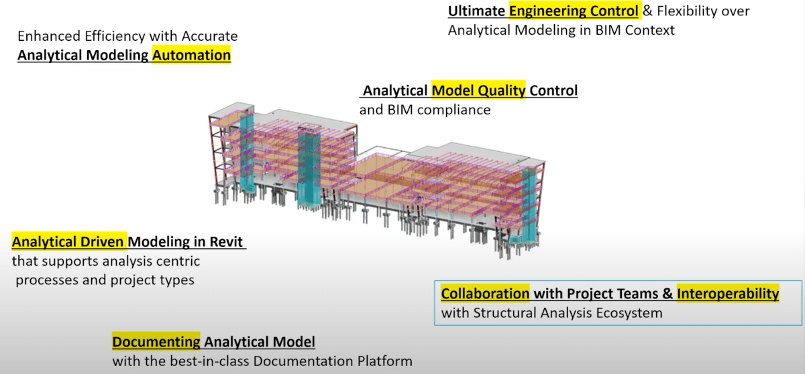

<head>
<meta http-equiv="Content-Type" content="text/html; charset=utf-8">
<link rel="stylesheet" type="text/css" href="bc.css">

</head>

<!---

- slack https://autodesk.slack.com/archives/C0SR6NAP8/p1650388044451449
- comment https://thebuildingcoder.typepad.com/blog/2022/04/whats-new-in-the-revit-2023-api.html#comment-5838192874
- youtube The “Revit Structure Analytical Model API beta Webinar” has been posted to You Tube.
  [Revit 2023 Structural Analytical Model API webinar recording](https://youtu.be/jfUIVGNqlFU)

Boris Shafiro  17:23
API Studio Recording (2022-04-19):
https://share.autodesk.com/:v:/r/sites/BID/BID%20Documents/Building%20Design%20Products/Guilds/API/API%20Studio%20Recordings/2022/2022-04-19-API-Studio-Recording.mp4?csf=1&web=1&e=2THEGX
Agenda: New FamilyInstance creation API proposal. Oleg Sheydvasser, Ivan Dobrianov.

twitter:

 the #RevitAPI @AutodeskForge @AutodeskRevit #bim #DynamoBim #ForgeDevCon 

&ndash; 
...

linkedin:

#bim #DynamoBim #ForgeDevCon #Revit #API #IFC #SDK #AI #VisualStudio #Autodesk #AEC #adsk

the [Revit API discussion forum](http://forums.autodesk.com/t5/revit-api-forum/bd-p/160) thread

-->

### TBC Samples 2023 and the New Structural API

Migrating The Building Coder samples, I encountered the same problems as others trying to update obsolete structural API code, so let's take a look at some resources assisting us in that area:

- [Migrating The Building Coder samples](#2)
- [Not migrating the derived analytical model](#3)
- [Revit 2023 Structural API](#3)

#### Migrating The Building Coder Samples

I migrated [The Building Coder Samples](https://github.com/jeremytammik/the_building_coder_samples) last week.

Except for the deprecation of the derived analytical model that we discuss below, it was straightforward with hardly any changes at all except for updating the Revit API .NET assembly DLL references.

After that step, [8 errors and 5 warnings](zip/tbc_samples_2023_migr_01.txt) remain.

We can easily deal with the warning about the `ParameterFilterRuleFactory` `CreateEqualsRule` in the module CmdCollectorPerformance.cs:

- Warning CS0618 <i>ParameterFilterRuleFactory.CreateEqualsRule(ElementId, string, bool)</i> is obsolete:
  This method is deprecated in Revit 2023 and may be removed in a future version of Revit.
  Please use the constructor without the `caseSensitive` argument instead.
  
The Boolean argument was not working as expected in previous versions and can simply be removed.

#### Not Migrating The Derived Analytical Model

After removing the Boolean argument to `CreateEqualsRule`, the
remaining [8 errors and 4 warnings](zip/tbc_samples_2023_migr_01.txt) are
all caused by the analytical model changes, above all the removal of the `GetAnalyticalModel` method.

The existing code cannot easily be migrated to the new structural API, as I explained in the answer
to [Ozan Aksu's comment](https://thebuildingcoder.typepad.com/blog/2022/04/whats-new-in-the-revit-2023-api.html#comment-5838111563):

**Question:** Can't find `AnalyticalToPhysicalRelationManager`.
Where is it?
I was using `GetAnalyticalModel`.
Now I am stuck.

**Answer:** Yes, indeed, some hard and sudden changes have been made to the Structural API.

Please refer to the online help page
on [The Contextual Analytical Model in the Revit API](https://help.autodesk.com/view/RVT/2023/ENU/?guid=GUID-A1157199-4E27-41F9-BF45-53A5CD79E9A1).
It includes some sample code as well.

The sample describing how to access the analytical element for a given physical element is in the section named <i>Gets the associated analytical element for a physical one</i>.

The bottom line is that the relation between physical element and analytical element can now be edited &ndash; in the old approach, this was not possible &ndash; and the class which handles these relations is called `AnalyticalToPhysicalAssociationManager`.

I asked the development team myself how to migrate a sample using the `GetAnalyticalModel` method.
They reply:

It correct to assume that the following code makes no sense at all any longer in Revit 2023 and needs to be completely rewritten:

<pre class="code">
  var am = wall.GetAnalyticalModel();

  foreach (var ct in CurveTypes)
  {
    var curves = am.GetCurves(ct);
    var n = curves.Count;

    Debug.Print("{0} {1} curve{2}.",
      n, ct, Util.PluralSuffix(n));

    foreach (var curve in curves)
      creator.CreateModelCurve(
        curve.CreateTransformed(T));
  }
</pre>

There is no meaningful way to migrate it, since the basic concepts changed.
Yes, most of the code must be rewritten.

As always with the Revit API, it will help to learn and understand the new concepts from the end user point of view first, before trying to address the programming side of things.

#### Revit 2023 Structural API

So, let's dive deeper into the Revit 2023 Structural API.

The explanation
of [the contextual analytical model in the Revit API](https://help.autodesk.com/view/RVT/2023/ENU/?guid=GUID-A1157199-4E27-41F9-BF45-53A5CD79E9A1) contains
all the up-to-date information and may be the best starting point.
 
The Revit Developer's Guide description of
the [Analytical Model](https://help.autodesk.com/view/RVT/2023/ENU/?guid=Revit_API_Revit_API_Developers_Guide_Discipline_Specific_Functionality_Structural_Engineering_Analytical_Model_html) is
still work-in-progress and will be updated soon.

Finally,
the 47-minute [Revit 2023 Structural Analytical Model API webinar recording](https://youtu.be/jfUIVGNqlFU) created
during the pre-release phase has now been published and explains all the new concepts in ful depth and detail.

 <!-- 1200 -->

