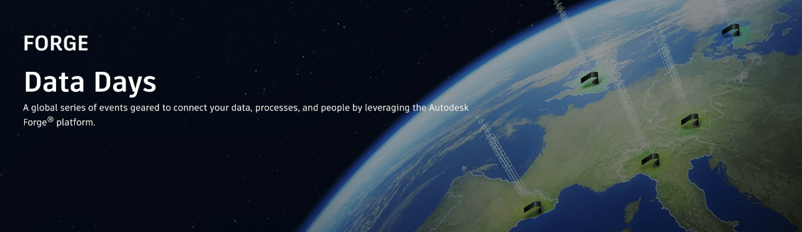

<head>
<meta http-equiv="Content-Type" content="text/html; charset=utf-8">
<link rel="stylesheet" type="text/css" href="bc.css">

</head>

<!---

twitter:

 #RevitAPI code @AutodeskForge @AutodeskRevit #bim #DynamoBim #ForgeDevCon 

&ndash; 
...

linkedin:

#bim #DynamoBim #ForgeDevCon #Revit #API #IFC #SDK #AI #VisualStudio #Autodesk #AEC #adsk

the [Revit API discussion forum](http://forums.autodesk.com/t5/revit-api-forum/bd-p/160) thread

-->

### Forge Data Days

#### 

Forge Data Days!

To learn more about the event, please check out
the [Forge Data Days global event series announcement](https://forge.autodesk.com/blog/announcing-forge-data-days-global-event-series) and 
the [Forge Data Days event page](https://forge.autodesk.com/forge-data-days).

Below you’ll find an email template that you can use to invite those customers/partners who you feel should get a direct, personalized invitation to any of the EMEA events. You can of course modify as needed. For reference, our full registration plan is as follows:
 
EMEA Early Bird Registration (1:1 direct outreach): April 21st - May 2nd
EMEA Registration open to the public: May 3rd – the event dates (May 3rd is when the registration links will be added to the event page and an email invite will go out to everyone that is opted into Forge communications (i.e. newsletter) and meets other Forge criteria in Marketo)
  
I am reaching out to personally invite you to Forge Data Days, a one-day, in-person event happening in 20 cities worldwide, to learn how to fully unlock the value of your data with Forge. There are a limited number of seats available per event, but I have a feeling you won’t want to miss this, so I am sending you an exclusive Early Bird registration opportunity!
 
At Forge Data Days, you’ll hear directly from experts on how Forge is powering enterprise digital transformation. See how we are making data more granular, standardized, and transparent – and helping you connect your teams, processes, and workflows. Learn how new Forge data capabilities and APIs can increase your productivity, automation, and profitability. 
 
With the exclusive Early Bird registration links below, you can choose between 5 different European cities to join us at. Don’t wait, registration opens to the public on May 3rd and spots will fill up fast! 
 
Here are the dates and registration links for the first five locations, starting out in Europe:

- May 31st &ndash; [Munich, Germany](https://cvent.autodesk.com/event/c064e191-cced-4cf6-a0ff-56a92a3c2689/summary)
- June 2nd &ndash; [Gothenburg, Sweden](https://cvent.autodesk.com/event/994e1f82-52fc-41a2-9a64-efadde9e4273/summary)
- June 7th &ndash; [Birmingham, UK](https://cvent.autodesk.com/event/bedd310d-fa7d-4b02-99dd-2c4c5b40293d/summary)
- June 9th &ndash; [Milan, Italy](https://cvent.autodesk.com/event/5733cfc3-51cf-41fb-bacf-457ba6b1ae97/summary)
- June 14th &ndash; [Barcelona, Spain](https://cvent.autodesk.com/event/84021b3b-9286-4586-af2a-c6b1f2b5f301/summary)
- [All event locations](https://forge.autodesk.com/forge-data-days)

 <!-- 1200 -->

#### 

**Question:** 

**Answer:** 

<pre class="code">

  
</pre>

#### 

#### 
