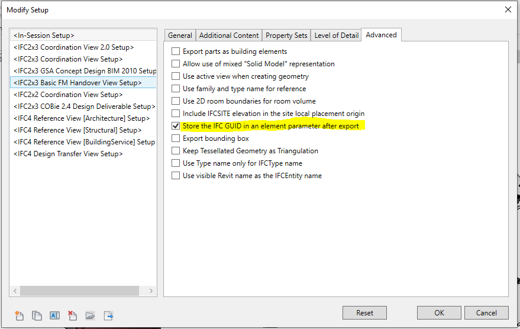
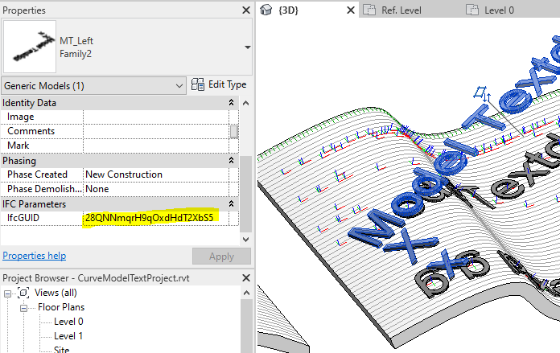
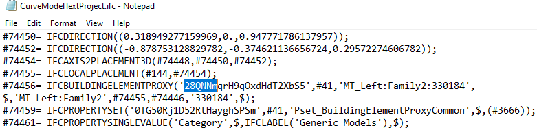

<head>
<meta http-equiv="Content-Type" content="text/html; charset=utf-8">
<link rel="stylesheet" type="text/css" href="bc.css">

</head>

<!---

- store exported ifc guid in rvt element parameter
  Specific GUID. Is it possible?
  https://forums.autodesk.com/t5/revit-api-forum/specific-guid-is-it-posible/m-p/11136697
  GUID
  https://forums.autodesk.com/t5/revit-api-forum/guid/m-p/10616955
  Congratulations on the shortest thread title candidate
  
twitter:

Another look at element ids, IFC GUID, maintaining connectivity between RVT & IFC, linking IFC export with modified BIM, controlling the unique id and the IFC export GUID in the #RevitAPI @AutodeskForge @AutodeskRevit #bim #DynamoBim #ForgeDevCon https://autode.sk/uniqidifcguid

We take yet another look at element ids and maintaining connectivity with IFC GUIDs
&ndash; Linking IFC export with modified BIM
&ndash; You cannot control the unique id
&ndash; You can control the IFC Export GUID...

linkedin:

Another look at element ids, IFC GUID, maintaining connectivity between RVT & IFC, linking IFC export with modified BIM, controlling the unique id and the IFC export GUID in the #RevitAPI 

https://autode.sk/uniqidifcguid

- Linking IFC export with modified BIM
- You cannot control the unique id
- You can control the IFC Export GUID...

#bim #DynamoBim #ForgeDevCon #Revit #API #IFC #SDK #AI #VisualStudio #Autodesk #AEC #adsk

the [Revit API discussion forum](http://forums.autodesk.com/t5/revit-api-forum/bd-p/160) thread

-->

### Unique Id and IFC GUID Parameter

Let's take yet another look at element ids and maintaining connectivity with IFC GUIDs:

- [Linking IFC export with modified BIM](#3)
- [You cannot control the unique id](#4)
- [You can control the IFC Export GUID](#5)

#### Linking IFC Export with Modified BIM

Richard [RPThomas108](https://forums.autodesk.com/t5/user/viewprofilepage/user-id/1035859) Thomas
points out the important possibility to store the exported IFC GUID in an RVT BIM element parameter in order to maintain connectivity in
the [Revit API discussion forum](http://forums.autodesk.com/t5/revit-api-forum/bd-p/160) threads
on [GUID](https://forums.autodesk.com/t5/revit-api-forum/guid/m-p/10616955) (congratulations on the shortest thread title ever!) and
asking [specific GUID; is it possible?](https://forums.autodesk.com/t5/revit-api-forum/specific-guid-is-it-posible/m-p/11136697):

#### You Cannot Control the Unique Id

**Question:** How can I generate elements that have specific GUID? 

Example - I have one or more elements and GUIDs that I want; I need to create an element having that GUID.

**Answer:** If you are speaking about `Element.UniqueId` then the answer is no, those are generated by Revit.

This applies to both `ElementId` and `UniqueId`. These unique identifiers are auto-generated. There is NO way you could specify these yourself or assign them manually to an element.

If you are in a situation with such a requirement, there is a flaw in your workflow design and architecture.

You can probably solve it by using some other identifier.
If you need to define the identifier yourself, then do so.

You cannot expect Revit or any other software to generate a GUID according to your specification.

An example of generating and storing your own GUID to identify a project that could also be used for individual BIM elements is given by the [named GUID storage for project identification](https://thebuildingcoder.typepad.com/blog/2016/04/named-guid-storage-for-project-identification.html).

**Response:** We need it for IFC export.
In our workflow, we have a master database from which we need to generate and re-generate objects in Revit.
We would like that when exported to IFC, their GlobalId is set to something that we have generated in our own project, not newly assigned by Revit each case.

**Answer:** Well, sorry, you read all the unanimous answers above.
You can easily program a workaround.
You will not be able to force Revit to use the unique ids you need, but you can easily equip the building elements with the pre-existing ids in your own data structure and replace them in the IFC file or elsewhere along the processing pipeline.
Be creative.

There is already an existing mechanism for keeping IFC GUID's consistent for elements between IFC exports from a Revit project, described in the thread on [GUID](https://forums.autodesk.com/t5/revit-api-forum/guid/m-p/10616955) (cf. [below](#5).

If you need to recreate the elements in Revit, then you need to repopulate the parameter used to store the GUID in relation to the above setting with the value you want it to be.

So, if you are creating elements in Revit from data in this external database, then just populate the parameter of that created element with what exists in your external database (removing same superseded item in Revit).
Then, when exported, the IFC GUID will be generated from the parameter if the above setting is used for export.

#### You Can Control the IFC Export GUID

**Question:** We are working on a very large project.
Many engineering service providers are involved.
Since Revit is not the only engineering tool people use, we need to use another software for our common data environment.
This software imports IFC file formats.

We created a very detailed tagging procedure.
Every element identifier will be maintained by a user.
We need to keep those identifiers during IFC export from Revit.
After that, we can easily link them to rest of the data that we have in Excel.
But, if we lose the identifiers during IFC export, we can't do anything...

I have these questions:

- How can users create and maintain the identifiers?
  Can we use the parameter “Mark” as an identifier or it has to be the GUID?
  Can a user change the GUID?
- How can we keep the identifiers during IFC export?
  IFC exporting loses the parameter “Mark”, and the old GUID is automatically being replaced by a new one.

Any answer would be greatly appreciated.

**Answer:** The Revit IFC exporter has the option below to store each element's IFC GUID in an element parameter after export: 

 <!-- 879 -->

When the export occurs, the GUID used for the exported instance is added as an instance parameter on the instance in the Revit model:

 <!-- 696 -->

If then the IFC is exported again later, the exporter should read this instance parameter value to use the same GUID for that export also:

 <!-- 781 -->

**Response:** @RPTHOMAS108 thank you! This is what I was looking for!

Many thanks (again and again) to Richard for sharing his inexhaustible experience and providing so many great solutions!

By the way, this was also explained by The Building Coder in 2015,
on [accessing the IFC GUID of an imported wall](http://thebuildingcoder.typepad.com/blog/2015/06/ifc-guid-access-life-span-and-cloning-of-geometry.html#3).

