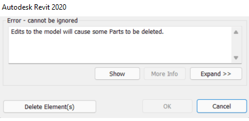

<head>
<meta http-equiv="Content-Type" content="text/html; charset=utf-8">
<link rel="stylesheet" type="text/css" href="bc.css">

</head>

<!---

- https://www.revitapidocs.com/2023/

- [Upgrading Revit API Apps For Newer Revit Versions](https://revthat.com/upgrading-revit-api-apps-for-newer-revit-versions)
  Eric Boehlke truevis

- Disable error with 'Error' severity
  https://forums.autodesk.com/t5/revit-api-forum/disable-error-with-error-severity/m-p/11004220

twitter:

the #RevitAPI @AutodeskForge @AutodeskRevit #bim #DynamoBim #ForgeDevCon 

&ndash; 
...

linkedin:

#bim #DynamoBim #ForgeDevCon #Revit #API #IFC #SDK #AI #VisualStudio #Autodesk #AEC #adsk

the [Revit API discussion forum](http://forums.autodesk.com/t5/revit-api-forum/bd-p/160) thread

-->

### Disable Error Failure with Error Severity

We continue updating all systems Revit 2023 and take a deep dive into the mysteries and pitfalls of the Failure API:

- [RevitApiDocs support for Revit 2023](#2)
- [Migrating add-ins to Revit 2023](#3)
- [Disable failure with error severity](#4)

#### RevitApiDocs Support for Revit 2023

[Gui Talarico](https://twitter.com/gtalarico) updated the online Revit API documentation for Revit 2023, both:

- [apidocs](https://apidocs.co/apps/revit/2023/d4648875-d41a-783b-d5f4-638df39ee413.htm)
- [revitapidocs](https://www.revitapidocs.com)

Notifications of new features are pubished on twitter at:

- [@ApiDocsCo](https://twitter.com/ApiDocsCo)
- [@RevitApiDocs](https://twitter.com/RevitApiDocs)

Very many thanks to Gui for all his work on these invaluable resources, and the fast turn-around time for the Revit 2023 API!

 <!-- 1000 -->

#### Migrating Add-Ins to Revit 2023

Eric Boehlke of [truevis BIM Consulting](https://truevis.com) shares
his experience and detailed illustrated process
of [upgrading Revit API apps for newer Revit versions](https://revthat.com/upgrading-revit-api-apps-for-newer-revit-versions).

For The Building Coder's notes on the topic this time around, please simply search this site
for [migration 2023](https://www.google.com/search?q=migration+2023&as_sitesearch=thebuildingcoder.typepad.com).

#### Disable Failure with Error Severity

We have presented many solutions 
for [detecting and automatically handling dialogues and failures](https://thebuildingcoder.typepad.com/blog/about-the-author.html#5.32).
The Failure API is a great help in many cases.
Handling warnings can be achieved using a [warning swallower](http://thebuildingcoder.typepad.com/blog/2016/09/warning-swallower-and-roomedit3d-viewer-extension.html#2).
Alexander [@aignatovich](https://forums.autodesk.com/t5/user/viewprofilepage/user-id/1257478) [@CADBIMDeveloper](https://github.com/CADBIMDeveloper) Ignatovich, aka Александр Игнатович,
explains how real errors are more difficult but also possible to handle in
the [Revit API discussion forum](http://forums.autodesk.com/t5/revit-api-forum/bd-p/160) thread
on [disabling error with `Error`  severity](https://forums.autodesk.com/t5/revit-api-forum/disable-error-with-error-severity/m-p/11004220):

**Question:** I have a specific failure that I want to disable.

I'm able to 'catch' the error with the `FailuresProcessing` event.

The problem is that I can't find a way to disable or delete the error.

`DeleteWarning` only works for `Warning` severity, and my failure is `Error` severity.

In the user interface, I'd click `Cancel` on the popup message &ndash; it's the message that warns that deleting a part will cause other parts to be deleted.

My goal is to not show this error.
I'm cancelling the operation itself by posting another failure message saying "operation was cancelled", but the warning of 'deleting part will cause other part to be deleted' is still shown.

My goal is to not show this error message from the start.
In the end, I am not performing the deletion &ndash; I'm blocking it with creating my own error using FailuresProcessing as mentioned above.
So, I want to prevent from this error from appearing in the first place.

**Answer:** You could try to either resolve the failure or roll back the transaction.

If so, you could try to delete elements automatically in your failure preprocessor:

<pre class="code">
if (failureAccessor.HasResolutionOfType(FailureResolutionType.DeleteElements))
{
  failureAccessor.SetCurrentResolutionType(FailureResolutionType.DeleteElements);
  failuresAccessor.ResolveFailure(failureAccessor);
}
</pre>

You should return `FailureProcessingResult.ProceedWithCommit` if you set resolution type.

This failure preprocessor solves a bit different task, but I think it could help you:

<pre class="code">
  public class AutoDetachOrDeleteFailurePreprocessor : IFailuresPreprocessor
  {
    public FailureProcessingResult PreprocessFailures(FailuresAccessor failuresAccessor)
    {
      var preprocessorMessages = failuresAccessor.GetFailureMessages(FailureSeverity.Error)
        .Union(failuresAccessor.GetFailureMessages(FailureSeverity.Warning))
        .Where(x => x.HasResolutionOfType(FailureResolutionType.DeleteElements) || x.HasResolutionOfType(FailureResolutionType.DetachElements))
        .ToList();

      if (preprocessorMessages.Count == 0)
        return FailureProcessingResult.Continue;

      foreach (var failureAccessor in preprocessorMessages)
      {
        failureAccessor.SetCurrentResolutionType(failureAccessor.HasResolutionOfType(FailureResolutionType.DetachElements) ? FailureResolutionType.DetachElements : FailureResolutionType.DeleteElements);

        failuresAccessor.ResolveFailure(failureAccessor);
      }

      return FailureProcessingResult.ProceedWithCommit;
    }
  }
</pre>

If you can't resolve the error with FailureResolutionType.DeleteElements, then you can return `FailureProcessingResult.ProceedWithRollBack`.

In that case, you have to set:

<pre class="code">
  failureOptions.SetClearAfterRollback(true);
</pre>

for your transaction.

**Response:** I'll explain my workflow with more details:

- I'm successfully preventing the users from deleting parts that have a specific scheme I made
- No deletion is done whatsoever. Which is good - that was my goal
- Although no deletion is done, the user still get this warning:

I want to hide it because it can be confusing to my user.
The problem is that the severity of this message is `Error` and not warning, and therefore I can't use the Failure Accessor `DeleteWarning` method.

So my question is: Is is possible to prevent showing failures of `Error` severity?

**Answer:** Failures with `Error` severity cannot be "swallowed".
They should be resolved using some resolution type (if supported) or by transition rollback.
If the transaction is rolled back and you don't want to see messages in the UI, you should set clear after rolling back transaction option.

**Response:** I tried returning `ProceedWithCommit`, but the error still appears...
although I think I'm getting closer.

But there's nothing to rollback, because the transaction (deletion) didn't happen yet.
That's what the error warns me about.
I'm trying to return `ProceedWithCommit` and `Continue`, and still no success.

This is my `PreprocessFailures`;
I'm getting into the `for` loop, and inside my `if` statement.
And, of course, returning `ProceedWithRollback`.
The error still appears:

<pre class="code">
  public FailureProcessingResult PreprocessFailures(FailuresAccessor failuresAccessor)
    {
      IList<FailureMessageAccessor> failList = new List<FailureMessageAccessor>();
      failList = failuresAccessor.GetFailureMessages(); // Inside event handler, get all warnings

      foreach (FailureMessageAccessor failure in failList)
      {
        FailureDefinitionId failID = failure.GetFailureDefinitionId();
        if (failID == BuiltInFailures.DPartFailures.DeletingDPartWillDeleteMorePartsError)
        {
          failure.SetCurrentResolutionType(FailureResolutionType.Default);
          failuresAccessor.ResolveFailure(failure);
          failuresAccessor.GetFailureHandlingOptions().SetClearAfterRollback(true);
          return FailureProcessingResult.ProceedWithRollBack;
        }
      }

      return FailureProcessingResult.Continue;
    }
</pre>

**Answer:** From the API dopcumentation on `FailureResolutionType`:

> Default - Special (reserved) type. It cannot be used as a type when defining a resolution, but can be used as a key to query default resolution from FailureMessage or FailureDefinition.

I don't think you have to call `ResolveFailure` if you want to rollback the transaction.

I would try to set "clear after rollback" through transaction options before starting the transaction, e.g.:

<pre class="code">
var failureOptions = transaction.GetFailureHandlingOptions();
failureOptions.SetClearAfterRollback(true);
...
transaction.SetFailureHandlingOptions(failureOptions);
transaction.Start();
</pre>

**Response:** But I'm not starting any transaction... at any point.

This method is triggered by the user when she tries to delete an element (that's what I want).
I'm preventing the user from deleting the element (Raising a different error saying "Operation is cancelled").
I just don't want to get the error I attached in the picture a few comments above.

**Answer:** Do you use the `Application.RegisterFailuresProcessor` method?

I personally would suggest to avoid this...

From the API docs:

> Replaces Revit's default user interface (if present) with alternative handling for all warnings and errors (including those not generated by your application) for the rest of the Revit session; if your application is not prepared to respond to all warnings and errors, consider use of IFailuresPreprocessor (in your opened Transaction) or the FailuresProcessing event instead of this interface.
 
I think a better idea would be to subscribe to `Application.FailuresProcessing` event.
 
Then &ndash; yes, set "clear after rollback" as you did.

**Respnse:** I am registered to `FailuresProcessing`:

<pre class="code">
uiControlledApplication.ControlledApplication.FailuresProcessing += ControlledApplication_FailuresProcessing;
</pre>

And it still shows the error.

I am also using `IFailuresPreprocessor`:

<pre class="code">
public class FailuresPreProcessor : IFailuresPreprocessor
  {
    public FailureProcessingResult PreprocessFailures(FailuresAccessor failuresAccessor)
    {
      IList<FailureMessageAccessor> failList = new List<FailureMessageAccessor>();
      failList = failuresAccessor.GetFailureMessages(); // Inside event handler, get all warnings

      foreach (FailureMessageAccessor failure in failList)
      {
        FailureDefinitionId failID = failure.GetFailureDefinitionId();
        if (failID == BuiltInFailures.DPartFailures.DeletingDPartWillDeleteMorePartsError)
        {
          failure.SetCurrentResolutionType(FailureResolutionType.Others);
          
          failuresAccessor.GetFailureHandlingOptions().SetClearAfterRollback(true);
          failuresAccessor.ResolveFailure(failure);
          return FailureProcessingResult.ProceedWithRollBack;
        }
      }

      return FailureProcessingResult.Continue;
    }
  }
</pre>

Thanks so much for trying to help. I appreciate it! 

**Answer:** I guess you should pick one.
Have you tried to remove `ResolveFailure` and leave only:

<pre class="code">
  return FailureProcessingResult.ProceedWithRollBack;
</pre>

?

**Response:** What do you mean by 'pick one'?

I tried to return `ProceedWithRollBack` and removing `ResolveFailure` &ndash; didn't help.

**Answer:** Pick one means: choose either an application level failure processor (as for me - it's a bad choice) or a failure processing event.

Could you prepare a simple reproducible case: addin + model + what to do to reproduce?

**Response:** Yep, I'm using a failure processing event.

I am doing multiple things but let's focus only on the problem:
The goal is this:
When the user tries to delete a part (That was created in the past by my code and has a schema I made), raise a popup saying he can't do that and block the deletion.
I am doing that successfully!
In addition to blocking the deletion, I don't want the error message I attached yesterday to be shown, so there won't be a confusion.

To block the deletion, I have a class which inherits from `IUpdater` and uses a `FailureDefinition` GUID that I registered when Revit loads:

<pre class="code">
public class SplitElementUpdater : IUpdater
  {
    static AddInId m_appId;
    static UpdaterId m_updaterId;

    /// 

    /// Finds the failure definition id based on a constant GUID
    /// 

    /// <returns></returns>
    private static FailureDefinitionId GetFailureDefinitionId()
    {
      FailureDefinitionRegistry failureDefinitionRegistry = Autodesk.Revit.ApplicationServices.Application.GetFailureDefinitionRegistry();
      FailureDefinitionId FailureDefinitionId = new FailureDefinitionId(FailureDefinitionIdGuid.Value);
      return failureDefinitionRegistry.FindFailureDefinition(FailureDefinitionId).GetId();
    }

    public FailureDefinitionId _failureId = GetFailureDefinitionId();

    // constructor takes the AddInId for the add-in associated with this updater
    public SplitElementUpdater(AddInId id)
    {
      m_appId = id;
      m_updaterId = new UpdaterId(m_appId, Guid.NewGuid());
    }

    public void Execute(UpdaterData data)
    {
      try
      {
        Document doc = data.GetDocument();
        ICollection<ElementId> changedElements = data.GetModifiedElementIds().Concat(data.GetDeletedElementIds()).ToList();

        DialogResult userResult = MessageBox.Show(
          "You are trying to edit a part which was divided by an automation tool. To edit this part, first revert the division, then edit the part normally. Do you wish to open the “Surface Split” tool?",
          "", MessageBoxButtons.OKCancel);
        if (userResult.Equals(DialogResult.OK))
        {
          RevitDBUtils.InitializeStaticUtils(doc, RevitDBUtils.uidoc, RevitDBUtils.uiapp, RevitDBUtils.dllFolder, eDiscipline.Architectural);
          RevitDBUtils.ExecuteMethodInEvent(() =>
          {
            SurfaceSplitTabsWindow window = new SurfaceSplitTabsWindow(1);
            window.Show();
          }, "Open Revert Surface Split window");
        }
        // Create a failure message that will cancel the operation
        FailureMessage failureMessage = new FailureMessage(_failureId);

        failureMessage.SetFailingElements(changedElements);

        doc.PostFailure(failureMessage);
      }
      catch
      {
      }
    }

    public string GetAdditionalInformation()
    {
      return "Surface Split Updater for preventing modifying elements divided by Surface Split";
    }

    public ChangePriority GetChangePriority()
    {
      return ChangePriority.FreeStandingComponents;
    }

    public UpdaterId GetUpdaterId()
    {
      return m_updaterId;
    }

    public string GetUpdaterName()
    {
      return "Surface Split Updater";
    }
  }
</pre>

This class works as expected and blocks the deletion, I'm setting up the trigger here:

<pre class="code">
public static UpdaterId SurfaceSplitElementUpdaterSetup(AddInId addinId, Document doc)
    {
      SplitElementUpdater splitUpdater = new SplitElementUpdater(addinId);//Create a surface split updater for alerting on modified divided elements

      UpdaterRegistry.RegisterUpdater(splitUpdater);//register the updater
      UpdaterRegistered = true;
      // Creating filters for the updater:

      ElementMulticategoryFilter catFilter = new ElementMulticategoryFilter(new List<BuiltInCategory> { BuiltInCategory.OST_Parts });//Create categories filter

      ExtensibleStorageFilter extensibleStorageFilter = new ExtensibleStorageFilter(SplitFlag.GetGuid());
      //Create extensible storage filter of elements with the Surface split Element Info Guid

      LogicalAndFilter bothFilters = new LogicalAndFilter(catFilter, extensibleStorageFilter);//combine both filters to a single filter

      ChangeType elementDeletion = Element.GetChangeTypeElementDeletion();//the change type of an element deletion
      ChangeType geometryChange = Element.GetChangeTypeGeometry();//the change type of a geometry change

      UpdaterId updaterId = splitUpdater.GetUpdaterId();

      //We want to trigger when changing some of the params:
      List<Parameter> parameters = new List<Parameter>();
      parameters.Add(GetPanelIDUtils.GetPanelIdParameter(doc));
      parameters.Add(GetFromDocUtils.GetParameter(ParametersConstants.FACTORY, doc));
      parameters.Add(GetFromDocUtils.GetParameter(ParametersConstants.MATERIAL, doc));
      parameters.Add(GetFromDocUtils.GetParameter(BuiltInParameter.ROOF_BASE_LEVEL_PARAM, doc));

      foreach (Parameter parameter in parameters)
      {
        if (parameter != null)
        {
          ChangeType paramChange = Element.GetChangeTypeParameter(parameter);
          UpdaterRegistry.AddTrigger(updaterId, bothFilters, paramChange);
        }
      }

      // add the triggers for the updater
      
      UpdaterRegistry.AddTrigger(updaterId, bothFilters, elementDeletion);
      UpdaterRegistry.AddTrigger(updaterId, bothFilters, geometryChange);

      return splitUpdater.GetUpdaterId();
    }
</pre>

All of this is fine!

And now, the problem:

We know we can't swallow the error because it's of 'error' severity, but I'm unable to resolve it as well.

I tried with and without resolve failure, tried proceed with commit and continue, nothing worked.

<pre class="code">
public FailureProcessingResult PreprocessFailures(FailuresAccessor failuresAccessor)
    {
      IList<FailureMessageAccessor> failList = new List<FailureMessageAccessor>();
      failList = failuresAccessor.GetFailureMessages(); // Inside event handler, get all warnings

      foreach (FailureMessageAccessor failure in failList)
      {
        FailureDefinitionId failID = failure.GetFailureDefinitionId();
        if (failID == BuiltInFailures.DPartFailures.DeletingDPartWillDeleteMorePartsError)
        {
          failure.SetCurrentResolutionType(FailureResolutionType.Default);
          failuresAccessor.GetFailureHandlingOptions().SetClearAfterRollback(true);
          //failuresAccessor.ResolveFailure(failure);
          TransactionStatus a = failuresAccessor.RollBackPendingTransaction();
          return FailureProcessingResult.ProceedWithRollBack;
        }
      }

      return FailureProcessingResult.Continue;
    }
</pre>

Thank you!

**Answer:** Try something like this:

<pre class="code">
public class RevitApplication : IExternalApplication
{
	private SyntheticFailureReplacement failureReplacement;

	public Result OnStartup(UIControlledApplication application)
	{
		failureReplacement = new SyntheticFailureReplacement();

		application.ControlledApplication.FailuresProcessing += ControlledApplicationOnFailuresProcessing;

		return Result.Succeeded;
	}

	public Result OnShutdown(UIControlledApplication application)
	{
		application.ControlledApplication.FailuresProcessing -= ControlledApplicationOnFailuresProcessing;

		return Result.Succeeded;
	}

	private void ControlledApplicationOnFailuresProcessing(object sender, FailuresProcessingEventArgs e)
	{
		var failuresAccessor = e.GetFailuresAccessor();

		var failureMessages = failuresAccessor
			.GetFailureMessages(FailureSeverity.Error)
			.Where(x => x.GetFailureDefinitionId() == BuiltInFailures.DPartFailures.DeletingDPartWillDeleteMorePartsError)
			.ToList();
		
		if (failureMessages.Any())
		{
			var failureHandlingOptions = failuresAccessor.GetFailureHandlingOptions();

			failureHandlingOptions.SetClearAfterRollback(true);

			failuresAccessor.SetFailureHandlingOptions(failureHandlingOptions);

			e.SetProcessingResult(FailureProcessingResult.ProceedWithRollBack);

			failureReplacement.PostFailure(failureMessages.SelectMany(x => x.GetFailingElementIds()));
		}
	}
}

public class SyntheticFailureReplacement : IExternalEventHandler
{
	private readonly ExternalEvent externalEvent;
	private readonly List<ElementId> failingElementIds = new List<ElementId>();
	private readonly FailureDefinitionId failureDefinitionId = new FailureDefinitionId(new Guid("bc0dc2ef-d928-42e4-9c9b-521cb822d3fd"));

	public SyntheticFailureReplacement()
	{
		externalEvent = ExternalEvent.Create(this);

		FailureDefinition.CreateFailureDefinition(failureDefinitionId, FailureSeverity.Warning, "My accurate message replacement");
	}

	public void PostFailure(IEnumerable<ElementId> failingElements)
	{
		failingElementIds.Clear();
		failingElementIds.AddRange(failingElements);

		externalEvent.Raise();
	}

	public void Execute(UIApplication app)
	{
		var document = app.ActiveUIDocument.Document;

		using (var transaction = new Transaction(document, "auxiliary transaction"))
		{
			var failureHandlingOptions = transaction.GetFailureHandlingOptions();
			failureHandlingOptions.SetForcedModalHandling(false);

			transaction.SetFailureHandlingOptions(failureHandlingOptions);
			
			transaction.Start();

			var failureMessage = new FailureMessage(failureDefinitionId);

			failureMessage.SetFailingElements(failingElementIds);
			
			document.PostFailure(failureMessage);

			transaction.Commit();
		}
	}

	public string GetName() => nameof(SyntheticFailureReplacement);
}
</pre>

**Response:** Worked like a charm. Thanks!

Many thanks to Alexander for his deep expertise in this area, and above all for his super-human patience providing such detailed guidance!
