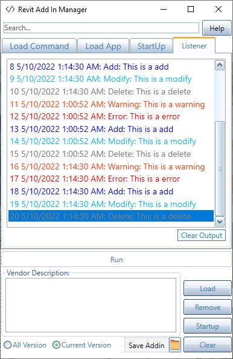

<head>
<meta http-equiv="Content-Type" content="text/html; charset=utf-8">
<link rel="stylesheet" type="text/css" href="bc.css">

</head>

<!---

- Revit Macro Study Shareback
  https://www.autodeskresearchcommunity.com/hub/posts/post-25914628
  zip/revit_macro_study_shareback.pdf
  https://forums.autodesk.com/t5/revit-api-forum/research-how-do-you-use-revit-macros/m-p/11158305

- add-in manager Debug Trace
  Chuong Ho
  Revit Addin Manager supports Debug/Trace Writeline include dockpanel for developer now.
  It's an improvement that i think it will save even more debugging time for programmers 🤗
  Download at opensource : https://lnkd.in/gtpy9RpV
  #developer #revitapi #autodesk #bim #AEC #addinmanager
  addinmanager_debugtrace.jpg 386
  [RevitAddInManager](https://github.com/chuongmep/RevitAddInManager)
  > Usually, when developing and debugging an addin with RevitAPI, user has to close & re-open Revit each time he/she modifies the addin code and wants to re-compile. But with Add-In Manager, user can modify and run the addin directly without closing & re-opening Revit again and again.

- interesting project
  [Journalysis](https://github.com/andydandy74/Journalysis) by
  Andreas [@andydandy74](https://github.com/andydandy74) Dieckmann
  Berlin, Germany
  > Journalysis is a Revit journal, worksharing log and keyboard shortcuts analysis package for the Dynamo visual programming environment.
  > Since there is hardly any documentation on Revit journals, it is a slow process. I have started writing some documentation in the [wiki](https://github.com/andydandy74/Journalysis/wiki) that may, however, not be entirely complete.
  > This package is aimed at automating the analysis of Revit journals and worksharing logs for statistical purposes. Some possible use cases:
  Monitor crashes
  Monitor API errors
  Monitor memory usage
  Monitor sync with central duration
  Keyboard shortcut usage

- 3D construction printing -- https://cobod.com -- https://cobod.com/videos/

- [Switch to HSL Color Format](https://youtu.be/VInSzHOeFkE)
  with numerous useful CSS links (ca. 7 minutes)

twitter:

Updated #RevitAPI documentation for Revit 2023 and a deep dive into the mysteries and pitfalls of the Failure API to disable a failure with error severity @AutodeskForge @AutodeskRevit #bim #DynamoBim #ForgeDevCon https://autode.sk/errorfailure

We continue updating all systems the new release and take a deep dive into the mysteries and pitfalls of the Failure API
&ndash; RevitApiDocs support for Revit 2023
&ndash; Migrating add-ins to Revit 2023
&ndash; Disable failure with error severity...

linkedin:

Updated #RevitAPI documentation for Revit 2023 and a deep dive into the mysteries and pitfalls of the Failure API to disable a failure with error severity

https://autode.sk/errorfailure

We continue updating all systems the new release:

- RevitApiDocs support for Revit 2023
- Migrating add-ins to Revit 2023
- Disable failure with error severity...

#bim #DynamoBim #ForgeDevCon #Revit #API #IFC #SDK #AI #VisualStudio #Autodesk #AEC #adsk

the [Revit API discussion forum](http://forums.autodesk.com/t5/revit-api-forum/bd-p/160) thread

-->

### 

#### Revit Macro Study Shareback

We recently
asked for feedback from the add-in developer community in
the [Revit API discussion forum](http://forums.autodesk.com/t5/revit-api-forum/bd-p/160) thread
on [how you use Revit Macros](https://forums.autodesk.com/t5/revit-api-forum/research-how-do-you-use-revit-macros/m-p/11158305).

The rsults are now in, and we share them with you for further evaluation and feedback:

> Feel free to review the research result summary and add any comments or suggestions at: 

> 
<a href="https://www.autodeskresearchcommunity.com/hub/posts/post-25914628">Revit Macro Study Shareback</a>

You have to set up an account with Autodesk research, fill in a survey and await the response email to see them.

To save others the same process, time and effort, I took the liberty of printing the results to PDF and sharing them here in [revit_macro_study_shareback.pdf](zip/revit_macro_study_shareback.pdf).

Many thanks to the Revit development team and Siyu Guo for the shareback and interesting results.

#### Add-In Manager with Debug Trace

We recently mentioned
Chuong Ho's [open source add-in manager](https://thebuildingcoder.typepad.com/blog/2022/01/add-in-manager-formulamanager-and-tiger-year.html#2).

> Usually, when developing and debugging an addin with RevitAPI, user has to recompile, close and reopen Revit each time they modify the add-in code. 
With Add-In Manager, you can modify and run the add-in directly without closing and reopening Revit again and again.

Chuong announces new enhancements:

> Revit Add-in Manager supports Debug/Trace WriteLine including a dockable panel now.
> It's an improvement that I think will save even more debugging time for programmers 🤗
> Download from the [RevitAddInManager GitHub repo](https://github.com/chuongmep/RevitAddInManager).

 <!-- 386 -->

By the way, for the sake of completeness, note that
the [.NET hot reload for editing code at runtime](https://devblogs.microsoft.com/dotnet/introducing-net-hot-reload)
in Visual Studio 2019 also enables you to update your add-in code on the fly, cf.
[apply code changes debugging Revit add-in](https://thebuildingcoder.typepad.com/blog/2021/10/localised-forge-intros-and-apply-code-changes.html#4).

####

- interesting project
[Journalysis](https://github.com/andydandy74/Journalysis) by
Andreas [@andydandy74](https://github.com/andydandy74) Dieckmann
Berlin, Germany
> Journalysis is a Revit journal, worksharing log and keyboard shortcuts analysis package for the Dynamo visual programming environment.
> Since there is hardly any documentation on Revit journals, it is a slow process. I have started writing some documentation in the [wiki](https://github.com/andydandy74/Journalysis/wiki) that may, however, not be entirely complete.
> This package is aimed at automating the analysis of Revit journals and worksharing logs for statistical purposes. Some possible use cases:
Monitor crashes
Monitor API errors
Monitor memory usage
Monitor sync with central duration
Keyboard shortcut usage

- 3D construction printing -- https://cobod.com -- https://cobod.com/videos/

- [Switch to HSL Color Format](https://youtu.be/VInSzHOeFkE)
with numerous useful CSS links (ca. 7 minutes)

Tomasz Wojdyla  5 days ago
Hi Team!
Tomek is here :wink: I am a fairly new PO for Robot Structural Analysis trying to find myself in the organization - sorry for silly questions - there could be more than a few in the next weeks and months :wink:
Recently we started to wonder about the future for Revit Extension Framework (aka. REX) which we support in yearly basis even though (we believe) there is no internal use of this component anymore. External use is some sort of the question mark - it would be great if we could collect some data about its (external) users. We know one for sure and 2 more who are more than likely no longer with REX/Autodesk toolstack. Is there any chance you may share some info on this topic, maybe know some ADN users?
All info or advisory is greatly appreciated!:thankyou:
Cheers,
