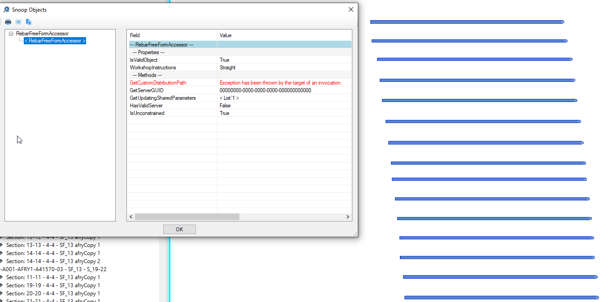
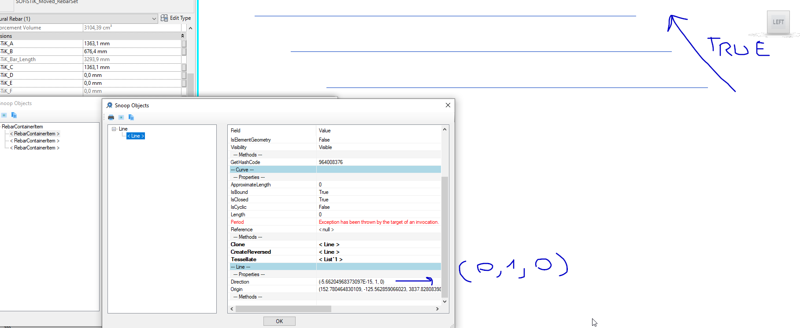
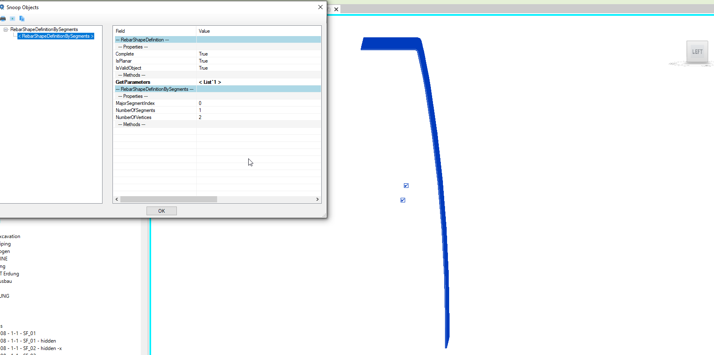
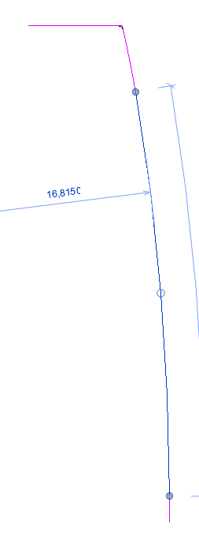
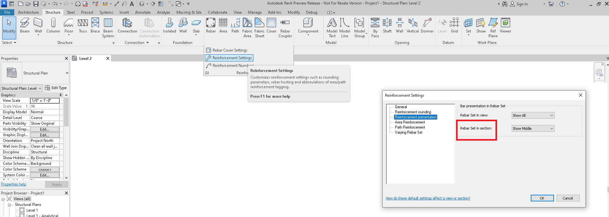
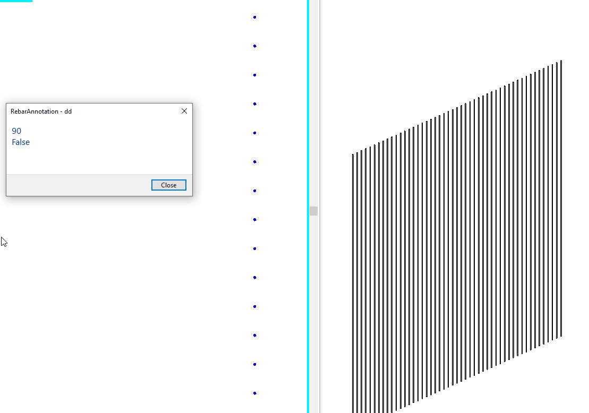

<head>
<meta http-equiv="Content-Type" content="text/html; charset=utf-8">
<link rel="stylesheet" type="text/css" href="bc.css">

</head>

<!---

- REX -- https://autodesk.slack.com/archives/C0SR6NAP8/p1651840528454499

- stefan dobre https://autodesk.slack.com/archives/C0SR6NAP8/p1651735070039959

twitter:

We ponder some structural rebar questions and the future of the REX structural Revit extensions included with the #RevitAPI SDK @AutodeskForge @AutodeskRevit #bim #DynamoBim #ForgeDevCon https://autode.sk/rst_rex

We ponder some structural rebar questions and the future of the REX structural Revit extensions included with the Revit SDK
&ndash; Future of REX
&ndash; Rebar API questions
&ndash; GetCustomDistributionPath
&ndash; Number of segments
&ndash; IsRebarInSection...

linkedin:

We ponder some structural rebar questions and the future of the REX structural Revit extensions included with the #RevitAPI SDK

https://autode.sk/rst_rex

- Future of REX
- Rebar API questions
- GetCustomDistributionPath
- Number of segments
- IsRebarInSection...

#bim #DynamoBim #ForgeDevCon #Revit #API #IFC #SDK #AI #VisualStudio #Autodesk #AEC #adsk

the [Revit API discussion forum](http://forums.autodesk.com/t5/revit-api-forum/bd-p/160) thread

-->

### Structural Questions and the Future of REX

Today, we ponder some structural rebar questions and the future of the REX structural Revit extensions included with the Revit SDK:

- [Future of REX](#2)
- [Rebar API questions](#3)
- [GetCustomDistributionPath](#4)
- [Number of segments](#5)
- [IsRebarInSection](#6)

#### Future of REX

Tomasz Wojdyla joined the Robot Structural Analysis team as senior product owner and is wondering about the future of the Revit Extension Framework, aka. REX.

We currently support it on a yearly basis even though (we believe) there is no internal use of this component anymore.

External use is a question mark &ndash; it would be great if we could collect some data about its (external) users.

Can you please let us know if you are interested in this framework?
You can simply provide your details in a comment below, or send
a [private message](https://thebuildingcoder.typepad.com/blog/about-the-author.html#1) if you prefer that.

All info and advice is greatly appreciated!
Thank you!

#### Rebar API Questions

Miguel [MiguelGT17](https://forums.autodesk.com/t5/user/viewprofilepage/user-id/5130624) Gutierrez raised a number of rebar questions in
the [Revit API discussion forum](http://forums.autodesk.com/t5/revit-api-forum/bd-p/160) that were very kindly answered
by Stefan Dobre, ‪senior principal engineer of the Revit Structural development team:

<!--
- [GetCustomDistributionPath from RebarFreeFormAccessor](https://forums.autodesk.com/t5/revit-api-forum/getcustomdistributionpath-from-rebarfreeformaccessor/td-p/11148790)
- [Number of segments](https://forums.autodesk.com/t5/revit-api-forum/number-of-segments/td-p/11148840)
- [IsRebarInSection()](https://forums.autodesk.com/t5/revit-api-forum/isrebarinsection/td-p/11148854)
- [AreElementsValidForMultiReferenceAnnotation](https://forums.autodesk.com/t5/revit-api-forum/areelementsvalidformultireferenceannotation/td-p/11148745)
-->

He responded: After a quick look on these questions, I don't see any problems.
It is just a misunderstanding of the API and how the rebar works.
I answered in the forum and submitted a change request *REVIT-191469* to update the description and (maybe) the name of the `Rebar.IsRebarInSection` function.

Many thanks to Stefan for the quick solutions!

#### GetCustomDistributionPath

First, how to
call [GetCustomDistributionPath from RebarFreeFormAccessor](https://forums.autodesk.com/t5/revit-api-forum/getcustomdistributionpath-from-rebarfreeformaccessor/td-p/11148790)?

**Question:** Is there a way to group up rebars without using the `RebarContainer` command and loading the distribution path data?

 <!-- 1345 -->

Furthermore, there is something strange going on when creating a rebar container.
Its distribution path is not correlated to the actual true distribution path:

 <!-- 1816 -->

**Answer to Question 1:** There are two types of Free Form rebar:

The one created from curves, and which doesn’t have any constraints to the host.
The input curves for each bar in set can be in any position and it is not possible to set a distribution path for it.
An example of such rebar is the sketched free form.
To create such Rebar you should call

<pre class="code">
  Rebar CreateFreeForm( Document doc,
    RebarBarType barType, Element host,
    IList&lt;CurveLoop&gt; curves,
    out RebarFreeFormValidationResult error);
</pre>

The one created through a server (callback), and which has constraints to the host.
Any time when the constraints are modified, the server is called to recompute the Rebar curves.
During this calculation, a distribution path can be set too.
This distribution path is a list of curves.
Aligned and Surface distributions are examples of such free form.
To create such Rebar, you should use

<pre class="code">
  Rebar CreateFreeForm( Document doc,
    Guid serverGUID, RebarBarType barType,
    Element host);
</pre>

Look also at the documentation for `IRebarUpdateServer` class.
The Revit SDK includes a sample that demonstrates how such a free form rebar can be created.

**Answer to Question 2:** `RebarContainerItem` is created from a Rebar element (which is a set).

It has its own number of bars and of course it will have its own distribution path which is the source rebar’s distribution path.

`RebarContainer` is just storing a list of RebarContainerItems without maintaining any relations between them.

**Response:** Appreciate those comments;
indeed, they are very deep insights about question 1.

Concerning question 2 reply, I'm worried about it.
I'll find the best approach to reach my goal with the information you have provided so far.
Stay blessed.

#### Number of Segments

Next, Miguel raises a question on 
the [number of segments](https://forums.autodesk.com/t5/revit-api-forum/number-of-segments/td-p/11148840):

**Question:** This set of rebars has been sketched as a free form.

 <!-- 961 -->

RevitLookup shows a single segment for this bar:

 <!-- 1720 -->

This is not true:

 <!-- 253 -->

Moreover, the `IsRebarInSection(view)` command always return false, regardless of the view.
So, I am not going to have the appropriate data when I sketch rebars as freeform?

**Answer:** As I can see in your images, you have a free form rebar that has the Workshop Instructions parameter set to Keep Straight. This means that no matter what curves the free form has, it will always be matched with a straight shape (M_00).

If you want the bar to be matched with other shapes, you should set the workshop parameter to Bend. One you set this option, each bar in the set will be matched with the existing rebar shapes from the project. If it doesn't match with any existing shapes, it will try to create new Rebar Shapes. If it can’t create new Rebar Shapes and error message will be posted and will continue to consider the bar as a straight one.

For more details on how the shape matching is working  you can have a look on this: https://knowledge.autodesk.com/support/revit/learn-explore/caas/CloudHelp/cloudhelp/2019/ENU/Revit-M...

Rebar.IsRebarInSection(View view) returns true only if the view is a section or elevation and the view plane is cutting at least one of the rebar curves, false otherwise. This API function is the correspondent of this UI option:

 <!-- 1915 -->

**Response:** Thanks for your prompt reply; my bad, I was not aware of those parameters.
I will double check them and perform another test this weekend.
Cheers!

#### IsRebarInSection

Finally, on [`IsRebarInSection`](https://forums.autodesk.com/t5/revit-api-forum/isrebarinsection/td-p/11148854):

**Question:** I have placed a set of rebars in a viewPlan that only has 1 segment:

 <!-- 1109 -->

I was expecting the `IsRebarInSection` method to return a `true` Boolean, as the rebars are shown as a cross section.
If that is not the case, what does this method stand for, and which API method should I be looking up instead?

Test code:

<pre class="code">
  foreach&nbsp;(Element&nbsp;element&nbsp;in&nbsp;rebars)
  {
    if&nbsp;(element&nbsp;is&nbsp;RebarContainer)
    {
   
    }
    else&nbsp;if&nbsp;(element&nbsp;is&nbsp;Rebar)
    {
      Rebar&nbsp;el&nbsp;=&nbsp;element&nbsp;as&nbsp;Rebar;
      if&nbsp;(el.IsRebarFreeForm()&nbsp;==&nbsp;true)
      {
   
      }
      else&nbsp;if&nbsp;(el.IsRebarShapeDriven()&nbsp;==&nbsp;true)
      {
        RebarShapeDrivenAccessor&nbsp;acc&nbsp;=&nbsp;(element&nbsp;as&nbsp;Rebar).GetShapeDrivenAccessor();
        XYZ&nbsp;dir&nbsp;=&nbsp;acc.GetDistributionPath().Direction;
   
        double&nbsp;angle&nbsp;=&nbsp;dir.AngleTo(view.ViewDirection);
        angle&nbsp;=&nbsp;angle&nbsp;*&nbsp;(180&nbsp;/&nbsp;Math.PI);&nbsp;//90,0
        stb.AppendLine(angle.ToString());
        stb.AppendLine(el.IsRebarInSection(view).ToString());
      }
    }
    TaskDialog.Show(&quot;dd&quot;,&nbsp;stb.ToString());
  }
</pre>

**Answer:** `IsRebarInSection` returns true only if the view is a section or elevation and the view plane is cutting at least one of the rebar curves, false otherwise.

This API function is the correspondent of this UI option:

 <!-- 1915 -->

In your case, to see that the straight bar is shown as a point you can verify this on your own.
You can get the centerline curves like this:

<pre class="code">
  rebar.GetTransformedCenterlineCurves(
    false,&nbsp;true,&nbsp;true,
    MultiplanarOption.IncludeOnlyPlanarCurves,
    0);
</pre>

You will get only one line. If the line’s direction is parallel with view’s direction it means that the bar is shown as a cross section, false otherwise.

<!-- 
#### AreElementsValidForMultiReferenceAnnotation

- [AreElementsValidForMultiReferenceAnnotation](https://forums.autodesk.com/t5/revit-api-forum/areelementsvalidformultireferenceannotation/td-p/11148745)

-->
