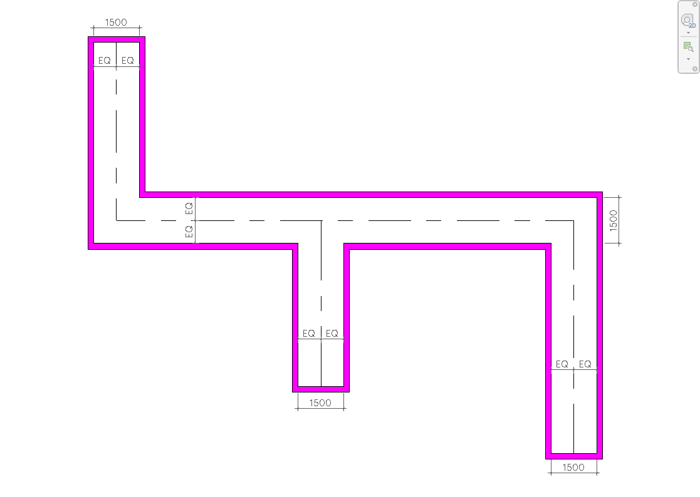
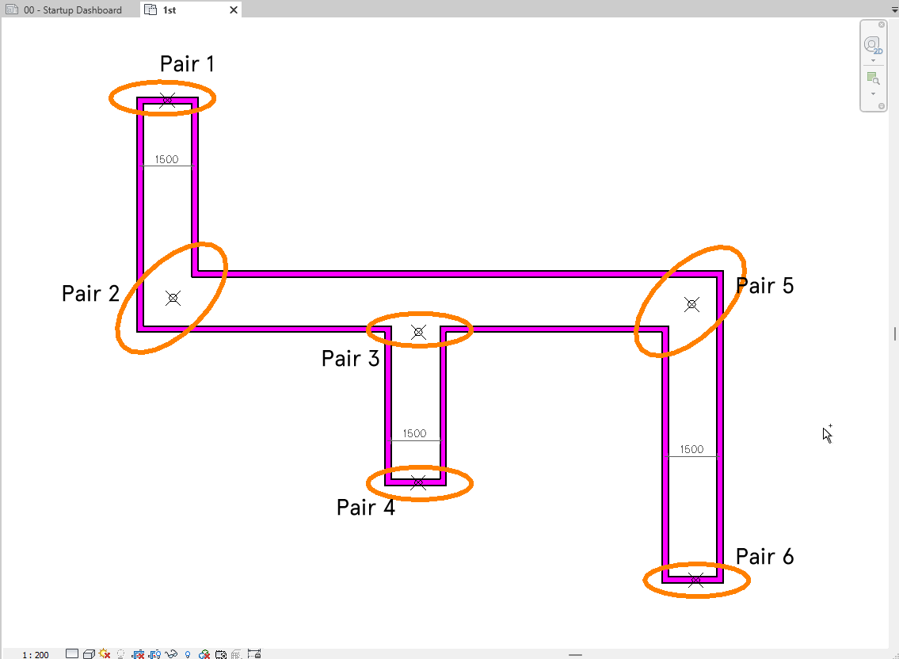

<head>
<meta http-equiv="Content-Type" content="text/html; charset=utf-8">
<link rel="stylesheet" type="text/css" href="bc.css">

</head>

<!---

- alpha shape
  Get room centerline(s) and intersections (For corridors/passage type rooms)
  https://forums.autodesk.com/t5/revit-api-forum/get-room-centerline-s-and-intersections-for-corridors-passage/m-p/11212632
  https://forums.autodesk.com/t5/revit-api-forum/get-room-centerline-s-and-intersections-for-corridors-passage/m-p/11216756

twitter:

 in the #RevitAPI SDK @AutodeskForge @AutodeskRevit #bim #DynamoBim #ForgeDevCon https://autode.sk/paramcloud

&ndash; 
...

linkedin:

#bim #DynamoBim #ForgeDevCon #Revit #API #IFC #SDK #AI #VisualStudio #Autodesk #AEC #adsk

the [Revit API discussion forum](http://forums.autodesk.com/t5/revit-api-forum/bd-p/160) thread

-->

### Corridor Skeleton

Today, we highlight an urgent request for feedback from the Revit development team and an especially interesting thread from
the [Revit API discussion forum](http://forums.autodesk.com/t5/revit-api-forum/bd-p/160):

#### New Copy and Paste API Feedback

The developement team is working on an update to the Copy/Paste API and would love to get some feedback on that via the Revit Prerelease forum.

Unfortunately, no add-in deverloper input was received during the merry month of May.

The June Preview Release will become available to users on June 15th.

The development team announced the Copy/Paste API enhancement and request feedback on it in
the [Revit API discussion forum](http://forums.autodesk.com/t5/revit-api-forum/bd-p/160) thread asking 
to [Help us test the enhanced Copy API for Sketch Members!](https://forums.autodesk.com/t5/revit-api-forum/june-preview-release-help-us-test-the-enhanced-copy-api-for/td-p/11234171)

> June Preview Release: 

> If you are a participant in the Revit beta program, please check out this month's preview release!

> We have an enhanced API to better support Copy-Paste of Sketch members and would like your feedback on it.

> We’ve made Copy-Pasting of Sketch members in API more consistent with UI, and in the process fixed multiple bugs.

> Find the summary of changes and code samples to try out the new functionality on our Preview Release Forum.

> Apply for access at [revit.preview.access@autodesk.com](mailto:revit.preview.access@autodesk.com).

> For any For all questions or concerns you might have, please us at [feedback.autodesk.com](mailto:feedback.autodesk.com).

#### Corridor Skeleton

An exciting discussion ensued in
the [Revit API discussion forum](http://forums.autodesk.com/t5/revit-api-forum/bd-p/160) thread on how 
to [get room centerlines and intersections for corridors and passages](https://forums.autodesk.com/t5/revit-api-forum/get-room-centerline-s-and-intersections-for-corridors-passage/m-p/11216756):

**Question:** How do I get the centerlines of a single room shown below?
I know one way is to divide the room manually into rectangular rooms with additional room separation lines, that way I can just use bounding boxes and get individual center lines.
But how Do I approach this for a single room with multiple turns/crossing/intersection??

 <!-- 1117 -->

**Answer:** This sounds like an interesting computational algebra task.
I would suggest doing some purely geometrical research completely disconnected from Revit and BIM, to start with.
Initially, I thought that
an [alpha shape](https://en.wikipedia.org/wiki/Alpha_shape) might
be useful for you, but just looking at the picture,
the [minimum spanning tree](https://en.wikipedia.org/wiki/Minimum_spanning_tree) looks more like your goal.

**Response:** Thanks for the Alpha Shape suggestion.
That is what I am ultimately looking for.
It's also called Concave hull in some forums.

I went through the steps where one has to vary the 'Alpha' to get the desired outcome which is basically the radius of the circle getting used in the algorithm.

I looked at this [alpha shape (concave hull) algorithm in C#](https://stackoverflow.com/questions/16625063/alpha-shape-concave-hull-algorithm-in-c-sharp).
I definitely want to implement this for my case.

Meanwhile, me being lazy, I figured out an easy way to solve my particular problem.

I used part of
your [Revit API code for convex hull](https://thebuildingcoder.typepad.com/blog/2016/08/online-revit-api-docs-and-convex-hull.html#3) to
get the vertices of the room. 
This is necessary, as there are multiple boundary segments when there is an overlapping room separation line, a door in the wall, etc.
Instead of calculating the convex hull, I just iterated over those resulting vertices, and determined the pair of points which are 'nearby'.
As the corridor width is fairly standard, I could just define my own suitable 'nearby' tolerance.
Then, I just calculate the center of the pairs, and that basically provides the centerline vertices.

 <!-- 1135 -->

I understand this is just a temporary and lazy solution that only works for my case.
I intend to implement the Alpha shape (concave hull) algorithm over the weekend. 

**Answer:** The simpler the better.
[Kiss](https://en.wikipedia.org/wiki/KISS_principle)!
I love your pragmatic closest-point-pair approach.
Thank you very much for sharing that, and looking forward to the alpha shape results.
Happy, fruitful weekend and successful coding!

**Answer2:** I think a [straight skeleton](https://en.wikipedia.org/wiki/Straight_skeleton),
or some other topological skeleton, would work much better than an alpha shape for your situation.

**Response:** So, I was implementing Alpha shape for this polygon; halfway through, I realized that already is an Alpha shape. :-)
I read more about Straight skeleton.
It led me to Medial Axis, which is basically the centerlines that we are talking about.
There are a few algorithms to calculate Medial Axis, e.g.,
to [find medial axis of a polygon using C#](https://stackoverflow.com/questions/1069523/find-medial-axis-of-a-polygon-using-c-sharp).
But this seems quite time consuming, and for now I am adhering
to [Kiss](https://en.wikipedia.org/wiki/KISS_principle)! :-)
Thanks @jeremy.tammik and @mhannonQ65N2 for your inputs. 

Here is the Method which returns the list of pairs of vertices which are 'nearby'.

Note: This only works when the corridor width is around 1500mm (which is design standard in my firm). For larger width, we can vary the 'tolerance' variable. Also, the length of a single branch/ junction is not less than 2550mm. Otherwise it'll return additional pairs. Which is more or less fine as the center points of those pairs will also lie on the Medial Axis (corridor centerline)

<pre class="code">
  public List<List<XYZ>> ReturnVertexPairs (Room corridorRoom)
  {
    SpatialElementBoundaryOptions opt = new SpatialElementBoundaryOptions
    {
      SpatialElementBoundaryLocation =
      SpatialElementBoundaryLocation.Finish
    };

    IList<IList<BoundarySegment>> loops = corridorRoom.GetBoundarySegments(opt);

    List<XYZ> roomVertices = new List<XYZ>(); //List of all room vertices
    foreach (IList<BoundarySegment> loop in loops)
    {
      //TaskDialog.Show("Revit", "Total Segments = " + loop.Count().ToString());

      XYZ p0 = null; //previous segment start point
      XYZ p = null; // segment start point
      XYZ q = null; // segment end point

      foreach (BoundarySegment seg in loop)
      {
        q = seg.GetCurve().GetEndPoint(1);

        if (p == null)
        {
          roomVertices.Add(seg.GetCurve().GetEndPoint(0));
          p = seg.GetCurve().GetEndPoint(0);
          p0 = p;
          continue;
        }
        p = seg.GetCurve().GetEndPoint(0);
        if (p != null && p0 != null)
        {
          if (AreCollinear(p0, p, q))//skipping the segments that are collinear
          {
            p0 = p;
            continue;
          }
          else
          {
            roomVertices.Add(p);
          }
        }
        p0 = p;
      }
    }

    double tolerance = 2550; //Distance between two Points (in mm) should be less than this number
    List<List<XYZ>> nearbyPairs = new List<List<XYZ>>(); //List of Pairs of nearby points
    for (int i = 0; i < roomVertices.Count() - 1; i++)
    {
      for (int j = i + 1; j < roomVertices.Count(); j++)
      {
        double dist = roomVertices[i].DistanceTo(roomVertices[j]) * 304.8;
        if (dist < tolerance) //checking whether two points are nearby based on tolerance
        {
          nearbyPairs.Add(new List<XYZ> { roomVertices[i], roomVertices[j] });
        }
      }
    }
    //TaskDialog.Show("Revit", "Total points = " + roomVertices.Count().ToString()
    //  + Environment.NewLine + "Total Pairs = " + nearbyPairs.Count());
    return nearbyPairs;
  }
</pre>

Helper method to check whether points are collinear, used to skip collinear boundary segments:

<pre class="code">
  static bool AreCollinear (XYZ p1, XYZ p2, XYZ p3)
  {
    bool collinear = false;
    double area = 0.5*Math.Abs(p1.X * (p2.Y - p3.Y)
      + p2.X * (p3.Y - p1.Y)
      + p3.X * (p1.Y - p2.Y));
    //sometimes area is not exactly zero but is very small number
    if (area < 0.1)
    {
      collinear = true;
    }
    return collinear;
  }
</pre>

Many thanks to @amrut.modani.wwi for raising this and sharing his nice approach!

