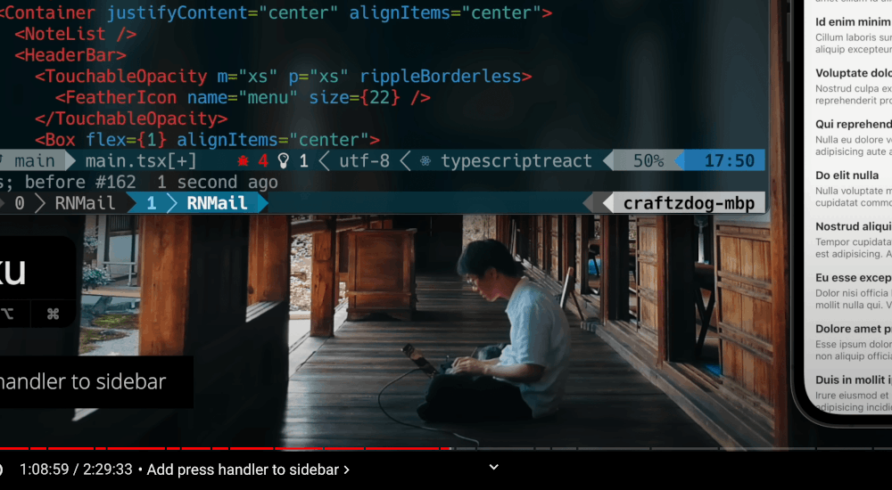

<head>
<meta http-equiv="Content-Type" content="text/html; charset=utf-8">
<link rel="stylesheet" type="text/css" href="bc.css">

</head>

<!---

- RevitLookup Release 2023.1.0
  New: Hello World window changed to About
  New: re-sorted commands on the Revit ribbon, frequently used moved to the top
  New: added Snoop Active Document command
  Fix: revert support search index from keyboard
  Fix: removed label if `ElementId` was -1

- Filter different BuiltInCategories at same time
  https://forums.autodesk.com/t5/revit-api-forum/can-i-filter-different-builtincategories-at-same-time/m-p/11254486

- How do I get all the outermost walls in the model?
  https://forums.autodesk.com/t5/revit-api-forum/how-do-i-get-all-the-outermost-walls-in-the-model/m-p/11250597#M64192
  1656_exterior_walls.md
  addendum
[m.de.vriesTH5VM](https://forums.autodesk.com/t5/user/viewprofilepage/user-id/5479182)
This algorithm to create a room around the building and let it determine its boundary walls is the most reliable and fastest solution to this particular problem of finding the exterior walls of a building. It also works better with e.g. Dutch drawing practice where compound walls are split into individual walls for its layers, making approaches that rely on 'isExternal' properties or the count of bounded rooms unreliable at best.
There is however one caveat that is important to keep in mind. This is essentially a 2D approach to finding boundaries as you are working with boundary lines and not planes. This appears to be a fundamental limitation of the Revit API. This is not normally a problem for this particular algorithm, but it will become one if your model has vertically stacked walls within a single level. In that case only one wall of that stack will be found, usually the one closest to the bottom of the temporary room.
There are of course workarounds to this: Determine the z-heights of each wall in the stack and create a separate room for each of those heights. This of course has to be done for every wall that falls into or crosses a particular z-height range that you are interested in, so the scan for finding all the z-heights that need to be checked separately can be time consuming for large designs.
I am guessing the `BuildingEnvelopeAnalyzer` needs a cell size variable to solve this same problem (though they are more likely to internally use a horizontal section plane to find intersecting walls and determine the exterior walls from a much smaller set of candidates).
So, the room around the entire design is probably the best solution with the least requirements, but it will need some non-trivial modifications to be able to handle designs with stacked walls  

- zen and the art of react programming
  [How to build Gmail-like UI with React Native at a Zen temple Koshoji](https://youtu.be/w-M9UFHLAl0)
  two-and-a-half-hour full feature film with beautiful views 

twitter:

RevitLookup update, filtering for multiple built-in categories and considerations retrieving all outer walls in the #RevitAPI  @AutodeskForge @AutodeskRevit #bim #DynamoBim #ForgeDevCon https://bit.ly/outerwalls

Freshening up a few of our favourite recurring topics
&ndash; RevitLookup update
&ndash; Filtering for multiple built-in categories
&ndash; Retrieving all outer walls
&ndash; Zen and the art of React programming...

linkedin:

RevitLookup update, filtering for multiple built-in categories and considerations retrieving all outer walls in the #RevitAPI

https://bit.ly/outerwalls

Freshening up a few of our favourite recurring topics:

- RevitLookup update
- Filtering for multiple built-in categories
- Retrieving all outer walls
- Zen and the art of React programming...

#bim #DynamoBim #ForgeDevCon #Revit #API #IFC #SDK #AI #VisualStudio #Autodesk #AEC #adsk

the [Revit API discussion forum](http://forums.autodesk.com/t5/revit-api-forum/bd-p/160) thread

-->

### Outer Walls, Lookup Update and Filtering

Returning once again to freshen up a few of our favourite recurring topics:

- [RevitLookup 2023.1.0](#2)
- [Filter multiple built-in categories](#3)
- [Retrieving all outer walls](#4)
- [Zen and the art of React programming](#5)

#### RevitLookup 2023.1.0

A new version of [RevitLookup](https://github.com/jeremytammik/RevitLookup) is available.

[RevitLookup release 2023.1.0](https://github.com/jeremytammik/RevitLookup/releases/tag/2023.1.0) includes the following enhancements:

- New: Hello World window changed to About
- New: re-sorted commands on the Revit ribbon, frequently used moved to the top
- New: added Snoop Active Document command
- Fix: revert support search index from keyboard
  Fix: removed label if `ElementId` was -1

They are discussed in more depth in
the [enhancements discussion #124](https://github.com/jeremytammik/RevitLookup/discussions/124#discussioncomment-2675274).

Thank you very much, Roman, Роман [@Nice3point](https://t.me/nice3point) Карпович, for your great ideas and diligent maintenance work!

#### Filter Multiple Built-In Categories

A short note from
the [Revit API discussion forum](http://forums.autodesk.com/t5/revit-api-forum/bd-p/160) thread
on [filtering different built-in categories at the same time](https://forums.autodesk.com/t5/revit-api-forum/can-i-filter-different-builtincategories-at-same-time/m-p/11254486):

**Question:** Is it possible to filter different BuiltInCategories at same time?

Because I want to improve my code efficiency in my big Revit file, so I only want to filter once.

Or is there any other way to get instances of these built-in categories in a list?

<pre class="prettyprint">
bic_beam = DB.BuiltInCategory.OST_StructuralFraming
bic_collumn = DB.BuiltInCategory.OST_StructuralColumns
bic_beam_tag = DB.BuiltInCategory.OST_StructuralFramingTags
bic_collumn_tag = DB.BuiltInCategory.OST_StructuralColumnTags
</pre>

So far, I only know the basic collector and filtering for one BuiltInCategory:

<pre class="prettyprint">
collector = DB.FilteredElementCollector(doc, doc.Active.Id)
beam_filter = DB.ElementCategoryFilter(DB.BuiltInCategory.OST_StructuralFraming)
beam_elements = collector.WherePasses(beam_filter ).ToElementIds()
</pre>

**Answer:** First, a comment on your second code snippet: it is always advisable to use the filter shortcuts.

In this case, use `OfCategory` instead of `ElementCategoryFilter` + `WherePasses`.
It is shorter, clearer, and guarantees that you are using a quick filter.

Second, the answer to your question is *yes*.
I think this is the one and only purpose of
the [`FilterCategoryRule` class](https://www.revitapidocs.com/2022/7df5b10b-c423-b5c8-6492-1274d7a447d9.htm).

Read the article on [how to use FilterCategoryRule](https://thebuildingcoder.typepad.com/blog/2018/05/how-to-use-filtercategoryrule.html) for more info.

It also mentions how you can easily achieve the same without using FilterCategoryRule, by using a Boolean OR combination filter of ElementCategoryFilter instances, showing how that approach can be used to:

- [Retrieve MEP elements](https://thebuildingcoder.typepad.com/blog/2010/06/retrieve-mep-elements-and-connectors.html)
- [Retrieve structural elements](https://thebuildingcoder.typepad.com/blog/2010/07/retrieve-structural-elements.html)

For yet more info, please refer to
The Building Coder [topic group on filtering for elements](https://thebuildingcoder.typepad.com/blog/about-the-author.html#5.9).

Last but not least, you can also use
the [`ElementMulticategoryFilter` class](https://www.revitapidocs.com/2022/e43a304a-6931-7492-441c-3cac428f2431.htm),
a filter used to find elements whose category matches any of a given set of categories, e.g.:

<pre class="prettyprint">
cat_list = [BuiltInCategory.OST_Walls, BuiltInCategory.OST_Windows, BuiltInCategory.OST_Doors, BuiltInCategory.OST_Floors, BuiltInCategory.OST_Ceilings]
types = List[BuiltInCategory](cat_list)
multiCat = ElementMulticategoryFilter(types)
Elements = FilteredElementCollector(doc).WherePasses(multiCat).WhereElementIsNotElementType().ToElements()
</pre>

**Response:** Thank you! That is exactly what I need!

Two questions to clarify:

So, the two approaches `OfCategory` and `ElementCategoryFilter` + `WherePasses` both achieve the same goal.
In addition, both ways are quick filters.
However, using `OfCategory` directly can be more readable and clearer. 

Is that right?

I will compare using `FilterCategoryRule` with `ElemenetMulticategoryFilter`.

**Answer:** Yes, that is absolutely correct.

I prefer `ElementMulticategoryFilter` myself, now I think about it.
It is clearer and more direct.
It did not exist when I originally implemented the samples
to [retrieve MEP elements](https://thebuildingcoder.typepad.com/blog/2010/06/retrieve-mep-elements-and-connectors.html)
and [structural elements](https://thebuildingcoder.typepad.com/blog/2010/07/retrieve-structural-elements.html),
or I would have opted for that back then.

#### Retrieving All Outer Walls

Mark de Vries of [ICN Development](https://icn.eu/) shared
some important real-world considerations in the discussion
about [how to get all the outermost walls in the model](https://forums.autodesk.com/t5/revit-api-forum/how-do-i-get-all-the-outermost-walls-in-the-model/m-p/11250597)
that we edited and shared here four years ago in the article
on [`FilterRule` use and retrieving exterior walls](http://thebuildingcoder.typepad.com/blog/2018/05/filterrule-use-and-retrieving-exterior-walls.html):

This algorithm to create a room around the building and let it determine its boundary walls is the most reliable and fastest solution to this particular problem of finding the exterior walls of a building. It also works better with, e.g., Dutch drawing practice, where compound walls are split into individual walls for its layers, making approaches that rely on `isExternal` properties or the count of bounded rooms unreliable at best.

There is however one caveat that is important to keep in mind. This is essentially a 2D approach to finding boundaries, as you are working with boundary lines, and not planes. This appears to be a fundamental limitation of the Revit API. This is not normally a problem for this particular algorithm, but it will become one if your model has vertically stacked walls within a single level. In that case, only one wall of that stack will be found, usually the one closest to the bottom of the temporary room.

There are of course workarounds to this: Determine the z-heights of each wall in the stack and create a separate room for each of those heights. This of course has to be done for every wall that falls into or crosses a particular z-height range that you are interested in, so the scan for finding all the z-heights that need to be checked separately can be time consuming for large designs.

I am guessing the `BuildingEnvelopeAnalyzer` needs a cell size variable to solve this same problem (though they are more likely to internally use a horizontal section plane to find intersecting walls and determine the exterior walls from a much smaller set of candidates).

So, the room around the entire design is probably the best solution with the least requirements, but it will need some non-trivial modifications to be able to handle designs with stacked walls.

Thank you, Mark, for sharing your valuable knowledge and experience.

#### Zen and the Art of React Programming

An unusual and beautiful two-and-a-half-hour full-length feature film with beautiful views 
on [how to build Gmail-like UI with React Native at the Zen temple Koshoji](https://youtu.be/w-M9UFHLAl0) is
chockful of information and calming at the same time.

 <!-- 1000 -->

