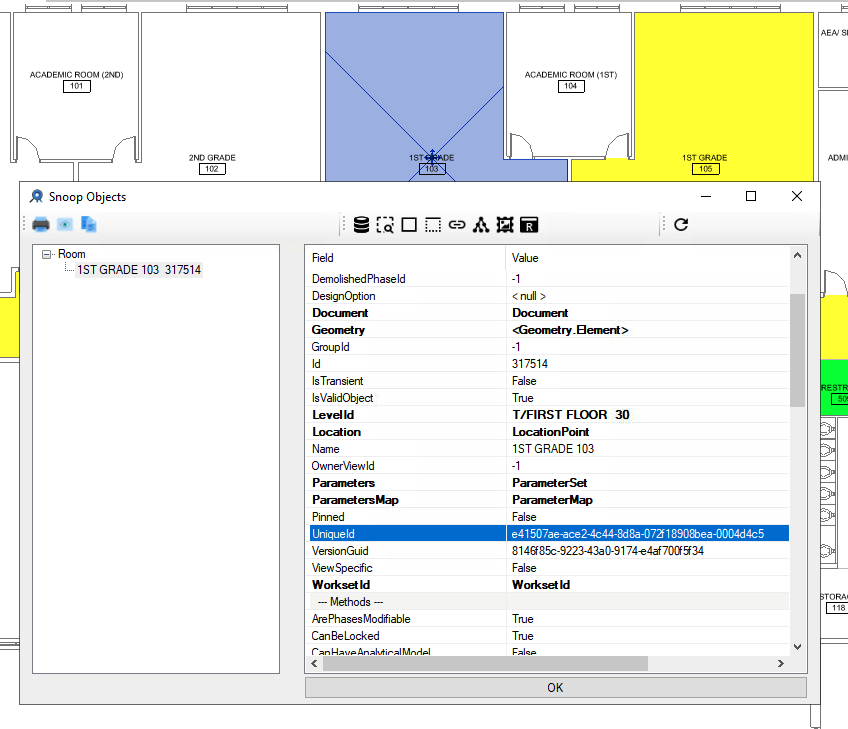
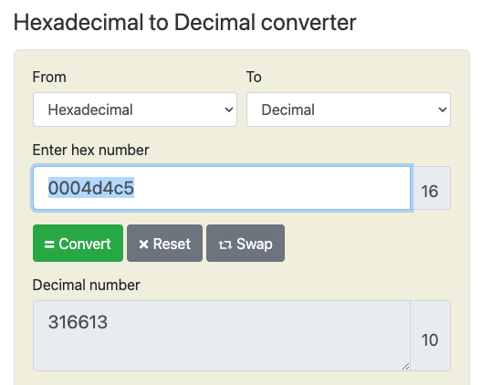
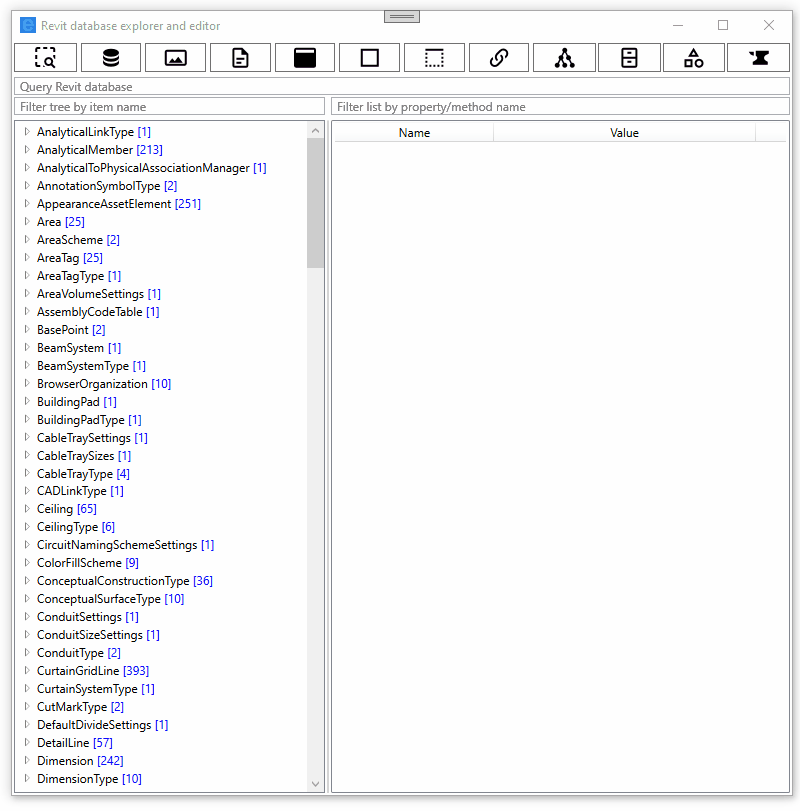

<head>
<meta http-equiv="Content-Type" content="text/html; charset=utf-8">
<link rel="stylesheet" type="text/css" href="bc.css">

</head>

<!---

- Revit database explorer RDBE
  https://github.com/jeremytammik/RevitLookup/discussions/141

- uniqueid and element id
  https://autodesk.slack.com/archives/C0SR6NAP8/p1657894007833539
  I would not endorse any of this procedural conversion.  It could change at any time.    In this particular example, it is likely this Element's id changed as a result of synchonization activities in a workshared models.  Newly created elements' ids are not fixed until they have been synchronized for the first time, as elements created by others may end up with the next id in sequence.

twitter:

The new powerful Revit Database Explorer provides a command line interface to filtered element collectors and the immutable UniqueId in the #RevitAPI @AutodeskForge @AutodeskRevit #bim #DynamoBim #ForgeDevCon https://autode.sk/uniqueid

A new initiative to improve RevitLookup, and take care handling and trying to convert between an element id and its unique id
&ndash; Immutable UniqueId, mutable element id
&ndash; Revit database explorer...

linkedin:

The new powerful Revit Database Explorer provides a command line interface to filtered element collectors and the immutable UniqueId in the #RevitAPI

https://autode.sk/uniqueid

A new initiative to improve RevitLookup, and take care handling and trying to convert between an element id and its unique id:

- Immutable UniqueId, mutable element id
- Revit database explorer...

#bim #DynamoBim #ForgeDevCon #Revit #API #IFC #SDK #AI #VisualStudio #Autodesk #AEC #adsk

the [Revit API discussion forum](http://forums.autodesk.com/t5/revit-api-forum/bd-p/160) thread

<pre class="code">
</pre>

-->

### Immutable UniqueId and Revit Database Explorer

The initiatives to improve RevitLookup and move it forward to become an ever more flexible and powerful tool are multiplying;
meanwhile, take care handling and trying to convert between element ids and their unique ids:

- [Immutable UniqueId, mutable element id](#2)
- [Revit database explorer](#3)

#### Immutable UniqueId, Mutable Element Id 

**Question:** Can I safely assume the integer value of the last part of an `Element` `UniqueId` interpreted as a hexadecimal value always equals its `ElementId` integer value?

This was suggested by the article
on [UniqueId, DWF and IFC GUID](https://thebuildingcoder.typepad.com/blog/2009/02/uniqueid-dwf-and-ifc-guid.html).

I encountered a situation where the last portion of the unique id hex value differs from the element id:

- UniqueId: e41507ae-ace2-4c44-8d8a-072f18908bea-0004d4c5
- Integer value of 0004d4c5: 316613
- ElementId: 316614
- Expected last hex string of the UniqueId : 0004D4C6

Here is the element data displayed by RevitLookup:

 <!-- 848 x 726 -->

Here is the hexadecimal conversion of the element id integer value:

 <!-- 527 x 422 -->

Reproducible code snippet:

<pre class="code">
&nbsp;&nbsp;static&nbsp;async&nbsp;Task&nbsp;Main(string[]&nbsp;args)
&nbsp;&nbsp;{
&nbsp;&nbsp;&nbsp;&nbsp;var&nbsp;a&nbsp;=&nbsp;&quot;e41507ae-ace2-4c44-8d8a-072f18908bea-0004d4c5&quot;;
&nbsp;&nbsp;&nbsp;&nbsp;Print(&quot;Revit&nbsp;UniqueId:&nbsp;&quot;&nbsp;+&nbsp;a);
 
&nbsp;&nbsp;&nbsp;&nbsp;Guid&nbsp;episodeId&nbsp;=&nbsp;new&nbsp;Guid(a.Substring(0,&nbsp;36));
 
&nbsp;&nbsp;&nbsp;&nbsp;int&nbsp;elementId&nbsp;=&nbsp;int.Parse(a.Substring(37),
&nbsp;&nbsp;&nbsp;&nbsp;&nbsp;&nbsp;NumberStyles.AllowHexSpecifier);
 
&nbsp;&nbsp;&nbsp;&nbsp;Print(&quot;&nbsp;EpisodeId:&nbsp;&quot;&nbsp;+&nbsp;episodeId.ToString());
&nbsp;&nbsp;&nbsp;&nbsp;Print(string.Format(&quot;&nbsp;ElementId:&nbsp;{0}&nbsp;=&nbsp;{1}&quot;,
&nbsp;&nbsp;&nbsp;&nbsp;&nbsp;&nbsp;elementId.ToString(),&nbsp;elementId.ToString(&quot;x8&quot;)));
 
&nbsp;&nbsp;&nbsp;&nbsp;int&nbsp;last_32_bits&nbsp;=&nbsp;int.Parse(a.Substring(28,&nbsp;8),
&nbsp;&nbsp;&nbsp;&nbsp;&nbsp;&nbsp;NumberStyles.AllowHexSpecifier);
 
&nbsp;&nbsp;&nbsp;&nbsp;int&nbsp;xor&nbsp;=&nbsp;last_32_bits&nbsp;^&nbsp;elementId;
 
&nbsp;&nbsp;&nbsp;&nbsp;a&nbsp;=&nbsp;a.Substring(0,&nbsp;28)&nbsp;+&nbsp;xor.ToString(&quot;x8&quot;);
 
&nbsp;&nbsp;&nbsp;&nbsp;Print(&quot;&nbsp;Guid:&nbsp;&quot;&nbsp;+&nbsp;a&nbsp;+&nbsp;&quot;\n&quot;);
&nbsp;&nbsp;}
</pre>

**Answer:** I would not endorse any of this procedural conversion.
It could change at any time.
In this particular example, it is likely that this element's id changed as a result of synchronisation activities in a workshared models.
Newly created elements' ids are not fixed until they have been synchronized for the first time, as elements created by others may end up with the next id in sequence.

**Response:** Yes, the RVT model is a workshared one.
It makes sense now.
I will not use this UinqueId-ElementId conversion that might change at any time.

Many thanks to Scott Conover for clarifying this behaviour.

#### Revit Database Explorer

[NeVeSpl](https://github.com/NeVeSpl) initiated a new RevitLookup discussion #141 presenting
the [Revit database explorer (RDBE) project](https://github.com/jeremytammik/RevitLookup/discussions/141):

> Let me join the race to build the first fully working WPF version of RevitLookup.
I know that [Nice3point](https://github.com/Nice3point) is working on one,
cf. [Enhancements #124](https://github.com/jeremytammik/RevitLookup/discussions/124),
and that [chuongmep](https://github.com/chuongmep) is working
on [RevitLookupWpf](https://github.com/weianweigan/RevitLookupWpf).
I started last, two weeks ago, and mine is almost ready 😊; there are still a few things to correct, but it is already usable:

> 
<a href="https://github.com/NeVeSpl/RevitDBExplorer">github.com/NeVeSpl/RevitDBExplorer</a>

> This animation demonstrates the possibility to query the Revit database interactively from the UI:

 <!-- 800 x 811 -->

Many thanks to NeVeSpl for this exciting initiative!

It will be interesting to see how things pan out in the long haul.
Optimally, maybe the three separate projects can converge and exploit synchronicity... good luck and much success to all three!

The interactive command line interface to drive the creation of filtered element collectors might fit in very nicely into a more complete interactive shell, like the initiative of @chuongmep
to [reinvigorate RevitPythonShell and hook it up with RevitLookup](https://thebuildingcoder.typepad.com/blog/2022/07/mep-api-intro-and-revitpythonshell-lookup-nuptials.html#3)

Nice3point adds: Sounds interesting; my team and I will update the interface as soon as we have time, there will also be a search, OTA update and new context menu elements. Here it is important to understand that what is needed is not WPF / WinForms, but the possibility to extend the functionality. It’s more difficult to do this on Forms, where the logic is mixed with the UI, which is bad.

