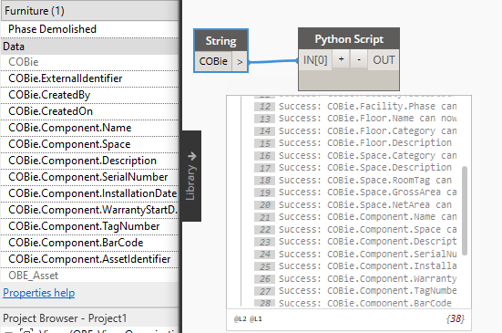

<head>
<meta http-equiv="Content-Type" content="text/html; charset=utf-8">
<link rel="stylesheet" type="text/css" href="bc.css">

</head>

<!---

- another look at fuzz:
  Unit converted parameter value not matching parsed string value
  https://forums.autodesk.com/t5/revit-api-forum/unit-converted-parameter-value-not-matching-parsed-string-value/m-p/11353053
  Comparing double values in C#
  https://stackoverflow.com/questions/1398753/comparing-double-values-in-c-sharp
  
- forge ifc exporter
  Eason Kang updated his IFC exporter addin.
  Now it supports user defined property sets and the new JSON schema from Revit IFC repo
  You can find it here:
  https://github.com/yiskang/forge-revit-ifc-exporter-appbundle

- Element.get_Parameter(Guid) also return type parameter
  https://forums.autodesk.com/t5/revit-api-forum/element-get-parameter-guid-returns-unreliable-result/m-p/11340145

- Change Button's Tab/Panel Position
  https://forums.autodesk.com/t5/revit-api-forum/change-button-s-tab-panel-position/td-p/11348124

- Forge hackathon
  https://www.keanw.com/2022/08/register-today-for-this-years-forge-hackathon.html

- Are you concerned about the increase in artificial intelligence?
  I am more concerned about the decrease in real intelligence.
  
- create 27k instances:

create_27k_instances.png

Paolo Serra
 29 Jul at 15:42
Hi, I have a customer that needs to create 27000+ FamilyInstances in a Revit Document, the performance of Document.Create.NewFamilyInstance(XYZ, FamilySymbol, StructuralType) degrades from 190 FamilyInstances / sec to 4 FamilyInstances / sec over the course of the execution (more than 1.5h). The process memory maxes at 1.5GB on my machine. Are there any recommendations on how to improve the performance? I was thinking that splitting the task into chunks of not more than 200 FamilyInstances might produce some benefits but I'm wondering if the time required to commit and start the transactions would erode them. Any advice is much appreciated. (edited) 

13 replies

Boris Shafiro
  10 days ago
@Aishwarya Khaire
 could you please take a look? ^^^

Aishwarya Khaire
  10 days ago
Sure. Would be happy to take a look.

Scott Conover
  10 days ago
So we used to have batch creation routines for FamilyInstances.  But those were only needed because the API used to regenerate after nearly every model change, and this could be much less performant when not necessary.  So when we switched those became unneeded and were removed (mostly, I see some remnants but not useful ones).
Some of the problems I suspect relate to adding 27000+ expanded elements.  There is no way to unexpand the elements in memory once they are expanded.   If this is a batch/non-visible process maybe saving/closing the model and reopening periodically might help with the overall performance and memory consumption?   If the model is visible this might be disruptive to the user.  Maybe 
@Tamas Badics
 also has some ideas about how to improve performance.

Scott Conover
  10 days ago
Actually, we do still have a routine in place, NewFamilyInstances2() - horrible name - takes a collection of family instance creation data objects.  I suspect it won't perform any better than individual calls, but perhaps...
:+1::skin-tone-2:
1

Paolo Serra
  10 days ago
I'll give it a go and see if produces any better results, I'll let you now. Thank you all for your prompt response

Jacob Small
  10 days ago
If it's a regeneration issue perhaps placing empty families first to reduce (if not remove) the regeneration time, then swapping for the family you want to use?

Paolo Serra
  10 days ago
I used the NewFamilyInstances2() in batches of 200, without committing the transaction, and it was able to generate the families in 4:48 seconds, very promising. Now I need to see how it handles updating the parameters of the instances, would be nice to have a similar method (edited) 
:+1:
1

Paolo Serra
  10 days ago
@Jacob Small
 FYI regeneration is not an issue for now but I'll keep your suggestion in case it becomes a problem, thanks
:+1:
1

Paolo Serra
  9 days ago
with further optimization on the logic the instances went down to about 22000 and even setting 3/4 parameters from Excel on each instance and running interpolations takes not more than 3.5 minutes, that is a great result, thanks 
@Scott Conover
 for pointing me in the right direction

Scott Conover
  9 days ago
Now I'm wondering what type of optimizations are in that NewFamilyInstances2() method.  I thought it was just trying to avoid excess regenerations... (edited) 

Paolo Serra
  9 days ago
they basically want to create a Voxel representation of the soil based on boreholes samples, if there is some kind of vectorization happening in NewFamilyInstances2() it would be nice to have a similar approach to edit parameters in bulk
image.png 
image.png

Tamas Badics
  9 days ago
Looks like NewFamilyInstance() commits a subtransaction for each call. That may be the main reason why it is much slower than the batch NewFamilyInstance2() method. Still it may be worth debugging fully.

Rahul Bhobe
  4 days ago
@Paolo Serra

Is the Revit model generally slow after having placed so many instances or only the act of placing the instances? If the model in general slow, does closing the file and opening it improves the performance? Is there a sample revit file for the image you posted?

- 
Set Parameter to Vary by Group Instance
https://forum.dynamobim.com/t/set-parameter-to-vary-by-group-instance/79882
Mark.Ackerley

Might be useful to people…

This is limited by the types of parameter which are allowed to vary by group instance, this does not include Yes/No or Length.

Thanks to @jeremytammik and anyone else who has done work in this area.

set_param_vary_by_group_inst.png 551 x 365

twitter:

 the #RevitAPI @AutodeskForge @AutodeskRevit #bim #DynamoBim #ForgeDevCon 

&ndash;
...

linkedin:

#bim #DynamoBim #ForgeDevCon #Revit #API #IFC #SDK #AI #VisualStudio #Autodesk #AEC #adsk

the [Revit API discussion forum](http://forums.autodesk.com/t5/revit-api-forum/bd-p/160) thread

<pre class="code">
</pre>

-->

### 

#### 

**Question:** 

 <!-- 848 x 726 -->

Here is t

<pre class="code">

</pre>

**Answer:** 

**Response:** 

#### Set Parameter to Vary by Group Instance

Mark Ackerley demonstrates how
to [set parameter to vary by group instance](https://forum.dynamobim.com/t/set-parameter-to-vary-by-group-instance) in
the [Dynamo BIM forum](https://forum.dynamobim.com), saying:

> Might be useful to people…

> This is limited by the types of parameter which are allowed to vary by group instance, this does not include Yes/No or Length.

> Thanks to @jeremytammik and anyone else who has done work in this area.

 <!-- 551 x 365 -->

<pre class="prettyprint">
import clr

import System
from System import *

clr.AddReference('RevitServices')
import RevitServices
from RevitServices.Persistence import DocumentManager
from RevitServices.Transactions import TransactionManager
from System.Collections.Generic import *

clr.AddReference('RevitAPI')
import Autodesk
from Autodesk.Revit.DB import *

doc = DocumentManager.Instance.CurrentDBDocument

# The inputs to this node will be stored as a list in the IN variables.
dataEnteringNode = IN
keyWord = IN[0]

def isInstance(definition_Name):
	#for some reason, returning the name of the Key in the bindings iterator
	#fails sometimes and says item can't be managed? so then restart Revit
	
	#the list of parameters in doc.ParameterBindings is only the ones which are
	#added in the Project Parameters box, so you're not getting ones which
	#just exist in families
	
	#this is the only way to see if a parameter is 'bound' to the doc as
	#a type or an instance parameter
	
	bindings = doc.ParameterBindings
	it = doc.ParameterBindings.ForwardIterator()
	defs = []
	value = False
	while(it.MoveNext()):
		d = it.Key
		b = it.Current
		if d.Name == definition_Name and b.GetType() == InstanceBinding:
			value = True
			break
	return value	

def canBeEditableInGroup(parameter):
  parameter_Type = parameter.ParameterType
  
  variable_Parameter_Types_List = [ParameterType.Text, 
    ParameterType.Area, 
    ParameterType.Volume, 
    ParameterType.Currency, 
    ParameterType.MassDensity, 
    ParameterType.URL, 
    ParameterType.Material]
  
  if parameter_Type in variable_Parameter_Types_List:
    return True
  else:
    return False
    
# Place your code below this line
output = []
#catch anything that doesn't work and output the error
sPs = FilteredElementCollector(doc).OfClass(SharedParameterElement)

try:
  sPs = FilteredElementCollector(doc).OfClass(SharedParameterElement)
  errorReport = None 

  #begin transaction
  TransactionManager.Instance.EnsureInTransaction(doc)
  for sP in sPs:
    #we are interested in the shared parameter 'definition'
    #the 'definition' is a container of the shared parameter
    #that holds the information about whether
    #the parameter is variable by instance in a group
    
    #we only want the shared parameters with our key word
    #we only want them if they are a type which can vary
    #we only want them if they are not already true
    #we only want them if they are instance parameters
    
    definition = sP.GetDefinition()  

    varies_Query = definition.VariesAcrossGroups
    

    if keyWord in definition.Name and canBeEditableInGroup(definition) and isInstance(definition.Name) and varies_Query != True:
      try:
        definition.SetAllowVaryBetweenGroups(doc, True)
        output.append("Success: " + definition.Name + " can now vary across group instances")
      except:
        import traceback
        errorReport_SP = traceback.format_exc()
        exception = ' does not support the specified value of allowVaryBetweenGroups'        
        if exception in errorReport_SP:
          output.append("Failure: " + definition.Name + "cannot be set to vary between groups")
        else:
          output.append([definition.Name, errorReport_SP])

  #finish transaction
  TransactionManager.Instance.TransactionTaskDone()

#Assign your output to the OUT variable.
except:
  import traceback
  errorReport = traceback.format_exc()

if errorReport == None:
  OUT = output

else:
  OUT = errorReport

OUT = output
</pre>

Many thanks to Mark for sharing this useful solution!
