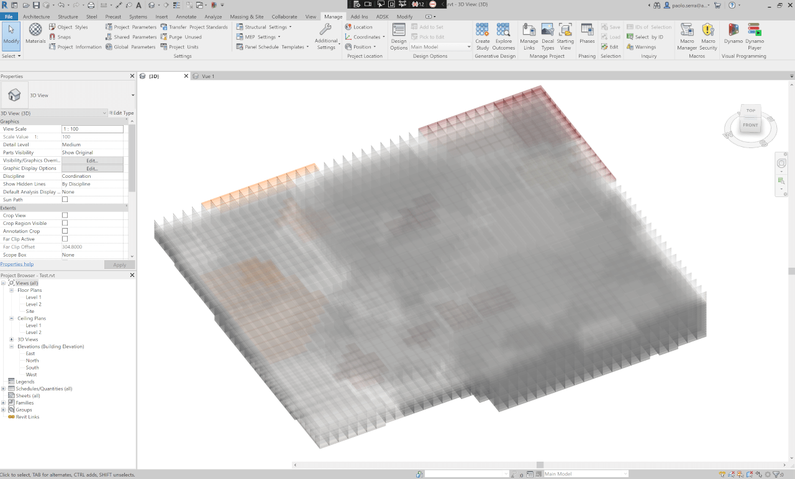
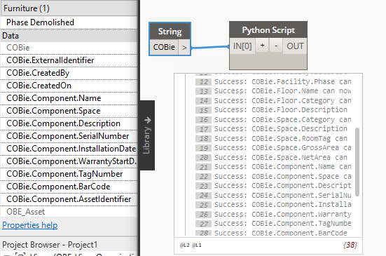

<head>
<meta http-equiv="Content-Type" content="text/html; charset=utf-8">
<link rel="stylesheet" type="text/css" href="bc.css">

</head>

<!---
  
- Forge hackathon
  https://www.keanw.com/2022/08/register-today-for-this-years-forge-hackathon.html
  
- forge ifc exporter
  Eason Kang updated his IFC exporter addin.
  Now it supports user defined property sets and the new JSON schema from Revit IFC repo
  You can find it here:
  https://github.com/yiskang/forge-revit-ifc-exporter-appbundle

- create 27k instances:
  create_27k_instances.png
  Paolo Serra
  Hi, I have a customer that needs to create 27000+ FamilyInstances in a Revit Document, the performance of Document.Create.NewFamilyInstance(XYZ, FamilySymbol, StructuralType) degrades from 190 FamilyInstances / sec to 4 FamilyInstances / sec over the course of the execution (more than 1.5h). The process memory maxes at 1.5GB on my machine. Are there any recommendations on how to improve the performance? I was thinking that splitting the task into chunks of not more than 200 FamilyInstances might produce some benefits but I'm wondering if the time required to commit and start the transactions would erode them. Any advice is much appreciated. (edited) 
  Scott Conover
  we used to have batch creation routines for FamilyInstances.  But those were only needed because the API used to regenerate after nearly every model change, and this could be much less performant when not necessary.  So when we switched those became unneeded and were removed (mostly, I see some remnants but not useful ones).
  Some of the problems I suspect relate to adding 27000+ expanded elements.  There is no way to unexpand the elements in memory once they are expanded.   If this is a batch/non-visible process maybe saving/closing the model and reopening periodically might help with the overall performance and memory consumption?   If the model is visible this might be disruptive to the user.
  Actually, we do still have a routine in place, NewFamilyInstances2() - horrible name - takes a collection of family instance creation data objects.  I suspect it won't perform any better than individual calls, but perhaps...
  Paolo Serra
  I'll give it a go and see if produces any better results, I'll let you now. Thank you all for your prompt response
  Jacob Small
  If it's a regeneration issue perhaps placing empty families first to reduce (if not remove) the regeneration time, then swapping for the family you want to use?
  Paolo Serra
  I used the NewFamilyInstances2() in batches of 200, without committing the transaction, and it was able to generate the families in 4:48 seconds, very promising. Now I need to see how it handles updating the parameters of the instances, would be nice to have a similar method (edited) 
  Paolo Serra
  @Jacob Small  FYI regeneration is not an issue for now but I'll keep your suggestion in case it becomes a problem, thanks
  Paolo Serra
  with further optimization on the logic the instances went down to about 22000 and even setting 3/4 parameters from Excel on each instance and running interpolations takes not more than 3.5 minutes, that is a great result.
  Scott Conover
  Now I'm wondering what type of optimizations are in that NewFamilyInstances2() method.  I thought it was just trying to avoid excess regenerations...
  Paolo Serra
  they basically want to create a Voxel representation of the soil based on boreholes samples, if there is some kind of vectorization happening in NewFamilyInstances2() it would be nice to have a similar approach to edit parameters in bulk
  image.png
  Tamas Badics
  Looks like NewFamilyInstance() commits a subtransaction for each call. That may be the main reason why it is much slower than the batch NewFamilyInstance2() method. Still it may be worth debugging fully.
  Rahul Bhobe
  Is the Revit model generally slow after having placed so many instances or only the act of placing the instances? If the model in general slow, does closing the file and opening it improves the performance? Is there a sample revit file for the image you posted?

- Set Parameter to Vary by Group Instance
  https://forum.dynamobim.com/t/set-parameter-to-vary-by-group-instance/79882
  Mark.Ackerley

- grammarly

twitter:

A Forge hackathon coming up, IFC property sets, NewFamilyInstances2 creates 27000 instances in bulk and parameters that vary by group instance in the #RevitAPI @AutodeskForge @AutodeskRevit #bim #DynamoBim #ForgeDevCon https://autode.sk/bulkinstances

Today, we talk about Forge, IFC, family instance creation in bulk, parameters that vary by group instance and a handy spell checker
&ndash; Forge hackathon
&ndash; Forge IFC exporter
&ndash; NewFamilyInstances2 creates 27000 instances
&ndash; Set parameter to vary by group instance
&ndash; AI-enhanced web-based spell checker...

linkedin:

A Forge hackathon coming up, IFC property sets, NewFamilyInstances2 creates 27000 instances in bulk and parameters that vary by group instance in the #RevitAPI

https://autode.sk/bulkinstances

Today, we talk about Forge, IFC, family instance creation in bulk, parameters that vary by group instance and a handy spell checker:

- Forge hackathon
- Forge IFC exporter
- NewFamilyInstances2 creates 27000 instances
- Set parameter to vary by group instance
- AI-enhanced web-based spell checker...

#bim #DynamoBim #ForgeDevCon #Revit #API #IFC #SDK #AI #VisualStudio #Autodesk #AEC #adsk

the [Revit API discussion forum](http://forums.autodesk.com/t5/revit-api-forum/bd-p/160) thread

<pre class="code">
</pre>

-->

### IFC Property Set, Bulk Instances and Vary by Group

Today, we talk about Forge, IFC, family instance creation in bulk, parameters that vary by group instance and a handy spell checker:

- [Forge hackathon](#2)
- [Forge IFC exporter](#3)
- [NewFamilyInstances2 creates 27000 instances](#4)
- [Set parameter to vary by group instance](#5)
- [AI-enhanced web-based spell checker](#6)

#### Forge Hackathon

[Registration is open](https://forge.autodesk.com/hackathon) for 
the [Forge Hackathon 2022](https://forge.autodesk.com/blog/save-date-2022-forge-hackathon),
being held virtually from September 19-23.

Prize categories:

- You had me at 3D game
- Show me the Data!
- I feel the need, the need for Digital Twin
- Task automation is a state of mind
- There’s no place like ACC

Judging criteria:

- Innovation
- Elegance
- Business problem solved
- Progress made during the week
- Depth of Forge use
- Wow factor

For further details, please refer to the [Forge Hackathon 2022 blog post](https://forge.autodesk.com/blog/save-date-2022-forge-hackathon).

 <!-- 1200 x 700 -->

#### Forge IFC Exporter 

Eason Kang updated his IFC exporter add-in to now support user defined property sets and the new JSON schema from the Revit IFC repository.
Check it out in
the [forge-revit-ifc-exporter-appbundle GitHub repo](https://github.com/yiskang/forge-revit-ifc-exporter-appbundle).

#### NewFamilyInstances2 Can Create 27000 Instances

Here are some useful and exciting notes from an internal discussion on performance issues creating 27000 family instances:

**Question:** I need to create 27000+ FamilyInstances in a Revit Document.

However, this takes more than 1.5 hours, because the performance of *Document.Create.NewFamilyInstance(XYZ, FamilySymbol, StructuralType)* degrades from 190 FamilyInstances / sec to 4 FamilyInstances / sec over the course of the execution.
The process memory maxes at 1.5 GB on my machine.
Are there any recommendations on how to improve the performance?
I was thinking that splitting the task into chunks of not more than 200 FamilyInstances might produce some benefits but I'm wondering if the time required to commit and start the transactions would erode them. 

**Answer:** We used to have batch creation routines for FamilyInstances.
Back then, those were needed, because the API used to regenerate after nearly every model change, and this could be much less performant when not necessary.
So, when we switched, those became less important and were mostly removed.
Some of the problems I suspect relate to adding 27000+ expanded elements.
There is no way to unexpand the elements in memory once they are expanded.
If this is a batch/non-visible process, maybe saving/closing the model and reopening periodically might help with the overall performance and memory consumption?
If the model is visible, this might be disruptive to the user.

Actually, we do still have one routine in place, `NewFamilyInstances2` &ndash; horrible name &ndash; takes a collection of family instance creation data objects. 

If it's a regeneration issue, perhaps placing empty families first to reduce (if not remove) the regeneration time, then swapping for the family you want to use?

**Response:** Regeneration is not an issue for now, but I'll keep that suggestion in mind in case it becomes a problem, thanks.

I used `NewFamilyInstances2` in batches of 200, without committing the transaction, and it was able to generate the families in 4:48 seconds, very promising.
Now I need to see how it handles updating the parameters of the instances; it would be nice to have a similar method for that.

with further optimization on the logic, the instances went down to about 22000 and even setting 3 or 4 parameters from Excel on each instance and running interpolations takes less than 3.5 minutes, that is a great result.

**Answer:** Now I'm wondering what type of optimizations are in that `NewFamilyInstances2` method.
I thought it was just trying to avoid excess regenerations...

**Response:** They display a Voxel representation of soil based on boreholes samples; if there is some kind of vectorization happening in `NewFamilyInstances2`, it would be nice to have a similar approach to edit parameters in bulk.

 <!-- 1280 x 773 -->

**Answer:** Looks like `NewFamilyInstance` commits a subtransaction for each call.
That may be the main reason why it is much slower than the batch `NewFamilyInstance2` method.

#### Set Parameter to Vary by Group Instance

Mark Ackerley demonstrates how
to [set parameter to vary by group instance](https://forum.dynamobim.com/t/set-parameter-to-vary-by-group-instance) in
the [Dynamo BIM forum](https://forum.dynamobim.com), saying:

> Might be useful to people…

> This is limited by the types of parameter which are allowed to vary by group instance, this does not include Yes/No or Length.

> Thanks to @jeremytammik and anyone else who has done work in this area.

 <!-- 551 x 365 -->

<pre class="prettyprint">
import clr

import System
from System import *

clr.AddReference('RevitServices')
import RevitServices
from RevitServices.Persistence import DocumentManager
from RevitServices.Transactions import TransactionManager
from System.Collections.Generic import *

clr.AddReference('RevitAPI')
import Autodesk
from Autodesk.Revit.DB import *

doc = DocumentManager.Instance.CurrentDBDocument

# The inputs to this node will be stored as a list in the IN variables.
dataEnteringNode = IN
keyWord = IN[0]

def isInstance(definition_Name):
	#for some reason, returning the name of the Key in the bindings iterator
	#fails sometimes and says item can't be managed? so then restart Revit
	
	#the list of parameters in doc.ParameterBindings is only the ones which are
	#added in the Project Parameters box, so you're not getting ones which
	#just exist in families
	
	#this is the only way to see if a parameter is 'bound' to the doc as
	#a type or an instance parameter
	
	bindings = doc.ParameterBindings
	it = doc.ParameterBindings.ForwardIterator()
	defs = []
	value = False
	while(it.MoveNext()):
		d = it.Key
		b = it.Current
		if d.Name == definition_Name and b.GetType() == InstanceBinding:
			value = True
			break
	return value	

def canBeEditableInGroup(parameter):
  parameter_Type = parameter.ParameterType
  
  variable_Parameter_Types_List = [ParameterType.Text, 
    ParameterType.Area, 
    ParameterType.Volume, 
    ParameterType.Currency, 
    ParameterType.MassDensity, 
    ParameterType.URL, 
    ParameterType.Material]
  
  if parameter_Type in variable_Parameter_Types_List:
    return True
  else:
    return False
    
# Place your code below this line
output = []
#catch anything that doesn't work and output the error
sPs = FilteredElementCollector(doc).OfClass(SharedParameterElement)

try:
  sPs = FilteredElementCollector(doc).OfClass(SharedParameterElement)
  errorReport = None 

  #begin transaction
  TransactionManager.Instance.EnsureInTransaction(doc)
  for sP in sPs:
    #we are interested in the shared parameter 'definition'
    #the 'definition' is a container of the shared parameter
    #that holds the information about whether
    #the parameter is variable by instance in a group
    
    #we only want the shared parameters with our key word
    #we only want them if they are a type which can vary
    #we only want them if they are not already true
    #we only want them if they are instance parameters
    
    definition = sP.GetDefinition()  

    varies_Query = definition.VariesAcrossGroups
    

    if keyWord in definition.Name and canBeEditableInGroup(definition) and isInstance(definition.Name) and varies_Query != True:
      try:
        definition.SetAllowVaryBetweenGroups(doc, True)
        output.append("Success: " + definition.Name + " can now vary across group instances")
      except:
        import traceback
        errorReport_SP = traceback.format_exc()
        exception = ' does not support the specified value of allowVaryBetweenGroups'        
        if exception in errorReport_SP:
          output.append("Failure: " + definition.Name + "cannot be set to vary between groups")
        else:
          output.append([definition.Name, errorReport_SP])

  #finish transaction
  TransactionManager.Instance.TransactionTaskDone()

#Assign your output to the OUT variable.
except:
  import traceback
  errorReport = traceback.format_exc()

if errorReport == None:
  OUT = output

else:
  OUT = errorReport

OUT = output
</pre>

Many thanks to Mark for sharing this useful solution!

#### AI-Enhanced Web-Based Spell Checker

I recently installed
the [Grammarly](https://www.grammarly.com) integrated
AI-enhanced spell and grammar checking including advanced writing support such as suggestions on better wording for clarity.
It works in web browser edit boxes and also in my email editor.
It made several suggestions that improved my wording and I am quite impressed, with better suggestions than any other tools I ever tried in the past...

Somebody else suggested
the [websiteplanet Online Spell Checker](https://www.websiteplanet.com/webtools/spell-checker),
but I have not looked at all at that myself.

On the topic of AI...

Are you concerned about the increase in artificial intelligence?
 I am more concerned about the decrease in real intelligence.

