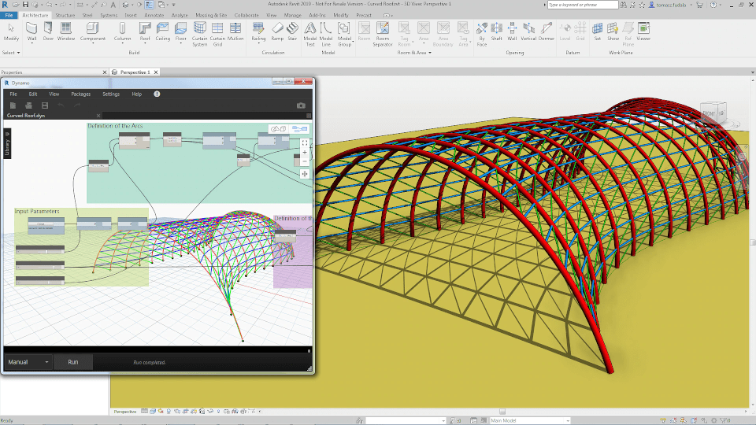
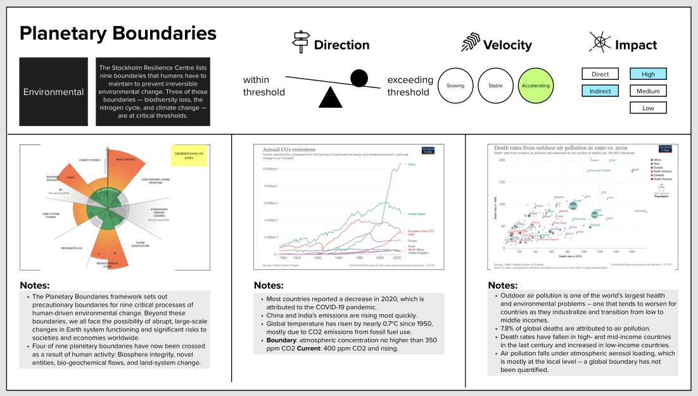

<head>
<meta http-equiv="Content-Type" content="text/html; charset=utf-8">
<link rel="stylesheet" type="text/css" href="bc.css">

</head>

<!---

- Dynamo versus pure Revit API
  https://forums.autodesk.com/t5/revit-api-forum/dynamo/m-p/11380940

- home planet at great risk
  The Nine Planetary Boundaries
  https://labs.blogs.com/its_alive_in_the_lab/2022/08/nine-planetary-boundaries.html

twitter:

Risking our one and only home planet and the survival of civilisation as we know it by crossing planetary boundaries, we choose whether to Dy or not to Dy, not just in the #RevitAPI @AutodeskForge @AutodeskRevit #bim #DynamoBim #ForgeDevCon https://autode.sk/todyornottody

Let's look at two serious choices that we are facing &ndash; one more serious than the other
&ndash; To Dynamo or not to Dynamo
&ndash; Home planet at great risk...

linkedin:

Risking our one and only home planet and the survival of civilisation as we know it by crossing planetary boundaries, we choose whether to Dy or not to Dy, not just in the #RevitAPI 

https://autode.sk/todyornottody

Let's look at two serious choices that we are facing - one more serious than the other:

- To Dynamo or not to Dynamo
- Home planet at great risk...

#bim #DynamoBim #ForgeDevCon #Revit #API #IFC #SDK #AI #VisualStudio #Autodesk #AEC #adsk

the [Revit API discussion forum](http://forums.autodesk.com/t5/revit-api-forum/bd-p/160) thread

<pre class="code">
</pre>

-->

### Home Planet and to Dy or Not to Dy

Let's look at two serious choices that we are facing &ndash; one more serious than the other:

- [To Dynamo or not to Dynamo](#2)
- [Home planet at great risk](#3)

#### To Dynamo or Not to Dynamo

I explained some aspects of getting started with the Revit API and Dynamo programming, as well as the choice between working with Dynamo versus the pure Revit API, in
the [Revit API discussion forum](http://forums.autodesk.com/t5/revit-api-forum/bd-p/160) thread
on [Dynamo](https://forums.autodesk.com/t5/revit-api-forum/dynamo/m-p/11380940):

**Question:** I am completely new to Dynamo.
Is there a way to generate different plate sizes in Revit using a `.txt` file with Dynamo?
I have `txt` files with all the information needed to generate steel frames.
Before buying Revit, I would like to know if `txt` data can be uploaded into Revit and used to generate 3D models (maybe by using Dynamo).

**Answer:** Welcome to the Revit API!

Yes, what you describe is possible in Revit.

However, please note that this discussion forum is dedicated to programming Revit using the standard .NET Revit API.

If you specifically want to implement your solution using Dynamo, the best place to discuss it is probably in
the [Dynamo discussion forum](https://forum.dynamobim.com).

If you want to work with the standard .NET Revit API, please read
the [Revit API getting started material](http://thebuildingcoder.typepad.com/blog/about-the-author.html#2) first
and work through the DevTV and My first Revit plugin tutorials.

**Response:** Thank you. Can I ask you one more question?

Is standard .NET Revit API better than Dynamo to import text data into Revit to auto generate steel frames?
I have a 3rd party program that designs custom steel frames.
The data files have everything needed to generate a 3D model.
I don't know Dynamo or standard .NET Revit API so I will be starting from scratch.
I know just enough Revit to be dangerous.
I  really appreciate your advice!

**Answer:** Dynamo is a wrapper around the standard Revit API; search these articles for 'dynamo' and 'wrapper':

<ul>
<li><a href="http://thebuildingcoder.typepad.com/blog/2016/10/rtc-revit-api-panel-idea-station-edit-and-continue.html">RTC Revit API Panel, Idea Station, Edit and Continue</a></li>
<li><a href="https://thebuildingcoder.typepad.com/blog/2018/12/dynamo-symbol-vs-type-and-exporter-exception.html">Dynamo, Symbol vs Type and Exporter Exception</a></li>
<li><a href="https://thebuildingcoder.typepad.com/blog/2019/08/zero-touch-node-element-wrapper-and-load-from-stream.html">Zero Touch Node Wrapper and Load from Stream</a></li>
<li><a href="https://thebuildingcoder.typepad.com/blog/2019/08/11-years-and-revit-api-docs-full-text-search.html">11 Years and Revit API Docs Full Text Search</a></li>
<li><a href="https://thebuildingcoder.typepad.com/blog/2022/04/tbc-samples-2023-and-the-new-structural-api.html">TBC Samples 2023 and the New Structural API</a></li>
</ul>

Dynamo also adds some functionality of its own, e.g., its own geometry library.

For your purposes, I think both would work well.

For learning purposes, I would suggest starting step by step with different areas:

- Revit end-user interface, optimal workflow and best practices
- Programming basics, e.g., a non-Revit-related Python tutorial
- .NET programming basics, e.g., a non-Revit-related C# tutorial
- Revit API basics, e.g., the My First Revit Plug-in video tutorial
- A Dynamo tutorial

The first is vital. You need that to understand and solve your Revit task.
Only after understanding it from a UI point of view will you be able to address it effectively from the API side of things.

Learning a little bit of Python is highly recommended.
It is the most didactical language there is, and learning basic programming with it is fun and easy.

.NET is the foundation of the Revit API, so you need some understanding of that.

You need to understand the architecture of the Revit API to get an add-in implemented, loaded and running.

You can quickly dive into Dynamo and then compare to see what you prefer:

- Python versus C#
- Pure Revit API versus Dynamo

Rereading your question, I think that the most important step for you first of all is the first one: research the exact manual steps required in the user interface to read the available text data and generate your steel framing in Revit from that. I assume that the text data specifies the steel framing cross-section in some way, either by using predefined profile definitions or specifying the exact geometry of the cross-section. So, how can that data be transformed into Revit to define an appropriate steel framing element type? Once you have the profiles and element types defined, I guess placing the steel framing is simply a matter of reading the beam, column and framing element start and end point and placing straight segments. Finally, your text data may be specifying how the elements are connected and joined. That may be very complex. All of this is probably non-trivial to achieve in the UI. You need to know the exact UI approach, best practices and detailed execution steps before you can start thinking about programming it.

The pure Revit API will give you the greatest flexibility. The Dynamo framework may possibly offer predefined existing libraries and packages that you can use, and you may find it easier to learn. That is a question of taste.

But first things first: what do you have, what do you need, and how to achieve it optimally in the UI, applying best practices?

 <!-- 960 x 540 -->

#### Home Planet at Great Risk

Our one and only home planet is at great risk and requires immediate radical action if we wish it to continue sustaining life and human civilisation in the manner we are accustomed to.

This fact is expressed very clearly and with as much hope as we can possibly muster
by [Sir David Attenborough presenting Breaking Boundaries &ndash; the Science of Our Planet](https://youtu.be/2Jq23mSDh9U),
a 10-minute preview of a Netflix documentary:

> Breaking Boundaries tells the story of the most important scientific discovery of our time &ndash; that humanity has pushed Earth beyond the boundaries that have kept Earth stable for 10,000 years, since the dawn of civilization. The 75-minute film takes the audience on a journey of discovery of planetary thresholds we must not exceed, not just for the stability of our planet, but for the future of humanity. It offers up the solutions we can and must put in place now if we are to protect Earth’s life support systems.

<iframe width="480" height="270" src="https://www.youtube.com/embed/2Jq23mSDh9U" title="YouTube video player" frameborder="0" allow="accelerometer; autoplay; clipboard-write; encrypted-media; gyroscope; picture-in-picture" allowfullscreen></iframe>

The boundaries he talks about are the nine planet boundaries identified by
the [Stockholm Resilience Centre](https://www.stockholmresilience.org).
It presents the film in more detail in its research news:
[New Netflix documentary brings the planetary boundaries to the world](https://www.stockholmresilience.org/research/research-news/2021-04-30-new-netflix-documentary-brings-the-planetary-boundaries-to-the-world.html).

Here are some of the comments on the YouTube preview that stood out for me:

- This was frightening but gives hope. So much waste and for what? Our planet and life are amazing.
- Just imagine a civilization that dreamed up 52 different flavors of ice cream, and the atomic bomb &ndash; being so lazy, it could NOT SAVE ITSELF from a looming, self-made extinction level event. The Age of Stupid is upon us, and David Attenborough is sounding the alarm.
- It's great that people are starting to understand some of the details of the climate and ecological crisis. It should also be known that governments around the world have known the risks for a very long time, and most have chosen to do next to nothing, knowingly submitting the next generations to unimaginable suffering.
  We cannot rely on these political systems to do what is necessary. It is time for ordinary people to work together and demand a better future. I believe our best bet is to join Extinction Rebellion and act as if the truth is real
- There's a huge disconnect between our understanding of planetary boundaries and our current lifestyles. We admire what he does and says, but who is actually willing to stop flying? To cut their holiday driving? To simplify their lifestyle? To buy less stuff? We're just not getting it, are we &ndash; we're all waiting for someone else to do something. 
  What will we say to our kids, a couple of decades hence &ndash; when it's too late? 
  The responsible thing would be to get political and demand change NOW &ndash; even if it hurts.

Scott Sheppard explains several other aspects and points out detailed research results in each of the critical areas in his article explaining
how [Autodesk software can help address the nine planetary boundaries](https://labs.blogs.com/its_alive_in_the_lab/2022/08/nine-planetary-boundaries.html);
I quote from there:

 <!-- 1102 x 625 -->

Data sources for the charts:

<ul>
<li><a href="https://www.stockholmresilience.org/research/research-news/2015-01-15-planetary-boundaries---an-update.html">Stockholm Resilience Centre</a></li>
<li><a href="Planetary%20Boundaries &ndash; an update">Our World in Data: Annual CO2 Emissions</a></li>
<li><a href="https://ourworldindata.org/outdoor-air-pollution">Our World in Data: Outdoor Air Pollution</a></li>
</ul>

&quot;Save the Planet&quot; is a misnomer. Whether the result of human activity or natural long-term planetary cycles, planet change will not destroy the planet, but it might make it inhospitable to humans. The Earth is our home. If you stopped paying your electric bill, didn&#39;t repair your air conditioner, or got the water turned off to your home, your house would still stand and not crumble, but you wouldn&#39;t want to live there. So regardless of the cause of planetary change, we must take care of the Earth as our home. &quot;Save the People&quot; appears to be a more apt slogan.

The Stockholm Resilience Centre is an international research center on resilience and sustainability science. The center is a joint initiative between Stockholm University and the Beijer Institute of Ecological Economics at The Royal Swedish Academy of Sciences. The center believes in the importance of reconnecting humanity to the biosphere. People must stop considering nature as something separate from society because people and nature are indeed intertwined in social-ecological systems. The development of places and things can no longer be done without an increased understanding of nature&#39;s role in humanity&#39;s own survival and well-being. [<a href="https://www.stockholmresilience.org/about-us.html">stockholmresilience.org</a>]

One of the tenets of the Stockholm Resilience Centre is a set of nine planetary boundaries:

<ul>
<li>Ozone &ndash; stratospheric ozone depletion</li>
<li>Biodiversity &ndash; biosphere integrity</li>
<li>Pollution &ndash; novel entities (e.g., organic pollutants, radioactive materials, nanomaterials, microplastics)</li>
<li>Temperature &ndash; overall planetary warming from climate change</li>
<li>Ocean &ndash; ocean acidification</li>
<li>Freshwater &ndash; freshwater use</li>
<li>Forests &ndash; land system change</li>
<li>Plants &ndash; biogeochemical flows</li>
<li>Clouds &ndash; atmospheric aerosol loading</li>
</ul>

The theory behind these boundaries is that if we allow the Earth to cross enough of them, there is no turning back. The Earth will no longer be a hospitable place for us. Though the nine planetary boundaries were established in 2009, there have been some recent articles (in the last few months alone) related to them:

<ul>
<li>Ozone
<ul>
<li><a href="https://www.sciencedaily.com/releases/2022/07/220707141840.htm">Ozone depletion over North Pole produces weather anomalies</a></li>
</ul>
</li>
<li>Biodiversity
<ul>
<li><a href="https://original.newsbreak.com/@dope-quick-reads-1592891/2705043260017-new-recent-study-predicts-earth-will-soon-experience-alarming-sixth-mass-extinction-of-millions-of-species-in-year-2030">New Recent Study Predicts Earth Will Soon Experience Alarming Sixth Mass Extinction of Millions of Species in Year 2030</a></li>
<li><a href="https://www.businessinsider.com/biological-annihilation-sixth-mass-extinction-2017-7">Scientists say we&#39;re witnessing the planet&#39;s sixth mass extinction — and &#39;biological annihilation&#39; is the latest sign</a></li>
<li><a href="https://www.labiotech.eu/in-depth/dna-sequencing-can-safeguard-against-biodiversity-loss/">How DNA sequencing can safeguard against biodiversity loss</a></li>
</ul>
</li>
<li>Pollution
<ul>
<li><a href="https://www.businessgreen.com/news/4052436/diy-giant-kingfisher-constructs-stronger-net-zero-targets">DIY giant Kingfisher constructs stronger net zero targets</a></li>
</ul>
</li>
<li>Temperature
<ul>
<li><a href="http://www.global-greenhouse-warming.com/climate-change-letter.html">Global Greenhouse Warming Climate Change Letter</a></li>
</ul>
</li>
<li>Ocean
<ul>
<li><a href="https://www.euronews.com/green/2022/06/29/one-celebrity-slaps-another-and-it-gets-more-coverage-why-we-need-to-take-ocean-health-ser">&#39;One celebrity slaps another, and it gets more coverage&#39; &ndash; Why we need to take ocean health seriously</a></li>
<li><a href="https://www.naroomanewsonline.com.au/story/7741848/ocean-acidification-and-heating-a-threat-to-our-seafood-industry-south-east-climate-alliance/">Ocean acidification and heating a threat to our seafood industry &ndash; South East Climate Alliance</a></li>
</ul>
</li>
<li>Freshwater
<ul>
<li><a href="https://www.news18.com/news/buzz/what-is-green-water-one-of-the-planetary-boundaries-to-be-monitored-5279191.html">What is Green Water, One of The Planetary Boundaries to Be Monitored?</a></li>
</ul>
</li>
<li>Forests
<ul>
<li><a href="https://www.washingtonpost.com/world/2022/06/20/spain-wildfires-2022-europe-heatwave/">Spain devastated by wildfires amid record-breaking heat wave</a></li>
</ul>
</li>
<li>Plants
<ul>
<li><a href="https://theconversation.com/australia-has-overshot-three-planetary-boundaries-based-on-how-we-use-land-183728">Australia has overshot three planetary boundaries based on how we use land</a></li>
</ul>
</li>
<li>Clouds
<ul>
<li><a href="https://acp.copernicus.org/articles/22/8175/2022/acp-22-8175-2022.pdf">Aerosol atmospheric rivers: climatology, event characteristics, and detection algorithm sensitivities</a></li>
</ul>
</li>
</ul>

At Autodesk, we are inspired by the prospect of a better world designed and made for all. Our mission is to empower innovators with design and make technology so they can achieve the new possible. To do that, we deliver customers intuitive, powerful, and accessible technology that provides automation and insight for their design and make processes, enabling them to achieve better outcomes for their products, their businesses, and the world. Everyone&#39;s definition of &quot;better&quot; may differ, but hopefully, everyone can agree that it includes &quot;hospitable.&quot;

<!--

On “hospitable,” the period goes inside the quotes as in “hospitable.” I know it’s weird, but I am just following the rules.
 
Scott Sheppard

From: Jeremy Tammik <jeremy.tammik@autodesk.com> 
Sent: Friday, August 26, 2022 5:24 AM
To: Scott Sheppard <Scott.Sheppard@autodesk.com>
Subject: Re: nine planet boundaries
 
Wow.
 
thank you very much for taking a look so quickly!
 
I actually added the image now, apparently after you checked and before receiving this mail.
 
Wow. What a weird rule. I intentionally changed it to look more sensible. I'll change it back, if you prefer it to be correct, since I am quoting you.
 
Would you like me to fix it to the way it was?
 
How very observant of you to notice!
 
cheers,
 
jeremy

Since you are quoting me, “hospitable.” Is preferred.
 
Scott Sheppard

-->

Respecting boundaries is alive in the lab.

Many thanks to Scott for raising the issue and permission to quote your text!
