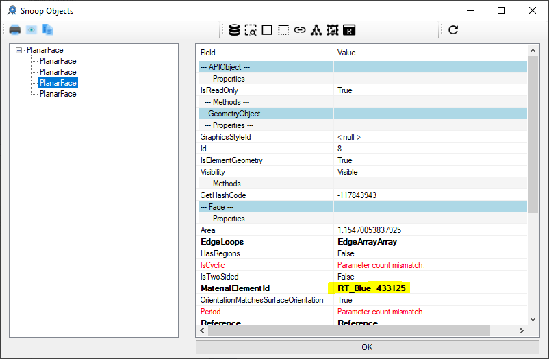

<head>
<meta http-equiv="Content-Type" content="text/html; charset=utf-8">
<link rel="stylesheet" type="text/css" href="bc.css">

</head>

<!---

- Using different material on each face of a tessellated shape
  https://forums.autodesk.com/t5/revit-api-forum/using-different-material-on-each-face-of-a-tessellated-shape/m-p/11359278#M65249
  + assign different material to each face of direct shape
  Using different material on each face of a tessellated shape
  https://forums.autodesk.com/t5/revit-api-forum/using-different-material-on-each-face-of-a-tessellated-shape/m-p/10550191

- DirectContext3D Colorized Triangles
  https://forums.autodesk.com/t5/revit-api-forum/directcontext3d-colorized-triangles/td-p/10567609

- pick point in cloud point
  https://forums.autodesk.com/t5/revit-api-forum/definition-of-work-plane-for-picking-point-of-point-cloud-in/td-p/11366329

- rpthomas explains
  https://forums.autodesk.com/t5/revit-api-forum/access-point-cloud-points-through-api/m-p/11374437#M65416

- 8125 [Carla Ferreyra: Link Point Cloud with BIM] 
  open source point cloud engine https://github.com/potree/potree
  Here are two point cloud demos with the Forge viewer using potree.js
  by [Petr Broz](https://github.com/petrbroz) and [Michael Beale](https://github.com/wallabyway):
  - [Pointcloud with Revit](https://github.com/wallabyway/forge-pointcloud-with-revit)
  - [forge-potree-demo](https://github.com/petrbroz/forge-potree-demo)
  According to Michael’s slide deck, you need to convert your point cloud files to the potree supported format via `PotreeConverter` before using the potree viewer extension. A `.pts` file requires conversion to `.las`, `.zlas`, or `.bin` file before passing to `PotreeConverter`.

- https://forums.autodesk.com/t5/revit-api-forum/highlight-100-000-nodes-xyz-coordinates-at-once-in-revit/m-p/9349258
  search todo_tbc.txt for 'point cloud api'

- https://forums.autodesk.com/t5/revit-api-forum/sdk-sample-pointcloudengine-crash-for-revit-2018-and-2019/m-p/8580174

twitter:

Accessing point cloud points and colouring individual DirectShape and DirectContext3D triangles and faces in the #RevitAPI @AutodeskForge @AutodeskRevit #bim #DynamoBim #ForgeDevCon https://bit.ly/coloringfaces

Let's look at accessing point cloud points and colouring individual triangles and faces
&ndash; Assigning material to each face
&ndash; DirectContext3D colorized triangles
&ndash; Pick and access point cloud points...

linkedin:

Accessing point cloud points and colouring individual DirectShape and DirectContext3D triangles and faces in the #RevitAPI:

https://bit.ly/coloringfaces

- Assigning material to each face
- DirectContext3D colorized triangles
- Pick and access point cloud points...

#bim #DynamoBim #ForgeDevCon #Revit #API #IFC #SDK #AI #VisualStudio #Autodesk #AEC #adsk

the [Revit API discussion forum](http://forums.autodesk.com/t5/revit-api-forum/bd-p/160) thread

<pre class="code">
</pre>

-->

### Point Clouds, Coloured Triangles and Faces

Let's look at accessing point cloud points and colouring individual triangles and faces:

- [Assigning material to each face](#2)
- [DirectContext3D colorized triangles](#3)
- [Pick and access point cloud points](#4)

#### Assigning Material to Each Face

Richard [RPThomas108](https://forums.autodesk.com/t5/user/viewprofilepage/user-id/1035859) Thomas
has been solving the majority of tricky questions in 
the [Revit API discussion forum](http://forums.autodesk.com/t5/revit-api-forum/bd-p/160) for
quite some time.

Among many others, he addressed [using different material on each face of a tessellated shape](https://forums.autodesk.com/t5/revit-api-forum/using-different-material-on-each-face-of-a-tessellated-shape/m-p/10550191):

**Question:** I am creating a complex tessellated shape, in which I am trying to use more than one material.
Essentially, I am trying to paint each face with its own colour.

However, the end result seems to use just one material for the entire shape (I think it's the material that I've used for the first face). 

The API allows me to specify the material id on a face level &ndash; the TesselatedFace constructor accepts the vertices and the material.

I am currently trying to specify the colour of each face by creating a new material.

Is there a more straightforward way to paint individual faces of a tessellated shape?

**Answer:** I don't see the same issue in Revit 2022:

 <!-- 622 x 485 -->

<pre class="code">
Private&nbsp;Function&nbsp;Obj_210816c(
&nbsp;&nbsp;ByVal&nbsp;commandData&nbsp;As&nbsp;Autodesk.Revit.UI.ExternalCommandData,
&nbsp;&nbsp;ByRef&nbsp;message&nbsp;As&nbsp;String,
&nbsp;&nbsp;ByVal&nbsp;elements&nbsp;As&nbsp;Autodesk.Revit.DB.ElementSet)&nbsp;As&nbsp;Result
 
&nbsp;&nbsp;Dim&nbsp;UIDoc&nbsp;As&nbsp;UIDocument&nbsp;=&nbsp;commandData.Application.ActiveUIDocument
&nbsp;&nbsp;If&nbsp;UIDoc&nbsp;Is&nbsp;Nothing&nbsp;Then&nbsp;Return&nbsp;Result.Cancelled&nbsp;Else
&nbsp;&nbsp;Dim&nbsp;IntDoc&nbsp;As&nbsp;Document&nbsp;=&nbsp;UIDoc.Document
 
&nbsp;&nbsp;Dim&nbsp;Mats&nbsp;As&nbsp;New&nbsp;List(Of&nbsp;String)
&nbsp;&nbsp;Mats.Add(&quot;RT_Red,255,0,0&quot;)
&nbsp;&nbsp;Mats.Add(&quot;RT_Green,0,255,0&quot;)
&nbsp;&nbsp;Mats.Add(&quot;RT_Blue,0,0,255&quot;)
&nbsp;&nbsp;Mats.Add(&quot;RT_Cyan,0,255,255&quot;)
 
&nbsp;&nbsp;Dim&nbsp;FEC&nbsp;As&nbsp;New&nbsp;FilteredElementCollector(IntDoc)
&nbsp;&nbsp;Dim&nbsp;ECF&nbsp;As&nbsp;New&nbsp;ElementClassFilter(GetType(Material))
&nbsp;&nbsp;Dim&nbsp;MatsFound&nbsp;As&nbsp;List(Of&nbsp;Element)&nbsp;=&nbsp;FEC.WherePasses(ECF)&nbsp;_
&nbsp;&nbsp;&nbsp;&nbsp;.ToElements.Where(Function(n)&nbsp;n.Name.StartsWith(&quot;RT_&quot;))&nbsp;_
&nbsp;&nbsp;&nbsp;&nbsp;.ToList
&nbsp;&nbsp;Dim&nbsp;NewMats&nbsp;As&nbsp;ElementId()&nbsp;=&nbsp;New&nbsp;ElementId(3)&nbsp;{}
 
&nbsp;&nbsp;Using&nbsp;tx&nbsp;As&nbsp;New&nbsp;Transaction(IntDoc,&nbsp;&quot;Add&nbsp;materials&quot;)
&nbsp;&nbsp;&nbsp;&nbsp;If&nbsp;tx.Start&nbsp;=&nbsp;TransactionStatus.Started&nbsp;Then
&nbsp;&nbsp;&nbsp;&nbsp;&nbsp;&nbsp;Dim&nbsp;Commit&nbsp;As&nbsp;Boolean&nbsp;=&nbsp;False
&nbsp;&nbsp;&nbsp;&nbsp;&nbsp;&nbsp;Dim&nbsp;Ix&nbsp;As&nbsp;Integer&nbsp;=&nbsp;0
&nbsp;&nbsp;&nbsp;&nbsp;&nbsp;&nbsp;For&nbsp;Each&nbsp;item&nbsp;As&nbsp;String&nbsp;In&nbsp;Mats
&nbsp;&nbsp;&nbsp;&nbsp;&nbsp;&nbsp;&nbsp;&nbsp;Dim&nbsp;Str&nbsp;As&nbsp;String()&nbsp;=&nbsp;item.Split(New&nbsp;Char()&nbsp;{&quot;,&quot;},
&nbsp;&nbsp;&nbsp;&nbsp;&nbsp;&nbsp;&nbsp;&nbsp;&nbsp;&nbsp;StringSplitOptions.None)
&nbsp;&nbsp;&nbsp;&nbsp;&nbsp;&nbsp;&nbsp;&nbsp;Dim&nbsp;M&nbsp;As&nbsp;Element&nbsp;=&nbsp;MatsFound.FirstOrDefault(
&nbsp;&nbsp;&nbsp;&nbsp;&nbsp;&nbsp;&nbsp;&nbsp;&nbsp;&nbsp;Function(x)&nbsp;x.Name&nbsp;=&nbsp;Str(0))
&nbsp;&nbsp;&nbsp;&nbsp;&nbsp;&nbsp;&nbsp;&nbsp;If&nbsp;M&nbsp;Is&nbsp;Nothing&nbsp;Then
&nbsp;&nbsp;&nbsp;&nbsp;&nbsp;&nbsp;&nbsp;&nbsp;&nbsp;&nbsp;NewMats(Ix)&nbsp;=&nbsp;Material.Create(IntDoc,&nbsp;Str(0))
&nbsp;&nbsp;&nbsp;&nbsp;&nbsp;&nbsp;&nbsp;&nbsp;&nbsp;&nbsp;Commit&nbsp;=&nbsp;True
 
&nbsp;&nbsp;&nbsp;&nbsp;&nbsp;&nbsp;&nbsp;&nbsp;&nbsp;&nbsp;IntDoc.Regenerate()
&nbsp;&nbsp;&nbsp;&nbsp;&nbsp;&nbsp;&nbsp;&nbsp;&nbsp;&nbsp;Dim&nbsp;M1&nbsp;As&nbsp;Material&nbsp;=&nbsp;IntDoc.GetElement(NewMats(Ix))
&nbsp;&nbsp;&nbsp;&nbsp;&nbsp;&nbsp;&nbsp;&nbsp;&nbsp;&nbsp;M1.Color&nbsp;=&nbsp;New&nbsp;Color(CByte(Str(1)),
&nbsp;&nbsp;&nbsp;&nbsp;&nbsp;&nbsp;&nbsp;&nbsp;&nbsp;&nbsp;&nbsp;&nbsp;CByte(Str(2)),&nbsp;CByte(Str(3)))
&nbsp;&nbsp;&nbsp;&nbsp;&nbsp;&nbsp;&nbsp;&nbsp;Else
&nbsp;&nbsp;&nbsp;&nbsp;&nbsp;&nbsp;&nbsp;&nbsp;&nbsp;&nbsp;NewMats(Ix)&nbsp;=&nbsp;M.Id
&nbsp;&nbsp;&nbsp;&nbsp;&nbsp;&nbsp;&nbsp;&nbsp;End&nbsp;If
 
&nbsp;&nbsp;&nbsp;&nbsp;&nbsp;&nbsp;&nbsp;&nbsp;Ix&nbsp;+=&nbsp;1
&nbsp;&nbsp;&nbsp;&nbsp;&nbsp;&nbsp;Next
&nbsp;&nbsp;&nbsp;&nbsp;&nbsp;&nbsp;If&nbsp;Commit&nbsp;Then
&nbsp;&nbsp;&nbsp;&nbsp;&nbsp;&nbsp;&nbsp;&nbsp;tx.Commit()
&nbsp;&nbsp;&nbsp;&nbsp;&nbsp;&nbsp;Else
&nbsp;&nbsp;&nbsp;&nbsp;&nbsp;&nbsp;&nbsp;&nbsp;tx.RollBack()
&nbsp;&nbsp;&nbsp;&nbsp;&nbsp;&nbsp;End&nbsp;If
&nbsp;&nbsp;&nbsp;&nbsp;End&nbsp;If
&nbsp;&nbsp;End&nbsp;Using
 
&nbsp;&nbsp;Dim&nbsp;Size&nbsp;As&nbsp;Double&nbsp;=&nbsp;1
&nbsp;&nbsp;Dim&nbsp;v1&nbsp;As&nbsp;New&nbsp;XYZ((8&nbsp;/&nbsp;9)&nbsp;^&nbsp;0.5,&nbsp;0,&nbsp;-1&nbsp;/&nbsp;3)
&nbsp;&nbsp;Dim&nbsp;v2&nbsp;As&nbsp;New&nbsp;XYZ(-(2&nbsp;/&nbsp;9)&nbsp;^&nbsp;0.5,&nbsp;(2&nbsp;/&nbsp;3)&nbsp;^&nbsp;0.5,&nbsp;-1&nbsp;/&nbsp;3)
&nbsp;&nbsp;Dim&nbsp;v3&nbsp;As&nbsp;New&nbsp;XYZ(-(2&nbsp;/&nbsp;9)&nbsp;^&nbsp;0.5,&nbsp;-(2&nbsp;/&nbsp;3)&nbsp;^&nbsp;0.5,&nbsp;-1&nbsp;/&nbsp;3)
&nbsp;&nbsp;Dim&nbsp;v4&nbsp;As&nbsp;New&nbsp;XYZ(0,&nbsp;0,&nbsp;1)
 
&nbsp;&nbsp;v1&nbsp;*=&nbsp;Size
&nbsp;&nbsp;v2&nbsp;*=&nbsp;Size
&nbsp;&nbsp;v3&nbsp;*=&nbsp;Size
&nbsp;&nbsp;v4&nbsp;*=&nbsp;Size
 
&nbsp;&nbsp;Dim&nbsp;F&nbsp;As&nbsp;XYZ(,)&nbsp;=&nbsp;New&nbsp;XYZ(3,&nbsp;2)&nbsp;{{v4,&nbsp;v1,&nbsp;v2},
&nbsp;&nbsp;&nbsp;&nbsp;{v4,&nbsp;v2,&nbsp;v3},&nbsp;{v4,&nbsp;v3,&nbsp;v1},&nbsp;{v1,&nbsp;v2,&nbsp;v3}}
 
&nbsp;&nbsp;Dim&nbsp;TSB&nbsp;As&nbsp;New&nbsp;TessellatedShapeBuilder()
&nbsp;&nbsp;TSB.OpenConnectedFaceSet(True)
&nbsp;&nbsp;For&nbsp;i&nbsp;=&nbsp;0&nbsp;To&nbsp;3
&nbsp;&nbsp;&nbsp;&nbsp;Dim&nbsp;EID&nbsp;As&nbsp;ElementId&nbsp;=&nbsp;NewMats(i)
&nbsp;&nbsp;&nbsp;&nbsp;TSB.AddFace(New&nbsp;TessellatedFace(
&nbsp;&nbsp;&nbsp;&nbsp;&nbsp;&nbsp;{F(i,&nbsp;0),&nbsp;F(i,&nbsp;1),&nbsp;F(i,&nbsp;2)}.ToList,&nbsp;EID))
&nbsp;&nbsp;Next
&nbsp;&nbsp;TSB.CloseConnectedFaceSet()
&nbsp;&nbsp;TSB.Build()
 
&nbsp;&nbsp;Using&nbsp;tx&nbsp;As&nbsp;New&nbsp;Transaction(IntDoc,&nbsp;&quot;Tetrahedron&quot;)
&nbsp;&nbsp;&nbsp;&nbsp;If&nbsp;tx.Start&nbsp;=&nbsp;TransactionStatus.Started&nbsp;Then
&nbsp;&nbsp;&nbsp;&nbsp;&nbsp;&nbsp;Dim&nbsp;DS&nbsp;As&nbsp;DirectShape&nbsp;=&nbsp;DirectShape.CreateElement(
&nbsp;&nbsp;&nbsp;&nbsp;&nbsp;&nbsp;&nbsp;&nbsp;IntDoc,&nbsp;New&nbsp;ElementId(BuiltInCategory.OST_GenericModel))
&nbsp;&nbsp;&nbsp;&nbsp;&nbsp;&nbsp;DS.AppendShape(TSB)
 
&nbsp;&nbsp;&nbsp;&nbsp;&nbsp;&nbsp;tx.Commit()
&nbsp;&nbsp;&nbsp;&nbsp;End&nbsp;If
&nbsp;&nbsp;End&nbsp;Using
&nbsp;&nbsp;Return&nbsp;Result.Succeeded
 
End&nbsp;Function
</pre>

TessellatedShapeBuilder.GraphicsStyleId will be set for the whole shape, i.e., it can have Category with Material.

This code sets a material per face, originally for Revit 2022, and still works in Revit 2023.

In realistic visual style, the colour is taken from the Appearance Asset Colour which has not been set for the four materials created above (this can be changed via the assets of the material).
However, each face is set to a different material.
This can also be seen in RevitLookup:

 <!-- 802 x 524 -->
 
 <!-- 802 x 524 -->

Thank you, Richard, for the useful sample code and explanation!

#### DirectContext3D Colorized Triangles

Tamas Deri explored and answered his own question of how to
create [DirectContext3D colorized triangles](https://forums.autodesk.com/t5/revit-api-forum/directcontext3d-colorized-triangles/td-p/10567609):

**Question:** I'm having trouble applying colors to triangles that are shown via a `DirectContext3DServer`.
I use a `ColorWithTransparency` object as a basis.
Lines working fine, but here is the issue with triangles:

I can apply the color via the `EffectInstance`, but only if I set it's Emissive Color through `SetEmissiveColor`.
If I set all its other colors like, Color, DiffuseColor, SpecularColor or AmbientColor, it stays black.
Changing transparency works fine.
The biggest issue if I'd like to apply the colors per vertices it won't work.
I'm using VertexFormatBits.PositionNormalColored, and set for instance ColorWithTransparency(255,0,0,200) as it's color, but all triangles will be transparent black.
Any idea what could be the issue? No exceptions thrown, all buffers are valid, the geometries are being shown, but without the right color applied.

**Answer:** I tried to put together a reproducible case, and I've just found out what the issue was.
I left a line in the code which set the EffectInstance's transparency, and I think if any property of the EffectInstance is set, then it overrides all vertex properties.
That's why the vertex colors got ignored, and it falled back to transparent black.
Once I removed that line and kept only the just-constructed EffectInstance it worked as intended.

Here is a partial code that updates the buffers if it is neccessary.
The rest is similar to what is available from other sources regarding DirectContext3D.

<pre class="prettyprint">
def update_buffer(self):
  if self.penetrations is None: return False
  try:
    lines = []
    triangles = []
    colors = []
    for pen_item in self.penetrations:
      if pen_item.proposed:
        primitives = pen_item.proposed.get_wireframe()
      else:
        primitives = pen_item.current.get_wireframe()
      lines.extend(primitives[0])
      triangles.extend(primitives[1])
      colors.append(pen_item.status_color)

    tri_f_bits = dc.VertexFormatBits.PositionNormalColored
    tri_vertex_format = dc.VertexFormat(tri_f_bits)

    tri_effect_instance = dc.EffectInstance(tri_f_bits)

    # If you try to handle transparency globally it will also 
    # overrides vertex colors, and overrides them to black
    
    # tri_effect_instance.SetTransparency(0.8)

    tri_vertex_buffer_size = \
      dc.VertexPositionNormalColored.GetSizeInFloats() \
      * len(triangles) * 3
    tri_vertex_buffer = dc.VertexBuffer(tri_vertex_buffer_size)

    tri_index_buffer_size = \
      dc.IndexTriangle.GetSizeInShortInts() * len(triangles)
    tri_index_buffer = dc.IndexBuffer(tri_index_buffer_size)

    tri_vertex_buffer.Map(tri_vertex_buffer_size)
    tri_index_buffer.Map(tri_index_buffer_size)
    tri_vertex_stream_p = \
      tri_vertex_buffer.GetVertexStreamPositionNormalColored()
    tri_index_stream_p = tri_index_buffer.GetIndexStreamTriangle()
    for triangle in triangles:
      triangle_index = triangles.index(triangle)
      first_idx = triangle_index * 3
      tri_vertex_stream_p.AddVertex(dc.VertexPositionNormalColored(
        triangle[1], triangle[0], colors[triangle_index / 12]
      ))
      tri_vertex_stream_p.AddVertex(dc.VertexPositionNormalColored(
        triangle[2], triangle[0], colors[triangle_index / 12]
      ))
      tri_vertex_stream_p.AddVertex(dc.VertexPositionNormalColored(
        triangle[3], triangle[0], colors[triangle_index / 12]
      ))
      tri_index_stream_p.AddTriangle(dc.IndexTriangle(
        first_idx,
        first_idx + 1,
        first_idx + 2
      ))
    tri_vertex_buffer.Unmap()
    tri_index_buffer.Unmap()

    self.triangle_buffer = (
      tri_vertex_buffer,
      tri_vertex_buffer_size,
      tri_index_buffer,
      tri_index_buffer_size,
      tri_vertex_format,
      tri_effect_instance,
      dc.PrimitiveType.TriangleList,
      0,
      len(triangles)
    )

    line_f_bits = dc.VertexFormatBits.PositionColored
    line_vertex_format = dc.VertexFormat(line_f_bits)

    line_effect_instance = dc.EffectInstance(line_f_bits)

    line_vertex_buffer_size = \
      dc.VertexPositionColored.GetSizeInFloats() * len(lines) * 2
    line_vertex_buffer = dc.VertexBuffer(line_vertex_buffer_size)

    line_index_buffer_size = \
      dc.IndexLine.GetSizeInShortInts() * len(lines)
    line_index_buffer = dc.IndexBuffer(line_index_buffer_size)

    line_vertex_buffer.Map(line_vertex_buffer_size)
    line_index_buffer.Map(line_index_buffer_size)
    line_vertex_stream_p = \
      line_vertex_buffer.GetVertexStreamPositionColored()
    line_index_stream_p = line_index_buffer.GetIndexStreamLine()
    for line in lines:
      line_index = lines.index(line)
      first_idx = line_index * 2
      line_vertex_stream_p.AddVertex(dc.VertexPositionColored(
        line.GetEndPoint(0), colors[line_index / 12]
      ))
      line_vertex_stream_p.AddVertex(dc.VertexPositionColored(
        line.GetEndPoint(1), colors[line_index / 12]
      ))
      line_index_stream_p.AddLine(dc.IndexLine(
        first_idx,
        first_idx + 1
      ))
    line_vertex_buffer.Unmap()
    line_index_buffer.Unmap()

    self.line_buffer = (
      line_vertex_buffer,
      line_vertex_buffer_size,
      line_index_buffer,
      line_index_buffer_size,
      line_vertex_format,
      line_effect_instance,
      dc.PrimitiveType.LineList,
      0,
      len(lines)
    )
    self.update_flag = False
    return True
  except:
    return False
</pre>

At least there is some python example of DirectContext3D :-)

I also managed to figure out why the vertex colors were not applied.
It is related to the EffectInstance, but it has nothing to do with its colors.
The problem was that I've been using an EffectInstance created as *EffectInstance (VertexFormatBits.PositionNormalColored)*, even though my display style was not shaded.
This made all my triangles black on non-shaded views, but they did work fine on shaded views.
So I added the following lines:

<pre class="prettyprint">
      if any([
          display_style == DB.DisplayStyle.Shading,
          display_style == DB.DisplayStyle.ShadingWithEdges
      ]):
        tri_effect_instance = dc.EffectInstance(
          dc.VertexFormatBits.PositionNormalColored
        )
      else:
        tri_effect_instance = dc.EffectInstance(
          dc.VertexFormatBits.PositionColored
        )
</pre>

Now it works on all views as expected, and I was able to keep the vertices as VertexPositionNormalColored in all cases.
The EffectInstance did the trick by itself.

Many thanks to Tamas for the good research and sample code!

#### Pick and Access Point Cloud Points

Richard [RPThomas108](https://forums.autodesk.com/t5/user/viewprofilepage/user-id/1035859) Thomas
solved two more tricky point cloud related questions as well.

The latest explains how to address 
the [definition of work plane for picking point of point cloud in orthographic 3D view](https://forums.autodesk.com/t5/revit-api-forum/definition-of-work-plane-for-picking-point-of-point-cloud-in/td-p/11366329).
In summary, Richard recommends using the `Selection.PickObject` method specifying `ObjectType.PointOnElement` and shares code to:

- Get the minimum point of the UIView from UIView.GetZoomCorners
- Set up a work plane using view direction and min point from above;
  note that since the user can rotate the view during selection of points, this invalidates the work plane position for point selection.
  So, I'm locking the view orientation after the projection plane is set.
- Pick the point on the plane
- Filter the cloud by creating a box aligned with the view direction around the picked point
- Transform the filtered cloud points to model space and project them onto plane and find nearest to original picked point
 
There is a lot more to it than it sounds, though...

Before that, he also addressed
how to [access point cloud points through API](https://forums.autodesk.com/t5/revit-api-forum/access-point-cloud-points-through-api/m-p/11374437):

**Question:** I imported an `.rcs` point cloud to Revit 2022 using Insert &gt; Point Cloud.
I would like to access its points and colors through Revit API.
For that, I found the `PointCloudInstance.GetPoints` method.
Its third input is `numPoints`, representing the number of points which should be extracted from the point cloud.
However, this input cannot be larger than 1 million.
And if I try to make it larger, it raises an error message: 'It can be from 1 to 1000000.'
Does this mean that for any point cloud we import to Revit, we can only access its first 1 million points through Revit API, and those beyond are inaccessible?

**Answer:** I think the statement regarding how many points you can access is incorrect.

Yes, there is a limit, but you can process the cloud in blocks by adjusting the filter limits and thus access all the points, not just the limit of one block.

A confusing aspect is the `averageDistance`:

> Desired average distance between "adjacent" cloud points (Revit units of length). The smaller the averageDistance the larger number of points will be returned up to the numPoints limit. Specifying this parameter makes actual number of points returned for a given filter independent of the density of coverage produced by the scanner.

What is the lowest number I can set this to, the limit of the scanner or smallest possible +ve double value? I think it should be an optional parameter whereby it just returns all the points for an area up to the max number of points limit. It says: "Specifying this parameter...", making it sound like it is optional, but it doesn't tell me it can be null for example.

I would probably split the cloud up into blocks and test the number of points has not reached the limit for each.
If it has reached the limit for a given block, then subdivide that block up into more blocks.

Note:

> If there are more points in the cloud passing the filter than the number requested in this function, the results may not be consistent if the same call is made again.

So, if the amount of points is less than the max number then I assume you have all the points for that block.

Additionally the `PointCollection` has the member `GetpointBufferPointer`; this could then provide a faster way to count the points in each block to establish if the block needs further subdividing.

Many thanks again to Richard for his helpful advice and great expertise!
