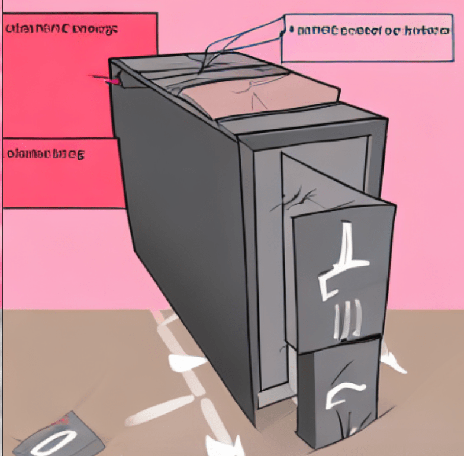
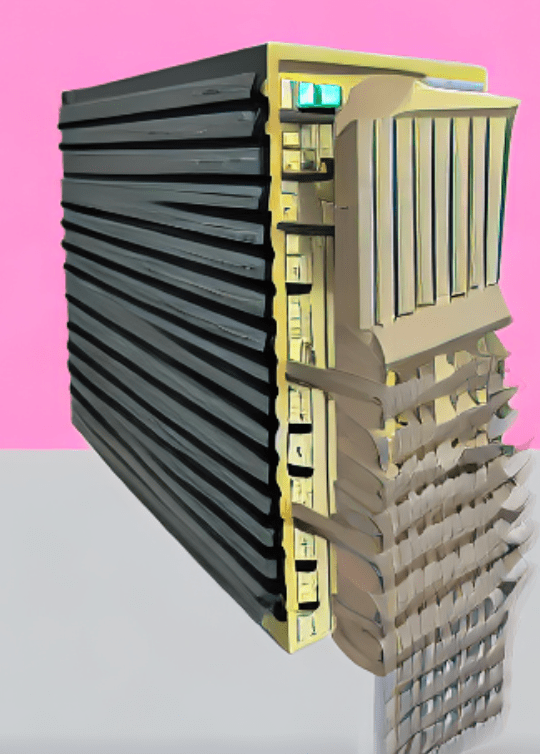
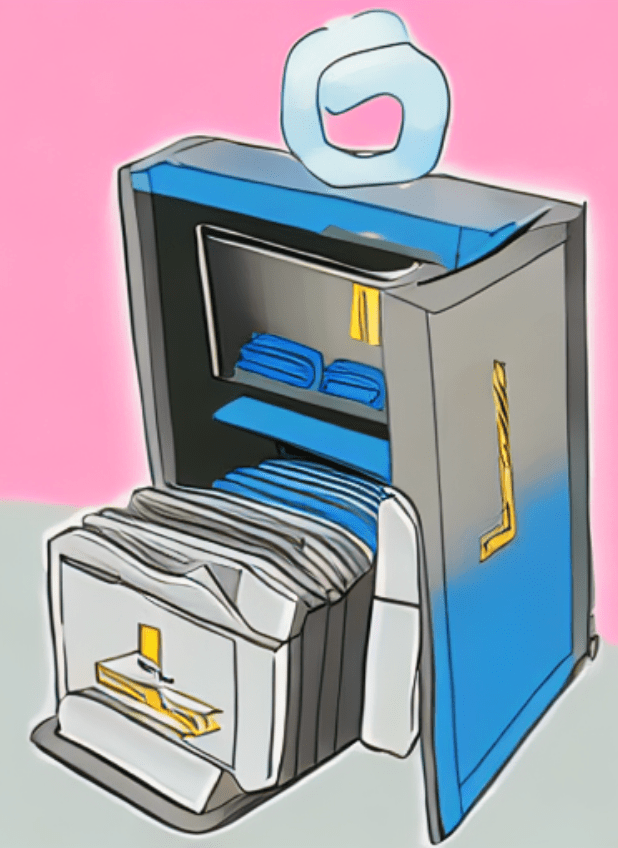
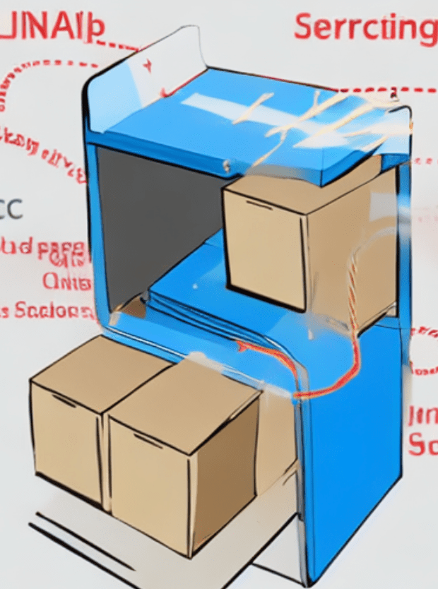

<head>
<meta http-equiv="Content-Type" content="text/html; charset=utf-8">
<link rel="stylesheet" type="text/css" href="bc.css">

</head>

<!---

- https://www.linkedin.com/posts/scott-conover-b09bb65_senior-product-owner-building-and-energy-activity-6971538735788138496-oP4J?utm_source=share&utm_medium=member_desktop
Scott Conover, Director, Engineering at Autodesk
We're hiring! I strongly believe that the tools we will be building on this team are critical to the future of building design - and improving the state of the planet in the future. Let me know if you know someone who might have an interest...
[Senior Product Owner, Building and Energy]
https://autodesk.wd1.myworkdayjobs.com/en-US/Ext/details/Senior-Product-Owner--Building-and-Energy_22WD63355?q=Product+Owner

- unload ifc links to delete extensible storage?
  https://forums.autodesk.com/t5/revit-api-forum/not-able-to-delete-extensible-storage-schema/m-p/11397400#M65728

- solution by rpthomas with some important UI design and selection advice in general
  Pick FamilySymbol from Project Browser?
  https://forums.autodesk.com/t5/revit-api-forum/pick-familysymbol-from-project-browser/td-p/11390552

twitter:

Unload IFC links to delete extensible storage, and picking, selection and UI design in the #RevitAPI @AutodeskForge @AutodeskRevit #bim #DynamoBim #ForgeDevCon https://autode.sk/deleteestorage

Interesting hints from the forum and thoughts on feedback, community and communication
&ndash; Unload IFC links to delete extensible storage
&ndash; Picking, selection and UI design
&ndash; Feedback is always a great gift
&ndash; Scott Peck and community building...

linkedin:

Unload IFC links to delete extensible storage, and picking, selection and UI design in the #RevitAPI

https://autode.sk/deleteestorage

Interesting hints from the forum and thoughts on feedback, community and communication:

- Unload IFC links to delete extensible storage
- Picking, selection and UI design
- Feedback is always a great gift
- Scott Peck and community building...

#bim #DynamoBim #ForgeDevCon #Revit #API #IFC #SDK #AI #VisualStudio #Autodesk #AEC #adsk

the [Revit API discussion forum](http://forums.autodesk.com/t5/revit-api-forum/bd-p/160) thread

<pre class="code">
</pre>

-->

### Deleting Storage and Picking a Symbol

Today, I share two interesting hints from the forum and some thoughts on feedback, community and communication:

- [Unload IFC links to delete extensible storage](#2)
- [Picking, selection and UI design](#3)
- [Feedback is always a great gift](#5)
- [Scott Peck and community building](#6)

Before we get into these, we have an open position in the Revit development team:
Scott Conover, director of engineering at Autodesk [says on LinkedIn](https://www.linkedin.com/posts/scott-conover-b09bb65_senior-product-owner-building-and-energy-activity-6971538735788138496-oP4J):

> We're hiring!
I strongly believe that the tools we will be building on this team are critical to the future of building design &ndash; and improving the state of the planet in the future.
Let me know if you know someone who might have an interest...
[Senior Product Owner, Building and Energy](https://autodesk.wd1.myworkdayjobs.com/en-US/Ext/details/Senior-Product-Owner--Building-and-Energy_22WD63355)

#### Unload IFC Links to Delete Extensible Storage

Several developers reported problems deleting extensible storage.

A new contribution to 
the [Revit API discussion forum](http://forums.autodesk.com/t5/revit-api-forum/bd-p/160) thread
[not able to delete extensible storage schema](https://forums.autodesk.com/t5/revit-api-forum/not-able-to-delete-extensible-storage-schema/m-p/11397400) reports
that unloading IFC links may help:

> I created a very small
example [Example_RemoveSchemas.zip](zip/Example_RemoveSchemas.zip) with
an IFC link with a few walls created in Revit 2020.
The file contains 4 macros:

>    - Create example schema
- Remove example schema
- List all schemata
- Remove all schemata

> In Revit, 2020 I am not able to remove any schemata when the IFC link is loaded.

Many thanks to Marek @Songohu_85 for testing and reporting this.

I wonder whether it will help others resolve similar issues.

To illustrate this post, I asked [artbreeder](https://www.artbreeder.com) to create some images with the description *unload ifc link to delete extensible storage*:

#### Picking, Selection and UI Design

Richard [RPThomas108](https://forums.autodesk.com/t5/user/viewprofilepage/user-id/1035859) Thomas
shares some advice on Revit add-in UI design and selection in general in his answer on
how to [pick `FamilySymbol` from project browser](https://forums.autodesk.com/t5/revit-api-forum/pick-familysymbol-from-project-browser/td-p/11390552):

**Question:** I want my user to select a FamilySymbol that's already loaded from the UI (more specifically, the Project Browser) that I then further process in my own code.
I'm aware that there are different methods for filtering the already existing custom families/loading families from file and so on, but is there a way to prompt the user to pick one from the project browser?
Ideally, it would NOT require the user to make conscious decisions on where to click before starting the add-in.

**Answer:** You could ask users to select an element instance from their view, then get the FamilySymbol from that, but I don't think it's possible from the browser.

It's not the usual workflow, but now, in Revit 2023, you have the selection changed event which also applies to project browser.
This code prompts user to select from browser before adding a selection changed event:

<pre class="code">
Public&nbsp;Function&nbsp;Obj_220831a(
&nbsp;&nbsp;commandData&nbsp;As&nbsp;ExternalCommandData,
&nbsp;&nbsp;ByRef&nbsp;message&nbsp;As&nbsp;String,
&nbsp;&nbsp;elements&nbsp;As&nbsp;ElementSet)&nbsp;As&nbsp;Result
 
&nbsp;&nbsp;Dim&nbsp;IntUIApp&nbsp;As&nbsp;UIApplication&nbsp;=&nbsp;commandData.Application
&nbsp;&nbsp;Dim&nbsp;IntUIDoc&nbsp;As&nbsp;UIDocument&nbsp;=&nbsp;commandData.Application.ActiveUIDocument
&nbsp;&nbsp;Dim&nbsp;IntDoc&nbsp;As&nbsp;Document&nbsp;=&nbsp;IntUIDoc.Document
 
&nbsp;&nbsp;TaskDialog.Show(&quot;Select&quot;,&nbsp;&quot;Pick&nbsp;family&nbsp;symbol&nbsp;from&nbsp;project&nbsp;browser&quot;)
&nbsp;&nbsp;AddHandler&nbsp;IntUIApp.SelectionChanged,&nbsp;AddressOf&nbsp;SelectionChanged
 
&nbsp;&nbsp;Return&nbsp;Result.Succeeded
End&nbsp;Function
 
Public&nbsp;Sub&nbsp;SelectionChanged(
&nbsp;&nbsp;s&nbsp;As&nbsp;Object,
&nbsp;&nbsp;e&nbsp;As&nbsp;Autodesk.Revit.UI.Events.SelectionChangedEventArgs)
 
&nbsp;&nbsp;Dim&nbsp;UIapp&nbsp;As&nbsp;UIApplication&nbsp;=&nbsp;s
&nbsp;&nbsp;Dim&nbsp;J&nbsp;As&nbsp;ISet(Of&nbsp;ElementId)&nbsp;=&nbsp;e.GetSelectedElements
&nbsp;&nbsp;Dim&nbsp;J0&nbsp;As&nbsp;List(Of&nbsp;ElementId)&nbsp;=&nbsp;J.ToList
 
&nbsp;&nbsp;Dim&nbsp;FEC&nbsp;As&nbsp;New&nbsp;FilteredElementCollector(UIapp.ActiveUIDocument.Document,&nbsp;J0)
&nbsp;&nbsp;Dim&nbsp;F0&nbsp;As&nbsp;New&nbsp;ElementClassFilter(GetType(FamilySymbol))
&nbsp;&nbsp;Dim&nbsp;Els&nbsp;As&nbsp;List(Of&nbsp;Element)&nbsp;=&nbsp;FEC.WherePasses(F0).ToElements
 
&nbsp;&nbsp;If&nbsp;Els.Count&nbsp;&gt;&nbsp;0&nbsp;Then
&nbsp;&nbsp;&nbsp;&nbsp;TaskDialog.Show(&quot;Selection&quot;,&nbsp;Els(0).Name)
&nbsp;&nbsp;&nbsp;&nbsp;RemoveHandler&nbsp;UIapp.SelectionChanged,&nbsp;AddressOf&nbsp;SelectionChanged
&nbsp;&nbsp;End&nbsp;If
End&nbsp;Sub
</pre>

The handler filters for the class of FamilySymbol* and shows a dialogue if the result yields more than 0 results.

Note that not everything in the project browser is a `FamilySymbol`; the parent `ElementType` class will cover more aspects such as system families.

You would have to continue execution in the handler and perhaps raise an external event to get an editable document status (I suspect the selection changed event doesn't give you that).

You can also use `e.GetDocument` instead of casting the sender `s` to `UIApplication` to get the `Document`.

**Response:** Thanks for your reply.
In your opinion, what would be a workflow that is more common?

**Answer:** It really depends on what your add-in is being used for, i.e., is it modal or modeless interaction?
Is it working with a few categories of elements or many?

It is often the case you have to create dialogues that replicate the ones Revit inherently has which is a bit annoying but doesn't take that long with WPF for something such as FamilySymbol selection.
That would allow a modal interaction.

You aim to stay within the `IExternalCommand` context in a modal way to start with, but if that isn't possible, then you have to get back into a similar context via raising an `ExternalEvent` from modeless forms etc.
There are also other methods of obtaining a valid context to work with.

**Response:** Thanks for the answer!

Do you happen to have any pointers or examples of how to develop modeless forms with the Revit API by chance?
Would be much appreciated, thanks!

**Answer:** There are samples in the SDK:

- ...\Samples\ModelessDialog\ModelessForm_ExternalEvent

It is for Windows Forms, but same approach would be used for WPF.

Many thanks to Richard for the important fundamental advice.

#### Feedback is Always a Great Gift

Jim Quanci, our senior director of developer advocacy, pointed out a nice article encouraging feedback:

> Thought some of you might find the below piece on 'feedback' interesting.
I actually believe most of our team is pretty good at accepting feedback... but I know I can at times 'not fully embrace feedback enough'.
This article is a nice reminder.
To some degree, it's about receiving feedback with humility. :-)

Axios CEO Jim VandeHei shares his weekly learnings on life and leadership:

1 big thing: How to take feedback

In the summer of 2004, hours before John Kerry's nomination speech at the Democratic convention, Washington Post political editor Maralee Schwartz gut-punched me with some brutal feedback.

- I was covering Kerry for The Post.
But she said I didn't write fast enough or think big enough to capture this historic moment.
John Harris (a Post star who later co-founded Politico with us) got the call instead.
- I was pissed.
She was right.

Why it matters: "Feedback is a gift," the management gurus say.
But in my experience running two companies, it's a gift most don't truly want.

- It's true at work and in relationships.
Every time my wife gives me feedback, I respond defensively, telling her all the reasons I rock. 😉

But learning to accept the gift with wisdom and humility is a superpower we all need.
It's the gateway to growth.

- Whether in a workplace or a relationship, feedback &ndash; honest, no-B.S. insight on what you could do better &ndash; is priceless.
Too many people mess it up by talking instead of listening.

Here's my blunt feedback about taking blunt feedback:

- Listen! Don't make excuses or talk about the past.
  Actually, don't talk at all.
  Soak up, with self-confidence and humility, what the person is saying and take time before responding.
  When they're finished, you can say, "Good point" if you agree ... or, "I hear you" if you want to think more about it.
  Or just: "Thank you."
- Assume positive intent.
  The selfish approach for the other person would be to suppress what they really think.
  If someone has the guts to be frank with you, embrace it and thank them.
  When Mike asks for critiques from people, he says: "I promise to take it in the spirit it's intended."
- Don't be defensive.
  That's the worst response to helpful feedback.
  It makes the person giving it feel unheard &ndash; and less likely to shoot straight with you in the future.
- Ask for it.
  You're more likely to get feedback if you ask peers or superiors &ndash; in a sincere, humble, open-minded way &ndash; how you could be more effective.
  That projects strength, not weakness.
- Act on it.
  If you show you're responsive, you'll get more input.
  And you'll get better at life and on the job.

Case in point: Often when you're giving a face-to-face review, people will validate and vindicate areas of weakness in the written eval.

- "Jim doesn't listen" or "Jim makes too many excuses" or "Jim doesn’t welcome constructive criticism."
- If I then start excuse-peddling or butt-covering, I've kind of made their point.

The bottom line: Life is about forward motion. Elicit and take feedback to make your personal and professional performance tomorrow better than today.

#### Scott Peck and Community Building

The topic of accepting and appreciating feedback reminded me of my own recent exploration of community building in a book and a weekend workshop.

In case anyone is interested in going one step further in the direction of active listening and personally enhancing all their human communication and interaction, I can highly recommend the book
by [Scott Peck](https://en.wikipedia.org/wiki/M._Scott_Peck)
on [community building](https://en.wikipedia.org/wiki/M._Scott_Peck#Community_building):
<i>The Different Drum: Community Making and Peace</i>.
  
It is one of the best books I have ever read. 
One main focus is on really truly listening.
 
After we both read the book, my partner and I participated in a weekend workshop to practice community building with 26 people we didn't know, supported by 5 facilitators.
The facilitators mainly just pointed out some basic communication recommendations, such as:
 
- I really listen
- I speak only about myself
- I speak only when truly moved to speak
 
Highly recommended practices for all human interaction, especially in teams, relationships, families, politics, enterprises, projects.

Our workshop was organised by Andreas in Biel and led by Edward Groody
of [CBI, Community Building International](https://communitybuilding.com/our-team).
