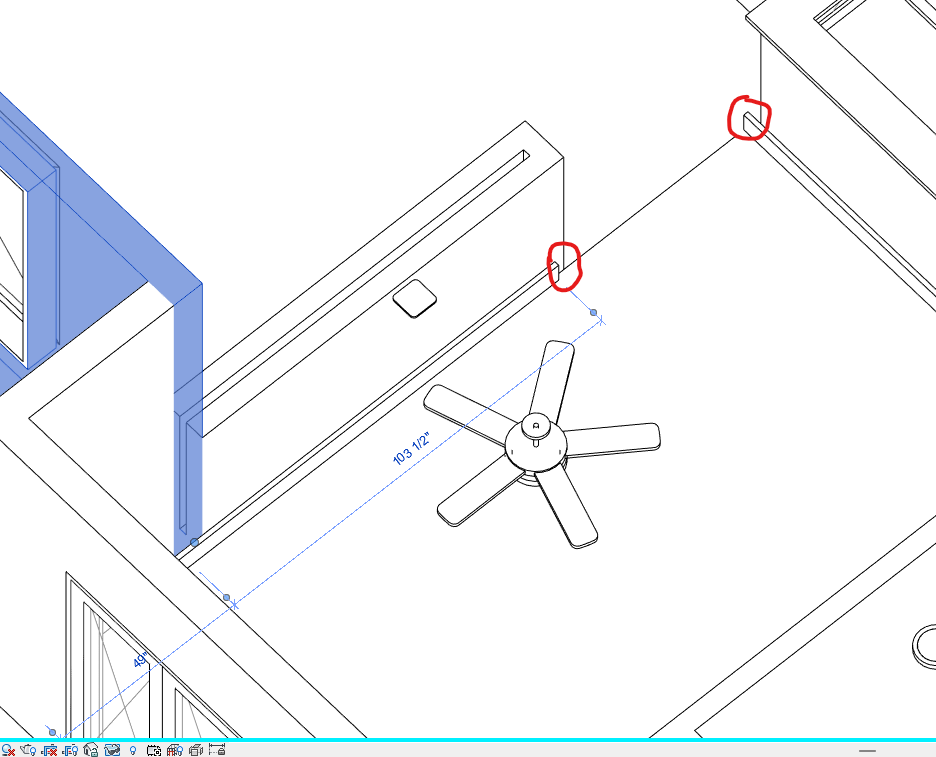
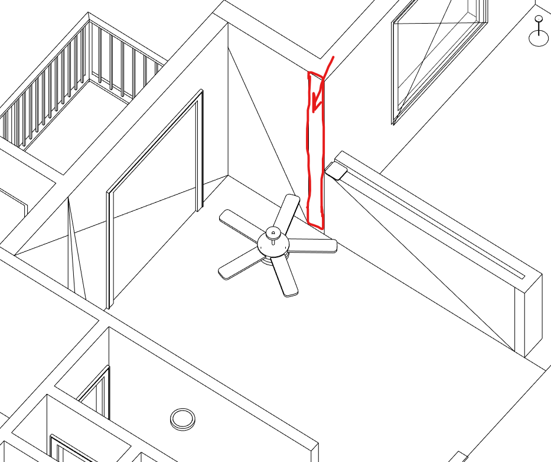
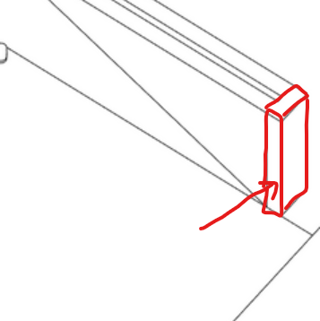
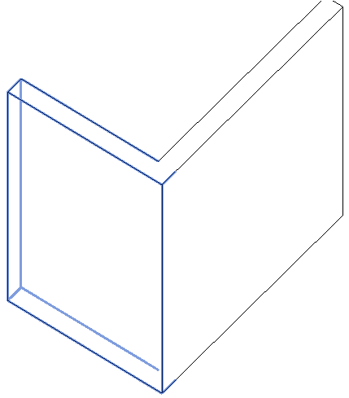
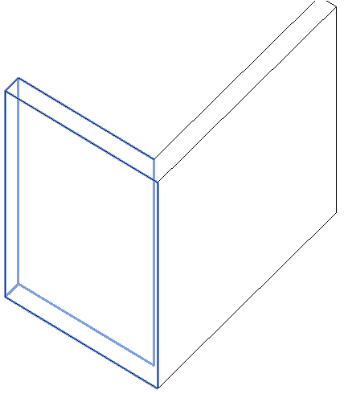
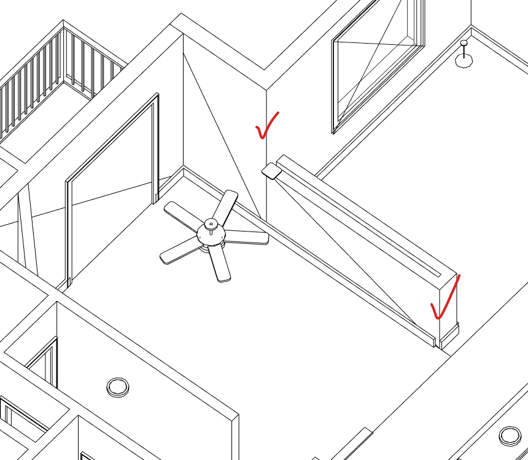

<head>
<meta http-equiv="Content-Type" content="text/html; charset=utf-8">
<link rel="stylesheet" type="text/css" href="bc.css">

</head>

<!---

- Autodesk Paves Path to Digital Transformation in the Cloud
  https://investors.autodesk.com/news-releases/news-release-details/autodesk-paves-path-digital-transformation-cloud

- Autodesk University and Forge Data = unique opportunities!
  https://forge.autodesk.com/blog/autodesk-university-and-forge-data-unique-opportunities
  
- forge rebranding -- zip/AutodeskPlatformServicesRebrand.pptx
  The change of the "name" Forge to Autodesk Platform Services.
  Starting Tuesday (Wednesday in Asia) next week.
  autodesk_platform_services_rebrand1.png 1544 x 690
  Speaker notes:
  As Andrew announced in his General Session, the Forge brand is evolving into Autodesk Platform Services. 
  Autodesk Platform Services consists of an evolving set of APIs and services to help you customize our products, create innovative workflows, and integrate other tools and data with our platform. In addition to web service APIs, Autodesk Platform Services (APS) offers an app marketplace of pre-built solutions that can help you quickly connect gaps, as well as a cloud information model that can streamline how teams create and share project data across project lifecycles.  

- linked element visibility
  I know, the question of "How to hide an individual element from a linked model via the Revit API" has been asked multiple times and there seems to be no way to do this yet.
  However, what I would like to know is, if there is any way to find out if a specific element in a linked model was hidden by the user. Basically, get an element by hovering over the model and using the TAB key to find an element. Then right click &gt; Hide in View &gt; Element.
  As far as I have tried this, .IsHidden() method only works for the whole linked model, not for individual elements inside it.
  Does anyone have an idea if and how this could be done?
  Dimitar Venkov
  If there is a parameter/value combo that is unique to the elements in the link that you're trying to hide, a view filter will do the job.
  Scott Conover
  I believe reading the hide status for an element in a link instance would also be a part of the missing API (
  @Diane Christoforo
  ’s team had looked into how to expose this).   I think the only way to look at elements visibility in the link would through the CustomExporter - which will return you the elements visible in the link but not the ones that are not.    Might be a bit expensive just to get this information.

- visibility of a specific element in a view
  https://autodesk.slack.com/archives/C0SR6NAP8/p1664278836397949
  [Q] I am on the Assemble team and trying to determine if a Structural Framing element is visible when processing a model.  The element type is a Girder and the View has the Girder subcategory turned off in the Visibility settings.  I have not figured out the magic to check these 2 things:
  What is the type of Structural Framing element, that is Girder, Joist, etc.
  How to determine the Visibility setting for these subcategory elements
  If you could just map out the pseudo code for the necessary calls, I would appreciate it!
  [A] FamilyInstance.StructuralUsage should tell you #1.   For #2, if the category is turned off View.GetCategoryHidden() will identify this.  You need the category id for the type you are looking for, which I'd expect to get from new ElementId( BuiltInCategory.OST_Girder).  There may not be an easy to code relationship between the StructuralInstanceUsage and the built in (sub)categories in this case.
  [Q] Thanks Scott.  It's a pain to sort all these subcategory visibilities out, I can't believe there is not a built in function for an element's visibility in the active view.

- set wall join to miter for full face
  CalculateSpatialElementGeometry(), not retrieving all the boundary faces
  https://forums.autodesk.com/t5/revit-api-forum/calculatespatialelementgeometry-not-retrieving-all-the-boundary/m-p/11446249

 twitter:

AU news, the Autodesk Platform Services and Forma for AEC, visibility of linke element and wall miter to retrieve full faces in the #RevitAPI @AutodeskForge @AutodeskRevit #bim #DynamoBim #ForgeDevCon https://autode.sk/miterwallface

Autodesk University 2022 is in full swing and brings exciting news.
Meanwhile, the Revit API discussion forum continues unperturbed with other equally exciting conversations and solutions
&ndash; Forge is dead &ndash; long live APS
&ndash; Forma for AEC
&ndash; Linked element visibility
&ndash; Visibility of a specific element in a view
&ndash; Miter join walls to retrieve full faces...

linkedin:

AU news, the Autodesk Platform Services and Forma for AEC, visibility of linke element and wall miter to retrieve full faces in the #RevitAPI

https://autode.sk/miterwallface

- Forge is dead; long live APS
- Forma for AEC
- Linked element visibility
- Visibility of a specific element in a view
- Miter join walls to retrieve full faces...

#bim #DynamoBim #ForgeDevCon #Revit #API #IFC #SDK #AI #VisualStudio #Autodesk #AEC #adsk

the [Revit API discussion forum](http://forums.autodesk.com/t5/revit-api-forum/bd-p/160) thread

<pre class="code">
</pre>

-->

### APS, AU, and Miter Wall Join for Full Face

[Autodesk University 2022](https://www.autodesk.com/autodesk-university) is
in full swing and brings exciting news.
Meanwhile, the [Revit API discussion forum](http://forums.autodesk.com/t5/revit-api-forum/bd-p/160) continues
unperturbed with other equally exciting conversations and solutions:

- [Forge is dead &ndash; long live APS](#2)
- [Forma for AEC](#3)
- [Linked element visibility](#4)
- [Visibility of a specific element in a view](#5)
- [Miter join walls to retrieve full faces](#6)

#### Forge is Dead &ndash; Long Live APS

Andrew Anagnost announced in the General Session that the Forge brand is evolving into Autodesk Platform Services.

[Autodesk Platform Services](https://forge.autodesk.com/) consists of an evolving set of APIs and services to help you customize our products, create innovative workflows, and integrate other tools and data.
In addition to web service APIs, Autodesk Platform Services (APS) offers an app marketplace of pre-built solutions that can help you quickly connect gaps, as well as a cloud information model that can streamline how teams create and share project data across project lifecycles.  

 <!-- 1544 x 690 -->

Kevin Vandecar shares an overview of the APS-related classes at AU in his article
on [Autodesk University and Forge Data = unique opportunities!](https://forge.autodesk.com/blog/autodesk-university-and-forge-data-unique-opportunities)

#### Forma for AEC

Another new term is Forma, the Autodesk industry cloud for AEC and BIM, as explained in
the news release [Autodesk paves path to digital transformation in the cloud](https://investors.autodesk.com/news-releases/news-release-details/autodesk-paves-path-digital-transformation-cloud):

> Autodesk is supporting and advancing its customers' digital transformation journeys by connecting workflows in the cloud for better outcomes and workflows.
At AU, Autodesk is introducing three industry clouds: Autodesk Forma, Autodesk Flow and Autodesk Fusion.
Part of
the [Autodesk Platform](https://www.autodesk.com/company/autodesk-platform),
these industry clouds will connect processes to drive new ways of working:

> - Autodesk Forma, the industry cloud for AEC, unifies building information modeling (BIM) workflows for teams who design, build, and operate the built environment. The first Forma offering will help customers extend the BIM process into planning and early-stage design.
- Autodesk Flow, the industry cloud for M&amp;E, connects customer workflows, data, and teams across the entire production lifecycle from earliest concept to final delivery. The first cloud product available on Flow will focus on Asset Management, giving users the ability to manage assets throughout the entire production process.
- Autodesk Fusion, the industry cloud for D&amp;M, connects customer data and people across the entire product development lifecycle from top floor to shop floor. Fusion 360, together with Autodesk Fusion 360 Manage with Upchain, and Prodsmart make up the initial cloud offerings within Autodesk Fusion.

> Underpinning these three clouds is Autodesk Platform Services, the set of cross-industry APIs and services formerly known as Forge...

#### Linked Element Visibility

Back to the Revit API and BIM...

**Question:** 
I know the question of "How to hide an individual element from a linked model via the Revit API" has been asked multiple times and there seems to be no way to do this yet.
However, I would like to know whether there is any way to find out if a specific element in a linked model was hidden by the user.
Basically, get an element by hovering over the model and using the TAB key to find an element.
Then right click &gt; Hide in View &gt; Element.
As far as I can see, the `IsHidden` method only works for the whole linked model, not for individual elements inside it.
Does anyone have an idea if and how this could be done?

**Answer:** 
If there is a parameter value combination that is unique to the elements in the link that you're trying to hide, a view filter will do the job.
Currently, I think the only way to look at elements visibility in the link would through the CustomExporter; it will return you the elements visible in the link, but not the ones that are not.
Might be a bit expensive just to get this information.

#### Visibility of a Specific Element in a View

**Question:** 
I am trying to determine if a Structural Framing element is visible when processing a model.
The element type is a Girder and the View has the Girder subcategory turned off in the Visibility settings.
I have not figured out the magic to check these 2 things:

- What is the type of Structural Framing element, that is Girder, Joist, etc.
- How to determine the Visibility setting for these subcategory elements

If you could just map out the pseudo code for the necessary calls, I would appreciate it!

**Answer:** 
`FamilyInstance.StructuralUsage` should tell you #1.
For #2, if the category is turned off, `View.GetCategoryHidden` will identify this.
You need the category id for the type you are looking for, which I'd expect to get from `new ElementId( BuiltInCategory.OST_Girder)`.
There may not be an easy to code relationship between the `StructuralInstanceUsage` and the built in (sub)categories in this case.

#### Miter Join Walls to Retrieve Full Faces

Richard [RPThomas108](https://forums.autodesk.com/t5/user/viewprofilepage/user-id/1035859) Thomas
solved the question raised by Miguel Gutiérrez
on [`CalculateSpatialElementGeometry` not retrieving all the boundary faces](https://forums.autodesk.com/t5/revit-api-forum/calculatespatialelementgeometry-not-retrieving-all-the-boundary/m-p/11446249) with
the suggestion to temporarily set the wall joins to miter:

**Question:** 
I'm working on an automatic skirtingboard placement add-in and it'll be necessary to gather all the boundary faces to remove part of the baseboard or overextend them a bit more:

 <!-- 936 x 757 -->

I've managed to tessellate the faces returned by the combination of the `CalculateSpatialElementGeometry`, `GetBoundaryFaceInfo` and `GetBoundingElementFace` methods and I came up with this: 

 <!-- 933 x 781 -->
 
 
 <!-- 357 x 358 -->

As you can see, I'm not getting the faces from the orthogonal walls.

Do you have any ideas to get those faces as well?

**Answer:** 
You could query the room for its boundary edges and compare those with the spatial element geometry faces.
I think the boundary edges may give you access to the walls that generate them, so you might be able to add the missing face pieces from those.

Maybe a better solution is to try temporarily setting the join type of the wall to miter instead of abut to see if that helps.
This setting can be found on `LocationCurve.JoinType`.

This changes the geometry of the wall used for graphics.
It is abutted by default, which means the face of the wall stops in line with the other face and you have a hidden contextual edge.

 <!-- 429 x 489 -->
&nbsp;
 <!-- 428 x 490 -->

You can also try setting `SpatialElementBoundaryLocation` to centre and offsetting the line.

As is always the case with these kinds of things, the reliability of the result is going to depend on the standard of work used within the model.

**Response:**
Indeed, I used the boundary edges to query the wall faces, but the faces belonging to orthogonal walls were not returned.

The miter approach seems to work fine.

I was not aware of the `WallJoins` tool.

Now, I can retrieve the full face from the boundary walls.

 <!-- 860 x 749 -->

Thank you so much!

Many thanks to Miguel and Richard for raising and solving this question.
