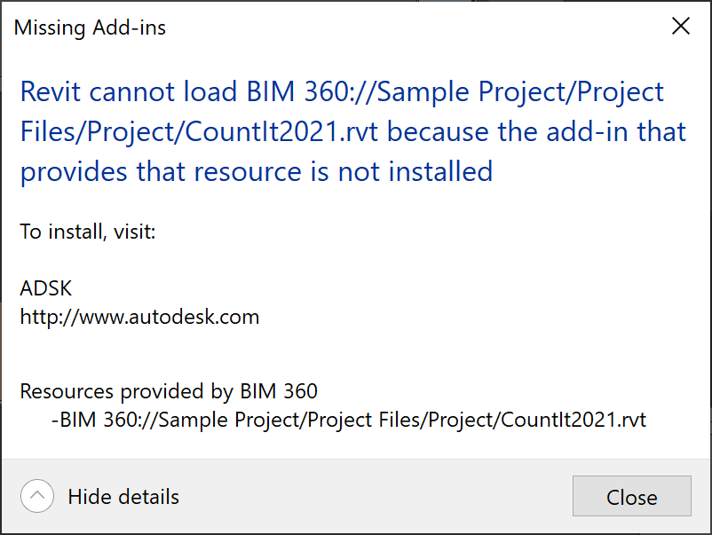

<head>
<meta http-equiv="Content-Type" content="text/html; charset=utf-8">
<link rel="stylesheet" type="text/css" href="bc.css">

</head>

<!---

- Setting AppearanceAsset properties of newly created Revit Material
  https://adndevblog.typepad.com/aec/2022/10/setting-appearanceasset-properties-of-newly-created-revit-material.html

- BIM 360 Links Not Found - Fix
  https://forums.autodesk.com/t5/revit-api-forum/bim-360-links-not-found-fix/td-p/11463147

- programming an add-in?
  thinking about the AppStore?
  check out the AppStore guidelines and many useful general development recommendations
  [The Autodesk App Store &ndash; information for Revit developers](https://www.autodesk.com/developer-network/app-store/revit)

- vs templates
  did not help: https://kwilson.io/blog/fix-visual-studio-when-templates-disappear-from-your-add-new-item-dialogue/
  a/img/vs_2019_project_template_location.png
  https://github.com/jeremytammik/VisualStudioRevitAddinWizard/releases/tag/2023.0.0.0
  added note to readme

- Coding Revit add-ins: the e-verse way
  https://blog.e-verse.com/build/coding-revit-add-ins-the-e-verse-way
  > Hi Jeremy! Nice to "meet" you. I'm an architect/coder and have worked on many Revit addins these past few years, alongside other stuff like recently building and scaling e-verse (https://e-verse.com/). I wanted to share an article we recently published on our blog to see if it could help the community, shedding some light on the structure we use for Revit addins: https://blog.e-verse.com/build/coding-revit-add-ins-the-e-verse-way. I know you've covered this subject and shared many templates over the years since I've been a reader of The Building Coder for a while now, so I figured maybe we could contribute to that if you find anything you think can add value there. There's more to come as well. Thank you!
  linkedin conversation with Francisco Maranchello, COO at e-verse, Cordoba, Córdoba, Argentina

 twitter:

Solution for BIM 360 links not found, AppStore guidelines and coding Revit add-ins the e-verse way in the #RevitAPI @AutodeskForge @AutodeskRevit #bim #DynamoBim #ForgeDevCon https://autode.sk/addintips

An important solution to fix a problem loading BIM 360 links and lots of advice on programming Revit add-ins in general
&ndash; New Revit material appearance asset
&ndash; BIM 360 links not found solution
&ndash; AppStore guidelines for Revit add-in
&ndash; Coding Revit add-ins the e-verse way
&ndash; VS wizard template location...

linkedin:

Solution for BIM 360 links not found, AppStore guidelines and coding Revit add-ins the e-verse way in the #RevitAPI

https://autode.sk/addintips

An important solution to fix a problem loading BIM 360 links and lots of advice on programming Revit add-ins in general:

- New Revit material appearance asset
- BIM 360 links not found solution
- AppStore guidelines for Revit add-in
- Coding Revit add-ins the e-verse way
- VS wizard template location...

#bim #DynamoBim #ForgeDevCon #Revit #API #IFC #SDK #AI #VisualStudio #Autodesk #AEC #adsk

the [Revit API discussion forum](http://forums.autodesk.com/t5/revit-api-forum/bd-p/160) thread

<pre class="code">
</pre>

-->

### BIM360 Links and Programming Add-Ins

Today, we share Naveen Kumar T's first Revit API blog post, an important solution to fix a problem loading BIM 360 links, and lots of tools and advice on programming Revit add-ins in general:

- [New Revit material appearance asset](#2)
- [BIM 360 links not found solution](#3)
- [AppStore guidelines for Revit add-in](#4)
- [Coding Revit add-ins the e-verse way](#5)
- [VS wizard template location](#6)

#### New Revit Material Appearance Asset

Naveen Kumar T shared a blog post in
the [DAS AEC DevBlog](https://adndevblog.typepad.com/aec) showing
how to [set `AppearanceAsset` properties of a newly created Revit material](https://adndevblog.typepad.com/aec/2022/10/setting-appearanceasset-properties-of-newly-created-revit-material.html).

Many thanks to Naveen, and looking forward to many future posts.

#### BIM 360 Links Not Found Solution 

Luiz Henrique [@ricaun](https://github.com/ricaun) Cassettari shared a helpful 
[BIM 360 links not found fix](https://forums.autodesk.com/t5/revit-api-forum/bim-360-links-not-found-fix/td-p/11463147):

A user reports to me that some of my plugins had problems with BIM360 links; after testing a lot of things, I found out what is causing the problem. It's a known problem here in the forum. It is caused by referencing a higher version of the `Newtonsoft.Json` package.

In Revit 2021, the default version of `Newtonsoft.Json` is 11; when an application or plugin requests to load `Newtonsoft.Json` version 13 and it is not found in the plugins folder, something strange happens.

Instead of ignoring and using the already loaded `Newtonsoft.Json` version 11, for some reason, Revit loads a `Newtonsoft.Json` file from the Autodesk `PnIDModeler` add-in, and it is a version 11.

Now, if you have two copies of `Newtonsoft.Json` with the same version loaded in Revit, when BIM360 tries to initialize (usually happens when you open a Revit file that requires BIM360), it will throw an exception in the Journal and the BIM360 service fails. Without the service, Revit can't load BIM360 link. It displays this message:

 <!-- 802 x 603 -->

A quick fix would be to remove or change the name of the `Newtonsoft.Json.dll` file in the Autodesk `PnIDModeler` add-in.

Or, if you are a developer using an old version like version 9, it should work; Revit will load the default version instead. But if you need to use a specific version of `Newtonsoft.Json`, be aware that it could cause some issues in Revit.

Here is Luiz' seven-minute video explanation 
on [how to fix BIM360 link not found problem](https://youtu.be/gNnZZjbBVlU):

<iframe width="480" height="270" src="https://www.youtube.com/embed/gNnZZjbBVlU" title="YouTube video player" frameborder="0" allow="accelerometer; autoplay; clipboard-write; encrypted-media; gyroscope; picture-in-picture" allowfullscreen></iframe>

Related references:

- [BIM 360 "Linked document is not found" error](https://forums.autodesk.com/t5/revit-api-forum/bim-360-quot-linked-document-is-not-found-quot-error/m-p/10638072)
- [BIM 360 Links issue](https://forums.autodesk.com/t5/revit-api-forum/bim-360-links-issue/m-p/10536461)
- [archi+lab DLL Hell is Real](https://archi-lab.net/dll-hell-is-real/)
- [Newtonsoft Json.dll Version Conflict](https://thebuildingcoder.typepad.com/blog/2022/02/getting-started-once-again.html#6)

Many thanks to Luiz Henrique for documenting and sharing this important solution!

#### AppStore Guidelines for Revit Add-In

Now, let's move on to some generic add-in hints:
if you are thinking about programming a Revit add-in at all, and especially if you are thinking about the AppStore, you should check out the AppStore guidelines and its numerous useful general development recommendations:

- [The Autodesk App Store &ndash; information for Revit developers](https://www.autodesk.com/developer-network/app-store/revit)

#### Coding Revit Add-Ins the E-Verse Way

Going much further and on into the modern development process, a comprehensive guide explaining more complex and intricate aspects of Revit add-in coding is presented by
Francisco Maranchello of [e-verse](https://e-verse.com) in his article
on [coding Revit add-ins the e-verse way](https://blog.e-verse.com/build/coding-revit-add-ins-the-e-verse-way), saying:

> I'm an architect and coder and have worked on many Revit addins these past few years, alongside other stuff like recently building and scaling [e-verse](https://e-verse.com/).
I wanted to share an article we recently published on our blog to see if it could help the community, shedding some light on the structure we use for Revit addins:
[blog.e-verse.com/build/coding-revit-add-ins-the-e-verse-way](https://blog.e-verse.com/build/coding-revit-add-ins-the-e-verse-way).
I know you've covered this subject and shared many templates over the years since I've been a reader of The Building Coder for a while now, so I figured maybe we could contribute to that if you find anything you think can add value there.
There's more to come as well.
Thank you!

Francisco covers the complete add-in ecosystem including:

- Git code repository
- A .NET framework solution containing multiple projects
- NuGet dependencies
- Post-build events for debugging and releasing 
- A configuration file to manage settings and environment variables outside the main logic
- CI/CD pipelines leveraging GitHub Actions

Very many thanks to Francisco for sharing his experience and in-depth advice!

#### VS Wizard Template Location

One of the templates mentioned above is the very simple and minimal
[Visual Studio Revit add-in template](https://github.com/jeremytammik/VisualStudioRevitAddinWizard) for
C# and VB.

I recently resolved an issue I had getting it to work on my system using Parallels on the Mac.
My template was displayed, and I had a hard time discovering why.
For instance, the thread
on how to [fix Visual Studio when templates disappear from your Add New Item dialogue](https://kwilson.io/blog/fix-visual-studio-when-templates-disappear-from-your-add-new-item-dialogue) did
not help.

Finally, I discovered that the Parallels setup had surreptitiously modified my VS project template location settings:

 <!-- 1276 x 870 -->

Once that was understood, the issue was easy to resolve, setting the location back to the default folder on the C: drive.

I also added a corresponding note to the [readme](https://github.com/jeremytammik/VisualStudioRevitAddinWizard#user-project-template-location) for
my own and others' future reference.
