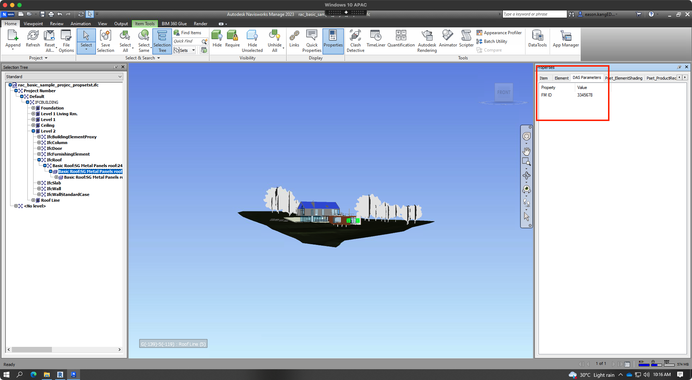
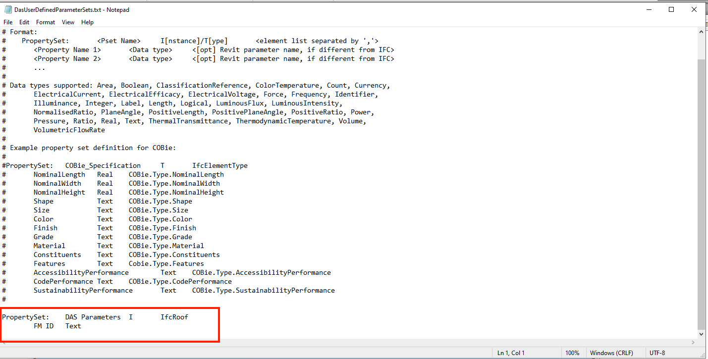

<head>
<meta http-equiv="Content-Type" content="text/html; charset=utf-8">
<link rel="stylesheet" type="text/css" href="bc.css">

</head>

<!---

- TwentyTwo
  TwentyTwo is creating forever free Autodesk® Add-Ins which help you done more with less time and effort ... Delivers as efficient, simplest as possible applications to handle tedious tasks and complex operations.
  [NAVISWORKS ADD-INS AND API TUTORIALS](https://twentytwo.space/navisworks-add-ins-development)
  [REVIT add-in DEVELOPMENT](https://twentytwo.space/revit-add-in-development/)
  [TwentyTwo blog](https://twentytwo.space/)

- Forge and IFC by Eason Kang
  https://twitter.com/AutodeskForge/status/1567800161983676416?s=20&t=qIK9wsdnKoIEA7_oVygclw
  
- [Q] Can Revit API add custom properties in an IFC file opened in Revit? Can Revit export this IFC with those new properties?
  [A] Do you know if DGN supports changing or adding properties? Is it viable using Revit API?
  Eason Kang
  For adding custom props to IFC, there is no direct way with Revit. We need to the below to achieve that:
  Open the IFC model with Revit’s OpenIFC (API: Application.OpenIFCDocument) to convert IFC to RVT
  Add customer props by share parameters and give values (sample code from Jeremy)
  Define custom Property Sets for IFC (here is a tutorial video from 3rd-party or check this AKN page)
  Specify the custom Property Sets in IFC export setup (See userDefinedPSets in Revit IFC repo to know how to construct IFCExportOptions for API)
  Export the modified RVT to IFC (API: Document.Export)
  custom Property Sets in IFC export setup.png
  Demo-Added custom prop `FM ID` in IFC.png
  Imported IFC in Navisworks.png
  Content of my user define property set.png
  In Forge Viewer
  Screen Shot 2022-07-14 at 10.49.50 AM.png 
  ifc_custom_property_1_export_setup.png
  ifc_custom_property_2_added_fm_id.png
  ifc_custom_property_3_nw_import.png
  ifc_custom_property_4_content.png
  ifc_custom_property_5_forge.png
  Hey @Eason Kang thank you for the nice explanation on adding
 
- https://thebuildingcoder.typepad.com/blog/2011/01/family-instance-missing-level-property.html#comment-5925189938
  xikes
  For those who are still stuck with this problem even when using the correct overload:
    public FamilyInstance NewFamilyInstance(
      XYZ location,
      FamilySymbol symbol,
      Element host,
      StructuralType structuralType
    )
  It is essential to pass in the function parameter host as a Level and not as an Element.
  Add a quick cast like (Level)MyHostElement and it should do the trick and the Level parameter is created properly and is not read-only.
  Keep in mind, this will screw up the offset values, but you can adjust those afterwards.

- set level id of existing element
  $ tbcsh_search.py level
  https://forums.autodesk.com/t5/revit-api-forum/levelid-is-null/m-p/11392692
  https://forums.autodesk.com/t5/revit-api-forum/change-level-on-line-based-family/m-p/10307454
  [Q] I'm placing a new face-based family instance into my Revit model with the help of the NewFamilyInstance method taking (Face, XYZ, XYZ, FamilySymbol).
  This works fine, except the instance does not have its level set to that of the host; it's set to -1 in the API and just left blank in the UI.
  I tried setting the level like such usng the placed instance `LevelId` property and also tried setting its `BuiltInParameter` `FAMILY_LEVEL_PARAM`.
  Both throw an error saying the parameter is read-only.
  [A] On some elements, the element level can only be set during the creation of the element. For that, I would assume that you need to use a different [overload of the `NewFamilyInstance` method](https://www.revitapidocs.com/2017/0c0d640b-7810-55e4-3c5e-cd295dede87b.htm). Please refer to this explanation by The Building Coder and a few recent discussions of related topics in the Revit API discussion forum:
  - [Change level of existing element](https://thebuildingcoder.typepad.com/blog/2020/06/creating-material-texture-and-retaining-pixels.html#4)
  - [LevelId is null](https://forums.autodesk.com/t5/revit-api-forum/levelid-is-null/m-p/11392692)
  - [Change level on line based family](https://forums.autodesk.com/t5/revit-api-forum/change-level-on-line-based-family/m-p/10307454)

 twitter:

 in the #RevitAPI @AutodeskForge @AutodeskRevit #bim #DynamoBim #ForgeDevCon 

&ndash; 
...

linkedin:

#bim #DynamoBim #ForgeDevCon #Revit #API #IFC #SDK #AI #VisualStudio #Autodesk #AEC #adsk

the [Revit API discussion forum](http://forums.autodesk.com/t5/revit-api-forum/bd-p/160) thread

<pre class="code">
</pre>

-->

###Element Level and IFC Properties 

#### TwentyTwo

According to its own mission statement, 
[TwentyTwo](https://twentytwo.space) is creating forever free Autodesk add-ins that help you do more with less time and effort,
delivering efficient applications, as simple as possible, to handle tedious tasks and complex operations.
Besides the [TwentyTwo blog](https://twentytwo.space),
they also share add-ins and API tutorials for both 
[Navisworks](https://twentytwo.space/navisworks-add-ins-development) and
[Revit](https://twentytwo.space/revit-add-in-development).

Many thanks to [Min Naung](https://twentytwo.space/author/mgjean) for putting together and sharing this material!

#### Forge and IFC

Wondering about your options when translating IFC model formats using the Autodesk Platform Services (APS), previously known as Forge?
Developer advocate Eason [@yiskang](https://twitter.com/yiskang) Kang put together
a comprehensive list of [FAQ and Tips for IFC translation of Model Derivative API](https://forge.autodesk.com/blog/faq-and-tips-ifc-translation-model-derivative-api) that
might help, including and not limited to:

- Overview of different available IFC conversion methods
- Georeferencing in IFC
- Troubleshooting locally
- Testing with Navisworks
- Testing with Revit
- 3rd-party IFC viewers
- Show All Presentations

#### IFC Custom Properties

Eason recently addressed another important IFC related question:

**Question:** Can the Revit API be used to add custom properties in an IFC file opened in Revit?
Can Revit export this IFC with those new properties?
Do you know if DGN supports changing or adding properties?
Is it viable using Revit API?

**Answer:** There is no direct way in Revit to add custom properties to IFC.
However, it can be achieved through the following:

- Open the IFC model with Revit’s OpenIFC
(API: [Application.OpenIFCDocument](https://www.revitapidocs.com/2023/bb14933b-a758-2b34-b160-686a28cc48cb.htm)) to
convert IFC to RVT
- Add customer properties by adding shared parameters and specifying values for them
([sample code](https://github.com/jeremytammik/FireRatingCloud/blob/master/FireRatingCloud/Cmd_1_CreateAndBindSharedParameter.cs) from
The Building Coder)
- Define custom Property Sets for IFC (here is a [tutorial video from 3rd-party](https://youtu.be/SswHKtcM3mI) or
check this [AKN page](https://knowledge.autodesk.com/search-result/caas/simplecontent/content/export-custom-bim-standards-and-property-sets-to-ifc.html))
- Specify the custom Property Sets in IFC export setup
(See [userDefinedPSets in Revit IFC repo](https://github.com/Autodesk/revit-ifc/blob/df1485b9accd598c2912a055af205ee1b03648c7/Source/IFCExporterUIOverride/IFCExportConfiguration.cs#L425) to
know how to construct IFCExportOptions for API)
- Export the modified RVT to IFC
(API: [Document.Export](https://www.revitapidocs.com/2023/7efa4eb3-8d94-b8e7-f608-3dbae751331d.htm))

 <!-- 872 x 556 -->

Custom property sets in IFC export setup

 <!-- 2032 x 1167 -->

Demo-added custom prop `FM ID` in IFC

 <!-- 1920 x 1055 -->

Imported IFC in Navisworks

 <!-- 1429 x 725 -->

Content of user defined property set

 <!-- 1583 x 982 -->

Forge Viewer

Many thanks to Eason for the useful explanation!

 <!-- 802 x 603 -->

- https://thebuildingcoder.typepad.com/blog/2011/01/family-instance-missing-level-property.html#comment-5925189938
xikes
For those who are still stuck with this problem even when using the correct overload:
public FamilyInstance NewFamilyInstance(
XYZ location,
FamilySymbol symbol,
Element host,
StructuralType structuralType
)
It is essential to pass in the function parameter host as a Level and not as an Element.
Add a quick cast like (Level)MyHostElement and it should do the trick and the Level parameter is created properly and is not read-only.
Keep in mind, this will screw up the offset values, but you can adjust those afterwards.

- set level id of existing element
$ tbcsh_search.py level
https://forums.autodesk.com/t5/revit-api-forum/levelid-is-null/m-p/11392692
https://forums.autodesk.com/t5/revit-api-forum/change-level-on-line-based-family/m-p/10307454
[Q] I'm placing a new face-based family instance into my Revit model with the help of the NewFamilyInstance method taking (Face, XYZ, XYZ, FamilySymbol).
This works fine, except the instance does not have its level set to that of the host; it's set to -1 in the API and just left blank in the UI.
I tried setting the level like such usng the placed instance `LevelId` property and also tried setting its `BuiltInParameter` `FAMILY_LEVEL_PARAM`.
Both throw an error saying the parameter is read-only.
[A] On some elements, the element level can only be set during the creation of the element. For that, I would assume that you need to use a different [overload of the `NewFamilyInstance` method](https://www.revitapidocs.com/2017/0c0d640b-7810-55e4-3c5e-cd295dede87b.htm). Please refer to this explanation by The Building Coder and a few recent discussions of related topics in the Revit API discussion forum:
- [Change level of existing element](https://thebuildingcoder.typepad.com/blog/2020/06/creating-material-texture-and-retaining-pixels.html#4)
- [LevelId is null](https://forums.autodesk.com/t5/revit-api-forum/levelid-is-null/m-p/11392692)
- [Change level on line based family](https://forums.autodesk.com/t5/revit-api-forum/change-level-on-line-based-family/m-p/10307454)

