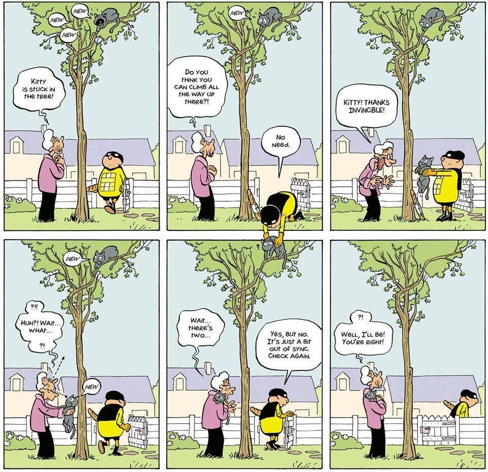

<head>
<meta http-equiv="Content-Type" content="text/html; charset=utf-8">
<link rel="stylesheet" type="text/css" href="bc.css">

</head>

<!---

- Andrea Tassera @dre_tas
You wanted to see my presentation at #AU2022 on #DevoOps for 
@AutodeskRevit
 plugins, but missed it for some reason (sore feet and hungover as the most common)? No judgement here. We've all been there.
You can now find the recording here
https://www.autodesk.com/autodesk-university/class/Deploy-Better-Plugins-Faster-Through-CICD-and-Unit-Testing-Azure-DevOps-2022

- Paul F. Aubin @paulfaubin
Were you at #autodeskuniversity2022? 
https://twitter.com/hashtag/autodeskuniversity2022?src=hashtag_click

Recorded classes are now posted. You can see mine (Taming Parametric Curvature in the Revit Family Editor) right here (complete with downloadable sample files and a step-by-step handout):
#rev
https://twitter.com/hashtag/rev?src=hashtag_click

https://www.autodesk.com/autodesk-university/class/Taming-Parametric-Curved-Geometry-Revit-Family-Editor-2022

- Chuong Ho
https://www.linkedin.com/posts/chuongmep_dynamo-bim-developer-activity-6984467588034543616-U7b6?utm_source=share&utm_medium=member_desktop
Hi everyone, I'm happy to tell you today that I've published a book online about Dynamo called Awesome Dynamo.
The Awesome Dynamo project celebrates and aggregates authors, essential and complete content with a large contribution from the community, the main purpose of which is to store dynamo core values and make it easy to learn, apply to work and explore power of Dynamo.
I'm in the process of working and perfecting it, so please help me if you can.
Ebook Online : https://lnkd.in/gHM3XVFn -- https://chuongmep.github.io/Awesome-Dynamo/intro.html
Github : https://lnkd.in/gHNqyjKH -- https://github.com/chuongmep/Awesome-Dynamo
#Dynamo #BIM #Developer #Autodesk #NoteBook

- I would like to launch a Command After the Export File Form Closes
  https://forums.autodesk.com/t5/revit-api-forum/i-would-like-to-launch-a-command-after-the-export-file-form/td-p/11494782

The standard Revit API approach to launch a command after the previous one has been completed is to use the Idling event:

https://www.revitapidocs.com/2023/56145d84-e948-730a-dc72-2a7b88a50a99.htm
https://thebuildingcoder.typepad.com/blog/about-the-author.html#5.28

However, there are other possibilities as well. For example, check out these recent discussions on similar topics:

https://forums.autodesk.com/t5/revit-api-forum/can-you-chain-idling-events/m-p/11484370

[Exporting to DWG after Dynamo script being executed](https://forums.autodesk.com/t5/revit-api-forum/exporting-to-dwg-after-dynamo-script-being-executed/m-p/11487750)

- ricaun solves
  Can you chain Idling events?
  https://forums.autodesk.com/t5/revit-api-forum/can-you-chain-idling-events/m-p/11484370

- This is pretty mind-blowing: a podcast that is entirely generated by artificial intelligence where Joe Rogan interviews Steve Jobs. 
  https://podcast.ai

 twitter:

AU 2022 classes and a new Dynamo book online, external events, Idling and launching a command after closing a form in the #RevitAPI @AutodeskForge @AutodeskRevit #bim #DynamoBim #ForgeDevCon https://autode.sk/chainidling

AU 2022 classes are available online now, as well as a new Dynamo book and resources project.
I also present some ongoing nitty-gritty discussions on external events and <code>Idling</code>
&ndash; Modern add-in deployment and testing
&ndash; Parametric curvature in families
&ndash; Awesome Dynamo online book project
&ndash; Launching command after closing form
&ndash; Chaining Idling events and other solutions...

linkedin:

AU 2022 classes and a new Dynamo book online, external events, Idling and launching a command after closing a form in the #RevitAPI

https://autode.sk/chainidling

- Modern add-in deployment and testing
- Parametric curvature in families
- Awesome Dynamo online book project
- Launching command after closing form
- Chaining Idling events and other solutions...

#bim #DynamoBim #ForgeDevCon #Revit #API #IFC #SDK #AI #VisualStudio #Autodesk #AEC #adsk

the [Revit API discussion forum](http://forums.autodesk.com/t5/revit-api-forum/bd-p/160) thread

<pre class="code">
</pre>

-->

### Can You Avoid Chaining Idling?

AU 2022 classes are available online now, as well as a new Dynamo book and resources project.
I also present some ongoing nitty-gritty discussions on external events and `Idling`:

- [Modern add-in deployment and testing](#2)
- [Parametric curvature in families](#3)
- [Awesome Dynamo online book project](#4)
- [Launching command after closing form](#5)
- [Chaining Idling events and other solutions](#6)

#### Deployment and Testing

Andrea [@dre_tas](https://twitter.com/dre_tas) Tassera shared his presentation at #AU2022 on #DevoOps for @AutodeskRevit,
[Deploy Better Plugins Faster Through CI/CD and Unit Testing in Azure DevOps](https://www.autodesk.com/autodesk-university/class/Deploy-Better-Plugins-Faster-Through-CICD-and-Unit-Testing-Azure-DevOps-2022):

> At Woods Bagot we managed to cut the deployment time of our tools from days to minutes, while increasing quality and reliability, by repurposing common concepts and tools from the Software Development world.
By implementing a DevOps philosophy in your workflow, not only do you deliver automation tools quicker, but you also empower your teams from the start, improving communication and collaboration and promoting professional growth.
You increase quality and reliability of the software product deployed, thanks to automated testing and a faster feedback cycle.
Moreover, with the ability of more frequent faster releases, backed up by live monitoring systems, developers can deploy tools that are tailored to the users and really respond to their needs.
The session will showcase how Woods Bagot has developed a full workflow for their Revit toolbar through the use an Azure DevOps pipeline, but the principles can be applied to any platform that benefits from automation tools.

#### Parametric Curvature in Families

Paul F. [@paulfaubin](https://twitter.com/paulfaubin) Aubin
discussed [Taming Parametric Curvature in the Revit Family Editor](https://www.autodesk.com/autodesk-university/class/Taming-Parametric-Curved-Geometry-Revit-Family-Editor-2022),
complete with downloadable sample files and a step-by-step handout:

> Have you ever tried to control the shape of a curved form parametrically in the Family Editor?
If so, you’ve no doubt discovered that flexing them sometimes throws you a curveball.
In this session we’ll explore several techniques to tame your unruly parametric curves.
We’ll look at examples of circles, arcs, quarter round, half round, arches, and we’ll even check out some splines.
We’ll look at both simple and compound curves.
We’ll work primarily in the traditional Family Editor but most techniques apply to the massing Family Editor environment as well. We’ll explore curvature and rotation, using both armatures (or rigs) and formulas to constrain flexing behavior. We’ll even throw in some trigonometry for good measure! After this session, I cannot guarantee that you’ll never have another misbehaving curve in your family content, but what I can promise is that you’ll come away with several useful tools to help you tame them when curve-mischief strikes!

#### Awesome Dynamo Online Book Project

Chuong Ho [initiated](https://www.linkedin.com/posts/chuongmep_dynamo-bim-developer-activity-6984467588034543616-U7b6)
the online book project Awesome Dynamo.

> The Awesome Dynamo project celebrates and aggregates authors, essential and complete content with a large contribution from the community, the main purpose of which is to store Dynamo core values and make it easy to learn, apply to work and explore power of Dynamo.

> I'm in the process of working and perfecting it, so please help me if you can:

> - [Ebook Online](https://chuongmep.github.io/Awesome-Dynamo/intro.html)
- [GitHub repository](https://github.com/chuongmep/Awesome-Dynamo)

#### Launching Command after Closing Form

Several recent [Revit API discussion forum](http://forums.autodesk.com/t5/revit-api-forum/bd-p/160) threads
deal with questions on chaining sequences of functionality, e.g.,
[I would like to launch a command after the export file form closes](https://forums.autodesk.com/t5/revit-api-forum/i-would-like-to-launch-a-command-after-the-export-file-form/td-p/11494782):

**Question:** I have a custom button that launches the DXF Export window.
I would like to be able to Launch another method after the Export window is closed.
Currently, my code opens the Export Form and then launches my other method, but I need the second method to process using information from the form.
Is there a way to do this? 

**Answer:** The standard Revit API approach to launch a command after the previous one has been completed is to use
the [Idling event](https://www.revitapidocs.com/2023/56145d84-e948-730a-dc72-2a7b88a50a99.htm).
Explanations and many samples are provided in the topic group
on [Idling and external events for modeless access and driving Revit from outside](https://thebuildingcoder.typepad.com/blog/about-the-author.html#5.28).

However, there are other possibilities as well.
For example, check out these other recent discussions on similar topics:

- [Exporting to DWG after Dynamo script being executed](https://forums.autodesk.com/t5/revit-api-forum/exporting-to-dwg-after-dynamo-script-being-executed/m-p/11487750)
- [Can you chain Idling events?](https://forums.autodesk.com/t5/revit-api-forum/can-you-chain-idling-events/m-p/11484370)

In both of those, simpler solutions seem to be possible.
We always recommand keeping to the [KISS principle](https://en.wikipedia.org/wiki/KISS_principle).

#### Chaining Idling Events and Other Solutions

At the time of writing, the discussion is not yet wrapped up
on [Can you chain Idling events?](https://forums.autodesk.com/t5/revit-api-forum/can-you-chain-idling-events/m-p/11489054)

**Question:** Is it possible to chain Idling events?

Say I have two functions, `FuncA` and `FuncB`.
I want to run FuncA the first time Revit idles, then run FuncB after FuncA is done running and Revit idles again.
Inside my FuncA handler, I am removing the handler to FuncA from `UIApp.Idling`, but I cannot assign a new handler because I don't have a valid API context.
Is there a way for me to achieve my intended behavior?
My goal is
to [download a file from a server and then open that file](https://forums.autodesk.com/t5/revit-api-forum/internal-exception-downloading-file-from-server-and-the-opening/m-p/11388140).

**Answer 1:** This doesn't sound like a good idea in general.

When Revit idles you want to run FunctionA; when it idles again you want to run FunctionA but with different settings,  i.e., subscribe to FunctionA and change what FunctionA does based on what it did last.
Then, after a set number of things that FunctionA does, unsubscribe.
In the end, you are waiting for the same event in-between doing tasks with the same function.

You can use static variable etc. to store stage of FunctionA.

**Answer 2:** Afaik, you cannot chain them directly, but you can easily achieve the same effect:

- Subscribe to the Idling event and attach `handlerA`
- In `handlerA`, unsubscribe from the `Idling` event, then subscribe to the `Idling` event and attach `handlerB`

Depending on other factors, Revit may or may not execute other actions in between the two event handler calls, but their relative order should be preserved.

You say, I cannot assign a new handler because I don't have a valid API context.

Why not? Within the Idling event handler, I thought you do have a valid Revit API context.

Question: why do the actions A and B have to be executed separately? Can't you just execute them both within the same Idling event handler?

**Answer 3:** You should create a queue service for that, subscribing and unsubscribing Revit events in your App as static.

Something like this [IdlingQueueService.cs](https://gist.github.com/ricaun/11b272c5bec46f05c3fe49525fcc3fdf) maybe helps.

You can register the service in your `IExternalApplication` and add some `Action` to run on the `Idling` event;
each one is gonna run in a different Idling Event.

**Response:** Thank you all for your responses. I have tried 3 different solutions all to no success...

If I step back from all the details of my implementation, my problem is really not too complicated.
I just wish I could run the `Execute` function of `IExternalCommand` like below.

<pre class="code">
  public Result Execute(
    ExternalCommandData commandData,
    ref string message,
    ElementSet elements)
  {
    Object1 obj1 = new Object1(commandData)
    
    await obj1.func1;
    await obj1.func2;
    obj1.func3;  // THIS IS THE ONLY REVIT INTERACTION
    
    return Autodesk.Revit.UI.Result.Succeeded;
  }
</pre>

This doesn't work because I cannot make the `Execute` function `async` but this is the theory.
Not being able to `await` `func1` and `func2` is what is causing me to dive so deep into idling events.

Func1 and Func2 have nothing to do with Revit:

- Func1 calls a web server to do authentication in a webview
- Func2 calls a web server to download Revit files
- Func3 opens those files and uses that data to manipulate the current document.

Thank you all for the guidance

**Answer:** You forgot to explain that you are using 'await' functions.

Revit does not like async stuff, and your code looks odd.
How can you add an await without an async method...

To work with async and Revit use the [Revit.Async](https://github.com/KennanChan/Revit.Async) package, so the package gonna manage the Idling stuff.

**Response:** Sorry, I just edited my reply for clarity.
I am not actually running the functions with await as shown. That is how I would do it if the Execute function could be made async.

Func1 and Func2 are async functions which is why I am/was trying to run them in idling events.

**Answer:** One thing that is important is that when an IExternalCommand is running the Idling is not gonna trigger until the command ends.
The Idling means the Revit is not busy doing something and is ready to receive some user interaction.

I guess the best approach in your case should be to use Revit.Async package with something like this.

<pre class="code">
  public async Task Execute()
  {
    await func1;
    await func2;
    await RevitTask.RunAsync(func3);  //THIS IS THE ONLY REVIT INTERACTION
  }
</pre>

Using the RevitTask you can run the func3 in Revit context.

Starting again from scratch:

One correct, reliable and effective approach to address the situation you describe is to implement
an [external event](https://thebuildingcoder.typepad.com/blog/about-the-author.html#5.28).

In the event handler, simply run the code to execute `func3`.

All the rest has nothing to do with Revit and does not require the Revit API.

Therefore, you can execute it independently, externally, and simply raise the external event after `func1` and `func2` have completed successfully.

Oh dear. I just noticed your statement:

> Func1 and Func2 are async functions which is why I am/was trying to run them in idling events.

Well, that is just about the opposite of what you could or should do.
Or at least it is not intended, afaict.

Revit and its API is single threaded.
The `Idling` event handler is single threaded.
So, as long as that event handler is busy executing, e.g., your func1 and func2, it will block Revit from doing anything else.

The purpose of the Idling event is to enable you to execute some action as soon as Revit has stopped being occupied with and therefore blocked by other tasks.

This confirms my preceding answer: it seems to me that an appropriate way to handle this would be to disconnect func1 and func2 from Revit and your add-in as much as possible, and let them trigger an external event when they are completed, to execute func3.

**Response:** So, what I ended up doing is below.
It seems to work but would love some feedback if it's unsafe:

- The main IExternalCommand Execute function just subscribes to an idling event.
- The event handler is an async function.
- In the async event handler function, I await the 3 functions and wrap the third one with RevitTask. 

This still feels like the original idling action is unnecessary and I should be able to just dive right into the async func1, but other than that this works!

**Question:** How would you recommend disconnecting Func1 and Func2? The functions are async in that they use async functions in them but I don't need them to run truly asynchronously. Blocking Revit is fine for them. At all points in my code base, I am awaiting the results of the async functions so that everything runs essentially synchronously. All of my problems are due to the fact that the Revit execute function cannot be made "async" so I cannot "await" func1 and func2. 

I can't imagine that this is the first time this problem has been encountered. It's a pretty standard workflow assuming that other plugins need some sort of authentication. First send an HTTP request to a server, then following a successful response, do all the Revit stuff.

**Answer:** Yes, this is a standard situation, and I described the standard solution above.
No need for async anything, just create an external event X, raise the event when func1 and func2 have completed, and execute func3 in the external event X handler.
No Idling needed, no async needed.

**Response:** Oh maybe I need to learn more about how async works in C# if it's different than JS development.

I would expect that if run func1 and func2 without the await flag, func2 will start before func1 has completed and the external event will be raised before func1 and func2 are completed. This would not work for my code since I would be trying to run code before the authentication step (func1) is completed.

Have I misunderstood? Thanks.

**Answer:** In the context of the Revit. API, I would recommend scrapping async completely.
That will totally simplify things.

**Response:** haha I wish, but I still need to send requests to external servers. I can't think of a way to do that without async.

**Answer:** Well, I did myself, many times,
[connecting desktop and cloud](https://github.com/jeremytammik/FireRatingCloud).

Not very long ago, `async` did not exist.
Push and pull functionality was up and running for decades before async was invented in the form you know it,
cf. the [history of C&#35;](https://learn.microsoft.com/en-us/dotnet/csharp/whats-new/csharp-version-history).

That said, [Kennan Chen](https://forums.autodesk.com/t5/user/viewprofilepage/user-id/3373609),
[author](https://github.com/KennanChan) of
[Revit.Async](https://github.com/KennanChan/Revit.Async),
underlines the suggestion above 
by Luiz Henrique [@ricaun](https://github.com/ricaun) Cassettari:

> This seems to be a highly matched case that Revit.Async is designed to solve.

> I came up with the idea of Revit.Async for a cloud-based RFA management system.
The main use case was to query the server about the information of an RFA file (your function 1),
then download it (your function 2) and finally place it with Revit API (your function 3).
I used a pattern similar to Revit.Async to chain them up and it worked like a charm.

> I suggest you to take a look at Revit.Async and you will not be disappointed.

Let's wrap up for the time being with two jokes:

- Knock, knock
- An `async` function
- Who's there?

 <!-- 960 x 928 -->

<a href="https://jordicabot.com">Jordi Cabot</a> via <a href="https://pin.it/3U3OOWG">Pinterest</a>

