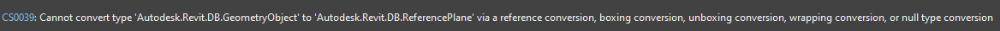
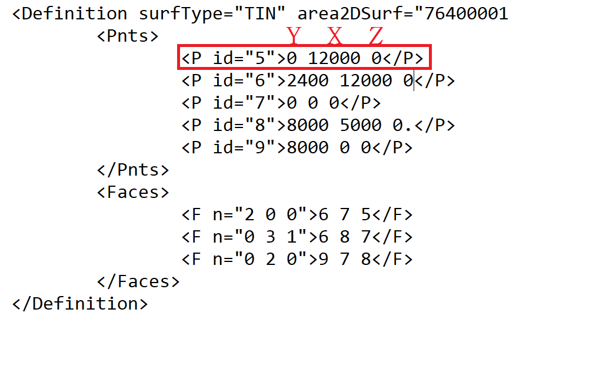
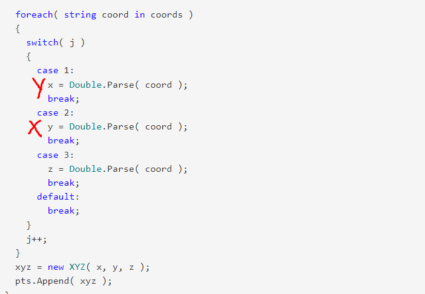

<head>
<meta http-equiv="Content-Type" content="text/html; charset=utf-8">
<link rel="stylesheet" type="text/css" href="bc.css">

</head>

<!---

- wv2
  https://autodesk.slack.com/archives/C0SR6NAP8/p1666290375135259
  Michael Dewberry, 20 Oct at 20:26
  Best practices for Revit add-ins using WebView2

- get ref plane in element
  https://autodesk.slack.com/archives/C0SR6NAP8/p1663057482687699

- Remove Revisions on Sheets
  https://forums.autodesk.com/t5/revit-api-forum/remove-revisions-on-sheets/m-p/11449618

- LandXML P tag
  https://forums.autodesk.com/t5/revit-api-forum/a-question-about-exporting-and-reading-landxml/m-p/11405400

twitter:

Using WebView2 in a #RevitAPI add-in, retrieving reference plane in element and removing revisions on sheets @AutodeskForge @AutodeskRevit #bim #DynamoBim #ForgeDevCon https://autode.sk/webview2

Using WebView2 in an add-in and other interesting little titbits from the Revit API discussion forum
&ndash; WebView2 and CefSharp in Revit add-ins
&ndash; Retrieve reference plane in element
&ndash; Remove revisions on sheets
&ndash; LandXML <code>P</code> tag...

linkedin:

Using WebView2 in a #RevitAPI add-in, retrieving reference plane in element and removing revisions on sheets

https://autode.sk/webview2

- WebView2 and CefSharp in Revit add-ins
- Retrieve reference plane in element
- Remove revisions on sheets
- LandXML <code>P</code> tag...

#bim #DynamoBim #ForgeDevCon #Revit #API #IFC #SDK #AI #VisualStudio #Autodesk #AEC #adsk

the [Revit API discussion forum](http://forums.autodesk.com/t5/revit-api-forum/bd-p/160) thread

<pre class="code">
</pre>

-->

### WebView2, LandXML, RefPlane and Revision

Questions on using WebView2 in an add-in cropped up now and then, so we share some clarification on that usage, plus a couple of other interesting little titbits from
the [Revit API discussion forum](http://forums.autodesk.com/t5/revit-api-forum/bd-p/160):

- [WebView2 and CefSharp in Revit add-ins](#2)
- [WebView2 sample add-in project](#2.1)
- [Retrieve reference plane in element](#3)
- [Remove revisions on sheets](#4)
- [LandXML `P` tag](#5)

#### WebView2 and CefSharp in Revit Add-Ins

Here are some thoughts and experiences from an internal discussion aimed at defining best practices for Revit add-ins using WebView2:

**Question:** I would like to make use of WebView2 in my add-in.
What should I do?

- Rely on future versions of Revit installing the evergreen runtime?
- Use the same User Data Folder created by Revit for instances of the web view in add-ins?

For add-ins using WebView2 in Revit 2023 and earlier, before Revit itself includes it, is there a consensus on the best place to create a custom UDF?

My interpretation of the `CoreWebView2Environment.CreateAsync` docs are that all WebView2 invocations from the same process need to agree on the `options` object, but do not need to agree on the `userDataFolder`.

A sensible location for the UDF might be a subfolder of *%LOCALAPPDATA%\Autodesk\Revit\Autodesk Revit 2023*
&ndash; this is where Revit is currently creating the CEF cache folder &ndash;
but it's not clear if we should namespace that subfolder name with our add-in name or not. 

**Answer:** You only need to agree on the UDF if you want to use the same main WV2 process, i.e., act like a "tab" in the browser as opposed to starting a new browser "window". 
 The "tab" way &ndash; sharing the UDF and options &ndash; is more performant and uses less memory.

In that case, you need to use the same options as all the other instances.
If you use your own UDF, you are free to set any options you like.

However, we are currently finding WV2 unstable with Revit and may choose not to use it, in which case we will continue using CEF.

<!--

We are seeing what looks like crashes of the rendering subprocesses in some situations like opening certain large files... memory issues? Blocking the main thread for too long?
We don't know yet.
It also crashes after leaving Revit idle overnight.

-->

The worst part is that if one instance of WV2 crashes, all the other instances stop working, even newly created ones after that.
The only remedy is to restart Revit.
Other products' experience with WV2 seems to be fine and I haven't been able to reproduce these issues outside of Revit.
You might want to put your add-in through some tests.

<!--

Actually, if it works for you without problems, we should probably compare notes how we are using and setting up WV2.

-->

In Revit, we are working on a separate component that isolates the browser code from Revit and I would like all our uses to go through that.
It supports both CEF and WV2, so it's easy to switch which one we want to use.
Among other things, it takes care of setting up the UDF, so they are all in the same location.

The development builds of Revit include both WV2 and the evergreen runtime.
In fact, it was put into Revit even before we started the migration; looks like the SSO component uses it now.

Dynamo is currently fully committed to WebView2 from v2.17, so we are testing its stability there as well.

**Response:** If there is a push to revert back to cefsharp, does this mean future releases won't have wv2?

 **Answer:** No, I think we will still be shipping both CefSharp and WV2 for some time, since our component needs both even if we're using just one of them.
 We will try to switch again once WV2 is more stable or once we have more time to figure out what's going on.
If anything, we might stop shipping CefSharp at some point. 

Also, WV2 comes included in Win11 by default and can't be uninstalled (I think...), so that will be no issue hopefully soon.

#### WebView2 Sample Add-In Project

[Alexander Laktionov](https://www.linkedin.com/in/alexander-laktionov-a50474162/), [@laksan1](https://github.com/laksan1),
shared a WebView2 sample add-in on [LinkedIn](https://www.linkedin.com/posts/alexander-laktionov-a50474162_bim-revit-autodesk-activity-6967953596038438913-R0xk?utm_source=share&utm_medium=member_desktop):

Have you ever wondered, "How can I link a plugin in Revit to an application created on a web platform?"
Usually, plug-ins in Revit are created on a ribbon, but that's not the only way.
You can create your own panel in several ways:

- RibbonPanel (built into Revit)
- Dockable Panel (built into Revit)
- Electron
- Telegram (you can create commands and call your plugins)
- Any web project and connect it to the Revit plugin via sockets (websockets or socket.io), specifically:
- WebView2

Let's talk about the last method.
What is WebView2?
The Microsoft Edge WebView2 control allows you to embed web technologies (HTML, CSS, and JavaScript) into native applications.
The WebView2 control uses Microsoft Edge as a rendering mechanism to display web content in native applications.
The [WebView2Example GitHub repository](https://github.com/laksan1/WebView2Example) shows 
such an application.

The repository contains two projects.
The first is a frontend made in angular (you can use any other framework).
It uses a single `WebView2Service` file to interact with your plugin to send data to the Revit application.
The second project is a C# project that includes the nugget package `Microsoft.Web.WebView2`.
For introductory purposes, I made a simple project that updates floors in the Revit model when they are changed in the WPF window (WebView2).

  <!-- 1958 x 1016 -->

Many thanks to Alexander for sharing this nice sample!

#### Retrieve Reference Plane in Element

Some clarification on how symbol and instance geometry is generated from the family definiton:

**Question:** How can I retrieve a reference plane that is inside an element?
I prefer to avoid opening and analysing the family file.
Is it possible to get the reference plane directly from the element via Revit API?

**Answer:** You don't need to open the family.
If there is a placed instance, you can call `GetReferenceByName` on that instance, or get all the references from it.

**Response:** I am able to get the reference using 

<pre class="code">
Reference reference=famInst.GetReferenceByName("Center (Left/Right)");
</pre>

Now, how to get the reference plane from the reference?

**Answer:** Use `GetGeometryObjectFromReference`.

**Response:** That throws an exception saying that I cannot convert `GeometryObject` to `ReferencePlane`:

 <!-- 1168 x 37 -->

**Answer:** I think the problem is that you're actually getting back a surface instead of a plane, so your cast fails.
try casting to a surface, or, better yet, check out the underlying type in Visual Studio.

A reference in an element is not a ReferencePlane element.
In the family definition, a ReferencePlane element is added, but in the family symbol and instance, all geometry generated is consumed into the single element.  
Therefore, you are receiving a Surface or more specifically a Plane, which gives you the location of the plane.
If you want to attach a dimension to it, use the Reference you get originally.
You don't have access to a separate element from this.

#### Remove Revisions on Sheets

Two solutions
to [remove revisions on sheets](https://forums.autodesk.com/t5/revit-api-forum/remove-revisions-on-sheets/m-p/11449618):

**Question:** I am writing an addin to edit revisions for many sheets simultaneously.
I see in the API that revisions can be added to a particular sheet using the `SetAdditionalRevisionIds` method.
However, I don't see an obvious way to remove revisions currently on a sheet.
(This is all assuming we are modifying revisions that were manually added and not controlled by any content on the sheet, e.g., revision clouds.)
Is there a way to remove revisions from a sheet in the API?

**Answer:** Use `GetAdditionalRevisionIds` &ndash; these are the revisions not created by revision clouds on the sheet or in any of the placed views.

From the returned collection, remove the ids of the revisions that need removing.

Then call `SetAdditionalRevisionIds` with the edited collection from above.

P.S.: `GetAllRevisionIds` will return ALL revisions, from Revision clouds and "Revision on sheet" checkboxes.

Conclusion: `GetAllRevisionIds` - `GetAdditionalRevisionIds` = RevisionIds set by revision clouds.

Note that deleting (and adding) revision clouds is only possible if the Issued state of the revision is off.

This is no needed for `SetAdditionalRevisionId` (like in UI).

**Response:** I thought I tried this method, and it made no changes (the revisions were set to 'Issued').
However, I must have done something wrong the first time, because when I reimplemented, it works great!

**Answer 2:** This week I had to solve a similar problem.
Another way to approach this matter is by using the FilteredElementCollector.
Assuming everything related to all the revisions on a sheet will be deleted, you can break it down in steps.
First, delete all revision cloud tags, secondly delete the revision clouds and finally the revisions.
Below you can see an example.
To complete the routine, I also added a bit of code to avoid conflicts with revisions that are already issued.
Hopefully this will help somebody for future use.

<pre class="code">
Dim revs As New SortedList(Of String, Boolean)
Dim colRev As New FilteredElementCollector(doc)

For Each r As Revision In colRev.OfCategory(BuiltInCategory.OST_Revisions)
   revs.Add(r.UniqueId, r.Issued)

   r.Issued = False
Next

Dim colRevClTags As New FilteredElementCollector(doc, sheet.Id)
doc.Delete(colRevClTags.OfCategory(BuiltInCategory.OST_RevisionCloudTags).ToElementIds)

Dim colRevCl As New FilteredElementCollector(doc, sheet.Id)
doc.Delete(colRevCl.OfCategory(BuiltInCategory.OST_RevisionClouds).ToElementIds)

Dim colRevs As New FilteredElementCollector(doc, sheet.Id)
doc.Delete(colRevs.OfCategory(BuiltInCategory.OST_Revisions).ToElementIds)

For Each r In revs
   Dim rev As Revision = doc.GetElement(r.Key)

   rev.Issued = r.Value
Next
</pre>

Later: Little correction.
I just edited the code fragment I posted yesterday.
Recovering the issued state of a revision doesn't seem to work by using the element id.
Using the stable unique id instead fixes the problem.

**Response:** Wow! Thanks for the solution!
Yours goes above and beyond my initial question.
I'll convert it to C# and try it out when I have some time available.

#### LandXML P Tag

[A question about exporting and reading LandXML](https://forums.autodesk.com/t5/revit-api-forum/a-question-about-exporting-and-reading-landxml/m-p/11405400),
led to an explanation of the coordinate order in the `P` tag:

**Question:** This may be a bit off-topic, but I wonder about [exporting toposurface to LandXML](https://thebuildingcoder.typepad.com/blog/2010/01/import-landxml-surface.html).

In LandXML, the `P` tag takes the coordinates in an unexpected order:
 
<pre>
  &lt;P id="1"&gt;Y X Z&lt;/P&gt;
</pre>

Why is the order of collocation (Y X Z) and not (X Y Z)?

 <!-- 1013 x 635 -->

 <!-- 702 x 486 -->

**Answer:** Yes.
That is sort of off-topic.
Not just here, but almost everywhere in the universe.
There are probably reasons for that definition, but who cares?
Are you planning to change the LandXML definition?
If so, then you might want to discuss this with the people responsible for it
at [LandXML.org](http://landxml.org).

In general, when I am programming something that connects with something else, I have to accept the given conditions and adapt to them.
It may help to know the underlying reasons, but only in theory, for my acceptance and motivation.
If I can accept the facts and motivate myself regardless, there is no need to understand the underlying reasons.
Actually, that applies to every aspect of life (and death):
"Ours is not to question why; ours is but to do or die."

Later: I discovered an answer after all, in
the [LandXML specification for the `P` tag](http://www.landxml.org/schema/LandXML-1.2/documentation/LandXML-1.2Doc_P.html#Link07F5D020):

> A surface point. it contains an id attribute and a space delimited "northing easting elevation" text value.

The order of northing, easting, elevation makes perfect sense in the LandXML domain, and translates directly to the Y, X, Z that you observe in the file format receiving its coordinates from an instance of the Revit `XYZ` class.
