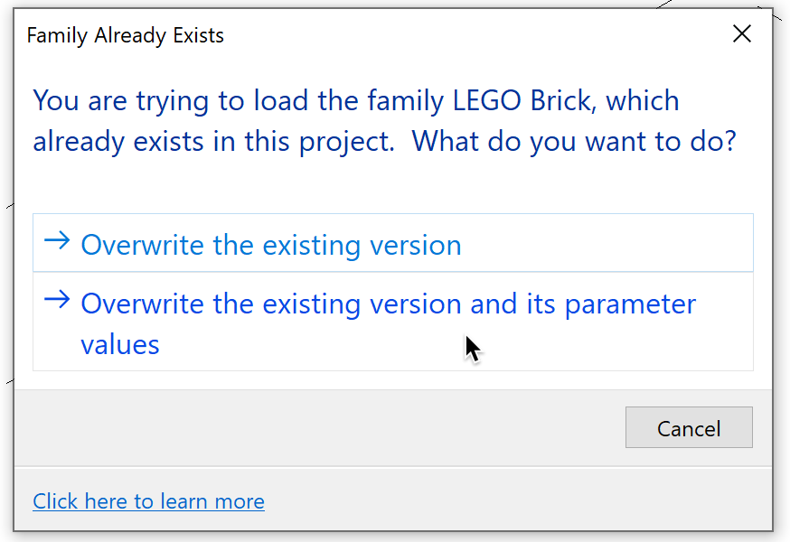

<head>
<meta http-equiv="Content-Type" content="text/html; charset=utf-8">
<link rel="stylesheet" type="text/css" href="bc.css">

</head>

<!---

- Reloading a Purged Family
  https://autodesk.slack.com/archives/C0QBNEU1E/p1667404130612699

- OKLCH in CSS: why we moved from RGB and HSL
  https://evilmartians.com/chronicles/oklch-in-css-why-quit-rgb-hsl
  1952:<"#5"> Plugging the HSL Colour Format

twitter:

New date for the Dublin onsite APS accelerator and hints on reloading a purged family with the #RevitAPI @AutodeskForge @AutodeskRevit #bim #DynamoBim #ForgeDevCon https://autode.sk/reloadpurgedfamily

New date for the Dublin onsite APS accelerator and hints on reloading a purged family
&ndash; APS accelerator Dublin Dec 5-9
&ndash; Reloading a purged family
&ndash; The CSS OKLCH colour space

linkedin:

New date for the Dublin onsite APS accelerator and hints on reloading a purged family with the #RevitAPI

https://autode.sk/reloadpurgedfamily

- APS accelerator Dublin Dec 5-9
- Reloading a purged family
- The CSS OKLCH colour space

#bim #DynamoBim #ForgeDevCon #Revit #API #IFC #SDK #AI #VisualStudio #Autodesk #AEC #adsk

the [Revit API discussion forum](http://forums.autodesk.com/t5/revit-api-forum/bd-p/160) thread

<pre class="code">
</pre>

-->

### APS Accelerator and Reloading a Purged Family

We wrap up the week announcing a new date for the Dublin onsite APS accelerator and with hints on handling the frequent problem of reloading a purged family:

- [APS accelerator Dublin Dec 5-9](#2)
- [Reloading a purged family](#3)
- [The CSS OKLCH colour space](#4)

#### APS (ex-Forge) Accelerator Dublin Dec 5-9

Quick update on behalf of Jaime:
we decided to push the date of the upcoming Dublin Hybrid Accelerator in the Autodesk Dublin Office to next month.

We are looking for customers interested in joining us onsite to work with the Developer advocates team in coding solutions using Autodesk Platform Services (formerly Forge).
In the past (pre-covid), we regularly hosted such events in the EMEA region to have software developers join us for the week.
We have an ongoing registration and would love to have a full house for the event:

- [Registration for APS Accelerator Dublin December 5-9, 2022](https://www.eventbrite.com/e/autodesk-platform-services-aps-accelerator-dublin-november-14-18-2022-registration-440477168067)
- [More details about this and other APS Accelerators](https://forge.autodesk.com/accelerator-program)

#### Reloading a Purged Family

My solution engineer colleague Lejla Secerbegovic explored how to trigger the re-loading of family types after having (accidentally) purged them.

Here is a 46-second video showing the [issue reloading purged family in Revit](https://youtu.be/bHi_9Z3srqo):

<iframe width="480" height="270" src="https://www.youtube.com/embed/bHi_9Z3srqo" title="YouTube video player" frameborder="0" allow="accelerometer; autoplay; clipboard-write; encrypted-media; gyroscope; picture-in-picture" allowfullscreen></iframe>

It seems that Revit only reloads the family if it can see any changes &ndash; however, when you purge, the .rfa doesn’t change.  
From my understanding, I need to get Revit to trigger the following dialog (which doesn’t appear if you don’t edit the .rfa):

  <!-- 874 x 600 -->

After some discussion, we moved this forward from 'it’s by design' to a workaround suggestion to create an API-based Dynamo process to open the family, create an invisible edit and then reload it. The edit would trigger the GUID change.

Here are the details of that conversation:

**Question:** Is there any way to restore the family types that were removed by purging?
As you can see in the video, if I purge the unused types and then try reloading the family, it will not restore the types (probably because it thinks nothing in the family has changed?)

**Answer:** Family types can be created in the project and are not sent back to the rfa file unless you save out a new version of the family.
So, if you load the family, make types in the project, then delete or purge them in the project, they are gone.
Reloading the rfa will just load it before the types ever existed.
You would need a backup of the projects before the purge; then you could save out the families and load them to the purged project... I think...

**Response:** Sorry if it wasn’t clear in the video: the types exist in the .rfa and were not created in the project.
Users sometimes purge “accidentally”, which removes all unused types, and this is why we are looking for a way to easily restore them from the .rfa.

I’m not using any type catalogues, but families with different types created in the family environment and this happens with EVERY family.
Please note you need to reload the family from the original location, which is typically what a user would do.
Steps to reproduce:

- Load a family with different types created in the family environment into a project
- Place one instance / one type of the family in the project
- Purge and check the not used types have been deleted
- Reload the same family from the same location without changing it any way
- RESULT: the purged types won’t be restored

Here are the 2 families I tested this with:

- <a href="zip/ls_M_Desk.rfa">M_Desk.rfa</a>, from our official library
- <a href="zip/ls_LEGO_Brick.rfa">LEGO_Brick.rfa</a> custom Lego brick used in the video

**Answer:** With your steps I can reproduce.

According to our developer, this is by design and we will not need to discuss it further.

A workaround for your customer if they want to get the types back without deleting any existing placed families would be to:

- Open the family they are trying to load that has the types
- Change something small like visual style in a view
- Use the load into project button to load the family
- Now you should see the overwrite message and get your family types back

Regarding the original post &ndash; correct!
If you did not change the family in any way, this results in a NOP.
You can also see that there is no transaction in the Undo dropdown.

This is how it is by design.

**Response:** Thanks for the response &ndash; what would then be the recommendation for the following scenario:

- Unexperienced users sometimes purge “accidentally” (there is no way to disable the function in Revit and there is no warning telling you what it really means)
- BIM Managers  need to able to restore missing types for ALL families &ndash; do we really tell them to copy the library somewhere else / edit every family?

Is there any way to force reload through the API or Dynamo?

**Answer:** The API or Dynamo could make the invisible modification allowing the reload, yes.
I envision:

- User runs tool
- Selects family file to ‘reload’
- Family is opened in the background
- Invisible edit is made
- Family is loaded into the project closing without saving

Because of the invisible modification, the family has a change and can be reloaded with all types.
They could save if they wanted to, but not much need.

Question is what is an acceptable invisible edit.
I’d personally use something like an extensible storage entity that just gets incremented by one, but that’s hard for many to self-manage.
They could use a hidden parameter with a toggle value in a similar way though.

That would be a fairly straight forward tool they can self-build if so inclined.
  
The change can also be unmade after the load.
So, it could be a Boolean "Reload Me" parameter that gets changed to true before the reload and false after.

Thanks to Angel Velez, Ivan Dobrianov, Jacob Small, Lejla Secerbegovic, Mariah Hanning and Steven Crotty for the fruitful discussion.

#### The CSS OKLCH Colour Space

Moving to a completely different topic: just half a year ago, I pointed out
the [advantages of the HSL colour space in CSS](https://thebuildingcoder.typepad.com/blog/2022/05/analysis-of-macros-journals-and-add-in-manager.html#5).

That can be yet further improved on, cf. [OKLCH in CSS: why we moved from RGB and HSL](https://evilmartians.com/chronicles/oklch-in-css-why-quit-rgb-hsl).

> In CSS, we’ve been encoding colours with `rgb()` or hex (mostly for historical reasons).
However, the new [CSS Color 4](https://www.w3.org/TR/css-color-4/) specification
adds many better ways of declaring colours in CSS.
Of these, `oklch()` is the most interesting one &ndash; this article explains why.

