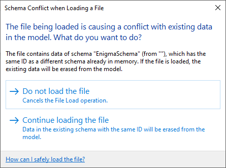

<head>
<meta http-equiv="Content-Type" content="text/html; charset=utf-8">
<link rel="stylesheet" type="text/css" href="bc.css">

</head>

<!---

- Not able to delete Extensible Storage schema
  https://forums.autodesk.com/t5/revit-api-forum/not-able-to-delete-extensible-storage-schema/m-p/11541801
  REVIT-196204 [IFC link prevents extensible storage delete]

twitter:

 with the #RevitAPI @AutodeskForge @AutodeskRevit #bim #DynamoBim #ForgeDevCon 

&ndash; 
---

linkedin:

#bim #DynamoBim #ForgeDevCon #Revit #API #IFC #SDK #AI #VisualStudio #Autodesk #AEC #adsk

the [Revit API discussion forum](http://forums.autodesk.com/t5/revit-api-forum/bd-p/160) thread

<pre class="code">
</pre>

-->

### Extensible Storage Schema Deletion

#### Welcome, George!

A warm welcome to my new colleague George Moturi!
He joined the DAS Developer Advocacy and Support team in September.
He is based in Nairobi, Kenya.
He comes with a computer science background and has worked for a few companies as a web developer.
Initially, he will be focusing on learning and supporting the Revit API, and later stepping into Forge and ACC, the Autodesk Construction Cloud.
In his own words:
 
> My name is Moturi George and I am joining as a Developer Advocate.
Prior to that, I was a software developer for 5 years.
I worked for fintech, media &amp; advertising and a digital marketing company, involving API development and integration with different providers and vendors.
I have developed applications using the .NET Framework in C#, built websites using PHP, Vue JS, HTML and CSS.
When not working, I love to watch documentaries, play computer games nad having a chat on current affairs with my neighbors or friends. 
I'm happy and excited to be part of this amazing team that is building great Autodesk Community experiences!”

  <!-- 565 × 881 pixels -->

#### WPF Form UIApplication Access

George just added a very helpful pointer to 
the [Revit API discussion forum](http://forums.autodesk.com/t5/revit-api-forum/bd-p/160) thread
on [How to call UIApplication of my current Document](https://forums.autodesk.com/t5/revit-api-forum/how-to-call-uiapplication-of-my-current-document/m-p/11570137):

**Question:** I defined a command class that implements the `Execute` method and some other methods and Windows form named `LoadFamily`. Its first parameter is `UIApplication`. However, I don't know how should I call that parameter when I'm in a form button.In other word, how should I call the `UIApplication` of my command class in one of its other methods?

**Answer:** Make the `UIApplication` instance a member variable of your form class.
Store the value you receive in the constructor in the member variable.
Use its value in the button click handler method.

Here is a tutorial that explains step by step how to create WPF forms and call its methods outside your command class:

- [Revit + WPF -Quick starting guide- Ep4: adding UI to a command](https://youtu.be/vHsqxRAqQOg)

#### Mazri's Revit, Dynamo, Web and WPF Playlists

Looking more closely at George's recommendation in the answer above, I am very impressed
with [Mazri](https://twitter.com/mazri_a),
his [YouTube BIM Diary](https://www.youtube.com/@mazrisbimdiary2045)
and [tutorial playlists](https://www.youtube.com/@mazrisbimdiary2045/playlists), covering the following areas:

- Web dev
- Dynamo &amp; Data
- Make Your own Revit Plug-ins
- Revit Programming using Python
- Revit + WPF

Specifically targeted at getting started with C# programming and WPF, Mazri recommends:

- A [nice friendly C# course for beginners](https://www.youtube.com/playlist?list=PLLAZ4kZ9dFpNIBTYHNDrhfE9C-imUXCmk)
- Microsoft's [XAML overview (WPF .NET)](https://learn.microsoft.com/en-us/dotnet/desktop/wpf/xaml/?view=netdesktop-6.0)
- Tim Corey's [Intro to WPF: Learn the basics and best practices of WPF for C#](https://youtu.be/gSfMNjWNoX0)
- AngelSix' [C# WPF UI Tutorials: 01 - The Basics](https://youtu.be/Vjldip84CXQ)

Looks like great stuff!

Many thanks to Mazri for his great work, and to George for poointing it out.

#### Extensible Starage Schema Deletion

Some developers have encountered issues creating and deleting extensible starage schemata.

Many of these can be resolved by understanding and adhering to the underlying basic principles.

The most fundamental ones are:

- A schema is identified by its GUID
- A schema can never be modified
- A schema is universal

You can get into as nice mess by violating any of these principles.
To be more precise, they cannot be biolated, but people still try to, and then things get unpleasant.

Some aspects are clarified by
this recent [Revit API discussion forum](http://forums.autodesk.com/t5/revit-api-forum/bd-p/160) thread
on [not able to delete extensible storage schema](https://forums.autodesk.com/t5/revit-api-forum/not-able-to-delete-extensible-storage-schema/m-p/11541801):

Not able to delete Extensible Storage schema
I'm trying to put together a command to erase Extensible Storage (ES) data and the corresponding Schemas for our addin in case if unwanted by the users or corrupt. I had no luck so far. 

After the ES data has been written to the file it won't go away. I am being able to delete the DataStorage elements with no troubles, but the schemas keep popping up after erasing them.

The procedure I'm trying is:

- Open the Revit file with the saved ES data.
- Delete all the DataStorage elements holding the data.
- Save and close Revit, reopen the file again.
- Erase all schemas created by our addin.
- Save and close Revit to make sure I clear the schemas in memory.
- Start Revit again.
- Use the Schema.ListSchemas() function with no documents open to make sure our custom schemas are not loaded, this clears out.
- Open the file and use the Schema.ListSchemas() function, now all the schemas that I have erased previously reappear after opening the file!

I'm using the same procedure found in the "ExtensibleStorageUtility" code example in the Revit SDK in a macro.

One observation I have that if I close Revit without saving after step 4, I get no warning to save the file, as if no changes happened to it, although I'm doing the erase inside a transaction.

I tried to utilizethe info on ES and Schema behaviors
from [CADD helpdesk hot picks – classification manager schema error](https://www.caddmicrosystems.com/blog/cadd-helpdesk-hot-picks-classification-manager-schema-error),
but that didn't work:

Any light on this would be much appreciated.

The add-in cdoes not reate the schema when it's loaded; the schema is created on demand.

**Answer:** I would avoid the try/catch with an empty catch-all.
Using that, you will never notice if anything goes wrong.
[Never catch all exceptions](https://thebuildingcoder.typepad.com/blog/2017/05/prompt-cancel-throws-exception-in-revit-2018.html#5)!

Here is an old article by The Building Coder
on [erasing extensible storage](https://thebuildingcoder.typepad.com/blog/2013/11/erasing-extensible-storage-with-linked-files.html).

**Response:** I already looked at all the Schema related posts in The Building Coder blog.
None helped solving the issue in hand.

After further investigation, it turned out that the `Schema.EraseSchemaAndAllEntitie` function is working fine in Revit 2019; it is in Revit 2022 that it is failing.
I haven't tried the in-between versions, but I suspect that this is the case for 2021 as well, as it is in that version that the API change happened, deprecating this function from the `Schema` class and providing one in the `Document` class.

<!------

I attached 2 Revit files with embedded macros for versions 2019 and 2022, both files have the same code except that the 2022 file is using the new Document.EraseSchemaAndAllEntities(...) function along with the deprecated one.

To replicate the issue:

Open file es test-V22.rvt in Revit 2022
Run the embedded macro ListSchemas to examine the OOTB existing schemas
Run the embedded macro WriteESData to write sample extensible storage data
repeat step #2, you should see a new entry of MYID:  SomeData
Save the file
Run the embedded macro DeleteSchemas
Repeat step #2, you should see that the new entry is gone
Save the file
Close Revit 2022 (Just to make sure that the schemas are cleared from memory)
Open Revit and the file again
Repeat step #2, the MYID:  SomeData schema reappears again!
If you follow the same steps on the file es test-V19.rvt in Revit 2019 the deletion will be successful.

I hope I am doing something silly, but I really think that it is an issue with the API update.
Please let me know if you need further info on the test case.

Thanks,

Sam

es test - V19.rvt
 
es test - V22.rvt

jeremy.tammik

Dear Sam,

Sorry for not following up immediately and thank you for pointing out this again.

@RPTHOMAS108  just discussed and resolved a similar issue in another thread here in the forum, and I am pretty sure that addresses the same root cause. His explanations will hopefully help resolve your problem as well:

https://thebuildingcoder.typepad.com/blog/2021/11/new-analytical-model-api.html#6

I very much hope this helps.

Cheers,

Jeremy

snajjar

Thank you for your reply @jeremy.tammik, I much appreciate all the help you provide.

-->

I read through all the blog posts and the solution by @RPTHOMAS108, and I'm sorry to say that it does not address the issue I'm having.

The solution and guidelines are addressing `DataStorage` and `Schema` creation and retrieval,
I don't have issues there, and I can say that we are following the proposed best practices mentioned in the blog post for the creation procedures:

- Schemas are being created on-demand
- Using new Entity(Schema) instead of new Entity(GUID)
- Not passing entities ByRef
- Utilizing ExtensibleStorageFilter and Schema.Lookup(SchemaGuid).

My issue is with <u>deleting</u> the schema, which is working fine in 2019 but not in 2022.

I am testing this in freshly created Revit files which I have included in my previous response with embedded macro code. The same code is being used in both files, but the 2022 one is not working.

The reason we are seeking Schema deletion is that when a Revit file that contains a newer version of the schema (adding more fields for example) and it has a linked Revit file with an older version, Revit will display a warning when the file is opened. This warning dialog is hindering our client's automation software that opens Revit files and process them automatically. We don't have control over that software nor want to suppress this warning because, while we are sure that this will not affect the tools we are developing and the integrity of the file, we can't guarantee that for all other vendors and the suppression will hide all such warnings for data coming from all the installed addins. Our goal is to provide a tool to delete our schema from the linked files to resolve the issue.

I really hope this can be looked at by the development team to see if it is a bug caused by the API update that took place in Revit 2021.

**Answer:** I've not looked into this;
it should be possible to delete the schema if it is not used regardless, so that does seem wrong (especially if it previously worked).
Did you have schema conflicts in the 2019 version though?

However, one thing that occurred to me as I read your latest message is that you should only get that warning in the first place if you've done something wrong in terms of managing the schemas.
When you create a schema with a GUID that is that version forever.
To add additional members you should create a new version and transfer the data (leave the old one alone, do not reuse it's GUID).

You say, <i>a newer version of the schema (adding more fields for example)</i>.

No such thing exists!

If you have created such a situation, you are in serious trouble.

An existing schema cannot be modified:

**Response:** I followed the procedure above (2022 version only) and was also not able to remove the schema, so regardless of misuse something seemingly warranting some further investigation with the `EraseSchemaAndAllEntities` methods perhaps. i.e. this is a clean file to start with presumably.

Note that the macro doesn't delete the `DataStorage` element, but I deleted this manually prior to step 6.
However I still wasn't able to permanently remove the schema.

I note that the old method `Schema.EraseSchemaAndAllEntities` has a Boolean `overrideWriteAccessWithUserPermission` which is not present in the new `Document` method of the same name.

This may be a conceptual choice going forward but may be part of the issue (changes to underlying method that serves both). Also, the test was only conducted within the macro environment (add-in id is explicitly set in the attribute).

I made the below minor change so any exceptions would show up but still no exceptions were reported:

/Users/jta/a/doc/revit/tbc/git/a/img/estorage_delete_1.png

Tags (0)
Add tags
Report
MESSAGE 11 OF 28
snajjar
 Contributor snajjar in reply to: RPTHOMAS108
‎2021-11-19 06:39 AM 
Thank you for the follow-up @RPTHOMAS108 and @jeremy.tammik,

Your observation is spot-on, my usual procedure is to change the guid if I ever change something in the schema so a new schema would be created, but it looks like I missed doing that in one class, and this is why I am seeking the deletion functionality. This should not be an issue for future updates, but I need to provide a resolution for the models edited by the current version.

And again, the issue with not being able to delete the schema is irrelevant to what I did wrong.

Appreciate the help!

Tags (0)
Add tags
Report
MESSAGE 12 OF 28
jeremy.tammik
 Employee jeremy.tammik in reply to: snajjar
‎2021-11-22 05:21 AM 
OK, so it seems I have to pass this on to the development team for further analysis. Are the two sample files that you shared above in a fit state to be passed on to them, or is there anything that can be simplified or cleaned up before I go ahead? Thank you!

Jeremy Tammik,  Developer Advocacy and Support, The Building Coder, Autodesk Developer Network, ADN Open
Tags (0)
Add tags
Report
MESSAGE 13 OF 28
snajjar
 Contributor snajjar in reply to: jeremy.tammik
‎2021-11-23 08:40 AM 
The files are in their simplest forms, they are freshly made out of the architectural template and contain no elements, just the embedded macro scripts.
Tags (0)
Add tags
Report
MESSAGE 14 OF 28
jeremy.tammik
 Employee jeremy.tammik in reply to: snajjar
‎2022-01-05 08:26 AM 
Happy New Year!

Thank you for your confirmation and patience. Thanks also to Richard for pointing out this existing thread in the new one raising a similar question:

https://forums.autodesk.com/t5/revit-api-forum/error-with-new-api-schema-revit/m-p/10858918

I have passed on both issues to the development team for further analysis and hopefully some helpful advice.

Jeremy Tammik,  Developer Advocacy and Support, The Building Coder, Autodesk Developer Network, ADN Open
Tags (0)
Add tags
Report
MESSAGE 15 OF 28
jeremy.tammik
 Employee jeremy.tammik in reply to: snajjar
‎2022-01-06 11:59 PM 
The devteam replied:

After running DeleteSchemas macro, open Manage > Purge Unused. In the tree, select Extensible Storage Schema.
Check the schema a9dc2b48 and click OK to purge it. Run ListSchemas &ndash; the schema is purged. So, please use Purge Unused to delete schemas without entities.
 
I pointed out that this question comes from add-in developers automating processes and asked how they should run the purge command programmatically. We'll see what they come up with next.
  
Jeremy Tammik,  Developer Advocacy and Support, The Building Coder, Autodesk Developer Network, ADN Open
Tags (0)
Add tags
Report
MESSAGE 16 OF 28
jeremy.tammik
 Employee jeremy.tammik in reply to: snajjar
‎2022-05-03 11:58 AM 
A similar issue came up again with a new customer, and the devteam underline:

I would strongly recommend to any developer not to reuse a GUID for a new or modified schema for any reason, even if you think it has been purged from one document it may not be purged from other documents and you are setting yourselves up for a potential in-memory conflict.
 
We have seen this many times from developers who copied and did not modify the GUID in our samples.

Jeremy Tammik,  Developer Advocacy and Support, The Building Coder, Autodesk Developer Network, ADN Open
Tags (0)
Add tags
Report
MESSAGE 17 OF 28
2537747694
 Observer 2537747694 in reply to: snajjar
‎2022-08-28 03:27 AM 
Hi, have you found a solution to your problem? I probably had the same problem

Tags (1)
Tags:Schema回答
 
Add tags
Report
MESSAGE 18 OF 28
Songohu_85
 Contributor Songohu_85 in reply to: snajjar
‎2022-09-02 04:03 AM 
Very recently I faced the same issue, that for some projects I got InternalException while trying to remove ExtensibleStorage schemas. The exception does not occur after I unloaded IFC links. 

Tags (0)
Add tags
Report
MESSAGE 19 OF 28
jeremy.tammik
 Employee jeremy.tammik in reply to: Songohu_85
‎2022-09-02 05:23 AM 
Wow. Thank you for a very interesting observation. It would be nice (and very useful) if the other parties concerned could test and hopefully verify this solution.

Jeremy Tammik,  Developer Advocacy and Support, The Building Coder, Autodesk Developer Network, ADN Open
Tags (0)
Add tags
Report
MESSAGE 20 OF 28
Songohu_85
 Contributor Songohu_85 in reply to: jeremy.tammik
‎2022-09-02 08:28 AM 
I created a very small example with IFC link (link with a few walls created in Revit2020).
In the file you will find 4 macros:

1. To create example schema

2. To remove example schema

3. To list all schemas

4. To remove all schemas
In Revit2020 I am not able to remove any schemas when the IFC link is loaded.

Update: InternalException when removing schemas occurs also when there is more than one project file opened (Revit 2020)

Kind regards
Marek

/Users/jta/a/doc/revit/tbc/git/a/zip/estorage_delete_schema_example.zip

Tags (0)
Add tags
Report
MESSAGE 21 OF 28
jeremy.tammik
 Employee jeremy.tammik in reply to: Songohu_85
‎2022-09-02 08:36 AM 
Beautiful! Thank you for testing, reproducing, and sharing the proof of the pudding!

Jeremy Tammik,  Developer Advocacy and Support, The Building Coder, Autodesk Developer Network, ADN Open
Tags (0)
Add tags
Report
MESSAGE 22 OF 28
jeremy.tammik
 Employee jeremy.tammik in reply to: Songohu_85
‎2022-09-05 05:29 AM 
Dear Marek,

Thank you for your report, clear description, and sample material.

Sorry to hear about this.

I logged the issue REVIT-196204 [IFC link prevents extensible storage delete] with our development team for this on your behalf as it requires further exploration and possibly a modification to our software. Please make a note of this number for future reference.

You are welcome to request an update on the status of this issue or to provide additional information on it at any time quoting this change request number.

This issue is important to me. What can I do to help?

This issue needs to be assessed by our engineering team and prioritised against all other outstanding change requests. Any information that you can provide to influence this assessment will help. Please provide the following where possible:

Impact on your application and/or your development.
The number of users affected.
The potential revenue impact to you.
The potential revenue impact to Autodesk.
Realistic timescale over which a fix would help you.
In the case of a request for a new feature or a feature enhancement, please also provide detailed Use cases for the workflows that this change would address.

This information is extremely important. Our engineering team has limited resources, and so must focus their efforts on the highest impact items. We do understand that this will cause you delays and affect your development planning, and we appreciate your cooperation and patience.

Best regards,

Jeremy

Jeremy Tammik,  Developer Advocacy and Support, The Building Coder, Autodesk Developer Network, ADN Open
Tags (0)
Add tags
Report
MESSAGE 23 OF 28
Songohu_85
 Contributor Songohu_85 in reply to: jeremy.tammik
‎2022-09-13 06:07 AM 
Dear Jeremy,

InternalException when trying to remove schemas is currently not a big issue for me.

I landed on this thread because of difficulties related to upgrade from Revit2020 to Revit2023. In a few models we experience some critical errors when trying to upgrade to version 2023. We came to the point that it could be directly or indirectly related to schemas. After we remove ExStorage schemas the upgrade to 2023 is successful.

I noticed that removing schemas and entities sometimes causes Errors and Warnings, for example:
Error: Can't keep elements joined. (Model Lines, Walls)
Warning: Highlighted lines overlap. Lines may not form closed loops. (Model Lines)
Edit: But most likely it is just because the elements are regenerated after the entitiy is removed.

I wouldn't believe that ExStorages could cause any upgrade issues  if I didn't see it happening.

What is your opinion on the possibility that ExtensibleStorage schemas and entities may cause upgrade issues?

Kind regards

Marek

Tags (0)
Add tags
Report
MESSAGE 24 OF 28
RPTHOMAS108
 Mentor RPTHOMAS108 in reply to: Songohu_85
‎2022-09-13 06:26 PM 
A link opens a document in the background but you can't edit that linked document can you.

Does the linked document contain the same schema itself?

If so, then I would see it as logical why the linked document causes issues. Should not cause an exception though.

Tags (0)
Add tags
Report
MESSAGE 25 OF 28
jeremy.tammik
 Employee jeremy.tammik in reply to: RPTHOMAS108
‎2022-09-14 01:32 AM 
Extensible storage schema is an application-wide object. If it exists at all in the application, it will populate and "infect" every single document that you touch. That makes it hard to remove, and complicated to understand.

Jeremy Tammik,  Developer Advocacy and Support, The Building Coder, Autodesk Developer Network, ADN Open
Tags (0)
Add tags
Report
MESSAGE 26 OF 28
jeremy.tammik
 Employee jeremy.tammik in reply to: Songohu_85
‎2022-11-09 06:47 AM 
Dear Marek,

Thank you for your patience

The development team analysed the issue REVIT-196204 [IFC link prevents extensible storage delete] and decided not to make any changes, explaining:

The Document class provides the method EraseSchemaAndAllEntities:

  # Erases Schema and all its Entities from the document.
  remarks
     # The Schema remains in memory.
  in ESSchema* schema
     # The Schema to erase.
  since 2021
  validate DocumentValidation::isDocumentModifiable(this)
  throws ArgumentException
     # No write access to this Schema.

The version of EraseSchemaAndAllEntities erasing Schema from all open documents had been deprecated and removed:

https://www.revitapidocs.com/2023/80983aac-0cca-c211-1c7b-b5350624f046.htm

2023 | Resource Not Available for the Active API Year: EraseSchemaAndAllEntities Method -- Erases all Entities corresponding to this Schema from all open documents and erases this Schema from memory.

The document method should be used instead:

https://www.revitapidocs.com/2023/50debcb0-3c4f-b32b-2edb-8a6ef7b4bf8d.htm

Erases Schema and all its Entities from the document.

Best regards,

Jeremy

Jeremy Tammik,  Developer Advocacy and Support, The Building Coder, Autodesk Developer Network, ADN Open

#### Extensible Storage Schema Conflict

**Question:** OK, I guess I need to jump on board the Schema issue.
I'm also getting an error for an EnigmaSchema that is in multiple files:

  <!-- 445 × 331 -->

No idea how to get this to be removed.
Any help would be appreciated.

**Answer:** You have to write a macro/addin that calls the above function and if that doesn't work it is usually due to entities on elements in nested families etc.  So it is not easy because sometimes it involves iterating families opening them calling the above and reloading them. This issue is also evident on links where the documents for such are loaded in the background and are not editable from the file they are linked into.

Once a schema is loaded, then a different one loaded with the same id will cause this.
Developers often don't appreciate that even changing the documentation for a schema makes it different.
Any change to the structure of the schema or documentation makes it different.
In this case, prevention is better than cure because the cure is very hard to achieve.

Not sure who wrote the EnigmaSchema but they obviously wanted to leave no details.

What I've also noticed in the past (not sure it is still true) is that once you get this dialogue then you can't remove the schema because it is in conflict.
So, in the case of links for example you had to unload them all and deal with each file separately, i.e., to have Revit always in a state where the conflict had not arisen when you go to remove the schema.
It made removing them from loaded families virtually impossible.
Hopefully things are not that hard anymore.

See also the suggestion above about purging, which may work from an end user perspective:

> After running DeleteSchemas macro, open Manage &gt; Purge Unused.
In the tree, select Extensible Storage Schema.
Check the schema id and click OK to purge it.
Run ListSchemas &ndash; the schema is purged.
So, please use Purge Unused to delete schemas without entities.

**Question:** 

**Answer:** 

**Response:** 

Thanks to ... for the fruitful discussion.

#### 
