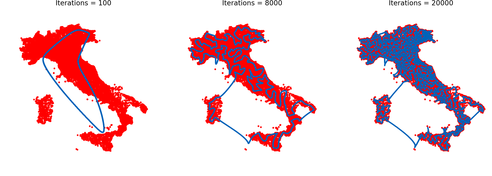

<head>
<meta http-equiv="Content-Type" content="text/html; charset=utf-8">
<link rel="stylesheet" type="text/css" href="bc.css">

</head>

<!---

- ChatGPT in Swahil:
  https://chat.openai.com/chat:
  Jeremy: can you speak swahili?
  > Huna! Naunga mkono nyumbani kwako. Samahani, sijawahi kusoma Swahili. Je, unaweza kusema kwa Kiingereza?
  jeremy: oh dear. i am afraid i cannot.
  > Asante sana. Inawezekana kukutumia lugha ya Kiingereza katika mazungumzo yetu. Kwamba ni ajabu kwa sababu Swahili ni lugha nne ya makundi ya Bantu na inatumika sana katika Afrika Mashariki. Kama una nia njema, unaweza kusoma zaidi kuhusu Swahili kupitia tovuti za mtandao.
  jeremy: i wish i could.
  > Kama unahitaji msaada zaidi, basi wasiliana nami. Napenda kusaidia katika mambo yanayohusiana na lugha za Afrika.
  jeremy: can you translate all that you said for me, please?
  > Sure! Here's my previous response translated into English:
  "Hello! I extend my hand to your home. Sorry, I haven't read Swahili. Well, can you speak English?
  Thank you very much. It is possible to use the English language in our conversation. It is strange because Swahili is one of the four languages of the Bantu group and is widely used in East Africa. If you are interested, you can learn more about Swahili through websites.
  If you need more help, please contact me. I like to help with things related to African languages."

- ChatGPT for music and poetry mimicry
  https://twitter.com/raphaelmilliere/status/1598469100535259136?t=upd7rt-_ASl8omur-JjrJQ&s=19
  Raphaël Millière @raphaelmilliere
  I asked ChatGPT to rewrite Bohemian Rhapsody to be about the life of a postdoc, and the output was flawless:

- ChatGPT for Revit API by Bird Tools, plus interesting comments
  https://www.linkedin.com/posts/bird-tools_openai-revit-code-activity-7005369990614798336-vqXP?utm_source=share&utm_medium=member_desktop
  
- ChatGPT for Revit API by Jacob Small, plus interesting comments
  https://twitter.com/JacobWSmall/status/1600477115853737984?s=20&t=pCNirHrPPDHHzLrx29q15w
  Jacob Small @JacobWSmall
  Ok, so I have an option here... I could 'try again' which might make things fail worse off as in my first go-round that resulted in brand new stuff. Or I could try and get it to improve by telling where the error was. Let's go for the later as design of anything needs iteration.
  Again, trying to guiding it like a user would guide me in a text chat (which I happen to have a few years of experience with). Already know that it's going to fail at the Id property of the undefined level variable, but we'll get there when we get the error.
  Good(ish) news, is that the new code returned a new error (new errors are good things as it often means we fixed something).
  Bad news is that it is a 'calling a variable which hasn't been defined'. The chatbot appears to be copy/pasting line by line instead of sections of code.
  In the chatbot's defense, I've done this myself a few times by not ensuring the user had robust enough boilerplate code to start with. I'm going to switch to not bothering with running this, as __revit__ also hasn't been defined. No longer a user guided chat though.
  Well it's thinking a lot... Am I not playing by the chatbot's rules?
  Ok... it doesn't take directions as well as a software engineer on the Dynamo or Revit team. Let's try the previous prompt like a user would, and just reply with the errors for another few minutes or until I get bored. 
  And yes, I could have written this from scratch by now.

- ChatGPT for Revit  
  Chuong Ho
  https://www.linkedin.com/posts/chuongmep_dynamo-gpt3-openai-activity-7007387062999928832-AyL5?utm_source=share&utm_medium=member_desktop
  Do you know, Chat GPT3, OpenAI will be coming soon Dynamo BIM 🤣. I'm still figuring out how to make them good at the moment, it's surprisingly accurate, but sometimes it's as innocent as a toddler learning to speak. I'd love to have comments right now.
  #Dynamo #GPT3 #OpenAI
  - Maycon Freitas: Awesome, Chuong Ho!! I tried to create a chatbot to integrate Revit and Whatsapp using Dynamo sometime ago (but a dumb one, not smart as GPT3) - https://www.linkedin.com/feed/update/urn:li:activity:6671175468063973376/ - and also using Forge + Whatsapp - https://www.linkedin.com/feed/update/urn:li:activity:6851904940378480640/... 
  So, as you might already know, my suggestion is: Chatbots to execute some tasks, extract data e so on. It would be a really good feature to implement.
  - Luisa Cypriano: Great one Chuong Ho :) Did you publish openly the pack already?
  - Chuong Ho: Still not yet, I working with control parameters input to help respone better for AEC

- new approach tackling an NP-complete challenge:
  [Diego Vicente](https://diego.codes/about/)
  [Using Self-Organizing Maps to solve the Traveling Salesman Problem](https://diego.codes/post/som-tsp/)

twitter:

 with the #RevitAPI @AutodeskForge @AutodeskRevit #bim #ForgeDevCon 

&ndash; 
...

linkedin:

#bim #DynamoBim #ForgeDevCon #Revit #API #IFC #SDK #AI #VisualStudio #Autodesk #AEC #adsk

the [Revit API discussion forum](http://forums.autodesk.com/t5/revit-api-forum/bd-p/160) thread

<pre class="code">
</pre>

-->

### Exploring ChatGPT

I am still in Nairobi, Kenya, getting to know the lay of the land and team here; meanwhile, OpenAI ChatGPT is making global waves and first steps are made to use it with the Revit API:

#### 

  <!-- 1380 × 880 pixels -->

####

- ChatGPT in Swahil:
  https://chat.openai.com/chat:
  Jeremy: can you speak swahili?
  > Huna! Naunga mkono nyumbani kwako. Samahani, sijawahi kusoma Swahili. Je, unaweza kusema kwa Kiingereza?
  jeremy: oh dear. i am afraid i cannot.
  > Asante sana. Inawezekana kukutumia lugha ya Kiingereza katika mazungumzo yetu. Kwamba ni ajabu kwa sababu Swahili ni lugha nne ya makundi ya Bantu na inatumika sana katika Afrika Mashariki. Kama una nia njema, unaweza kusoma zaidi kuhusu Swahili kupitia tovuti za mtandao.
  jeremy: i wish i could.
  > Kama unahitaji msaada zaidi, basi wasiliana nami. Napenda kusaidia katika mambo yanayohusiana na lugha za Afrika.
  jeremy: can you translate all that you said for me, please?
  > Sure! Here's my previous response translated into English:
  "Hello! I extend my hand to your home. Sorry, I haven't read Swahili. Well, can you speak English?
  Thank you very much. It is possible to use the English language in our conversation. It is strange because Swahili is one of the four languages of the Bantu group and is widely used in East Africa. If you are interested, you can learn more about Swahili through websites.
  If you need more help, please contact me. I like to help with things related to African languages."

- ChatGPT for music and poetry mimicry
  https://twitter.com/raphaelmilliere/status/1598469100535259136?t=upd7rt-_ASl8omur-JjrJQ&s=19
  Raphaël Millière @raphaelmilliere
  I asked ChatGPT to rewrite Bohemian Rhapsody to be about the life of a postdoc, and the output was flawless:

- ChatGPT for Revit API by Bird Tools, plus interesting comments
  https://www.linkedin.com/posts/bird-tools_openai-revit-code-activity-7005369990614798336-vqXP?utm_source=share&utm_medium=member_desktop
  
- ChatGPT for Revit API by Jacob Small, plus interesting comments
  https://twitter.com/JacobWSmall/status/1600477115853737984?s=20&t=pCNirHrPPDHHzLrx29q15w
  Jacob Small @JacobWSmall
  Ok, so I have an option here... I could 'try again' which might make things fail worse off as in my first go-round that resulted in brand new stuff. Or I could try and get it to improve by telling where the error was. Let's go for the later as design of anything needs iteration.
  Again, trying to guiding it like a user would guide me in a text chat (which I happen to have a few years of experience with). Already know that it's going to fail at the Id property of the undefined level variable, but we'll get there when we get the error.
  Good(ish) news, is that the new code returned a new error (new errors are good things as it often means we fixed something).
  Bad news is that it is a 'calling a variable which hasn't been defined'. The chatbot appears to be copy/pasting line by line instead of sections of code.
  In the chatbot's defense, I've done this myself a few times by not ensuring the user had robust enough boilerplate code to start with. I'm going to switch to not bothering with running this, as __revit__ also hasn't been defined. No longer a user guided chat though.
  Well it's thinking a lot... Am I not playing by the chatbot's rules?
  Ok... it doesn't take directions as well as a software engineer on the Dynamo or Revit team. Let's try the previous prompt like a user would, and just reply with the errors for another few minutes or until I get bored. 
  And yes, I could have written this from scratch by now.

Many thanks to ??? for the interesting pointer!

#### 

- ChatGPT for Revit  
  Chuong Ho
  https://www.linkedin.com/posts/chuongmep_dynamo-gpt3-openai-activity-7007387062999928832-AyL5?utm_source=share&utm_medium=member_desktop
  Do you know, Chat GPT3, OpenAI will be coming soon Dynamo BIM 🤣. I'm still figuring out how to make them good at the moment, it's surprisingly accurate, but sometimes it's as innocent as a toddler learning to speak. I'd love to have comments right now.
  #Dynamo #GPT3 #OpenAI
  - Maycon Freitas: Awesome, Chuong Ho!! I tried to create a chatbot to integrate Revit and Whatsapp using Dynamo sometime ago (but a dumb one, not smart as GPT3) - https://www.linkedin.com/feed/update/urn:li:activity:6671175468063973376/ - and also using Forge + Whatsapp - https://www.linkedin.com/feed/update/urn:li:activity:6851904940378480640/... 
  So, as you might already know, my suggestion is: Chatbots to execute some tasks, extract data e so on. It would be a really good feature to implement.
  - Luisa Cypriano: Great one Chuong Ho :) Did you publish openly the pack already?
  - Chuong Ho: Still not yet, I working with control parameters input to help respone better for AEC

#### Chasing the Travelling Salesman

[Diego Vicente](https://diego.codes/about/) published a new approach to tackle a really hard NP-complete challenge, 
[using self-organizing maps to solve the traveling salesman problem](https://diego.codes/post/som-tsp/).

  <!-- 2392 × 860 pixels -->

