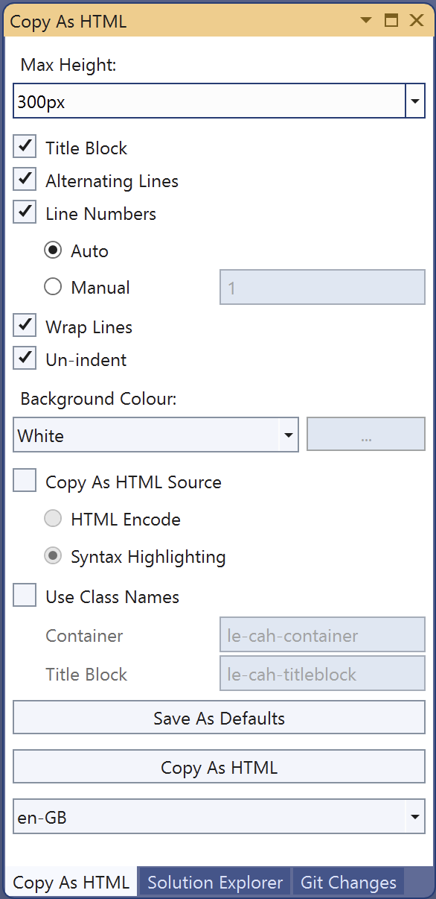

<head>
<meta http-equiv="Content-Type" content="text/html; charset=utf-8">
<link rel="stylesheet" type="text/css" href="bc.css">

</head>

<!---

- ricaun CultureInfoChanger with IDisposable 
  Unable to size MEP connectors with Revit 2021
  https://forums.autodesk.com/t5/revit-api-forum/unable-to-size-mep-connectors-with-revit-2021/m-p/9609260
  https://autodesk.slack.com/archives/C0SR6NAP8/p1671830340476069

- Bulk reloading families in a template from a slightly different location
  https://forums.autodesk.com/t5/revit-api-forum/bulk-reloading-families-in-a-template-from-a-slightly-different/td-p/11623721

- RPS + APS
  https://www.linkedin.com/posts/chuongmep_bim-python-ironpython3-activity-7009453448463077377-cQtY?utm_source=share&utm_medium=member_desktop
  Chuong Ho
  Ironpython 3.4 coming
  I'm very excited because last week the Ironpython3 team released 3.4.0. And today I also quickly brought them to CadPythonShell and RevitPythonShell, which is a great expectation of Python-friendly engineers, and Python 3.4 is a big upgrade for engineers to get the most out of these features. new feature that python brings.
  CadPythonShell : https://lnkd.in/gj6Bxqiq
  RevitPythonShell: https://lnkd.in/g5-r5PWU

- journal files au class
  Journal - step by step
  https://forums.autodesk.com/t5/revit-api-forum/journal-step-by-step/m-p/11625744
  [Q] is any idea to run journal file step by step to debug where is e problem to run all journal file? 
  [A] Nope. It is all or nothing. For more info, please check The Building Coder articles: https://thebuildingcoder.typepad.com/blog/journal/
  There is this Autodesk University class about Journal Files.
  Revit Journal Files: They Aren’t Just for Autodesk Support:
  https://www.autodesk.com/autodesk-university/class/Revit-Journal-Files-They-Arent-Just-Autodesk-Support-2018#video

twitter:

Happy New Year 2023! Sizing MEP connectors, bulk reloading families and RevitPythonShell with IronPython3 in the #RevitAPI @AutodeskAPS @AutodeskRevit #bim https://autode.sk/sizeconnector

Happy New Year 2023!
Topics to begin 
&ndash; Copy as HTML 2022
&ndash; Size MEP connector with <code>CultureInfoChanger</code>
&ndash; Journal files AU class
&ndash; Bulk reload families with <code>IFamilyLoadOptions</code>
&ndash; IronPython3, APS and RPS...

linkedin:

Happy New Year 2023!

Sizing MEP connectors, bulk reloading families and RevitPythonShell with IronPython3 in the #RevitAPI

https://autode.sk/sizeconnector

- Copy as HTML 2022
- Size MEP connector with <code>CultureInfoChanger</code>
- Journal files AU class
- Bulk reload families with <code>IFamilyLoadOptions</code>
- IronPython3, APS and RPS...

#bim #DynamoBim #AutodeskAPS #Revit #API #IFC #SDK #AI #VisualStudio #Autodesk #AEC #adsk

the [Revit API discussion forum](http://forums.autodesk.com/t5/revit-api-forum/bd-p/160) thread

<pre class="code">
</pre>

-->

### CultureInfoChanger and IronPython3

Happy New Year 2023!

Topics to begin the new year:

- [Copy as HTML 2022](#2)
- [Size MEP connector with `CultureInfoChanger`](#3)
- [Journal files AU class](#4)
- [Bulk reload families with `IFamilyLoadOptions`](#5)
- [IronPython3, APS and RPS](#6)
- [IronPython3 in pyRevit](#6.1)

#### Copy as HTML 2022

After [moving to the new Mac and switching to Visual Studio 2022](https://thebuildingcoder.typepad.com/blog/2022/12/exploring-arm-chatgpt-nairobi-and-the-tsp.html#11),
I also needed to update my C# source code colouriser.

The last time was the
[Copy as HTML update](https://thebuildingcoder.typepad.com/blog/2021/11/revit-20221-sdk-revitlookup-build-and-install.html#7) in November 2021 using the Productivity Power Tools 2017/2019.

This time around, I switched to a new extension, Copy as HTML 2022 by Tim Mathias:

> Copy selected code in HTML format while preserving syntax highlighting, indentation, background colour and font.
Options: Max Height, Title Block, Alternating Lines, Line Numbers, Wrap Lines, Un-indent, Background Colour, Class Names.
Converts RTF, outputted by VS, into HTML.

  <!-- 586 × 1206 pixels -->

You can see the results of using the new code colouriser immediately below to format the `CultureInfoChanger` sample.

I also updated [The Building Coder samples](https://github.com/jeremytammik/the_building_coder_samples) for VS 2022, in
[release 2023.1.153.5](https://github.com/jeremytammik/the_building_coder_samples/releases/tag/2023.1.153.5).

#### Size MEP Connector with CultureInfoChanger

Luiz Henrique [@ricaun](https://github.com/ricaun) Cassettari implemented a nice workaround to solve the problem raised in
the [Revit API discussion forum](http://forums.autodesk.com/t5/revit-api-forum/bd-p/160) thread
being [unable to size MEP connectors with Revit 2021](https://forums.autodesk.com/t5/revit-api-forum/unable-to-size-mep-connectors-with-revit-2021/m-p/9609260).

<i>Ekaterina.kudelina.beam</i> noticed that switching the `CurrentCulture` from `de-DE` to `en-EN` makes it possible to change connector size in a project. <i>Ricaun</i> made use of this observation to implement a `CultureInfoChanger` derived from `IDisposable` that can be used to wrap the setting, temporarily changing `CultureInfo` to English and resetting it back to the original when disposed:

<!--

/// 

/// CultureInfoChanger
/// 

public class CultureInfoChanger : IDisposable
{
    private readonly CultureInfo CultureInfo;

    /// 

    /// CultureInfoChanger
    /// 

    /// <param name="name"></param>
    public CultureInfoChanger(string name = "en")
    {
        CultureInfo = CultureInfo.CurrentCulture;
        CultureInfo.CurrentCulture = new CultureInfo(name);
    }
    /// 

    /// Dispose
    /// 

    public void Dispose()
    {
        CultureInfo.CurrentCulture = CultureInfo;
    }
}

-->

/// &lt;summary&gt; 
/// CultureInfoChanger 
/// &lt;/summary&gt; 
public class CultureInfoChanger : IDisposable 
{ 
&#160; private readonly CultureInfo CultureInfo; 
 
&#160; /// &lt;summary&gt; 
&#160; /// CultureInfoChanger 
&#160; /// &lt;/summary&gt; 
&#160; /// &lt;param name=&quot;name&quot;&gt;&lt;/param&gt; 
&#160; public CultureInfoChanger(string name = &quot;en&quot;) 
&#160; { 
&#160;&#160;&#160; CultureInfo = CultureInfo.CurrentCulture; 
&#160;&#160;&#160; CultureInfo.CurrentCulture = new CultureInfo(name); 
&#160; } 
&#160; /// &lt;summary&gt; 
&#160; /// Dispose 
&#160; /// &lt;/summary&gt; 
&#160; public void Dispose() 
&#160; { 
&#160;&#160;&#160; CultureInfo.CurrentCulture = CultureInfo; 
&#160; } 
}

The code to use it could be something like this.

<!--

<pre class="code">
using (new CultureInfoChanger())
{
    connector.Radius = 0.5;
}
</pre>

-->

using (new CultureInfoChanger()) 
{ 
&#160; connector.Radius = 0.5; 
}

An extension should be perfect in this case, some `SetRadius`, `SetWidth`, and `SetHeight`.

<!--

<pre class="code">
  connector.SetRadius(0.5);
  connector.SetHeight(0.5);
  connector.SetWidth(0.5);

/// 

/// Set the radius of the connector. 
/// 

/// <param name="connector"></param>
/// <param name="radius"></param>
public static void SetRadius(this Connector connector, double radius)
{
    using (new CultureInfoChanger())
    {
        connector.Radius = radius;
    }
}
</pre>

-->

&#160; connector.SetRadius(0.5); 
&#160; connector.SetHeight(0.5); 
&#160; connector.SetWidth(0.5); 
 
/// &lt;summary&gt; 
/// Set the radius of the connector.  
/// &lt;/summary&gt; 
/// &lt;param name=&quot;connector&quot;&gt;&lt;/param&gt; 
/// &lt;param name=&quot;radius&quot;&gt;&lt;/param&gt; 
public static void SetRadius(this Connector connector, double radius) 
{ 
&#160; using (new CultureInfoChanger()) 
&#160; { 
&#160;&#160;&#160; connector.Radius = radius; 
&#160; } 
}

The source code for the full extension with a command sample is provided in
[Ricaun's ConnectorSetValueExtension.cs gist](https://gist.github.com/ricaun/693470e914295786fa62a2be6c67e662):

> Connector Set Value Extension for Revit to 'fix' the ArgumentOutOfRangeException when setting Radius, Width, and Height.

Many thanks to Luiz Henrique for this nice solution!

#### Journal Files AU Class

Luiz Henrique also pointed out an interesting AU class on journal files in the thread
on [journal step by step](https://forums.autodesk.com/t5/revit-api-forum/journal-step-by-step/m-p/11625744):

**Question:** Any idea how to run a journal file step by step to debug a problem running it?

**Answer:** Nope. It is all or nothing.
For more info, please check The Building Coder articles in the [Journal category](https://thebuildingcoder.typepad.com/blog/journal).

You could look at the Autodesk University class 
on [Revit Journal files: they aren’t just for Autodesk support](https://www.autodesk.com/autodesk-university/class/Revit-Journal-Files-They-Arent-Just-Autodesk-Support-2018#video).

#### Bulk Reload Families with IFamilyLoadOptions

Before Christmas, I had a nice and fruitful conversation
with [@Eatrevitpoopcad](https://forums.autodesk.com/t5/user/viewprofilepage/user-id/10364294)
on [bulk reloading families in a template from a slightly different location](https://forums.autodesk.com/t5/revit-api-forum/bulk-reloading-families-in-a-template-from-a-slightly-different/td-p/11623721),
helping to get started working on a macro to automate the execution of `LoadFamily` with an `IFamilyLoadOptions` handler and saving a large amount of manual labour.

#### IronPython3, APS and RPS

Chuong Ho shared some exciting news on [IronPython3](https://ironpython.net), APS and RPS.

RPS is the beloved [RevitPythonShell](ttps://github.com/architecture-building-systems/revitpythonshell) that
adds an IronPython interpreter to Revit and lets you to write plugins for Revit in Python.
Even better, it provides you with an interactive shell that lets you see the results of your code as you type it.
This is great for exploring the Revit API while writing your Revit Addins, especially in combination with
the [RevitLookup database exploration tool](https://github.com/jeremytammik/RevitLookup).

APS is the [CADPythonShell](https://github.com/chuongmep/CadPythonShell), a fork of RevitPythonShell, bringing an IronPython interpreter to AutoCAD as well.

Chuong Ho [announced](https://www.linkedin.com/posts/chuongmep_bim-python-ironpython3-activity-7009453448463077377-cQtY?utm_source=share&utm_medium=member_desktop) the
advent of IronPython 3.4:

> I'm very excited because last week the IronPython3 team released 3.4.0.
Today, I also quickly brought them to CadPythonShell and RevitPythonShell, which is a great expectation of Python-friendly engineers. Python 3.4 is a big upgrade for engineers to get the most out of the new features that Python brings.

The RevitPythonShell enhancement was submitted, discussed and merged in
the [PR 136 &ndash; support IronPython3.4](https://github.com/architecture-building-systems/revitpythonshell/pull/136).

Many thanks to Chuong Ho for implementing this!

#### IronPython3 in pyRevit

Ehsan Iran Nejad added in his [comment below](https://thebuildingcoder.typepad.com/blog/2023/01/cultureinfochanger-and-ironpython3.html#comment-6080745754):

> We added [IronPython3 to pyRevit work-in-progress](https://discourse.pyrevitlabs.io/t/ironpython-3-4-0/1310) as well...

