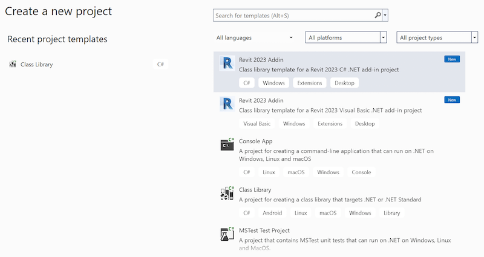

<head>
<meta http-equiv="Content-Type" content="text/html; charset=utf-8">
<link rel="stylesheet" type="text/css" href="bc.css">

</head>

<!---

- /Users/jta/a/lib/revit/jeremy/diff_2023_2023_1.txt

twitter:

Analysing the recent @AutodeskRevit 2023.1 and #RevitAPI update, add-in wizard for Visual Studio 2022 and tracking work done on the #BIM @AutodeskAPS https://autode.sk/3W4mDU2

Analysing the recent Revit SDK update, and still setting up my new Mac PC
&ndash; What's new in Revit 2023.1
&ndash; Revit 2023.1 SDK update
&ndash; Add-In wizard template in VS 2022
&ndash; Track work with element lister + TrackChanges...

linkedin:

Analysing the recent Revit 2023.1 and #RevitAPI update, add-in wizard for Visual Studio 2022 and tracking work done on the #BIM:

https://autode.sk/3W4mDU2

- What's new in Revit 2023.1
- Revit 2023.1 SDK update
- Add-In wizard template in VS 2022
- Track work with element lister + TrackChanges...

#bim #DynamoBim #AutodeskAPS #Revit #API #IFC #SDK #AI #VisualStudio #Autodesk #AEC #adsk

the [Revit API discussion forum](http://forums.autodesk.com/t5/revit-api-forum/bd-p/160) thread

<pre class="code">
</pre>

-->

### SDK, Add-In Wizard and TrackChanges Updates

Analysing the recent Revit SDK update, and
still [setting up my new Mac PC](https://thebuildingcoder.typepad.com/blog/2022/12/exploring-arm-chatgpt-nairobi-and-the-tsp.html#11):

- [What's new in Revit 2023.1](#1)
- [Revit 2023.1 SDK update](#2)
- [Add-In wizard template in VS 2022](#3)
- [Track work with element lister + TrackChanges](#4)

#### What's New in Revit 2023.1

Revit 2023.1 has been released and includes numerous important enhancements, 
cf. [What's New in Revit 2023](https://help.autodesk.com/view/RVT/2023/ENU/?guid=GUID-C81929D7-02CB-4BF7-A637-9B98EC9EB38B) &gt; 2023.1 Release.

Here are two that stand out at first glance for us API aficionados:

- [Automatically Enabled Tag Leader](https://help.autodesk.com/view/RVT/2023/ENU/?guid=GUID-3451EA78-36B5-41CA-9577-76BD9CBC330D),
answering the recent [Revit API discussion forum](http://forums.autodesk.com/t5/revit-api-forum/bd-p/160) thread
on ["Add Leader" failure resolution](https://forums.autodesk.com/t5/revit-api-forum/quot-add-leader-quot-failure-resolution/td-p/11612092)
- [Curved Analytical Panel](https://help.autodesk.com/view/RVT/2023/ENU/?guid=GUID-0D839F7D-3B73-41C3-8134-3FDF40B793BB),
reflected in the SDK update discussed next

#### Revit 2023.1 SDK Update

An update of the Revit SDK has been released for Revit 2023.1 to
the [Revit Developer Center autodesk.com/developrevit](https://www.autodesk.com/developer-network/platform-technologies/revit).

I installed and compared it with the original Revit 2023 SDK and detected
only [very small differences](zip/diff_2023_2023_1.txt).

Comparing only directories indicates no changes whatsoever in the folder structure:

<pre>
% diff du2023.txt du2023_1.txt

842c842
< 2023
---
> 542280	2023.1
</pre>

Comparing files and directories uncovers one new and one modified file:

<pre>
% diff ff2023.txt ff2023_1.txt

1009a1010
> ./Samples/ContextualAnalyticalModel/CS/CreateAnalyticalCurvedPanel.cs
1966c1967
< ./Samples/GeometryAPI/GeometryCreation_BooleanOperation/CS/AnalysisVisualizationFramework .cs
---
> ./Samples/GeometryAPI/GeometryCreation_BooleanOperation/CS/AnalysisVisualizationFramework.cs
3913d3913
< ./ff2023.txt
</pre>

In summary, the extraneous space character that I reported to the development team was removed in the `AnalysisVisualizationFramework.cs` module filename, and a new C# sample module `CreateAnalyticalCurvedPanel.cs` was added to the ContextualAnalyticalModel SDK sample.

So, no need to update unless you happen to be specifically interested in those.

I integrated these two changes manually into
the [RevitSdkSamples GitHub repo](https://github.com/jeremytammik/RevitSdkSamples)
in [release 2023.1.0.0](https://github.com/jeremytammik/RevitSdkSamples/releases/tag/2023.1.0.0).

#### Add-In Wizard Template in VS 2022

After that analysis, I encountered the need to implement a new Revit add-in skeleton, and hence get
my [Visual Studio Revit add-in wizard `VisualStudioRevitAddinWizard`](https://github.com/jeremytammik/VisualStudioRevitAddinWizard) up
and running on the new machine, for the first time on Visual Studio 2022.
First, Visual Studio 2022 prompted me to update it to version 17.4.3.
`install.bat` was set up to copy the template zip files to the `C:` drive, which required me to modify
the [VS wizard template location](https://thebuildingcoder.typepad.com/blog/2022/10/bim360-links-and-programming-add-ins.html#6) last
time I tried.
I then noticed that the `\\mac\` folder actually maps to my `Y:` drive and left the VS Options setting as is.
I also [cleared the Visual Studio 2022 project template cache](https://learn.microsoft.com/en-us/answers/questions/714454/location-of-visual-studio-2022-project-template-ca.html).
Without really knowing which of these steps was required and which was not, I ended up with a working template in the end:

 <!-- 800 × 425 pixels -->

<!--
PS C:\Users\jta\Documents> mkdir "Visual Studio 2022\Templates\ProjectTemplates"
PS Y:\a\src\rvt\VisualStudioRevitAddinWizard> .\install.bat 2022
-->

The current state of my template is captured
in [VisualStudioRevitAddinWizard release 2023.0.0.2](https://github.com/jeremytammik/VisualStudioRevitAddinWizard/releases/tag/2023.0.0.2).

#### Track Work with Element Lister + TrackChanges

The [Revit API discussion forum](http://forums.autodesk.com/t5/revit-api-forum/bd-p/160) thread
on [journal step by step](https://forums.autodesk.com/t5/revit-api-forum/journal-step-by-step/m-p/11625744):
already generated one note of interest here in the lost blog post,
on the [journal files AU class](https://thebuildingcoder.typepad.com/blog/2023/01/cultureinfochanger-and-ironpython3.html#4).
Now, another point came up:

**Question:** Some managers are concerned about staffers working remotely, partly because managers can’t be sure that work is actually being done.
Can Revit journals be queried to determine how much actual work happened during a Revit session?

**Answer:** I am sure they can. 

Personally, I would approach that question differently, using a technique more similar to the super-simple element lister or the `TrackChanges` app:

<ul>
<li><a href="http://thebuildingcoder.typepad.com/blog/2014/09/debugging-and-maintaining-the-image-relationship.html#2"> Element Lister Description and Questions</a></li>
<li><a href="http://thebuildingcoder.typepad.com/blog/2016/01/tracking-element-modification.html">Tracking Element Modification</a></li>
<li><a href="http://thebuildingcoder.typepad.com/blog/2016/03/implementing-the-trackchangescloud-external-event.html">Implementing the TrackChangesCloud External Event</a></li>
<li><a href="http://thebuildingcoder.typepad.com/blog/2018/02/retrieving-newly-created-element-ids.html">Retrieving Newly Created Element Ids &ndash; Using the Element Lister</a></li>
<li><a href="https://thebuildingcoder.typepad.com/blog/2021/01/line-subcategory-filter-nw-and-modification-tracking.html#3">Revit Project Modification Tracking</a></li>
</ul>

**Response:** Thanks very much, Mr. T.!
I am acutely aware that discussing this sort of tracking can seem like shades of Big Brother, but in defence of company management, since they are paying money to people in exchange for work, management has some right to ensuring that the work is being done.
How management then uses that information is a separate consideration, of course.
Thanks again, sir.

**Answer:** Yup, such is the world we inhabit and co-create.
I guess the most complete understanding of work done may be achieved using a combination of all three methods:
step-by-step commands in the journal file, list of new and modified elements between certain snapshots, and evolution of the entire BIM from humble beginnings to soaring architectural glory...
