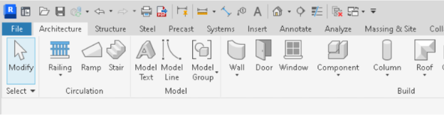
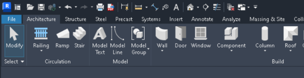
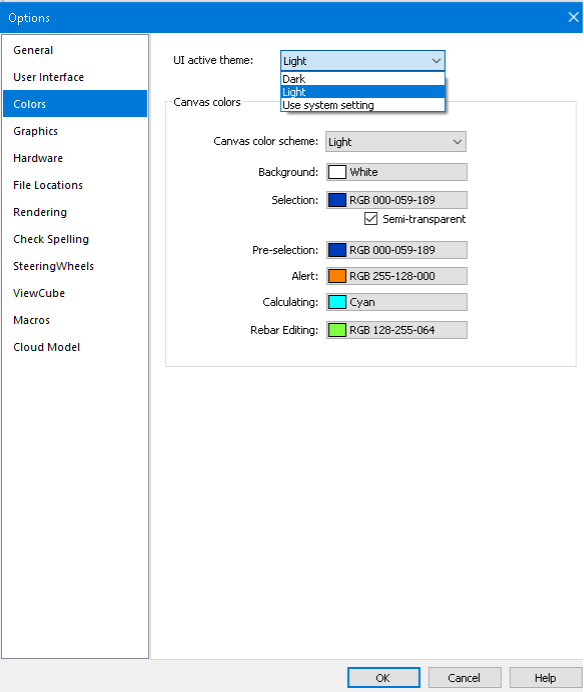
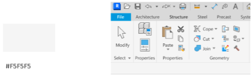
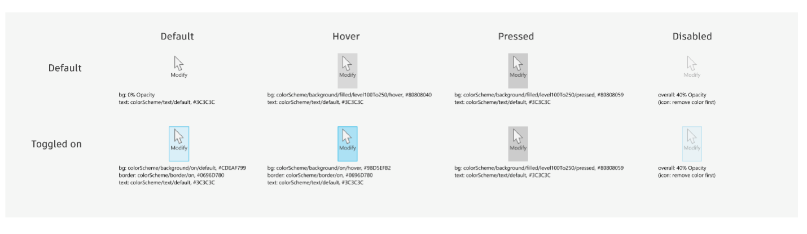
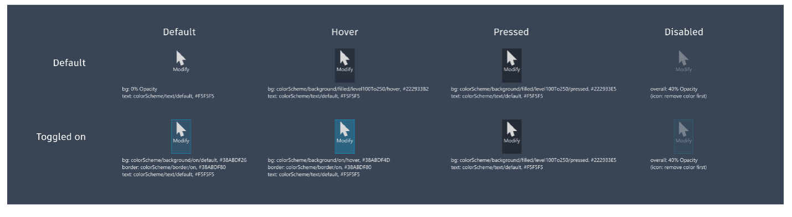

<head>
<meta http-equiv="Content-Type" content="text/html; charset=utf-8">
<link rel="stylesheet" type="text/css" href="bc.css">

</head>

<!---

twitter:

 @AutodeskRevit  #RevitAPI  #BIM @AutodeskAPS 

&ndash; 
...

linkedin:

#bim #DynamoBim #AutodeskAPS #Revit #API #IFC #SDK #AI #VisualStudio #Autodesk #AEC #adsk

the [Revit API discussion forum](http://forums.autodesk.com/t5/revit-api-forum/bd-p/160) thread

<pre class="code">
</pre>

-->

### Dark Theme Possibility Looming

Happy New Year of the Rabbit, xīnnián hǎo, 新年好!

 <!-- 800 × 514 pixels -->

The Spring Festival is coming up this weekend, starting on Sunday, January 22, celebrating 
the [Chinese New Year](https://en.wikipedia.org/wiki/Chinese_New_Year) and 
another [Year of the Rabbit](https://en.wikipedia.org/wiki/Rabbit_(zodiac)).

In the lunar calendar, 2023 is a Water Rabbit Year.
The sign of the Rabbit is a symbol of longevity, peace, and prosperity in Chinese culture.
2023 is predicted to be a year of hope, especially after the long pandemic period.
Wishing all of us lots of health, energy and happiness in the new year!

#### Dark Theme Possibility Looming

We recently announced internal thoughts
on [possibly converting the internal representation of Revit element ids from 32 to 64 bit in a future release of Revit](https://thebuildingcoder.typepad.com/blog/2022/11/64-bit-element-ids-maybe.html).

In a similar vein, here is another internal topic being pondered.
Please note the important safe harbor statement concerning these thoughts:
 
> Roadmaps are plans, not promises.
We’re as excited as you to see new functionality make it into the products, but the development, releases, and timing of any features or functionality remains at our sole discretion.
These updates should not be used to make purchasing decisions.

So, the possibility that I would like to present today concerns supporting a Dark Theme UI in Revit add-ins:

#### Dark Theme Switching

Setting the UI Active Theme will switch the appearance of the Ribbon between light gray and dark blue, with three options:

- Light
- Dark 
- Use system setting
&ndash; Windows supports light and dark color schemes.
If you choose this option, Revit will use the Windows color scheme and switch to a matching theme accordingly.

Light:

 <!-- 624 × 162 pixels -->

Dark:

 <!-- 624 × 160 pixels -->

The UI Active Theme options can define other colour settings to override the default ones:

 <!-- 584 × 692 pixels -->

 
#### Dark Theme API Information

New properties and events may be added for dark theme support:

- ThemeChangedEventArgs &ndash; Arguments for the ThemeChanged event
- UIThemeManager.CurrentTheme &ndash; Allows you to set /get the overall theme for the Revit session
- UIThemeManager.FollowSystemColorTheme &ndash; Allows you to set /get if the overall theme follows operating system color theme 
- UIThemeManager.CurrentCanvasTheme &ndash; Allows you to set/get a canvas theme for the current Revit session (as opposed to the default theme)
- ColorOption &ndash; Allows you to set/get the colors in the current canvas theme

#### Dark Theme Add-In Considerations

Here are samples of the default dark theme ribbon background and button colour settings:

Light ribbon background:

 <!-- 508 × 160 pixels -->

Dark ribbon background:

 <!-- 496 × 160 pixels -->

 
Light ribbon buttons:

 <!-- 1430 × 415 pixels -->

Dark ribbon buttons:

 <!-- 1430 × 394 pixels -->

 
- Small button size: 16x16px
- Large button size: 32x32px
- Resolution: 96 DPI
- Icons

#### Code Example: Handling Themed Ribbon Icons

<ol start="18" style="background: #ffffff; margin: 0; padding: 0;">
<li>internal class TestRibbon : IExternalApplication</li>
<li style="background: #f3f3f3">{</li>
<li>&#160; private PushButton m_ribbonBtn;</li>
<li style="background: #f3f3f3">&#160; public Result OnStartup(UIControlledApplication application)</li>
<li>&#160; {</li>
<li style="background: #f3f3f3">&#160;&#160;&#160; var ribbonPanel = application.CreateRibbonPanel(&quot;33900745-04F5-4CC2-9BAC-3230716E3A54&quot;, &quot;Test&quot;);</li>
<li>&#160;&#160;&#160; var buttonData = new PushButtonData(&quot;Test&quot;, &quot;Test&quot;, typeof(CmdEntry).Assembly.Location, typeof(CmdEntry).FullName);</li>
<li style="background: #f3f3f3">&#160;&#160;&#160; buttonData.AvailabilityClassName = typeof(CmdEntry).FullName;</li>
<li>&#160;&#160;&#160; m_ribbonBtn = ribbonPanel.AddItem(buttonData) as PushButton;</li>
<li style="background: #f3f3f3">&#160;&#160;&#160; updateImageByTheme();</li>
<li>&#160;&#160;&#160; application.ThemeChanged += ThemeChanged;</li>
<li style="background: #f3f3f3">&#160;&#160;&#160; return Result.Succeeded;</li>
<li>&#160; }</li>
<li style="background: #f3f3f3">&#160; private void setButtonImage(string pic, string largePic)</li>
<li>&#160; {</li>
<li style="background: #f3f3f3">&#160;&#160;&#160; var assemblyLocation = typeof(TestRibbon).Assembly.Location;</li>
<li>&#160;&#160;&#160; var assemblyDirectory = Path.GetDirectoryName(assemblyLocation);</li>
<li style="background: #f3f3f3">&#160;&#160;&#160; var imagePath = Path.Combine(assemblyDirectory, pic);</li>
<li>&#160;&#160;&#160; var largeImagePath = Path.Combine(assemblyDirectory, largePic);</li>
<li style="background: #f3f3f3">&#160;&#160;&#160; if (File.Exists(imagePath))</li>
<li>&#160;&#160;&#160;&#160;&#160; m_ribbonBtn.Image = new System.Windows.Media.Imaging.BitmapImage(new Uri(imagePath));</li>
<li style="background: #f3f3f3">&#160;&#160;&#160; if (File.Exists(largeImagePath))</li>
<li>&#160;&#160;&#160;&#160;&#160; m_ribbonBtn.LargeImage = new System.Windows.Media.Imaging.BitmapImage(new Uri(largeImagePath));</li>
<li style="background: #f3f3f3">&#160; }</li>
<li>&#160; private void updateImageByTheme()</li>
<li style="background: #f3f3f3">&#160; {</li>
<li>&#160;&#160;&#160; UITheme theme = UIThemeManager.CurrentTheme;</li>
<li style="background: #f3f3f3">&#160;&#160;&#160; switch (theme)</li>
<li>&#160;&#160;&#160; {</li>
<li style="background: #f3f3f3">&#160;&#160;&#160;&#160;&#160; case UITheme.Dark:</li>
<li>&#160;&#160;&#160;&#160;&#160;&#160;&#160; setButtonImage(&quot;dark.png&quot;, &quot;darkLarge.png&quot;);</li>
<li style="background: #f3f3f3">&#160;&#160;&#160;&#160;&#160;&#160;&#160; break;</li>
<li>&#160;&#160;&#160;&#160;&#160; case UITheme.Light:</li>
<li style="background: #f3f3f3">&#160;&#160;&#160;&#160;&#160;&#160;&#160; setButtonImage(&quot;light.png&quot;, &quot;lightLarge.png&quot;);</li>
<li>&#160;&#160;&#160;&#160;&#160;&#160;&#160; break;</li>
<li style="background: #f3f3f3">&#160;&#160;&#160; }</li>
<li>&#160; }</li>
<li style="background: #f3f3f3">&#160; private void ThemeChanged(object sender, Autodesk.Revit.UI.Events.ThemeChangedEventArgs e)</li>
<li>&#160; {</li>
<li style="background: #f3f3f3">&#160;&#160;&#160; updateImageByTheme();</li>
<li>&#160; }</li>
<li style="background: #f3f3f3">}</li>
</ol>

#### Dark Theme Additional Notes

Please note that only the 1st level UI supports the dark theme option.

#### 

#### 

**Question:** 

**Answer:** 

**Response:** 
