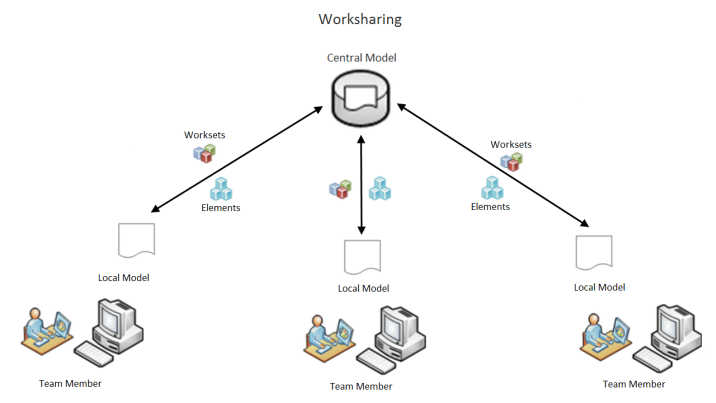

<head>
<meta http-equiv="Content-Type" content="text/html; charset=utf-8">
<link rel="stylesheet" type="text/css" href="bc.css">

</head>

<!---

- Community Conversations
  https://www.linkedin.com/feed/update/urn:li:activity:7021162362904735744?utm_source=share&utm_medium=member_desktop
  past events
  https://forums.autodesk.com/t5/community-conversations/eb-p/communityconversations?include_past=true
  upcoming
  https://forums.autodesk.com/t5/community-conversations/eb-p/communityconversations?include_upcoming=true&include_ongoing=true
  > Community Conversations are webinars led by Community members on their areas of expertise, hosted by Community Managers. Join a session to delve into product features, discover innovative workflows, learn tools and techniques, and make connections in the Community.

- Parameters API ... nice documentation
  https://aps.autodesk.com/en/docs/parameters/v1/overview/introduction/
  The Parameters API will work alongside the Revit API to load parameters from the service into Revit projects and families.

- insight and experience handling multiple updaters
  and iterative use of SetExecutionOrder
  an interesting background information based on several man-years of experience by two important contributors 
  Can the method "SetExecutionOrder" by used to set the order of more than two IUpdaters
  https://forums.autodesk.com/t5/revit-api-forum/can-the-method-quot-setexecutionorder-quot-by-used-to-set-the/m-p/11683732#M68598

- Richard provided another solution to solve the question 
  Try block not catching owner/permission locks
  https://forums.autodesk.com/t5/revit-api-forum/try-block-not-catching-owner-permission-locks/m-p/11683634#M68596

- Speckle [Chuong Ho: Featured Developer](https://speckle.systems/blog/chuong-ho-featured-developer)
 
twitter:

Recordings of the roadmap presentations, new parameters API, handling multiple updaters and worksharing in the #RevitAPI #BIM @AutodeskAPS @AutodeskRevit https://autode.sk/multipledmu

Recordings of the roadmap presentations, handling updaters and worksharing
&ndash; Community conversation roadmap AMAs
&ndash; Platform Services Parameters API
&ndash; Handling multiple updaters
&ndash; WorksharingUtils help check element status
&ndash; Chuong Ho is featured Speckle developer...

linkedin:

Recordings of the roadmap presentations, new parameters API, handling multiple updaters and worksharing in the #RevitAPI 

https://autode.sk/multipledmu

- Community conversation roadmap AMAs
- Platform Services Parameters API
- Handling multiple updaters
- WorksharingUtils help check element status
- Chuong Ho is featured Speckle developer...

#bim #DynamoBim #AutodeskAPS #Revit #API #IFC #SDK #AI #VisualStudio #Autodesk #AEC #adsk

the [Revit API discussion forum](http://forums.autodesk.com/t5/revit-api-forum/bd-p/160) thread

<pre class="code">
</pre>

-->

### Roadmap AmAs and Handling Multiple Updaters

Recordings of the roadmap presentations are now available to help us all see and understand where things are headed, and updaters and worksharing help us monitor what is happening right now:

- [Community conversation roadmap AMAs](#2)
- [Platform Services Parameters API](#3)
- [Handling multiple updaters](#4)
- [WorksharingUtils help check element status](#5)
- [Chuong Ho is featured Speckle developer](#6)

#### Community Conversation Roadmap AMAs

Last week saw a bunch of roadmap discussions looking at future ideas and directions of different areas of Revit and Dynamo in <i>Ask me Anything</i> or AmA format, and now the event recordings are provided for your illumination and enjoyment:

- [Revit Public Roadmap](https://blogs.autodesk.com/revit/roadmap)
- 2023-01-17 Architecture and Platform Product (Revit) Roadmap AmA [Event Recording](https://youtu.be/HLrrGEtBKEM)
  &ndash; Community Conversation about the future of Autodesk AEC solutions, highlights from recent releases, including Revit and the AEC Collection, future of Autodesk AEC products, roadmap &ndash; Panelists: Harlan Brumm Autodesk Sr. Product Line Manager, Mike Engel Autodesk  Sr. Product Manager, Bogdan Matei Autodesk Revit Product Manager, Matt Arsenault Autodesk Revit Product Manager, Sam Anderson of Twinmotion by Epic Games
- 2023-01-17 Computational Design and Automation (Dynamo) Roadmap AmA [Event recording](https://youtu.be/LfERZO3Fdzg)
  &ndash; Public roadmap for Computational Design and Automation using Dynamo, future of Dynamo and Autodesk AEC solutions &ndash; Panelists: Lilli Smith Autodesk  Sr. Product Manager, Sol Amour Autodesk Product Line Mgr., Jacob Small Autodesk Global Consulting Delivery
- 2023-01-18 Infrastructure Product Roadmap AmA [Event Recording](https://youtu.be/t2tuGOqax-w);
  [Civil Infrastructure Public Roadmap](https://trello.com/b/tafIRGcN/autodesk-civil-infrastructure-product-roadmap);
  [Infrastructure Futures](https://feedback.autodesk.com/key/InfrastructureFutures)
  &ndash; Public roadmap for civil infrastructure products, future Civil 3D, InfraWorks, ReCap Pro, and the AEC Collection &ndash; Panelists: Dave Simeone Autodesk Sr. Product Manager Civil Products, Tim Yarris Autodesk Product Manager Civil 3D, Ramesh Sridharan Autodesk Product Manager ReCap + InfraWorks
- 2023-01-19 Structures Product Roadmap AmA [Event recording](https://youtu.be/JJ53a1EKFm8)
  &ndash; Public roadmap for structural engineering products, Revit and the AEC Collection &ndash; Panelists: Pawel Piechnik Autodesk Director Product Management Structures Product Line, Dan Peticila Autodesk Product Manager
- 2023-01-19 MEP Product Roadmap AmA [Event recording](https://youtu.be/y3sHuWQqtYc)
  &ndash; Product roadmap for MEP products, including Revit and the AEC Collection &ndash; Panelists: Martin Schmid Autodesk Product Line Manager

Check them all out in
the [community conversation recordings of past events](https://forums.autodesk.com/t5/community-conversations/eb-p/communityconversations?include_past=true).

#### Platform Services Parameters API

Talking about roadmaps and upcoming changes, one important and long-awaited enhancement revolves around the handling of parameter definitions.

The Autodesk Platform Services APS (formerly Forge) documentation includes a nice beta documentation of
the new [Parameters API](https://aps.autodesk.com/en/docs/parameters/v1/overview/introduction) from
the web side of things.

> The Parameters API will work alongside the Revit API to load parameters from the service into Revit projects and families.

Please note that this API is in beta and its current documentation is intended for beta users only:

> Almost every Autodesk application has its own mechanism to manage parameters (properties and attributes are the alternative name for the same type of constructs). Some applications let the customers define their own parameters & properties. For example, Revit uses a concept called shared parameters. These are currently locked away in text files that are not intended to be edited. Revit users are required to manage the files on local devices or shared network drives. This opens this data to the risk of being edited accidentally and that the wrong data is being used. There is no central source of truth for parameters and properties which spans the diversity of tools used to deliver a design project.

> The Parameters Service lets you store and manage parameter definitions in the cloud. You can easily manage your parameters in one place and organize them using new capabilities with collections, labels and saved searches. The built-in search capability enables your users to quickly discover specific parameters or narrow down suitable options for meaningful consumption. The Parameters Service also lets you set defaults for values like Revit Categories, type vs instance, and property palette group.

> A collection of parameters will always be up to date and in sync across various products and services within the Autodesk ecosystem. Only administrators, those with properly assigned permissions, within Autodesk Construction Cloud manage parameter definitions, while collaborators, and team members can explore and load parameter definitions into their connected application.

> As of Autodesk Revit 2023, the Parameters Service is available in both Revit and for account administrators in the Autodesk Construction Cloud Library. For more information
see [Technology Preview: Parameters Service](https://help.autodesk.com/view/RVT/2023/ENU/?guid=GUID-073AB0E7-64BF-4A6E-9E67-59D3709266C3).

#### Insight and Experience Handling Multiple Updaters

Moving more to the nitty-gritty aspects of Revit API programming,
Richard [RPThomas108](https://forums.autodesk.com/t5/user/viewprofilepage/user-id/1035859) Thomas
and [Chris Hildebran](https://forums.autodesk.com/t5/user/viewprofilepage/user-id/2814832) exchanged
some valuable background information based on many man-years of experience working with
the [Dynamic Model Updater Framework DMU](https://thebuildingcoder.typepad.com/blog/about-the-author.html#5.31)
and ended up presenting an iterative use of the `SetExecutionOrder` method in
the [Revit API discussion forum](http://forums.autodesk.com/t5/revit-api-forum/bd-p/160) thread
asking [can `SetExecutionOrder` be used to set the order of more than two IUpdaters?](https://forums.autodesk.com/t5/revit-api-forum/can-the-method-quot-setexecutionorder-quot-by-used-to-set-the/m-p/11683732):

**Question:** Looking at
the [SetExecutionOrder method](https://www.revitapidocs.com/2023/87d62116-cdb4-efc4-e2e2-e4f5b41b3441.htm)...
We have about eight IUpdaters in our add-in and have the need to specify the order in which they fire.

Has anyone had this need and if so, do you know if you can set the order of more than two?

I was thinking a "Two at a time" approach setting the order of one pair (as allowed using the SetExecutionOrder) IUpdaters then continuing this for the remaining in a list each time incrementing an index. 

Since every updater adds a performance hit to the model processing and execution time, so we have already done some work to consolidate them.

Fortunately, the IUpdater system we have set up is working fine (aside from the execution order need) even on large modes (+1GB) but...
the system does have a code smell.
We do address a bit of technical debt in each sprint:
When can we do it is the question.
We have quite a backlog of cool things to implement. 

Perhaps I should have prefaced my OP by mentioning that we have consolidated our IUpdaters to the quantity we have currently, and that further consolidation is forthcoming.
Until then we'd like to control the execution order. 

**Solution:** It appears you can use the `SetExecutionOrder` iteratively.

The list you pass in has to be ordered in the desired order.

So, until I can consolidate a bit more, this will work:

<ol start="29" style="background: #ffffff; margin: 0; padding: 0;">
<li style="background: #f3f3f3">&#160;&#160;public void SetExecutionOrder(List&lt;IUpdater&gt; updaters)</li>
<li>&#160;&#160;{</li>
<li style="background: #f3f3f3">&#160;&#160;&#160;&#160;var count = updaters.Count;</li>
<li>&nbsp;</li>
<li style="background: #f3f3f3">&#160;&#160;&#160;&#160;for (var i = 0; i &lt; count; i++)</li>
<li>&#160;&#160;&#160;&#160;{</li>
<li style="background: #f3f3f3">&#160;&#160;&#160;&#160;&#160;&#160;var previous = updaters[i].GetUpdaterId();</li>
<li style="background: #f3f3f3">&#160;&#160;&#160;&#160;&#160;&#160;var last = updaters[i + 1].GetUpdaterId();</li>
<li>&nbsp;</li>
<li style="background: #f3f3f3">&#160;&#160;&#160;&#160;&#160;&#160;UpdaterRegistry.SetExecutionOrder(previous, last);</li>
<li>&#160;&#160;&#160;&#160;}</li>
<li style="background: #f3f3f3">&#160;&#160;}</li>
</ol>

**Update:** To improve handling of an odd number of `IUpdater` items, it was better to implement a `do` ... `while` loop:

<ol start="29" style="background: #ffffff; margin: 0; padding: 0;">
<li style="background: #f3f3f3">&#160;&#160;public void SetExecutionOrder(List&lt;IUpdater&gt; updaters)</li>
<li>&#160;&#160;{</li>
<li style="background: #f3f3f3">&#160;&#160;&#160;&#160;var last = updaters[updaters.Count - 1];</li>
<li>&#160;&#160;&#160;&#160;var lastLoop = false;</li>
<li style="background: #f3f3f3">&#160;&#160;&#160;&#160;var index = 0;</li>
<li>&nbsp;</li>
<li style="background: #f3f3f3">&#160;&#160;&#160;&#160;do</li>
<li>&#160;&#160;&#160;&#160;{</li>
<li style="background: #f3f3f3">&#160;&#160;&#160;&#160;&#160;&#160;var current = updaters[index];</li>
<li>&#160;&#160;&#160;&#160;&#160;&#160;var next = updaters[index + 1];</li>
<li style="background: #f3f3f3">&#160;&#160;&#160;&#160;&#160;&#160;lastLoop = next == last;</li>
<li>&nbsp;</li>
<li style="background: #f3f3f3">&#160;&#160;&#160;&#160;&#160;&#160;UpdaterRegistry.SetExecutionOrder(current.GetUpdaterId(), next.GetUpdaterId());</li>
<li>&nbsp;</li>
<li style="background: #f3f3f3">&#160;&#160;&#160;&#160;&#160;&#160;index++;</li>
<li>&#160;&#160;&#160;&#160;}</li>
<li style="background: #f3f3f3">&#160;&#160;&#160;&#160;while (lastLoop == false);</li>
<li>&#160;&#160;}</li>
</ol>

**Further discussion:** Out of interest, could you give a brief description of why you have implemented eight updaters in the single add-in?

We never know 100% for sure that an updater will not find itself disabled by Revit due to an unforeseen issue. I think therefore we can't really assume that one will execute before another we can only tell that if it does execute it will be before the other.

Therefore, for me, the execution order should be largely irrelevant in the design of the DMU since you can't overly rely on it. 
Also, the update is all predefined the moment the update is triggered ideally you would do the most you could in the single execute method. 
Perhaps the only advantage of setting the order is to limit the retriggering; is that your aim?

**Answer:** I want to reiterate that the number of IUpdaters hasn't had a noticeable negative effect on our model performance. Many of which approach 1GB in size. On the contrary, I'm confident our detailing department would revolt if taken away. 😊 Their inclusion offers so much productivity its worth whatever the performance hit is.

Soon after my post-dynamo start down the road of C# programming in 2017, I learned about these updaters and implemented several simple ones based on examples from the Autodesk website and The Building Coder website.

The several became a half dozen but were monstrous implementations with far too much "cyclomatic complexity". Most likely because of my inexperience in OOP, Revit API, and short-sightedness.

Around 2020 I split them up into, I'm guessing, about two dozen updaters. And subsequently pared down a bit more.

Today, they are lightweight and unobtrusive little micro-services with distinct work scopes. I could likely combine/refactor, and probably that review will happen later this year.

As far as updaters becoming disabled or their firing order, I'm not 100% convinced that they will continue to fire in the order I desire for the duration of the Application Session. Still, for all the testing so far, the updaters are firing in the order I asked them to.

I'm hopeful that soon I will be able to refactor the remaining DMU's into a better design.

**Response:** That's fine... was just curious about your motivation for the order and the numbers of updaters.
I never used that method probably wasn't available historically.
I assume it is only included so you can better prevent one updater triggering another.

I always recall a situation from years ago when an end user colleague pinned down an odd delay in Revit to the precast add-in (as it was then a separate thing from main Revit). Whenever you moved something concrete or otherwise there was this blue circle on the screen for a period of time (it was probably about three to four seconds). I think in the course of a day it got really irritating.  
So, the add-in was uninstalled and people have been warry of it ever since. 
I recall there was this Red on/off button for it and as soon as you turned it on that was it (your day just got longer).

There are quite a few instances like that; small delays where people start looking for culprits. 
Kind of surprised Autodesk don't take a similar approach to Microsoft by now. 
In Outlook etc., when an add-in takes up a lot of processing time, it reports that, and the user can understand where the time is spent (otherwise it is considered a Revit issue by default). 
I think in the MS Outlook case it is checking start-up time, but in theory time spent executing particular DMU's could be considered by Revit over the course of a session.

**Answer:** The primary reason at the moment is to force one of the updaters to run last. It's a new updater that is updating all construction data from cached SQL Server data. We are now only storing a primary key on a family or Fabrication Part. The construction data will be written to non user-modifiable, project bound, Shared Parameters. Gone will be the days of stale data stored in one of our 5000 rfa's and Fabrication Database. Our content manager is both happy and scared. &nbsp; :-)

**Response:** Sounds interesting.  Similarly in theory we could avoid all information for COBie in Revit and just have keys. Then form the spreadsheet based on those keys and the information held elsewhere.

I often wonder about the history of keys and the information they point to, however. 
When a key is stored, it points to an item in a database but was that item defined in the database the same way as when later referenced with the key (you would expect not otherwise why have a key)? That is both the advantage and the disadvantage of it. It could be the historic information is lost and the key now points to misleading (since updated) version of the item in the database. When do you essentially need to define a new key, when is the product significantly different from what it was. Probably you have to keep the old information unchanged anyway for historic purposes.

**Answer:** In our case, the database Id's will persist indefinitely. A record may be set as obsolete, however.

We've been slowly turning the ship with regards to construction data for about 3 years. This sprint is the final adjustment.

It given us time to discover and adjust our needs and goals as a company and grow confident that this direction is the correct one.

At least until AU 2023 where everything will change! &nbsp; :-)

Many thanks to Chris and Richard for the valuable insights and experience!

#### WorksharingUtils Help Check Element Status

Richard provided another solution to help address a worksharing issue in 
the [Revit API discussion forum](http://forums.autodesk.com/t5/revit-api-forum/bd-p/160) thread
on [`try` block not catching owner/permission locks](https://forums.autodesk.com/t5/revit-api-forum/try-block-not-catching-owner-permission-locks/m-p/11683634):

**Question:** I have a piece of code that's identifying changes in the model and updating a parameter across a number of detail items whenever the parameter's value is no longer accurate. It gathers the list of items to update, then inside of a transaction it uses a try/except block (I'm using pyRevit) so it can update as many of them as possible. The trouble is that if any of the items are checked out by other users, I receive a warning and the entire transaction is rolled back. I'd like to catch this warning in the except block, but that doesn't seem to be happening.

<pre class="prettyprint">
  t = DB.Transaction(doc, 'Update')
  t.Start()
  for item in items_to_update:
    try:
      item[0].LookupParameter('Circuit_Count').Set(int(item[2]))
      print(':white_heavy_check_mark: {} {} Circuit_Count parameter has been set to: {}'.format(item[1],output.linkify(item[0].Id), item[2]))
    except:
      print(':cross_mark: {} {} Failed to set Circuit_Count parameter to: {}'.format(item[1],output.linkify(item[0].Id), item[2]))
  t.Commit()
</pre>

The error I receive looks like "Can't edit the element until [user] resaves the element to central and relinquishes it and you Reload Latest." 

**Answer:** So, apparently the transaction is catching the exception internally and aborting. You cannot change that.

You could start and commit a separate transaction for each individual call to `LookupParameter` + `Set`. 
Then, you could catch the exception that the aborted transaction is throwing.

That would be extremely inefficient.

Furthermore, the call to `LookupParameter` alone is inefficient as well. 
Why? Because it loops through all parameters and uses a string comparison on each.

A more efficient solution to avoid calling LookupParameter inside the loop would be to call it once only before you start looping and use it to [retrieve the Parameter object's Definition object](https://www.revitapidocs.com/2023/dc30c65f-cfc4-244e-5a5c-bc333d7cd4c5.htm).

Then, you can very efficiently retrieve the parameter from the element directly without searching for 
it [using Element.Parameter(Definition)](https://www.revitapidocs.com/2023/87d8a88c-906e-85a9-f575-f263788b8584.htm).

Now, to actually address your question: you are calling LookupParameter and blindly calling Set on the result. 
However, sometimes no such parameter is found, so LookupParameter returns null, and you are calling Set on a null object. That throws an exception.

The solution is simple: check for null before calling Set.

The same applies regardless of whether you use LookupParameter of Element.Parameter(Definition) to access the parameter. Check for null first. If the result is null, no such parameter is present on the element, and you can skip it.

**Answer2:** Regarding worksharing, there are two aspects you have to check on each element before attempting to edit it:

- <b>Ownership</b>: WorksharingUtils.GetCheckoutStatus &ndash; Only a status of OwnedByOtherUser will cause an issue here
- <b>Update status</b>: WorksharingUtils.GetModelUpdatesStatus &ndash;  The following two aspects will cause issues:
    - DeletedInCentral &ndash; should not make changes on these elements, since they no longer exist
    - UpdatedInCentral &ndash; You can call reload latest, but I find it is generally better to log these

Generally, logging is a better approach to reloading, since reloading can be time consuming and should be an end user driven decision. 
However, you may implement a system whereby you group the UpdatedInCentral, reload latest and then get status again to confirm they can now be edited. 
I don't see the need for this especially and it may require more than one iteration, depending on what others are doing.

**Response:** I had this post open for a month, waiting for the worksharing warning to happen again so I could debug it.
@RPTHOMAS108, your solution worked great &ndash;  I coded up a simple function that'll I'll likely use on some other scripts. 
Thanks for the help!

<pre class="prettyprint">
  def is_not_available(elem_id):
    if DB.WorksharingUtils.GetCheckoutStatus(doc,elem_id) == DB.CheckoutStatus.OwnedByOtherUser:
      return True
    status = DB.WorksharingUtils.GetModelUpdatesStatus(doc,elem_id)
    if status == DB.ModelUpdatesStatus.DeletedInCentral or status == DB.ModelUpdatesStatus.UpdatedInCentral:
      return True
    return False
</pre>

**Answer:** I've always used these methods and it has always worked; however, I noticed recently another post to the contrary.

The information for those methods is cached, so you should really call WorksharingUtils.CheckoutElements to confirm it, since that interacts with the central file. The other get status methods just check the local cache information, which is often right, but apparently not always. 
I think I would probably still use the get status methods as a primary check.

The RevitAPI.chm help file gives details of the fitness for purpose for
the various [methods of `WorksharingUtils`](https://www.revitapidocs.com/2023/653a0e7c-8e55-b715-b2a5-e71a416ecb14.htm).

Testing these issues is a lot harder than it used to be due to the single licence fixed Revit user log-in. 
In the past, we just switched the Revit user name in the options dialogue and that was that. 
There should be an API method for faking Revit user names, i.e., names in a form that indicate they are obviously not actual Revit users or account holders (just for testing worksharing with add-ins). 
Instead of: log in as UserA &mdash; do something &mdash; log in as UserB &mdash; does it work?

 <!-- 716 × 403 pixels -->

#### Chuong Ho is Featured Speckle Developer

Let's wrap up for today by congratulating [Chuong Ho](https://github.com/chuongmep),
who has made huge contributions to the Revit and Dynamo communitiers lately, last but not least
to [RevitLookup](https://github.com/jeremytammik/RevitLookup/graphs/contributors).
Very many thanks for all your work!

As a well-deserved recognition, among others, Chuong Ho has been nominated 
[Featured Speckle Developer](https://speckle.systems/blog/chuong-ho-featured-developer).
Congratulations!
