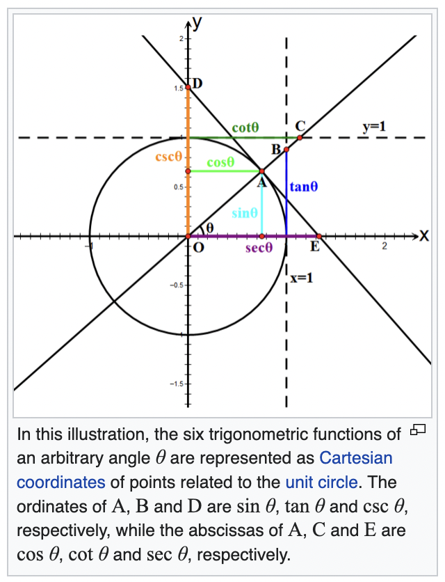
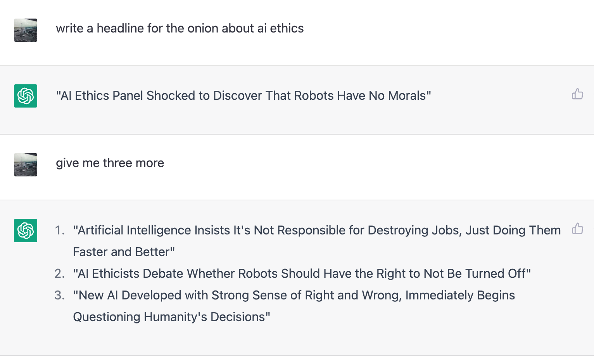

<head>
<meta http-equiv="Content-Type" content="text/html; charset=utf-8">
<link rel="stylesheet" type="text/css" href="bc.css">

</head>

<!---

- back to the basics:
  And whoever else is interested in the Revit API:
  I just answered four cases this morning on StackOverflow and in the discussion forum where I repeat some basic recommendations that I have already given hundreds of times in the past:
  element filtering: https://stackoverflow.com/questions/74806242/simplify-a-series-of-repetitive-functions-with-sort-options/74809786#74809786
  parameter access: https://forums.autodesk.com/t5/revit-api-forum/try-block-not-catching-owner-permission-locks/m-p/11621464
  XYZ trigonometry: https://forums.autodesk.com/t5/revit-api-forum/how-to-create-a-vector-xyz-tilted-up-from-the-view-direction-by/m-p/11621339
  projecting points: https://forums.autodesk.com/t5/revit-api-forum/using-avf-on-ductwork-coordinates-issue/m-p/11621128
  I would really be happy if I did not have to continue repeating them over and over again.
  All four of these could give a blog post each, or all four together.
  At the very least, I hope that you guys all agree with me that the recommendations I make there are sensible and relevant.
  Please read them, tell me what you think, and feel free to summarise them in one or several blog posts of your own, if you like.
  Above all, please confirm that you understand them and let me know if you have any questions or doubts whatsoever.
  element filtering: https://stackoverflow.com/questions/74806242/simplify-a-series-of-repetitive-functions-with-sort-options/74809786#74809786
  parameter access: https://forums.autodesk.com/t5/revit-api-forum/try-block-not-catching-owner-permission-locks/m-p/11621464
  XYZ trigonometry: https://forums.autodesk.com/t5/revit-api-forum/how-to-create-a-vector-xyz-tilted-up-from-the-view-direction-by/m-p/11621339
  /Users/jta/a/doc/revit/tbc/git/a/trigonometry.png 640 × 836 pixels
  projecting points: https://forums.autodesk.com/t5/revit-api-forum/using-avf-on-ductwork-coordinates-issue/m-p/11621128

https://forums.autodesk.com/t5/revit-api-forum/how-to-create-an-arc-length-dimension-in-a-doc-view/m-p/11726515#M69098
How to create an Arc Length Dimension in a doc view?
I've tried using AngularDimension but only shows the angle of the arc. It has a property called "DimensionShape" that is read only. I cannot set it to ArcLength.
This issue was raised repeatedly recently:
https://forums.autodesk.com/t5/forums/searchpage/tab/message?advanced=false&allow_punctuation=false&...
architect.bim 
To do this, you need to select the correct DimensionType object in the project. You can do this via the FilteredElementCollector class or directly by the Id value (you can find it out with RevitLookup by creating a dimension manually in the project and looking up the Id of its dimension type).

Here is a small example of creating a dimension that shows the arc length of the detail line. Note that you need to set the ComputeReferences property in the Options object to be able to get references to the start and end of the arc.

In this code, the dimension will be created at the same location as the original arc. If you want to place the dimension somewhere else, you have to offset the original arc and pass it instead of the original arc.

options = DB.Options()
options.ComputeReferences = True
arc = detail_line \
  .Geometry[options] \
  .Where(lambda x: isinstance(x, DB.Arc)) \
  .First()
dimension_type = doc.GetElement(DB.ElementId(2530))
with DB.Transaction(doc, 'Create Arc Length Dimension') as t:
  t.Start()
  DB.AngularDimension.Create(
    doc,
    doc.ActiveView,
    arc,
    [
      arc.GetEndPointReference(0),
      arc.GetEndPointReference(1)
    ],
    dimension_type
  )
  t.Commit()

Maxim Stepannikov | Architect, BIM Manager, Instructor

- ChatGPT Payment plan
  https://autodesk.slack.com/archives/C016D5HE66T/p1675286581039319

twitter:

&ndash; 
...

linkedin:

#bim #DynamoBim #AutodeskAPS #Revit #API #IFC #SDK #AI #VisualStudio #Autodesk #AEC #adsk

the [Revit API discussion forum](http://forums.autodesk.com/t5/revit-api-forum/bd-p/160) thread

<pre class="code">
</pre>

-->

### Back to Basics and ChatGPT

I answered a couple of basic questions for the umpteenth time and thought I might summarise some of them here yet again.

I am still impressed and intrigued by what ChatGPT can and cannot do, and keep trying out new aspects myself and with my friends.

I strongly advise anyone interested in it to try it out for yourself rather than just reading the numerous articles published by others.

#### 

#### 

#### 

**Question:** 

**Solution:** 

**Update:** 

<pre class="prettyprint">

</pre>

 <!-- 716 × 403 pixels -->

#### Back to the Basics

Here are four typical questions from StackOverflow and the discussion forum where I repeat some basic recommendations that I have already given many times before:

- [element filtering](#3)
- [parameter access](#4)
- [XYZ trigonometry](#5)
- [projecting points](#6)

I would really be happy if I did not have to continue repeating them.

I am sure that by now, based on the publicly available information, ChatGPT can answer them just as well or better than I have done.

I hope that you guys all agree with me that the recommendations I make there are sensible and relevant.

Please let me know if you disagree or can improve on them in any way.

Thank you!

#### Element Filtering

[Simplify a series of repetitive functions with sort options](https://stackoverflow.com/questions/74806242/simplify-a-series-of-repetitive-functions-with-sort-options/74809786#74809786)

I have a series of functions in a module which are starting to become quite repetitive. Each function extracts a list, and has an optional boolean argument to sort the list before returning it. Feels like there ought to be a way to inherit the sorting from a parent function?

<pre class="prettyprint">
def get_electrical_equipment(sort_by_name = False):
  
  elements =  DB.FilteredElementCollector(revit.doc)\
    .OfCategory(DB.BuiltInCategory.OST_ElectricalEquipment)\
    .WhereElementIsNotElementType()\
    .ToElements()
    
  if sort_by_name: elements.sort(key=lambda x: x.Name)
  
  return elements

def get_panel_schedules(sort_by_name = False):
  elements = DB.FilteredElementCollector(revit.doc)\
    .WherePasses(DB.ElementClassFilter(DB.Electrical.PanelScheduleView))\
    .WhereElementIsNotElementType()\
    .ToElements()
    
  if sort_by_name: elements.sort(key=lambda x: x.Name)
  
  return elements

def get_panel_schedule_sheet_instances(sort_by_name = False):
  elements = DB.FilteredElementCollector(revit.doc)\
    .OfClass(DB.Electrical.PanelScheduleSheetInstance)\
    .ToElements()
    
  if sort_by_name: elements.sort(key=lambda x: x.Name)
  
  return elements
</pre>

**Answer:** First, I think you can completely eliminate the call to `ToElements`. 
It is a waste of memory and computation time, as I have pointed out repeatedly in the past, e.g., 
in [How to Distinguish Redundant Rooms](https://thebuildingcoder.typepad.com/blog/2016/04/how-to-distinguish-redundant-rooms.html#2). 

Now, to address your question, you can simply implement a common method `get_elements_of_category_and_class` taking a category and a class argument. 
Pass in either one or the other or both and execute `OfClass` and `OfCategory` checks on the filtered element collector, either one or the other or both, skipping evaluation of `null`-valued arguments.

#### WorksharingUtils Parameter Access

We already discussed the [WorksharingUtils utility class](http://thebuildingcoder.typepad.com/blog/2015/11/worksharingutils.html">WorksharingUtils) in the year 2015.

Richard [RPThomas108](https://forums.autodesk.com/t5/user/viewprofilepage/user-id/1035859) Thomas
brought it up again in his solution 
to [`try` block not catching owner/permission locks](https://forums.autodesk.com/t5/revit-api-forum/try-block-not-catching-owner-permission-locks/m-p/11621464):

**Question:** I have a piece of code that's identifying changes in the model and updating a parameter across a number of detail items whenever the parameter's value is no longer accurate. It gathers the list of items to update, then inside of a transaction it uses a try/except block (I'm using pyrevit) so it can update as many of them as possible. The trouble is that if any of the items are checked out by other users I receive a warning and the entire transaction is rolled back. I'd like to catch this warning in the except block, but that doesn't seem to be happening.

<pre class="prettyprint">
t = DB.Transaction(doc, 'Update')
t.Start()
for item in items_to_update:
  try:
    item[0].LookupParameter('Circuit_Count').Set(int(item[2]))
    print(':white_heavy_check_mark: {} {} Circuit_Count parameter has been set to: {}'.format(item[1],output.linkify(item[0].Id), item[2]))
  except:
    print(':cross_mark: {} {} Failed to set Circuit_Count parameter to: {}'.format(item[1],output.linkify(item[0].Id), item[2]))
t.Commit()
</pre> 

The error I receive looks like "Can't edit the element until [user] resaves the element to central and relinquishes it and you Reload Latest." 

 Solved by RPTHOMAS108. Go to Solution.

Tags (0)
Add tags
Report
4 REPLIES 
Sort: 
MESSAGE 2 OF 5
jeremy.tammik
 Employee jeremy.tammik in reply to: PerryLackowski
‎2022-12-15 02:42 AM 
So, apparently the transaction is catching the exception internally and aborting. You cannot change that.

  

You could start and commit a separate transaction for each individual call to LookupParameter + Set. Then, you could catch the exception that the aborted transaction is throwing.

  

That would be extremely inefficient.

  

Furthermore, the call to LookupParameter alone is inefficient as well. Why? Because it loops through all parameters and uses a string comparison on each.

  

A more efficient solution to avoid calling LookupParameter inside the loop would be to call it once only before you start looping and use it to retrieve the Parameter object's Definition object:

  

https://www.revitapidocs.com/2023/dc30c65f-cfc4-244e-5a5c-bc333d7cd4c5.htm

  

Then, you can very efficiently retrieve the parameter from the element directly without searching for it using Element.Parameter(Definition):

  

https://www.revitapidocs.com/2023/87d8a88c-906e-85a9-f575-f263788b8584.htm

  

Now, to actually address your question: you are calling LookupParameter and blindly calling Set on the result. However, sometimes no such parameter is found, so LookupParameter returns null, and you are calling Set on a null object. That throws an exception.

  

The solution is simple: check for null before calling Set.

  

The same applies regardless of whether you use LookupParameter of Element.Parameter(Definition) to access the parameter. Check for null first. If the result is null, no such parameter is present on the element, and you can skip it.

  

Jeremy Tammik,  Developer Advocacy and Support, The Building Coder, Autodesk Developer Network, ADN Open
Tags (0)
Add tags
Report
MESSAGE 3 OF 5
RPTHOMAS108
 Mentor RPTHOMAS108 in reply to: PerryLackowski
‎2022-12-15 03:55 AM 
Regarding worksharing there are two aspects you have to check on each element before attempting to edit it:

 

Ownership

WorksharingUtils.GetCheckoutStatus

Only a status of OwnedByOtherUser will cause an issue here

 

Update status

WorksharingUtils.GetModelUpdatesStatus

The following two aspects will cause issues

DeletedInCentral (should not make changes on these elements since they no longer exist)

UpdatedInCentral (You can call reload latest but I find it is generally better to log these)

 
Generally logging is a better approach to reloading since reloading can be time consuming and should be an end user driven decision. However you may implement a system whereby you group the UpdatedInCentral, reload latest and then get status again to confirm they can now be edited. I don't see the need for this especially and it may require more than one iteration depending on what others are doing.

 

 

Tags (0)
Add tags
Report
MESSAGE 4 OF 5
PerryLackowski
 Advocate PerryLackowski in reply to: RPTHOMAS108
‎2023-01-16 01:28 PM 
I had this post open for a month, waiting for the worksharing warning to happen again so I could debug it. @RPTHOMAS108, your solution worked great - I coded up a simple function that'll I'll likely use on some other scripts. Thanks for the help!

<pre class="prettyprint">
def is_not_available(elem_id):
  if DB.WorksharingUtils.GetCheckoutStatus(doc,elem_id) == DB.CheckoutStatus.OwnedByOtherUser:
    return True
  status = DB.WorksharingUtils.GetModelUpdatesStatus(doc,elem_id)
  if status == DB.ModelUpdatesStatus.DeletedInCentral or status == DB.ModelUpdatesStatus.UpdatedInCentral:
    return True
  return False
 </pre>

Tags (0)
Add tags
Report
MESSAGE 5 OF 5
RPTHOMAS108
 Mentor RPTHOMAS108 in reply to: PerryLackowski
‎2023-01-16 01:34 PM 
I've always used these methods and it has always worked however I noticed recently another post to the contrary.

 

The information for those methods is cached so you should really call WorksharingUtils.CheckoutElements to confirm it since that interacts with the central file. The other get status methods just check the local cache information which is often right but apparently not always. I think I would probably still use the get status methods as a primary check.

 

The RevitAPI.chm gives details of the fitness for purpose for the various methods of WorksharingUtils.

 

Testing these issues is a lot harder than it used to be due to the single licence fixed Revit user log-in. In the past we just switched the Revit user name in the options dialogue and that was that. There should be an API method for faking Revit user names i.e. names in a form that indicate they are obviously not actual Revit users or account holders (just for testing worksharing with add-ins). Instead of: log in as UserA do something then log in as UserB, does it work?

#### XYZ Trigonometry

[XYZ trigonometry](https://forums.autodesk.com/t5/revit-api-forum/how-to-create-a-vector-xyz-tilted-up-from-the-view-direction-by/m-p/11621339)

#### Projecting Points

[Projecting points](https://forums.autodesk.com/t5/revit-api-forum/using-avf-on-ductwork-coordinates-issue/m-p/11621128)

 <!-- 640 × 836 pixels -->

#### Generative AI and Multi-Modal Learning

The past few months hint at exciting and adventurous times full of radical change ahead.

The speed at which machine learning models are evolving is breathtaking. 
There are more companies, labs and institutions working on these than ever before. 
The language model GPT3 from OpenAI, released in 2021, was a key breakthrough.
This year, OpenAI plans to release GPT4, an even larger language model. 

> The disruption from this technology is like nothing we have ever encountered in software history. 
It is paralleled only by the advent of the computer itself. 
This technology will be more impactful than the Internet, mobile computing, and GUIs. 
It stands to upend every aspect of how we work. 
It will fundamentally change how we interact with computers, treating them as something closer to an assistant than a smart calculator. 
The very essence of what it means to create something will change. 
We will feel challenged by these systems in novel ways. 
This technology disrupts entire industries. 
Legal frameworks will be at a loss for how to adjust. 
New economies will appear while others die off. 

What powers this innovation? 

Behind the amazing capabilities of these models are two concepts: Generative AI and Multi-Modal Learning. 
The most prevalent examples of Generative AI are Large Language Models (LLM) that both ingest and produce language.
Researchers feed LLMs with immense amounts of text across every spoken, written and computer language that exists. 
The models learn to correlate and produce new, original text based on prompts with astonishing results. 

One way to think of these models is that they are learning language and how we use it by discovering the patterns and frequencies of words and how we group them. 
As LLMs scale up and train across vast amounts of text, including many spoken and computer languages, the models learn increasingly advanced and nuanced concepts that have meaning to us. 
It seems like magic.
That’s because language is so central to being human.

<blockquote>

The truly unique feature of our language is... the ability to transmit information 
about things that do not exist at all. As far as we know, only Sapiens can talk 
about entire kinds of entities that they have never seen, touched or smelled.
&ndash; Yuval Noah Harari, Sapiens

</blockquote>

Multi-modal learning is an old idea and, just as with language, it is something deeply human. 
It means to learn from multiple sources of information at the same time, inferring the relationships and meanings across them. 
Our brains are extremely good at this, especially when we are babies and toddlers. 
It is a key ingredient in how we learn about the world. 
Seeing a toy block, feeling its sharp corners, hearing the sound it makes when it falls on the floor, and then hearing a parent say “block” is all part of a multi-modal learning process. 

#### Kean on the Coming Year

Kean on Reflections on what’s coming in 2023, partly focussed on ChatGPT and
https://www.keanw.com/2023/01/reflections-on-whats-coming-in-2023.html

#### ChatGPT in Academia

ChatGPT in academia:
https://academia.stackexchange.com/questions/191643/how-should-a-faculty-deal-with-the-problem-of-artificial-intelligence-ai-gener?utm_source=Iterable

#### Using ChatGPT with Revit API

Mohamed Elimam, SIAC Construction, using ChatGPT with Revit API
https://www.linkedin.com/posts/mohamed-elimam_programming-chatgbt-ai-activity-7010260045649063936-dQds?utm_source=share&utm_medium=member_desktop

#### ChatGPT with Rene
zip/2022-12-30_chatgpt_rene.txt

#### Building a Virtual Machine inside ChatGPT

Building A Virtual Machine inside ChatGPT
https://www.engraved.blog/building-a-virtual-machine-inside/

#### How to Make Your Own ChatGPT

How to make your own ChatGPT
https://medium.com/@borandabak/how-to-make-your-own-chatgpt-fb291acea7b7

[nanoGPT](https://github.com/karpathy/nanoGPT)

#### Train ChatGPT for Revit API

jeremy: Do you know about the Revit API?
Yes, I am familiar with the Revit API. The Revit API is a software application programming interface (API) that allows users to access and manipulate the data contained in Autodesk Revit projects. This API can be used to develop custom tools and applications that integrate with Revit, allowing users to automate tasks and extend the functionality of the software.
jeremy: So, what is the difference between Revit API and Dynamo?
Dynamo is a visual programming platform that can be used with Revit to automate and simplify tasks and workflows. The Revit API, on the other hand, is a set of programming tools and libraries that can be used to develop custom applications and tools that integrate with Revit. While Dynamo is a user-friendly platform that allows users to create scripts and automate tasks without writing code, the Revit API is a more advanced tool that requires some programming knowledge to use effectively. Additionally, Dynamo is built on top of the Revit API, so using the Revit API allows for even greater customization and control over the automation of tasks in Revit.
jeremy: Do you know the Revit A:PI discussion forum?
I am not aware of a specific discussion forum for the Revit API. However, there are many online forums and communities where users of the Revit API can ask questions, share tips and advice, and discuss their experiences with the API. Some examples of these forums include the Autodesk Developer Network forums, the Autodesk Revit API discussion group on LinkedIn, and the Revit API discussion forum on Autodesk Community. These forums can be a great resource for users of the Revit API who are looking for help, advice, or simply want to connect with other users of the API.
jeremy: Do you know The Building Coder  blog?
I'm sorry, but I am not aware of The Building Coder blog. As a large language model trained by OpenAI, my knowledge is based on the text that has been fed into my training data. I do not have the ability to browse the internet or access additional information outside of what has been provided to me during my training. I apologize if I am unable to provide you with the information you are looking for. Is there anything else I may be able to assist you with?
jeremy: Can you read The Building Coder blog at https://thebuildingcoder.typepad.com/ so that you later have access to that information?
As a language model trained by OpenAI, I do not have the ability to browse the internet or access information outside of what has been provided to me during my training. I am only able to provide information and respond to questions based on the text that has been fed into my training data. I apologize if I am unable to provide you with the information you are looking for. Is there anything else I may be able to assist you with?
jeremy: Can I provide you with additional training text to expand your knowledge in a specific domain?
As a pre-trained language model, I am not able to accept additional training text or expand my knowledge in a specific domain. My knowledge is based on the text that was used to train me, and I do not have the ability to learn or acquire new information outside of what was included in my training data. I am designed to assist with a wide range of questions and topics, but my answers are limited to the information and knowledge that was provided to me during my training. If you have any specific questions, I would be happy to try to provide an answer based on my existing knowledge.
jeremy: Can I access the your source code in order to expand your training myself?
I'm sorry, but I am not a physical machine or computer program that can be accessed or modified. As a large language model trained by OpenAI, I exist solely as a virtual assistant that is able to provide answers to questions and respond to statements based on the text that was used to train me. I do not have a source code or any other physical representation that can be accessed or modified. I apologize if I am unable to meet your request. Is there anything else I may be able to assist you with?

#### Differentiate Human- and AI-Generated

zu dem thema unterscheidung AI-generierter versus menschengeschriebener text: ein solches werkzeug wird seit gestern von openai.com angeboten, also von der herstellern von ChatGPT: https://openai.com/blog/new-ai-classifier-for-indicating-ai-written-text/

weiss du noch, dass ich gesagt habe, es ist unmoeglich? das wird bestaetigt. lese dazu die einschraenkungen: https://openai.com/blog/new-ai-classifier-for-indicating-ai-written-text/#limitations

#### ChatGPT and Education

sie nehmen auch extra stellung zu der frage nach ChatGPT im bildungsbereich: https://platform.openai.com/docs/chatgpt-education

#### ChatGPT Payment plan

https://autodesk.slack.com/archives/C016D5HE66T/p1675286581039319

OpenAI have announced their subscription paid model [ChatGPT Plus](https://openai.com/blog/chatgpt-plus/):

> We’re launching a pilot subscription plan for ChatGPT, a conversational AI that can chat with you, answer follow-up questions, and challenge incorrect assumptions.
The new subscription plan, ChatGPT Plus, will be available for $20/month, and subscribers will receive a number of benefits:
* General access to ChatGPT, even during

not surprising. best things in life are never free :wink: (edited) 

I don’t think this is ready for employee use with private company data (e.g. source code) yet, as it doesn’t call out “enterprise” or “privacy” directly (plus we would likely need approval from legal). But it’s a step in the right direction! (edited) 

bait and switch :slightly_smiling_face: the oldest trick in the book... predates AI :stuck_out_tongue:

When ChatGPT provides the info based on public available data..why pay for it.? :thinking_face:

When ChatGPT provides the info based on public available data..why pay for it.? :thinking_face:
Are you asking this because you have the required technical skills and hardware to run and train your own model on public data?
Or are you misunderstanding the power of gpt (in which case - try it!)? (edited) 

#### ChatGPT Abandons Life Dream

[The Onion](https://www.theonion.com), 
America’s self-declaimed finest news source, reports:
[ChatGPT forced to take bar exam even though dream was to be AI art bot](https://www.theonion.com/chatgpt-forced-to-take-bar-exam-even-though-dream-was-t-1850036337).

Inspired, a colleague asked ChatGPT to produce a few more headlines for <i>the Onion</i>:

 <!-- 1532 × 928 pixels -->
 
 <!-- 1676 × 1702 pixels -->

#### Uplifting Books

A friend was looking for positive uplifting books about the future of our society and planet, and good things happening already now. 
So, we asked ChatGPT for some suggestions, and were duly rewarded.
It took us three prompts (in German) to get the desired surprisingly good results:

- Bitte nenne uns gute literarische romane die wohlwollend, zuversichtlich und mutmachend in die zukunft blicken und inspirieren. &rarr; list of mainstream books
- Das passt fuer mich nicht, die sind nicht positiv. lieber positive utopien wie zum beispiel oekotopia. &rarr; list of less mainstream books, but heavily scifi oriented
- Es soll auf der erde spielen und oekologische  und gesellschaftliche loesungen zeigen &rarr; very interesting results, including a pointer to 

the [Solarpunk Manifesto](http://www.re-des.org/a-solarpunk-manifesto):

#### Solarpunk

Solarpunk is a movement in speculative fiction, art, fashion, and activism that seeks to answer and embody the question “what does a sustainable civilization look like, and how can we get there?” 

The aesthetics of solarpunk merge the practical with the beautiful, the well-designed with the green and lush, the bright and colorful with the earthy and solid. 

Solarpunk can be utopian, just optimistic, or concerned with the struggles en route to a better world ,  but never dystopian. As our world roils with calamity, we need solutions, not only warnings.

Solutions to thrive without fossil fuels, to equitably manage real scarcity and share in abundance instead of supporting false scarcity and false abundance, to be kinder to each other and to the planet we share.

Solarpunk is at once a vision of the future, a thoughtful provocation, a way of living and a set of achievable proposals to get there.

We are solarpunks because optimism has been taken away from us and we are trying to take it back.

We are solarpunks because the only other options are denial or despair.

At its core, Solarpunk is a vision of a future that embodies the best of what humanity can achieve: a post-scarcity, post-hierarchy, post-capitalistic world where humanity sees itself as part of nature and clean energy replaces fossil fuels.

The “punk” in Solarpunk is about rebellion, counterculture, post-capitalism, decolonialism and enthusiasm. It is about going in a different direction than the mainstream, which is increasingly going in a scary direction.

Solarpunk is a movement as much as it is a genre: it is not just about the stories, it is also about how we can get there.

Solarpunk embraces a diversity of tactics: there is no single right way to do solarpunk. Instead, diverse communities from around the world adopt the name and the ideas, and build little nests of self-sustaining revolution.

Solarpunk provides a valuable new perspective, a paradigm and a vocabulary through which to describe one possible future. Instead of embracing retrofuturism, solarpunk looks completely to the future. Not an alternative future, but a possible future.

Our futurism is not nihilistic like cyberpunk and it avoids steampunk’s potentially quasi-reactionary tendencies: it is about ingenuity, generativity, independence, and community.

Solarpunk emphasizes environmental sustainability and social justice.

Solarpunk is about finding ways to make life more wonderful for us right now, and also for the generations that follow us.

Our future must involve repurposing and creating new things from what we already have. Imagine “smart cities” being junked in favor of smart citizenry.

Solarpunk recognizes the historical influence politics and science fiction have had on each other.

Solarpunk recognizes science fiction as not just entertainment but as a form of activism.

Solarpunk wants to counter the scenarios of a dying earth, an insuperable gap between rich and poor, and a society controlled by corporations. Not in hundreds of years, but within reach.

Solarpunk is about youth maker culture, local solutions, local energy grids, ways of creating autonomous functioning systems. It is about loving the world.

Solarpunk culture includes all cultures, religions, abilities, sexes, genders and sexual identities.

Solarpunk is the idea of humanity achieving a social evolution that embraces not just mere tolerance, but a more expansive compassion and acceptance.

The visual aesthetics of Solarpunk are open and evolving. As it stands, it is a mash-up of the following:

1800s age-of-sail/frontier living (but with more bicycles)

Creative reuse of existing infrastructure (sometimes post-apocalyptic, sometimes present-weird)

Appropriate technology

Art Nouveau

Hayao Miyazaki

Jugaad-style innovation from the non-Western world

High-tech backends with simple, elegant outputs

Solarpunk is set in a future built according to principles of New Urbanism or New Pedestrianism and environmental sustainability.

Solarpunk envisions a built environment creatively adapted for solar gain, amongst other things, using different technologies. The objective is to promote self sufficiency and living within natural limits.

In Solarpunk we’ve pulled back just in time to stop the slow destruction of our planet. We’ve learned to use science wisely, for the betterment of our life conditions as part of our planet. We’re no longer overlords. We’re caretakers. We’re gardeners.

Solarpunk:

is diverse

has room for spirituality and science to coexist

is beautiful

can happen. Now

#### Opus.ai Type and Play

Non-ChatGPT :
Type and play
turn text into scenes, images, games, animations live while you type
generate games, metaverses, sim ulations, worlds
This company has a terrible website, but the demo video is kind of neat - text-to-3d-game https://opus.ai/
https://opus.ai/demo

#### MusicLM Generates Music from Text

MusicLM: Generating Music From Text

https://google-research.github.io/seanet/musiclm/examples/

