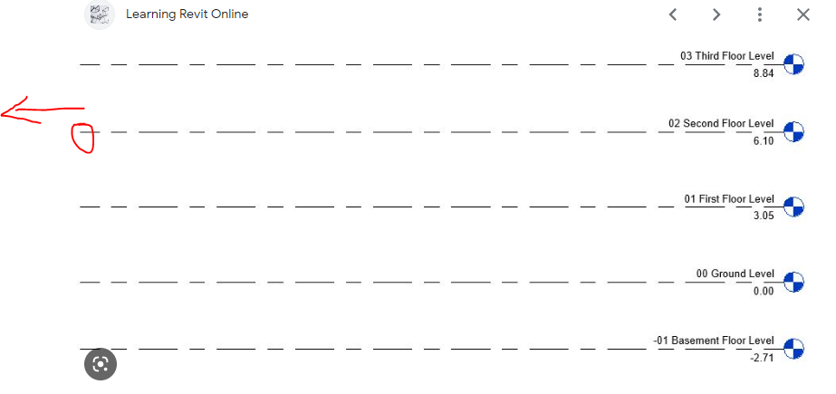

<head>
<meta http-equiv="Content-Type" content="text/html; charset=utf-8">
<link rel="stylesheet" type="text/css" href="bc.css">

</head>

<!---

- ricaun shared
RevitAddin.CommandLoader - Compile/Running 'IExternalCommand' with Revit open!
https://forums.autodesk.com/t5/revit-api-forum/revitaddin-commandloader-compile-running-iexternalcommand-with/td-p/11742530
> I present my first RevitAddin open-source project CommandLoader. With this plugin is possible to compile IExternalCommand directly in Revit, and the command is added as a PushButton in the Addins Tab.
Here is a video explaining the features and some limitations.
[Compile/Running 'IExternalCommand' with Revit open!](https://youtu.be/l4V4-vohcWY)
<iframe width="560" height="315" src="https://www.youtube.com/embed/l4V4-vohcWY" title="YouTube video player" frameborder="0" allow="accelerometer; autoplay; clipboard-write; encrypted-media; gyroscope; picture-in-picture; web-share" allowfullscreen></iframe>
RevitAddin.CommandLoader project compiles IExternalCommand with Revit open using CodeDom.Compiler and creates a PushButton on the Revit ribbon.
[GitHub repository](https://github.com/ricaun-io/RevitAddin.CommandLoader)

- richard implemented a very nice little sample using the TessellatedShapeBuilder to create a DirectShape
  create a [pyramid](https://en.wikipedia.org/wiki/Pyramid_(geometry)), or, 
  more specifically, a right pyramid with a regular base for the ...
  on [Is it possible to create a solid from the edges of Pyramids?]
  https://forums.autodesk.com/t5/revit-api-forum/is-it-possible-to-create-a-solid-from-the-edges-of-pyramids/td-p/11729445

- richard suggested how to 
How to modify levels extents (X and Y direction)
https://forums.autodesk.com/t5/revit-api-forum/how-to-modify-levels-extents-x-and-y-direction/td-p/11731529

- how to filter for subsets of elements
https://autodesk.slack.com/archives/C0SR6NAP8/p1675998082315159
Shen Wang
A question about the parsed element structure of the Revit model, you could think of it as the model tree in Navisworks.
Users want to access the parsed structured data and graphic elements of Revit model, select objects by filtering Revit views, grids, family categories or MEP systems, and then create assemblies after selecting elements for documentation.
Example 1, a relatively complex building includes multiple piping systems. The user hopes to quickly select the circuit of a certain piping system on a certain floor by developing a plug-in.
Example 2, a section of linear engineering, such as an elevated road, the user hopes to develop a plugin so that to quickly select the Revit elements between two grids.
---------------------------
As my understood, the user's objective is to quickly select objects by filtering Revit properties.
Do you have any advice?
Appreciated.
filter_for_subset_bridge.png 1000x580
Scott Conover
We have many ways to use the API to filter down to the element(s) you are looking for.  It depends on the particular need, but in Example 1, you'd probably want to start with the elements in the target system, but then filter further with an ElementParameterFilter for the reference level and/or with a geometric filter like BoundingBoxIntersectsFilter or ElementIntersectsSolidFilter.  In Example 2, it seems more geometric, so filter first by certain categories and then use the geometric filters after calculating a shape that represents the space between grids.   For more on all the filters we have see: https://knowledge.autodesk.com/es/support/revit/learn-explore/caas/CloudHelp/cloudhelp/2[…]/files/GUID-A2686090-69D5-48D3-8DF9-0AC4CC4067A5-htm.html

- switch document display units:
Converting All Parameter Values from Imperial Units to Metric Units
https://forums.autodesk.com/t5/revit-api-forum/converting-all-parameter-values-from-imperial-units-to-metric/m-p/11728282#M69113
nikolaEXEZM wrote two simple macros to convert the project units between Imperial and Metric. 
Works with both project and family documents. 
Just create a new Macro Module, and paste in the code below:
public void ChangeUnitsToImperial()
{
    Document doc = this.ActiveUIDocument.Document;
    Document templateDoc = Application.OpenDocumentFile(@"C:\ProgramData\Autodesk\RVT " + this.Application.VersionNumber + @"\Templates\English-Imperial\default.rte");
    using (Transaction ta = new Transaction(doc))
       {
        ta.Start("Change Project Units to Imperial");
        doc.SetUnits(templateDoc.GetUnits());
        ta.Commit();
    }
}
public void ChangeUnitsToMetric()
{
    Document doc = this.ActiveUIDocument.Document;
    Document templateDoc = Application.OpenDocumentFile(@"C:\ProgramData\Autodesk\RVT " + this.Application.VersionNumber + @"\Templates\English\DefaultMetric.rte");
    using (Transaction ta = new Transaction(doc))
       {
        ta.Start("Change Project Units to Metric");
        doc.SetUnits(templateDoc.GetUnits());
        ta.Commit();
    }
}

- workaround for REVIT-20249 
  REVIT-20249 [As a Revit user, I want my material tags to stop displaying "?" after minor changes to the model, so that I don't have to waste time regen-ing or nudging all material tags right before printing a drawing set]
  Workaround as stated by one customer: "Standard Operating Procedure around here is right before printing, select a material tag > right click > select all instances in entire project > nudge right > nudge left, then print."

- sublime text
  Sublime Text: remember cursor position plugin
  https://gmpy.dev/blog/2022/sublime-text-remember-cursor-position-plugin

twitter:

 @AutodeskRevit #RevitAPI #BIM @AutodeskAPS 

&ndash; 
...

linkedin:

#bim #DynamoBim #AutodeskAPS #Revit #API #IFC #SDK #AI #VisualStudio #Autodesk #AEC #adsk

the [Revit API discussion forum](http://forums.autodesk.com/t5/revit-api-forum/bd-p/160) thread

<pre class="code">
</pre>

-->

### Pyramid Builder and CommandLoader

#### Dynamic Load, Compile and Run

Recently, 
several [Revit API discussion forum](http://forums.autodesk.com/t5/revit-api-forum/bd-p/160) threads
revolved around how to dynamically load and compile Revit add-ins.

Luiz Henrique [@ricaun](https://github.com/ricaun) Cassettari now shared a solution for that,
[RevitAddin.CommandLoader &ndash; compile and run `IExternalCommand` with Revit open](https://forums.autodesk.com/t5/revit-api-forum/revitaddin-commandloader-compile-running-iexternalcommand-with/td-p/11742530):

> I present my first RevitAddin open-source project CommandLoader. 
With this plugin is possible to compile `IExternalCommand` directly in Revit, and the command is added as a `PushButton` in the Addins Tab.
Here is a video explaining the features and some limitations, [compile and run 'IExternalCommand' with Revit open](https://youtu.be/l4V4-vohcWY):

<iframe width="480" height="270" src="https://www.youtube.com/embed/l4V4-vohcWY" title="YouTube video player" frameborder="0" allow="accelerometer; autoplay; clipboard-write; encrypted-media; gyroscope; picture-in-picture; web-share" allowfullscreen></iframe>

> RevitAddin.CommandLoader project compiles `IExternalCommand` with Revit open using `CodeDom.Compiler` and creates a `PushButton` on the Revit ribbon.

- [GitHub repository](https://github.com/ricaun-io/RevitAddin.CommandLoader)

#### 

- richard implemented a very nice little sample using the TessellatedShapeBuilder to create a DirectShape
create a [pyramid](https://en.wikipedia.org/wiki/Pyramid_(geometry)), or, 
more specifically, a right pyramid with a regular base for the ...
on [Is it possible to create a solid from the edges of Pyramids?]
https://forums.autodesk.com/t5/revit-api-forum/is-it-possible-to-create-a-solid-from-the-edges-of-pyramids/td-p/11729445

#### Modify Level Element X and Y Extents

Richard also suggested [how to modify levels extents (X and Y direction)](https://forums.autodesk.com/t5/revit-api-forum/how-to-modify-levels-extents-x-and-y-direction/td-p/11731529):

**Question:** I can get levels extents with `get_BoundingBox`, and am looking for something like `set_BoundingBox`. I want to keep the level's Z elevation at the same level and stretch its bounding box in X and Y direction:

 <!-- 923 × 435 pixels -->

**Answer:** There is some functionality on the `DatumPlane` class that `Level` inherits from, e.g.: 

- DatumPlane.SetCurveInView
- DatumPlane.Maximize3DExtent
- DatumPlane.PropagateToViews

Seems better to maximize the extents and propagate to views rather than individually manipulating curves.

#### 

- how to filter for subsets of elements
https://autodesk.slack.com/archives/C0SR6NAP8/p1675998082315159
Shen Wang
A question about the parsed element structure of the Revit model, you could think of it as the model tree in Navisworks.
Users want to access the parsed structured data and graphic elements of Revit model, select objects by filtering Revit views, grids, family categories or MEP systems, and then create assemblies after selecting elements for documentation.
Example 1, a relatively complex building includes multiple piping systems. The user hopes to quickly select the circuit of a certain piping system on a certain floor by developing a plug-in.
Example 2, a section of linear engineering, such as an elevated road, the user hopes to develop a plugin so that to quickly select the Revit elements between two grids.
---------------------------
As my understood, the user's objective is to quickly select objects by filtering Revit properties.
Do you have any advice?
Appreciated.
filter_for_subset_bridge.png 1000x580
Scott Conover
We have many ways to use the API to filter down to the element(s) you are looking for.  It depends on the particular need, but in Example 1, you'd probably want to start with the elements in the target system, but then filter further with an ElementParameterFilter for the reference level and/or with a geometric filter like BoundingBoxIntersectsFilter or ElementIntersectsSolidFilter.  In Example 2, it seems more geometric, so filter first by certain categories and then use the geometric filters after calculating a shape that represents the space between grids.   For more on all the filters we have see: https://knowledge.autodesk.com/es/support/revit/learn-explore/caas/CloudHelp/cloudhelp/2[…]/files/GUID-A2686090-69D5-48D3-8DF9-0AC4CC4067A5-htm.html

#### 

- switch document display units:
Converting All Parameter Values from Imperial Units to Metric Units
https://forums.autodesk.com/t5/revit-api-forum/converting-all-parameter-values-from-imperial-units-to-metric/m-p/11728282#M69113
nikolaEXEZM wrote two simple macros to convert the project units between Imperial and Metric. 
Works with both project and family documents. 
Just create a new Macro Module, and paste in the code below:
public void ChangeUnitsToImperial()
{
Document doc = this.ActiveUIDocument.Document;
Document templateDoc = Application.OpenDocumentFile(@"C:\ProgramData\Autodesk\RVT " + this.Application.VersionNumber + @"\Templates\English-Imperial\default.rte");
using (Transaction ta = new Transaction(doc))
{
ta.Start("Change Project Units to Imperial");
doc.SetUnits(templateDoc.GetUnits());
ta.Commit();
}
}
public void ChangeUnitsToMetric()
{
Document doc = this.ActiveUIDocument.Document;
Document templateDoc = Application.OpenDocumentFile(@"C:\ProgramData\Autodesk\RVT " + this.Application.VersionNumber + @"\Templates\English\DefaultMetric.rte");
using (Transaction ta = new Transaction(doc))
{
ta.Start("Change Project Units to Metric");
doc.SetUnits(templateDoc.GetUnits());
ta.Commit();
}
}

#### 

- workaround for REVIT-20249 
REVIT-20249 [As a Revit user, I want my material tags to stop displaying "?" after minor changes to the model, so that I don't have to waste time regen-ing or nudging all material tags right before printing a drawing set]
Workaround as stated by one customer: "Standard Operating Procedure around here is right before printing, select a material tag > right click > select all instances in entire project > nudge right > nudge left, then print."

#### Sublime Text

I recently updated my computer to 
the [MacBook Pro M1 ARM](https://thebuildingcoder.typepad.com/blog/2022/12/exploring-arm-chatgpt-nairobi-and-the-tsp.html#11).
Then, I updated the OS to MacOS Ventura, and my old Komodo Edit text editor stopped working.
It has not been maintained for years.
Searching for a new minimalist text editor, I happened 
upon [Sublime Text](https://www.sublimetext.com/) and 
started using that.
I am glad to report that it works perfectly for me.

I love the way that all settings are stored in JSON and take effect the moment you save the JSON file.

Today, I also added my first own key binding, also saved in JSON and taking immediate effect on saving the file.

Now, to round it off, I installed my first plugin, implemented in Python by Giampaolo Rodola:
[Sublime Text: remember cursor position plugin](https://gmpy.dev/blog/2022/sublime-text-remember-cursor-position-plugin).
Same procedure: install the Python file in the appropriate location 
&ndash; <i>~/Library/Application Support/Sublime Text/Packages/User</i>, in my case 
&ndash; and it start working immediately.

This is the way everything should work.

<pre class="prettyprint">

</pre>

**Question:** 

**Answer:** 

**Response:** 

