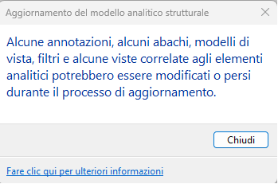

<head>
<meta http-equiv="Content-Type" content="text/html; charset=utf-8">
<link rel="stylesheet" type="text/css" href="bc.css">

</head>

<!---

- cleaning up and simplifying curve loops
Benoit Favre, CEO of [etudes &amp; automates](http://www.etudesetautomates.com)
Boundary Segments Issue
https://forums.autodesk.com/t5/revit-api-forum/boundary-segments-issue/m-p/11732446#M69140
Funny to get this very old post alive.
I'd change my answer from the time and say:
- sometimes the BoundarySegment list is holed (around windows and at the end of walls ending in the middle of the Room). So you have to close the List, practically we add another Segment to the List.
- check either Douglas Peucker or Visvaligham algorithms, easy to implement and very useful. At least that's what we use and these work fine for us.
douglas peucker algorithm
https://duckduckgo.com/?q=douglas+peucker+algorithm
Ramer–Douglas–Peucker algorithm
https://en.wikipedia.org/wiki/Ramer%E2%80%93Douglas%E2%80%93Peucker_algorithm
visvalingam algorithm
https://duckduckgo.com/?q=visvalingam+algorithm
Visvalingam–Whyatt algorithm
https://en.wikipedia.org/wiki/Visvalingam%E2%80%93Whyatt_algorithm
Many thanks to Benoit for the interesting pointer!

- clarifying geometry options, app.Create.NewGeometryOptions, 
  Find Centroid of wall in Revit API
  https://forums.autodesk.com/t5/revit-api-forum/find-centroid-of-wall-in-revit-api/m-p/11748826

- Greg version of JtClicker in 2023
  Jacopo Chiappetti
  Senior Analyst & Developer
  One Team srl
  Some annotations, schedules, view templates, filters, and views related to analytical elements might be modified or lost during the upgrade process
  https://forums.autodesk.com/t5/revit-api-forum/some-annotations-schedules-view-templates-filters-and-views/m-p/11721147

- A awesome package for MEP, Computational Design Inside Dynamo Revit
https://github.com/chuongmep/OpenMEP
OpenMEP Package also includes a comprehensive library of MEP components, making it easy to select and incorporate the right components into your design.This library includes a wide range of mechanical, electrical, and plumbing components, including pipes, fittings, valves, ducts, electrical equipment, and more fully automate your design process in design, maintenance, calculation and analysis,...
I believe that the MEP Package will be a valuable asset to construction professionals looking to streamline the MEP design process and ensure that their projects are completed on time and within budget.
https://www.linkedin.com/posts/chuongmep_opensource-dynamo-autodesk-activity-7033100499461570561-OUfG?utm_source=share&utm_medium=member_desktop
Chuong Ho
Computational Design Researcher | Autodesk Expert Elite
Hi everyone, today I want to tell you that a stable and long-term support package for MEP engineers open source has been released.
Open MEP Package also includes a comprehensive library of MEP components, making it easy to select and incorporate the right components into your design. This library includes a wide range of mechanical, electrical, and plumbing components, including pipes, fittings, valves, ducts, electrical equipment, and more fully automate your design process in design, maintenance, calculation and analysis,...
I believe that the MEP Package will be a valuable asset to construction professionals looking to streamline the MEP design process and ensure that their projects are completed on time and within budget.
Discuss on forum : https://lnkd.in/gtAi8RUP
Open Source : https://lnkd.in/gcWvCCXK
Now, I accept all ideas and all problems, contributions from all engineers, communities around the world.

- [Why we all need subtitles now](https://www.youtube.com/watch?v=VYJtb2YXae8)

twitter:

Curve loop simplification and clean up, geometry options clarification, JtClicker 2023 and the OpenMEP awesome @DynamoBIM package for MEP and computational design with the @AutodeskRevit #RevitAPI #BIM @AutodeskAPS https://autode.sk/simplifycurveloop

Geometry options and clean simple curves
&ndash; Curve loop simplify and clean up
&ndash; Geometry options clarification
&ndash; JtClicker 2023
&ndash; OpenMEP by Chuong Ho
&ndash; Unintelligible film dialogue...

linkedin:

Curve loop simplification and clean up, geometry options clarification, JtClicker 2023 and the OpenMEP awesome Dynamo package for MEP and computational design with the #RevitAPI

https://autode.sk/simplifycurveloop

- Curve loop simplification and cleanup
- Geometry options clarification
- JtClicker 2023
- OpenMEP by Chuong Ho
- Unintelligible film dialogue...

#BIM #DynamoBim #AutodeskAPS #Revit #API #IFC #SDK #AI #VisualStudio #Autodesk #AEC #adsk

the [Revit API discussion forum](http://forums.autodesk.com/t5/revit-api-forum/bd-p/160) thread

<pre class="code">
</pre>

-->

### Geometry Options and Clean Simple Curves

Today, we look at important aspects of geometry handling and other useful stuff:

- [Curve loop simplify and clean up](#2)
- [Geometry options clarification](#3)
- [JtClicker 2023](#4)
- [OpenMEP by Chuong Ho](#5)
- [Unintelligible film dialogue](#6)

#### Curve Loop Simplify and Clean Up

Benoit Favre, CEO of [etudes &amp; automates](http://www.etudesetautomates.com) shares
some interesting advice on how to simplify and clean up curve loops in 
the [Revit API discussion forum](http://forums.autodesk.com/t5/revit-api-forum/bd-p/160) thread
on a [boundary segments issue](https://forums.autodesk.com/t5/revit-api-forum/boundary-segments-issue/m-p/11732446#m69140):

Funny to get this very old post alive.

I'd change my answer from the first time and now say:

- Sometimes the `BoundarySegment` list has gaps, e.g., around windows and at the end of walls ending in the middle of a room. 
  So, you have to close the gap; in practice, we add another segment to the list.
- Check out either 
  the [Douglas Peucker](https://duckduckgo.com/?q=douglas+peucker+algorithm)
  or [Visvaligham algorithm](https://duckduckgo.com/?q=visvalingam+algorithm);
  they are easy to implement and very useful. 
  At least that's what we use, and they work fine for us.

On Wikipedia:

- [Ramer–Douglas–Peucker algorithm](https://en.wikipedia.org/wiki/Ramer%E2%80%93Douglas%E2%80%93Peucker_algorithm)
- [Visvalingam–Whyatt algorithm](https://en.wikipedia.org/wiki/Visvalingam%E2%80%93Whyatt_algorithm)

Many thanks to Benoit for the interesting pointers!

#### Geometry Options Clarification

The question on how to [find centroid of wall in Revit API](https://forums.autodesk.com/t5/revit-api-forum/find-centroid-of-wall-in-revit-api/m-p/11748826)
provided an opportunity to clarify the meaning of specific settings in the geometry `Options` and the use of the `NewGeometryOptions` method:

- ComputeReferences
- IncludeNonVisibleObjects

[`ComputeReferences`](https://www.revitapidocs.com/2023/d7da6de4-74a9-60e2-826f-698a5730d0a8.htm) is 
only needed if you require references to the geometry, e.g., for dimensioning purposes. 
Furthermore, it adds computational effort. 
Therefore, you should not set it to true unless needed, as explained in the 2010 article 
on [Geometry Options](https://thebuildingcoder.typepad.com/blog/2010/01/geometry-options.html).

The effect of turning off `ComputeReferences` was recently benchmarked in the discussion 
on [computing the correlation of objects in Revit](https://forums.autodesk.com/t5/revit-api-forum/computing-the-correlation-of-objects-in-revit/m-p/11701329/highlight/true#M68810):

It includes the final code and the benchmark results:

PC specs:

- CPU: 11th Gen Intel(R) Core(TM) i5-11400F @ 2.60GHz 2.59 GHz
- GPU: NVidia GeForce GTX 1650
- RAM: 32.0 GB
- OS: Windows 10 Pro 

The call to <i>BooleanOperationsUtils.ExecuteBooleanOperation(solidST, solidAR, BooleanOperationsType.Intersect)</i>
is triggered 113,696 times, both lists columnsSTR and columnsARC have 336 items each.

- Code runtime with `ComputeReferences` = true : 10.38 sec, AVG. 91.34 micro-seconds per intersection.
- Code runtime with `ComputeReferences` = false : 9.52 sec, AVG. 83.76 micro-seconds per intersection.

`IncludeNonVisibleObjects` is only required for certain supplementary graphical elements, e.g., 
for [curtain walls](https://thebuildingcoder.typepad.com/blog/2010/05/curtain-wall-geometry.html).
I am pretty sure that it is not required for such basic element geometry as solids.

So, I would leave both of those settings turned off in this case, set to their default value of false.

Furthermore, I doubt that there is any difference between using `new Options` and `app.Create.NewGeometryOptions`. 

However, specifying a view argument in the options will definitely make a difference, depending on the view you supply. 
That can be achieved using both `new Options` and `app.Create.NewGeometryOptions`. 

#### JtClicker 2023

Jacopo Chiappetti of [One Team srl](https://www.oneteam.it) shared 
a new implementation of [JtClicker](https://github.com/jeremytammik/JtClicker) to
programmatically dismiss a UI warning message in the thread 
on [some annotations, schedules, view templates, filters, and views related to analytical elements might be modified or lost during the upgrade process](https://forums.autodesk.com/t5/revit-api-forum/some-annotations-schedules-view-templates-filters-and-views/m-p/11721147):

**Question:** In Revit 2023, every time I open a model that contains at least one analytical element, a warning is displayed at the end of the process 
to [Upgrade the Analytical Model](https://help.autodesk.com/view/RVT/2023/ENU/?guid=GUID-E74EC52F-EFC6-4914-84B8-0119002A1C98): 
"Some annotations, schedules, view templates, filters, and views related to analytical elements might be modified or lost during the upgrade process."

This error window doesn't seem to be trappable by code (i.e., `Application_FailuresProcessing`) and blocks the automatic process of the model (custom code), after it is opened, until it's closed by the user. 
Is there a way to eliminate the message or intercept it somehow?

 <!-- 349 x 231 pixels -->

**Answer:** Yes, definitely. 
If worst comes to worst, you can use the native Windows API to catch and dismiss this dialogue. 
Look at the various options listed in The Building Coder topic group 
on [detecting and handling dialogues and failures](https://thebuildingcoder.typepad.com/blog/about-the-author.html#5.32).

**Response:** I cannot use `Application.FailuresProcessing` because it doesn't trap this warning.
Also, I cannot use `ControlledApplication.DialogBoxShowing`, as I use `IExternalDBApplication`, not `IExternalApplication`.
Hence, I have no access to any UI related functionality at all.
So, the only way seems using your JtClicker, isn't it? 

I gave 
the [.NET Dialogue Clicker in VB by Greg Wesner](https://thebuildingcoder.typepad.com/blog/2009/10/dismiss-dialogue-using-windows-api.html) a 
try and it works with some small mods.

The loading process is slower, but finally I can trap the warning dialog and close it.

I really can't understand why this warning hasn't been included, along with all the others, in the `FailuresProcessing` event and no possibility is given to disable it: really disheartening.

**Answer:** If you are operating in an interactive session of Revit, you should be able to use IExternalApplication.
It is great to keep your code split validly between DB and UI levels; it allows the DB code to work with the APS Design Automation API.
In that case, you might need a specific small UI Application subscribing to and dismissing just this notice.
  
Is that feasible for you? 
Or is the JtClicker approach easier? 

**Response:** For many reasons, I prefer not to use UI, so it's easier to use the "JtClicker approach".
Here is my implementation; it's very similar to Greg's version:

<pre class="prettyprint">
  Public timer1 As Timer
  Public timer_interval As Integer = 1000  'millisecondi
  Public timer_attempts As Integer 'not used
  Public Const diagTitle As String = "Aggiornamento del modello analitico strutturale"
  Public Const diagButton As String = "&Chiudi"

  Public Function EnumWindowsProc(ByVal hwnd As Integer, ByVal lParam As Integer) As Boolean
    Dim sbTitle As New StringBuilder(256)
    Dim test As Integer = User32.GetWindowText(hwnd, sbTitle, sbTitle.Capacity)
    Dim title As String = sbTitle.ToString()
    If title.Length &gt; 0 AndAlso title = diagTitle Then
      User32.EnumChildWindows(hwnd, New User32.EnumWindowsProc(AddressOf EnumChildProc), 0)
      Return False
    Else
      Return True
    End If
  End Function

  Public Function EnumChildProc(ByVal hwnd As Integer, ByVal lParam As Integer) As Boolean
    Dim sbTitle As New StringBuilder(256)
    User32.GetWindowText(hwnd, sbTitle, sbTitle.Capacity)
    Dim title As String = sbTitle.ToString()
    If title.Length &gt; 0 AndAlso title = diagButton Then
      User32.SendMessage(hwnd, User32.BM_SETSTATE, 1, 0)
      User32.SendMessage(hwnd, User32.WM_LBUTTONDOWN, 0, 0)
      User32.SendMessage(hwnd, User32.WM_LBUTTONUP, 0, 0)
      User32.SendMessage(hwnd, User32.BM_SETSTATE, 1, 0)
      If Not timer1 Is Nothing Then
        timer1.Stop()
        timer1 = Nothing
      End If
      Return False
    Else
      Return True
    End If
  End Function

  Public Sub timer1_Elapsed(ByVal sender As Object, ByVal e As EventArgs)
    'If timer_attempts &lt; 3000 Then
    User32.EnumWindows(New User32.EnumWindowsProc(AddressOf EnumWindowsProc), 0)
    'Else
    '  timer1.Stop()
    'End If
    'timer_attempts += 1
    'Debug.Print(timer_attempts.ToString())
  End Sub

  Public Sub closeOptionsDialog()
    timer_attempts = 0
    If timer1 Is Nothing Then
      timer1 = New Timer()
    End If
    timer1.Interval = timer_interval
    AddHandler timer1.Elapsed, New ElapsedEventHandler(AddressOf timer1_Elapsed)
    timer1.Start()
  End Sub
</pre> 

The `user32` module is identical:

<pre class="prettyprint">
Imports System
Imports System.Runtime.InteropServices
Imports System.Text

Module User32
  Delegate Function EnumWindowsProc(ByVal hWnd As Integer, ByVal lParam As Integer) As Boolean

  &lt;DllImport("user32.dll", CharSet:=CharSet.Unicode)&gt;
  Function FindWindow(ByVal className As String, ByVal windowName As String) As Integer
  End Function

  &lt;DllImport("user32.dll", CharSet:=CharSet.Unicode)&gt;
  Function EnumWindows(ByVal callbackFunc As EnumWindowsProc, ByVal lParam As Integer) As Integer
  End Function

  &lt;DllImport("user32.dll", CharSet:=CharSet.Unicode)&gt;
  Function EnumChildWindows(ByVal hwnd As Integer, ByVal callbackFunc As EnumWindowsProc, ByVal lParam As Integer) As Integer
  End Function

  &lt;DllImport("user32.dll", CharSet:=CharSet.Unicode)&gt;
  Function GetWindowText(ByVal hwnd As Integer, ByVal buff As StringBuilder, ByVal maxCount As Integer) As Integer
  End Function

  &lt;DllImport("user32.dll", CharSet:=CharSet.Unicode)&gt;
  Function GetLastActivePopup(ByVal hwnd As Integer) As Integer
  End Function

  &lt;DllImport("user32.dll", CharSet:=CharSet.Unicode)&gt;
  Function SendMessage(ByVal hwnd As Integer, ByVal Msg As Integer, ByVal wParam As Integer, ByVal lParam As Integer) As Integer
  End Function

  Public BM_SETSTATE As Integer = 243
  Public WM_LBUTTONDOWN As Integer = 513
  Public WM_LBUTTONUP As Integer = 514
End Module
</pre>
 
Many thanks to Jacopo for sharing his solution and thoughts on this!

By the way, Kev_D added another aspect: 

**Question:** Is there a non API solution to remove this?

**Answer:** I doubt it. 
But, of course, there are [Windows automation tools](https://duckduckgo.com/?q=windows+automation+tool) that you can use. 
Standard Windows automation. 
They can click buttons for you, i.e., simulate the required user interaction to dismiss the dialogue.

#### OpenMEP by Chuong Ho

Chuong Ho released [OpenMEP, an awesome package for MEP and computational design inside Dynamo Revit](https://github.com/chuongmep/OpenMEP).

The OpenMEP Package also includes a comprehensive library of MEP components, making it easy to select and incorporate the right components into your design.
The library contains a wide range of mechanical, electrical, and plumbing components, including pipes, fittings, valves, ducts, electrical equipment, and more fully automate your design process in design, maintenance, calculation and analysis.
I believe that the MEP Package will be a valuable asset to construction professionals looking to streamline the MEP design process and ensure that their projects are completed on time and within budget.

- [LinkedIn post](https://www.linkedin.com/posts/chuongmep_opensource-dynamo-autodesk-activity-7033100499461570561-OUfG)
- [DynamoBIM forum OpenMEP Package Feedback Thread](https://forum.dynamobim.com/t/openmep-package-feedback-thread/86350)
- [OpenMEP GitHub repository](https://github.com/chuongmep/OpenMEP)

#### Unintelligible Film Dialogue

Completely removed from programming and the Revit MEP, I enjoyed this 11-minute analysis 
of [why we all need subtitles now](https://www.youtube.com/watch?v=VYJtb2YXae8).

