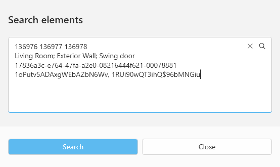

<head>
<meta http-equiv="Content-Type" content="text/html; charset=utf-8">
<link rel="stylesheet" type="text/css" href="bc.css">

</head>

<!---

twitter:

Revit 2024 released and RevitLookup 2024 enhanced with new UI, Windows 11 support, context menu, tooltip, searchbar, new core, extensions, extended storage, snoop point, edge, face, solid for the @AutodeskRevit #BIM #RevitAPI @DynamoBIM @AutodeskAPS https://autode.sk/revitlookup2024

Revit 2024 released and RevitLookup 2024 enhanced with new UI, Windows 11 support, context menu, tooltips, searchbar, new core, extensions, extended storage, snooping points, edges, faces, solids, usability features for the @AutodeskRevit #BIM #RevitAPI @DynamoBIM @AutodeskAPS https://autode.sk/revitlookup2024

Revit 2024 released and RevitLookup 2024 enhanced with new UI, Windows 11 support, new core, extensability and usability features
- Brand-new user interface
- Themes
- Extended context menu
- Tooltips
- Snoop Selection on Modify tab
- Smooth navigation
- Windows 11 Mica effect and Snap Layouts
- Searchbar
- Brand-new Engine core
- Extensions
- Display all methods
- Generic names support
- Methods overloads
- Extensible storage
- Extending Functionality
- Snoop Point, Sub-Element, UI Application
- Component manager
- PerformanceAdviser
- Registry research: schemas, services, updaters
- Explore built-in and APS (formerly Forge) units
- Event monitor
- Reworked search
- Visual search in a project
- OTA update
- RevitLookup ideas
- Vote: Where would you like to snoop? ...

linkedin:

Revit 2024 released and RevitLookup 2024 enhanced with new UI, Windows 11 support, context menu, tooltips, searchbar, new core, extensions, extended storage, snooping points, edges, faces, solids, usability features for the #RevitAPI

https://autode.sk/revitlookup2024

- Brand-new user interface
- Themes
- Extended context menu
- Tooltips
- Snoop Selection on Modify tab
- Smooth navigation
- Windows 11 Mica effect and Snap Layouts
- Searchbar
- Brand-new Engine core
- Extensions
- Display all methods
- Generic names support
- Methods overloads
- Extensible storage
- Extending Functionality
- Snoop Point, Sub-Element, UI Application
- Component manager
- PerformanceAdviser
- Registry research: schemas, services, updaters
- Explore built-in and APS (formerly Forge) units
- Event monitor
- Reworked search
- Visual search in a project
- OTA update
- RevitLookup ideas
- Vote: Where would you like to snoop? ...

#BIM #DynamoBIM #AutodeskAPS #Revit #API #IFC #SDK #Autodesk #AEC #adsk

the [Revit API discussion forum](http://forums.autodesk.com/t5/revit-api-forum/bd-p/160) thread

-->

### Revit 2024 and RevitLookup 2024

[Revit 2024 was released this week](https://blogs.autodesk.com/revit/2023/04/04/whats-new-in-autodesk-revit-2024/).

Further improving on last year's ground-breaking speed record,
Roman [Nice3point](https://github.com/Nice3point) was prepared well in advance to
release the corresponding [RevitLookup](https://github.com/jeremytammik/RevitLookup)
[2024 update](https://github.com/jeremytammik/RevitLookup/releases/tag/2024.0.0)
faster still this time around:

<!-- https://github.com/jeremytammik/RevitLookup/releases/edit/2024.0.0 -->

In this release, the entire code base has been completely rewritten from scratch with a redesigned user interface.
New tools, OTA update, Windows 11 support!

Here is an overview of the enhancements:

- [UI](#2)
    - A brand-new user interface
    - Themes
    - Extended context menu
    - Tooltips
    - Snoop Selection on Modify tab
    - Smooth navigation
    - Windows 11 Mica effect support
    - Windows 11 Snap Layouts support
    - Accent colour synced with OS
    - New logo
    - Searchbar
- [Engine](#3)
    - A brand-new core
    - Extensions
    - Display all methods
    - Generic names support
    - Multiple results for methods with overloads
    - Extensible storage moved to the `GetEntity()` method
    - Extending Functionality
- [New features](#4)
    - Snoop Point
    - Snoop Sub-Element
    - Snoop UI Application
    - Component manager
    - PerformanceAdviser on document performance
    - Registry research: schemas, services, updaters
    - Explore built-in and APS (formerly Forge) units
    - Event monitor
    - Reworked search
    - Visual search in a project
    - OTA update
- [RevitLookup ideas](#5)
- [Where would you like to snoop?](#6)

#### UI

##### A brand-new user interface

##### Themes

##### Extended context menu

Wiki page: [Context actions](https://github.com/jeremytammik/RevitLookup/wiki/Context-actions)

##### Tooltips

##### Snoop Selection on Modify tab

The Snoop Selection button has been moved to the Modify tab:

##### Smooth navigation

Enable acceleration in Revit settings if you are having trouble with this option:

##### Windows 11 Mica effect support

##### Windows 11 Snap Layouts support

##### Accent colour synced with OS

##### New logo

##### Searchbar

Focus is triggered by pressing any key on the keyboard:

####  Engine

##### A brand-new core

##### Extensions

Support new methods from the API and other libraries:

[Available Extensions](https://github.com/jeremytammik/RevitLookup/wiki/Extensions)

##### Display all methods

Displaying all methods that objects have, even if RevitLookup does not support them:

##### Generic names support

<table>
<tr><td>Before</td><td>Now</td></tr>
<tr><td></td><td></td></tr>
</table>

##### Multiple results for methods with overloads

##### Extensible storage moved to the `GetEntity()` method

##### Extending Functionality

Adding new features and extending the functionality of RevitLookup just got easier;
[check out the Developer's Guide](https://github.com/jeremytammik/RevitLookup/blob/dev/Contributing.md#architecture).

####  New features

##### Snoop Point

##### Snoop Sub-Element

##### Snoop UI Application

##### Component manager

Explore `AdWindows.dll` and learn how the ribbon and user interface in Revit are arranged.

##### PerformanceAdviser on document performance

`PerformanceAdviser` to Explore document performance issues.

##### Registry research: schemas, services, updaters

##### Explore built-in and APS (formerly Forge) units

##### Event monitor

Track all incoming events.
Events from the `RevitAPI.dll` and `RevitAPIUI.dll` libraries are available.
The search bar is used to filter results:

##### Reworked search

Now you can search for multiple values by `Name`, `Id`, `UniqueId`, `IfcGUID` and `Type IfcGUID` parameters:

Wiki page: [Search elements](https://github.com/jeremytammik/RevitLookup/wiki/Search-elements)

##### Visual search in a project

Showing elements:

Showing faces (Revit 2023 or higher):

Showing solids (Revit 2023 or higher):

Showing edges (Revit 2023 or higher):

##### OTA update

The RevitLookup update is now available directly from the plugin:

Designed & Developed by [Nice3point](https://github.com/Nice3point) 🕊

Ever so many thanks to Roman [Nice3point](https://github.com/Nice3point) for his tremendous work!

<!--

Revit 2024 has been released, which means it's time to update RevitLookup!

All new features will now be released for versions 2022 and 2024.

Also updated: all additional components for developers:

- Official Autodesk [Revit SDK](https://www.autodesk.com/developer-network/platform-technologies/revit)
- [Nice3point Revit libraries](https://github.com/Nice3point/RevitApi)
- [Nice3point Revit add-in templates](https://github.com/Nice3point/RevitTemplates)
- [Nice3point Revit extensions](https://github.com/Nice3point/RevitExtensions)

For further details, you can check out:

- The online help page
on [What's New in Revit 2024](https://help.autodesk.com/view/RVT/2024/ENU/?guid=GUID-C81929D7-02CB-4BF7-A637-9B98EC9EB38B)
- The blog post
on [What’s New in Autodesk Revit 2024](https://blogs.autodesk.com/revit/2022/04/05/whats-new-in-revit-2024/)
- Register to the AEC Collection Essentials webinar
on [What's New in Revit 2024](https://www.autodesk.com/webinars/aec/aec-collection-revit-2024) next week,
April 12

-->

#### RevitLookup Ideas

Check out
the [RevitLookup discussions page](https://github.com/jeremytammik/RevitLookup/discussions)
aka [RevitLookup Ideas](https://github.com/jeremytammik/RevitLookup/discussions)
to discuss your RevitLookup wishes and dreams with the developer community.

Here is one of the open discussions including a poll asking for your preference:

#### Where would you like to Snoop?

Discussion about
the [Snoop Selection button placement &#35;151](https://github.com/jeremytammik/RevitLookup/discussions/151):

What do you think of the new location of the "Snoop Selection" button?
How do you feel about it and what is your opinion on it, should it be kept or made optional?
The idea is that Revit automatically opens "Modify" tab, making the Snoop button available at all times.

[Please vote](https://github.com/jeremytammik/RevitLookup/discussions/151)!

