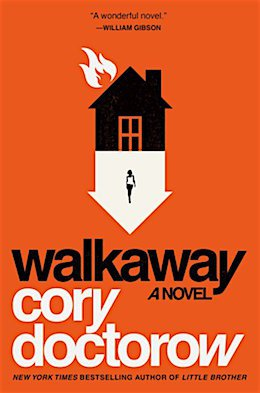

<head>
<meta http-equiv="Content-Type" content="text/html; charset=utf-8">
<link rel="stylesheet" type="text/css" href="bc.css">

</head>

<!---

- What's new in Revit 2024 release reel
  https://youtu.be/qA74NHN8lh0
  https://youtu.be/qA74NHN8lh0?t=2
  https://youtu.be/qA74NHN8lh0?t=30
  https://youtu.be/qA74NHN8lh0?t=89
  https://youtu.be/qA74NHN8lh0?t=157
  https://youtu.be/qA74NHN8lh0?t=226
  https://youtu.be/qA74NHN8lh0?t=300
  https://youtu.be/qA74NHN8lh0?t=324
  Chapters
  00:00 Introduction https://www.youtube.com/watch?v=qA74NHN8lh0&list=RDCMUC605NHqEkxXsFYdoPrD6mOg&index=1&t=0s
  00:30 For Everyone https://www.youtube.com/watch?v=qA74NHN8lh0&list=RDCMUC605NHqEkxXsFYdoPrD6mOg&index=1&t=30s
  01:29 Architects
  02:37 MEP
  03:46 Structure
  05:00 Model Coordination
  05:24 Documentation

- https://blogs.autodesk.com/revit/roadmap/

- webinar
  AEC Collection Essentials:
  What’s New in Revit 2024
  https://www.autodesk.com/webinars/aec/revit-whats-new-2024
  https://twitter.com/AutodeskRevit/status/1645819085886717956?s=20

- RevitLookup 2024
  https://github.com/jeremytammik/RevitLookup/blob/dev_winui/Changelog.md

- RevitLookup 2024.0.1
  https://github.com/jeremytammik/RevitLookup/releases/tag/2024.0.1

- RevitLookup 2024.0.2
  Fixed Fatal Error on Windows 10 #153
  Accent colour sync with OS now only available in Windows 11 and above. Many thanks to Aleksey Negus for testing builds
  https://github.com/jeremytammik/RevitLookup/releases/tag/2024.0.2

- WPF UI
  https://github.com/jeremytammik/RevitLookup/discussions/149#discussioncomment-5565125
  gaborschnierer
  Awesome job! Thank you for your contributions!
  I really like the winui style wpf windows. I tried to achieve a similar result for my project, but failed. I'll dive into into the code, but if you can recommend any guides and tweaks to get a basic winui style window displayed in Revit, that would save me a ton of brainwork. 😅
  Nice3point
  Thank you, I'm very pleased) The easiest way is to copy the UI project from RevitLookup. You will not be able to use the original winui project because it is tied to the use of the static Appication.Current property, which is not available for the dll applications that are used in Revit.
  In addition, you should not forget to add the manifest file to your application)
  изображение
  /Users/jta/a/doc/revit/tbc/git/a/img/wpf_ui_app_manifest.png
  There are probably no manuals, just learning the code 😉
  Using Microsoft.Extensions.Hosting.Host is optional, you can create a regular window, new FluentWindow() and call the ShowDialog() method, if you tell me what fails you, I can give more information)
  gaborschnierer reacted with rocket emoji
  Thanks for the tip. Tried the Host way as well, but it just starts to get so dependent on RevitLookup classes like Host and IWindow, that I gave up. Alternatively newing up the FluentWindow and calling ShowDialog() throws when trying to remove the backdrop. Do you have any quick tips? If not, don't worry, it's not so vital.
  Nice3point
  The documentation used to be here https://wpfui.lepo.co/documentation/, unfortunately it is not available nowTry running this project on your computer and learn how it works
  gaborschnierer
  Yea, I'll build it from ground up when I get the chance. Thanks! 🙏
  https://github.com/lepoco/wpfui

- Revit API training
  Q Do you teach or have you ever taught Revit in an online mode? I could use that.
  A We used to teach face-to-face courses and published the material on GitHub:
  https://github.com/ADN-DevTech/RevitTrainingMaterial
  https://github.com/jeremytammik/AdnRevitApiLabsXtra
  I never did online. I know Harry Mattison did:
  https://www.youtube.com/user/BoostYourBIM

- Siemens and Microsoft drive industrial productivity with generative artificial intelligence
  https://new.siemens.com/us/en/company/press/press-releases/digital-industries/siemens-microsoft-generative-artificial-intelligence.html

- Free Dolly: Introducing the World's First Truly Open Instruction-Tuned LLM
  https://www.databricks.com/blog/2023/04/12/dolly-first-open-commercially-viable-instruction-tuned-llm

- Build Your Own Large Language Model Like Dolly
  How to fine-tune and deploy your custom LLM
  https://www.databricks.com/resources/webinar/build-your-own-large-language-model-dolly

- 12 secret websites powered by AI to finish hours of work in minutes
  https://twitter.com/heyBarsee/status/1646161514682884099?s=20

- Cory Doctorow
  pwn
  https://en.wikipedia.org/wiki/Leet#Owned_and_pwned
  leet
  leetspeak
  https://md5decrypt.net/en/Leet-translator/#results

twitter:

News reel, AEC roadmap, cool scifi, RevitLookup 2024 updates and #RevitAPI training material for the @AutodeskRevit #BIM @DynamoBIM @AutodeskAPS https://autode.sk/rvt2024update

More news and updates related to Revit 2024, and some little titbits on AI and literature:
&ndash; News reel and AEC roadmaps
&ndash; Revit API training
&ndash; RevitLookup 2024 updates
&ndash; Free Dolly open-source instruction-tuned LLM
&ndash; Websites powered by AI
&ndash; Walkaway by Cory Doctorow...

linkedin:

News reel, AEC roadmap, cool scifi, RevitLookup 2024 updates and #RevitAPI training material

https://autode.sk/rvt2024update

- News reel and AEC roadmaps
- Revit API training
- RevitLookup 2024 updates
- Free Dolly open-source instruction-tuned LLM
- Websites powered by AI
- Walkaway by Cory Doctorow...

#BIM #DynamoBIM #AutodeskAPS #Revit #API #IFC #SDK #Autodesk #AEC #adsk

the [Revit API discussion forum](http://forums.autodesk.com/t5/revit-api-forum/bd-p/160) thread

-->

### News Reel, Roadmap and RevitLookup Updates

More news and updates related to Revit 2024 and some little titbits on AI and literature:

- [News reel and AEC roadmaps](#2)
- [Revit API training](#3)
- [RevitLookup 2024 updates](#4)
- [Free Dolly open-source instruction-tuned LLM](#5)
- [Websites powered by AI](#6)
- [Walkaway by Cory Doctorow](#7)

#### News Reel and AEC Roadmaps

To get a quick overview of what's new in the Revit 2024 product, you can check out the news reel:

- 00:00 [Introduction](https://youtu.be/qA74NHN8lh0)
- 00:30 [For Everyone](https://youtu.be/qA74NHN8lh0?t=30)
- 01:29 [Architects](https://youtu.be/qA74NHN8lh0?t=89)
- 02:37 [MEP](https://youtu.be/qA74NHN8lh0?t=157)
- 03:46 [Structure](https://youtu.be/qA74NHN8lh0?t=226)
- 05:00 [Model Coordination](https://youtu.be/qA74NHN8lh0?t=300)
- 05:24 [Documentation](https://youtu.be/qA74NHN8lh0?t=324)

To find out where it is going from here forward, explore
the updated [Autodesk AEC Public Roadmaps](https://blogs.autodesk.com/revit/roadmap/) and
take the opportunity to contribute your own requirements and ideas.

#### Revit API Training

I was asked once again about Revit API training:

**Question:** Do you teach or have you ever taught Revit in an online mode? I could use that.

**Answer:** We used to teach face-to-face courses before concentrating harder on making all material  publicly available to larger audiences world-wide.
Now, the material we used back then has been published and maintained on GitHub:

- [ADN RevitTrainingMaterial](https://github.com/ADN-DevTech/RevitTrainingMaterial)
- [AdnRevitApiLabsXtra](https://github.com/jeremytammik/AdnRevitApiLabsXtra)

I never did online courses myself.
I know [Harry Mattison](https://www.youtube.com/user/BoostYourBIM) did, though.

#### RevitLookup 2024 Updates

We already have two RevitLookup updates to share, 2024.0.1 and 2024.0.2:

- [RevitLookup 2024.0.2](https://github.com/jeremytammik/RevitLookup/releases/edit/2024.0.2)
  &ndash; Fixed Fatal Error on Windows 10 [#153](https://github.com/jeremytammik/RevitLookup/issues/153)
  &ndash; Accent colour sync with OS now only available in Windows 11 and above
  &ndash; Many thanks to [Aleksey Negus](https://t.me/a_negus) for testing builds.
- [RevitLookup 2024.0.1](https://github.com/jeremytammik/RevitLookup/releases/edit/2024.0.1) &ndash; see below:

Breaking changes:

- Added option to enable hardware acceleration (experimental)
 The user interface is now more responsive. Revit uses software acceleration by default. Contact us if you encounter problems with your graphics cards
 Known issue: rendering performance drops on selection. This is especially evident on roofs,
  cf. [Revit 2024 rendering performance drops on selection](https://forums.autodesk.com/t5/revit-api-forum/revit-2024-rendering-performance-drops-on-selection/td-p/11878396)
- Added button to enable RevitLookup panel on Modify tab by @ricaun in [#152](https://github.com/jeremytammik/RevitLookup/pull/152)
 Disabled by default. Thanks for voting! [#151](https://github.com/jeremytammik/RevitLookup/discussions/151)
- Opening RevitLookup window only when the Revit runtime context is available [#155](https://github.com/jeremytammik/RevitLookup/issues/155)

Improvements:

- Added shortcuts support for the Modify tab [#150](https://github.com/jeremytammik/RevitLookup/issues/150)
- Added EvaluatedParameter support
- Added Category.get_Visible support
- Added Category.get_AllowsVisibilityControl support
- Added Category.GetLineWeight support
- Added Category.GetLinePatternId support
- Added Category.GetElements extension
- Added Reference.ConvertToStableRepresentation support

Bugs:

- Fixed rare crashes in EventMonitor on large models
- Fixed Curve.Evaluate resolver using EndParameter as values

Other:

- Added installers for [previous RevitLookup versions](https://github.com/jeremytammik/RevitLookup/wiki/Versions)

Many thanks to Roman [Nice3point](https://github.com/Nice3point) for his tremendous work maintaining and improving RevitLookup!

#### Free Dolly Open-Source Instruction-Tuned LLM

In spite of its name, [OpenAI](https://en.wikipedia.org/wiki/OpenAI) is not open.

Hence, this is exciting, welcome  and positive news for the open community:

- [Free Dolly: Introducing the World's First Truly Open Instruction-Tuned LLM](https://www.databricks.com/blog/2023/04/12/dolly-first-open-commercially-viable-instruction-tuned-llm)

Coming up soon is a webinar on how
to [build your own large language model like Dolly](https://www.databricks.com/resources/webinar/build-your-own-large-language-model-dolly) detailing
how to fine-tune and deploy your custom LLM.

#### Websites Powered by AI

To experience some helpful AI in action yourself, you can check
out [12 secret websites powered by AI to finish hours of work in minutes](https://twitter.com/heyBarsee/status/1646161514682884099?s=20).

#### Walkaway by Cory Doctorow

I discovered a new author and a new favourite book,
[Walkaway](https://en.wikipedia.org/wiki/Walkaway_(Doctorow_novel))
by [Cory Doctorow](https://en.wikipedia.org/wiki/Cory_Doctorow).

For me, it is a brilliant philosophical scifi reminiscent
of [William Gibson's Agency](https://thebuildingcoder.typepad.com/blog/2021/10/sci-fi-languages-and-pipe-insulation-retrieval.html#4) that I was so thrilled by in 2021.

It is also focused on community, cooperation, communication, appreciation, relationships, exploitation, rich exploiters fighting to maintain a world of inequality, walkaways proving that we live in a world of surplus, not shortage, realising a post-scarcity gift economy, on-site fabrication of everything you need, and finally moving towards real visionary scifi ideas like eternal life using digital simulations of the human mind.

It also taught me some new vocabulary,
such as pwn,
as in [owned and pwned](https://en.wikipedia.org/wiki/Leet#Owned_and_pwned).
That in turn led me to discover [leet](https://en.wikipedia.org/wiki/Leet) and
[leetspeak translators](https://duckduckgo.com/?q=leetspeak+translator).
Not awfully useful in everyday life, but cool stuff to be aware of.

 <!-- Pixel Height: 393 Pixel Width: 260 -->

