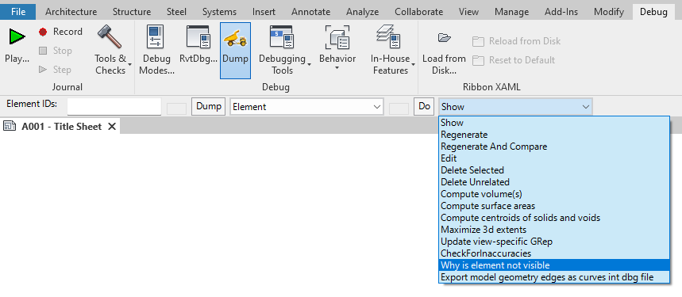
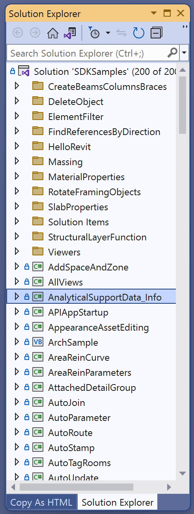

<head>
<meta http-equiv="Content-Type" content="text/html; charset=utf-8">
<link rel="stylesheet" type="text/css" href="bc.css">

</head>

<!---

twitter:

APS cloud accelerators in Nice and Medellin, and compiling the Revit 2024 SDK samples for the @AutodeskRevit #RevitAPI #BIM @DynamoBIM @AutodeskAPS https://autode.sk/rvt2024sdk

APS cloud accelerators in Nice and Medellin
&ndash; Compiling the Revit 2024 SDK samples
&ndash; Visual introduction to machine learning...

linkedin:

APS cloud accelerators in Nice and Medellin, and compiling the Revit 2024 SDK samples for the #RevitAPI

https://autode.sk/rvt2024sdk

- APS cloud accelerators in Nice and Medellin
- Compiling the Revit 2024 SDK samples
- Visual introduction to machine learning...

#BIM #DynamoBIM #AutodeskAPS #Revit #API #IFC #SDK #Autodesk #AEC #adsk

the [Revit API discussion forum](http://forums.autodesk.com/t5/revit-api-forum/bd-p/160) thread

-->

### Nice Accelerator and Compiling the Revit 2024 SDK

I'm in Nice, France, today and tomorrow, attending the [APS cloud accelerator](https://aps.autodesk.com/accelerator-program).
This one is help in parallel with another one in Medellin, Columbia, so we are hosting two at the same time this week.

I finally got around to installing Revit 2024 myself and compiling the Revit 2024 SDK samples:

- [Compiling the Revit 2024 SDK samples](#3)
- [Visual introduction to machine learning](#4)

<!---

#### RevitLookup 2024.0.3 and the Debug Tab

Roman [Nice3point](https://github.com/Nice3point) published another update,
[RevitLookup 2024.0.3](https://github.com/jeremytammik/RevitLookup/releases/tag/2024.0.3):

The main change is a new option to enable the Revit `Debug` tab.
Here, you will find many different commands that allow you to configure the hidden features of Revit, create model dumps, and gain an even deeper understanding of how the software works.
Dumps are saved in the same folder as Revit journals:

- %LOCALAPPDATA%\Autodesk\Revit\Autodesk Revit 2024\Journals

The Debug tab is part of Revit, built-in, unofficial, and hence unsupported.
RevitLookup simply allows you to activate it.
So, we cannot attend to any possible crashes or other issues related to this tab.

Further improvements include:

- Added Workset support
- Added WorksetTable support
- Added Document.GetUnusedElements support

Fixes:

- Fixed Dashboard window startup location

-->

 <!-- Pixel Height: 1,298, Pixel Width: 492 -->

#### Compiling the Revit 2024 SDK Samples

I installed the Revit 2024 SDK samples and updated
the [RevitSdkSamples repository](https://github.com/jeremytammik/RevitSdkSamples) to
the original pristine [release 2024.0.0.0](https://github.com/jeremytammik/RevitSdkSamples/releases/tag/2024.0.0.0).

Loading `SDKSamples.sln` in Visual Studio and hitting 'compile' initially produced 9658 errors and warnings due to missing Revit API references.

I need to update `SDKSamples.targets`. In there, I replaced

- $(SolutionDir)..\..\..\..\$(ConfigurationName)$(PlatformName)\

or, more specifically, as a regular expression,

- \$\(SolutionDir\)\.\.\\\.\.\\\.\.\\\.\.\\\$\(ConfigurationName\)\$\(PlatformName\)\\

by

- C:/Program Files/Autodesk/Revit 2024/

That reduced the count to 543 errors and 141 warnings.

So, I repeated the same process in the other three files as well, i.e., all four files in the *SDK/Samples/VSProps* folder:

- SDKSamples.CivilAlignments.targets
- SDKSamples.Steel.targets
- SDKSamples.VB.targets
- SDKSamples.targets

I had to unload and reload the solution file between each of these modifications.

That brought me down to 2 errors and 60 warnings, the same ones I encountered
[last time around, for Revit 2023](https://thebuildingcoder.typepad.com/blog/2022/04/compiling-the-revit-2023-sdk-samples.html):

- Error CS1591: Missing XML comment for publicly visible type or member bla, bla, bla
  &ndash; [Missing XML Comments](https://thebuildingcoder.typepad.com/blog/2022/04/compiling-the-revit-2023-sdk-samples.html#5)
- Warning: There was a mismatch between the processor architecture of the project being built "MSIL" and the processor architecture of the reference "RevitAPI", "AMD64"...
  &ndash; [DisableMismatchWarning](https://github.com/jeremytammik/DisableMismatchWarning)

That brings it down to three warnings, which I will ignore.

I captured this state of affairs
in [RevitSdkSamples release 2024.0.0.2](https://github.com/jeremytammik/RevitSdkSamples/releases/tag/2024.0.0.2).

So, we have now compiled all projects; 200 succeeded, 0 failed, 0 skipped:

<pre style="font-size:50%">
Rebuild started...
1>------ Rebuild All started: Project: Toposolid, Configuration: Debug Any CPU ------
2>------ Rebuild All started: Project: CreateDuctworkStiffener, Configuration: Debug Any CPU ------
3>------ Rebuild All started: Project: NetworkPressureLossReport, Configuration: Debug Any CPU ------
4>------ Rebuild All started: Project: SelectionChanged, Configuration: Debug Any CPU ------
1>  Toposolid -> Y:\a\src\rvt\RevitSdkSamples\SDK\Samples\Toposolid\CS\bin\Debug\Toposolid.dll
2>  CreateDuctworkStiffener -> Y:\a\src\rvt\RevitSdkSamples\SDK\Samples\CreateDuctworkStiffener\CS\bin\Debug\CreateDuctworkStiffener.dll
5>------ Rebuild All started: Project: SheetToView3D, Configuration: Debug Any CPU ------
6>------ Rebuild All started: Project: ContextualAnalyticalModel, Configuration: Debug Any CPU ------
5>  SheetToView3D -> Y:\a\src\rvt\RevitSdkSamples\SDK\Samples\SheetToView3D\CS\bin\Debug\SheetToView3D.dll
6>  ContextualAnalyticalModel -> Y:\a\src\rvt\RevitSdkSamples\SDK\Samples\ContextualAnalyticalModel\CS\bin\Debug\ContextualAnalyticalModel.dll
7>------ Rebuild All started: Project: ExportPDFSettingsSample, Configuration: Debug Any CPU ------
8>------ Rebuild All started: Project: InCanvasControlAPI, Configuration: Debug Any CPU ------
4>  SelectionChanged -> Y:\a\src\rvt\RevitSdkSamples\SDK\Samples\Events\SelectionChanged\CS\bin\Debug\SelectionChanged.dll
7>  ExportPDFSettingsSample -> Y:\a\src\rvt\RevitSdkSamples\SDK\Samples\ExportPDFSettingsSample\CS\bin\Debug\ExportPDFSettingsSample.dll
8>  InCanvasControlAPI -> Y:\a\src\rvt\RevitSdkSamples\SDK\Samples\InCanvasControlAPI\CS\bin\Debug\InCanvasControlAPI.dll
9>------ Rebuild All started: Project: UpdateExternallyTaggedBRep, Configuration: Debug Any CPU ------
10>------ Rebuild All started: Project: CloudAPISample, Configuration: Debug Any CPU ------
11>------ Rebuild All started: Project: ColorFill, Configuration: Debug Any CPU ------
9>  UpdateExternallyTaggedBRep -> Y:\a\src\rvt\RevitSdkSamples\SDK\Samples\GeometryAPI\UpdateExternallyTaggedBRep\CS\bin\Debug\UpdateExternallyTaggedBRep.dll
12>------ Rebuild All started: Project: CivilAlignments, Configuration: Debug Any CPU ------
11>  ColorFill -> Y:\a\src\rvt\RevitSdkSamples\SDK\Samples\ColorFill\CS\bin\Debug\ColorFill.dll
13>------ Rebuild All started: Project: ViewTemplateCreation, Configuration: Debug Any CPU ------
3>  NetworkPressureLossReport -> Y:\a\src\rvt\RevitSdkSamples\SDK\Samples\NetworkPressureLossReport\CS\bin\Debug\NetworkPressureLossReport.dll
14>------ Rebuild All started: Project: Custom2DExporter, Configuration: Debug Any CPU ------
12>  CivilAlignments -> Y:\a\src\rvt\RevitSdkSamples\SDK\Samples\CivilAlignments\CS\bin\Debug\CivilAlignments.dll
15>------ Rebuild All started: Project: PathOfTravel, Configuration: Debug Any CPU ------
13>  ViewTemplateCreation -> Y:\a\src\rvt\RevitSdkSamples\SDK\Samples\ViewTemplateCreation\CS\bin\Debug\ViewTemplateCreation.dll
14>  Custom2DExporter -> Y:\a\src\rvt\RevitSdkSamples\SDK\Samples\CustomExporter\Custom2DExporter\CS\bin\Debug\Custom2DExporter.dll
16>------ Rebuild All started: Project: AttachedDetailGroup, Configuration: Debug Any CPU ------
17>------ Rebuild All started: Project: SampleCommandsSteelElements, Configuration: Debug Any CPU ------
15>  PathOfTravel -> Y:\a\src\rvt\RevitSdkSamples\SDK\Samples\PathOfTravel\CS\bin\Debug\PathOfTravel.dll
18>------ Rebuild All started: Project: AppearanceAssetEditing, Configuration: Debug Any CPU ------
10>  CloudAPISample -> Y:\a\src\rvt\RevitSdkSamples\SDK\Samples\CloudAPISample\CS\bin\Debug\CloudAPISample.dll
16>  AttachedDetailGroup -> Y:\a\src\rvt\RevitSdkSamples\SDK\Samples\AttachedDetailGroup\CS\bin\Debug\AttachedDetailGroup.dll
17>  SampleCommandsSteelElements -> Y:\a\src\rvt\RevitSdkSamples\SDK\Samples\SampleCommandsSteelElements\CS\bin\Debug\SampleCommandsSteelElements.dll
19>------ Rebuild All started: Project: DuplicateGraphics, Configuration: Debug Any CPU ------
20>------ Rebuild All started: Project: RebarFreeForm, Configuration: Debug Any CPU ------
21>------ Rebuild All started: Project: BRepBuilderExample, Configuration: Debug Any CPU ------
18>  AppearanceAssetEditing -> Y:\a\src\rvt\RevitSdkSamples\SDK\Samples\AppearanceAssetEditing\CS\bin\Debug\AppearanceAssetEditing.dll
22>------ Rebuild All started: Project: PlacementOptions, Configuration: Debug Any CPU ------
19>  DuplicateGraphics -> Y:\a\src\rvt\RevitSdkSamples\SDK\Samples\DuplicateGraphics\CS\bin\Debug\DuplicateGraphics.dll
20>  RebarFreeForm -> Y:\a\src\rvt\RevitSdkSamples\SDK\Samples\RebarFreeForm\CS\bin\Debug\RebarFreeForm.dll
23>------ Rebuild All started: Project: CapitalizeAllTextNotes, Configuration: Debug Any CPU ------
24>------ Rebuild All started: Project: RebarContainerAnyShapeType, Configuration: Debug Any CPU ------
21>  BRepBuilderExample -> Y:\a\src\rvt\RevitSdkSamples\SDK\Samples\GeometryAPI\BRepBuilderExample\CS\bin\Debug\BRepBuilderExample.dll
25>------ Rebuild All started: Project: GenericStructuralConnection, Configuration: Debug Any CPU ------
22>  PlacementOptions -> Y:\a\src\rvt\RevitSdkSamples\SDK\Samples\PlacementOptions\CS\bin\Debug\PlacementOptions.dll
26>------ Rebuild All started: Project: FabricationPartLayout, Configuration: Debug Any CPU ------
23>  CapitalizeAllTextNotes -> Y:\a\src\rvt\RevitSdkSamples\SDK\Samples\CapitalizeAllTextNotes\CS\bin\Debug\CapitalizeAllTextNotes.dll
24>  RebarContainerAnyShapeType -> Y:\a\src\rvt\RevitSdkSamples\SDK\Samples\RebarContainerAnyShapeType\CS\bin\Debug\RebarContainerAnyShapeType.dll
27>------ Rebuild All started: Project: DatumsModification, Configuration: Debug Any CPU ------
28>------ Rebuild All started: Project: DimensionLeaderEnd, Configuration: Debug Any CPU ------
25>  GenericStructuralConnection -> Y:\a\src\rvt\RevitSdkSamples\SDK\Samples\GenericStructuralConnection\CS\bin\Debug\GenericStructuralConnection.dll
29>------ Rebuild All started: Project: ExternalResourceDBServer, Configuration: Debug Any CPU ------
26>  FabricationPartLayout -> Y:\a\src\rvt\RevitSdkSamples\SDK\Samples\FabricationPartLayout\CS\bin\Debug\FabricationPartLayout.dll
30>------ Rebuild All started: Project: FamilyParametersOrder, Configuration: Debug Any CPU ------
28>  DimensionLeaderEnd -> Y:\a\src\rvt\RevitSdkSamples\SDK\Samples\DimensionLeaderEnd\CS\bin\Debug\DimensionLeaderEnd.dll
31>------ Rebuild All started: Project: ReadonlySharedParameters, Configuration: Debug Any CPU ------
29>  ExternalResourceDBServer -> Y:\a\src\rvt\RevitSdkSamples\SDK\Samples\ExternalResourceServer\ExternalResourceDBServer\CS\bin\Debug\ExternalResourceDBServer.dll
27>  DatumsModification -> Y:\a\src\rvt\RevitSdkSamples\SDK\Samples\DatumsModification\CS\bin\Debug\DatumsModification.dll
32>------ Rebuild All started: Project: ExternalResourceUIServer, Configuration: Debug Any CPU ------
33>------ Rebuild All started: Project: GetSetDefaultTypes, Configuration: Debug Any CPU ------
30>  FamilyParametersOrder -> Y:\a\src\rvt\RevitSdkSamples\SDK\Samples\FamilyParametersOrder\CS\bin\Debug\FamilyParametersOrder.dll
31>  ReadonlySharedParameters -> Y:\a\src\rvt\RevitSdkSamples\SDK\Samples\ReadonlySharedParameters\CS\bin\Debug\ReadonlySharedParameters.dll
34>------ Rebuild All started: Project: DockableDialogs, Configuration: Debug Any CPU ------
35>------ Rebuild All started: Project: WinderStairs, Configuration: Debug Any CPU ------
35>  WinderStairs -> Y:\a\src\rvt\RevitSdkSamples\SDK\Samples\WinderStairs\CS\bin\Debug\WinderStairs.dll
36>------ Rebuild All started: Project: UIAPI, Configuration: Debug Any CPU ------
33>  GetSetDefaultTypes -> Y:\a\src\rvt\RevitSdkSamples\SDK\Samples\GetSetDefaultTypes\CS\bin\Debug\GetSetDefaultTypes.dll
37>------ Rebuild All started: Project: Units, Configuration: Debug Any CPU ------
37>  Units -> Y:\a\src\rvt\RevitSdkSamples\SDK\Samples\Units\CS\bin\Debug\Units.dll
38>------ Rebuild All started: Project: SinePlotter, Configuration: Debug Any CPU ------
38>  SinePlotter -> Y:\a\src\rvt\RevitSdkSamples\SDK\Samples\SinePlotter\CS\bin\Debug\SinePlotter.dll
34>  DockableDialogs -> Y:\a\src\rvt\RevitSdkSamples\SDK\Samples\DockableDialogs\CS\bin\Debug\DockableDialogs.dll
39>------ Rebuild All started: Project: ExtensibleStorageUtility, Configuration: Debug Any CPU ------
40>------ Rebuild All started: Project: DuplicateViews, Configuration: Debug Any CPU ------
36>  UIAPI -> Y:\a\src\rvt\RevitSdkSamples\SDK\Samples\UIAPI\CS\bin\Debug\UIAPI.dll
41>------ Rebuild All started: Project: ScheduleToHTML, Configuration: Debug Any CPU ------
39>  ExtensibleStorageUtility -> Y:\a\src\rvt\RevitSdkSamples\SDK\Samples\ExtensibleStorageUtility\CS\bin\Debug\ExtensibleStorageUtility.dll
42>------ Rebuild All started: Project: ScheduleAutomaticFormatter, Configuration: Debug Any CPU ------
40>  DuplicateViews -> Y:\a\src\rvt\RevitSdkSamples\SDK\Samples\DuplicateViews\CS\bin\Debug\DuplicateViews.dll
41>  ScheduleToHTML -> Y:\a\src\rvt\RevitSdkSamples\SDK\Samples\ScheduleToHTML\CS\bin\Debug\ScheduleToHTML.dll
43>------ Rebuild All started: Project: PostCommandWorkflow, Configuration: Debug Any CPU ------
44>------ Rebuild All started: Project: DisplacementElementAnimation, Configuration: Debug Any CPU ------
42>  ScheduleAutomaticFormatter -> Y:\a\src\rvt\RevitSdkSamples\SDK\Samples\ScheduleAutomaticFormatter\CS\bin\Debug\ScheduleAutomaticFormatter.dll
45>------ Rebuild All started: Project: FreeFormElement, Configuration: Debug Any CPU ------
32>  ExternalResourceUIServer -> Y:\a\src\rvt\RevitSdkSamples\SDK\Samples\ExternalResourceServer\ExternalResourceUIServer\CS\bin\Debug\ExternalResourceUIServer.dll
46>------ Rebuild All started: Project: ScheduleCreation, Configuration: Debug Any CPU ------
44>  DisplacementElementAnimation -> Y:\a\src\rvt\RevitSdkSamples\SDK\Samples\DisplacementElementAnimation\CS\bin\Debug\DisplacementElementAnimation.dll
43>  PostCommandWorkflow -> Y:\a\src\rvt\RevitSdkSamples\SDK\Samples\PostCommandWorkflow\CS\bin\Debug\PostCommandWorkflow.dll
47>------ Rebuild All started: Project: DisableCommand, Configuration: Debug Any CPU ------
48>------ Rebuild All started: Project: StairsAutomation, Configuration: Debug Any CPU ------
46>  ScheduleCreation -> Y:\a\src\rvt\RevitSdkSamples\SDK\Samples\ScheduleCreation\CS\bin\Debug\ScheduleCreation.dll
45>  FreeFormElement -> Y:\a\src\rvt\RevitSdkSamples\SDK\Samples\FreeFormElement\CS\bin\Debug\FreeFormElement.dll
49>------ Rebuild All started: Project: RoutingPreferenceTools, Configuration: Debug Any CPU ------
50>------ Rebuild All started: Project: ProgressNotifier, Configuration: Debug Any CPU ------
47>  DisableCommand -> Y:\a\src\rvt\RevitSdkSamples\SDK\Samples\DisableCommand\CS\bin\Debug\DisableCommand.dll
48>  StairsAutomation -> Y:\a\src\rvt\RevitSdkSamples\SDK\Samples\StairsAutomation\CS\bin\Debug\StairsAutomation.dll
51>------ Rebuild All started: Project: ModelessForm_IdlingEvent, Configuration: Debug Any CPU ------
52>------ Rebuild All started: Project: ModelessForm_ExternalEvent, Configuration: Debug Any CPU ------
51>  ModelessForm_IdlingEvent -> Y:\a\src\rvt\RevitSdkSamples\SDK\Samples\ModelessDialog\ModelessForm_IdlingEvent\CS\bin\Debug\ModelessForm_IdlingEvent.dll
52>  ModelessForm_ExternalEvent -> Y:\a\src\rvt\RevitSdkSamples\SDK\Samples\ModelessDialog\ModelessForm_ExternalEvent\CS\bin\Debug\ModelessForm_ExternalEvent.dll
53>------ Rebuild All started: Project: WorkThread, Configuration: Debug Any CPU ------
54>------ Rebuild All started: Project: ExternalCommandRegistration, Configuration: Debug Any CPU ------
53>  WorkThread -> Y:\a\src\rvt\RevitSdkSamples\SDK\Samples\MultiThreading\WorkThread\CS\bin\Debug\WorkThread.dll
50>  ProgressNotifier -> Y:\a\src\rvt\RevitSdkSamples\SDK\Samples\Events\ProgressNotifier\CS\bin\Debug\ProgressNotifier.dll
54>  ExternalCommandRegistration -> Y:\a\src\rvt\RevitSdkSamples\SDK\Samples\ExternalCommand\CS\ExternalCommandRegistration\bin\Debug\ExternalCommandRegistration.dll
55>------ Rebuild All started: Project: RevitAddInUtilitySample, Configuration: Debug Any CPU ------
56>------ Rebuild All started: Project: ProximityDetection_WallJoinControl, Configuration: Debug Any CPU ------
49>  RoutingPreferenceTools -> Y:\a\src\rvt\RevitSdkSamples\SDK\Samples\RoutingPreferenceTools\CS\bin\Debug\RoutingPreferenceTools.dll
57>------ Rebuild All started: Project: GeometryCreation_BooleanOperation, Configuration: Debug Any CPU ------
58>------ Rebuild All started: Project: ComputedSymbolGeometry, Configuration: Debug Any CPU ------
56>C:\Program Files\Microsoft Visual Studio\2022\Professional\MSBuild\Current\Bin\arm64\Microsoft.CSharp.CurrentVersion.targets(129,9): warning MSB3884: Could not find rule set file "ProximityDetection_WallJoinControl.ruleset".
56>  ProximityDetection_WallJoinControl -> Y:\a\src\rvt\RevitSdkSamples\SDK\Samples\GeometryAPI\ProximityDetection_WallJoinControl\CS\bin\Debug\ProximityDetection_WallJoinControl.dll
57>C:\Program Files\Microsoft Visual Studio\2022\Professional\MSBuild\Current\Bin\arm64\Microsoft.CSharp.CurrentVersion.targets(129,9): warning MSB3884: Could not find rule set file "GeometryCreation_BooleanOperation.ruleset".
57>  GeometryCreation_BooleanOperation -> Y:\a\src\rvt\RevitSdkSamples\SDK\Samples\GeometryAPI\GeometryCreation_BooleanOperation\CS\bin\Debug\GeometryCreation_BooleanOperation.dll
58>  ComputedSymbolGeometry -> Y:\a\src\rvt\RevitSdkSamples\SDK\Samples\GeometryAPI\ComputedSymbolGeometry\CS\bin\Debug\ComputedSymbolGeometry.dll
59>------ Rebuild All started: Project: MultithreadedCalculation, Configuration: Debug Any CPU ------
60>------ Rebuild All started: Project: PerformanceAdviserControl, Configuration: Debug Any CPU ------
61>------ Rebuild All started: Project: PointCloudEngine, Configuration: Debug Any CPU ------
59>  MultithreadedCalculation -> Y:\a\src\rvt\RevitSdkSamples\SDK\Samples\AnalysisVisualizationFramework\MultithreadedCalculation\CS\bin\Debug\MultithreadedCalculation.dll
62>------ Rebuild All started: Project: EnergyAnalysisModel, Configuration: Debug Any CPU ------
60>  PerformanceAdviserControl -> Y:\a\src\rvt\RevitSdkSamples\SDK\Samples\PerformanceAdviserControl\CS\bin\Debug\PerformanceAdviserControl.dll
61>  PointCloudEngine -> Y:\a\src\rvt\RevitSdkSamples\SDK\Samples\PointCloudEngine\CS\bin\Debug\PointCloudEngine.dll
63>------ Rebuild All started: Project: SchemaWrapperTools, Configuration: Debug Any CPU ------
64>------ Rebuild All started: Project: MultiplanarRebar, Configuration: Debug Any CPU ------
62>  EnergyAnalysisModel -> Y:\a\src\rvt\RevitSdkSamples\SDK\Samples\GeometryAPI\EnergyAnalysisModel\CS\bin\Debug\EnergyAnalysisModel.dll
63>  SchemaWrapperTools -> Y:\a\src\rvt\RevitSdkSamples\SDK\Samples\ExtensibleStorageManager\SchemaWrapperTools\CS\bin\Debug\SchemaWrapperTools.dll
65>------ Rebuild All started: Project: CreateFillPattern, Configuration: Debug Any CPU ------
55>  RevitAddInUtilitySample -> Y:\a\src\rvt\RevitSdkSamples\SDK\Samples\ExternalCommand\CS\RevitAddInUtilitySample\bin\Debug\RevitAddInUtilitySample.exe
66>------ Rebuild All started: Project: ExtensibleStorageManager, Configuration: Debug Any CPU ------
67>------ Rebuild All started: Project: DividedSurfaceByIntersects, Configuration: Debug Any CPU ------
64>  MultiplanarRebar -> Y:\a\src\rvt\RevitSdkSamples\SDK\Samples\MultiplanarRebar\CS\bin\debug\MultiplanarRebar.dll
68>------ Rebuild All started: Project: SolidSolidCut, Configuration: Debug Any CPU ------
65>  CreateFillPattern -> Y:\a\src\rvt\RevitSdkSamples\SDK\Samples\CreateFillPattern\CS\bin\Debug\CreateFillPattern.dll
69>------ Rebuild All started: Project: DynamicModelUpdate, Configuration: Debug Any CPU ------
67>  DividedSurfaceByIntersects -> Y:\a\src\rvt\RevitSdkSamples\SDK\Samples\Massing\DividedSurfaceByIntersects\CS\bin\Debug\DividedSurfaceByIntersects.dll
70>------ Rebuild All started: Project: SpatialFieldGradient, Configuration: Debug Any CPU ------
68>  SolidSolidCut -> Y:\a\src\rvt\RevitSdkSamples\SDK\Samples\SolidSolidCut\CS\bin\Debug\SolidSolidCut.dll
71>------ Rebuild All started: Project: DistanceToSurfaces, Configuration: Debug Any CPU ------
69>  DynamicModelUpdate -> Y:\a\src\rvt\RevitSdkSamples\SDK\Samples\DynamicModelUpdate\CS\bin\Release\DynamicModelUpdate.dll
72>------ Rebuild All started: Project: DirectionCalculation, Configuration: Debug Any CPU ------
70>  SpatialFieldGradient -> Y:\a\src\rvt\RevitSdkSamples\SDK\Samples\AnalysisVisualizationFramework\SpatialFieldGradient\CS\bin\Debug\SpatialFieldGradient.dll
71>  DistanceToSurfaces -> Y:\a\src\rvt\RevitSdkSamples\SDK\Samples\AnalysisVisualizationFramework\DistanceToSurfaces\CS\bin\Debug\DistanceToSurfaces.dll
73>------ Rebuild All started: Project: ViewFilters, Configuration: Debug Any CPU ------
72>  DirectionCalculation -> Y:\a\src\rvt\RevitSdkSamples\SDK\Samples\DirectionCalculation\CS\bin\Debug\DirectionCalculation.dll
74>------ Rebuild All started: Project: ErrorHandling, Configuration: Debug Any CPU ------
75>------ Rebuild All started: Project: MeasureHeight, Configuration: Debug Any CPU ------
74>  ErrorHandling -> Y:\a\src\rvt\RevitSdkSamples\SDK\Samples\ErrorHandling\CS\bin\Debug\ErrorHandling.dll
75>  MeasureHeight -> Y:\a\src\rvt\RevitSdkSamples\SDK\Samples\FindReferencesByDirection\MeasureHeight\CS\bin\Debug\MeasureHeight.dll
73>  ViewFilters -> Y:\a\src\rvt\RevitSdkSamples\SDK\Samples\ElementFilter\ViewFilters\CS\bin\Debug\ViewFilters.dll
76>------ Rebuild All started: Project: FindColumns, Configuration: Debug Any CPU ------
77>------ Rebuild All started: Project: MaterialQuantities, Configuration: Debug Any CPU ------
78>------ Rebuild All started: Project: ParameterValuesFromImage, Configuration: Debug Any CPU ------
66>  ExtensibleStorageManager -> Y:\a\src\rvt\RevitSdkSamples\SDK\Samples\ExtensibleStorageManager\ExtensibleStorageManager\CS\bin\Debug\ExtensibleStorageManager.dll
76>  FindColumns -> Y:\a\src\rvt\RevitSdkSamples\SDK\Samples\FindReferencesByDirection\FindColumns\CS\bin\Debug\FindColumns.dll
77>  MaterialQuantities -> Y:\a\src\rvt\RevitSdkSamples\SDK\Samples\MaterialQuantities\CS\bin\Debug\MaterialQuantities.dll
79>------ Rebuild All started: Project: PointCurveCreation, Configuration: Debug Any CPU ------
78>  ParameterValuesFromImage -> Y:\a\src\rvt\RevitSdkSamples\SDK\Samples\Massing\ParameterValuesFromImage\CS\bin\Debug\ParameterValuesFromImage.dll
80>------ Rebuild All started: Project: PanelSchedule, Configuration: Debug Any CPU ------
81>------ Rebuild All started: Project: ChangesMonitor, Configuration: Debug Any CPU ------
82>------ Rebuild All started: Project: Selections, Configuration: Debug Any CPU ------
79>  PointCurveCreation -> Y:\a\src\rvt\RevitSdkSamples\SDK\Samples\Massing\PointCurveCreation\CS\bin\Debug\PointCurveCreation.dll
80>  PanelSchedule -> Y:\a\src\rvt\RevitSdkSamples\SDK\Samples\PanelSchedule\CS\bin\Debug\PanelSchedule.dll
83>------ Rebuild All started: Project: HelloRevit (HelloRevit\VB.NET\HelloRevit), Configuration: Debug Any CPU ------
84>------ Rebuild All started: Project: HelloRevit (HelloRevit\CS\HelloRevit), Configuration: Debug Any CPU ------
81>  ChangesMonitor -> Y:\a\src\rvt\RevitSdkSamples\SDK\Samples\DocumentChanged\CS\bin\Debug\ChangesMonitor.dll
82>  Selections -> Y:\a\src\rvt\RevitSdkSamples\SDK\Samples\Selections\CS\bin\Debug\Selections.dll
85>------ Rebuild All started: Project: ManipulateForm, Configuration: Debug Any CPU ------
86>------ Rebuild All started: Project: DistanceToPanels, Configuration: Debug Any CPU ------
84>  HelloRevit -> Y:\a\src\rvt\RevitSdkSamples\SDK\Samples\HelloRevit\CS\bin\Debug\HelloRevit.dll
83>  HelloRevit -> Y:\a\src\rvt\RevitSdkSamples\SDK\Samples\HelloRevit\VB.NET\bin\Debug\HelloRevit.dll
85>  ManipulateForm -> Y:\a\src\rvt\RevitSdkSamples\SDK\Samples\Massing\ManipulateForm\CS\bin\Debug\ManipulateForm.dll
86>  DistanceToPanels -> Y:\a\src\rvt\RevitSdkSamples\SDK\Samples\Massing\DistanceToPanels\CS\bin\Debug\DistanceToPanels.dll
87>------ Rebuild All started: Project: CreateTruss, Configuration: Debug Any CPU ------
88>------ Rebuild All started: Project: PanelEdgeLengthAngle, Configuration: Debug Any CPU ------
89>------ Rebuild All started: Project: NewForm, Configuration: Debug Any CPU ------
90>------ Rebuild All started: Project: MeasurePanelArea, Configuration: Debug Any CPU ------
87>  CreateTruss -> Y:\a\src\rvt\RevitSdkSamples\SDK\Samples\FamilyCreation\CreateTruss\CS\bin\Debug\CreateTruss.dll
88>  PanelEdgeLengthAngle -> Y:\a\src\rvt\RevitSdkSamples\SDK\Samples\Massing\PanelEdgeLengthAngle\CS\bin\Debug\PanelEdgeLengthAngle.dll
89>  NewForm -> Y:\a\src\rvt\RevitSdkSamples\SDK\Samples\Massing\NewForm\CS\bin\Debug\NewForm.dll
91>------ Rebuild All started: Project: RvtSamples, Configuration: Debug Any CPU ------
92>------ Rebuild All started: Project: ViewPrinter, Configuration: Debug Any CPU ------
93>------ Rebuild All started: Project: RayTraceBounce, Configuration: Debug Any CPU ------
90>  MeasurePanelArea -> Y:\a\src\rvt\RevitSdkSamples\SDK\Samples\Massing\MeasurePanelArea\CS\bin\Debug\MeasurePanelArea.dll
94>------ Rebuild All started: Project: DWGFamilyCreation, Configuration: Debug Any CPU ------
91>  RvtSamples -> Y:\a\src\rvt\RevitSdkSamples\SDK\Samples\RvtSamples\CS\bin\Debug\RvtSamples.dll
93>  RayTraceBounce -> Y:\a\src\rvt\RevitSdkSamples\SDK\Samples\FindReferencesByDirection\RaytraceBounce\CS\bin\Debug\RayTraceBounce.dll
95>------ Rebuild All started: Project: AutoStamp, Configuration: Debug Any CPU ------
96>------ Rebuild All started: Project: GenericModelCreation, Configuration: Debug Any CPU ------
94>  DWGFamilyCreation -> Y:\a\src\rvt\RevitSdkSamples\SDK\Samples\FamilyCreation\DWGFamilyCreation\CS\bin\Debug\DWGFamilyCreation.dll
92>  ViewPrinter -> Y:\a\src\rvt\RevitSdkSamples\SDK\Samples\ViewPrinter\CS\bin\Debug\ViewPrinter.dll
97>------ Rebuild All started: Project: WindowWizard, Configuration: Debug Any CPU ------
98>------ Rebuild All started: Project: Ribbon, Configuration: Debug Any CPU ------
95>  AutoStamp -> Y:\a\src\rvt\RevitSdkSamples\SDK\Samples\Events\AutoStamp\CS\bin\Debug\AutoStamp.dll
99>------ Rebuild All started: Project: AutoRoute, Configuration: Debug Any CPU ------
96>  GenericModelCreation -> Y:\a\src\rvt\RevitSdkSamples\SDK\Samples\FamilyCreation\GenericModelCreation\CS\bin\Debug\GenericModelCreation.dll
100>------ Rebuild All started: Project: ValidateParameters, Configuration: Debug Any CPU ------
98>  Ribbon -> Y:\a\src\rvt\RevitSdkSamples\SDK\Samples\Ribbon\CS\bin\Debug\Ribbon.dll
99>  AutoRoute -> Y:\a\src\rvt\RevitSdkSamples\SDK\Samples\AutoRoute\CS\bin\Debug\AutoRoute.dll
101>------ Rebuild All started: Project: TypeRegeneration, Configuration: Debug Any CPU ------
97>  WindowWizard -> Y:\a\src\rvt\RevitSdkSamples\SDK\Samples\FamilyCreation\WindowWizard\CS\bin\Debug\WindowWizard.dll
102>------ Rebuild All started: Project: CreateAirHandler, Configuration: Debug Any CPU ------
100>  ValidateParameters -> Y:\a\src\rvt\RevitSdkSamples\SDK\Samples\FamilyCreation\ValidateParameters\CS\bin\Debug\ValidateParameters.dll
103>------ Rebuild All started: Project: AutoJoin, Configuration: Debug Any CPU ------
104>------ Rebuild All started: Project: AvoidObstruction, Configuration: Debug Any CPU ------
101>  TypeRegeneration -> Y:\a\src\rvt\RevitSdkSamples\SDK\Samples\FamilyCreation\TypeRegeneration\CS\bin\Debug\TypeRegeneration.dll
102>  CreateAirHandler -> Y:\a\src\rvt\RevitSdkSamples\SDK\Samples\FamilyCreation\CreateAirHandler\CS\bin\Debug\CreateAirHandler.dll
105>------ Rebuild All started: Project: AllViews, Configuration: Debug Any CPU ------
106>------ Rebuild All started: Project: AutoParameter, Configuration: Debug Any CPU ------
103>  AutoJoin -> Y:\a\src\rvt\RevitSdkSamples\SDK\Samples\FamilyCreation\AutoJoin\CS\bin\Debug\AutoJoin.dll
104>  AvoidObstruction -> Y:\a\src\rvt\RevitSdkSamples\SDK\Samples\AvoidObstruction\CS\bin\Debug\AvoidObstruction.dll
107>------ Rebuild All started: Project: AutoUpdate, Configuration: Debug Any CPU ------
108>------ Rebuild All started: Project: TraverseSystem, Configuration: Debug Any CPU ------
106>  AutoParameter -> Y:\a\src\rvt\RevitSdkSamples\SDK\Samples\FamilyCreation\AutoParameter\CS\bin\Debug\AutoParameter.dll
105>  AllViews -> Y:\a\src\rvt\RevitSdkSamples\SDK\Samples\AllViews\CS\bin\Debug\AllViews.dll
107>  AutoUpdate -> Y:\a\src\rvt\RevitSdkSamples\SDK\Samples\Events\AutoUpdate\CS\bin\Debug\AutoUpdate.dll
109>------ Rebuild All started: Project: PrintLog, Configuration: Debug Any CPU ------
110>------ Rebuild All started: Project: CancelSave, Configuration: Debug Any CPU ------
111>------ Rebuild All started: Project: EventsMonitor, Configuration: Debug Any CPU ------
108>  TraverseSystem -> Y:\a\src\rvt\RevitSdkSamples\SDK\Samples\TraverseSystem\CS\bin\Debug\TraverseSystem.dll
112>------ Rebuild All started: Project: RoofsRooms, Configuration: Debug Any CPU ------
109>  PrintLog -> Y:\a\src\rvt\RevitSdkSamples\SDK\Samples\Events\PrintLog\CS\bin\Debug\PrintLog.dll
110>  CancelSave -> Y:\a\src\rvt\RevitSdkSamples\SDK\Samples\Events\CancelSave\CS\bin\Debug\CancelSave.dll
113>------ Rebuild All started: Project: NewHostedSweep, Configuration: Debug Any CPU ------
114>------ Rebuild All started: Project: ImportExport, Configuration: Debug Any CPU ------
111>  EventsMonitor -> Y:\a\src\rvt\RevitSdkSamples\SDK\Samples\Events\EventsMonitor\CS\bin\Debug\EventsMonitor.dll
112>  RoofsRooms -> Y:\a\src\rvt\RevitSdkSamples\SDK\Samples\RoofsRooms\CS\bin\debug\RoofsRooms.dll
115>------ Rebuild All started: Project: CurtainSystem, Configuration: Debug Any CPU ------
116>------ Rebuild All started: Project: NewRoof, Configuration: Debug Any CPU ------
113>  NewHostedSweep -> Y:\a\src\rvt\RevitSdkSamples\SDK\Samples\NewHostedSweep\CS\bin\Debug\NewHostedSweep.dll
117>------ Rebuild All started: Project: SlabShapeEditing, Configuration: Debug Any CPU ------
115>  CurtainSystem -> Y:\a\src\rvt\RevitSdkSamples\SDK\Samples\CurtainSystem\CS\bin\Debug\CurtainSystem.dll
116>  NewRoof -> Y:\a\src\rvt\RevitSdkSamples\SDK\Samples\NewRoof\CS\bin\Debug\NewRoof.dll
118>------ Rebuild All started: Project: DoorSwing, Configuration: Debug Any CPU ------
119>------ Rebuild All started: Project: PlaceFamilyInstanceByFace, Configuration: Debug Any CPU ------
114>  ImportExport -> Y:\a\src\rvt\RevitSdkSamples\SDK\Samples\ImportExport\CS\bin\Debug\ImportExport.dll
120>------ Rebuild All started: Project: PowerCircuit, Configuration: Debug Any CPU ------
117>  SlabShapeEditing -> Y:\a\src\rvt\RevitSdkSamples\SDK\Samples\SlabShapeEditing\CS\bin\Debug\SlabShapeEditing.dll
118>  DoorSwing -> Y:\a\src\rvt\RevitSdkSamples\SDK\Samples\DoorSwing\CS\bin\Debug\DoorSwing.dll
121>------ Rebuild All started: Project: CurtainWallGrid, Configuration: Debug Any CPU ------
122>------ Rebuild All started: Project: AutoTagRooms, Configuration: Debug Any CPU ------
119>  PlaceFamilyInstanceByFace -> Y:\a\src\rvt\RevitSdkSamples\SDK\Samples\PlaceFamilyInstanceByFace\CS\bin\Debug\PlaceFamilyInstanceByFace.dll
123>------ Rebuild All started: Project: APIAppStartup, Configuration: Debug Any CPU ------
122>  AutoTagRooms -> Y:\a\src\rvt\RevitSdkSamples\SDK\Samples\AutoTagRooms\CS\bin\Debug\AutoTagRooms.dll
120>  PowerCircuit -> Y:\a\src\rvt\RevitSdkSamples\SDK\Samples\PowerCircuit\CS\bin\Debug\PowerCircuit.dll
123>  APIAppStartup -> Y:\a\src\rvt\RevitSdkSamples\SDK\Samples\APIAppStartup\CS\bin\Debug\APIAppStartup.dll
121>  CurtainWallGrid -> Y:\a\src\rvt\RevitSdkSamples\SDK\Samples\CurtainWallGrid\CS\bin\Debug\CurtainWallGrid.dll
124>------ Rebuild All started: Project: Truss, Configuration: Debug Any CPU ------
125>------ Rebuild All started: Project: NewRebar, Configuration: Debug Any CPU ------
126>------ Rebuild All started: Project: AddSpaceAndZone, Configuration: Debug Any CPU ------
127>------ Rebuild All started: Project: TypeSelector, Configuration: Debug Any CPU ------
124>  Truss -> Y:\a\src\rvt\RevitSdkSamples\SDK\Samples\Truss\CS\bin\Debug\Truss.dll
127>  TypeSelector -> Y:\a\src\rvt\RevitSdkSamples\SDK\Samples\TypeSelector\VB.NET\bin\TypeSelector.dll
126>  AddSpaceAndZone -> Y:\a\src\rvt\RevitSdkSamples\SDK\Samples\AddSpaceAndZone\CS\bin\Debug\AddSpaceAndZone.dll
128>------ Rebuild All started: Project: TagBeam, Configuration: Debug Any CPU ------
129>------ Rebuild All started: Project: StructSample, Configuration: Debug Any CPU ------
130>------ Rebuild All started: Project: ShaftHolePuncher, Configuration: Debug Any CPU ------
125>  NewRebar -> Y:\a\src\rvt\RevitSdkSamples\SDK\Samples\NewRebar\CS\bin\Debug\NewRebar.dll
131>------ Rebuild All started: Project: RevitCommands, Configuration: Debug Any CPU ------
129>  StructSample -> Y:\a\src\rvt\RevitSdkSamples\SDK\Samples\StructSample\CS\bin\Debug\StructSample.dll
128>  TagBeam -> Y:\a\src\rvt\RevitSdkSamples\SDK\Samples\TagBeam\CS\bin\Debug\TagBeam.dll
132>------ Rebuild All started: Project: Loads, Configuration: Debug Any CPU ------
133>------ Rebuild All started: Project: FrameBuilder, Configuration: Debug Any CPU ------
131>  RevitCommands -> Y:\a\src\rvt\RevitSdkSamples\SDK\Samples\RevitCommands\VB.NET\bin\RevitCommands.dll
130>  ShaftHolePuncher -> Y:\a\src\rvt\RevitSdkSamples\SDK\Samples\ShaftHolePuncher\CS\bin\Debug\ShaftHolePuncher.dll
134>------ Rebuild All started: Project: CurvedBeam, Configuration: Debug Any CPU ------
135>------ Rebuild All started: Project: RevitViewer, Configuration: Debug Any CPU ------
133>C:\Program Files\Microsoft Visual Studio\2022\Professional\MSBuild\Current\Bin\arm64\Microsoft.CSharp.CurrentVersion.targets(129,9): warning MSB3884: Could not find rule set file "Migrated rules for FrameBuilder.ruleset".
132>  Loads -> Y:\a\src\rvt\RevitSdkSamples\SDK\Samples\Loads\CS\bin\Debug\Loads.dll
133>  FrameBuilder -> Y:\a\src\rvt\RevitSdkSamples\SDK\Samples\FrameBuilder\CS\bin\Debug\FrameBuilder.dll
136>------ Rebuild All started: Project: SharedCoordinateSystem, Configuration: Debug Any CPU ------
137>------ Rebuild All started: Project: PhysicalProp, Configuration: Debug Any CPU ------
134>  CurvedBeam -> Y:\a\src\rvt\RevitSdkSamples\SDK\Samples\CurvedBeam\CS\bin\Debug\CurvedBeam.dll
135>  RevitViewer -> Y:\a\src\rvt\RevitSdkSamples\SDK\Samples\Viewers\RevitViewer\VB.NET\bin\RevitViewer.dll
138>------ Rebuild All started: Project: PathReinforcement, Configuration: Debug Any CPU ------
137>  PhysicalProp -> Y:\a\src\rvt\RevitSdkSamples\SDK\Samples\PhysicalProp\CS\bin\Debug\PhysicalProp.dll
139>------ Rebuild All started: Project: RoomViewer, Configuration: Debug Any CPU ------
140>------ Rebuild All started: Project: ElementViewer, Configuration: Debug Any CPU ------
136>  SharedCoordinateSystem -> Y:\a\src\rvt\RevitSdkSamples\SDK\Samples\SharedCoordinateSystem\CS\bin\Debug\SharedCoordinateSystem.dll
141>------ Rebuild All started: Project: AnalyticalViewer, Configuration: Debug Any CPU ------
138>  PathReinforcement -> Y:\a\src\rvt\RevitSdkSamples\SDK\Samples\PathReinforcement\CS\bin\Debug\PathReinforcement.dll
142>------ Rebuild All started: Project: Openings, Configuration: Debug Any CPU ------
139>  RoomViewer -> Y:\a\src\rvt\RevitSdkSamples\SDK\Samples\Viewers\RoomViewer\VB.NET\bin\RoomViewer.dll
143>------ Rebuild All started: Project: NewOpenings, Configuration: Debug Any CPU ------
142>  Openings -> Y:\a\src\rvt\RevitSdkSamples\SDK\Samples\Openings\CS\bin\Debug\Openings.dll
144>------ Rebuild All started: Project: GridCreation, Configuration: Debug Any CPU ------
143>  NewOpenings -> Y:\a\src\rvt\RevitSdkSamples\SDK\Samples\NewOpenings\CS\bin\Debug\NewOpenings.dll
145>------ Rebuild All started: Project: CreateBeamSystem, Configuration: Debug Any CPU ------
141>  AnalyticalViewer -> Y:\a\src\rvt\RevitSdkSamples\SDK\Samples\Viewers\AnalyticalViewer\VB.NET\bin\AnalyticalViewer.dll
140>  ElementViewer -> Y:\a\src\rvt\RevitSdkSamples\SDK\Samples\Viewers\ElementViewer\VB.NET\bin\debug\ElementViewer.dll
146>------ Rebuild All started: Project: BeamAndSlabNewParameter, Configuration: Debug Any CPU ------
147>------ Rebuild All started: Project: VisibilityControl, Configuration: Debug Any CPU ------
145>  CreateBeamSystem -> Y:\a\src\rvt\RevitSdkSamples\SDK\Samples\CreateBeamSystem\CS\bin\Debug\CreateBeamSystem.dll
144>  GridCreation -> Y:\a\src\rvt\RevitSdkSamples\SDK\Samples\GridCreation\CS\bin\Debug\GridCreation.dll
148>------ Rebuild All started: Project: TransactionControl, Configuration: Debug Any CPU ------
149>------ Rebuild All started: Project: TestFloorThickness, Configuration: Debug Any CPU ------
147>  VisibilityControl -> Y:\a\src\rvt\RevitSdkSamples\SDK\Samples\VisibilityControl\CS\bin\Debug\VisibilityControl.dll
146>  BeamAndSlabNewParameter -> Y:\a\src\rvt\RevitSdkSamples\SDK\Samples\BeamAndSlabNewParameter\CS\bin\Debug\BeamAndSlabNewParameter.dll
150>------ Rebuild All started: Project: SpotDimension, Configuration: Debug Any CPU ------
151>------ Rebuild All started: Project: SpanDirection, Configuration: Debug Any CPU ------
149>  TestFloorThickness -> Y:\a\src\rvt\RevitSdkSamples\SDK\Samples\TestFloorThickness\VB.NET\bin\Debug\TestFloorThickness.dll
148>  TransactionControl -> Y:\a\src\rvt\RevitSdkSamples\SDK\Samples\TransactionControl\CS\bin\Debug\TransactionControl.dll
152>------ Rebuild All started: Project: RotateFramingObjects (RotateFramingObjects\VB.NET\RotateFramingObjects), Configuration: Debug Any CPU ------
151>  SpanDirection -> Y:\a\src\rvt\RevitSdkSamples\SDK\Samples\SpanDirection\CS\bin\Debug\SpanDirection.dll
150>  SpotDimension -> Y:\a\src\rvt\RevitSdkSamples\SDK\Samples\SpotDimension\CS\bin\Debug\SpotDimension.dll
153>------ Rebuild All started: Project: RotateFramingObjects (RotateFramingObjects\CS\RotateFramingObjects), Configuration: Debug Any CPU ------
154>------ Rebuild All started: Project: RoomSchedule, Configuration: Debug Any CPU ------
155>------ Rebuild All started: Project: Rooms, Configuration: Debug Any CPU ------
152>  RotateFramingObjects -> Y:\a\src\rvt\RevitSdkSamples\SDK\Samples\RotateFramingObjects\VB.NET\bin\Debug\RotateFramingObjects.dll
153>  RotateFramingObjects -> Y:\a\src\rvt\RevitSdkSamples\SDK\Samples\RotateFramingObjects\CS\bin\Debug\RotateFramingObjects.dll
154>  RoomSchedule -> Y:\a\src\rvt\RevitSdkSamples\SDK\Samples\RoomSchedule\CS\bin\Debug\RoomSchedule.dll
155>  Rooms -> Y:\a\src\rvt\RevitSdkSamples\SDK\Samples\Rooms\CS\bin\Debug\Rooms.dll
156>------ Rebuild All started: Project: Reinforcement, Configuration: Debug Any CPU ------
157>------ Rebuild All started: Project: ReferencePlane, Configuration: Debug Any CPU ------
158>------ Rebuild All started: Project: ProjectInfo, Configuration: Debug Any CPU ------
159>------ Rebuild All started: Project: ObjectViewer, Configuration: Debug Any CPU ------
157>  ReferencePlane -> Y:\a\src\rvt\RevitSdkSamples\SDK\Samples\ReferencePlane\CS\bin\debug\ReferencePlane.dll
156>  Reinforcement -> Y:\a\src\rvt\RevitSdkSamples\SDK\Samples\Reinforcement\CS\bin\Debug\Reinforcement.dll
158>  ProjectInfo -> Y:\a\src\rvt\RevitSdkSamples\SDK\Samples\ProjectInfo\CS\bin\Debug\ProjectInfo.dll
159>  ObjectViewer -> Y:\a\src\rvt\RevitSdkSamples\SDK\Samples\ObjectViewer\CS\bin\Debug\ObjectViewer.dll
160>------ Rebuild All started: Project: NewPathReinforcement, Configuration: Debug Any CPU ------
161>------ Rebuild All started: Project: MoveLinear, Configuration: Debug Any CPU ------
162>------ Rebuild All started: Project: ModelLines, Configuration: Debug Any CPU ------
163>------ Rebuild All started: Project: MaterialProperties (MaterialProperties\VB.NET\MaterialProperties), Configuration: Debug Any CPU ------
161>  MoveLinear -> Y:\a\src\rvt\RevitSdkSamples\SDK\Samples\MoveLinear\CS\bin\Debug\MoveLinear.dll
160>  NewPathReinforcement -> Y:\a\src\rvt\RevitSdkSamples\SDK\Samples\NewPathReinforcement\CS\bin\Debug\NewPathReinforcement.dll
164>------ Rebuild All started: Project: MaterialProperties (MaterialProperties\CS\MaterialProperties), Configuration: Debug Any CPU ------
163>  MaterialProperties -> Y:\a\src\rvt\RevitSdkSamples\SDK\Samples\MaterialProperties\VB.NET\bin\MaterialProperties.dll
165>------ Rebuild All started: Project: LevelsProperty, Configuration: Debug Any CPU ------
166>------ Rebuild All started: Project: Journaling, Configuration: Debug Any CPU ------
162>  ModelLines -> Y:\a\src\rvt\RevitSdkSamples\SDK\Samples\ModelLines\CS\bin\Debug\ModelLines.dll
167>------ Rebuild All started: Project: InvisibleParam, Configuration: Debug Any CPU ------
167>  InvisibleParam -> Y:\a\src\rvt\RevitSdkSamples\SDK\Samples\InvisibleParam\CS\bin\Debug\InvisibleParam.dll
164>  MaterialProperties -> Y:\a\src\rvt\RevitSdkSamples\SDK\Samples\MaterialProperties\CS\bin\Debug\MaterialProperties.dll
165>  LevelsProperty -> Y:\a\src\rvt\RevitSdkSamples\SDK\Samples\LevelsProperty\CS\bin\Debug\LevelsProperty.dll
166>  Journaling -> Y:\a\src\rvt\RevitSdkSamples\SDK\Samples\Journaling\CS\bin\Debug\Journaling.dll
168>------ Rebuild All started: Project: InPlaceMembers, Configuration: Debug Any CPU ------
169>------ Rebuild All started: Project: GenerateFloor, Configuration: Debug Any CPU ------
170>------ Rebuild All started: Project: FoundationSlab, Configuration: Debug Any CPU ------
171>------ Rebuild All started: Project: FireRating, Configuration: Debug Any CPU ------
169>  GenerateFloor -> Y:\a\src\rvt\RevitSdkSamples\SDK\Samples\GenerateFloor\CS\bin\Debug\GenerateFloor.dll
168>  InPlaceMembers -> Y:\a\src\rvt\RevitSdkSamples\SDK\Samples\InPlaceMembers\CS\bin\Debug\InPlaceMembers.dll
170>  FoundationSlab -> Y:\a\src\rvt\RevitSdkSamples\SDK\Samples\FoundationSlab\CS\bin\Debug\FoundationSlab.dll
171>  FireRating -> Y:\a\src\rvt\RevitSdkSamples\SDK\Samples\FireRating\VB.NET\bin\FireRating.dll
172>------ Rebuild All started: Project: DeleteDimensions, Configuration: Debug Any CPU ------
173>------ Rebuild All started: Project: CreateWallsUnderBeams, Configuration: Debug Any CPU ------
174>------ Rebuild All started: Project: CreateViewSection, Configuration: Debug Any CPU ------
175>------ Rebuild All started: Project: CreateSimpleAreaRein, Configuration: Debug Any CPU ------
172>  DeleteDimensions -> Y:\a\src\rvt\RevitSdkSamples\SDK\Samples\DeleteDimensions\CS\bin\Debug\DeleteDimensions.dll
173>  CreateWallsUnderBeams -> Y:\a\src\rvt\RevitSdkSamples\SDK\Samples\CreateWallsUnderBeams\CS\bin\Debug\CreateWallsUnderBeams.dll
174>  CreateViewSection -> Y:\a\src\rvt\RevitSdkSamples\SDK\Samples\CreateViewSection\CS\bin\Debug\CreateViewSection.dll
176>------ Rebuild All started: Project: CreateShared, Configuration: Debug Any CPU ------
175>  CreateSimpleAreaRein -> Y:\a\src\rvt\RevitSdkSamples\SDK\Samples\CreateSimpleAreaRein\CS\bin\Debug\CreateSimpleAreaRein.dll
177>------ Rebuild All started: Project: CreateDimensions, Configuration: Debug Any CPU ------
178>------ Rebuild All started: Project: CreateComplexAreaRein, Configuration: Debug Any CPU ------
179>------ Rebuild All started: Project: CreateBeamsColumnsBraces (CreateBeamsColumnsBraces\VB.NET\CreateBeamsColumnsBraces), Configuration: Debug Any CPU ------
176>  CreateShared -> Y:\a\src\rvt\RevitSdkSamples\SDK\Samples\CreateShared\VB.NET\bin\Debug\CreateShared.dll
177>  CreateDimensions -> Y:\a\src\rvt\RevitSdkSamples\SDK\Samples\CreateDimensions\CS\bin\Debug\CreateDimensions.dll
178>  CreateComplexAreaRein -> Y:\a\src\rvt\RevitSdkSamples\SDK\Samples\CreateComplexAreaRein\CS\bin\Debug\CreateComplexAreaRein.dll
180>------ Rebuild All started: Project: CreateBeamsColumnsBraces (CreateBeamsColumnsBraces\CS\CreateBeamsColumnsBraces), Configuration: Debug Any CPU ------
181>------ Rebuild All started: Project: BrowseBindings, Configuration: Debug Any CPU ------
182>------ Rebuild All started: Project: BoundaryConditions, Configuration: Debug Any CPU ------
179>  CreateBeamsColumnsBraces -> Y:\a\src\rvt\RevitSdkSamples\SDK\Samples\CreateBeamsColumnsBraces\VB.NET\bin\CreateBeamsColumnsBraces.dll
183>------ Rebuild All started: Project: VersionChecking, Configuration: Debug Any CPU ------
180>  CreateBeamsColumnsBraces -> Y:\a\src\rvt\RevitSdkSamples\SDK\Samples\CreateBeamsColumnsBraces\CS\bin\Debug\CreateBeamsColumnsBraces.dll
181>  BrowseBindings -> Y:\a\src\rvt\RevitSdkSamples\SDK\Samples\BrowseBindings\VB.NET\bin\BrowseBindings.dll
184>------ Rebuild All started: Project: TestWallThickness, Configuration: Debug Any CPU ------
182>  BoundaryConditions -> Y:\a\src\rvt\RevitSdkSamples\SDK\Samples\BoundaryConditions\CS\bin\Debug\BoundaryConditions.dll
183>  VersionChecking -> Y:\a\src\rvt\RevitSdkSamples\SDK\Samples\VersionChecking\CS\bin\Debug\VersionChecking.dll
185>------ Rebuild All started: Project: StructuralLayerFunction (StructuralLayerFunction\VB.NET\StructuralLayerFunction), Configuration: Debug Any CPU ------
186>------ Rebuild All started: Project: StructuralLayerFunction (StructuralLayerFunction\CS\StructuralLayerFunction), Configuration: Debug Any CPU ------
187>------ Rebuild All started: Project: SlabProperties (SlabProperties\VB.NET\SlabProperties), Configuration: Debug Any CPU ------
184>  TestWallThickness -> Y:\a\src\rvt\RevitSdkSamples\SDK\Samples\TestWallThickness\VB.NET\bin\Debug\TestWallThickness.dll
188>------ Rebuild All started: Project: SlabProperties (SlabProperties\CS\SlabProperties), Configuration: Debug Any CPU ------
186>  StructuralLayerFunction -> Y:\a\src\rvt\RevitSdkSamples\SDK\Samples\StructuralLayerFunction\CS\bin\Debug\StructuralLayerFunction.dll
185>  StructuralLayerFunction -> Y:\a\src\rvt\RevitSdkSamples\SDK\Samples\StructuralLayerFunction\VB.NET\bin\debug\StructuralLayerFunction.dll
187>  SlabProperties -> Y:\a\src\rvt\RevitSdkSamples\SDK\Samples\SlabProperties\VB.NET\bin\SlabProperties.dll
189>------ Rebuild All started: Project: PhaseSample, Configuration: Debug Any CPU ------
190>------ Rebuild All started: Project: ParameterUtils, Configuration: Debug Any CPU ------
191>------ Rebuild All started: Project: DesignOptionReader, Configuration: Debug Any CPU ------
188>  SlabProperties -> Y:\a\src\rvt\RevitSdkSamples\SDK\Samples\SlabProperties\CS\bin\Debug\SlabProperties.dll
192>------ Rebuild All started: Project: DeleteObject (DeleteObject\VB.NET\DeleteObject), Configuration: Debug Any CPU ------
189>  PhaseSample -> Y:\a\src\rvt\RevitSdkSamples\SDK\Samples\PhaseSample\VB.NET\bin\PhaseSample.dll
190>  ParameterUtils -> Y:\a\src\rvt\RevitSdkSamples\SDK\Samples\ParameterUtils\CS\bin\Debug\ParameterUtils.dll
191>  DesignOptionReader -> Y:\a\src\rvt\RevitSdkSamples\SDK\Samples\DesignOptionReader\VB.NET\bin\DesignOptionReader.dll
193>------ Rebuild All started: Project: DeleteObject (DeleteObject\CS\DeleteObject), Configuration: Debug Any CPU ------
194>------ Rebuild All started: Project: DeckProperties, Configuration: Debug Any CPU ------
195>------ Rebuild All started: Project: CreateWallinBeamProfile, Configuration: Debug Any CPU ------
192>  DeleteObject -> Y:\a\src\rvt\RevitSdkSamples\SDK\Samples\DeleteObject\VB.NET\bin\DeleteObject.dll
193>  DeleteObject -> Y:\a\src\rvt\RevitSdkSamples\SDK\Samples\DeleteObject\CS\bin\Debug\DeleteObject.dll
196>------ Rebuild All started: Project: CompoundStructure, Configuration: Debug Any CPU ------
197>------ Rebuild All started: Project: AreaReinParameters, Configuration: Debug Any CPU ------
194>  DeckProperties -> Y:\a\src\rvt\RevitSdkSamples\SDK\Samples\DeckProperties\CS\bin\Debug\DeckProperties.dll
195>  CreateWallinBeamProfile -> Y:\a\src\rvt\RevitSdkSamples\SDK\Samples\CreateWallinBeamProfile\CS\bin\Debug\CreateWallinBeamProfile.dll
198>------ Rebuild All started: Project: AreaReinCurve, Configuration: Debug Any CPU ------
199>------ Rebuild All started: Project: ArchSample, Configuration: Debug Any CPU ------
196>  CompoundStructure -> Y:\a\src\rvt\RevitSdkSamples\SDK\Samples\CompoundStructure\CS\bin\Debug\CompoundStructure.dll
197>  AreaReinParameters -> Y:\a\src\rvt\RevitSdkSamples\SDK\Samples\AreaReinParameters\CS\bin\Debug\AreaReinParameters.dll
200>------ Rebuild All started: Project: AnalyticalSupportData_Info, Configuration: Debug Any CPU ------
198>  AreaReinCurve -> Y:\a\src\rvt\RevitSdkSamples\SDK\Samples\AreaReinCurve\CS\bin\Debug\AreaReinCurve.dll
199>  ArchSample -> Y:\a\src\rvt\RevitSdkSamples\SDK\Samples\ArchSample\VB.NET\bin\ArchSample.dll
200>  AnalyticalSupportData_Info -> Y:\a\src\rvt\RevitSdkSamples\SDK\Samples\AnalyticalSupportData_Info\CS\bin\Debug\AnalyticalSupportData_Info.dll
========== Rebuild All: 200 succeeded, 0 failed, 0 skipped ==========
========== Rebuild started at 3:20 PM and took 19.627 seconds ==========
</pre>

#### Visual Introduction to Machine Learning

Just for fun and to see what is possible, let's round off for today with this
impressive [visual introduction to machine learning](https://www.r2d3.us/visual-intro-to-machine-learning-part-1).

