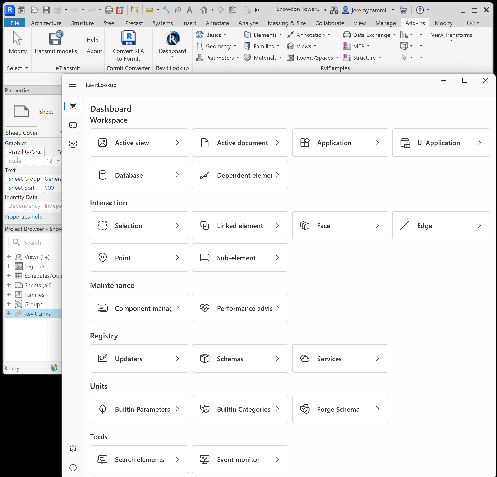
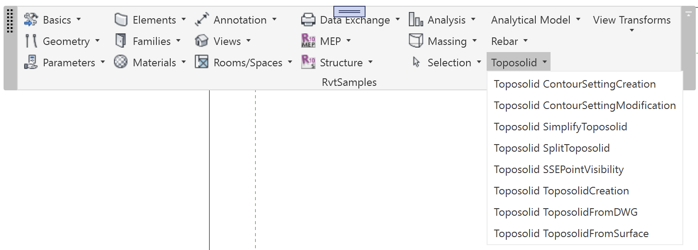

<head>
<meta http-equiv="Content-Type" content="text/html; charset=utf-8">
<link rel="stylesheet" type="text/css" href="bc.css">

</head>

<!---

- /Users/jta/Pictures/2023/2023-04-26_nice_aps_accelerator/

- RevitLookup release 2024.0.4, and support for previous Revit versions
  Links to the most recent RevitLookup versions for each Revit version are listed here:
  https://github.com/jeremytammik/RevitLookup/wiki/Versions

- RvtSamples 2024
  Y:\a\rvt\rvt_2024_empty.rvt

  rvtsamples2024.png

REVIT-206304 [Update RvtSamples.txt for Revit 2024 SDK]

https://github.com/jeremytammik/RevitSdkSamples/releases/tag/2024.0.0.3

Compiling the Revit 2023 SDK Samples
https://thebuildingcoder.typepad.com/blog/2022/04/compiling-the-revit-2023-sdk-samples.html

Set Up RvtSamples
https://thebuildingcoder.typepad.com/blog/2022/04/compiling-the-revit-2023-sdk-samples.html#7

C:\Users\jta\AppData\Roaming\Autodesk\Revit\Addins\2024>
copy Y:\a\src\rvt\RevitSdkSamples\SDK\Samples\RvtSamples\CS\RvtSamples.txt
copy Y:\a\src\rvt\RevitSdkSamples\SDK\Samples\RvtSamples\CS\RvtSamples.addin

DatumsModification

DatumAlignment
DatumPropagation
DatumStyleModification

ContextualAnalyticalModel

The SDK source code actually implements the following 21 ContextualAnalyticalModel external commands:

Use `grep "class.*IExternalCom" *cs`
AddAssociation
AddCustomAssociation
AnalyticalNodeConnStatus
CreateAnalyticalPanel
CreateAnalyticalCurvedPanel
CreateAnalyticalMember
CreateAreaLoadWithRefPoint
CreateCustomAreaLoad
CreateCustomLineLoad
CreateCustomPointLoad
FlipAnalyticalMember
MemberForcesAnalyticalMember
ModifyPanelContour
MoveAnalyticalMemberUsingElementTransformUtils
MoveAnalyticalMemberUsingSetCurve
MoveAnalyticalNodeUsingElementTransformUtils
MoveAnalyticalPanelUsingElementTransformUtils
MoveAnalyticalPanelUsingSketchEditScope
ReleaseConditionsAnalyticalMember
RemoveAssociation
SetOuterContourForPanels

These are the ContextualAnalyticalModel external commands listed in RvtSamples.txt:

Use `grep "^ContextualAnalyticalModel" RvtSamples.txt | sort`
ContextualAnalyticalModel.AddRelation
ContextualAnalyticalModel.AnalyticalNodeConnStatus
ContextualAnalyticalModel.BreakRelation
ContextualAnalyticalModel.CreateAnalyticalCurvedPanel
ContextualAnalyticalModel.CreateAnalyticalMember
ContextualAnalyticalModel.CreateAnalyticalPanel
ContextualAnalyticalModel.FlipAnalyticalMember
ContextualAnalyticalModel.MemberForcesAnalyticalMember
ContextualAnalyticalModel.ModifyPanelContour
ContextualAnalyticalModel.MoveAnalyticalMemberUsingElementTransformUtils
ContextualAnalyticalModel.MoveAnalyticalMemberUsingSetCurve
ContextualAnalyticalModel.MoveAnalyticalNodeUsingElementTransformUtils
ContextualAnalyticalModel.MoveAnalyticalPanelUsingElementTransformUtils
ContextualAnalyticalModel.MoveAnalyticalPanelUsingSketchEditScope
ContextualAnalyticalModel.ReleaseConditionsAnalyticalMember
ContextualAnalyticalModel.SetOuterContourForPanels
ContextualAnalyticalModel.UpdateRelation

RvtSamples: The name already exists in pulldown:Infrastructure alignments

Infrastructure Alignment Station Label
Infrastructure Alignment Properties

The Toposolid sample only has one entry in RvtSamples.txt specifying an external command named

- Revit.SDK.Samples.Toposolid.CS.Command

This command does not exist. Instead, the sample implements the following external commands:

ToposolidCreation
ToposolidFromDWG
ContourSettingCreation
ContourSettingModification
ToposolidFromSurface
SSEPointVisibility
SplitToposolid
SimplifyToposolid

[Window Title]
RvtSamples - RvtSamples

[Main Instruction]
Assembly 'Y:\a\src\rvt\RevitSdkSamples\SDK\Samples\PhaseSample\VB.NET\bin\Debug\PhaseSample.dll' specified in line 175 of RvtSamples.txt not found

[OK]

[Window Title]
RvtSamples - RvtSamples

[Main Instruction]
Exception 'Could not load file or assembly 'file:///Y:\a\src\rvt\RevitSdkSamples\SDK\Samples\PhaseSample\VB.NET\bin\Debug\PhaseSample.dll' or one of its dependencies. The system cannot find the file specified.'
testing assembly 'Y:\a\src\rvt\RevitSdkSamples\SDK\Samples\PhaseSample\VB.NET\bin\Debug\PhaseSample.dll'
specified in line 175 of RvtSamples.txt

[OK]

[Window Title]
RvtSamples - RvtSamples

[Main Instruction]
Assembly 'Y:\a\src\rvt\RevitSdkSamples\SDK\Samples\DesignOptionReader\VB.NET\bin\Debug\DesignOptionReader.dll' specified in line 203 of RvtSamples.txt not found

[OK]

\\VB.NET\\bin\\Debug\\

\\VB.NET\\bin\\

[Window Title]
RvtSamples - RvtSamples

[Main Instruction]
External command class Revit.SDK.Samples.DatumsModification.CS.Command in assembly 'Y:\a\src\rvt\RevitSdkSamples\SDK\Samples\DatumsModification\CS\bin\Debug\DatumsModification.dll' specified in line 371 of RvtSamples.txt not found

[OK]

[Window Title]
RvtSamples - RvtSamples

[Main Instruction]
External command class Revit.SDK.Samples.Toposolid.CS.Command in assembly 'Y:\a\src\rvt\RevitSdkSamples\SDK\Samples\Toposolid\CS\bin\Debug\Toposolid.dll' specified in line 490 of RvtSamples.txt not found

[OK]

[Window Title]
RvtSamples - RvtSamples

[Main Instruction]
External command class ContextualAnalyticalModel.AddRelation in assembly 'Y:\a\src\rvt\RevitSdkSamples\SDK\Samples\ContextualAnalyticalModel\CS\bin\Debug\ContextualAnalyticalModel.dll' specified in line 532 of RvtSamples.txt not found

[OK]

[Window Title]
RvtSamples - RvtSamples

[Main Instruction]
External command class ContextualAnalyticalModel.UpdateRelation in assembly 'Y:\a\src\rvt\RevitSdkSamples\SDK\Samples\ContextualAnalyticalModel\CS\bin\Debug\ContextualAnalyticalModel.dll' specified in line 539 of RvtSamples.txt not found

[OK]

[Window Title]
RvtSamples - RvtSamples

[Main Instruction]
External command class ContextualAnalyticalModel.BreakRelation in assembly 'Y:\a\src\rvt\RevitSdkSamples\SDK\Samples\ContextualAnalyticalModel\CS\bin\Debug\ContextualAnalyticalModel.dll' specified in line 546 of RvtSamples.txt not found

[OK]

[Window Title]
RvtSamples - RvtSamples

[Main Instruction]
Assembly 'Y:\a\src\rvt\RevitSdkSamples\SDK\Samples\Viewers\ElementViewer\VB.NET\bin\ElementViewer.dll' specified in line 1008 of RvtSamples.txt not found

[OK]

[Window Title]
RvtSamples - RvtSamples

[Main Instruction]
Exception 'Could not load file or assembly 'file:///Y:\a\src\rvt\RevitSdkSamples\SDK\Samples\Viewers\ElementViewer\VB.NET\bin\ElementViewer.dll' or one of its dependencies. The system cannot find the file specified.'
testing assembly 'Y:\a\src\rvt\RevitSdkSamples\SDK\Samples\Viewers\ElementViewer\VB.NET\bin\ElementViewer.dll'
specified in line 1008 of RvtSamples.txt

[OK]

[Window Title]
RvtSamples - RvtSamples

[Main Instruction]
Assembly 'Y:\a\src\rvt\RevitSdkSamples\SDK\Samples\CreateShared\VB.NET\bin\CreateShared.dll' specified in line 1316 of RvtSamples.txt not found

[OK]

[Window Title]
RvtSamples - RvtSamples

[Main Instruction]
Exception 'Could not load file or assembly 'file:///Y:\a\src\rvt\RevitSdkSamples\SDK\Samples\CreateShared\VB.NET\bin\CreateShared.dll' or one of its dependencies. The system cannot find the file specified.'
testing assembly 'Y:\a\src\rvt\RevitSdkSamples\SDK\Samples\CreateShared\VB.NET\bin\CreateShared.dll'
specified in line 1316 of RvtSamples.txt

[OK]

-----
[Window Title]
RvtSamples - RvtSamples

[Main Instruction]
External command class Revit.SDK.Samples.Toposolid.CS.Command in assembly 'Y:\a\src\rvt\RevitSdkSamples\SDK\Samples\Toposolid\CS\bin\Debug\Toposolid.dll' specified in line 504 of RvtSamples.txt not found

[OK]

[Window Title]
RvtSamples - RvtSamples

[Main Instruction]
Assembly 'Y:\a\src\rvt\RevitSdkSamples\SDK\Samples\Viewers\ElementViewer\VB.NET\bin\ElementViewer.dll' specified in line 1050 of RvtSamples.txt not found

[OK]

[Window Title]
RvtSamples - RvtSamples

[Main Instruction]
Exception 'Could not load file or assembly 'file:///Y:\a\src\rvt\RevitSdkSamples\SDK\Samples\Viewers\ElementViewer\VB.NET\bin\ElementViewer.dll' or one of its dependencies. The system cannot find the file specified.'
testing assembly 'Y:\a\src\rvt\RevitSdkSamples\SDK\Samples\Viewers\ElementViewer\VB.NET\bin\ElementViewer.dll'
specified in line 1050 of RvtSamples.txt

[OK]

[Window Title]
RvtSamples - RvtSamples

[Main Instruction]
Assembly 'Y:\a\src\rvt\RevitSdkSamples\SDK\Samples\CreateShared\VB.NET\bin\CreateShared.dll' specified in line 1358 of RvtSamples.txt not found

[OK]

[Window Title]
RvtSamples - RvtSamples

[Main Instruction]
Assembly 'Y:\a\src\rvt\RevitSdkSamples\SDK\Samples\CreateShared\VB.NET\bin\CreateShared.dll' specified in line 1365 of RvtSamples.txt not found

[OK]

[Window Title]
RvtSamples - RvtSamples

[Main Instruction]
The name already exists in pulldown:Infrastructure alignments
Parameter name: newItemName: n = 1862, k = 1862, lines[k] = eof

[OK]

-----

[Window Title]
RvtSamples - RvtSamples

[Main Instruction]
Assembly 'Y:\a\src\rvt\RevitSdkSamples\SDK\Samples\TestFloorThickness\VB.NET\bin\TestFloorThickness.dll' specified in line 1477 of RvtSamples.txt not found

[OK]

[Window Title]
RvtSamples - RvtSamples

[Main Instruction]
Assembly 'Y:\a\src\rvt\RevitSdkSamples\SDK\Samples\TestWallThickness\VB.NET\bin\TestWallThickness.dll' specified in line 1484 of RvtSamples.txt not found

[OK]

[Window Title]
RvtSamples - RvtSamples

[Main Instruction]
The name already exists in pulldown:Create Analytical Member
Parameter name: newItemName: n = 1911, k = 1911, lines[k] = eof

[OK]

-------

[Window Title]
RvtSamples - RvtSamples

[Main Instruction]
The name already exists in pulldown:Datumplane modification
Parameter name: newItemName: n = 1911, k = 1911, lines[k] = eof

[OK]

-----

[Window Title]
RvtSamples - RvtSamples

[Main Instruction]
The name already exists in pulldown:Toposolid API Samples
Parameter name: newItemName: n = 1911, k = 1911, lines[k] = eof

[OK]

---------------------------------------------

- generating (and consuming) huge amounts of element ids?
  https://forums.autodesk.com/t5/revit-api-forum/draw-line-visible-on-screen/m-p/11922998
  https://autodesk.slack.com/archives/C0SR6NAP8/p1682512568340939

twitter:

Configuring RvtSamples 2024, DatumsModification, ContextualAnalyticalModel, Infrastructure alignments, Toposolid samples and consuming huge numbers of element ids in the @AutodeskRevit #RevitAPI #BIM @DynamoBIM @AutodeskAPS https://autode.sk/rvtsamples2024

Configuring RvtSamples 2024
&ndash; DatumsModification
&ndash; ContextualAnalyticalModel
&ndash; Infrastructure Alignments
&ndash; Toposolid
&ndash; Conclusion
&ndash; Consuming huge numbers of element ids...

linkedin:

Configuring RvtSamples 2024 and consuming huge numbers of element ids in the #RevitAPI

https://autode.sk/rvtsamples2024

- Configuring RvtSamples 2024
- DatumsModification
- ContextualAnalyticalModel
- Infrastructure Alignments
- Toposolid
- Conclusion
- Consuming huge numbers of element ids...

#BIM #DynamoBIM #AutodeskAPS #Revit #API #IFC #SDK #Autodesk #AEC #adsk

the [Revit API discussion forum](http://forums.autodesk.com/t5/revit-api-forum/bd-p/160) thread

-->

### Configuring RvtSamples 2024 and Big Numbers

I left the Nice APS accelerator [APS cloud accelerator](https://aps.autodesk.com/accelerator-program) and
am returning to Switzerland, using the long train ride time to continue my Revit 2024 migration process,
now addressing the RvtSamples external application ad-in:

- [Configuring RvtSamples 2024](#3)
    - [DatumsModification](#4)
    - [ContextualAnalyticalModel](#5)
    - [Infrastructure Alignments](#6)
    - [Toposolid](#7)
    - [Conclusion](#8)
- [Consuming huge numbers of element ids](#9)

<!--

By the way, we also have a new release of RevtLookup to celebrate, including some minor fixes:

#### RevitLookup 2024.0.4

Roman [Nice3point](https://github.com/Nice3point) published another update,
[RevitLookup 2024.0.4](https://github.com/jeremytammik/RevitLookup/releases/tag/2024.0.4):

Improvements include:

- Added Workset support
- Added WorksetTable support
- Added Document.GetUnusedElements support
- Fixed Dashboard window startup location

Pixel Height: 2,014
Pixel Width: 2,096

-->

#### Configuring RvtSamples 2024

Now that I completed installing Revit 2024,
[successfully compiled the Revit 2024 SDK samples](https://thebuildingcoder.typepad.com/blog/2023/04/nice-accelerator-and-compiling-the-revit-2024-sdk.html)
and updated the [RevitSdkSamples repository](https://github.com/jeremytammik/RevitSdkSamples),
the time is ripe to configure the RvtSamples external application to load all 246 Revit 2024 SDK sample external commands.
Yes, 246 of them.
Pretty hard to manage one by one.

Mainly, this consists of editing RvtSamples.txt, the input text file specifying the name and location of the commands and the .NET assembly DLLs implementing them.

Here is an overview of (most of) the history of RvtSamples, including its initial implementation and similar migration efforts in the past:

- [Loading SDK Samples](https://thebuildingcoder.typepad.com/blog/2008/09/loading-sdk-sam.html)
- [Adding <code>&#35;include</code> functionality](https://thebuildingcoder.typepad.com/blog/2008/11/loading-the-building-coder-samples.html)
- [RvtSamples Conversion from 2009 to 2010](http://thebuildingcoder.typepad.com/blog/2009/05/porting-the-building-coder-samples.html)
- [Debugging with Visual Studio 2010 and RvtSamples](http://thebuildingcoder.typepad.com/blog/2010/04/debugging-with-visual-studio-2010-and-rvtsamples.html)
- [Migrating the Building Coder Samples to Revit 2012](http://thebuildingcoder.typepad.com/blog/2011/04/migrating-the-building-coder-samples-to-revit-2012.html)
- [Compiling the Revit 2014 SDK](http://thebuildingcoder.typepad.com/blog/2013/04/compiling-the-revit-2014-sdk.html)
- [Compiling the Revit 2015 SDK and Migrating Bc Samples](http://thebuildingcoder.typepad.com/blog/2014/04/compiling-the-revit-2015-sdk-and-migrating-bc-samples.html)
- [Migrating The Building Coder Samples to Revit 2016](http://thebuildingcoder.typepad.com/blog/2015/05/migrating-the-building-coder-samples-to-revit-2016.html)
- [RvtSamples for Revit 2017](http://thebuildingcoder.typepad.com/blog/2016/04/rvtsamples-for-revit-2017.html)
- [The Building Coder Samples 2017](http://thebuildingcoder.typepad.com/blog/2016/05/the-building-coder-samples-2017.html)
- [RvtSamples for Revit 2018](http://thebuildingcoder.typepad.com/blog/2017/05/sdk-update-rvtsamples-and-modifying-grid-end-point.html)
- [RvtSamples 2019](http://thebuildingcoder.typepad.com/blog/2018/04/rvtsamples-2019.html)
- [RvtSamples 2019 Update](http://thebuildingcoder.typepad.com/blog/2018/05/installing-the-revit-2019-sdk-april-update.html)
- [RvtSamples 2020](https://thebuildingcoder.typepad.com/blog/2019/04/the-revit-2020-fcs-api-and-sdk.html)
- [Close Doc and Zero Doc RvtSamples](https://thebuildingcoder.typepad.com/blog/2019/04/close-doc-and-zero-doc-rvtsamples.html)
- [RvtSamples 2020.1](https://thebuildingcoder.typepad.com/blog/2019/09/whats-new-in-the-revit-20201-api.html#4)
- [Setting up RvtSamples for Revit 2021](https://thebuildingcoder.typepad.com/blog/2020/05/setting-up-rvtsamples-for-revit-2021.html)
- [Revit 2022 SDK and The Building Coder Samples](https://thebuildingcoder.typepad.com/blog/2021/04/revit-2022-sdk-and-the-building-coder-samples.html)
- [Compiling the Revit 2023 SDK Samples](https://thebuildingcoder.typepad.com/blog/2022/04/compiling-the-revit-2023-sdk-samples.html)

<!--

C:\Users\jta\AppData\Roaming\Autodesk\Revit\Addins\2024
copy Y:\a\src\rvt\RevitSdkSamples\SDK\Samples\RvtSamples\CS\RvtSamples.txt
copy Y:\a\src\rvt\RevitSdkSamples\SDK\Samples\RvtSamples\CS\RvtSamples.addin

-->

I already described how to handle some of the errors encountered in previous migration cycles listed above.

Here is an overview of the problematic add-ins this time around:

#### DatumsModification

Correct list of external commands for the DatumsModification add-in:

- DatumAlignment
- DatumPropagation
- DatumStyleModification

#### ContextualAnalyticalModel

The SDK source code implements the following 21 ContextualAnalyticalModel external commands:

- Use `grep "class.*IExternalCom" *cs`
- AddAssociation
- AddCustomAssociation
- AnalyticalNodeConnStatus
- CreateAnalyticalPanel
- CreateAnalyticalCurvedPanel
- CreateAnalyticalMember
- CreateAreaLoadWithRefPoint
- CreateCustomAreaLoad
- CreateCustomLineLoad
- CreateCustomPointLoad
- FlipAnalyticalMember
- MemberForcesAnalyticalMember
- ModifyPanelContour
- MoveAnalyticalMemberUsingElementTransformUtils
- MoveAnalyticalMemberUsingSetCurve
- MoveAnalyticalNodeUsingElementTransformUtils
- MoveAnalyticalPanelUsingElementTransformUtils
- MoveAnalyticalPanelUsingSketchEditScope
- ReleaseConditionsAnalyticalMember
- RemoveAssociation
- SetOuterContourForPanels

These are the ContextualAnalyticalModel external commands listed in RvtSamples.txt:

- Use `grep "^ContextualAnalyticalModel" RvtSamples.txt | sort`
- AddRelation
- AnalyticalNodeConnStatus
- BreakRelation
- CreateAnalyticalCurvedPanel
- CreateAnalyticalMember
- CreateAnalyticalPanel
- FlipAnalyticalMember
- MemberForcesAnalyticalMember
- ModifyPanelContour
- MoveAnalyticalMemberUsingElementTransformUtils
- MoveAnalyticalMemberUsingSetCurve
- MoveAnalyticalNodeUsingElementTransformUtils
- MoveAnalyticalPanelUsingElementTransformUtils
- MoveAnalyticalPanelUsingSketchEditScope
- ReleaseConditionsAnalyticalMember
- SetOuterContourForPanels
- UpdateRelation

#### Infrastructure Alignments

- Infrastructure Alignment Station Label
- Infrastructure Alignment Properties

#### Toposolid

The Toposolid sample only has one entry in RvtSamples.txt specifying an external command named:

- Revit.SDK.Samples.Toposolid.CS.Command

This command does not exist.
Instead, the sample implements the following external commands:

- ToposolidCreation
- ToposolidFromDWG
- ContourSettingCreation
- ContourSettingModification
- ToposolidFromSurface
- SSEPointVisibility
- SplitToposolid
- SimplifyToposolid

#### Conclusion

This time around, I submitted a ticket with the development team in the hope of avoiding having to repeat this entire process for the next SDK update:

- REVIT-206304 &ndash; Update RvtSamples.txt for Revit 2024 SDK

Some of the menus generated by RvtSamples had too many entries to display them all on my screen, so I modified the sorting and added two new groups for `Analytical Model` and `Toposolid`.

 <!-- Pixel Height: 562 Pixel Width: 1,562 -->

My current running version of RvtSamples is captured
in [RevitSdkSamples release 2024.0.0.3](https://github.com/jeremytammik/RevitSdkSamples/releases/tag/2024.0.0.3).

#### Consuming Huge Numbers of Element Ids

The [Revit API discussion forum](http://forums.autodesk.com/t5/revit-api-forum/bd-p/160) thread
on how to [draw a line visible on screen](https://forums.autodesk.com/t5/revit-api-forum/draw-line-visible-on-screen/m-p/11922998) spawned
several useful ideas on how to generate and display transient graphics for rubber banding functionality similar to AutoCAD jigs.

It also raised the question of generating (and consuming) huge amounts of element ids, since each transient element in a loop consumes a new element id, even if the transaction is never commited.
Luckily, Revit 2024 [upgraded `ElementId` storage to 64-bit](https://thebuildingcoder.typepad.com/blog/2023/04/whats-new-in-the-revit-2024-api.html#4.1.2).

Anyway, that question led to the following amusing discussion:

- An interesting question was raised in the discussion on drawing transient geometry: if I create a new element in a transaction that is rolled back (not committed) and wrap that in a loop, a new element id is consumed in each iteration. That can consume all of the element ids space if I run it for long enough. How should this be handled, please?
- This is a non-issue in Revit 2024.+. Element id is now 64 bit.
- That does not make it a non-issue. It just means it takes a million or a billion time more time to consume all the possible tokens. Is that a real solution?
- `LLONG_MAX` is 9,223,372,036,854,775,807. We won't need to worry about it.
Should the next element id field in document be rolled back on transaction rollback is an independent issue though.
Another independent issue is should the editor rubber banding reuse the same element ids on every iteration?
- Well, if I rubber band a line in a loop and create a new element id for every iteration, and assuming an extremely slow loop running 100 iterations per second, I will end up using 100*60*60*24*365 = 3.153.600.000 element ids in one year of rubber banding... that is not a completely insignificant number...
- Jeremy, is that three trillion?
- It's three thousand million. I don't know the exact definition of a trillion, but it's a big number :-)
- Ok. the new Element id max is 9 quintillion. Dividing 9 quintillion by your number gives me 3 million, which would be the number of years required for your example to run through the ElementId space. That's why we've asserted that the 64-bit ids are unlikely to run out any time soon.
- To do another example, if we had an operation running 24/7 which generated 1 million new ids per second:
    - 1,000,000 * 60 * 60 * 24 * 365 = 3.1536e+13
    - 9,223,372,036,854,775,807 / 3.1536e+13 = 292471 (plus a fraction)
    - which is just a wild number of years.
- It is worth noting that we tried doing this and estimated that it would take days to even get to the end of the 32-bit space by creating the simple transient elements. It would therefore take on the order 2^31 days to run out of 64-bit ids.
  So, to confirm what is said above, it would take an extremely long time to run out of the newly extended elementid space
- To pick up on the 3 million years mentioned above: Revit will survive 3 million years, but the rubber bands will surely lose some elasticity.
- Can I just say all of you are awesome and this conversation makes me so happy I work here &nbsp; :-)

For some related facts, consult the illuminating ten-minute video by Numberphile explaining [what is a billion?](https://youtu.be/C-52AI_ojyQ).
