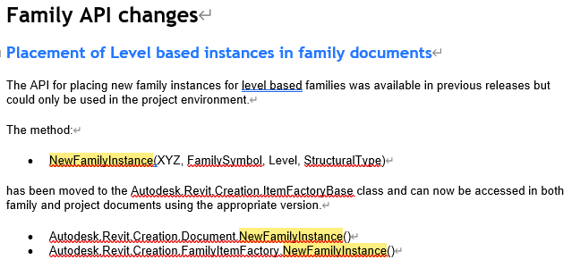

<head>
<meta http-equiv="Content-Type" content="text/html; charset=utf-8">
<link rel="stylesheet" type="text/css" href="bc.css">

</head>

<!---

- Dark Theme Icons - a couple of hacks
  https://forums.autodesk.com/t5/revit-api-forum/dark-theme-icons-a-couple-of-hacks/m-p/11935167

- Getting the wrong NewFamilyInstance override
  https://forums.autodesk.com/t5/revit-api-forum/getting-the-wrong-newfamilyinstance-override/m-p/11936658
  explanation and solution by Kennan Chan using Reflection or the C# `dynamic` keyword

- A Completely Non-Technical Explanation of AI and Deep Learning
  https://www.parand.com/a-completely-non-technical-explanation-of-ai.html

- Scientists Use GPT AI to Passively Read People's Thoughts in Breakthrough
  https://www.vice.com/en/article/4a3w3g/scientists-use-gpt-ai-to-passively-read-peoples-thoughts-in-breakthrough
  AI model combined with fMRI reading non-invasively decodes continuous language from subjects

- AI emergent abilities may not be emergent after all
  Are Emergent Abilities of Large Language Models a Mirage?
  https://arxiv.org/abs/2304.15004
  > Figure 2: Emergent abilities of large language models are creations of the researcher’s analyses, not fundamental changes in model outputs with scale

twitter:

AI acceleration, new NewFamilyInstance method and dark icons for Revit 2024 add-ins with ImageMagick in the @AutodeskRevit #RevitAPI #BIM @DynamoBIM @AutodeskAPS https://autode.sk/darkicon

Hacks for dark icons supporting Revit 2024 theme switching and news from the ever-accelerating AI revolution
&ndash; Dark theme icons by ImageMagick
&ndash; Embed dark theme icon name in <code>BitMapSource</code>
&ndash; New <code>NewFamilyInstance</code> overload
&ndash; Open-source AI surging ahead
&ndash; Timeline of major milestones crossed
&ndash; Non-technical explanation of AI and deep learning
&ndash; Using AI to read your thoughts
&ndash; AI emergent abilities may not be emergent after all
&ndash; Risk of AI manipulation...

linkedin:

AI acceleration, new NewFamilyInstance method and dark icons for Revit 2024 add-ins with ImageMagick in the #RevitAPI

https://autode.sk/darkicon

Hacks for dark icons supporting Revit 2024 theme switching and news from the ever-accelerating AI revolution:

- Dark theme icons by ImageMagick
- Embed dark theme icon name in <code>BitMapSource</code>
- New <code>NewFamilyInstance</code> overload
- Open-source AI surging ahead
- Timeline of major milestones crossed
- Non-technical explanation of AI and deep learning
- Using AI to read your thoughts
- AI emergent abilities may not be emergent after all
- Risk of AI manipulation...

#BIM #DynamoBIM #AutodeskAPS #Revit #API #IFC #SDK #Autodesk #AEC #adsk

the [Revit API discussion forum](http://forums.autodesk.com/t5/revit-api-forum/bd-p/160) thread

-->

### Dark Icons, NewFamilyInstance and AI News

Revit 2024 brought us theme switching functionality requiring new icons, and a new `NewFamilyInstance` overload;
meanwhile, the AI revolution acceleration continues growing:

- [Dark theme icons](#2)
    - [Hack 1 &ndash; dark icons by ImageMagick](#2.1)
    - [Hack 2 &ndash; embed name in `BitMapSource`](#2.2)
- [New `NewFamilyInstance` overload](#3)
- [Open-source AI surging ahead](#4)
    - [Timeline of major milestones crossed](#4.1)
- [Non-technical explanation of AI and deep learning](#5)
- [Using AI to read your thoughts](#6)
- [AI emergent abilities may not be emergent after all](#7)
- [Risk of AI manipulation](#8)

#### Dark Theme Icons

Matthew Taylor, associate and CAD developer at [WSP](https://www.wsp.com) shared
two [dark theme icon hacks](https://forums.autodesk.com/t5/revit-api-forum/dark-theme-icons-a-couple-of-hacks/m-p/11935167),
useful time- and labour-saving tips and tricks to support
the [dark theme in Revit 2024](https://thebuildingcoder.typepad.com/blog/2023/01/dark-theme-possibility-looming.html).
The new API functionality to support theme switching is listed in
the [Revit API news section on UI API additions](https://thebuildingcoder.typepad.com/blog/2023/04/whats-new-in-the-revit-2024-api.html#4.2.25).
Says Matt:

#### Hack 1 &ndash; Dark Icons by ImageMagick

I've long used .bmp files as my raw ribbon icon images.

I take those .bmp files and create .png files using a program called [ImageMagick](https://imagemagick.org) &ndash; I'm not affiliated).

Once installed, you may use it in batch scripts etc.:

- [Anatomy of the Command-line](https://imagemagick.org/script/command-line-processing.php)
- [Annotated List of Command-line Options](https://imagemagick.org/script/command-line-options.php)

This is what I used in Revit 2023:

<pre class="prettyprint">
rem For each .bmp file in this folder,
rem   convert the white pixels to transparent,
rem   and save the result to .png.
for %%f in (*.bmp) do ( convert -transparent white %%f %%~nf.png)
</pre>

Then, with Revit 2024, the dark theme came along!

This is what I ended up with, in addition to the above:

<pre class="prettyprint">
rem For each .bmp file in this folder,
rem   invert the grayscale pixels only (white-&gt;black,
rem   lightgray-&gt;darkgray, darkgray-&gt;lightgray,
rem   black-&gt;white etc.)
rem   convert the black pixels to transparent,
rem   add 30 to each R,G,B value (necessary as our dark
rem   mode is not black - this is an arbitrary value to
rem   lighten the overall image),
rem   and save the result to _dark.png.
for %%f in (*.bmp) do ( convert +negate -transparent black -colorize 30,30,30  %%f %%~nf_dark.png)
</pre>

This system works well with grayscale icons and icons that already used a similar colour scheme to native Revit.

I imagine it's possible to use the -scale switch to create 16x16 icons from 32x32 icons, but I've not tested that.

I imagine it's also possible to add badges (from the zip in Jeremy's post) to images using something like this:
[Add an image on top of existing one with ImageMagick command line](https://stackoverflow.com/questions/11095007/add-an-image-on-top-of-existing-one-with-imagemagick-command-line).

#### Hack 2 &ndash; Embed Name in BitMapSource

Another issue I had was that I was using icons as embedded resources.

I couldn't work out how to get the name of the icon from the ribbon item `Image` or `LargeImage` property in order to get the dark or light equivalent. (I was changing the icons in the ThemeChanged event.)
I worked out I could embed the name within the `BitMapSource` when initially adding the image:

<pre class="prettyprint">
Private Shared Function GetEmbeddedImage(ByVal assembly As Assembly, ByVal imageFullName As String) As BitmapSource
  If Not String.IsNullOrEmpty(imageFullName) Then
      Dim s As IO.Stream = assembly.GetManifestResourceStream(imageFullName)
      If s IsNot Nothing Then
          Dim bitmap As BitmapSource = BitmapFrame.Create(s)
          Dim metadata As BitmapMetadata = New BitmapMetadata("png")
          metadata.SetQuery("/iTXt/Keyword", imageFullName.ToCharArray())
          Dim bitmapWithMetadata As BitmapSource = BitmapFrame.Create(bitmap, Nothing, metadata, Nothing)
          Return bitmapWithMetadata
      End If
  End If
  Return Nothing
End Function
</pre>

I could then retrieve that name:

<pre class="prettyprint">
Dim ribbonItem as RibbonItem...
Dim bitmapSource As BitmapSource = CType(ribbonItem.Image, BitmapSource)
Dim metadata As BitmapMetadata = CType(bitmapSource.Metadata, BitmapMetadata)
If metadata IsNot Nothing Then
   Dim existingValue As Object = metadata.GetQuery("/iTXt/Keyword")
   Dim imageName As String = TryCast(existingValue, String)
   'Use image name to get an embedded resource and set it to the ribbon item image.
End If
</pre>

I hope this saves some of you a bit of time and effort.

Many thanks to Matt for these valuable work- and time-savers!

#### New NewFamilyInstance Overload

Kennan Chen provided a very clear explanation and solution
for [getting the wrong `NewFamilyInstance` override](https://forums.autodesk.com/t5/revit-api-forum/getting-the-wrong-newfamilyinstance-override/m-p/11936658) using
.NET Reflection or the C# `dynamic` keyword. In short:

In Revit 2024, the method you are using is defined in the `Autodesk.Revit.Creation.ItemFactoryBase` class and the `Autodesk.Revit.Creation.Document` class just inherits it.
This means that `ItemFactoryBase.NewFamilyInstance` is invoked underneath by the C# compiler generated code.

 <!-- Pixel Height: 300 Pixel Width: 639 -->

In previous versions of Revit, the "same" method is defined directly in `Autodesk.Revit.Creation.Document` class.

The Revit API news highlights this change in the section
[1.4.1. Placement of Level based instances in family documents](https://thebuildingcoder.typepad.com/blog/2023/04/whats-new-in-the-revit-2024-api.html#4.1.4.1).

The use of the method looks the same, but they result in different compiled code when linked with different releases of RevitAPI.dll, which means the DLL compiled against Revit 2024 cannot be used in Revit 2023 if you use this method.

This is an API compatibility issue. The standard solution is to build different Revit add-in DLLs targeting the different versions of Revit.

For full details of this discussion, please refer to the original discussion thread
on [getting the wrong `NewFamilyInstance` override](https://forums.autodesk.com/t5/revit-api-forum/getting-the-wrong-newfamilyinstance-override/m-p/11936658).

Many thanks to Kennan for his research and explanation!

#### Open-Source AI Surging Ahead

A purportedly leaked document titled [Google "We Have No Moat, And Neither Does OpenAI"](https://www.semianalysis.com/p/google-we-have-no-moat-and-neither) highlights the impressive acceleration of AI research success in the past month:

> I’m talking, of course, about open source. Plainly put, they are lapping us. Things we consider “major open problems” are solved and in people’s hands today. Just to name a few:

#### Timeline of Major Milestones Crossed

- Feb 24, 2023 &ndash; LLaMA is Launched
- March 3, 2023 &ndash; LLaMA public
- March 12, 2023 &ndash; Language models on a Raspberry Pi
- March 13, 2023 &ndash; Fine Tuning on a Laptop
- March 18, 2023 &ndash; Now It’s Fast on CPU, No GPU
- March 19, 2023 &ndash; A 13B model achieves “parity” with Bard
- March 25, 2023 &ndash; Choose Your Own Model
- March 28, 2023 &ndash; Open Source GPT-3
- March 28, 2023 &ndash; Multimodal Training in One Hour
- April 3, 2023 &ndash; Real Humans Can’t Tell the Difference Between a 13B Open Model and ChatGPT
- April 15, 2023 &ndash; Open Source RLHF at ChatGPT Levels

#### Non-Technical Explanation of AI and Deep Learning

For a newbie to get a quick feel for some of the basic topics involved in the current LLM revolution,
here is [a completely non-technical explanation of AI and deep learning](https://www.parand.com/a-completely-non-technical-explanation-of-ai.html).

#### Using AI to Read Your Thoughts

Connecting AI with our human brain holds both very scary and very promising potential.
Now, [scientists can use GPT AI to passively read people's thoughts](https://www.vice.com/en/article/4a3w3g/scientists-use-gpt-ai-to-passively-read-peoples-thoughts-in-breakthrough):

> AI model combined with fMRI reading non-invasively decodes continuous language from subjects

#### AI Emergent Abilities May Not Be Emergent After All

In March, scientists were surprised comparing ChatGPT using GPT 3.5 with some greater capabilities exhibited by GPT 4,
hypothesising [sparks of artificial general intelligence in the LLM](https://thebuildingcoder.typepad.com/blog/2023/03/uv-emergence-fuzz-and-the-get_-prefix.html#9).

A more recent paper questions this, instead
asking [are emergent abilities of large language models a mirage?](https://arxiv.org/abs/2304.15004)

> Figure 2: Emergent abilities of large language models are creations of the researcher’s analyses, not fundamental changes in model outputs with scale

#### Risk of AI Manipulation

Among many others, [Yuval Noah Harari](https://en.wikipedia.org/wiki/Yuval_Noah_Harari) warned last year
that [humans will be "hacked" if artificial intelligence is not globally regulated](https://www.cbsnews.com/news/yuval-harari-sapiens-60-minutes-2021-10-29/) and
argues that [AI has hacked the operating system of human civilisation](https://www.linkedin.com/pulse/yuval-noah-harari-argues-ai-has-hacked-operating-system-harish/).

It is indisputable that we will all need to significantly sharpen our skills to critically evaluate all the input we receive.
Soon, it will be almost impossible to distinguish deep fake from reality.

That reminds me of Harari's last chapter
in [21 Lessons for the 21st Century](https://en.wikipedia.org/wiki/21_Lessons_for_the_21st_Century),
on meditation.
He shares his own very personal answer on how to reconnect with reality: retreat into myself and feel it through my own senses, cutting off myself for a while from all external input.
I love that book, as I mentioned discussing [generative AI and multi-modal learning](https://thebuildingcoder.typepad.com/blog/2023/02/back-to-basics-and-chatgpt.html#9) back in February this year.
Highly recommended.

