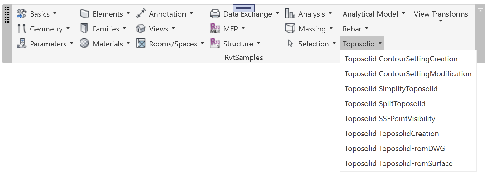

<head>
<meta http-equiv="Content-Type" content="text/html; charset=utf-8">
<link rel="stylesheet" type="text/css" href="bc.css">

</head>

<!---

- Dark Theme Icons - a couple of hacks
  https://forums.autodesk.com/t5/revit-api-forum/dark-theme-icons-a-couple-of-hacks/m-p/11935167

- external event needs to be kept alive via static member
  Revit 2024 rendering performance drops on selection

- Getting the wrong NewFamilyInstance override
  https://forums.autodesk.com/t5/revit-api-forum/getting-the-wrong-newfamilyinstance-override/m-p/11936658
  explanation and solution by Kennan Chan using Reflection or the C# `dynamic` keyword

- A Completely Non-Technical Explanation of AI and Deep Learning
  https://www.parand.com/a-completely-non-technical-explanation-of-ai.html

- Scientists Use GPT AI to Passively Read People's Thoughts in Breakthrough
  https://www.vice.com/en/article/4a3w3g/scientists-use-gpt-ai-to-passively-read-peoples-thoughts-in-breakthrough
  AI model combined with fMRI reading non-invasively decodes continuous language from subjects

- AI emergent abilities may not be emergent after all
  Are Emergent Abilities of Large Language Models a Mirage?
  https://arxiv.org/abs/2304.15004
  > Figure 2: Emergent abilities of large language models are creations of the researcher’s analyses, not fundamental changes in model outputs with scale

twitter:

 in the @AutodeskRevit #RevitAPI #BIM @DynamoBIM @AutodeskAPS

&ndash;
...

linkedin:

#BIM #DynamoBIM #AutodeskAPS #Revit #API #IFC #SDK #Autodesk #AEC #adsk

the [Revit API discussion forum](http://forums.autodesk.com/t5/revit-api-forum/bd-p/160) thread

-->

### Dark Icons and Event Lifetime

#### Dark Theme Icons

Matthew Taylor, associate and CAD developer at [WSP](https://www.wsp.com) shared
two [dark theme icon hacks](https://forums.autodesk.com/t5/revit-api-forum/dark-theme-icons-a-couple-of-hacks/m-p/11935167),
useful time- and labour-saving tips and tricks to support
the [dark theme](https://thebuildingcoder.typepad.com/blog/2023/01/dark-theme-possibility-looming.html)
in Revit 2024.
By the way, the new API functionality to support theme switching is listed in the Revit API news section
on [UI API additions](https://thebuildingcoder.typepad.com/blog/2023/04/whats-new-in-the-revit-2024-api.html#4.2.25).
Says Matt:

#### Hack 1 &ndash; Dark Icons by ImageMagick

I've long used .bmp files as my raw ribbon icon images.

I take those .bmp files and create .png files using a program called [ImageMagick](https://imagemagick.org) &ndash; I'm not affiliated).

Once installed, you may use it in batch scripts etc.:

- [Anatomy of the Command-line](https://imagemagick.org/script/command-line-processing.php)
- [Annotated List of Command-line Options](https://imagemagick.org/script/command-line-options.php)

This is what I used in Revit 2023:

<pre>
rem For each .bmp file in this folder,
rem   convert the white pixels to transparent,
rem   and save the result to .png.
for %%f in (*.bmp) do ( convert -transparent white %%f %%~nf.png)
</pre>

Then, with Revit 2024, the dark theme came along!

This is what I ended up with, in addition to the above:

<pre>
rem For each .bmp file in this folder,
rem   invert the grayscale pixels only (white-&gt;black,
rem   lightgray-&gt;darkgray, darkgray-&gt;lightgray,
rem   black-&gt;white etc.)
rem   convert the black pixels to transparent,
rem   add 30 to each R,G,B value (necessary as our dark
rem   mode is not black - this is an arbitrary value to
rem   lighten the overall image),
rem   and save the result to _dark.png.
for %%f in (*.bmp) do ( convert +negate -transparent black -colorize 30,30,30  %%f %%~nf_dark.png)
</pre>

This system works well with grayscale icons and icons that already used a similar colour scheme to native Revit.

I imagine it's possible to use the -scale switch to create 16x16 icons from 32x32 icons, but I've not tested that.

I imagine it's also possible to add badges (from the zip in Jeremy's post) to images using something like this:
[Add an image on top of existing one with ImageMagick command line](https://stackoverflow.com/questions/11095007/add-an-image-on-top-of-existing-one-with-imagemagick-command-line).

#### Hack 2 &ndash; Embed Name in BitMapSource

Another issue I had was that I was using icons as embedded resources.

I couldn't work out how to get the name of the icon from the ribbon item `Image` or `LargeImage` property in order to get the dark or light equivalent. (I was changing the icons in the ThemeChanged event.)
I worked out I could embed the name within the `BitMapSource` when initially adding the image:

<pre>
Private Shared Function GetEmbeddedImage(ByVal assembly As Assembly, ByVal imageFullName As String) As BitmapSource
  If Not String.IsNullOrEmpty(imageFullName) Then
      Dim s As IO.Stream = assembly.GetManifestResourceStream(imageFullName)
      If s IsNot Nothing Then
          Dim bitmap As BitmapSource = BitmapFrame.Create(s)
          Dim metadata As BitmapMetadata = New BitmapMetadata("png")
          metadata.SetQuery("/iTXt/Keyword", imageFullName.ToCharArray())
          Dim bitmapWithMetadata As BitmapSource = BitmapFrame.Create(bitmap, Nothing, metadata, Nothing)
          Return bitmapWithMetadata
      End If
  End If
  Return Nothing
End Function
</pre>

I could then retrieve that name:

<pre>
Dim ribbonItem as RibbonItem...
Dim bitmapSource As BitmapSource = CType(ribbonItem.Image, BitmapSource)
Dim metadata As BitmapMetadata = CType(bitmapSource.Metadata, BitmapMetadata)
If metadata IsNot Nothing Then
   Dim existingValue As Object = metadata.GetQuery("/iTXt/Keyword")
   Dim imageName As String = TryCast(existingValue, String)
   'Use image name to get an embedded resource and set it to the ribbon item image.
End If
</pre>

I hope this saves some of you a bit of time and effort.

Many thanks to Matt for these valuable work- and time-savers!

####

 <!-- Pixel Height: 562 Pixel Width: 1,562 -->

####
