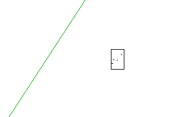
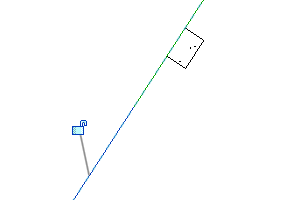

<head>
<meta http-equiv="Content-Type" content="text/html; charset=utf-8">
<link rel="stylesheet" type="text/css" href="bc.css">

</head>

<!---

- Electrical Wire not found in BoundingBoxIsInsideFilter
  https://forums.autodesk.com/t5/revit-api-forum/electrical-wire-not-found-in-boundingboxisinsidefilter/m-p/11938583
  ricaun created the BoundingBoxViewIntersectsFilter and BoundingBoxViewIsInsideFilter:
  https://gist.github.com/ricaun/14ec0730e7efb3cc737f2134475e2539

- https://forums.autodesk.com/t5/revit-api-forum/visualizing-circuits-in-3d/td-p/11937368

- align two elements:
  How to use the Alignment method for family Instance
  https://forums.autodesk.com/t5/revit-api-forum/how-to-use-the-alignment-method-using-for-family-instance/m-p/11938454

twitter:

 in the @AutodeskRevit #RevitAPI #BIM @DynamoBIM @AutodeskAPS

&ndash;
...

linkedin:

#BIM #DynamoBIM #AutodeskAPS #Revit #API #IFC #SDK #Autodesk #AEC #adsk

the [Revit API discussion forum](http://forums.autodesk.com/t5/revit-api-forum/bd-p/160) thread

-->

### Align an Instance and Find a Wire

####

<pre class="prettyprint">

</pre>

#### Visualizing Circuits in 3D

[Visualizing circuits in 3D](https://forums.autodesk.com/t5/revit-api-forum/visualizing-circuits-in-3d/td-p/11937368)

I'm trying to create a script that will help me better visualize circuits in 3D. Basically, you select one or more electrical panels, and temporary generic model lines will get drawn in between all the elements in each circuit on the panel. The problem is that a single circuit may have 10 or more receptacles, and I don't want a line going from the panelboard to each receptacle - I'd like to show them daisy-chained together like when you create a circuit. I set up a nearest-neighbor algorithm and a minimum spanning tree algorithm, but neither really matches the results that you'd see if you tab-select a circuit and add wiring. Here's my current implementation in pyRevit. I have attached screenshots of the results of each.

""" Visualize Connected Circuits

Author: Perry Lackowski
Tested: 2021.1
"""

import sys

from pyrevit import DB, forms, revit, script
from Autodesk.Revit.UI.Selection import ObjectType
from Autodesk.Revit.UI.Selection import ISelectionFilter

from enum import Enum
from rpw import ui

doc = revit.doc
uidoc = revit.uidoc
output = script.get_output()

selectable_categories = [
    int(DB.BuiltInCategory.OST_ElectricalEquipment),
    int(DB.BuiltInCategory.OST_ElectricalFixtures)
]

def UI_get_equipment():
    selected_equipment_ids = uidoc.Selection.GetElementIds()

    # If pre-selection, convert ids to elements, and remove anything that
    # isn't electrical equipment.
    if selected_equipment_ids:
        selected_equipment = [doc.GetElement(eId) for eId in selected_equipment_ids]
        selected_equipment = [x for x in selected_equipment if x.Category.Id.IntegerValue in selectable_categories]
        use_preselected_elements = forms.alert(msg='You currently have {} elements selected. Do you want to proceed with the currently selected item(s)?'.format(len(selected_equipment)),ok=False,yes=True, no=True)
        if use_preselected_elements:
            return selected_equipment

    # If post selection, use the Revit's PickObjects to select items.
    # selection_filter limits selection to electrical equipment.
    selection_filter = electrical_equipment_filter()
    try:
        selection_reference = uidoc.Selection.PickObjects(ObjectType.Element, selection_filter, 'Select Electrical Equipment to rename.')
    except:
        # if selection is aborted, it throws an exception...
        sys.exit()
    if not selection_reference:
        sys.exit()
    selected_equipment = [doc.GetElement(r.ElementId) for r in selection_reference]

    return selected_equipment

class electrical_equipment_filter(ISelectionFilter):
    def __init__(self):
        pass
    def AllowElement(self, element):
        if element.Category.Id.IntegerValue in selectable_categories:
            return True
        else:
            return False
    def AllowReference(self, element):
        return False

def get_parents_and_children(elem):
    parents_and_children = list(elem.MEPModel.GetElectricalSystems())

    children = list(elem.MEPModel.GetAssignedElectricalSystems())
    parents = []
    for es in parents_and_children:
        if es.Id not in [x.Id for x in children]:
            parents.append(es)

    # To get the corresponding elements from the circuit, you can typically use
    # circuit.Elements. However, if you're looking at the parent circuit, the
    # base element element will be the only item in this list. In parent
    # circuits, you'll want to look at the BaseEquipment property.

    return parents, children

class Colors(Enum):
    Red = DB.Color(255,0,0)
    Green = DB.Color(0,128,0)
    Blue = DB.Color(70,65,240)

def create_line(start, end):
    if start.DistanceTo(end) < 1:
         return False
    new_line = DB.Line.CreateBound(start,end)
    return new_line

def make_shape(lines, color):
    new_shape = DB.DirectShape.CreateElement(doc, DB.ElementId(DB.BuiltInCategory.OST_GenericModel))
    new_shape.SetShape(lines)

    graphic_settings = DB.OverrideGraphicSettings()
    graphic_settings.SetProjectionLineColor(color)
    graphic_settings.SetProjectionLineWeight(6)

    doc.ActiveView.SetElementOverrides(new_shape.Id, graphic_settings)

    return new_shape

def set_shape_params(shape, circuit_slot, circuit_name):
    shape.get_Parameter(DB.BuiltInParameter.ALL_MODEL_MARK).Set('pyRevit Electrical Circuit Visualization')
    shape.get_Parameter(DB.BuiltInParameter.ALL_MODEL_INSTANCE_COMMENTS).Set('{} - {}'.format(circuit_slot, circuit_name))

from itertools import izip, tee
def pairwise(iterable):
    "s -> (s0, s1), (s1, s2), (s2, s3), ..."
    a, b = tee(iterable)
    next(b, None)
    return izip(a, b)

# def minimum_spanning_tree(source, points):
#     # Create a set to keep track of visited points
#     visited = set()

#     # Initialize the source point
#     visited.add(source)

#     # Initialize the lines list
#     lines = []

#     # Loop until all points have been visited
#     while len(visited) < len(points) + 1:
#         # Find the closest unvisited point to the visited set
#         min_dist = float('inf')
#         min_point = None
#         for visited_point in visited:
#             for neighbor in points:
#                 if neighbor in visited:
#                     continue
#                 dist = visited_point.DistanceTo(neighbor)
#                 if dist < min_dist:
#                     min_dist = dist
#                     min_point = neighbor

#         # Add the closest point to the visited set and draw a line to it
#         visited.add(min_point)
#         new_line = create_line(min_point, visited_point)
#         lines.append(new_line)

#     return lines

def nearest_neighbor(source, points):
    unvisited = set(points)
    sorted_points = [source]
    while unvisited:
        closest = min(unvisited, key=lambda p: p.DistanceTo(sorted_points[-1]))
        sorted_points.append(closest)
        unvisited.remove(closest)
    lines = []
    for x, y in pairwise(sorted_points):
        line = create_line(x, y)
        lines.append(line)
    return lines

# def star_connect(source, points):
#     lines = []
#     for point in points:
#         line = create_line(source, point)
#         lines.append(line)
#     return lines

def visualize_circuits(equipment):
    equipment_origin = equipment.GetTransform().Origin
    parents, children = get_parents_and_children(equipment)
    new_shapes = []
    lines = []

    # First draw circuits for parents (upstream sources)
    for circuit in parents:
        circuit_slot = circuit.Name
        circuit_name = circuit.get_Parameter(DB.BuiltInParameter.RBS_ELEC_CIRCUIT_NAME).AsString()
        line = create_line(equipment_origin, circuit.BaseEquipment.GetTransform().Origin)
        if line:
            lines.append(line)
    if lines:
        shape = make_shape(lines, Colors.Red.value)
        set_shape_params(shape, circuit_slot, circuit_name)
        new_shapes.append(shape)
        print('Source Vector: {}'.format(output.linkify(shape.Id)))

    children = sorted(children, key=lambda x: x.Name)

    # Next draw circuits for children (downstream loads)
    for circuit in children:
        circuit_slot = circuit.Name
        circuit_name = circuit.get_Parameter(DB.BuiltInParameter.RBS_ELEC_CIRCUIT_NAME).AsString()
        if 'SPARE' in circuit_name or 'SPACE' in circuit_name:
            continue
        print('{} - {}'.format(circuit_slot, circuit_name))
        load_locations = [elem.GetTransform().Origin for elem in circuit.Elements]

        lines = nearest_neighbor(equipment_origin, load_locations)
        ## Two alternate algorithms for drawing lines:
        # lines = minimum_spanning_tree(equipment_origin, load_locations)
        # lines = star_connect(equipment_origin, load_locations)

        if lines:
            shape = make_shape(lines, Colors.Blue.value)
            set_shape_params(shape, circuit_slot, circuit_name)
            new_shapes.append(shape)
            print('Load Vector: {}'.format(output.linkify(shape.Id)))
    return new_shapes

selected_equipment = UI_get_equipment()
t = DB.Transaction(doc, "Visualize Electrical Equipment")
t.Start()
all_created_circuits = []

for equipment in selected_equipment:
    all_created_circuits.append(visualize_circuits(equipment))

if all_created_circuits:
    selection = ui.Selection()
    selection.clear()

    for shape in all_created_circuits:
        selection.add(shape)

    selection.update()
t.Commit()

pr_circuit_minimum_spanning_tree.png
pr_circuit_nearest_neighbour.png
pr_circuit_star_connected.png

Nearest Neighbor.png
Minimum Spanning Tree.png
Star Connected.png

jeremy.tammik
 Autodesk jeremy.tammik in reply to: PerryLackowski
‎2023-05-03 01:59 AM
Wow. Intimidating project, intimidating pictures, for me. Not knowing much whatsoever about the subject, the reality it is helps describe, and the use of the functionality you are aiming to implement, I would suggest taking a step back from Revit and model lines and ponder how to best display complex graph relationships, e.g.,

https://duckduckgo.com/?q=display+complex+graph+relationships

Jeremy Tammik,  Developer Advocacy and Support, The Building Coder, Autodesk Developer Network, ADN Open
Tags (0)
Add tags
Report
MESSAGE 3 OF 9
ricaun
 Collaborator ricaun in reply to: PerryLackowski
‎2023-05-03 07:46 AM

I used the Delaunay algorithm to connect all the elements that have electrical circuits.

https://en.wikipedia.org/wiki/Delaunay_triangulation

ricaun_0-1683123397917.png

pr_circuit_ricaun_delaunay.png

That was the best I found to visualize circuits in 3d.

Luiz Henrique Cassettari

ricaun.com - Revit API Developer

AppLoader EasyConduit WireInConduit ConduitMaterial CircuitName ElectricalUtils
Tags (0)
Add tags
Report
MESSAGE 4 OF 9
PerryLackowski
 Advocate PerryLackowski in reply to: PerryLackowski
‎2023-05-03 08:49 AM

The goal of this script is to help our team decide if panels can/should be relocated based on the locations of their loads (to minimize feeder lengths and voltage drop). Typically, I might just go to a plan view and look at the wiring, but with the size of the project we're working on, we have 21 views across two floors, across multiple disciplines like lighting, power distribution, house power.

The star-connected approach has been ok, as long as I group the generic models I'm creating by circuit so I can see which clusters of lines belong together. But it looks very messy when two circuits feed to the same room, so there might be 10-20 lines going off in the same direction. I'm really looking to generate a node graph that matches the proposed wiring that Revit provides when you create new circuits (see attached image). If I could, I'd like to just use the existing wiring that's in the views in the project (basically I'd do a search for the wires that are linked with that circuit and use the end points of those wires as the X- and Y-coordinates, then add the Z-coordinate from the model elements to draw my 3D graph lines), however I can't guarantee that every element is wired in the plans, and there's also no guarantee that the wire layouts are up-to-date/accurate. So I'd settle for an approximate layout that uses Revit's predictive wiring system.

I see in the API that Revit has a Wire Create() method, but it seems like the set of XYZ points you provide to the method argument are used to generate a single wire at a time. Is there a way to provide multiple XYZ points and have Revit insert multiple wires to inter-connect the points?

Otherwise, after finding this page, using a force-directed graph with simulated annealing seems like the closest approach. However, I'm in way over my head here, and sadly I just won't have time to implement this. It also looks like it's generating a 'closed' graph, similar to the Delaunay approach, where all the nodes are interconnected. It would still need some second function to eliminate closed loops if we want it to be more accurate.

Finally, are there any recommendations as far as modeling these vectors go? I'm generating lines and placing them in Generic Model elements right now, but I'm wondering if that's the best approach. It offers no easy way for me to select all similar and delete them when I'm done, so if I forget they are there and start doing other things, I'll eventually need a script to find and delete them. Perhaps putting them in a unique sub-category of electrical equipment, or maybe under analytical models somewhere?

Thanks for the help!

Desired Result.png
59 KB
Tags (0)
Add tags
Report
MESSAGE 5 OF 9
mhannonQ65N2
 Advocate mhannonQ65N2 in reply to: PerryLackowski
‎2023-05-03 10:36 AM
Have you looked at ElectricalSystem.GetCircuitPath()?

Tags (0)
Add tags
Report
MESSAGE 6 OF 9
PerryLackowski
 Advocate PerryLackowski in reply to: mhannonQ65N2
‎2023-05-03 11:10 AM
I did try that at first, but it had its own problems. The first is that the circuit's Path Mode must be set to 'All Devices', rather than 'Farthest Device'. This isn't always the case. If it's set to Farthest Device, then GetCircuitPath() only returns the points to get to the farthest device. I'd have to override the existing Path Mode settings for each circuit on the panel, and then set them back when done - and this means taking ownership over all the circuits, which may not be feasible with the number of users we have on this project.

And while that would likely get us pretty close to the desired result, it's also still not perfect. As a test, I cleared the wires from a lighting circuit and redrew them using the automatic tool. Then I opened up the Edit Path tool and set the Path Mode to All Devices, and you can see in the attachment that the path still contains closed loops, whereas the wires do not.

Problem Case.png
198 KB
Tags (0)
Add tags
Report
MESSAGE 7 OF 9
ricaun
 Collaborator ricaun in reply to: PerryLackowski
‎2023-05-03 11:58 AM
If your goal is to check if your panel is near or far from the load, the best approach should be to create a load center from the panel. Basically, the interpolation between each element location using the load value (Load1*Location1 + Load2*Location2) / (Load1 + Load2).

I don't use Revit Wire, I have a plugin to create wires inside Conduit/CableTray, that's a requirement in my country, so Revit Wire is useless in my case.

If you only need to verify the panel location probably messing with Wire is a bad choice, Wire is a 2d element that needs to have a view to work. You could try to get the location of the Wire and draw the lines, but I'm not sure if gonna be easy to see in a 3d view.

You already using DirectShape to create the lines, I guess that is the easiest way. You could set a name in the DirectShape element and use that to select every single one and delete using another command.

Luiz Henrique Cassettari

ricaun.com - Revit API Developer

AppLoader EasyConduit WireInConduit ConduitMaterial CircuitName ElectricalUtils
Tags (0)
Add tags
Report
MESSAGE 8 OF 9
PerryLackowski
 Advocate PerryLackowski in reply to: ricaun
‎2023-05-04 08:47 AM
Good ideas @ricaun. Finding a center-point that's weighted based on the loads may be an easier approach. I could then use the distance between that center-point and the panel origin as a metric that I could even potentially calculate for every panel, without having to model anything. I may eventually put that together as a separate tool which you could use first, to find the problem panels.

I agree using wire is not ideal - it would take quite a bit of manipulation to get from 2D wire to 3D vector shapes. If I eventually find time to pursue this further, I'll likely use a Delaunay implementation as you have suggested. It's too bad Revit wire isn't 3D - I have gotten in trouble before for copying a plan view with wires; I eventually deleted the wires from the first view and it took me ages to figure out why I still couldn't recircuit the elements.

Also, good to know I can SetName on the DirectShapes. I have just been storing info in the comment and mark parameters, but that leaves them open to editing by others, which is risky if I ever need to search through them and delete them based on a filter.

Tags (0)
Add tags
Report
MESSAGE 9 OF 9
ricaun
 Collaborator ricaun in reply to: PerryLackowski
‎2023-05-04 04:56 PM
I'm not sure if the distance is too useful to know where is the best place to put the panel. And probably gonna add some features like that in the plugin ElectricalUtils, using DirectContext3D would be fun to show the load center without creating any element.

#### Aligning Two Elements

[how to use the alignment method for family instance](https://forums.autodesk.com/t5/revit-api-forum/how-to-use-the-alignment-method-using-for-family-instance/m-p/11938454)

I Need to align a FamilyInstance in which I created using C# to a Line that I also Created Via C# in Revit 2023. For example the First Picture would show a structural column and a ModelCurve which are not aligned together.

 <!-- Pixel Height: 300 Pixel Width: 639 -->

 The second picture would Show How I want my column to be aligned to a ModelCurve.

 <!-- Pixel Height: 300 Pixel Width: 639 -->

I would greatly apricate if someone can show me just the method of how can I use the alignment method in C# . Here is just a sample code for my script :

Line line = Line.CreateBound(startPoint, endPoint);
Element newPile = doc.Create.NewFamilyInstance(point, symbol, Level, structuralType);

 Solved by jeremy.tammik. Go to Solution.

Tags (0)
Add tags
Report
8 REPLIES
Sort:
MESSAGE 2 OF 9
jeremy.tammik
 Autodesk jeremy.tammik in reply to: ahmadkhalaf7892
‎2023-05-03 02:16 AM
Well, first of all you need to understand how to implement such a constraint manually in the end user interface. I believe you define a dimension between the two objects to do so, and constrain it to a zero distance. The Family API samples may demonstrate how such a constraint can be set up programmatically:

https://thebuildingcoder.typepad.com/blog/2009/08/the-revit-family-api.html

Reading that myself, I discover that the NewAlignment method might come in handy:

https://www.revitapidocs.com/2023/b3c10008-aba6-9eee-99c9-7e05ace75796.htm

Searching this forum for NewAlignment ought to turn up something useful for you.

Good luck!

Jeremy Tammik,  Developer Advocacy and Support, The Building Coder, Autodesk Developer Network, ADN Open
Tags (0)
Add tags
Report
MESSAGE 3 OF 9
ahmadkhalaf7892
 Advocate ahmadkhalaf7892 in reply to: jeremy.tammik
‎2023-05-03 04:21 AM
Hi Jeremy .
Thanks a  lot for introducing this method for me .  I am trying to align the family instance called newPile to the model Curve however I am getting this error under :
Autodesk.Revit.Exceptions.ArgumentException: 'The two references are not geometrically aligned so the Alignment cannot be created.
Parameter name: reference2'

I have created both the model Curve and the familyinstance in the same level.

This is the code that I am using :

// Create a list of curves
List<Curve> curves = new List<Curve>();
foreach (Floor floor in tunnelFloors.Floors)
{
Sketch sketch = doc.GetElement(floor.SketchId) as Sketch;
foreach (CurveArray curveArray in sketch.Profile)
{
foreach (Curve curve in curveArray)
{
XYZ p0 = (new XYZ(curve.GetEndPoint(0).X, curve.GetEndPoint(0).Y, 0));
XYZ p1 = (new XYZ(curve.GetEndPoint(1).X, curve.GetEndPoint(1).Y, 0));
Curve c1 = Line.CreateBound(p0, p1);
curves.Add(c1);
}

}
}

foreach (Curve curve in curves)
{

ModelCurve m1 = doc.Create.NewModelCurve(curve, sketchPlane);
// Move the family instance along the curve by the distance variable
double length = curve.Length;
int count = (int)(length / x);
for (int j = 1; j <= count; j++)
{
XYZ point = curve.Evaluate((double)j * x / length, true);
FamilyInstance newPile = doc.Create.NewFamilyInstance(point, symbol, Level, structuralType);
Reference s= newPile.GetReferenceByName("SS");
// Get the reference plane named "SS" from the family instance

//uidoc.Selection.PickObject(ObjectType.PointOnElement);
Dimension alignToLine3 = doc.Create.NewAlignment(viewPlan, m1.GeometryCurve.Reference, s);

}
}

Tags (0)
Add tags
Report
MESSAGE 4 OF 9
ahmadkhalaf7892
 Advocate ahmadkhalaf7892 in reply to: jeremy.tammik
‎2023-05-03 05:14 AM
here is the full constructor in case needed :

using System;
using System.Collections.Generic;
using System.Linq;
using System.Text;
using System.Threading.Tasks;
using Autodesk.Revit.DB;
using Autodesk.Revit.DB.Structure;
using Autodesk.Revit.UI;
using Autodesk.Revit.UI.Selection;
using Document = Autodesk.Revit.DB.Document;

namespace Tunnel
{
public class SheetPile
{
double meters = 3.28084;

public SheetPile(Document doc, double x, String PileName, Level Level, TunnelFloors tunnelFloors)
{

Options options = new Options();
Plane plane = Plane.CreateByNormalAndOrigin(new XYZ(0, 0, 1), new XYZ(0, 0, 0));
SketchPlane sketchPlane = SketchPlane.Create(doc, plane);
// Create a new view plan for Level 1
// Get the floor plan view family type
ViewFamilyType viewFamilyType = new FilteredElementCollector(doc)
.OfClass(typeof(ViewFamilyType))
.Cast<ViewFamilyType>()
.FirstOrDefault(v => v.ViewFamily == ViewFamily.StructuralPlan);
// Create a new view plan for Level 1

ViewPlan viewPlan = ViewPlan.Create(doc, viewFamilyType.Id, Level.Id);
// Convert input values from feet to meters
x = x * meters;

// Define the family symbol and structural type
FamilySymbol symbol = new FilteredElementCollector(doc)
.OfClass(typeof(FamilySymbol))
.OfCategory(BuiltInCategory.OST_StructuralColumns)
.FirstOrDefault(e => e.Name == PileName) as FamilySymbol;
StructuralType structuralType = StructuralType.Column;

// Create a list of curves
List<Curve> curves = new List<Curve>();
foreach (Floor floor in tunnelFloors.Floors)
{
Sketch sketch = doc.GetElement(floor.SketchId) as Sketch;
foreach (CurveArray curveArray in sketch.Profile)
{
foreach (Curve curve in curveArray)
{
XYZ p0 = (new XYZ(curve.GetEndPoint(0).X, curve.GetEndPoint(0).Y, 0));
XYZ p1 = (new XYZ(curve.GetEndPoint(1).X, curve.GetEndPoint(1).Y, 0));
Curve c1 = Line.CreateBound(p0, p1);
curves.Add(curve);
}

}
}

foreach (Curve curve in curves)
{

ModelCurve m1 = doc.Create.NewModelCurve(curve, sketchPlane);
// Move the family instance along the curve by the distance variable
double length = curve.Length;
int count = (int)(length / x);
for (int j = 1; j <= count; j++)
{
XYZ point = curve.Evaluate((double)j * x / length, true);
FamilyInstance newPile = doc.Create.NewFamilyInstance(point, symbol, Level, structuralType);
newPile.LookupParameter("Top Level").Set("Level 2");
Reference s = newPile.GetReferenceByName("SS");
// Get the reference plane named "SS" from the family instance

//uidoc.Selection.PickObject(ObjectType.PointOnElement);
doc.Create.NewAlignment(viewPlan, s, curve.Reference);

}
}
}

}
}

Tags (1)
Tags:is the full

Add tags
Report
MESSAGE 5 OF 9
jeremy.tammik
 Autodesk jeremy.tammik in reply to: ahmadkhalaf7892
‎2023-05-03 05:26 AM
Did you read the remarks in the Revit API docs?

https://www.revitapidocs.com/2023/b3c10008-aba6-9eee-99c9-7e05ace75796.htm

> These references must be already geometrically aligned (this function will not force them to become aligned).

Jeremy Tammik,  Developer Advocacy and Support, The Building Coder, Autodesk Developer Network, ADN Open
Tags (0)
Add tags
Report
MESSAGE 6 OF 9
ahmadkhalaf7892
 Advocate ahmadkhalaf7892 in reply to: jeremy.tammik
‎2023-05-03 05:29 AM
Ah Sorry , I have been working on this for hours . I'm loosing my concentration , I didn't pay attention to it .
Is there any way I can force Them to be aligned using the Revit API?
I have been trying for the past 4 hours. If it is a dead end please inform me .
Thanks very much.
Tags (0)
Add tags
Report
MESSAGE 7 OF 9
jeremy.tammik
 Autodesk jeremy.tammik in reply to: ahmadkhalaf7892
‎2023-05-03 05:36 AM
Take a rest! Go for a walk!

The easiest way to ensure they are aligned is to create them accordingly in the first place, if they are being generated from scratch. Otherwise, you can use the standard translation and rotation functionality provided by ElementTransformUtils. Or, you can set the location curve via the Location property.

Jeremy Tammik,  Developer Advocacy and Support, The Building Coder, Autodesk Developer Network, ADN Open
Tags (0)
Add tags
Report
MESSAGE 8 OF 9
ahmadkhalaf7892
 Advocate ahmadkhalaf7892 in reply to: jeremy.tammik
‎2023-05-03 05:43 AM
I will rest for a few then see which approach fits better. I am using a family which is already loaded in the Project and I am placing them on a line with a specific distance . However I want them to rotate according to the Curve or Line they are placed on. I haven't been able to do such thing. I will see what I can do .
I should use the ElementTransformUtils.Rotate in this case ?
I really appreciate the help Jeremy
Tags (0)
Add tags
Report
MESSAGE 9 OF 9
jeremy.tammik
 Autodesk jeremy.tammik in reply to: ahmadkhalaf7892
‎2023-05-03 05:47 AM
Either ElementTransformUtils.Rotate or just manipulate the LocationPoint or LocationCurve via Rotate, e.g.:

https://www.revitapidocs.com/2023/e1071a1b-b98e-5875-2e13-b673e2b9fef6.htm
https://www.revitapidocs.com/2023/ed4de043-9a60-f6cd-c09b-b13c4612b343.htm

Enjoy your break.

