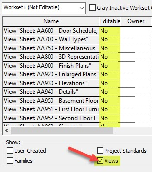

<head>
<meta http-equiv="Content-Type" content="text/html; charset=utf-8">
<link rel="stylesheet" type="text/css" href="bc.css">

</head>

<!---

- View's Workset Editable - Change from No to Yes with the API?
  https://forums.autodesk.com/t5/revit-api-forum/view-s-workset-editable-change-from-no-to-yes-with-the-api/m-p/11997681#M71740
  [Q] Can anyone tell me if it's possible to change a view's workset status from "No" to "Yes" (editable) using the Revit API (Revit 2023 or earlier). See image blow.
I'm not asking to have anyone do my work for me. I just want to know if it's possible and maybe toss me a hint or two? I've searched the internet and I've found several similar posts saying it wasn't possible but they were for much older versions of Revit.
Thanks in advance!
view_workset_editable.jpg
[A]
explanation by RPT and solution by Jonas Hoyer

- Selection.SetReferences
  https://autodesk.slack.com/archives/C0SR6NAP8/p1685354466881299
  Shen Wang
  A customer raised a Revit API question about PickObjects (ObjectType.LinkedElement).
  After he gets the graphic element in the linked file via PickObjects(ObjectType.LinkedElement), how to make the linked graphic element selected in the current view, just like to achieve the effect of TAB button to select the linked element.
  Martha Hirstoaga
  Hello, since Revit 2023 you can use Autodesk.Revit.UI.Selection.SetReferences(IList<Reference> references), which  selects the given references. Reference can be an element or a subelement in the host or a linked document.
  Shen Wang
  If the customer is using the version less than 2023, is the above variable still available? Otherwise, does he have any other choice before 2023? Since he is still using 2020.
  Martha Hirstoaga
  In Revit Pre-2023, only Autodesk.Revit.UI.Selection.SetElementIds(ICollection<ElementId> elementIds) was available, being able to select only elements in the host document. I am not aware of any other way to select an element  from other document in pre-2023 Revit.

- WallType naming best practices
  https://forums.autodesk.com/t5/revit-api-forum/is-it-possible-to-change-the-walltype-name-through-api/m-p/11990210

twitter:

 in the @AutodeskRevit #RevitAPI #BIM @DynamoBIM @AutodeskAPS

&ndash;
...

linkedin:

#BIM #DynamoBIM #AutodeskAPS #Revit #API #IFC #SDK #Autodesk #AEC #adsk

the [Revit API discussion forum](http://forums.autodesk.com/t5/revit-api-forum/bd-p/160) thread

-->

###

#### Modify View Workset Editable

explanation by RPT and solution by Jonas Hoyer

A nice explanation and succinct solution
by Richard [RPThomas108](https://forums.autodesk.com/t5/user/viewprofilepage/user-id/1035859) Thomas
and [Jonas Hoyer](https://forums.autodesk.com/t5/user/viewprofilepage/user-id/8174024)
on [view's workset editable &ndash; change from No to Yes with the API?](https://forums.autodesk.com/t5/revit-api-forum/view-s-workset-editable-change-from-no-to-yes-with-the-api/m-p/11997681):

**Question:** Can anyone tell me if it's possible to change a view's workset status from "No" to "Yes" (editable) using the Revit API (Revit 2023 or earlier), in this form:

 <!-- Pixel Height: 354 Pixel Width: 313 -->

I searched the Internet and found several similar posts saying it wasn't possible, but they were for much older versions of Revit.
Thanks in advance!

**Explanation:** When you take ownership of a workset, it becomes editable to that user 'Yes'; when you relinquish the workset it reverts to 'No' (which doesn't actually mean you can't edit it).

[WorksharingUtils CheckoutWorksets](https://www.revitapidocs.com/2023/39b55560-c85b-bebc-e825-b76b5ba313a7.htm) allows
the user to take ownership of the workset and make them editable to that user.

[RelinquishOwnership](https://www.revitapidocs.com/2023/09f4e163-cb8f-de87-d641-3ba667adf4e0.htm) allows
user to decide via RelinquishOptions what is relinquished (given back) including various workset types.

I believe the 'editable' indicator is just a function of if the current user has taken ownership of a certain workset or not, i.e., they can take ownership of a workset for whatever time period to be sole editor of it until they relinquish it.
The 'Yes/No' is only meaningful when you are the owner of it.
The interface is probably outdated and contains bad terminology to a certain extent.
The default is 'No (Non Editable)' meaning everyone can edit items on a workset via borrowing elements (so 'non editable' means you can edit it and so can everyone else).

I believe the only other time it is 'yes' is when you've just created a workset but are yet to synchronise it to central.
You can't make it 'non editable' available to all users until after you've synchronised it (because it doesn't yet exist in the central file).
So, under that circumstance, you would have to synchronise then relinquish.
Similarly, if you wanted to rename a workset you would have to make it 'editable' first.

So, in summary, the 'Editable/Non Editable' aspect should be read as relating to if current user can solely edit the workset or not rather than just being a borrower of elements on a workset.

The 'Owner' column exists separately from the 'Yes/No' one because some types of workset you decide to be the editor/owner of (user created ones) whereas when you create a view the ownership of the view workset is inherently you until synchronised.

Have you tried the [WorsharingUtils](https://www.revitapidocs.com/2023/ae7857a0-4e9b-f9c1-84c7-8b250af68068.htm) class for the View worksets in question?

Under certain circumstances described above you will not be able to influence this 'editable/non editable' aspect via the API for a single user because it is related to how two or more people are interacting in a workshared environment e.g if someone else owns the workset then you can only ask they relinquish it.

Choosing to take ownership of entire worksets is generally the old way of working before element borrowing was used.
Mostly, people take ownership just to do infrequent things such as change workset names but that isn't applicable to View worksets.
They may also take ownership to restrict access but again not for views.

**Solution:** To set the editable status of the view workset to `yes` you have to check out the workset of the view by using
the [CheckoutWorksets](https://www.revitapidocs.com/2023/97f0d4eb-ad2a-ca9d-a896-5144bd68c5a5.htm) method
of the WorksharingUtils class.
You can retrieve the `WorksetId` of the view with the `ELEM_PARTITION_PARAM` `BuiltInParameter`.
Then, you can construct a `WorksetId` with the returned integer and use that to checkout the view's workset.
That will set the editable status to yes.
Hope this helps!

Many thanks to Richard and Jonas for the explanation and solution!

####

Selection.SetReferences
https://autodesk.slack.com/archives/C0SR6NAP8/p1685354466881299
Shen Wang
A customer raised a Revit API question about PickObjects (ObjectType.LinkedElement).
After he gets the graphic element in the linked file via PickObjects(ObjectType.LinkedElement), how to make the linked graphic element selected in the current view, just like to achieve the effect of TAB button to select the linked element.
Martha Hirstoaga
Hello, since Revit 2023 you can use Autodesk.Revit.UI.Selection.SetReferences(IList<Reference> references), which  selects the given references. Reference can be an element or a subelement in the host or a linked document.
Shen Wang
If the customer is using the version less than 2023, is the above variable still available? Otherwise, does he have any other choice before 2023? Since he is still using 2020.
Martha Hirstoaga
In Revit Pre-2023, only Autodesk.Revit.UI.Selection.SetElementIds(ICollection<ElementId> elementIds) was available, being able to select only elements in the host document. I am not aware of any other way to select an element  from other document in pre-2023 Revit.

####

WallType naming best practices
https://forums.autodesk.com/t5/revit-api-forum/is-it-possible-to-change-the-walltype-name-through-api/m-p/11990210

 <!-- Pixel Height: 354 Pixel Width: 313 -->

<pre class="prettyprint">

</pre>

