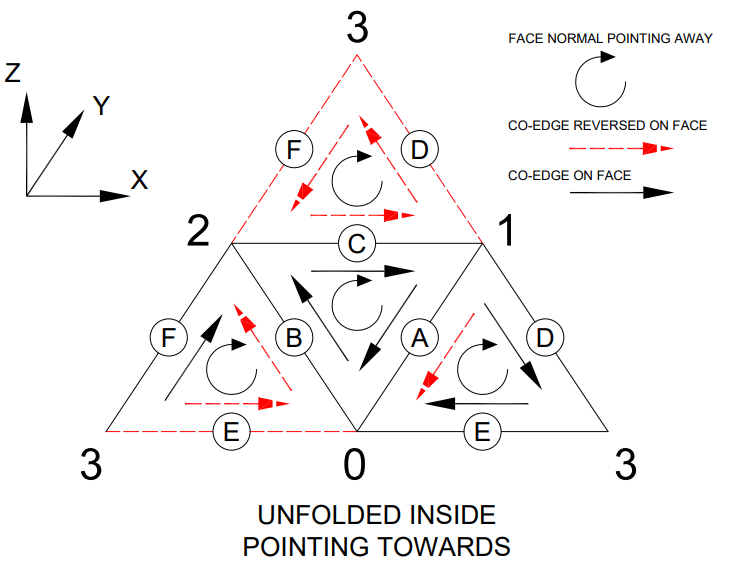
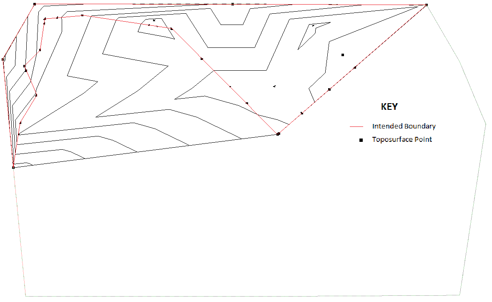

<head>
<meta http-equiv="Content-Type" content="text/html; charset=utf-8">
<link rel="stylesheet" type="text/css" href="bc.css">

</head>

<!---

brepbuilder

- BRepBuilder fails on very simple example
  https://forums.autodesk.com/t5/revit-api-forum/brepbuilder-fails-on-very-simple-example/m-p/12015942#M71909
  /Users/jta/a/doc/revit/tbc/git/a/img/rpt_brep_organisation.png

- Toposurface - Change interior point to boundary point?
  https://forums.autodesk.com/t5/revit-api-forum/toposurface-change-interior-point-to-boundary-point/m-p/12015969#M71911

- https://twitter.com/advany/status/1664451798793584642?s=20
  https://twitter.com/advany/status/1664451798793584642?s=20
  to_code_or_not_to_code.jpg
  Ab Advany
  [@advany](https://twitter.com/advany)
  Supervised a project 2 week ago. Two programmers where hired to create an MVP. I have worked with both before.
  - Alex from Germany. 100% code. 19 years experience.
  - Hamid from Pakistan. Code + Copilot + GPT-4 + no-code. 4 years experience.
  What do you think happened?

twitter:

An update for the @AutodeskRevit #RevitAPI SDK, an in-depth discussion of BRepBuilder organisation for  geometry generation, a Toposurface issue and a hint at where the software development industry may be headed #BIM @DynamoBIM @AutodeskAPS https://bit.ly/breporganisation

An update for the Revit SDK, an in-depth discussion of Revit geometry generation, a Toposurface issue and a hint at where the software development industry may be headed
&ndash; Revit SDK update
&ndash; BRepBuilder organisation
&ndash; Change Toposurface interior point to boundary
&ndash; To code or not to code, that is the question...

linkedin:

An update for the #RevitAPI SDK, an in-depth discussion of BRepBuilder organisation for geometry generation, a Toposurface issue and a hint at where the software development industry may be headed

https://bit.ly/breporganisation

- Revit SDK update
- BRepBuilder organisation
- Change Toposurface interior point to boundary
- To code or not to code, that is the question...

#BIM #DynamoBIM #AutodeskAPS #Revit #API #IFC #SDK #Autodesk #AEC #adsk

the [Revit API discussion forum](http://forums.autodesk.com/t5/revit-api-forum/bd-p/160) thread

-->

### BRepBuilder and Toposurface Interior

An updated Revit SDK, an in-depth discussion of Revit geometry generation, a Toposurface issue and a hint at where the software development industry may be headed:

- [Revit SDK Update](#1)
- [BRepBuilder organisation](#2)
- [Change Toposurface interior point to boundary](#3)
- [To code or not to code, that is the question](#4)

#### Revit SDK Update

The age-old `developrevit` [Revit Developer Centre](http://autodesk.com/developrevit) shortcut
now redirects to a new target aligned with the rest of the Autodesk Platform Service APS APIs,
to

- [aps.autodesk.com/developer/overview/revit](https://aps.autodesk.com/developer/overview/revit)

There, you can now find the new Revit SDK for Revit 2024 updated on May 30, 2023, to fix some of the issues I
described in April [compiling the Revit 2024 SDK samples](https://thebuildingcoder.typepad.com/blog/2023/04/nice-accelerator-and-compiling-the-revit-2024-sdk.html#3) and
subsequently reported in the ticket REVIT-206304 *Update RvtSamples.txt for Revit 2024 SDK*.

#### BRepBuilder Organisation

Richard [RPThomas108](https://forums.autodesk.com/t5/user/viewprofilepage/user-id/1035859) Thomas
and Luiz Henrique [@ricaun](https://github.com/ricaun) Cassettari
share some illuminating insights on using the BRepBuilder addressing
why [BRepBuilder fails on very simple example](https://forums.autodesk.com/t5/revit-api-forum/brepbuilder-fails-on-very-simple-example/m-p/12015942):

**Question:** I get a "Failure" result on a very simple BRepBuilder example when I try to build a (4-sided triangle pyramid) Tetrahedron.
I know about `TessellatedShapeBuilder`, but it fails for a quite complex object, and I hope to bypass this using the BREP instead.

<pre class="prettyprint">
public class Test{

  public Test(){}

  // Keep track of already created edges and their orientation
  struct BrepEdge {
    public BRepBuilderGeometryId id;
    public XYZ p1, p2;
  }
  List&lt;BrepEdge&gt; brep_edges = new List&lt;BrepEdge&gt;();

  // add edge to face loop
  void AddEdgeToBREP( BRepBuilder brep, BRepBuilderGeometryId loop, XYZ a, XYZ b) {
    foreach(var be in brep_edges) {
      // ab is p1-p2
      if(be.p1.DistanceTo(a) &lt; 1e-7 && be.p2.DistanceTo(b) &lt; 1e-7) { brep.AddCoEdge(loop, be.id, false);return; }
      // ab is p2-p1 (reversed edge)
      if(be.p1.DistanceTo(b) &lt; 1e-7 && be.p2.DistanceTo(a) &lt; 1e-7) { brep.AddCoEdge(loop, be.id, true); return; }
    }
    // must create a new edge
    BRepBuilderGeometryId edge = brep.AddEdge(BRepBuilderEdgeGeometry.Create(a, b));
    brep.AddCoEdge(loop, edge, false);
    var bed = new BrepEdge();
    bed.p1 = a;
    bed.p2 = b;
    bed.id = edge;
    brep_edges.Add(bed);
  }

  // add triangle face to solid
  private void AddTriangleToBREP( BRepBuilder brep, XYZ a, XYZ b, XYZ c ) {
    Plane plane = Plane.CreateByThreePoints(a, b, c);
    BRepBuilderGeometryId face = brep.AddFace(BRepBuilderSurfaceGeometry.Create(plane, null), true);
    var loop = brep.AddLoop(face);
    AddEdgeToBREP(brep, loop, a, b);
    AddEdgeToBREP(brep, loop, b, c);
    AddEdgeToBREP(brep, loop, c, a);
    brep.FinishLoop(loop);
    brep.FinishFace(face);
  }

  public void run() {
    BRepBuilder brep = new BRepBuilder(BRepType.Solid);

    var points = new List&lt;XYZ&gt;(4);
    points.Add(new XYZ(0, 0, 0)); // 0 origin
    points.Add(new XYZ(1, 0, 0)); // 1 right
    points.Add(new XYZ(0, 1, 0)); // 2 back
    points.Add(new XYZ(0, 0, 1)); // 3 top

    AddTriangleToBREP(brep, points[2], points[1], points[0]); // bottom face
    AddTriangleToBREP(brep, points[0], points[1], points[3]); // front face
    AddTriangleToBREP(brep, points[1], points[2], points[3]); // diagonal face
    AddTriangleToBREP(brep, points[2], points[0], points[3]); // left face

    var outcome = brep.Finish(); // &lt;&lt;&lt;&lt;&lt; Failure

    // throws: "This BRepBuilder object hasn't completed building data or was unsuccessful building it.
    // Built Geometry is unavailable. In order to access the built Geometry,
    // Finish() must be called first. That will set the state to completed."
    var res = brep.GetResult();
  }
}
</pre>

**Answer:** [DirectShape from BrepBuilder and Boolean](https://thebuildingcoder.typepad.com/blog/2018/02/directshape-from-brepbuilder-and-boolean.html) provides
an example that does work.

However, please note that BRepBuilder wasn’t really meant for 'manually' constructing geometry. Its interface is rather cumbersome for that purpose. It was meant for translating existing geometry into Revit, with rather thorough validation of the input geometry.

**Response:** I implemented a workaround using `TesselatedShapeBuilder`, but it's strange that I can't get the simplest example working with the BREP commands. Also, the error message is not very helpful.

Later: I experienced the same error when try to create a simple pyramid shape as a prototype for recreating geometry from linked IFC file. I would like to use some external algorithm the geometry and convert the external data to a mesh and rebuilt the new shape. The API documentation does not provide much of information about why it failed.

**Answer:** It takes a bit of organisation but it does work.

It isn't ideal for manual creation since (1) you need to arrange the edges so they are compatible and (2) the edges need to sit on the surface.

I organised the above original into the below edge orders and directions and it worked fine. Each co-edge should be reversed on one face and not reversed on the other. Outer loops for a face should be anticlockwise with respect to the face normal (pointing outwards for a solid). So the edge is indicated as reversed on the face if it can't satisfy that e.g. the edge of two adjoining faces needs to be reversed on one of them.

 <!-- Pixel Height: 572 Pixel Width: 729 -->

<pre class="prettyprint">
  Private Function Obj_230606a( _
    ByVal commandData As ExternalCommandData,
    ByRef message As String,
    ByVal elements As ElementSet) As Result

    Dim UIApp As UIApplication = commandData.Application
    Dim UIDoc As UIDocument = commandData.Application.ActiveUIDocument
    If UIDoc Is Nothing Then Return Result.Cancelled Else
    Dim IntDoc As Document = UIDoc.Document

    ' Only needs 6 edges '
    ' Set on triangle if an edge of that triangle is reversed or not '
    ' Each edge has two faces the edge should be reversed on one face and not on the other '
    ' Outer loops should be anticlockwise with respect to normal '

    Dim A As New TriangleSide(1, 0)
    Dim B As New TriangleSide(0, 2)
    Dim C As New TriangleSide(2, 1)
    Dim D As New TriangleSide(1, 3)
    Dim E As New TriangleSide(3, 0)
    Dim F As New TriangleSide(3, 2)

    Dim T_ABC As New Triangle(A, B, C, New Boolean(2) {False, False, False})
    Dim T_ADE As New Triangle(A, D, E, New Boolean(2) {True, False, False})
    Dim T_BEF As New Triangle(B, E, F, New Boolean(2) {True, True, False})
    Dim T_CFD As New Triangle(C, F, D, New Boolean(2) {True, True, True})

    Dim Triangles As Triangle() = New Triangle(3) {T_ABC, T_ADE, T_BEF, T_CFD}
    Dim Edges As TriangleSide() = New TriangleSide(5) {A, B, C, D, E, F}

    ' The coords '

    Dim X As Double = 1
    Dim Y As Double = 1
    Dim Z As Double = 1

    Dim Points As XYZ() = New XYZ(3) {
      New XYZ(0, 0, 0),
      New XYZ(X, 0, 0),
      New XYZ(0, Y, 0),
      New XYZ(0, 0, Z)}

    Dim BrepB As New BRepBuilder(BRepType.Solid)

    ' Faces '

    For i = 0 To Triangles.Length - 1
      Dim T As Triangle = Triangles(i)
      Dim P As Plane = T.GetPlane(Points)
      Triangles(i).FaceId = BrepB.AddFace(BRepBuilderSurfaceGeometry.Create(P, Nothing), False)
    Next

    ' Edges '

    For i = 0 To Edges.Length - 1
      Dim ed As TriangleSide = Edges(i)
      Edges(i).EdgeId = BrepB.AddEdge(BRepBuilderEdgeGeometry.Create(ed.GetXYZ(0, Points), ed.GetXYZ(1, Points)))
    Next

    ' Face loops '

    For i = 0 To Triangles.Length - 1
      Dim T As Triangle = Triangles(i)
      Triangles(i).LoopId = BrepB.AddLoop(T.FaceId)
    Next

    ' Co-edges '

    For i = 0 To Triangles.Length - 1
      Dim T As Triangle = Triangles(i)

      For ia = 0 To 2
        Dim ed As TriangleSide = T(ia)
        BrepB.AddCoEdge(T.LoopId, ed.EdgeId, T.Sides_Reversed(ia))
      Next
      BrepB.FinishLoop(T.LoopId)
      BrepB.FinishFace(T.FaceId)
    Next

    Dim Outcome As BRepBuilderOutcome = BrepB.Finish

    Using Tx As New Transaction(IntDoc, "DS")
      If Tx.Start = TransactionStatus.Started Then

        Dim DS As DirectShape = DirectShape.CreateElement(IntDoc, New ElementId(BuiltInCategory.OST_GenericModel))
        Dim S As Solid = BrepB.GetResult()
        DS.SetShape(New GeometryObject() {S}.ToList)

        Tx.Commit()
      End If
    End Using

    Return Result.Succeeded
  End Function

  Public Class TriangleSide
    Public Property EdgeId As BRepBuilderGeometryId
    Public ReadOnly Property N1 As Integer
    Public ReadOnly Property N2 As Integer
    Public Function GetXYZ(Idx As Integer, Points As XYZ()) As XYZ
      If Idx = 0 Then
        Return Points(N1)
      ElseIf Idx = 1 Then
        Return Points(N2)
      Else
        Throw New ArgumentOutOfRangeException
      End If
    End Function
    Public Sub New(Node1 As Integer, Node2 As Integer)
      N1 = Node1
      N2 = Node2
    End Sub
  End Class

  Public Class Triangle
    Public Property LoopId As BRepBuilderGeometryId
    Public Property FaceId As BRepBuilderGeometryId
    Public ReadOnly Property Sides_Reversed As Boolean()
    Public ReadOnly Property S1 As TriangleSide
    Public ReadOnly Property S2 As TriangleSide
    Public ReadOnly Property S3 As TriangleSide

    Public Function GetPlane(Points As XYZ()) As Plane

      ' The edge ends could be reversed for a triangles, so use '
      ' midpoints to ensure points are unique and not colinear '

      Dim Mid1 As XYZ = (Points(S1.N1) + Points(S1.N2)) / 2
      Dim Mid2 As XYZ = (Points(S2.N1) + Points(S2.N2)) / 2
      Dim Mid3 As XYZ = (Points(S3.N1) + Points(S3.N2)) / 2

      Return Plane.CreateByThreePoints(Mid1, Mid2, Mid3)
    End Function

    Default Public ReadOnly Property Side(Idx As Integer) As TriangleSide
      Get
        If Idx = 0 Then
          Return S1
        ElseIf Idx = 1 Then
          Return S2
        ElseIf Idx = 2 Then
          Return S3
        Else
          Throw New ArgumentOutOfRangeException
        End If
      End Get
    End Property

    Public Sub New(Side1 As TriangleSide, Side2 As TriangleSide, Side3 As TriangleSide, Reversed As Boolean())
      S1 = Side1
      S2 = Side2
      S3 = Side3

      If Reversed.Length &lt;&gt; 3 Then
        Throw New ArgumentOutOfRangeException
      End If
      Sides_Reversed = Reversed

    End Sub
  End Class
</pre>

**Response:** It took me a while to figure out how the edges and faces should be added before the detail explanation and sample code reaches me.
Thank you very much for your effort.

That is a really cool image; did you create it or you found in some Revit API presentation?

Is kinda missing a Four-sided dice in that image 😀

Another thing that is good to mention, is if your BRepType is Void, all the face normals must point into the void.

**Answer:** Thanks @ricaun I drew it with AutoCAD after a couple of attempts at what I wanted to get across using pencil, paper and eraser (more eraser than pencil and paper).

I'll have to check how important it is to set the boundaries of the surfaces.
I'm sure I noticed previously and the other day that just specifying null may create a performance issue in Revit after the direct shape exists.

The best thing about the BRepBuilder in my view is that you can create single face solids. So all those API functions specific to the face class can be used on such.

**Answer:** Regarding the boundaries, you say:

> I'll have to check how important it is to set the boundaries of the surfaces. I'm sure I noticed previously and the other day that just specifying null may create a performance issue in Revit after the direct shape exists.

In my code, the boundaries of the surfaces are null as well, never have a problem but the most complex thing I did was create a copy of a Solid to change the Material. Works, but reordering and reversing each edge is painful.

> @RPTHOMAS108 wrote: The best thing about the BRepBuilder in my view is that you can create single face solids. So all those API functions specific to the face class can be used on such.

For a simple face, it is possible to use `TessellatedShapeBuilder`: you can create a Solid, or a Mesh if that fails.

In this `D4` is much simpler to use than TessellatedFace &ndash; `D4` as in tetrahedron, a shape with 4 flat faces, a dice with 4 faces, or a `D4` if you are familiar with dice and RPG. 😀

<pre class="prettyprint">
var shapeBuilder
  = TessellatedShapeCreatorUtils.Create(
    builder =&gt;
  {
    var points = new List&lt;XYZ&gt;(4);
    points.Add(new XYZ(0, 0, 0)); // 0 origin
    points.Add(new XYZ(1, 0, 0)); // 1 right
    points.Add(new XYZ(0, 1, 0)); // 2 back
    points.Add(new XYZ(0, 0, 1)); // 3 top

    var materialId = ElementId.InvalidElementId;
    // bottom face
    builder.AddFace(new TessellatedFace(new[] {
      points[2], points[1], points[0] }, materialId));
    // front face
    builder.AddFace(new TessellatedFace(new[] {
      points[0], points[1], points[3] }, materialId));
    // diagonal face
    builder.AddFace(new TessellatedFace(new[] {
      points[1], points[2], points[3] }, materialId));
    // left face
    builder.AddFace(new TessellatedFace(new[] {
      points[2], points[0], points[3] }, materialId));
  });
</pre>

Here is
the [full code of TessellatedShapeCreatorUtils.cs implementing this utility class](https://gist.github.com/ricaun/35baa2ed9f33de3487e46e4217b5e8bd)

<pre class="prettyprint">
public static class TessellatedShapeCreatorUtils
{
  public static TessellatedShapeBuilderResult Create(
    Action&lt;TessellatedShapeBuilder&gt; actionBuilder)
  {
    TessellatedShapeBuilder builder = new TessellatedShapeBuilder();
    builder.Target = TessellatedShapeBuilderTarget.AnyGeometry;
    builder.Fallback = TessellatedShapeBuilderFallback.Mesh;
    builder.OpenConnectedFaceSet(true);
    actionBuilder?.Invoke(builder);
    builder.CloseConnectedFaceSet();
    builder.Build();
    TessellatedShapeBuilderResult result = builder.GetBuildResult();
    return result;
  }
}
</pre>

If you are working with a Revit surface, `BRepBuilder` is the way to go.

Many thanks to Richard and Luiz Henrique for the good advice, illuminating discussion and great sample code!

#### Change Toposurface Interior Point to Boundary

The long-standing question
on [Toposurface &ndash; change interior point to boundary point](https://forums.autodesk.com/t5/revit-api-forum/toposurface-change-interior-point-to-boundary-point/m-p/12015969) finally
receives a clear and succinct suggestion for a solution
by Mitchell Currie of [Struxi](https://www.struxi.com/):

**Question:** Is there any way to change an interior point to a boundary point or vice versa using Revit's API?
I want to do this so I can display the boundary of the topography I have generated correctly.

 <!-- Pixel Height: 726 Pixel Width: 1,180 -->

**Answer:** Use a subregion and hide it.

Thank you for the answer!

#### To Code or Not to Code, That is the Question

An interesting [comparison of two programming approaches in modern times](https://twitter.com/advany/status/1664451798793584642?s=20)
by [Ab Advany](https://twitter.com/advany):

 <!-- Pixel Height: 450 Pixel Width: 800 -->

Supervised a project 2 week ago.
Two programmers were hired to create an MVP.
I have worked with both before:

- Alex from Germany. 100% code. 19 years experience.
- Hamid from Pakistan. Code + Copilot + GPT-4 + no-code. 4 years experience.

What do you think happened?

Both programmers received Figma screens and detailed specs.
A designer was available to assist them with the assets they needed, and there was also existing code that needed to be integrated.
Hamid finished the first version in one week with 100% test coverage of code and end-to-end testing of no-code parts.
95% of the work seems to be finished and appears to work at first glance... 😲
Hamid built the UI and front-end workflows in bubble, generated Cloudflare Workers using GPT-4, integrated existing code using Copilot, and generated tests using GPT-4 (playwright/ava).

Hamid's costs:

- GPT-4: $211
- Copilot: $20
- Cloudflare: $5
- Bubble: $134
- Compensation: $2460 (41 hours worked)
- Costs to host/run: $139/mo

Alex finished around 7% of the tasks. Costs:

- Vercel: $20
- Compensation: $3500
- Estimated to developing everything: $45k. And expects $11k for adding tests.
- Costs to host/run: $20/mo

This was a project I supervised for a friend of mine with an agency.
I only did it because I was really curious about how it would turn out.

We both thought that Hamid would be finished in 8-10 weeks while Alex would take a week or two extra, but the results amazed us!

He had a talk with Alex about this. His response? "But it will be so much cheaper to run this app, and you'll have everything under control." Not understanding the opportunity costs of shipping 13 times slower and 25 times more expensive to develop.

Alex was let go because he wants to "code" and doesn't trust no-code/AI...

The development agency of my friend has 100+ developers like Alex.
Now he is going to retrain or replace them with developers like Hamid...

I think people like Hamid will still have work five years from now, while people like Alex will have to find other jobs/professions.
What do you think?
