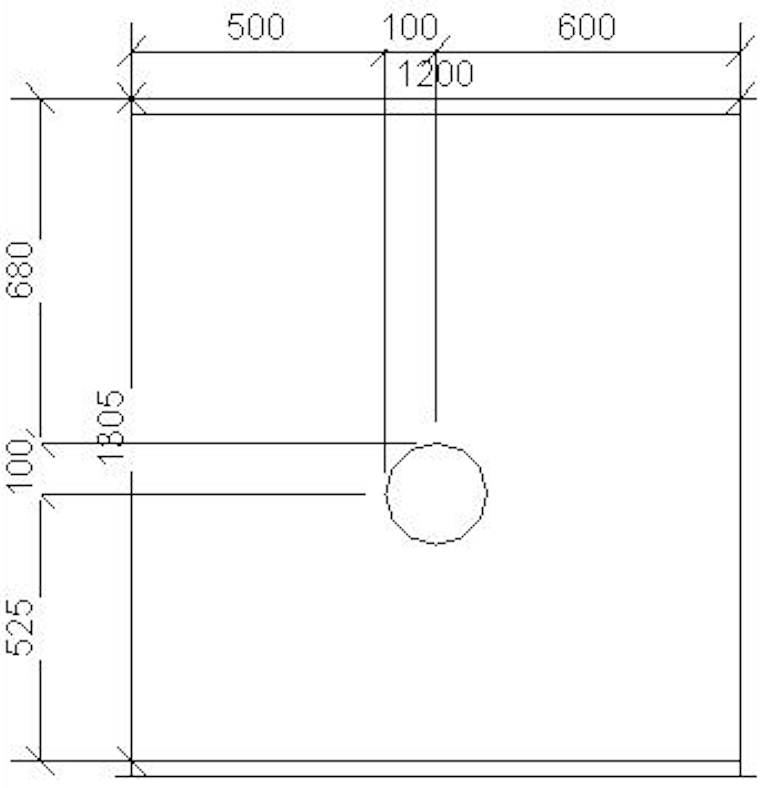
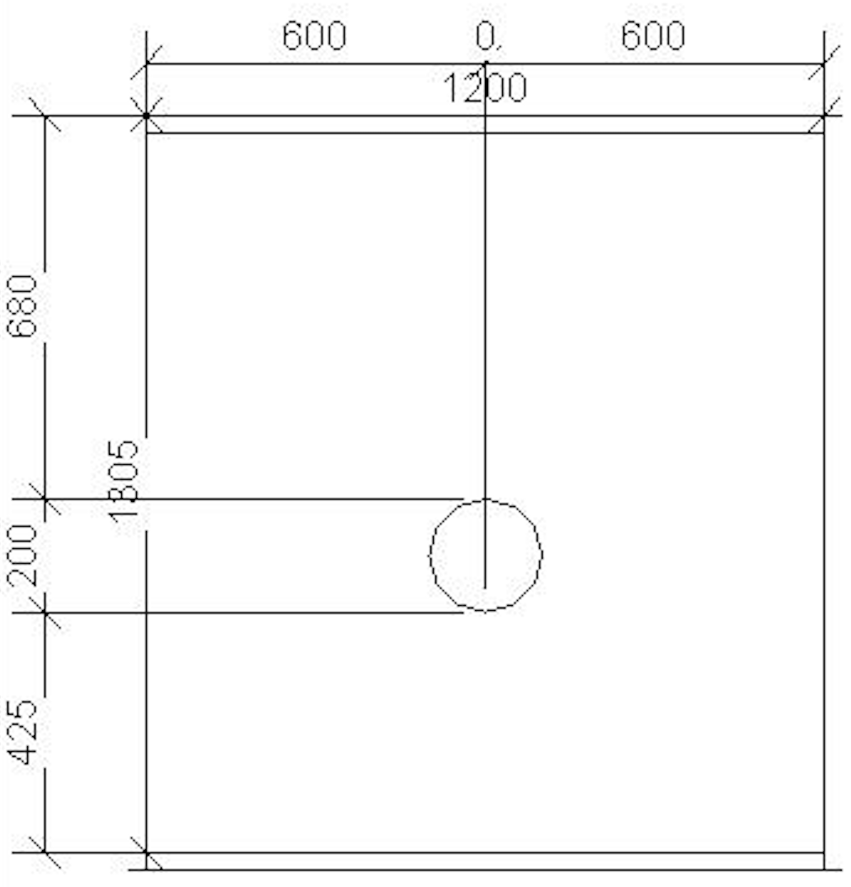

<head>
<meta http-equiv="Content-Type" content="text/html; charset=utf-8">
<link rel="stylesheet" type="text/css" href="bc.css">

</head>

<!---

- xUnitRevit: a test runner for Revit
  https://speckle.systems/blog/xunitrevit/

- dimension arc endpoint references

- API versus SDK
  https://autodesk.slack.com/archives/C0PLC20PP/p1686249893898359
  Erica Beffert

twitter:

@SpeckleSystems share a new Revit add-in unit testing tool, xUnitRevit, a test runner for @AutodeskRevit #RevitAPI #BIM @DynamoBIM @AutodeskAPS https://speckle.systems/blog/xunitrevit

/Users/jta/a/doc/revit/tbc/git/a/img/xunitrevit.gif

Accessible Revit add-in unit testing, function and accessibility of Autodesk APIs and SDKs, a minimalist secure file sharing tool and programmatic dimensioning of circles in the @AutodeskRevit #RevitAPI #BIM @DynamoBIM @AutodeskAPS https://autode.sk/unittest_arcdim

Revit add-in unit testing is becoming much more accessible, and now yet another toolkit is here.
We also clarify function and accessability of various Autodesk APIs and SDKs, look at programmatic dimensioning of circles in Revit and a minimalist secure file sharing tool
&ndash; Revit add-in unit testing
&ndash; API versus SDK
&ndash; Arc dimensioning
&ndash; Rotate your file...

linkedin:

Accessible Revit add-in unit testing, function and accessibility of Autodesk APIs and SDKs, a minimalist secure file sharing tool and programmatic dimensioning of circles in the #RevitAPI

https://autode.sk/unittest_arcdim

- Revit add-in unit testing
- API versus SDK
- Arc dimensioning
- Rotate your file...

#BIM #DynamoBIM #AutodeskAPS #Revit #API #IFC #SDK #Autodesk #AEC #adsk

the [Revit API discussion forum](http://forums.autodesk.com/t5/revit-api-forum/bd-p/160) thread

-->

### Unit Testing and Arc Dimensioning

Revit add-in unit testing is becoming much more assessible, and now yet another toolkit is here.
We also clarify function and accessability of various Autodesk APIs and SDKs, look at programmatic dimensioning of circles in Revit and a minimalist secure file sharing tool:

- [Revit add-in unit testing](#2)
- [API versus SDK](#3)
- [Arc dimensioning](#4)
- [Rotate your file](#5)

#### Revit Add-In Unit Testing

[Speckle](https://speckle.systems/) shared
[xUnitRevit: a test runner for Revit](https://speckle.systems/blog/xunitrevit) that
looks very promising.
Check out other options in
the [unit testing topic group](https://thebuildingcoder.typepad.com/blog/about-the-author.html#5.16).

#### API versus SDK

My colleagues Mikako Harada and Kevin Vandecar answered a fundamental question comparing
the [API](https://en.wikipedia.org/wiki/API) or application programming interface of a product with
its [SDK](https://en.wikipedia.org/wiki/Software_development_kit) or software development kit:

**Question:** I have a question about desktop APIs and SDKs &ndash; I'm more familiar with the cloud world, so apologies if this is a really dumb question.
For our desktop products that offer an API, my understanding is that the API is part of the code that is downloaded, but that the SDK is downloaded separately.
Is that correct?
I am also assuming that I could use the API without the SDK, is that correct?

**Answer 1:** It depends on the product.
For example, the AutoCAD C++ API ObjectARX requires a separate DLL separately, while the AutoCAD.NET API and AutoLISP are included in the product.

For some other APIs, such as OMF and ReCap, you need to be a member of ADN.

OEM is completely separate offering that you need to license
from [Tech Soft 3D](https://www.techsoft3d.com).

**Answer 2:** It really varies a lot depending on the product.
In the desktop world, the SDK usually provides the "access" and full "experience" to the API.
Docs, samples, and necessary tools to produce a plugin/addin.
Depending on the product and development environment, it can vary.

For example, AutoCAD ObjectARX, 3ds Max SDK, and Maya DevKit, are fundamentally C++ oriented and requires minimally headers and libraries.
In Maya, those are included with the product, but that's it.
The ObjectARX and 3ds Max SDKs contain those header and libraries, plus samples, docs, etc.
The Maya devkit further enhances the developer experience but is not absolutely necessary.
In 3ds Max through 2023, for example, the SDK was included by a separate installer task; for convenience it was also posted to the developer centre and ADN extranet. In 2024, due to installer changes, it is only available through the developer center.
The additional benefit of including the SDK separately from the product is so developers can "build" without needing to fully install the product.
For example, if they have build machines that do not need the full product, this helps them.

So, the assumption "I am also assuming that I could use the API without the SDK, is that correct?" is definitely not true for C++ environments, and would be questionable for others, depending on API environment and product.
In Autodesk context, the .NET APIs are usually a wrapper around or interface into the internals of the product (and may "wrap" the C++ interfaces).
In AutoCAD and 3ds Max, for example, these are just wrapper DLLs and are included with the product to enable plugins/addins to actually run against it.
But the SDK there may include again docs, samples, and other supporting aspects.
One example exception is AutoCAD ACA/AMEP.
Those are completely included (along with API reference docs and samples) within the product.
Additionally, the "API reference" in a .NET environment is not usually necessary, because it can be replaced by Reflection and Visual Studio IntelliSense.
A "developer's guide" is typically helpful, but that can also vary.
Another contradiction is the Vault API, where they do not even have much online docs.
So, even though the SDK is included with the product, you must install it, to get a local CHM file for API reference docs.

In Revit, as another example, the .NET environment is still sort of a "wrapper" but has a more integrated approach internally for software development.
A proprietary definition language (RIDL) is used to produce the .NET API during compilation of Revit source code.
The SDK includes the samples, docs, etc., so it provides a lot of useful information for anyone getting started with the API.

Some desktop apps also have a COM API.
Inventor is a good example here, where the COM AP is used to develop .NET and C++ applications, and through its COM/ActiveX interfaces also allows VBA.
VBA is included with Inventor and allows "macro" style development (much like the MS Office apps).

As said, OEM is a different situation altogether, where the product itself usually includes everything, including a way to stamp/brand it into the licensees' tools.

The Navisworks SDK is another example of a mixture of all the above.

Many thanks to Mikako and Kevin for the helpful explanation.

#### Arc Dimensioning

I made an interesting discovery working on a dimensioning issue that involved chain dimensioning of a circle placement within a rectangle, displaying its diameter and offsets from the four edges.
The circle is generated by creating two 180-degree arcs with a centre point `p` and half width and height vectors `vw2` and `vh2`:

<pre class="prettyprint">
  arc = Arc.Create(p - vw2, p + vh2, p + vw2);
  curve = doc.Create.NewModelCurve( arc, sketchPlane);
  arc = Arc.Create(p + vw2, p - vh2, p - vw2);
  curve = doc.Create.NewModelCurve(arc, sketchPlane);
</pre>

Chain dimensioning model line segments is straightforward, simply adding all the line endpoint references to the `ReferenceArray`.

I attempted a similar approach with the arcs like this:

<pre class="prettyprint">
  arc = Arc.Create(p - vw2, p + vh2, p + vw2);
  curve = doc.Create.NewModelCurve( arc, sketchPlane);

  // Vertical

  ra.Clear();
  ra.Append(mc_front_left.GeometryCurve.GetEndPointReference(0));
  ra.Append(curve.GeometryCurve.GetEndPointReference(0));
  ra.Append(curve.GeometryCurve.GetEndPointReference(1));
  ra.Append(mc_front_left.GeometryCurve.GetEndPointReference(1));
  doc.Create.NewDimension(viewForDimension, Line.CreateUnbound(pVert, vz), ra);

  // Horizontal

  ra.Clear();
  ra.Append(ductEdgeForDimHor.GeometryCurve.GetEndPointReference(0));
  ra.Append(curve.GeometryCurve.GetEndPointReference(0));
  ra.Append(curve.GeometryCurve.GetEndPointReference(1));
  ra.Append(ductEdgeForDimHor.GeometryCurve.GetEndPointReference(1));
  doc.Create.NewDimension(viewForDimension, Line.CreateUnbound(pHor, vHor), ra);
</pre>

To my surprise, this code creates dimensions to one endpoint and one midpoint of the arc:

 <!-- Pixel Height: 1,064 Pixel Width: 1,026 -->

To obtain the other endpoint, I need to grab a reference from the second arc as well, like this:

<pre class="prettyprint">
  arc = Arc.Create(p - vw2, p + vh2, p + vw2);
  curve = doc.Create.NewModelCurve( arc, sketchPlane);
  Reference r1 = curve.GeometryCurve.GetEndPointReference(0);
  arc = Arc.Create(p + vw2, p - vh2, p - vw2);
  curve = doc.Create.NewModelCurve(arc, sketchPlane);
  Reference r2 = curve.GeometryCurve.GetEndPointReference(0);

  // Vertical

  ra.Clear();
  ra.Append(mc_front_left.GeometryCurve.GetEndPointReference(0));
  ra.Append(r1);
  ra.Append(r2);
  ra.Append(mc_front_left.GeometryCurve.GetEndPointReference(1));
  doc.Create.NewDimension(viewForDimension, Line.CreateUnbound(pVert, vz), ra);

  // Horizontal

  ra.Clear();
  ra.Append(ductEdgeForDimHor.GeometryCurve.GetEndPointReference(0));
  ra.Append(r1);
  ra.Append(r2);
  ra.Append(ductEdgeForDimHor.GeometryCurve.GetEndPointReference(1));
  doc.Create.NewDimension(viewForDimension, Line.CreateUnbound(pHor, vHor), ra);
</pre>

With this code, the vertical dimension correctly dimensions the circle diameter, but the horizontal dimensioning collapses the two endpoints into one:

So, finally, we arrive at the working solution with successful diameter chain dimensioning both horizontal and vertical by using both endpoint references of both arcs, specifying different endpoints for the horizontal and vertical direction:

<pre class="prettyprint">
  arc = Arc.Create(p - vw2, p + vh2, p + vw2);
  curve = doc.Create.NewModelCurve( arc, sketchPlane);
  Reference a0r0 = curve.GeometryCurve.GetEndPointReference(0);
  Reference a0r1 = curve.GeometryCurve.GetEndPointReference(1);

  arc = Arc.Create(p + vw2, p - vh2, p - vw2);
  curve = doc.Create.NewModelCurve(arc, sketchPlane);
  Reference a1r0 = curve.GeometryCurve.GetEndPointReference(0);
  Reference a1r1 = curve.GeometryCurve.GetEndPointReference(1);

  // Vertical

  ra.Clear();
  ra.Append(mc_front_left.GeometryCurve.GetEndPointReference(0));
  ra.Append(a0r0);
  ra.Append(a1r0);
  ra.Append(mc_front_left.GeometryCurve.GetEndPointReference(1));
  doc.Create.NewDimension(viewForDimension, Line.CreateUnbound(pVert, vz), ra);

  // Horizontal

  ra.Clear();
  ra.Append(ductEdgeForDimHor.GeometryCurve.GetEndPointReference(0));
  ra.Append(a0r1);
  ra.Append(a1r1);
  ra.Append(ductEdgeForDimHor.GeometryCurve.GetEndPointReference(1));
  doc.Create.NewDimension(viewForDimension, Line.CreateUnbound(pHor, vHor), ra);
</pre>

The result is as desired:

In summary, the tests above include:

- Arc 0, references 0 + 1 &ndash; both endpioints of one single arc
- Arc 0 + 1, reference 0 &ndash; the start points of two arcs
- Arc 0 + 1, references 0 + 1 &ndash; start and end point of both arcs, depending on the dimensioning orientation

My interpretation is that the chain dimensioning does not use the specified endpoint reference in the way I expect.

Rather, the most extreme endpoint towards the start or end of the curve is dynamically determined depending on the dimension line orientation, resulting in the endpoint in one direction and the midpoint in the other.

#### Rotate Your File

[Rotate Your File](https://funct.app/) provides a handy little service to safely send someone a file:

- [Start here](https://funct.app/start)
- [Frequently asked questions](https://funct.app/faq)

The FAQ is pleasantly readable and succinct, including nice descriptions of the design philosophy, GDPR, data collection, security and encryption aspects.

