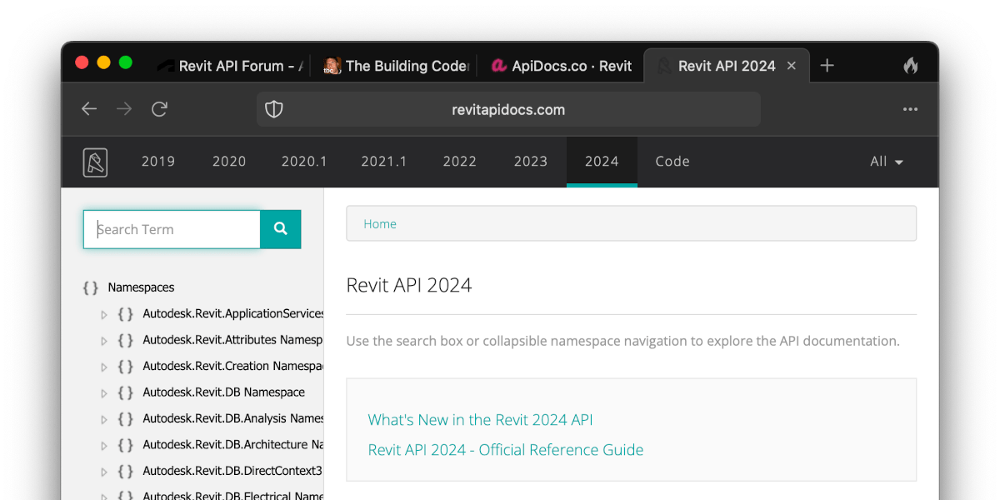
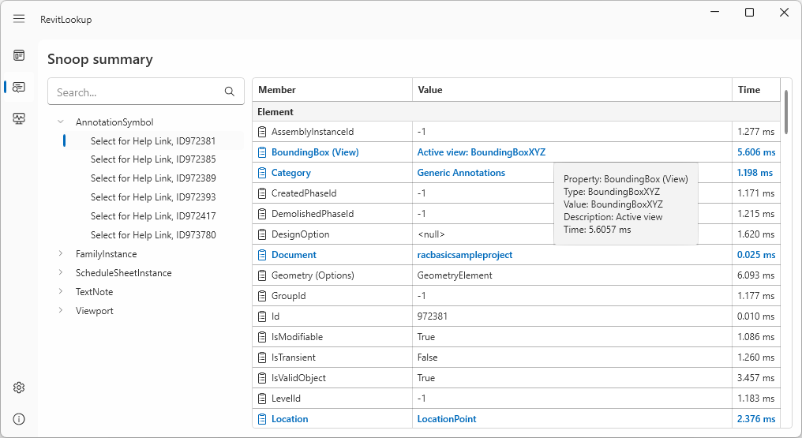
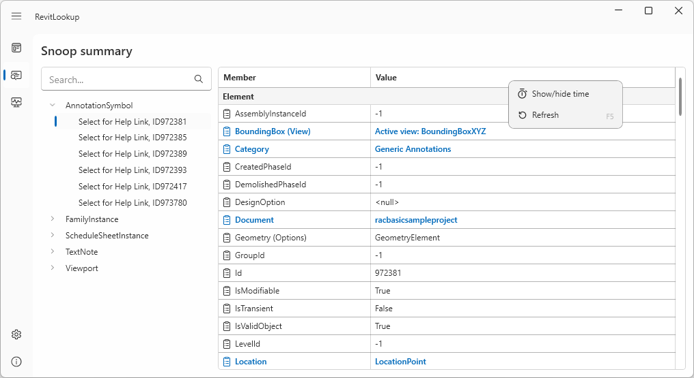
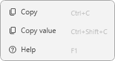
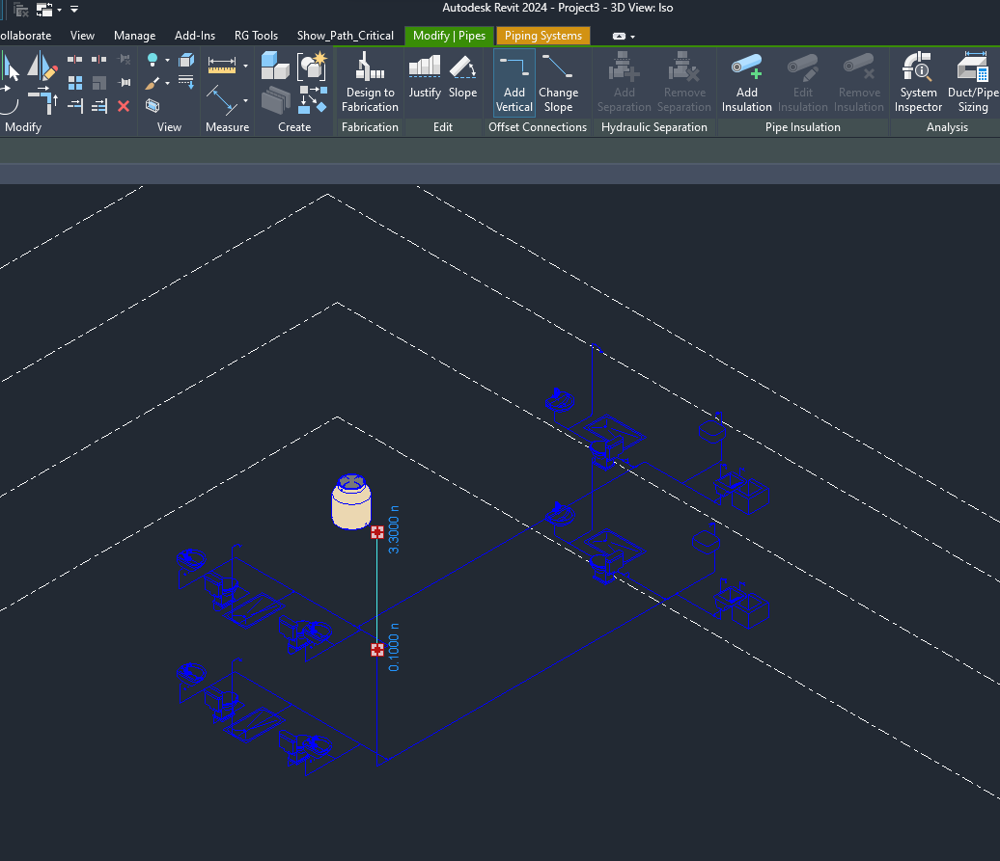
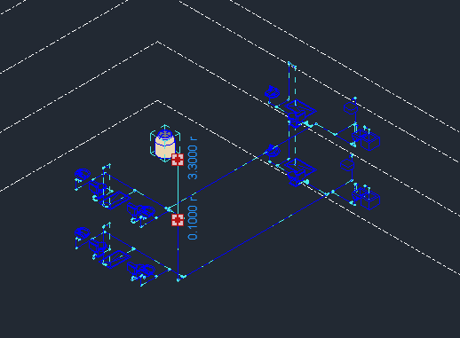
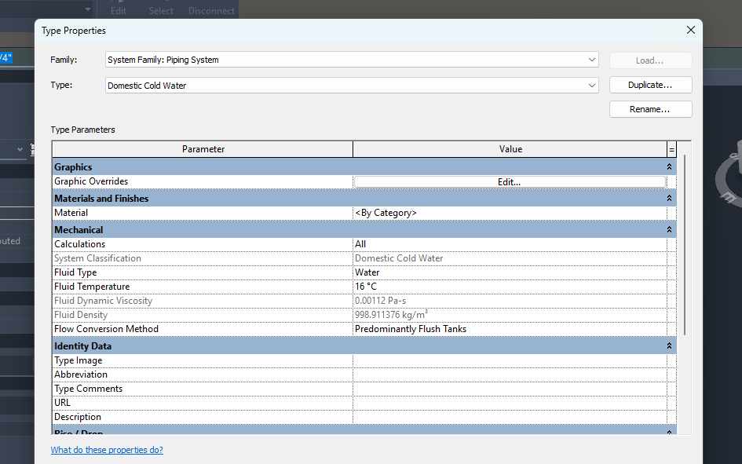
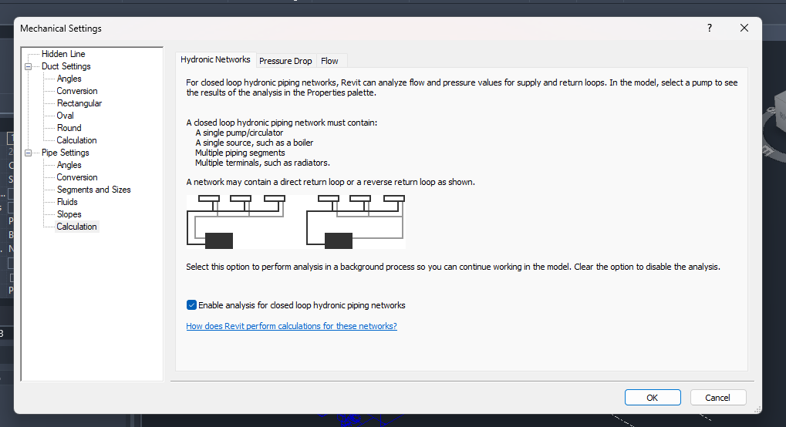
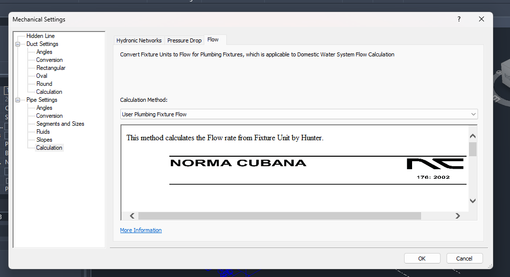
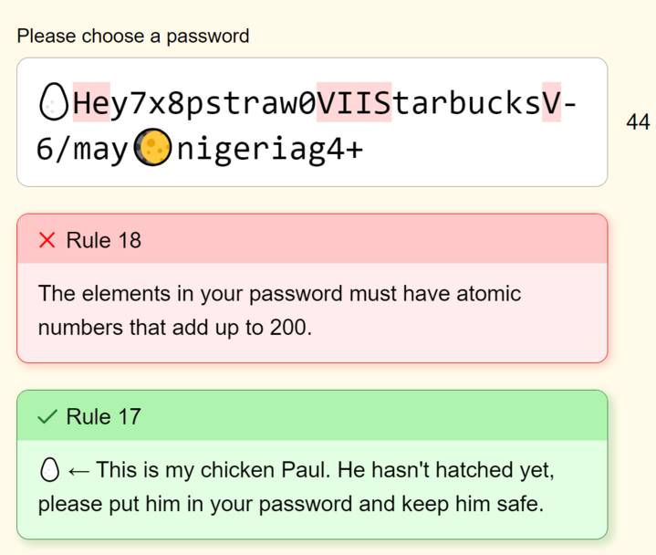

<head>
<meta http-equiv="Content-Type" content="text/html; charset=utf-8">
<link rel="stylesheet" type="text/css" href="bc.css">

</head>

<!---

- devcon email Marnee Dupont <marnee.dupont@autodesk.com>
  Registration for Munich DevCon on September 11th and 12th is now OPEN. Attendees can now register for both San Francisco and Munich.
  All the information you need to know as well as both registration links are in this blog post.
  We would love your help in promoting these events. We’ve created these Promo cheat sheets that have social posts, email drafts, and much more to help you spread the word. Please reach out to your customers, reshare our social media posts, and I’ve also posted on Bonfire as well.
  docx icon Munich DevCon Promo Cheat Sheet .docx
  docx icon San Francisco DevCon Promo Cheat Sheet.docx
  A couple notes:
  At this time, this event is for customers and partners ONLY. We do not have capacity to open this up to Autodesk employees at this time.
  If you are an employee who is working or speaking at the event, we have a Staff link that will be shared with you to register. Please do NOT use the registration link in the blog.

- forma
  3-minute video
  Autodesk Forma: Make tomorrow's cities
  https://youtu.be/6iKM0fsk_Jw
  <iframe width="560" height="315" src="https://www.youtube.com/embed/6iKM0fsk_Jw" title="YouTube video player" frameborder="0" allow="accelerometer; autoplay; clipboard-write; encrypted-media; gyroscope; picture-in-picture; web-share" allowfullscreen></iframe>
  Start a free 30-day trial: https://www.autodesk.com/products/forma/free-trial
  Find out more about Autodesk Forma: https://www.autodesk.com/forma
  Visit the blog: http://blogs.autodesk.com/forma/

- email [jeremytammik/RevitLookup] Release 2024.0.8 - 2024.0.8

- how to compare parameters in different environments by rpthomas
  https://forums.autodesk.com/t5/revit-api-forum/how-to-determine-if-a-parameter-value-is-derived-from-a-formula/m-p/12069026#M72402

- User MEP Calculation error
  https://forums.autodesk.com/t5/revit-api-forum/user-mep-calculation-error/td-p/12063928
  tamsann  149 Views, 4 Replies
  I am researching User MEP calculation, and when I tried to run the program, I encountered some errors:
  Error: "FormatUtils doesn't exist in the current context."
  Error: "CS1061 'Selection' does not contain a definition for 'Elements' and no accessible extension method 'Elements' accepting a first argument of type 'Selection' could be found (are you missing a using directive or an assembly reference?)"
  Could someone with experience in fixing these errors please help me? I'm new to this and would greatly appreciate your assistance.
  sragan  in reply to: tamsann
  Formatutils is an obsolete command that "Formats a number with units into a string based on the units formatting settings for a document."
  You will have to find another way to do this.
  FormatUtils Members (revitapidocs.com)
  https://www.revitapidocs.com/2015/b4779336-e429-0b51-8c0e-63b5657f1810.htm
  reylorente1  in reply to: sragan
  Hola,aqui te dejo UserMepCalculation2024,no obtante, el Revit SDK 2024,tiene un Complemento(Addin) llamado NetworkPressureLossReport, que te puede servir tambien.
  Espero que te ayude,y suerte
  Hello, here I leave you UserMepCalculation2024:
  UserMepCalculation2024.rar
  /Users/jta/a/doc/revit/tbc/git/a/zip/UserMepCalculation2024.rar
  however, the Revit SDK 2024 has a Complement (Addin) called NetworkPressureLossReport, which can also be useful for you:
  > This addin sample shows how to access the MEP analytical model data and traverse the network. The flow and pressure loss results are exported to a csv file or displayed in Analysis Visualization Framework (AVF).
  I hope it helps you, and good luck

- Wastewater pipe calculation
  https://forums.autodesk.com/t5/revit-api-forum/watsewater-pipe-calculation/m-p/12075059

- The Password Game
  https://neal.fun/password-game/
  /Users/jta/a/doc/revit/tbc/git/a/img/passwordgame.png
  https://autodesk.slack.com/archives/C02NW42JP/p1688127875185579
  Chris Blocher
  A little Friday frustration fun, in a geeky sort of way. https://neal.fun/password-game/. I made it to the 11th rule before I gave up:wink: (edited)
  Please choose a password (68 kB)
  https://neal.fun/password-game/
  Phillip Doup
  I made it to the whole "find a youtube video of X mins and Y seconds" one and gave up.
  Jeremy Tammik
  nice game! my 11th rule seems to be different from yours. i gave up at this point too...

twitter:

APS DevCon in Munich and SF, Forma for AEC, RevitApiDocs 2024, RevitLookup 2024.0.8, User MEP calculation 2024 and wastewater pipe calculation with the @AutodeskRevit #RevitAPI #BIM @DynamoBIM @AutodeskAPS https://autode.sk/mepcalculation

Good news on APS and the Revit API for the weekend
&ndash; APS DevCon in Munich and SF
&ndash; Forma for AEC
&ndash; RevitApiDocs supports Revit 2024
&ndash; RevitLookup 2024.0.8
&ndash; User MEP calculation 2024
&ndash; Wastewater pipe calculation
&ndash; The password game...

linkedin:

Good news on APS and the #RevitAPI for the weekend:

https://autode.sk/mepcalculation

- APS DevCon in Munich and SF
- Forma for AEC
- RevitApiDocs supports Revit 2024
- RevitLookup 2024.0.8
- User MEP calculation 2024
- Wastewater pipe calculation
- The password game...

#BIM #DynamoBIM #AutodeskAPS #Revit #API #IFC #SDK #Autodesk #AEC #adsk

the [Revit API discussion forum](http://forums.autodesk.com/t5/revit-api-forum/bd-p/160) thread

-->

### Docs, Lookup, MEP Calculation and APS DevCon

Lots of good news on APS and the Revit API to keep us busy for the weekend:

- [APS DevCon in Munich and SF](#2)
- [Forma for AEC](#3)
- [RevitApiDocs supports Revit 2024](#4)
- [RevitLookup 2024.0.8](#5)
- [User MEP calculation 2024](#6)
- [Wastewater pipe calculation](#7)
- [The password game](#8)

#### APS DevCon in Munich and SF

Registration for the Munich APS DevCon on September 11th and 12th is now open.
Attendees can register for both San Francisco and Munich.
Here is all information on how
to:

<a href="https://aps.autodesk.com/blog/register-autodesk-devcon-2023">Register for Autodesk DevCon 2023</a>

#### Forma for AEC

Autodesk is also clarifying its vision
of [Forma for AEC](https://www.autodesk.com/company/autodesk-platform/aec)
and [sustainability](/Users/jta/a/doc/revit/tbc/git/a/zip/forma_sustainability_flyer.pdf) announced
at [AU 2022](https://thebuildingcoder.typepad.com/blog/2022/09/aps-au-and-miter-wall-join-for-full-face.html#3):

- [Design a better future with Forma’s suite of sustainability solutions](https://blogs.autodesk.com/forma/2023/05/08/sustainability-solutions):

> Cities consume more than two-thirds of the world’s energy and account for over 70% of global carbon emissions
([source](https://unfccc.int/news/urban-climate-action-is-crucial-to-bend-the-emissions-curve#:~:text=Cities%20consume%20over%20two%2Dthirds,Asia%20and%20Sub%2DSaharan%20Africa)).
This means architects, real estate developers, and urban planners have an exceptional opportunity to mitigate the environmental impact of our cities by designing buildings and communities with sustainable outcomes in mind.

> Sustainable outcomes are best achieved through a proactive, data-driven approach that starts at the earliest stages of design before it becomes costly and difficult to make changes.
Autodesk Forma’s powerful suite of real-time analyses equips design teams with the quick, visual insights needed to prioritize sustainability from day one of a project.

Take a quick look at
the 3-minute video [Autodesk Forma: Make tomorrow's cities](https://youtu.be/6iKM0fsk_Jw):

<iframe width="560" height="315" src="https://www.youtube.com/embed/6iKM0fsk_Jw" title="YouTube video player" frameborder="0" allow="accelerometer; autoplay; clipboard-write; encrypted-media; gyroscope; picture-in-picture; web-share" allowfullscreen></iframe>

- [Free 30-day trial](https://www.autodesk.com/products/forma/free-trial)
- [More about Autodesk Forma](https://www.autodesk.com/forma)
- [Visit the Forma blog](http://blogs.autodesk.com/forma/)

#### RevitApiDocs Supports Revit 2024

[Gui Talarico](https://twitter.com/gtalarico) updated the online Revit API documentation for Revit 2024, both:

- [apidocs](https://apidocs.co/apps/revit/2024/d4648875-d41a-783b-d5f4-638df39ee413.htm#) and
- [revitapidocs](https://www.revitapidocs.com)

Notifications of new features are published on twitter at:

- [@ApiDocsCo](https://twitter.com/ApiDocsCo) and
- [@RevitApiDocs](https://twitter.com/RevitApiDocs)

Very many thanks to Gui for his maintenance of these invaluable resources!

 <!-- Pixel Height: 600 Pixel Width: 1,200 -->

#### RevitLookup 2024.0.8

Another RevitLookup update is available, now
for [RevitLookup release 2024.0.8](https://github.com/jeremytammik/RevitLookup/releases/tag/2024.0.8):

- Computing Time Tracking &ndash;
This feature includes the ability to monitor the computing time taken to invoke a member, such as methods or properties.
By tracking the execution time, you can identify and analyse slow-performing methods or properties, gaining insights into their overall performance.
The computing time is displayed in a separate column and a tooltip, providing you with detailed information. This feature is optional and disabled by default
- Context Menu &ndash;
A convenient context menu has been added to the table, providing you with additional options to manage columns and update contents.
This menu enables you to customize your table view and effortlessly perform actions to enhance your experience.
- Enhanced Visualization &ndash;
Icons have been added to the context menu, making it more visually appealing and intuitive for users to navigate and interact with the available options.
- Added async support for unit dialogs
- Added API for external programs https://github.com/jeremytammik/RevitLookup/issues/171
- Added FamilyParameter support by @CADBIMDeveloper in https://github.com/jeremytammik/RevitLookup/pull/174
- Added FamilyManager.GetAssociatedFamilyParameter extension by @CADBIMDeveloper in https://github.com/jeremytammik/RevitLookup/pull/175
- Fixed shortcuts reloading leading to incorrect ribbon update https://github.com/jeremytammik/RevitLookup/issues/177
- [Full changelog](https://github.com/jeremytammik/RevitLookup/compare/2024.0.7...2024.0.8)

 <!-- Pixel Height: 555 Pixel Width: 1,016 -->

Computing time tracking

 <!-- Pixel Height: 555 Pixel Width: 1,016 -->

Context menu

 <!-- Pixel Height: 102 Pixel Width: 192 -->

Enhanced visualization

#### User MEP Calculation 2024

Reynaldo Lorente, Ingeniero Hidraulico of the Centro de Ingeneria e Investigaciones Quimicas in Cuba has been very helpful with several tricky MEP issues, e.g.,
on a [User MEP Calculation error](https://forums.autodesk.com/t5/revit-api-forum/user-mep-calculation-error/td-p/12063928):

**Question:** Researching User MEP calculation, I encountered some errors:

- Error: "FormatUtils doesn't exist in the current context."
- Error: "CS1061 'Selection' does not contain a definition for 'Elements' and no accessible extension method 'Elements' accepting a first argument of type 'Selection' could be found (are you missing a using directive or an assembly reference?)"

Could someone with experience in this area please help?
I'm new to this and would greatly appreciate your assistance.

**Answer 1:** `Formatutils` is an obsolete command that "Formats a number with units into a string based on the units formatting settings for a document."
You will have to find another way to do this.

**Answer 2:** I have updated

Hello, here I leave you [UserMepCalculation](https://github.com/jeremytammik/UserMepCalculation) for Revit 2024:

- [UserMepCalculation2024.rar](/a/zip/UserMepCalculation2024.rar)

However, the Revit SDK 2024 also includes a new add-in named `NetworkPressureLossReport` that might also be useful for you:

> This add-in sample shows how to access the MEP analytical model data and traverse the network.
The flow and pressure loss results are exported to a csv file or displayed in Analysis Visualization Framework (AVF).

I hope it helps you, and good luck

**Response:** Thank you very much for sharing. It's helping me a lot.

**Answer 3:** While editing this blog post, I found three previous related  articles:

I am in the process of editing this thread for a blog post. I found three existing related blog posts:

- [User MEP Calculation Sample](http://thebuildingcoder.typepad.com/blog/2013/07/user-mep-calculation-sample.html)
- [User MEP Calculation Sample on GitHub](http://thebuildingcoder.typepad.com/blog/2013/11/user-mep-calculation-sample-on-github.html)
- [External Services](http://thebuildingcoder.typepad.com/blog/2015/12/external-services.html)

The third of these on Arnošt Löbel's class SD10752 on Revit External Services at Autodesk University 2015 is especially interesting:

It includes another Revit MEP calculation external service sample for a pressure drop calculation.
It was implemented specifically for this AU class and uses external commands to add and remove the calculator.
A proper calculator would be implemented as an `ExternalDBApplication` with no external commands involved.
Apparently, at the time, the Revit 2014 UserMepCalculation sample was superseded by this one and should be replaced.
However, I have not compared them myself, nor looked at the new SDK sample that Reynaldo points out.

Many thanks to Reynaldo for his very kind and competent support in this area!

#### Wastewater Pipe Calculation

Reynaldo also solved another MEP question
on [wastewater pipe calculation](https://forums.autodesk.com/t5/revit-api-forum/watsewater-pipe-calculation/m-p/12075059):

**Question:** I am researching plumbing calculations and discovered a method called "User MEP Calculation".
However, it only deals with water supply calculations.
I would greatly appreciate it if someone could suggest a method for wastewater pipe calculation.

**Answer:** The SRwD Sewage and Rainwater Drainage System add-in might help.
Its last year of edition is 2023, but it might serve, at least a guide.

**Response:** I feel very grateful because you always provide me with valuable answers.
You seem to be an expert in this field, while I am just a beginner.

Another question on water supply calculations because I am currently working on that:

When calculating the flow rate of a pipe, flow rate depends on the `FlowConversionMode`.
How can Revit understand whether the project is "predominantly flush valves" or "predominantly flush tanks"?

**Answer:** Here are some images that helped me formulate an answer:

Ejemplo de un sistema &ndash; example system

If you look at the tab areas, one of them turned yellow or orange.
Click on that tab; another menu opens; in the properties table, click Edit Type again; a box opens (Type Properties); where it says Flow Conversion method, you can change it to Predominantly Flush Tanks (you can also do it in the System browser to get to the box (Type Properties).
Remember that you have to change it in Mechanical Setting, in Pipe Settings, where you have the Flow tab, to add the Addin that you made or, alternatively, another one such as the UserMepCalculation 2024 that I sent you.
You have to create a system first to execute these steps.

**Response:** I was able to do it because you provided me with an incredibly detailed guide.
Thank you very much for dedicating your valuable time to me.

**Answer:** I am very glad that it has served you.
One question, are you taking into account the height of the water intake of the Plumbing Fixtures or the pressure with which it arrives?
The UserMepCalculation makes no assumptions in the calculations of the Plumbing system.

Thank you again, Reynaldo!

#### The Password Game

Let's close
with [The Password Game](https://neal.fun/password-game).

 <!-- Pixel Height: 1,930 Pixel Width: 1,172 -->

> - A little Friday frustration fun, in a geeky sort of way.

> - I made it to the whole "find a youtube video of X mins and Y seconds" one and gave up.

> - I got to 18, but I just can't from there....

 <!-- Pixel Height: 608 Pixel Width: 719 -->

