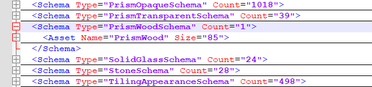

<head>
<meta http-equiv="Content-Type" content="text/html; charset=utf-8">
<link rel="stylesheet" type="text/css" href="bc.css">

</head>

<!---

- GetMaterialArea
  https://autodesk.slack.com/archives/C0SR6NAP8/p1685384981134679
  https://forums.autodesk.com/t5/revit-api-forum/method-getmaterialarea-appears-to-use-different-formulas-for/td-p/11988215

- Materials, Material Assets (Appearance, Structural, Thermal) and the Visual API
  https://forums.autodesk.com/t5/revit-api-forum/materials-material-assets-appearance-structural-thermal-and-the/td-p/12088469

- filter for annotation families
  https://autodesk.slack.com/archives/C0SR6NAP8/p1688664085416909

- Revit Batch Processor (RBP)
  https://github.com/bvn-architecture/RevitBatchProcessor
  came up in
  Is there a way to change the workset configuration of a revit file without opening revit?
  https://stackoverflow.com/questions/76630229/is-there-a-way-to-change-the-workset-configuration-of-a-revit-file-without-openi

twitter:

Two very different aspects of BIM materials, GetMaterialArea behaviour, material assets and the Visual API, a powerful batch processor utility and filtering for annotations with the @AutodeskRevit #RevitAPI #BIM @DynamoBIM @AutodeskAPS https://autode.sk/materials

Two very different aspects of BIM materials, filtering for annotations and a powerful batch processor utility:
&ndash; GetMaterialArea behaviour varies
&ndash; Material assets and the Visual API
&ndash; Filter for annotation families
&ndash; Revit batch processor RBP...

linkedin:

Two very different aspects of BIM materials, GetMaterialArea behaviour, material assets and the Visual API, a powerful batch processor utility and filtering for annotations with the #RevitAPI

https://autode.sk/materials

- GetMaterialArea behaviour varies
- Material assets and the Visual API
- Filter for annotation families
- Revit batch processor RBP...

#BIM #DynamoBIM #AutodeskAPS #Revit #API #IFC #SDK #Autodesk #AEC #adsk

the [Revit API discussion forum](http://forums.autodesk.com/t5/revit-api-forum/bd-p/160) thread

-->

### RBP, Materials, Assets and the Visual API

Two very different aspects of BIM materials, filtering for annotations and a powerful batch processor utility:

- [GetMaterialArea behaviour varies](#2)
- [Material assets and the Visual API](#3)
- [Filter for annotation families](#4)
- [Revit batch processor RBP](#5)
- [The Building Coder Blog Post &#35;2000](#6)

#### GetMaterialArea Behaviour Varies

GetMaterialArea returns different results for different kinds of elements, as explained in
the [Revit API discussion forum](http://forums.autodesk.com/t5/revit-api-forum/bd-p/160) thread
on the [method `GetMaterialArea` appears to use different formulas for computing the area depending on the element category](https://forums.autodesk.com/t5/revit-api-forum/method-getmaterialarea-appears-to-use-different-formulas-for/td-p/11988215):

**Question:** How does the method GetMaterialArea compute the area depending on the element category? It appears to use different formulas for different categories. For a wall, it is the area of one of the side faces for a layer (which probably makes sense); for a window, however, the method returns the sum over all 6 faces (assuming a simple cuboid). Please provide documentation on how the method functions on different elements
or a unified way of computing the area.

I also noticed that GetMaterialIds returns null for elements of (at least) these categories:

- Pipe, Flex Pipe, Duct, Flex Duct, Duct Insulation, Ramp

GetMaterialArea(matId) and GetMaterialVolume(matId) returns 0 for these categories.

**Answer 1:** You should check Category.HasMaterialQuantities for that, some categories don't support material quantities.

However, it is noted that such material quantities are calculated either from compound structure layers or geometry.
Since the `Window` isn't a compound structure, area will be taken from faces of geometry I suspect; `Wall`, on the other hand, has compound structure.
The geometry of the wall would at the same time be lacking the layers detail.

**Answer 2:** I think the customer is referring mostly to the difference between system families and loaded families in Revit itself.
The API is probably returning the same values.

- Hosts will return 1 face, because in construction, you would refer to the area of a wall material (for example) as the area to be covered when looking at the wall.
- Stairs, railing, ramps, site, and curtain wall also have special behaviour.
- Loaded families (like windows) will report an area including all faces.

This is confirmed and workarounds are posted in the Revit Clinic article
on [Material Takeoff Area Schedule](https://revitclinic.typepad.com/my_weblog/2009/10/material-takeoff-area.html).
Some other special cases are listed in the Autodesk Support article
on [Material Takeoff shows incorrect values of areas and/or volumes in Revit](https://www.autodesk.com/support/technical/article/caas/sfdcarticles/sfdcarticles/Material-Takeoff-shows-incorrect-areas-in-Revit.html).

As far as the API goes, check out these 2 resources from The Building Coder and Scott Conover that may help confirm the API designed behaviour:

- [Material Quantity Extraction](https://thebuildingcoder.typepad.com/blog/2010/02/material-quantity-extraction.html)
- [Analyse Geometry of Buildings Using the Revit API](https://thebuildingcoder.typepad.com/au/2009/AU09_CP222-3_Analyze_Geometry_Revit_API.pdf) at AU 2009 by Scott Conover, Autodesk

This is from Scott's presentation:

Material quantity extraction One common analytical requirement is to extract material quantities of elements in the document.  Revit 2010 introduced methods to directly obtain the material volumes and areas computed by Revit for material takeoff schedules:

- Element.Materials &ndash; obtains a list of materials within an element
- Element.GetMaterialVolume() &ndash; obtains the volume of a particular material in an element
- Element.GetMaterialArea() &ndash; obtains the area of a particular material in an element

The methods apply to categories of elements where Category.HasMaterialQuantities property is true.
In practice, this is limited to elements that use compound structure, like walls, roofs, floors, ceilings, a few other basic 3D elements like stairs, plus 3D families where materials can be assigned to geometry of the family, like windows, doors, columns, MEP equipment and fixtures, and generic model families.
Note that within these categories there are further restrictions about how material quantities can be extracted.
For example, curtain walls and curtain roofs will not report any material quantities themselves; the materials used by these constructs can be extracted from the individual panel elements that make up the curtain system.
Note that the volumes and areas computed by Revit may be approximate in some cases.
For example, for individual layers within a wall, minor discrepancies might appear between the volumes visible in the model and those shown in the material takeoff schedule.
These discrepancies tend to occur when you use the wall sweep tool to add a sweep or a reveal to a wall, or under certain join conditions.

#### Material Assets and the Visual API

A completely different aspect of materials is addressed by
Gary J. Orr of [MBI Companies Inc.](https://www.mbicompanies.com/),
who shares a nice VB.NET sample in
the [Revit API discussion forum](http://forums.autodesk.com/t5/revit-api-forum/bd-p/160) thread
demonstrating the interaction
with [Materials, Material Assets (Appearance, Structural, Thermal) and the Visual API](https://forums.autodesk.com/t5/revit-api-forum/materials-material-assets-appearance-structural-thermal-and-the/m-p/12089438).
In his own words:

This has been a journey. The past few weeks have seen me spending all the time that I can spare reading the API help, reading posts going back years, reading blogs (which get really hard to pull targeted information out of sometimes).

Then came trying to put it all together, Snippets of code from the API, some of which can cause just as much confusion as the help that they provide, translating snippets of code that I can barely understand because I don't speak that particular coding language, which is made even worse by the fact that it is usually written by programming professionals that use code shortcuts (which makes reading their examples even harder) and often refer to advanced coding techniques that I simply haven't ever learned since none of this is my real occupation...

But hey, I did it.

I can now take materials and their related Assets apart and I can create/recreate them.

You are welcome to the [attached VB file `MaterialTools.vb`](zip/go_materials_visual_api.zip) if you are struggling with these same issues (dump it into a VS project with the appropriate references or copy the subs/functions into a VB macro with the appropriate mods for launching the included tools).

It has functions for collecting and logging the Properties of the Application resident Appearance Assets; the Assets within a Document; the materials within a document and their associated Properties and connected assets; and one for creating a new material with all new assets. Those functions will generate TXT and XML log files that can be used to further examine all of the above.

I have attempted to document (with in line comments) the steps required and/or taken, along with why one method may have been chosen over another when such applied, as well as some cautions and some still outstanding questions and/or shortcomings that had to be worked around.

If you're well versed in Materials, and have both the time and desire, perhaps you can take a look and see if you have any answers for the commented questions that I still have and have left in the code.

There are still plenty of issues, some may just be because I haven't learned all I need to learn yet, but the bigger ones seem to be common from what I have found:
One biggie (in my opinion) is the lack of any direct correlation between the return values when you read Appearance Asset Properties to the Visual API Classes and their properties that should be used to work with them. This is a big complication and makes it really hard to avoid using strings and thereby keep your code language neutral. The descriptions in the API help do not help with that mapping the least little bit.
Another would be the absence of any clear and concise method to differentiate between Physical Property Sets... Structural vs Thermal.

Of course, this may all just be an exercise in vanity from a wanna-be but perhaps some may find some of it helpful.

Later: Oops,
The Asset Property type "List" was supposed to recurse to get the values of the list items, but I had forgotten to get back and actually make it do so.

That is fixed now.
Along the way I decided to actually do something with that massive volume of returns from GetRevitAppearanceAssets, i.e.: application.GetAssets(AssetType.Appearance).
So, I created an option to import one of each schema type into the current document.

I still don't know the actual source of these assets since they don't match any of the Revit libraries (and I still don't understand why we can't access any material libraries via the API), but I did find something else that is unusual: the only PrismWoodSchema that is contained in that library,

 <!-- Pixel Height: 143 Pixel Width: 610 -->

shows as being an "Old Style" rendering Asset once it has been imported into the document:

 <!-- Pixel Height: 382 Pixel Width: 894 -->

Yet, Assets using the PrismOpaqueSchema show as "New Style" Asset types (as would be expected for the above):

 <!-- Pixel Height: 578 Pixel Width: 1,298 -->
 
 <!-- Pixel Height: 591 Pixel Width: 1,191 -->

Just another glitch?

Here are the main problems I struggled with:

One biggie (in my opinion) is the lack of any direct correlation between the return values when you read Appearance Asset Properties to the Visual API Classes and their properties that should be used to work with them. This is a big complication and makes it really hard to avoid using strings and thereby keep your code language neutral. The descriptions in the API help do not help with that mapping the least little bit.

Another big one would be the absence of any clear and concise method to differentiate between Physical Property Sets... Structural vs Thermal.

We need a firm method of being able to differentiate Structural and Thermal Property Sets.
PSE elements will often return both a thermal and a structural Property Set, and EVERY PSE element will return a structural (RevitLookup Snoop shows that pretty well)... yet they can only be used for the correct Property type, so something somewhere knows which one is which; we need that information in the API as well.

Then, we have: where does application.GetAssets draw from?
There is nothing that matches what is found in that return list of assets anywhere that I can find in the system.
The PrismWoodSchema returned from that list shows as an "Old style" rendering Asset once pulled into a document, even though it is clearly a procedural Asset.

We need access to the AEC material Library as well as any user created libraries (as can be browsed to in the Material Browser.

We need access to the Asset libraries (as can be browsed to in the Assets dialog).

There are a few other requirements in my comments within the code, but most end up boiling down to one of these.

Will that help get the development team started?

BTW: this was written to the 2023 API, I haven't tested it for compatibility beyond that.

Many thanks to Gary for sharing the results of his research!

#### Filter for Annotation Families

A quick note on filtering for annotation families:

**Question:** Is there an identifier which I can use to sort out annotation families vs other types of families using the Revit API?
I'd like to iterate over the `IEnumerable` to then group items as I need them.
The code I'm currently using and would like to modify:

<pre class="prettyprint">
  var families = new FilteredElementCollector(doc)
    .OfClass(typeof(ElementType))
    .Cast&lt;ElementType&gt;();
</pre>

**Answer:** See if this works for you:
https://forum.dynamobim.com/t/how-can-i-collect-all-family-types-that-are-considered-annotation-symbols-in-revit/37480/10

It shows you that you need [`FamilySymbol`](https://www.revitapidocs.com/2024/a1acaed0-6a62-4c1d-94f5-4e27ce0923d3.htm) instead of `ElementType`.

Then, filter for:

<pre class="prettyprint">
  fs.Family.FamilyCategory.CategoryType
    == CategoryType.Annotation
</pre>

**Response:** For some added context,
I am hoping to first get all system families, then iterate over the collection of all system families and separate out the annotation families from that list.
Ultimately, I will end up with two CSV's, one with Annotation Families only, and the other CSV file with all system families minus annotation families which is why I think I was using `ElementType` instead of `FamilySymbol`.

**Answer:** `FamilySymbol` should be fine in your case &ndash; it is derived from `ElementType`.
ElementTypes are more general.
For example, a `Wall` element can have a `WallType` which is also derived from `ElementType`.

**Response:** I gave it a try, but now system families I was hoping to extract (prior to filtering out annotation families), like a basic wall, do not come through in my filter.

**Answer:** Sorry my bad. You are right.
For element types that are not family symbols you will not be able to do

<pre class="prettyprint">
  elem.Family.FamilyCategory.CategoryType
</pre>

You may check its own category I guess.

**Response:** That got me on the right track.
I ended up having to filter out items which have null category information:

<pre class="prettyprint">
  Category.CategoryType != CategoryType.Annotation
</pre>

Thank you very much for your help!

#### Revit Batch Processor RBP

Let's wrap up with a pointer to
the [Revit Batch Processor RBP](https://github.com/bvn-architecture/RevitBatchProcessor).
It looks like a very powerful and full-fledged utility; it came up in the StackOverflow question
asking [is there a way to change the workset configuration of a Revit file without opening Revit?](https://stackoverflow.com/questions/76630229/is-there-a-way-to-change-the-workset-configuration-of-a-revit-file-without-openi)

#### The Building Coder Blog Post &#35;2000

Actually, before closing, we have something to celebrate, a special issue, so to speak.

This blog post is The Building Coder's 2000th.

You can check out the entire chronological list in
the [GitHub tbc repository](https://github.com/jeremytammik/tbc).

All in all, The Building Coder has published over four hundred thousand lines of text, two-and-a-half million words and over 22 million characters since its inception in 2008.

It is also interesting to see what topics we started out covering back then; several are equally relevant and still recurring today:

<pre>
% wc *htm *md
      12     301    1909 0001_welcome.htm
       9     213    1366 0002_devtech.htm
      69     553    4297 0003_getting_started.htm
      68     756    5505 0004_revit_sdk_contents.htm
      19     497    3322 0005_managing_sdk_samples.htm
     122     916    6098 0006_sdk_samples_solution.htm
     120     865    5890 0007_loading_sdk_samples.htm
     125    1409    9349 0008_debugging.htm
       8     376    2121 0009_what_next.htm
     102    1062    8226 0010_selecting_all_walls.htm
     447    3131   32490 0011_units.htm
      66    1316    8954 0012_geometry_library.htm
      44     524    3712 0013_geometry_viewers.htm
...
     491    2762   20716 1997_sdk_brep.md
     267    1609   12882 1998_unittest_arcdim.md
     323    2249   18196 1999_mep_calculation.md
     259    2335   16834 2000_visual_api.md
  417722 2480900 22669323 total
</pre>

Long live The Building Coder!

####

[LinkedIn feedback from Mikhail Smirnov](https://www.linkedin.com/feed/update/urn:li:activity:7085118894100623361?commentUrn=urn%3Ali%3Acomment%3A%28activity%3A7085118894100623361%2C7085135341363347457%29):

> Thanks a lot for the article, Jeremy! As always, you are at the peak of the research wave.

Thank you for your appreciation!
However, just to clarify: there is actually no research of mine in here at all.
I am just as reporter, a librarian... there seems to be a greater lack of those than of researchers, programmers, and especially documenters...
Researching and programming is much more fun!
Still, someone has to do what I do, it seems...

