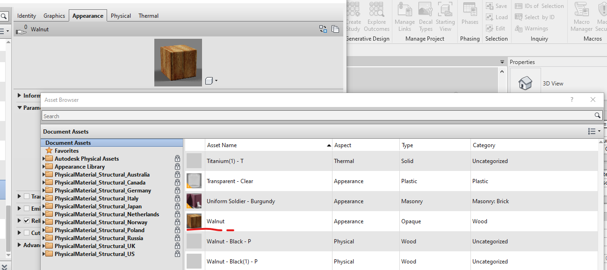
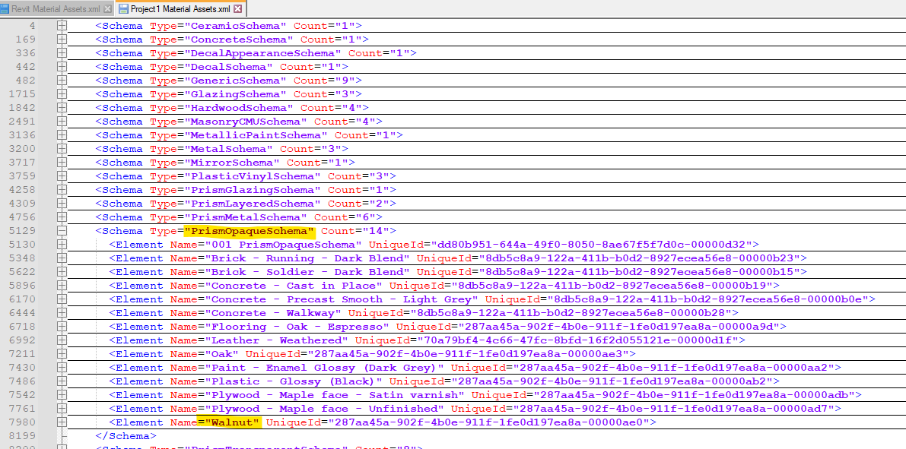

<head>
<meta http-equiv="Content-Type" content="text/html; charset=utf-8">
<link rel="stylesheet" type="text/css" href="bc.css">

</head>

<!---

twitter:

 with the @AutodeskRevit #RevitAPI #BIM @DynamoBIM @AutodeskAPS

&ndash; ...

linkedin:

#BIM #DynamoBIM #AutodeskAPS #Revit #API #IFC #SDK #Autodesk #AEC #adsk

the [Revit API discussion forum](http://forums.autodesk.com/t5/revit-api-forum/bd-p/160) thread

-->

### Visual API and Materials Sample

#### Material Assets and the Visual API

Gary J. Orr of [MBI Companies Inc.](https://www.mbicompanies.com/) shares
a nice VB.NET sample in
the [Revit API discussion forum](http://forums.autodesk.com/t5/revit-api-forum/bd-p/160) thread
demonstrating the interaction
with [Materials, Material Assets (Appearance, Structural, Thermal) and the Visual API](https://forums.autodesk.com/t5/revit-api-forum/materials-material-assets-appearance-structural-thermal-and-the/m-p/12089438).
In his own words:

This has been a journey. The past few weeks have seen me spending all the time that I can spare reading the API help, reading posts going back years, reading blogs (which get really hard to pull targeted information out of sometimes).

Then came trying to put it all together, Snippets of code from the API, some of which can cause just as much confusion as the help that they provide, translating snippets of code that I can barely understand because I don't speak that particular coding language, which is made even worse by the fact that it is usually written by programming professionals that use code shortcuts (which makes reading their examples even harder) and often refer to advanced coding techniques that I simply haven't ever learned since none of this is my real occupation...

But hey, I did it.

I can now take materials and their related Assets apart and I can create/recreate them.

You are welcome to the [attached VB file `MaterialTools.vb`](zip/go_materials_visual_api.zip) if you are struggling with these same issues (dump it into a VS project with the appropriate references or copy the subs/functions into a VB macro with the appropriate mods for launching the included tools).

It has functions for collecting and logging the Properties of the Application resident Appearance Assets; the Assets within a Document; the materials within a document and their associated Properties and connected assets; and one for creating a new material with all new assets. Those functions will generate TXT and XML log files that can be used to further examine all of the above.

I have attempted to document (with in line comments) the steps required and/or taken, along with why one method may have been chosen over another when such applied, as well as some cautions and some still outstanding questions and/or shortcomings that had to be worked around.

If you're well versed in Materials, and have both the time and desire, perhaps you can take a look and see if you have any answers for the commented questions that I still have and have left in the code.

There are still plenty of issues, some may just be because I haven't learned all I need to learn yet, but the bigger ones seem to be common from what I have found:
One biggie (in my opinion) is the lack of any direct correlation between the return values when you read Appearance Asset Properties to the Visual API Classes and their properties that should be used to work with them. This is a big complication and makes it really hard to avoid using strings and thereby keep your code language neutral. The descriptions in the API help do not help with that mapping the least little bit.
Another would be the absence of any clear and concise method to differentiate between Physical Property Sets... Structural vs Thermal.

Of course, this may all just be an exercise in vanity from a wanna-be but perhaps some may find some of it helpful.

Later: Oops,
The Asset Property type "List" was supposed to recurse to get the values of the list items but I had forgotten to get back and actually make it do so.

That is fixed now.
Along the way I decided to actually do something with that massive volume of returns from GatRevitAppearanceAssets ie: application.GetAssets(AssetType.Appearance).
So I created an option to import one of each schema type into the current document.

I still don't know the actual source of these assets since they don't match any of the Revit libraries (and I still don't understand why we can't access any material libraries via the API) but I did find something else that is unusual: the only PrismWoodSchema that is contained in that library

 <!-- Pixel Height: 600 Pixel Width: 1,200 -->

shows as being an "Old Style" rendering Asset once it has been imported into the document:

 <!-- Pixel Height: 600 Pixel Width: 1,200 -->

Yet, Assets using the PrismOpaqueSchema show as "New Style" Asset types (as would be expected for the above):

 <!-- Pixel Height: 600 Pixel Width: 1,200 -->

 <!-- Pixel Height: 600 Pixel Width: 1,200 -->

Just another glitch?

Many thanks to Gary for sharing the results of his research!

####

####

 <!-- Pixel Height: 600 Pixel Width: 1,200 -->

####

####

####

####

