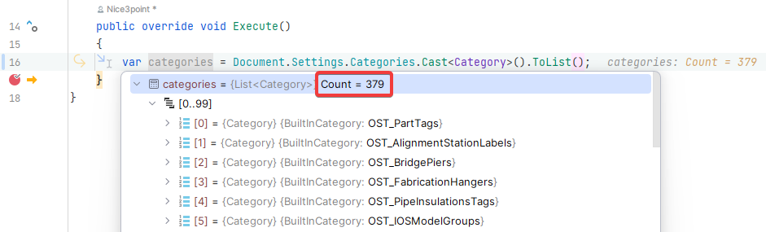
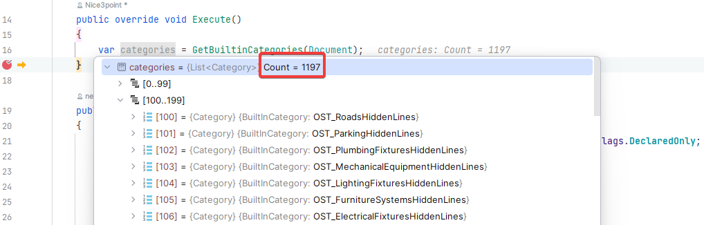

<head>
<meta http-equiv="Content-Type" content="text/html; charset=utf-8">
<link rel="stylesheet" type="text/css" href="bc.css">

</head>

<!---

- roman [jeremytammik/RevitLookup] Revit api. Retrieve all parameters and categories (Discussion #183)

twitter:

&ndash; ...

linkedin:

#BIM #DynamoBIM #AutodeskAPS #Revit #API #IFC #SDK #Autodesk #AEC #adsk

the [Revit API discussion forum](http://forums.autodesk.com/t5/revit-api-forum/bd-p/160) thread

-->

### All Categories and Parameters

#### All Categories and Parameters

Roman [Nice3point](https://github.com/Nice3point), principle maintained of RevitLookup, presents a new discovery; in his own words:

I made a new discovery for me.
As far as I know, it is impossible to get a list of all built-in parameters using the public Revit API.
We are offered an `enum`, but we cannot get the `Parameter` itself from it.
By exploring private unmanaged code using reflection and pointers, I managed to do it, as described in
the [RevitLookup discussion 183 &ndash; retrieve all parameters and categories](https://github.com/jeremytammik/RevitLookup/discussions/183):

 <!-- Pixel Height: 915 Pixel Width: 1,469 -->

#### Summary

I recently came across a problem from my business partner who wanted to get all the built-in Revit parameters to extract metadata such as data type, units, storage type, etc. As we know, this is not possible using the Autodesk Revit public API.

Similar situation with categories, we can't get all the built-in categories; so far, the only known available way is to get them from the document settings, but it contains a very truncated list:

 <!-- Pixel Height: 285 Pixel Width: 941 -->

#### Solution

We can use private code with reflection and pointers; we only need a document.
The point of the method is not to get them but create it.

Example code to get all parameters:

<pre class="prettyprint">
public static List&lt;Parameter&gt; GetBuiltinParameters(
  Document document)
{
  const BindingFlags bindingFlags = BindingFlags.NonPublic
    | BindingFlags.Instance | BindingFlags.DeclaredOnly;

  var documentType = typeof(Document);
  var parameterType = typeof(Parameter);
  var assembly = Assembly.GetAssembly(parameterType);
  var aDocumentType = assembly.GetType("ADocument");
  var elementIdType = assembly.GetType("ElementId");
  var elementIdIdType = elementIdType.GetField("&lt;alignment member&gt;", bindingFlags)!;
  var getADocumentType = documentType.GetMethod("getADocument", bindingFlags)!;
  var parameterCtorType = parameterType.GetConstructor(bindingFlags, null, new[] {aDocumentType.MakePointerType(), elementIdType.MakePointerType()}, null)!;

  var builtinParameters = Enum.GetValues(typeof(BuiltInParameter));
  var parameters = new List&lt;Parameter&gt;(builtinParameters.Length);
  foreach (BuiltInParameter builtinParameter in builtinParameters)
  {
    var elementId = Activator.CreateInstance(elementIdType);
    elementIdIdType.SetValue(elementId, builtinParameter);

    var handle = GCHandle.Alloc(elementId);
    var elementIdPointer = GCHandle.ToIntPtr(handle);
    Marshal.StructureToPtr(elementId, elementIdPointer, true);

    var parameter = (Parameter) parameterCtorType.Invoke(
      new[] {getADocumentType.Invoke(document, null),
        elementIdPointer});
    parameters.Add(parameter);
    handle.Free();
  }

  return parameters;
}
</pre>

Example code to get all categories:

<pre class="prettyprint">
public static List&lt;Category&gt; GetBuiltinCategories(
  Document document)
{
  const BindingFlags bindingFlags = BindingFlags.NonPublic
    | BindingFlags.Instance | BindingFlags.DeclaredOnly;

  var documentType = typeof(Document);
  var categoryType = typeof(Category);
  var assembly = Assembly.GetAssembly(categoryType);
  var aDocumentType = assembly.GetType("ADocument");
  var elementIdType = assembly.GetType("ElementId");
  var elementIdIdType = elementIdType.GetField("&lt;alignment member&gt;", bindingFlags)!;
  var getADocumentType = documentType.GetMethod("getADocument", bindingFlags)!;
  var categoryCtorType = categoryType.GetConstructor(bindingFlags, null, new[] {aDocumentType.MakePointerType(), elementIdType.MakePointerType()}, null)!;

  var builtInCategories = Enum.GetValues(typeof(BuiltInCategory));
  var categories = new List&lt;Category&gt;(builtInCategories.Length);
  foreach (BuiltInCategory builtInCategory in builtInCategories)
  {
    var elementId = Activator.CreateInstance(elementIdType);
    elementIdIdType.SetValue(elementId, builtInCategory);

    var handle = GCHandle.Alloc(elementId);
    var elementIdPointer = GCHandle.ToIntPtr(handle);
    Marshal.StructureToPtr(elementId, elementIdPointer, true);

    var category = (Category) categoryCtorType.Invoke(
      new[] {getADocumentType.Invoke(document, null),
        elementIdPointer});
    categories.Add(category);
    handle.Free();
  }

  return categories;
}
</pre>

#### Result

As a result, we have created all the parameters and all the categories of the entire `Enum`:

 <!-- Pixel Height: 327 Pixel Width: 1,107 -->

All built-in parameters

 <!-- Pixel Height: 326 Pixel Width: 1,018 -->

All built-in categories

#### Limitations

Created parameters have no binding to any element, and consequently have no value, only metadata.

Many thanks to Roman for this interesting in-depth research and documentation!

**Question:**

**Answer:**

####

<pre class="prettyprint">

</pre>

**Response:**

