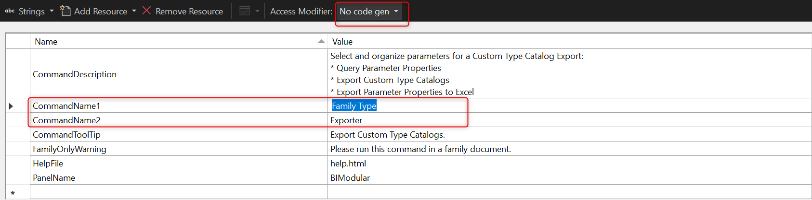
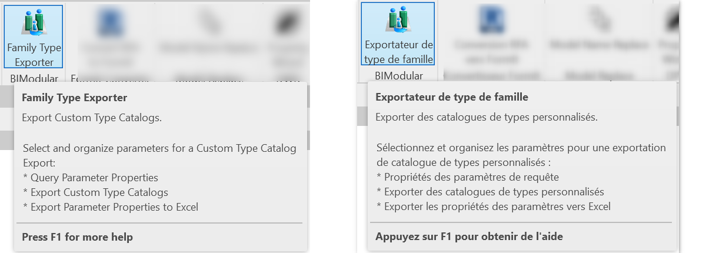
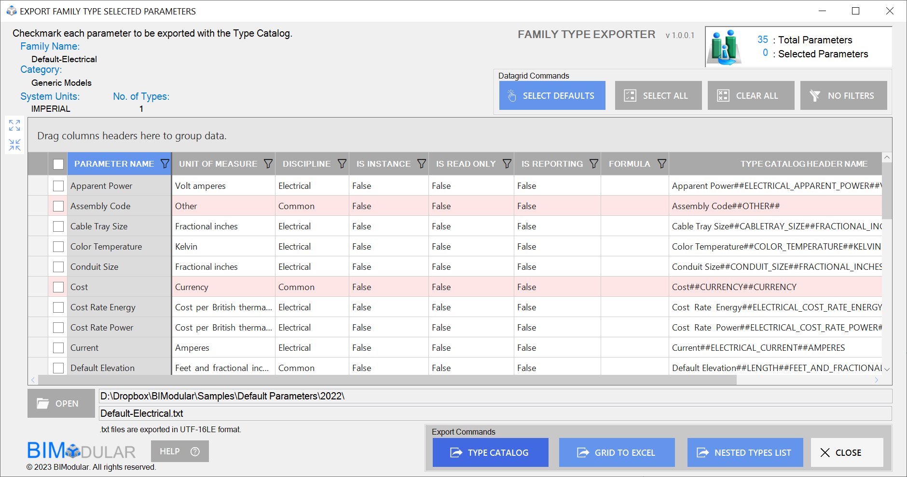
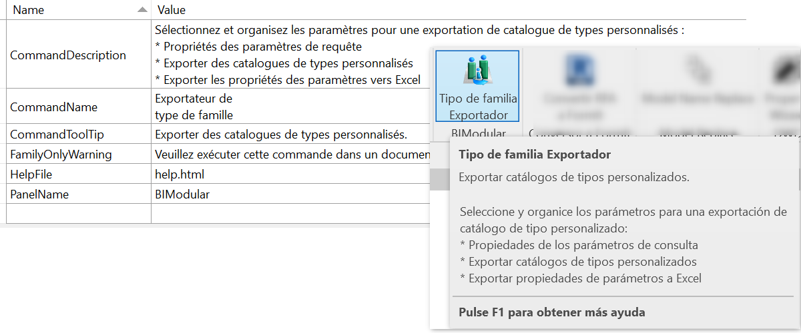

<head>
<meta http-equiv="Content-Type" content="text/html; charset=utf-8">
<link rel="stylesheet" type="text/css" href="bc.css">

</head>

<!---

- email
  promote Autodesk Platform Services Developer Conference Europe - DevCon 2023 Sept 11-12 in Munich

- resx mnanagement language
  https://forums.autodesk.com/t5/revit-api-forum/revit-add-in-with-multiple-language-forms-based-on-current-ui/m-p/12140874#M73102

twitter:

Autodesk Platform Services APS @AutodeskAPS Developer Conferences, @AutodeskRevit #RevitAPI add-in localisation and i18n, RESX language management, ribbon panel localisation and creating the localised WinForms #BIM @DynamoBIM  https://autode.sk/resxlanguage

The Autodesk Platform Services APS Developer Conferences are coming up, and we all need to deal
with application localisation and i18n issues
&ndash; Resx language management
&ndash; Ribbon panel localisation
&ndash; Creating the localised WinForms...

linkedin:

Autodesk Platform Services APS Developer Conferences, #RevitAPI add-in localisation and i18n, RESX language management, ribbon panel localisation and creating the localised WinForms:

https://autode.sk/resxlanguage

#BIM #DynamoBIM #AutodeskAPS #Revit #API #IFC #SDK #Autodesk #AEC #adsk

the [Revit API discussion forum](http://forums.autodesk.com/t5/revit-api-forum/bd-p/160) thread

-->

### Resx Language Management and APS DevCons

This year's [Autodesk Platform Services APS](https://aps.autodesk.com/) Developer Conferences are
coming up soon, and we all (well, many of us) need to deal
with [application localisation and i18n](https://en.wikipedia.org/wiki/Internationalization_and_localization) issues:

- [APS Developer Conferences](#2)
- [Resx language management](#3)
- [Ribbon panel localisation](#3.1)
- [Creating localised WinForms](#3.2)

#### APS Developer Conferences

The [Autodesk Developer Conferences DevCon](https://aps.autodesk.com/blog/register-autodesk-devcon-2023) are
coming up soon.

These two-day events will be hosted in:

- [San Francisco, California](https://aps.autodesk.com/devcon):
  The Historic Klamath Ferry on September 6-7, 2023
- [Munich, Germany](https://cvent.autodesk.com/w9DQ5Q?rt=99uCmbte1U6VS9RyVp0Gnw&RefId=Generic):
  Holiday Inn Munich - Westpark on September 11-12, 2023

These events are a great opportunity for software developers and business innovators to learn about leading edge technology from Autodesk experts, network with other developers and business leaders, as well as see how our desktop APIs and cloud-based [Autodesk Platform Services APS](https://aps.autodesk.com/) (formerly Forge) can power their company’s growth and digital transformation. This is also a great opportunity for Autodesk to engage with its 3rd party development community, learn more about their projects and how they are using our APIs.

All the up to date information as well as both registration links are provided in
the [main blog post](https://aps.autodesk.com/blog/register-autodesk-devcon-2023).

This is a 2-day event which will provide deep technical training as well high-level overview on Autodesk Platform Services and Autodesk APIs. If you want to learn about Autodesk applications to improve workflows, learn from Autodesk engineers and technology decision-makers as well as other industry professionals, this event will provide all the education and networking you need. You’ll bring back very valuable insights to apply to your work.

The [European DevCon agenda](img/devcon_eu_2023_agenda.pdf) provides
a detailed overview of the sessions planned.

Space is limited and we expect this event to sell out.

You still have a chance to save 50% on your EU ticket until this weekend: 180 euro instead of 360.

As always, please feel free to reach out if you have any questions.

As [Kean Walmsley points out](https://www.keanw.com/2023/06/register-today-for-autodesk-devcon-2023-in-munich.html),
it’s also a special time to be in Munich,
with [Oktoberfest starting the following weekend](https://www.oktoberfest.de/en/information/when-is-oktoberfest),
on September 16th.

#### Resx Language Management

[Geoff Jennings](https://www.linkedin.com/in/geoffrey-jennings-9984921/) ([@GJennings-BM](https://forums.autodesk.com/t5/user/viewprofilepage/user-id/9888344)) of [BIModular](https://bimodular.com)
brought up and with help
from Luiz Henrique [@ricaun](https://ricaun.com/) Cassettari solved
important aspects of Revit add-in localisation in
the [Revit API discussion forum](http://forums.autodesk.com/t5/revit-api-forum/bd-p/160) thread
on [Revit Add-in with Multiple Language Forms based on Current UI Culture](https://forums.autodesk.com/t5/revit-api-forum/revit-add-in-with-multiple-language-forms-based-on-current-ui/m-p/12140874):

**Question:** I am struggling to get my C# code correct to convert my user forms into each culture.
I tried for days, but I cannot get my labels to change languages when opening Revit in different language versions.
I can get my Ribbon Panel button to change languages using a RibbonResources.resx file in my App.cs, but my FormExport.resx files are not providing language translation values.

<pre class="prettyprint">
public FormExport(Autodesk.Revit.DB.Document doc)
{
  CultureInfo cultureName = new CultureInfo(Thread.CurrentThread.CurrentUICulture.Name);
  string cultureRef = cultureName.Name;
  Thread.CurrentThread.CurrentCulture = CultureInfo.CreateSpecificCulture(cultureRef);
  Thread.CurrentThread.CurrentUICulture = CultureInfo.CreateSpecificCulture(cultureRef);

  InitializeComponent();
  familyDocument = doc;

  // Get the localized label text from the resource .resx file
  string localizedLabelText = GetLocalizedTextFromResource("lblFamilyName.Text");
  string localizedHeaderText = GetLocalizedTextFromResource("lblHeader.Text");

  // Set the label text with the localized value
  lblFamilyName.Text = localizedLabelText;
  lblHeader.Text = localizedHeaderText;
}
</pre>

I have this function set below my form code:

<pre class="prettyprint">
private string GetLocalizedTextFromResource(string key)
{
  try
  {
    // Load the appropriate resource file based on the user's selected language
    ResourceManager resourceManager = new ResourceManager("MyApp.FormExport", typeof(FormExport).Assembly);
    CultureInfo currentCulture = Thread.CurrentThread.CurrentUICulture;
    // Fetch the localized text for the given key from the resource
    string localizedText = resourceManager.GetString(key, currentCulture);
    // If the resource for the given key is not found in the selected culture,
    // explicitly load the default resource (English) using CultureInfo.InvariantCulture
    if (localizedText == null)
    {
      localizedText = resourceManager.GetString(key, CultureInfo.InvariantCulture);
    }
    // If the resource is still not found, return the key itself as a fallback
    return localizedText ?? key;
  }
  catch (MissingManifestResourceException ex)
  {
    // Log the exception
    Console.WriteLine($"Resource file not found. Exception: {ex.Message}");
    return key; // Return the key itself as a fallback
  }
}
</pre>

My form `.resx` files are:

- FormExport.resx
- FormExport.en.resx
- FormExport.fr.resx
- ... (continued)

I am testing various options.
Here is just a small list sites I have researched and tested against:

- [Create the Multilingual .bundle file](https://adndevblog.typepad.com/aec/2013/08/localized-applications-for-the-revit-exchange-store.html)
- [All Language Revit Versions](https://help.autodesk.com/view/RVT/2020/ENU/?guid=GUID-BD09C1B4-5520-475D-BE7E-773642EEBD6C)
- [Language Tags](https://forums.autodesk.com/t5/revit-api-forum/localization-of-add-in-multilanguage/td-p/8936144)
- [Get Revit Language](https://www.revitapidocs.com/2015/2b1d8b80-a11c-2a57-63bd-6c0d67691879.htm)
- [Family Content Localization](https://thebuildingcoder.typepad.com/blog/2013/02/content-localisation.html)
- [Another Resource for Creating Resx files and Revit UI Culture](https://thebuildingcoder.typepad.com/blog/2017/02/multiple-language-resx-resource-files.html)
- [Label Control for BuiltIn Parameter Languages](https://www.revitapidocs.com/2022/c38e7823-31b3-9bcd-5ab0-d353e0d39fa8.htm)
- [Localize Ribbon](https://help.autodesk.com/view/RVT/2022/ENU/?guid=Revit_API_Revit_API_Developers_Guide_Introduction_...)

It has become very confusing since everyone seems to have a different method.
I am simply building a C# .Net app for Revit under the Add-in tab.
I have five WinForms.
One is a primary WinForms and the other WinForms support secondary operations.
This is all been built in Visual Studio 2022 for Revit 2021-2024.
The app has been submitted to the app store for publishing.
Now, I just need to prepare the WinForms for a larger international base of users.

It should be extremely simple.
Again, I have my ribbon panel working for any language, but the translations of my WinForms are my challenge.
Beyond the sites listed below, I spent hours reviewing YouTube videos, ChatGPT, reading manuals, and website blogs.
In Visual Studio, I have done the process of setting each form to 'Localizable' = true, then Language = "France, Spanish,...", customized the forms for .resx files.  I have tested with separate manual .resx files, and tons of programming methods.  Frustrating for something that is effectively a basic task.

I am hoping someone can provide c# .net guidance showing the code requirements of a single form that references the appropriate .resx based upon the user's Revit language version.
I currently have a `Forms` folder for all of my WinForms and their associated `.resx` language files.

**Answer:** The `.resx` file should swap automatically when depending on the `CultureInfo`; if the resource is now changed automatically probably your key language is different from the CultureInfo in the application, like `en` is different from `en-US` and `fr` is different from `fr-FR`.
Just update your resource file name to match the same `CultureInfo` that Revit uses.
Here is a [table listing all the languages and keys](https://github.com/ricaun/RevitAddin.ResourcesExample).

**Response:** Thank you for your answer and excellent quality video of your .resx management.
Your methods will be useful on some other apps I plan to create.

I was finally successful at getting my C# Winforms to show in any UICulture languages!
I want to share this information with others:

#### Ribbon Panel Localization

I added a language switcher file based on Andrey Bushman's sample file.
This has been modified to `RVTLanguages.cs`.
The file was placed in my root folder below my C# project name.
In the same location, I also created three .resx files:

- RibbonResources.resx (empty &ndash; set to `Internal`)
- RibbonResources.en-US.resx (my panel data &ndash; see image below)
- RibbonResources.fr-FR.resx (my French translations)

To keep my panel button narrow and allow for wrapping of text, I created two lines in the .resx file:

 <!-- Pixel Height: 417 Pixel Width: 1,686 -->

In my `App.cs`:

<pre class="prettyprint">
public Result OnStartup(UIControlledApplication application)
{

#region READ AND SET THE LANGUAGE ENVIRONMENT USING THE RVTLanguages.cs file
  RVTLanguages.Cultures(application.ControlledApplication.Language);
  ResourceManager res_mng = new ResourceManager(typeof(RibbonResources));
#endregion

  RibbonPanel p = application.CreateRibbonPanel(RibbonResources.ResourceManager.GetString("PanelName"));

  string thisAssemblyPath = Assembly.GetExecutingAssembly().Location;
  string buttonText1 = RibbonResources.ResourceManager.GetString("CommandName1");
  string buttonText2 = RibbonResources.ResourceManager.GetString("CommandName2");

  PushButtonData btnMyApp = new PushButtonData("btnMyApp", buttonText1 + "\n" + buttonText2, thisAssemblyPath, typeof(Command).FullName)
  {
    LargeImage = imgSrc,
    Image = imgSrcTB,
    LongDescription = RibbonResources.ResourceManager.GetString("CommandDescription"),
    ToolTip = RibbonResources.ResourceManager.GetString("CommandToolTip")
  };

  // set help file to reference .bundle file help.html
  string helpFolder = Path.Combine(parentFolder, "help.html");
  ContextualHelp contextHelp = new ContextualHelp(
  ContextualHelpType.ChmFile, helpFolder);
  btnMyApp.SetContextualHelp(contextHelp);

  p.AddItem(btnMyApp);
</pre>

This was all that was required for setting up a localized ribbon button:

 <!-- Pixel Height: 430 Pixel Width: 1,200 -->

#### Creating Localized WinForms

I created a folder called `Forms` and then placed all of my WinForms under this folder.
After my forms were created, I then manually created two new `.resx` files, for example, `MyForm.en-US.resx` and `MyForm.fr-FR.resx`.
These files were placed in the Forms folder along with my main WinForm.

In my Winform code I did the following in `MyForm.cs`:

<pre class="prettyprint">
public sealed class UICultureSwitcher : IDisposable
{
  CultureInfo previous;
  public UICultureSwitcher()
  {
    CultureInfo culture = new CultureInfo(Thread
    .CurrentThread.CurrentCulture.Name);

    previous = Thread.CurrentThread.CurrentUICulture;
    Thread.CurrentThread.CurrentUICulture = culture;
   }
   void IDisposable.Dispose()
   {
     Thread.CurrentThread.CurrentUICulture = previous;
   }
}

public MyForm( Autodesk.Revit.DB.Document doc)
{
    ResourceManager res_mng = new ResourceManager(typeof(MyForm));
    ResourceSet resourceSet = res_mng.GetResourceSet(Thread.CurrentThread.CurrentUICulture, true, true);

    InitializeComponent();
    familyDocument = doc;

    label1.Text = GetLocalizedTextFromResource("label1Text");
    label2.Text = GetLocalizedTextFromResource("label2.Text");
    label3.Text = GetLocalizedTextFromResource("label3.Text");
    label4.Text = GetLocalizedTextFromResource("label4.Text");

    // rest of code ...
}
</pre>

Below I have a function that will collect the necessary language information in the .resx file:

<pre class="prettyprint">
private string GetLocalizedTextFromResource(string key)
{
  try
  {
    // Load the appropriate resource file based on the user's selected language
    ResourceManager resourceManager = new ResourceManager("MyApp.Forms.MyForm", typeof(MyForm).Assembly);
    CultureInfo currentCulture = Thread.CurrentThread.CurrentUICulture;

    // Fetch the localized text for the given key from the resource
    string localizedText = resourceManager.GetString(key, currentCulture);

    // If the resource for the given key is not found in the culture,
    // explicitly load the default resource (English) using CultureInfo.InvariantCulture
    if (localizedText == null)
    {
      localizedText = resourceManager.GetString(key, CultureInfo.InvariantCulture);
    }

    // If the resource is still not found, return the key itself as a fallback
    return localizedText ?? key;
  }
  catch (MissingManifestResourceException ex)
  {
    // Handle the exception if the resource file is not found
    // Log the exception
    Console.WriteLine($"Resource file not found. Exception: {ex.Message}");
    return key; // Return the key itself as a fallback
   }
}
</pre>

I then repeat the same methods for my other forms.
Here are screenshots of the end results:

FamilyType Exporter EN

 

FamilyType Exporter FR

Now, I am updating the datagrid based upon a similar workflow.

I truly hope this helps others.
This has been a very confusing journey.
Everything mentioned was done in Visual Studio 2022 and for Revit 2022-2024:

- [Source code module RVTLanguages.cs](zip/ribbon_resx_rvtlanguages.zip)

**Answer:** Neat!

I believe setting the *Thread.CurrentThread.CurrentUICulture* and *Thread.CurrentThread.CurrentCulture* is not necessary to make multilanguage work, Revit already starts with the `CultureInfo` correctly set; the only reason to change it might be to test whether your Form is working in another `CurrentUICulture` language.
Using your class `UICultureSwitcher` does the trick.

And why are you using `CommandName1` and `CommandName2` to create the second line? Just one single `CommandName` entry with multiple lines should work, like your `CommandDescription` that has multiple lines.

**Response:** You are correct about the CommandName1 and CommandName2.
I originally created the two strings before I did the multiline commandDescription.
Previously, I had tried the "\r\n" method in the .resx file and it was making it part of a single full string versus giving me two lines of strings.
I changed the .resx files for my Ribbon code and generated the Spanish version.
The single CommandName with a `shift`+`return` allows for the multiple lines in the ribbon button:

FamilyType Exporter ES

 

As for the language switcher, I have plans for expanding functionality for an upcoming Pro version of the app.

Thanks again for your video and quick response.

Many thanks to Geoff and Luiz for clarifying the confusion and sharing the solution!
