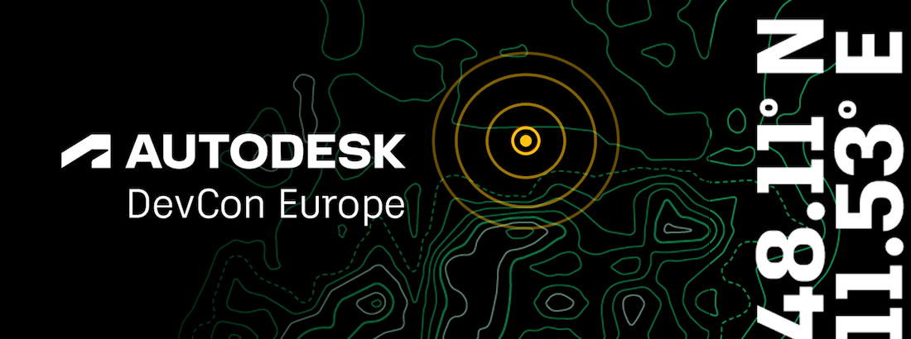

<head>
<meta http-equiv="Content-Type" content="text/html; charset=utf-8">
<link rel="stylesheet" type="text/css" href="bc.css">

</head>

<!---

- email
  promote Autodesk Platform Services Developer Conference Europe - DevCon 2023 Sept 11-12 in Munich

- resx mnanagement language
  https://forums.autodesk.com/t5/revit-api-forum/revit-add-in-with-multiple-language-forms-based-on-current-ui/m-p/12140874#M73102

twitter:

 with the @AutodeskRevit #RevitAPI #BIM @DynamoBIM @AutodeskAPS

&ndash;  ...

linkedin:

#BIM #DynamoBIM #AutodeskAPS #Revit #API #IFC #SDK #Autodesk #AEC #adsk

the [Revit API discussion forum](http://forums.autodesk.com/t5/revit-api-forum/bd-p/160) thread

-->

### Resx Language Management and EU DevCon

#### EU APS DevCon

**Question:**

**Answer:**

**Response:**

####

<pre class="prettyprint">

</pre>

####

####

Many thanks, !

