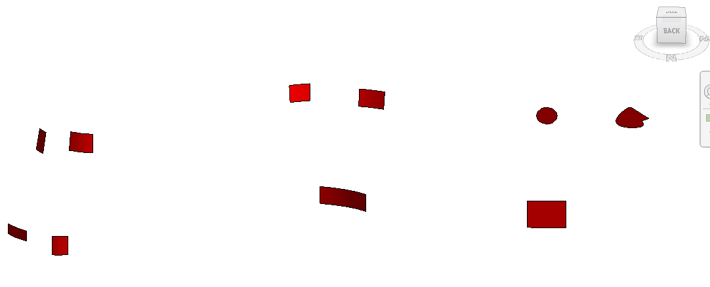

<head>
<meta http-equiv="Content-Type" content="text/html; charset=utf-8">
<link rel="stylesheet" type="text/css" href="bc.css">

</head>

<!---

- tbc 15th birthday august 22, almost passed its puberty by now, soon a grown-up blog, assuminbg human time spans for maturilty

- .net core migration coming in september
  dropping macro support for document macros
  https://thebuildingcoder.typepad.com/blog/2022/05/analysis-of-macros-journals-and-add-in-manager.html#2
  how to convert form project to application macro

- .net core 5
  https://autodesk.slack.com/archives/C0531NMR189/p1692239493644339
  Mona Khanapurkar
  thanks for checking here. We are targeting a preview release in Fall 2023. As soon as we can get Revit to build with the updated .Net version we will be in a better position to provide the details. In the meantime, below is a rough draft for communications. CC
  https://www.keanw.com/2023/08/the-next-release-of-autocad-and-net.html
  https://adndevblog.typepad.com/autocad/2023/08/call-for-action-next-release-of-autocad.html
  autocad and civil3d already published the preview
  revit is still working on it
  acad is platform
  revit has many dependencies (dynamo, inventor) and addons
  microsoft is releasing .net code 8 in november
  acad migrated to .net core 6
  inventor went straight to 7
  revit is debating whether to move straight to 7 or 8
  acad worked around the problem preventing 6 and are now discussing moving straight to 7 as well
  all products are using acad components
  revit september preview will not contain anything yet
  revit november is not guaranteed
  point to autocad one
  dynamo also annouced that they are working on it
  familiarise yourself with the Revit feedback portal now.
  then you will be ready to check out the new Revit API as soon as it becomes available

- polygon area algorithms
  https://forums.autodesk.com/t5/revit-api-forum/area-of-a-wall-opening/m-p/12174104#M73476

- AI recreates clip of Pink Floyd song from recordings of brain activity
  https://www.newscientist.com/article/2387343-ai-recreates-clip-of-pink-floyd-song-from-recordings-of-brain-activity/

- Allie K. Miller on LinkedIn: You can now write one sentence to train an entire ML model.
  185 comments
  You can now write one sentence to train an entire ML model.
  How does it work?
  You just describe the ML model you want ... a chain of AI systems will take that ...
  https://www.linkedin.com/posts/alliekmiller_you-can-now-write-one-sentence-to-train-an-activity-7097974848001331200-DtJE?utm_source=share&utm_medium=member_desktop\

- compression and size reduction
  1759026 Aug 22 11:33 2023-09-01_nachbarschaftstreffen.jpg height 3506 pixel
   850770 Aug 22 13:01 2023-09-01_nachbarschaftstreffen1.jpg compressed using https://compressjpeg.com/
   149291 Aug 22 13:03 2023-09-01_nachbarschaftstreffen2.jpg height 900
    97220 Aug 22 13:03 2023-09-01_nachbarschaftstreffen3.jpg compressed using https://compressjpeg.com/
  factor ca. 18.1

twitter:

The Building Coder 15-year birthday celebration, @AutodeskRevit #RevitAPI with .NET Core and macro prospects, and polygon area algorithms to determine wall area without openings #BIM @DynamoBIM @AutodeskAPS https://autode.sk/dotnetcoreprospect

A birthday celebration, a forward-looking statement or two and observations on geometry, AI and emissions
&ndash; 15 years of The Building Coder
&ndash; Revit API with .NET Core
&ndash; Bye-bye document macro?
&ndash; Polygon area algorithms
&ndash; AI recreates Pink Floyd from brain activity
&ndash; Create ML model with one sentence?
&ndash; Compress greenhouse gas emissions...

linkedin:

jeremytammik

https://www.linkedin.com/posts/jeremytammik_15-years-polygon-areas-and-net-core-activity-7100129768016093185-SO6O

BIM Experts

https://www.linkedin.com/feed/update/urn:li:activity:7100129808394641409

The Building Coder 15-year birthday celebration, #RevitAPI with .NET Core and macro prospects, and polygon area algorithms to determine wall area without openings

https://autode.sk/dotnetcoreprospect

- 15 years of The Building Coder
- Revit API with .NET Core
- Bye-bye document macro?
- Polygon area algorithms
- AI recreates Pink Floyd from brain activity
- Create ML model with one sentence?
- Compress greenhouse gas emissions...

#BIM #DynamoBIM #AutodeskAPS #Revit #API #IFC #SDK #Autodesk #AEC #adsk

the [Revit API discussion forum](http://forums.autodesk.com/t5/revit-api-forum/bd-p/160) thread

-->

### 15 Years, Polygon Areas and .NET Core

A birthday celebration,
a [forward-looking statement](https://en.wikipedia.org/wiki/Forward-looking_statement) or two
and observations on geometry, AI and emissions:

- [15 years of The Building Coder](#2)
    - [Congratulations](#2.1)
- [Revit API with .NET Core](#3)
- [Bye-bye document macro?](#4)
- [Polygon area algorithms](#5)
- [AI recreates Pink Floyd from brain activity](#6)
- [Create ML model with one sentence?](#7)
- [Compress greenhouse gas emissions](#8)

#### 15 Years of The Building Coder

We celebrated The Building Coder's 15th birthday yesterday, August 22.

 <!-- Pixel Height: 810 Pixel Width: 1,160 -->

It has soon passed its puberty now and is almost a full grown-up blog now, preparing to stand on its own legs.
And, in case you didn't know, this is blog post number 2005.
We silently crossed into the third millennium in July.

#### Congratulations

On [LinkedIn](https://www.linkedin.com/posts/jeremytammik_15-years-polygon-areas-and-net-core-activity-7100129768016093185-SO6O):
and [BIM Experts](https://www.linkedin.com/feed/update/urn:li:activity:7100129808394641409):

- Tim Hoffeller:
  Thank you Jeremy, for all the inspiration through all those years! The BIM world would be a less creative one without you 😊
- Prasad Sumanasekara, MagiCAD Group AB:
  Congratulations ...!!!
- Alex Vila Ortega, WSP, Sydney:
  Congrats!!!
- Diego Mendoza Acosta, Ingeniero Civil:
  Congratulations !!!
- Simon Jones, Freelance BIM Consultant & Developer, AEC BIM Tools:
  Congratulations Jeremy &ndash; glad to see it still going!
- José Ignacio Montes Herraiz, North London Heat Power Project:
  Congratulations Jeremy!
- Stephen Preston, Developer Relations and Platform Ecosystems leader:
  Congratulations Jeremy. This is a great achievement. Its heartwarming to think of the many people you've helped in their careers, businesses and hobbies by sharing your knowledge.
- Matt Taylor, WSP Aotearoa:
  Happy birthday TBC/Jeremy! Thanks for all you do.
- Emile Kfouri, Senior Technology Product Leader:
  Amazing! I remember your first blog post and thinking what an amazing thing it was going to be for Revit. Thank you for helping all of us be better developers and solve problems we could not solve on our own.
- Madhukar Moogala, Principal Developer Advocate at Autodesk:
  Congrats Jeremy an epic milestone ! 😀
- Chris Theobald, Technology Officer at SCS:
  Happy 15th!
- Ali Najmi, BIMLOGiQ:
  Congrats Jeremy, Thanks for all that hard work over the past 15 years
- João Teixeira, Software Solutions for AEC and Manufacturing:
  Congrats for all the contributions to the community over the last 15 years! Keep up the excellent work!
- Kean Walmsley, Software Architect & Senior Manager, Convergence Engineering, Autodesk Research:
  Congratulations, Jeremy! It's been wonderful seeing TBC go from strength to strength with your continued focus and investment. A fantastic milestone and achievement!
- Chuong Ho, Computational Design Researcher:
  Thank you Jeremy, your blog is awesome.
- Carlos Ernesto Suárez Guerra, EMPAI:
  Congratulations!!!!!
- Nastya Baranouskaya, Software engineer and BIM Manager:
  Congratulations!!!
- Wouter Hilhorst, Projectleider bij OPL architecten / re-designers:
  Congratulations! The next 15 years From API to AI?
- Lester Molina Espinosa, Sr. Principal CAD/BIM Designer:
  Happy 15th birthday!!! Well done Jeremy. Keep up the good work!
- Michelangelo Capraro, Autodesk:
  I reference your pages constantly, what a great community resource, congrats!
- Boy d'Hont, Senior Architect / BIM Programmer at WGA Architects:
  Thank you for all your input for the API. You brought the polish that made that rusty old Revit shine.
- Luís Filipe Santos, Architect at OSLO WORKS:
  Congrats for the great blog and all the help building plugins for Revit!
- Jakob Hirn, BIM, digital twins, building data platforms, Revit training, CAD-CAM automation:
  Happy Birthday and thanks a lot for all the work you’ve done for the Revit community in these years. 🙏

Thank you all and the entire Revit add-in developer community for your appreciation and support!

#### Revit API with .NET Core

A number of questions were raised in
the [Revit API discussion forum](http://forums.autodesk.com/t5/revit-api-forum/bd-p/160) on
Revit API support for .NET Core, e.g.:

- [Does Revit target .NET standard](https://forums.autodesk.com/t5/revit-api-forum/does-revit-target-net-standard/m-p/9792894?search-action-id=812462935117&search-result-uid=9792894)
- [Revit API should support .NET 5+](https://forums.autodesk.com/t5/revit-api-forum/revitapi-should-support-net-5/m-p/10533160?search-action-id=812462935117&search-result-uid=10533160)
- [TypeLoadException on addin startup after changing project to .NET 5](https://forums.autodesk.com/t5/revit-api-forum/typeloadexception-on-addin-startup-after-changing-project-to-net/m-p/10341283?search-action-id=812462935117&search-result-uid=10341283)
- [Has anyone been successful in building a NetStandard-2.0 or Net-5.0 plug-in?](https://forums.autodesk.com/t5/revit-api-forum/has-anyone-been-successful-in-building-a-netstandard-2-0-or-net/m-p/10694884?search-action-id=812462935117&search-result-uid=10694884)

More significantly, we have
a [Revit Idea Station](https://forums.autodesk.com/t5/revit-ideas/idb-p/302)
[wishlist item for .NET version 6](https://forums.autodesk.com/t5/revit-ideas/net-version/idc-p/12196972) that
has now been accepted:

- **Request:** Could you use .NET 6 for the Revit API?
That would greatly improve the quality of the tools I develop.
The use of .NET 6 would also improve Revit's performance as it is faster and more efficient than the .NET framework.
Also, with a .NET version greater than .NET 5 comes C# 9, which offers newer and more functionality for developing with the Revit API.
Furthermore, with the latest version of .NET comes the latest version of WPF, which offers better looks and overall improvements.
- **Response:** Status changed to: Accepted. Congrats!
We think this is a great idea, so we've decided to add it to our roadmap.
Thanks for the suggestion!
To follow the progress of features in development, please see
the [Revit Public Roadmap](https://blogs.autodesk.com/revit/roadmap/) and join
the [Revit Preview Release](https://feedback.autodesk.com/key/LHMJFVHGJK085G2M) to
participate in feature testing.
(Note that Accepted Ideas may not be immediately available.)

The Factory

Sol Amour has covered most of what can be said on this topic in his overview of [Dynamo upgrading to .NET 6](https://forum.dynamobim.com/t/dynamo-upgrading-to-net-6).

Madhukar Moogala and Kean Walmsley have already published some information about the situation in AutoCAD and Civil3D:

- [Call for Action : Next Release of AutoCAD API](https://adndevblog.typepad.com/autocad/2023/08/call-for-action-next-release-of-autocad.html)
- [The next release of AutoCAD and .NET](https://www.keanw.com/2023/08/the-next-release-of-autocad-and-net.html)

AutoCAD and Civil3D have published preview versions with .NET Core 6 support for developers to explore.
However, it is by no means clear yet which version of .NET Core will be targeted by their next major releases.
Microsoft may release [.NET Core 8 in November](https://devblogs.microsoft.com/dotnet/announcing-dotnet-8-preview-7/).

So, as you can imagine, we will probably be facing a similar transition in the Revit API as well.
The situation for Revit is complicated by dependencies, addons, and other components and relationships to consider.
The development team is still working out the details.

So, basically, all we can say about this at the moment is that we are working on it, and it remains a moving target.

Please keep your eyes peeled for the Revit preview releases.
There is no guarantee yet by when the internal dependencies will have settled enough to include a version of the Revit API supporting .NET Core in a Revit preview release.
It may take until the end of the year.

What can I do right now?

Above all, if you are interested in this topic, please ensure that you have joined the Revit feedback community and have access to the upcoming preview releases for evaluation.
Then, you can also participate in the feedback forum discussions.
Familiarise yourself with the Revit feedback portal now.
Then you will be ready to jump in and actively join the fray as soon as possible.

#### Bye-Bye Document Macro?

In the course of revamping the Revit API, the development team also took a look at the macro environment.
Support for .NET Core will obviously affect that as well.
Last year, they asked for feedback from the add-in developer community
on [how you use Revit macros](https://forums.autodesk.com/t5/revit-api-forum/research-how-do-you-use-revit-macros/m-p/11158305)
and [shared back the results](https://thebuildingcoder.typepad.com/blog/2022/05/analysis-of-macros-journals-and-add-in-manager.html#2).

As a result of this and other usage analysis, the current plan is to drop support for document macros.
Converting a document macro to an application macro is easy, and I hope to share some simple instructions on that anon.

#### Polygon Area Algorithms

Moving on from plans and speculations about what the future might bring,
Richard [RPThomas108](https://forums.autodesk.com/t5/user/viewprofilepage/user-id/1035859) Thomas
shared some valuable hints and examples of polygon area algorithms answering a question on how to obtain
the [area of a wall opening](https://forums.autodesk.com/t5/revit-api-forum/area-of-a-wall-opening/m-p/12174104):

**Question:** How can I calculate the area of a wall opening?
I cannot delete any object.

**Answer:** You can delete an object temporarily inside a transaction that is never committed, so the changes are never stored in the database:

- [Calculating gross and net wall areas](http://thebuildingcoder.typepad.com/blog/2015/03/calculating-gross-and-net-wall-areas.html)
- [Gross and net wall area calculation enhancement](https://thebuildingcoder.typepad.com/blog/2015/04/gross-and-net-wall-area-calculation-enhancement-and-events.html)

**Response:** I cannot delete elements, even transitory.

**Answer:** Here is a possible solution, except for ruled faces (for ruled faces, there must be a mathematical approximation similar to below):

Generally, for other types of faces you can find the inner loops of the face and use `Edge.GetCurveUV` to create a loop in the dimensions of the face parameters.
Unfortunately, there is no tessellate for `CurveUV`, but you can evaluate points along the loop to get a set of ordered UVs.
Each `U` and `V` can then be multiplied based on how the face is parameterised in that direction, i.e., for a planar face, it 1 in both directions, but for a cylindrical face the `U` is based on angles, so, instead you have to multiply it based on radius to get the segment length (`V` is still in length, so you can use 1 for that).
Prior to the existence of `CurveUV`, you would likely have had to have used `Edge.EvaluateOnFace` to create the tessellated points.

Once you've multiplied the UV's, you can create a polygon and use
the [shoelace formula](https://en.wikipedia.org/wiki/Shoelace_formula) etc. to find the area of the polygon and so the surface area of the opening.

It is hard for faces with normalised parametrisation (such as ruled faces), because the multiple used to convert normalised to raw in one direction changes along the other direction.
For example, if you have a ruled surface between two lines of different length, one at the base (Vmin) and one at the top (Vmax), the length varies from base to top, so how you convert `U` to raw parameter isn't constant, but varies according to the height of `V` where `U` is being measured.

How we measure openings in surfaces can also be a bit subjective to a degree.
If you have a cylindrical wall, then the area for the same opening on the outer face will be larger than the inner, but neither, I suspect, will likely be the thing that is useful to an MEP engineer.
I assume they would likely want the projected (flat opening area).
For this, you would probably have to take the worst case (inner area) and project it onto a plane to establish what can fit into that 2D area (or how much ventilation you have).

Another method I used in the past for 2D is to tesselate the perimeter and fill the opening with a grid of points, then
use [Delaunay triangulation](https://en.wikipedia.org/wiki/Delaunay_triangulation) etc., adding up the sum area of resulting triangles.
The area is always slightly underestimated for concave edges and slightly overestimated for convex edges.
Using smaller triangles obviously improves that but also increases processing time.

Another option is to create a single faced solid over the opening with one of the shape builders.
Some surface types are not supported by all shape builders, however.

 <!-- Pixel Height: 450 Pixel Width: 1,087 -->

You can then extract the surface area of those.

 <!-- Pixel Height: 439 Pixel Width: 1,082 -->

I think walls are quite simple compared to floors.
In shaped floors, especially, you don't always get inner loops.
For example, in the below there are no inner loops.
The thing you do know however is that the actual outline edges always have vertical faces adjacent.
Therefore, fold edges always contain two horizontal or quasi-horizontal faces.
So, by elimination of those that way, you are left with the outline edge curves and it is then just a case of ordering them into loops and determining if they are outer or inner.
You can't rely on direction of curve for that because in reality they are all outer edges to their face.

 <!-- Pixel Height: 566 Pixel Width: 1,065 -->

So, there isn't a universal solution to these things.

Many thanks to Richard for sharing his thoughts and extensive experience on this!

#### AI Recreates Pink Floyd from Brain Activity

Let me briefly point out two AI-related news items that I found interesting:

- [AI recreates clip of Pink Floyd song from recordings of brain activity](https://www.newscientist.com/article/2387343-ai-recreates-clip-of-pink-floyd-song-from-recordings-of-brain-activity/)

#### Create ML Model with one Sentence?

For a lengthier discussion on how ML can be used or misused, check out the several hundred comments
on [Allie K. Miller's post on LinkedIn: You can now write one sentence to train an entire ML model](https://www.linkedin.com/posts/alliekmiller_you-can-now-write-one-sentence-to-train-an-activity-7097974848001331200-DtJE):

> How does it work?
You just describe the ML model you want...
a chain of AI systems will take that...

#### Compress Greenhouse Gas Emissions

Please compress stuff!

It is worthwhile paying attention to the carbon footprint of today's widespread and growing usage of the Internet and digital devices.

Some estimates deem it comparable with the pollution generated by airlines and flying.

I just checked out the effect of reduction of resolution and compression (using [compressjpeg.com](https://compressjpeg.com/)) on an image that I emailed to some friends:

- a0.jpg &ndash; 3506 pixel height original &ndash; 1.759.026 bytes
- a1.jpg &ndash; 3506 pixel height compressed &ndash; 850.770 bytes
- a2.jpg &ndash; 900 pixel height  &ndash; 149.291 bytes
- a3.jpg &ndash; 900 pixel height compressed &ndash; 97.220 bytes

The shrunk and compressed image was virtually indistinguishable from the original &ndash; it was even a bit easier to read due to slightly higher contrast.

The combination of lower pixel count and compression reduced the size from over 1.7 MB to less than 100 kB, by a factor of over 18.

<!--

2023-09-02 another bafudi email list image to send
564769 original image, pixel width > 1800
180374 reduced width = 900
96328 [compressjpeg.com](https://compressjpeg.com)
less radical savings, factor of 5.9

-->

Some supporting articles that I checked out:

- Wikipedia entry on [Greenhouse gas](https://en.wikipedia.org/wiki/Greenhouse_gas)
- [Greenhouse emissions by sector](https://ourworldindata.org/emissions-by-sector)
- [Powering the Internet: your virtual carbon footprint infographic](https://www.webfx.com/blog/marketing/carbon-footprint-internet/)
- [The Internet’s invisible carbon footprint](https://foundation.mozilla.org/en/blog/ai-internet-carbon-footprint/)
> Did you know that writing an email can send 17 grams or more of carbon dioxide into the atmosphere?
Or that going audio-only on Zoom calls reduces carbon emissions by up to 96%?

 <!-- Pixel Height: 1,233 Pixel Width: 1,302 -->

<!--

img/internet_carbon_footprint.png

carbon footprint of driving versus flying

flight Basel-Malaga Roundtrip ca. 3,100 km, 2 travellers
CO2 amount: 1.2 t

https://co2.myclimate.org/en/portfolios?calculation_id=6115626

car Basel-Garnatilla
1935 km
CO2 amount: 0.476 t
return trip 1 t

Emissions by sector
https://ourworldindata.org/emissions-by-sector
greenhouse_emissions_by_sector.png

The Internet’s Invisible Carbon Footprint
https://foundation.mozilla.org/en/blog/ai-internet-carbon-footprint/
> Did you know that writing an email can send 17 grams or more of carbon dioxide into the atmosphere? Or that going audio-only on Zoom calls reduces carbon emissions by up to 96%?

Powering the Internet: Your Virtual Carbon Footprint [Infographic]
https://www.webfx.com/blog/marketing/carbon-footprint-internet/
internet_carbon_footprint.png

-->
