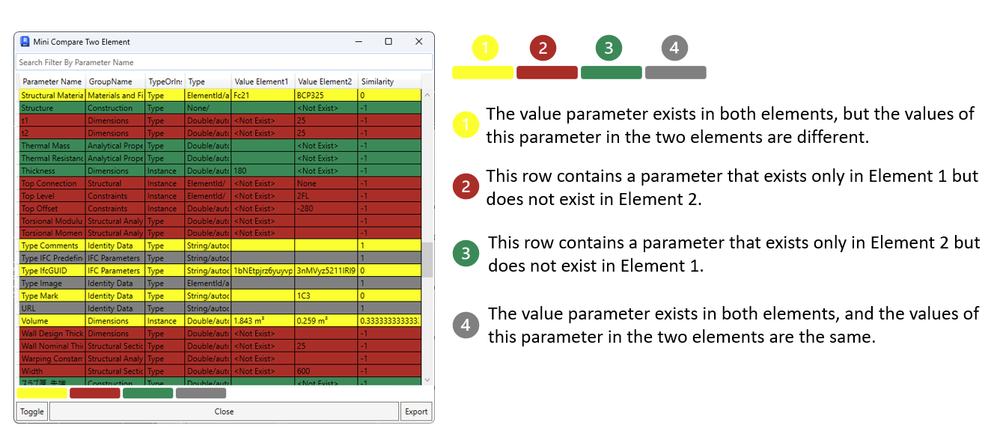

<head>
<meta http-equiv="Content-Type" content="text/html; charset=utf-8">
<link rel="stylesheet" type="text/css" href="bc.css">

</head>

<!---

- compare element
  Chuong Ho
  It's been a while since our last Revit Add-in manager update, but we've got some exciting news to share today!
  I thrilled to introduce a new tool that's now part of the Add-in manager. This tool is a game-changer for both developers and users as it allows you to easily compare differences between two elements. Not only that, but it also uses color to visually highlight all parameter variations, making it incredibly intuitive and user-friendly. Plus, you can view the similarity results of value comparisons between parameters from those two elements
  Stay tuned for more updates and get ready to experience a whole new level of efficiency with our latest addition to the Revit Add-in manager!"
  Open Source : https://github.com/chuongmep/RevitAddInManager
  Documentation : [How to use Compare Parameter Element](https://github.com/chuongmep/RevitAddInManager/wiki/How-to-use-Compare-Parameter-Element)
  #OpenSource #addinmanager #bim #autodesk #revitapi
  /Users/jta/a/doc/revit/tbc/git/a/img/ch_compare_element.png

- Revit database explorer (RDBE)
  https://github.com/NeVeSpl/RevitDBExplorer
  mentioned last year
  https://thebuildingcoder.typepad.com/blog/2022/07/immutable-uniqueid-and-revit-database-explorer.html#3
  The fastest, most advanced, asynchronous Revit database exploration tool for Revit 2021+.**
  Yet another [RevitLookup](https://github.com/jeremytammik/RevitLookup) like tool. RevitLookup was an indispensable tool to work with Revit API for many years. But now, there is a better tool for the job. Let me introduce you to RDBE and its capabilities. RDBE not only allows us to explore database in a more efficient way thanks to querying, but also to modify Revit database through ad hoc scripts written in C#.
  - [query Revit database](#query-revit-database-with-rdq-revit-database-querying)
  - [script Revit database](#script-revit-database-with-rds-revit-database-scripting)
    - [ad hoc SELECT query](#ad-hoc-select-query)
    - [ad hoc UPDATE command](#ad-hoc-update-command)
  - [filterable tree of elements and list of properties and methods](#filterable-tree-of-elements-and-list-of-properties-and-methods)
  - [easy access to Revit API documentation](#easy-access-to-revit-api-documentation)
  - [edit parameter value](#edit-parameter-value)
  - [extensive support for ForgeTypeId](#extensive-support-for-forgetypeid)
  - [better support for Revit Extensible Storage](#better-support-for-revit-extensible-storage)
  - [easier work with Element.Geometry](#easier-work-with-elementgeometry)
  - [dark and light UI themes](#dark-and-light-ui-themes)
  - [more advanced tree view](#more-advanced-tree-view)
  - [snoop Revit events](#snoop-revit-events-with-rem-revit-event-monitor)
  - [snoop updaters](#snoop-updaters)
  You can always use an alternative tool that offers access to Extensible Storage Scheme. (:
  https://github.com/NeVeSpl/RevitDBExplorer#better-support-for-revit-extensible-storage

- Python 2D Geometry Library
  https://forums.autodesk.com/t5/revit-api-forum/gbxml-from-adjacent-conceptual-mass-adjacent-space-missing-small/m-p/12238726#M74138
  shapely
  Manipulation and analysis of geometric objects in the Cartesian plane.
  https://pypi.org/project/shapely/
  https://pypi.org/project/xgbxml/
  https://shapely.readthedocs.io/en/stable/set_operations.html

- Dan North & Associates discuss measuring developer productivity, describing
  [The Worst Programmer I Know](https://dannorth.net/2023/09/02/the-worst-programmer/):
  > Measure productivity by all means...
  Just don’t try to measure the individual contribution of a unit in a complex adaptive system...

twitter:

Exciting new and enhanced tools and libraries to check out: Revit element difference comparison, database explorer RDBE and the Shapely Python 2D geometry library in the @AutodeskRevit #RevitAPI #BIM @DynamoBIM @AutodeskAPS https://autode.sk/elementdiff

Exciting new and enhanced tools and libraries to check out
&ndash; Revit element difference comparison
&ndash; The Revit database explorer RDBE
&ndash; The Shapely Python 2D geometry library
&ndash; Measuring developer productivity...

linkedin:

Exciting new and enhanced tools and libraries to check out: Revit element difference comparison, database explorer RDBE and the Shapely Python 2D geometry library in the #RevitAPI

https://autode.sk/elementdiff

- Revit element difference comparison
- The Revit database explorer RDBE
- The Shapely Python 2D geometry library
- Measuring developer productivity...

#BIM #DynamoBIM #AutodeskAPS #Revit #API #IFC #SDK #Autodesk #AEC #adsk

the [Revit API discussion forum](http://forums.autodesk.com/t5/revit-api-forum/bd-p/160) thread

-->

### Element Diff Compare, Shapely and RDBE

Exciting new and enhanced tools and libraries to check out:

- [Revit element difference comparison](#2)
- [The Revit database explorer RDBE](#3)
- [The Shapely Python 2D geometry library](#4)
- [Shapely finds and fixes a hole](#4.1)
- [Measuring developer productivity](#5)

#### Revit Element Difference Comparison

Chuong Ho announces new functionality enabling highlighting and comparison of differences between Revit database elements in his alternative Revit Add-in Manager:

> It's been a while since our last Revit Add-in manager update, but we've got some exciting news to share today!

> I'm thrilled to introduce a new tool that's now part of the Add-in Manager.
This tool is a game-changer for both developers and users as it allows you to easily compare differences between two elements.
Not only that, but it also uses colour to visually highlight all parameter variations, making it incredibly intuitive and user-friendly.
Plus, you can view the similarity results of value comparisons between parameters from two elements.
Stay tuned for more updates and get ready to experience a whole new level of efficiency with our latest addition to the Revit Add-in manager!

- [Open source](https://github.com/chuongmep/RevitAddInManager)
- Documentation on [how to use Compare Parameter Element](https://github.com/chuongmep/RevitAddInManager/wiki/How-to-use-Compare-Parameter-Element)

 <!-- Pixel Height: 588 Pixel Width: 1,336 -->

#### The Revit Database Explorer RDBE

We already [mentioned](https://thebuildingcoder.typepad.com/blog/2022/07/immutable-uniqueid-and-revit-database-explorer.html#3)
the [Revit database explorer RDBE](https://github.com/NeVeSpl/RevitDBExplorer) last year:

> The fastest, most advanced, asynchronous Revit database exploration tool for Revit 2021+.
Yet another [RevitLookup](https://github.com/jeremytammik/RevitLookup)-like tool.
RevitLookup was indispensable to work with Revit API for many years.
Now, there is a better tool for the job.
Let me introduce RDBE and its capabilities.
RDBE not only allows us to explore database in a more efficient way thanks to querying, but also to modify Revit database through ad-hoc scripts written in C#.

It has undergone further enhancement since then.

[NeVeS](https://github.com/NeVeSpl) points out that you can use this alternative Revit database exploration tool for better access to Extensible Storage Schemata, cf. RDBE's extensive list of features:

- [Query Revit database](#query-revit-database-with-rdq-revit-database-querying)
- [Script Revit database](#script-revit-database-with-rds-revit-database-scripting)
- [Ad-hoc `SELECT` query](#ad-hoc-select-query)
- [Ad-hoc `UPDATE` command](#ad-hoc-update-command)
- [Filterable tree of elements and list of properties and methods](#filterable-tree-of-elements-and-list-of-properties-and-methods)
- [Easy access to Revit API documentation](#easy-access-to-revit-api-documentation)
- [Edit parameter value](#edit-parameter-value)
- [Extensive support for ForgeTypeId](#extensive-support-for-forgetypeid)
- [Better support for Revit Extensible Storage](#better-support-for-revit-extensible-storage)
- [Easier work with `Element.Geometry`](#easier-work-with-elementgeometry)
- [Dark and light UI themes](#dark-and-light-ui-themes)
- [More advanced tree view](#more-advanced-tree-view)
- [Snoop Revit events](#snoop-revit-events-with-rem-revit-event-monitor)
- [Snoop updaters](#snoop-updaters)

#### The Shapely Python 2D Geometry Library

Jake of [Ripcord Engineering](https://forums.autodesk.com/t5/user/viewprofilepage/user-id/3926242) recently
shared a bunch of valuable [Python and gbXML tips](https://thebuildingcoder.typepad.com/blog/2023/07/export-gbxml-and-python-tips.html).
Discussing a solution
to [gbXML from adjacent conceptual mass or space missing small surface](https://forums.autodesk.com/t5/revit-api-forum/gbxml-from-adjacent-conceptual-mass-adjacent-space-missing-small/m-p/12238726),
he now added a pointer
to [Shapely](https://pypi.org/project/shapely/),
a powerful-looking Python 2D geometry library for manipulation and analysis of geometric objects in the Cartesian plane.
For instance, it includes support for 2D Booleans
and [set operations](https://shapely.readthedocs.io/en/stable/set_operations.html).
In this context, the Python [xgbxml library](https://pypi.org/project/xgbxml/) looks
like another very handy tool.

#### Shapely Finds and Fixes a Hole

Jake added: I'm happy to report [Shapely](https://shapely.readthedocs.io/en/stable/index.html) was
able to find a missing 'small' surface (hole) in the 'Mass' demo file attached
to [this thread](https://forums.autodesk.com/t5/revit-api-forum/gbxml-from-adjacent-conceptual-mass-adjacent-space-missing-small/m-p/12253611). To find XY plane holes:

- Make Space surface polygons
  with [shapely.Polygon](https://shapely.readthedocs.io/en/stable/reference/shapely.Polygon.html#shapely.Polygon)
- Make Space polygons from Space surface polygons
  with [shapely.union_all](https://shapely.readthedocs.io/en/stable/reference/shapely.union_all.html#shapely.union_all)
- Make Level surface polygons from Space polygons
  with [shapely.union_all](https://shapely.readthedocs.io/en/stable/reference/shapely.union_all.html#shapely.union_all)
- Ask shapely for
  the ['interiors' attribute](https://shapely.readthedocs.io/en/stable/reference/shapely.Polygon.html#shapely.Polygon) for
  a sequence of rings which bound all existing holes in Level surface polygons.

Next step is to correlate holes with Spaces.
This is the trickier part in my opinion.
Going in plan is to use polygons as defined by Space wall outlines as truth data.
Not sure how this will mesh with current Ripcord Engineering gbxml workflow.
Time will tell.

Many thanks to Jake for the great pointer and nice example.

#### Measuring Developer Productivity

Dealing with programming teams in general, Dan North and Associates share some insights on how to measure developer productivity,
describing [the worst programmer I know](https://dannorth.net/2023/09/02/the-worst-programmer/):

> ... Measure productivity by all means...
Just don’t try to measure the individual contribution of a unit in a complex adaptive system...

