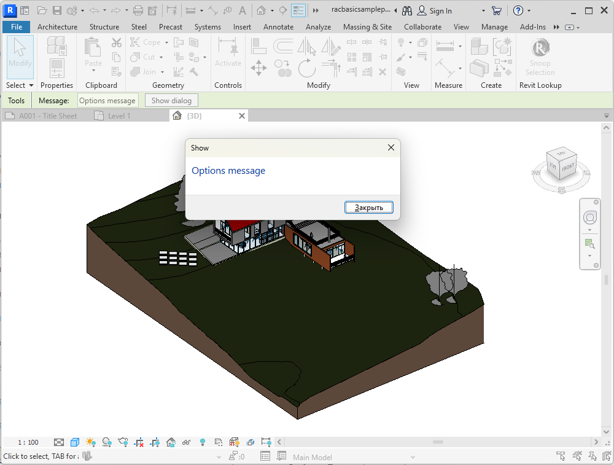
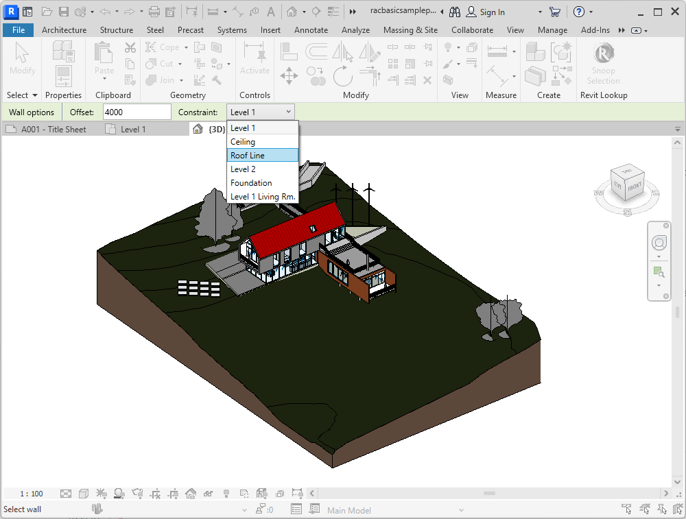

<head>
<meta http-equiv="Content-Type" content="text/html; charset=utf-8">
<link rel="stylesheet" type="text/css" href="bc.css">

</head>

<!---

- OptionsBar
  From: Роман
  Hi Jeremy) I'm back from holiday, and I've written a new article. I think it can be published on the blog, many people will be interested in it.
  Link to the post on LinkedIn: https://www.linkedin.com/feed/update/urn:li:activity:7109513543590289409
  GitHub article: https://github.com/atomatiq/OptionsBar/blob/master/Readme.md
  Raman Karpovich
  Lead Developer
  http://www.atomatiq.io
  +48 517 989 812
  ATOMATIQ SP ZOO. ul. Zygmunta Vogla, 28, lok. 02.63, 02-963 Warsaw, Poland. NIP: 9512571785

- Lijuan Zhu: engines below will be REMOVED on 10/30/2023
  https://autodesk.slack.com/archives/C011QHANM8R/p1695262865665989

twitter:

A reminder of the deprecated @AutodeskAPS DA4R 2018 engine and a great new open-source #RevitAPI productivity enhancement tool using the @AutodeskRevit OptionsBar for frequently used info, utilities, element selection options etc. #BIM @DynamoBIM https://autode.sk/optionsbar

A great new open-source productivity enhancement tool making use of the built-in @AutodeskRevit OptionsBar provides handy access to frequently used information, utilities, element selection options and more, and a reminder of the deprecated @AutodeskAPS DA4R Revit 2018 engine with the #RevitAPI #BIM @DynamoBIM https://autode.sk/optionsbar

A great new open-source productivity enhancement tool making use of the built-in OptionsBar provides handy access to frequently used information, utilities, element selection options and more, and a reminder of the deprecated DA4R Revit 2018 engine...

linkedin:

A reminder of the deprecated #AutodeskAPS DA4R 2018 engine and a great new open-source #Revit #API productivity enhancement tool using the #Autodesk OptionsBar for frequently used info, utilities, element selection options etc.

https://autode.sk/optionsbar

#BIM #DynamoBIM #AutodeskAPS #Revit #API #IFC #SDK #Autodesk #AEC #adsk

the [Revit API discussion forum](http://forums.autodesk.com/t5/revit-api-forum/bd-p/160) thread

-->

### OptionsBar and Bye Bye to DA4R 2018

A great new open-source productivity enhancement tool and a reminder of the deprecated DA4R Revit engine:

- [Open-source OptionsBar](#2)
    - [Introduction](#2.1)
    - [Configuring OptionsBar step by step](#2.2.0)
    - [Use case 1: utilities](#2.3.1)
    - [Use case 2: element selection options](#2.3.2)
    - [Use case 3: marquee](#2.3.3)
    - [Conclusion](#2.4)
- [Bye bye DA4R 2018](#3)
- [Method Draw online SVG editor](#4)

#### Open-Source OptionsBar

Raman Karpovich, aka Роман Карпович, is sharing a great new open-source Revit user interface enhancement enabling programmatic use of the options bar:

- [Post on LinkedIn](https://www.linkedin.com/feed/update/urn:li:activity:7109513543590289409)
- [GitHub article](https://github.com/atomatiq/OptionsBar/blob/master/Readme.md)
- [GitHub repository](https://github.com/atomatiq/OptionsBar/)
- Installers with examples in [Releases](https://github.com/atomatiq/OptionsBar/releases)

Enhance the user experience and boost Revit efficiency with `OptionsBar`, a powerful tool to enhance your workflow;
`OptionsBar` implements a convenient toolbar simplifying the addition of custom tools, options, extra functionality and information to the Revit UI:

- Add custom tools to the ribbon.
- Fine-tune model element parameters in real-time.
- Streamline the process of selecting elements in your model.
- Create unique user interfaces for Revit.

#### Introduction to OptionsBar

[Revit](https://www.autodesk.com/products/revit/overview) is a powerful tool for building design and modelling, and undoubtedly, high efficiency in working with this software is a key aspect for successful projects.
One of the tools that contributes to this efficiency is
the [OptionsBar](https://help.autodesk.com/view/RVT/2024/ENU/?guid=GUID-28BDE98C-E8A9-4C74-8ABC-9DABD13163D9).
This convenient toolbar within Revit has tremendous potential, but not many people are aware of its capabilities and how to configure it.

It offers capabilities that span from adding your own tools on the toolbar to displaying information about the operation of your own add-ins.
However, the Revit API documentation doesn't offer sufficient information on fully harnessing the potential of OptionsBar.

Before we begin customizing the OptionsBar, we'll need to add the necessary dependencies and create a controller to manage this panel.

Technologies Used:

- Language: C#
- UI framework: WPF

#### Configuring OptionsBar Step by Step

Let's delve into the process of configuring OptionsBar and how to do it most efficiently.

#### Step 1: Adding Dependencies

Understanding that the user interface in Revit is implemented using WPF (Windows Presentation Foundation) technology helps us access all the interface elements.
For this, we'll need the `AdWindows.dll` library, which comes with Revit.

To compile the project on any device, let's add a NuGet package to the `.csproj` project file as follows:

<pre class="prettyprint lang-xml">
&lt;ItemGroup&gt;
  &lt;PackageReference Include="Nice3point.Revit.Api.AdWindows" Version="$(RevitVersion).*"/&gt;
&lt;/ItemGroup&gt;
</pre>

#### Step 2: Creating a Controller

To control OptionsBar, we'll need a controller that handles its display and hiding.
To access the Revit ribbon and OptionsBar, we'll use the static property `ComponentManager.Ribbon` from the `AdWindows.dll` library that we included in the previous step.

The process of configuring OptionsBar can be divided into the following stages:

1. Finding the built-in panel.
2. Creating a custom panel.
3. Hiding/showing the built-in and custom panels.

It's important to note that we don't remove or replace the built-in OptionsBar panel to avoid disrupting Revit's functionality.
Instead, we simply hide it and display our custom panel when necessary.

Let's take a look at a code example that allows displaying and hiding the custom panel:

<pre class="prettyprint lang-cs">
public static class RibbonController
{
  private static readonly Grid RootGrid;
  private static ContentPresenter _panelPresenter;
  private static readonly FrameworkElement InternalToolPanel;

  static RibbonController()
  {
    RootGrid = VisualUtils.FindVisualParent&lt;Grid&gt;(ComponentManager.Ribbon, "rootGrid");
    if (RootGrid is null) throw new InvalidOperationException("Cannot find root grid in Revit UI");

    InternalToolPanel = VisualUtils.FindVisualChild&lt;DialogBarControl&gt;(RootGrid, string.Empty);
    if (InternalToolPanel is null) throw new InvalidOperationException("Cannot find internal tool panel in Revit UI");
  }

  public static void ShowOptionsBar(FrameworkElement content)
  {
    if (_panelPresenter is not null)
    {
      _panelPresenter.Content = content;
      _panelPresenter.Visibility = Visibility.Visible;
      InternalToolPanel.Height = 0;
      return;
    }

    _panelPresenter = CreateOptionsBar();
    _panelPresenter.Content = content;

    InternalToolPanel.Height = 0;
  }

  public static void HideOptionsBar()
  {
    if (_panelPresenter is null) return;

    _panelPresenter.Content = null;
    _panelPresenter.Visibility = Visibility.Collapsed;

    InternalToolPanel.Height = 26;
  }

  private static ContentPresenter CreateOptionsBar()
  {
    const int panelRow = 2;

    RootGrid.RowDefinitions.Insert(2, new RowDefinition
    {
      Height = new GridLength(1, GridUnitType.Auto)
    });

    foreach (UIElement child in RootGrid.Children)
    {
      var row = Grid.GetRow(child);
      if (row &gt; 1) Grid.SetRow(child, row + 1);
    }

    var panelPresenter = new ContentPresenter();
    Grid.SetRow(panelPresenter, panelRow);
    RootGrid.Children.Add(panelPresenter);

    return panelPresenter;
  }
}
</pre>

In the example, only public properties of the Revit API and system methods of WPF are used.
Interaction with the ribbon is implemented with the `ShowOptionsBar()` and `HideOptionsBar()` methods.
The `ShowOptionsBar()` method takes any FrameworkElement, which will be displayed to the user.

#### Step 3: Creating a User Interface

To create a user interface for OptionsBar, we'll use the MVVM (Model-View-ViewModel) pattern and the WPF (Windows Presentation Foundation) framework.

For example, let's consider a simple panel layout with a text field and a dropdown list:

<!-- https://github.com/Nice3point/OptionsBar/assets/20504884/3932ef5f-82e0-4b59-bc61-b95aef6199c8 -->

<pre class="prettyprint lang-xml">
&lt;StackPanel
    x:Class="OptionsBar.Views.OptionsView"
    xmlns="http://schemas.microsoft.com/winfx/2006/xaml/presentation"
    xmlns:x="http://schemas.microsoft.com/winfx/2006/xaml"
    xmlns:mc="http://schemas.openxmlformats.org/markup-compatibility/2006"
    xmlns:d="http://schemas.microsoft.com/expression/blend/2008"
    xmlns:viewModels="clr-namespace:OptionsBar.ViewModels"
    d:DataContext="{d:DesignInstance Type=viewModels:OptionsViewModel}"
    mc:Ignorable="d"
    Background="#FFE5F0D7"
    Orientation="Horizontal"
    Height="26"
    d:DesignWidth="430"&gt;
  &lt;TextBlock
    Margin="10 0 0 0"
    Text="Wall options"
    VerticalAlignment="Center" /&gt;
  &lt;Border
    Width="3"
    BorderThickness="1 0"
    BorderBrush="Azure"
    Background="Gray"
    Margin="10 0" /&gt;
  &lt;TextBlock
    Text="Offset: "
    VerticalAlignment="Center" /&gt;
  &lt;TextBox
    Width="100"
    Margin="10 1 0 1"
    VerticalContentAlignment="Center"
    Text="{Binding Offset, UpdateSourceTrigger=PropertyChanged}" /&gt;
  &lt;TextBlock
    Text="Constraint: "
    Margin="10 0 0 0"
    VerticalAlignment="Center" /&gt;
  &lt;ComboBox
    Width="100"
    Margin="10 1 0 1"
    VerticalContentAlignment="Center"
    SelectedIndex="0"
    ItemsSource="{Binding Constraints}" /&gt;
&lt;/StackPanel&gt;
</pre>

Sample code for the ViewModel:

<pre class="prettyprint lang-cs">
public partial class OptionsViewModel : ObservableObject
{
  [ObservableProperty] private double _offset;
  [ObservableProperty] private string[] _constraints;
}
</pre>

The layout is no different from regular WPF applications, but the root element will be a container like StackPanel, Grid, and so on, since OptionBar is embedded in the Revit UI.

#### Use Cases

OptionsBar provides endless possibilities for streamlining the workflow in Revit.
Let's explore some of the most popular use cases:

#### Use Case 1: Utilities

OptionsBar can be used to add custom tools that can be conveniently placed on the toolbar.
This is especially useful when creating a separate window is unnecessary.

<!-- https://github.com/Nice3point/OptionsBar/assets/20504884/3932ef5f-82e0-4b59-bc61-b95aef6199c8 -->

#### Use Case 2: Element Selection Options

This scenario covers situations where a user is working with a model in Revit and needs to select a specific element for further editing.
For more convenient and intuitive parameter customization, you can use OptionsBar instead of creating additional windows.

Example: Suppose you have a plugin that allows users to adjust the top offset of a wall. Let's see how to arrange all the tools on the OptionsBar panel.

<!-- https://github.com/Nice3point/OptionsBar/assets/20504884/65a508ce-2f9c-414d-80b3-f996b5e679d6 -->

- Step 1: Adding OptionsBar to the Revit Ribbon

  The first step in this scenario is to set up OptionsBar for display on the Revit ribbon.
  You can create your own view for OptionsBar with parameters that the user can customize.

  Example code using the MVVM pattern:

<pre class="prettyprint lang-cs">
  private OptionsViewModel SetupOptionsBar()
  {
    var options = new OptionsViewModel
    {
      Offset = 0,
      Constraints = Document.EnumerateInstances&lt;Level&gt;(BuiltInCategory.OST_Levels).Select(level => level.Name).ToArray()
    };

    var view = new OptionsView(options);
    RibbonController.ShowOptionsBar(view);
    return options;
  }
</pre>

- Step 2: Selecting an Element

  After configuring OptionsBar, the user selects an element in the model with which they want to work.
  This could be, for example, selecting a wall to adjust the offset.

  Example code for element selection:

<pre class="prettyprint lang-cs">
  private Wall PickWall()
  {
    var selectionConfiguration = new SelectionConfiguration().Allow.Element(selection => selection is Wall);
    var reference = UiDocument.Selection.PickObject(ObjectType.Element, selectionConfiguration.Filter, "Select wall");
    return reference.ElementId.ToElement&lt;Wall&gt;(Document);
  }
</pre>

- Step 3: Adjusting Element Parameters

  Now that the user has selected an element and OptionsBar is configured, you can start adjusting the element's parameters.
  We'll take the offset value from the ViewModel entered by the user and set it to the wall parameter.

  Example code for adjusting element parameters:

<pre class="prettyprint lang-cs">
  private void ModifyWall(Wall wall, OptionsViewModel options)
  {
    using var transaction = new Transaction(Document);
    transaction.Start("Set offset");
    wall.GetParameter(BuiltInParameter.WALL_TOP_OFFSET)!.Set(options.Offset);
    transaction.Commit();
  }
</pre>

- Step 4: Restoring the Revit Ribbon

  After completing the element parameter configuration, it's important to hide OptionsBar and restore the normal state of the Revit ribbon.
  To do this, add a `finally` block after calling all the methods.

<pre class="prettyprint lang-cs">
  public override void Execute()
  {
    try
    {
      var options = SetupOptionsBar();
      var wall = PickWall();
      ModifyWall(wall, options);
    }
    catch (OperationCanceledException)
    {
      // ignored
    }
    finally
    {
      RibbonController.HideOptionsBar();
    }
  }
</pre>

  This scenario allows users to quickly and conveniently customize the parameters of model elements without the need to open additional windows or perform extra actions.
  OptionsBar makes the process of editing elements more intuitive and efficient.

#### Use Case 3: Marquee

Want something unusual? A marquee can add excitement to your mundane modeling routine.

<!-- https://github.com/Nice3point/OptionsBar/assets/20504884/9427569b-1cce-41c8-a1f5-e88bea4c8683 -->

#### Conclusion

OptionsBar is a powerful tool in Revit that allows you to optimize your workflow and make it more efficient.
Don't limit yourself to the described use cases — experiment, create your unique solutions, and make working in Revit even more productive.

#### Bye Bye DA4R 2018

The Autodesk Platform Services APS consists of several distinct components working together.

One of them is the viewer, which works with a streamlined generic optimised viewing data format, stripped of much of the original information such as constraints and detailed domain-specific information present in the seed CAD files generated by model authoring tools such as AutoCAD, Inventor and Revit.

Another important component is the Design Automation API DA that enables processing, generation and manipulation of the seed CAD files using so-called engines running on virtual machines in the cloud.

Here is a quick reminder that the following engines will be REMOVED on October 30, 2023:

- Autodesk.AutoCAD.20_1
- Autodesk.AutoCAD.21
- Autodesk.AutoCAD.22
- Autodesk.Inventor.2018
- Autodesk.Inventor.22
- Autodesk.Revit.2018

For more information on this, please refer to
the [APS Engine Lifecycle Policy](https://aps.autodesk.com/en/docs/design-automation/v3/developers_guide/engine-lifecycle/).

In general, the following rules apply:

- Engine versions are supported for 4 calendar years after the initial release of the corresponding desktop product.
- After 4 years, the engine version becomes deprecated, but remains available for an additional 2 years and then removed.
- A deprecated engine version can no longer be referenced in new appbundles and activities, but all existing references continue to work.
- All attempts to reference a removed engine version will fail.

So, in the case of Revit, please take heed if you are still using the Revit 2018 engine in DA4R and update to a more recent version before the end of next month.

#### Method Draw Online SVG Editor

I keep looking for a handy online vector editor that enables precise measurement, e.g., for creating a simple 2D work sketch with exact millimetre dimensions for a carpentry project.

I found a new likely candidate now, [Method Draw](https://editor.method.ac):

> [Method Draw](https://editor.method.ac) is a simple <a href="https://github.com/methodofaction/Method-Draw">open source</a> vector drawing application. Method Draw was forked from <a href="https://github.com/SVG-Edit/svgedit">SVG-Edit</a> several years ago with the goal of improving and modernizing the interface.

> At this time (2021), the author (<a href="http://method.ac/writing">Mark MacKay</a>) is working on improving stability and improving the codebase, which contains a lot of legacy practices. The goal is to create a vector editor suitable for simple graphic design tasks.

I'll let you know how I get on with that.
If you have a recommendation, please let me know.
Thx!

