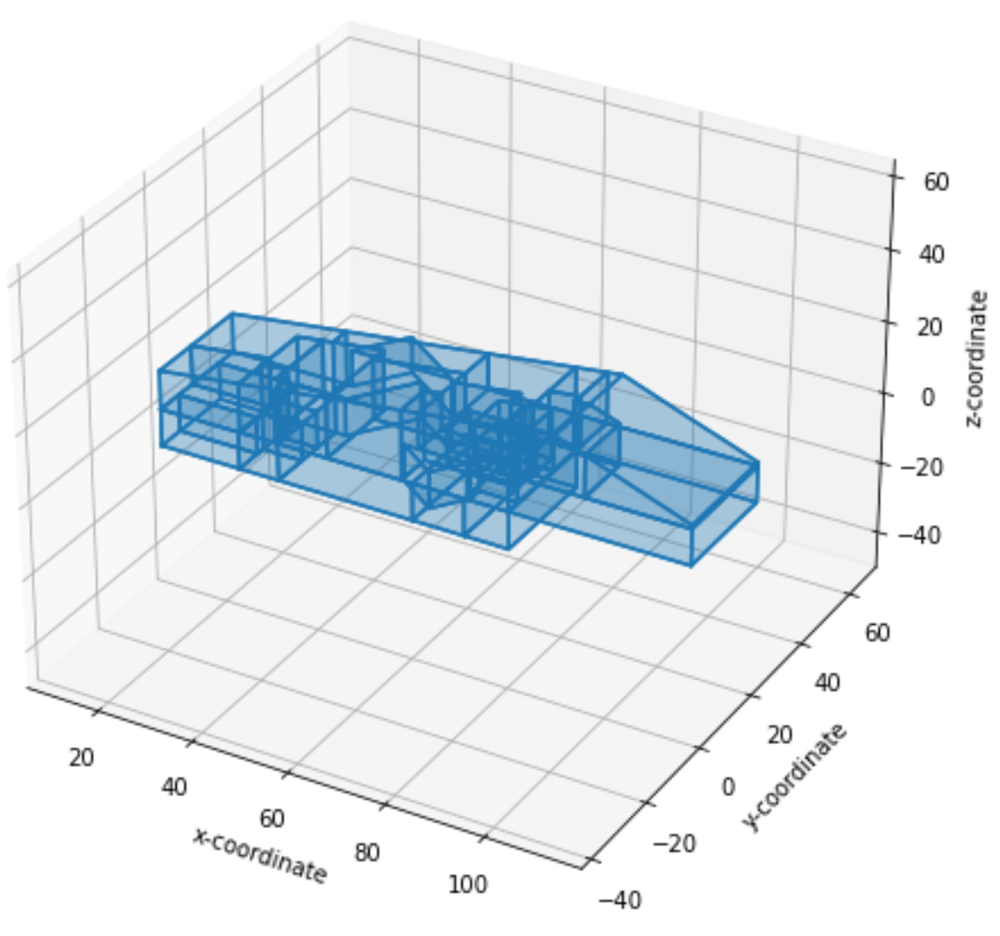

<head>
<meta http-equiv="Content-Type" content="text/html; charset=utf-8">
<link rel="stylesheet" type="text/css" href="bc.css">

</head>

<!---

- /Users/jta/a/doc/revit/tbc/git/a/doc/gbxml_small_surface_solution_whole_building.pdf

- LLaVA: Large Language and Vision Assistant
  https://llava.hliu.cc/
  Checkout opensource vision assistant >>
  Best part is it is open source and can be run locally with descent enough hardware. Needs linux and an rtx.
  But non-Commercial
  Google Glass but more helpful perhaps :deploy-parrot:
  Identify plants, tools in a workspace, even run basic support (I know some in my family who could use some help being told where to click on the computer screen sometimes)
  I'm sure someone will train a commercial-allowed equivalent

- Text to video ($36M in funding so far, and they call themselves ‘lean’): https://moonvalley.ai
  moonvalley.aimoonvalley.ai
  > Animate your ideas... a machine learning model that can create visually stunning, high definition videos & animation from simple text prompts. (1 MB)

- Detect objects in images
  Did you know that you could run neural networks entirely in the browser without contacting a server? This fun demo shows you how.
  DETR (End-to-End Object Detection) model with ResNet-50 backbone
  I provided it with a picture of me eating churros ([^](/Users/jta/Pictures/2023/2023-10-10_garnatilla/16.jpg)), it it rapidly identified the following objects:
  jeremy_eating_churros.png

twitter:

A mighty beautiful #Python solution to fix gaps in building geometry, render @gbXML BIM model, add missing surfaces and verify waterproof with the #RevitAPI @AutodeskRevit #BIM @DynamoBIM @AutodeskAPS https://autode.sk/fixgaps

A mighty beautiful Python solution for fixing gaps in the building geometry and new AI-related titbits
&ndash; Fixing building geometry gaps
&ndash; Open and render gbXML BIM model
&ndash; Identify gaps in geometry
&ndash; Add missing surfaces
&ndash; Verify waterproof
&ndash; LLaVA large language and vision assistant
&ndash; Moonvalley text to video
&ndash; DETR model detects objects in images...

linkedin:

A mighty beautiful #Python solution to fix gaps in building geometry, render @gbXML BIM model, add missing surfaces and verify waterproof with the #RevitAPI @AutodeskRevit #BIM @DynamoBIM @AutodeskAPS

https://autode.sk/fixgaps

- Fixing building geometry gaps
- Open and render gbXML BIM model
- Identify gaps in geometry
- Add missing surfaces
- Verify waterproof
- LLaVA large language and vision assistant
- Moonvalley text to video
- DETR model detects objects in images...

#BIM #DynamoBIM #AutodeskAPS #Revit #API #IFC #SDK #Autodesk #AEC #adsk

the [Revit API discussion forum](http://forums.autodesk.com/t5/revit-api-forum/bd-p/160) thread

-->

### Xgbxml Fixes Building Geometry Gaps

As we approach the weekend, I finally get around to sharing a mighty beautiful Python solution for fixing gaps in the building geometry, followed by a bunch of little AI-related titbits:

- [Fixing building geometry gaps](#2)
    - [Setup](#2.1)
    - [Open and render gbXML BIM model](#2.2)
    - [Identify gaps in geometry](#2.3)
    - [Add missing surfaces](#2.4)
    - [Second gap](#2.5)
    - [Third gap](#2.6)
    - [Verify waterproof](#2.7)
    - [Save model](#2.8)
    - [Low precision and sliver area threshold](#2.9)
- [LLaVA large language and vision assistant](#3)
- [Moonvalley text to video](#4)
- [DETR model detects objects in images](#5)

#### Fixing Building Geometry Gaps

Many developers have encountered issues with gaps in the building geometry caused by the relatively low precision used by Revit when tessellating surfaces.
Some of them can be addressed by adding appropriate fuzz and adjusting neighbouring vertices to better match and line up.
However, sometimes a gap remains.

Jake of [Ripcord Engineering](https://forums.autodesk.com/t5/user/viewprofilepage/user-id/3926242) recently
shared a bunch of valuable [Python and gbXML tips](https://thebuildingcoder.typepad.com/blog/2023/07/export-gbxml-and-python-tips.html) and followed up with a pointer
to [Shapely](https://pypi.org/project/shapely/)
to [find and fix a gap in the building geometry](https://thebuildingcoder.typepad.com/blog/2023/09/element-diff-compare-shapely-and-rdbe.html#4).

He followed up with this impressive and beautiful documentation of
an entire gbXML [small surface solution addressing the whole building](doc/gbxml_small_surface_solution_whole_building.pdf) that I think warrants an entire blog post of its own, so here goes, addressing the issue
on [gbXML from adjacent conceptual mass/adjacent space missing small surface](https://forums.autodesk.com/t5/revit-api-forum/gbxml-from-adjacent-conceptual-mass-adjacent-space-missing-small/m-p/12232100).

#### Setup

Import packages:

<pre class="prettyprint">
# import packages
from xgbxml import get_parser
from xgbxml import geometry_functions, gbxml_functions, render_functions from lxml import etree
import matplotlib.pyplot as plt
import copy
import math
from uuid import uuid4
</pre>

Generate parser:

<pre class="prettyprint">
# uses xgbxml to generate a lxml parser to read gbXML version 0.37
parser=get_parser(version='0.37')
</pre>

#### Open and Render gbXML BIM Model

Open file and render *23-013 WH Swan Hill_Mass_23-08-30.xml*:

<pre class="prettyprint">
# opens the file using the custom lxml parser
fp='23-013 WH Swan Hill_Mass_23-08-30.xml' tree=etree.parse(fp,parser) gbxml=tree.getroot()
# renders the Campus element
ax=gbxml.Campus.render()
ax.figure.set_size_inches(8, 8)
ax.set_title(fp)
plt.show()
</pre>

Campus rendering

#### Identify Gaps in Geometry

Identify all gaps in the surfaces of the building;
this uses a new method of the `Building` element, `get_gaps_in_surfaces`:

<pre class="prettyprint">
# identify gaps in surfaces of building
gaps=gbxml.Campus.Building.get_gaps_in_surfaces()
gaps
</pre>

The result is a list of dictionaries. Each dictionary contains two items:

- `space_ids`: a list of the ids of the adjacent Spaces
- `shell`: a list of the coordinates of the exterior polygon of the gaps

Here, the first and third items appear to be triangle gaps with only one adjacent space &ndash; so these are exterior gaps also adjacent to the outside.

<pre class="prettyprint">
[{'space_ids': ['aim2197'],
    'shell': [
      (72.2287629, -0.3141381, 0.0),
      (72.2287629, -0.4999998, 0.0),
      (72.0986211, -0.4999998, 0.0),
      (72.2287629, -0.3141381, 0.0)]},
  {'space_ids': ['aim2553', 'aim7413'],
    'shell': [(80.2291667, 14.5625, 10.0),
      (80.0208333, 14.5625, 10.0),
      (80.0208333, 16.020833, 10.0),
      (80.2291667, 16.020833, 10.0),
      (80.2291667, 14.5625, 10.0)]},
  {'space_ids': ['aim6674'],
    'shell': [(72.2287629, -0.4999998, 10.0),
      (72.2287629, -0.3141381, 10.0),
      (72.0986211, -0.4999998, 10.0),
      (72.2287629, -0.4999998, 10.0)]}]
</pre>

#### Add Missing Surfaces

Adding the missing surfaces to the building; first gap:

<pre class="prettyprint">
# print gap
gap=gaps[0]
gap
</pre>

Result:

<pre class="prettyprint">
{'space_ids': ['aim2197'],
  'shell': [(72.2287629, -0.3141381, 0.0),
    (72.2287629, -0.4999998, 0.0),
    (72.0986211, -0.4999998, 0.0),
    (72.2287629, -0.3141381, 0.0)]}
</pre>

Fix:

<pre class="prettyprint">
# add Surface
# surface element
surface=gbxml.Campus.add_Surface(
  id=str(uuid4()),
  surfaceType=None, # to do
  constructionIdRef=None, # to do
  exposedToSun=None # to do
)
# adjacent space id child element
for space_id in gap['space_ids']:
  surface.add_AdjacentSpaceId(
    spaceIdRef=space_id )
# planar geometry child element
planar_geometry = surface.add_PlanarGeometry()
planar_geometry.set_shell(gap['shell'])
# check
print(surface.tostring())
</pre>

Result:

<pre class="prettyprint">
&lt;Surface xmlns="http://www.gbxml.org/schema" id="f20a7dbc-94d5-43ee-bf64-748c3e61658b"&gt;
  &lt;AdjacentSpaceId spaceIdRef="aim2197"/&gt;
  &lt;PlanarGeometry&gt;
    &lt;PolyLoop&gt;
      &lt;CartesianPoint&gt;
        &lt;Coordinate&gt;72.2287629&lt;/Coordinate&gt;
        &lt;Coordinate&gt;-0.3141381&lt;/Coordinate&gt;
        &lt;Coordinate&gt;0.0&lt;/Coordinate&gt;
      &lt;/CartesianPoint&gt;
      &lt;CartesianPoint&gt;
        &lt;Coordinate&gt;72.2287629&lt;/Coordinate&gt;
        &lt;Coordinate&gt;-0.4999998&lt;/Coordinate&gt;
        &lt;Coordinate&gt;0.0&lt;/Coordinate&gt;
      &lt;/CartesianPoint&gt;
      &lt;CartesianPoint&gt;
        &lt;Coordinate&gt;72.0986211&lt;/Coordinate&gt;
        &lt;Coordinate&gt;-0.4999998&lt;/Coordinate&gt;
        &lt;Coordinate&gt;0.0&lt;/Coordinate&gt;
      &lt;/CartesianPoint&gt;
    &lt;/PolyLoop&gt;
  &lt;/PlanarGeometry&gt;
&lt;/Surface&gt;
</pre>

#### Second Gap

Second gap:

<pre class="prettyprint">
# print gap
gap=gaps[1]
gap
</pre>

Result:

<pre class="prettyprint">
{'space_ids': ['aim2553', 'aim7413'],
  'shell':
    [(80.2291667, 14.5625, 10.0),
    (80.0208333, 14.5625, 10.0),
    (80.0208333, 16.020833, 10.0),
    (80.2291667, 16.020833, 10.0),
    (80.2291667, 14.5625, 10.0)]}
</pre>

Fix:

<pre class="prettyprint">
# add Surface
# surface element
surface=gbxml.Campus.add_Surface(
  id=str(uuid4()),
  surfaceType=None, # to do
  constructionIdRef=None, # to do
  exposedToSun=None # to do
  )
# adjacent space id child element
for space_id in gap['space_ids']:
  surface.add_AdjacentSpaceId(
    spaceIdRef=space_id
    )
# planar geometry child element
planar_geometry = surface.add_PlanarGeometry()
planar_geometry.set_shell(gap['shell'])
# check
print(surface.tostring())
</pre>

Result:

<pre class="prettyprint">
&lt;Surface xmlns="http://www.gbxml.org/schema" id="407a76aa-3287-4b5e-ac62-0440fb629f72"&gt;
  &lt;AdjacentSpaceId spaceIdRef="aim2553"/&gt;
  &lt;AdjacentSpaceId spaceIdRef="aim7413"/&gt;
  &lt;PlanarGeometry&gt;
    &lt;PolyLoop&gt;
      &lt;CartesianPoint&gt;
        &lt;Coordinate&gt;80.2291667&lt;/Coordinate&gt;
        &lt;Coordinate&gt;14.5625&lt;/Coordinate&gt;
        &lt;Coordinate&gt;10.0&lt;/Coordinate&gt;
      &lt;/CartesianPoint&gt;
      &lt;CartesianPoint&gt;
        &lt;Coordinate&gt;80.0208333&lt;/Coordinate&gt;
        &lt;Coordinate&gt;14.5625&lt;/Coordinate&gt;
        &lt;Coordinate&gt;10.0&lt;/Coordinate&gt;
      &lt;/CartesianPoint&gt;
      &lt;CartesianPoint&gt;
        &lt;Coordinate&gt;80.0208333&lt;/Coordinate&gt;
        &lt;Coordinate&gt;16.020833&lt;/Coordinate&gt;
        &lt;Coordinate&gt;10.0&lt;/Coordinate&gt;
      &lt;/CartesianPoint&gt;
      &lt;CartesianPoint&gt;
        &lt;Coordinate&gt;80.2291667&lt;/Coordinate&gt;
        &lt;Coordinate&gt;16.020833&lt;/Coordinate&gt;
        &lt;Coordinate&gt;10.0&lt;/Coordinate&gt;
      &lt;/CartesianPoint&gt;
    &lt;/PolyLoop&gt;
  &lt;/PlanarGeometry&gt;
&lt;/Surface&gt;
</pre>

#### Third Gap

<pre class="prettyprint">
# print gap
gap=gaps[2]
gap
</pre>

Result:

<pre class="prettyprint">
{'space_ids': ['aim6674'],
  'shell':
    [(72.2287629, -0.4999998, 10.0),
    (72.2287629, -0.3141381, 10.0),
    (72.0986211, -0.4999998, 10.0),
    (72.2287629, -0.4999998, 10.0)]}
</pre>

Fix:

<pre class="prettyprint">
# add Surface
# surface element
surface=gbxml.Campus.add_Surface(
  id=str(uuid4()),
  surfaceType=None, # to do
  constructionIdRef=None, # to do
  exposedToSun=None # to do
  )
# adjacent space id child element
for space_id in gap['space_ids']:
  surface.add_AdjacentSpaceId(
    spaceIdRef=space_id
    )
# planar geometry child element
planar_geometry = surface.add_PlanarGeometry()
planar_geometry.set_shell(gap['shell'])
# check
print(surface.tostring())
</pre>

Result:

<pre class="prettyprint">
&lt;Surface xmlns="http://www.gbxml.org/schema" id="96ad28f6-56fb-42b8-94d0-93c73d398866"&gt;
  &lt;AdjacentSpaceId spaceIdRef="aim6674"/&gt;
  &lt;PlanarGeometry&gt;
    &lt;PolyLoop&gt;
      &lt;CartesianPoint&gt;
        &lt;Coordinate&gt;72.2287629&lt;/Coordinate&gt;
        &lt;Coordinate&gt;-0.4999998&lt;/Coordinate&gt;
        &lt;Coordinate&gt;10.0&lt;/Coordinate&gt;
      &lt;/CartesianPoint&gt;
      &lt;CartesianPoint&gt;
        &lt;Coordinate&gt;72.2287629&lt;/Coordinate&gt;
        &lt;Coordinate&gt;-0.3141381&lt;/Coordinate&gt;
        &lt;Coordinate&gt;10.0&lt;/Coordinate&gt;
      &lt;/CartesianPoint&gt;
      &lt;CartesianPoint&gt;
        &lt;Coordinate&gt;72.0986211&lt;/Coordinate&gt;
        &lt;Coordinate&gt;-0.4999998&lt;/Coordinate&gt;
        &lt;Coordinate&gt;10.0&lt;/Coordinate&gt;
      &lt;/CartesianPoint&gt;
    &lt;/PolyLoop&gt;
  &lt;/PlanarGeometry&gt;
&lt;/Surface&gt;
</pre>

#### Verify Waterproof

Recheck gaps in surfaces of building; there should now be no gaps.

<pre class="prettyprint">
# identify gaps in surfaces of building
gaps=gbxml.Campus.Building.get_gaps_in_surfaces()
gaps
</pre>

Result:

<pre class="prettyprint">
[]
</pre>

#### Save Model

Save the updated gbxml file.

<pre class="prettyprint">
# writes the gbXML etree to a local file
tree.write('23-013 WH Swan Hill_Mass_23-08-30-UPDATED.xml', pretty_print=True)
</pre>

#### Low Precision and Sliver Area Threshold

Regarding:

> ... issues with gaps in the building geometry caused by the relatively low precision used by Revit when tessellating surfaces.

Based on experience over time at Ripcord, 'low precision' appears directly related to an area threshold rather than a length threshold.
What might be considered 'sliver' surfaces export OK.
But once 'sliver' surfaces fall under the area threshold, whatever it is, the surface is not exported.

It is likely that direct control of the area threshold would offer operators relief.
Inability to control the area threshold creates a level of operator compensation that likely compels most to abandon value added analytical tasks.

Many thanks again to Jake for this extremely powerful solution and
his [beautiful documentation](doc/gbxml_small_surface_solution_whole_building.pdf).

#### LLaVA Large Language and Vision Assistant

The [LLaVA Large Language and Vision Assistant](https://llava.hliu.cc/) is
open source with a non-commercial license and can be run locally with decent enough hardware.
Needs linux and an rtx.
Like Google Glass but more helpful perhaps.
Identify plants, tools in a workspace, even run basic support, e.g., provide help on where to click on the computer screen etc.
Presumably someone will soon train a commercial-allowed equivalent.

#### Moonvalley Text to Video

[Moonvalley](https://moonvalley.ai) is a text-to-video startup
($36M in funding so far, and they call themselves ‘lean’):

> Animate your ideas... a machine learning model that can create visually stunning, high definition videos and animation from simple text prompts.

#### DETR Model Detects Objects in Images

Did you know that you could run neural networks entirely in the browser without contacting a server?

The latest StackOverflow newsletter pointed me to a fun demo that shows you how.
I uploaded a picture and tested it.
Unfortunately, I lost the link and cannot find it anymore.
All I have now is the note I made of the underlying tool, and the result of running it on a photo I had at hand:

- DETR (End-to-End Object Detection) model with ResNet-50 backbone

I provided it with a picture of me eating churros ([^](/Users/jta/Pictures/2023/2023-10-10_garnatilla/16.jpg)) and
it rapidly (in a handful of seconds) identified the following objects:

I find that pretty impressive.

Exciting times... oh, dear, and deeply troubling, too... thinking of all the conflicts currently blooming...

